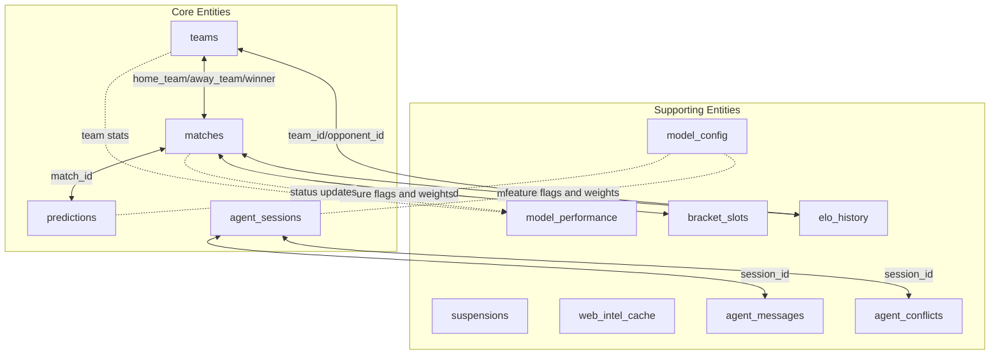
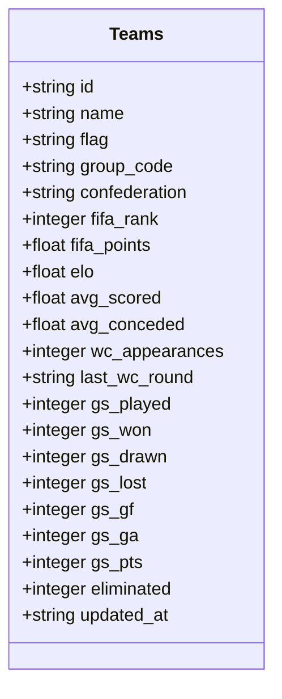
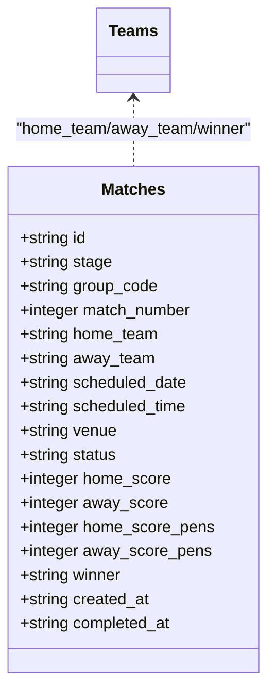
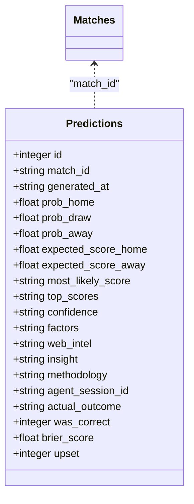
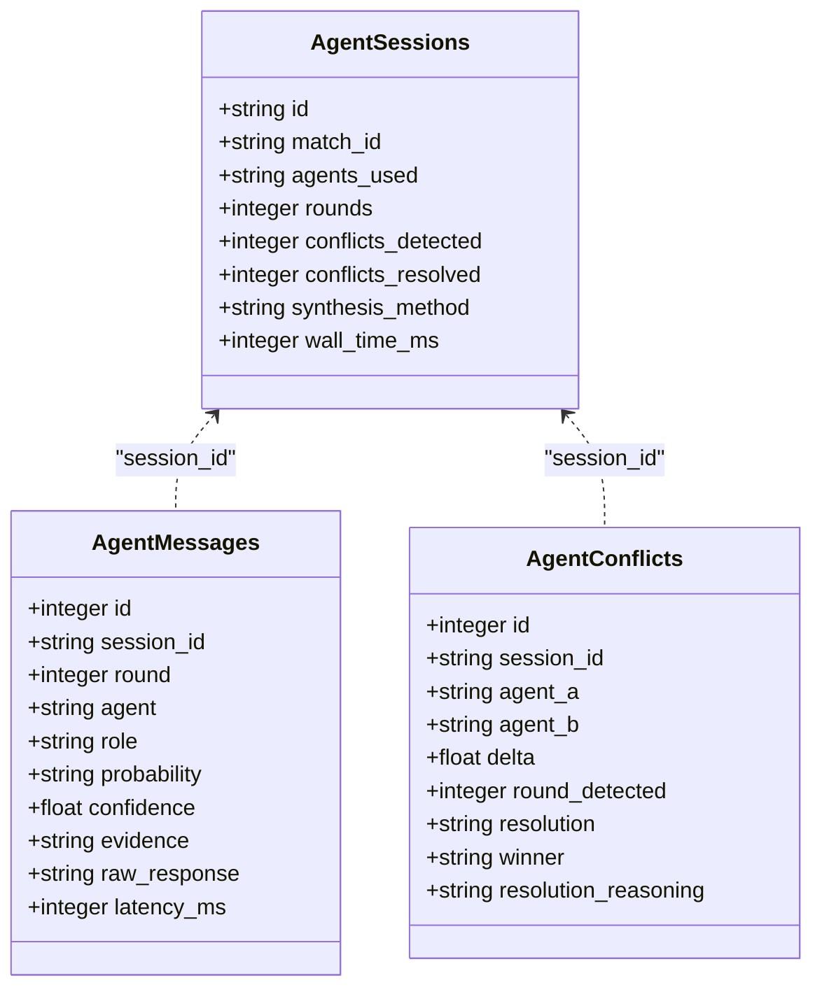
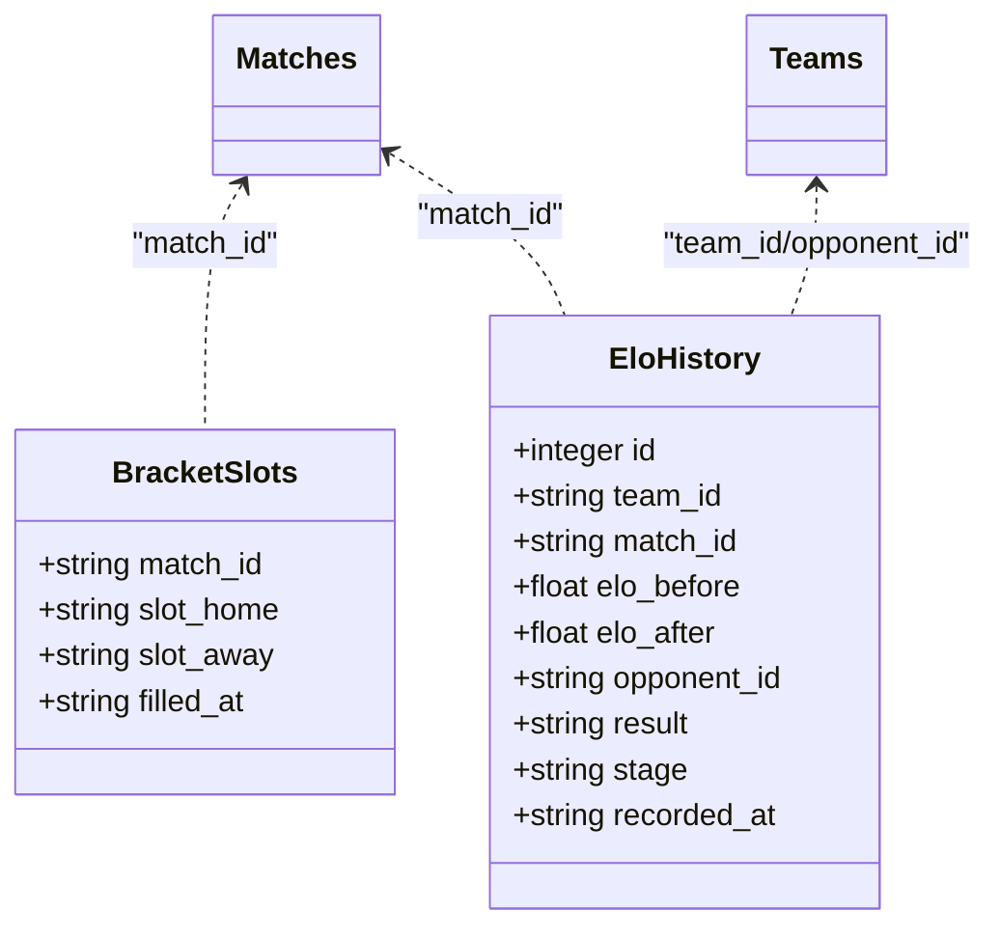
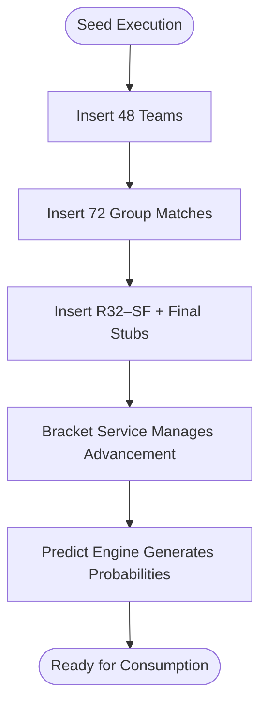
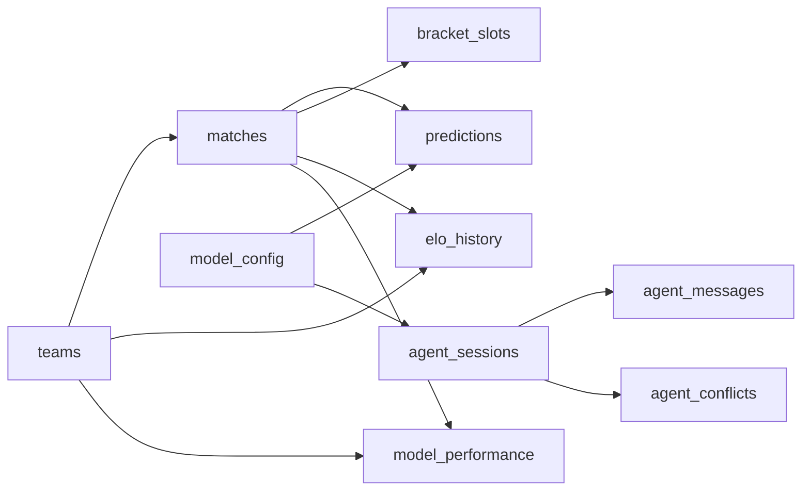

# Entity Relationships

<cite>
**Referenced Files in This Document**
- [db.js](file://backend/database/db.js)
- [seed.js](file://backend/database/seed.js)
- [teams.js](file://backend/data/teams.js)
- [predictionEngine.js](file://backend/services/predictionEngine.js)
- [bracketService.js](file://backend/services/bracketService.js)
- [agentFramework.js](file://backend/services/agents/agentFramework.js)
- [orchestratorAgent.js](file://backend/services/agents/orchestratorAgent.js)
</cite>

## Table of Contents
1. [Introduction](#introduction)
2. [Project Structure](#project-structure)
3. [Core Components](#core-components)
4. [Architecture Overview](#architecture-overview)
5. [Detailed Component Analysis](#detailed-component-analysis)
6. [Dependency Analysis](#dependency-analysis)
7. [Performance Considerations](#performance-considerations)
8. [Troubleshooting Guide](#troubleshooting-guide)
9. [Conclusion](#conclusion)

## Introduction
This document provides comprehensive entity relationship documentation for the WC26-Qwen-Qoder database schema. It details how teams, matches, predictions, and agent sessions relate to each other, including primary and foreign key constraints, referential integrity rules, cascade behaviors, and the hierarchical progression from teams through matches to predictions. It also explains the multi-agent session tracking relationships, the 48-team dataset connection to 104-knockout fixtures and prediction history, and the bracket progression tracking and ELO rating history relationships. Finally, it includes common query patterns and join operations across these entities.

## Project Structure
The WC26-Qwen-Qoder system organizes its database schema around four core entities:
- Teams: 48 national teams participating in the 2026 World Cup
- Matches: All group-stage and knockout-stage fixtures
- Predictions: Pre-match probabilistic forecasts for each match
- Agent Sessions: Multi-agent orchestration and conflict resolution records

Supporting tables include:
- Model performance tracking
- Bracket slots and third-place tracking
- ELO rating history
- Suspensions
- Web intelligence cache
- Model configuration weights
- Agent messages and conflicts

**Diagram sources**
- [db.js:23-209](file://backend/database/db.js#L23-L209)

**Section sources**
- [db.js:23-209](file://backend/database/db.js#L23-L209)

## Core Components
This section outlines the primary and foreign key constraints, referential integrity rules, and cascade behaviors for each table.

- teams
  - Primary key: id (TEXT)
  - Notes: Stores team metadata, ELO ratings, group stage statistics, and FIFA rankings.

- matches
  - Primary key: id (TEXT)
  - Foreign keys:
    - home_team → teams.id
    - away_team → teams.id
    - winner → teams.id
  - Additional constraints:
    - group_code references group letters
    - stage indicates match phase (GROUP, R32, R16, QF, SF, F)
    - status defaults to SCHEDULED and transitions to LIVE and COMPLETED

- predictions
  - Primary key: id (INTEGER, autoincrement)
  - Foreign key: match_id → matches.id
  - Additional constraints:
    - agent_session_id links to agent_sessions.id (nullable until saved)
    - actual_outcome, was_correct, brier_score, upset populated post-match

- model_performance
  - Primary key: id (INTEGER, autoincrement)
  - Foreign key: match_id → matches.id
  - Purpose: Tracks model accuracy metrics and outcomes per match

- bracket_slots
  - Primary key: match_id (TEXT)
  - Foreign key: match_id → matches.id
  - Purpose: Tracks bracket slot assignments for knockout matches

- elo_history
  - Primary key: id (INTEGER, autoincrement)
  - Foreign keys:
    - team_id → teams.id
    - match_id → matches.id
    - opponent_id → teams.id
  - Purpose: Records ELO changes after each completed match

- suspensions
  - Primary key: id (INTEGER, autoincrement)
  - Foreign key: team_id → teams.id
  - Purpose: Tracks player suspensions and reasons

- web_intel_cache
  - Primary key: id (INTEGER, autoincrement)
  - Purpose: Caches scraped intelligence (injury news, form, lineups)

- model_config
  - Primary key: key (TEXT)
  - Purpose: Stores adjustable model weights and feature flags

- agent_sessions
  - Primary key: id (TEXT)
  - Foreign key: match_id → matches.id
  - Purpose: Tracks multi-agent prediction sessions

- agent_messages
  - Primary key: id (INTEGER, autoincrement)
  - Foreign key: session_id → agent_sessions.id
  - Purpose: Stores agent round 1 and round 2 messages

- agent_conflicts
  - Primary key: id (INTEGER, autoincrement)
  - Foreign key: session_id → agent_sessions.id
  - Purpose: Records detected conflicts and resolutions

**Section sources**
- [db.js:23-209](file://backend/database/db.js#L23-L209)

## Architecture Overview
The system follows a layered architecture:
- Data layer: SQLite database with strict foreign key enforcement
- Domain layer: Services for predictions, bracket progression, and multi-agent orchestration
- Data seeding: Initial population of teams and group-stage fixtures
- Frontend consumption: Queries and joins to render predictions, brackets, and ELO histories

```mermaid
graph TB
SEED["Seed Script<br/>backend/database/seed.js"] --> DB["SQLite DB<br/>backend/database/db.js"]
DATA["Teams Data<br/>backend/data/teams.js"] --> SEED
PRED["Prediction Engine<br/>backend/services/predictionEngine.js"] --> DB
BRACKET["Bracket Service<br/>backend/services/bracketService.js"] --> DB
ORCH["Orchestrator Agent<br/>backend/services/agents/orchestratorAgent.js"] --> DB
AGFW["Agent Framework<br/>backend/services/agents/agentFramework.js"] --> ORCH
DB --> FE["Frontend Views<br/>frontend/src/pages/*"]
```

**Diagram sources**
- [seed.js:9-68](file://backend/database/seed.js#L9-L68)
- [teams.js:7-233](file://backend/data/teams.js#L7-L233)
- [predictionEngine.js:665-874](file://backend/services/predictionEngine.js#L665-L874)
- [bracketService.js:146-187](file://backend/services/bracketService.js#L146-L187)
- [orchestratorAgent.js:288-468](file://backend/services/agents/orchestratorAgent.js#L288-L468)
- [agentFramework.js:326-562](file://backend/services/agents/agentFramework.js#L326-L562)

## Detailed Component Analysis

### Teams Entity
- Purpose: Represents 48 national teams with FIFA rankings, ELO ratings, and group-stage statistics.
- Key attributes:
  - id (primary key)
  - group_code, confederation
  - fifa_rank, fifa_points, elo
  - Goal-scoring averages (avg_scored, avg_conceded)
  - Group-stage running totals (gs_played, gs_won, gs_drawn, gs_lost, gs_gf, gs_ga, gs_pts)
  - Elimination status and timestamps

**Diagram sources**
- [db.js:26-49](file://backend/database/db.js#L26-L49)

**Section sources**
- [db.js:26-49](file://backend/database/db.js#L26-L49)

### Matches Entity
- Purpose: Captures all fixtures across group and knockout stages.
- Key attributes:
  - id (primary key)
  - stage: GROUP, R32, R16, QF, SF, F
  - group_code, match_number
  - home_team, away_team (foreign keys to teams)
  - scheduled_date, scheduled_time, venue
  - status: SCHEDULED, LIVE, COMPLETED
  - Scores: home_score, away_score, home_score_pens, away_score_pens
  - winner (foreign key to teams)

**Diagram sources**
- [db.js:52-70](file://backend/database/db.js#L52-L70)
- [db.js:26-49](file://backend/database/db.js#L26-L49)

**Section sources**
- [db.js:52-70](file://backend/database/db.js#L52-L70)

### Predictions Entity
- Purpose: Stores pre-match probability distributions and derived insights.
- Key attributes:
  - id (autoincrement primary key)
  - match_id (foreign key to matches)
  - generated_at, prob_home, prob_draw, prob_away
  - expected_score_home, expected_score_away
  - most_likely_score, top_scores (JSON)
  - confidence: LOW, MEDIUM, HIGH, VERY_HIGH
  - factors (JSON), web_intel (JSON), insight
  - methodology, agent_session_id (nullable until saved)
  - Post-match fields: actual_outcome, was_correct, brier_score, upset

**Diagram sources**
- [db.js:72-94](file://backend/database/db.js#L72-L94)
- [db.js:52-70](file://backend/database/db.js#L52-L70)

**Section sources**
- [db.js:72-94](file://backend/database/db.js#L72-L94)

### Agent Sessions and Multi-Agent Orchestration
- agent_sessions
  - Primary key: id (TEXT)
  - Foreign key: match_id → matches.id
  - Attributes: agents_used (JSON), rounds, conflicts_detected, conflicts_resolved, synthesis_method, wall_time_ms

- agent_messages
  - Primary key: id (INTEGER)
  - Foreign key: session_id → agent_sessions.id
  - Attributes: round, agent, role, probability (JSON), confidence, evidence (JSON), raw_response, latency_ms

- agent_conflicts
  - Primary key: id (INTEGER)
  - Foreign key: session_id → agent_sessions.id
  - Attributes: agent_a, agent_b, delta, round_detected, resolution, winner, resolution_reasoning

**Diagram sources**
- [db.js:168-207](file://backend/database/db.js#L168-L207)
- [db.js:181-193](file://backend/database/db.js#L181-L193)
- [db.js:196-207](file://backend/database/db.js#L196-L207)

**Section sources**
- [db.js:168-207](file://backend/database/db.js#L168-L207)
- [db.js:181-193](file://backend/database/db.js#L181-L193)
- [db.js:196-207](file://backend/database/db.js#L196-L207)

### Bracket Progression Tracking
- bracket_slots
  - Primary key: match_id (TEXT)
  - Foreign key: match_id → matches.id
  - Attributes: slot_home, slot_away, filled_at

- elo_history
  - Primary key: id (INTEGER)
  - Foreign keys: team_id → teams.id, match_id → matches.id, opponent_id → teams.id
  - Attributes: elo_before, elo_after, result (W|D|L), stage, recorded_at

**Diagram sources**
- [db.js:113-131](file://backend/database/db.js#L113-L131)
- [db.js:121-131](file://backend/database/db.js#L121-L131)

**Section sources**
- [db.js:113-131](file://backend/database/db.js#L113-L131)
- [db.js:121-131](file://backend/database/db.js#L121-L131)

### Data Seeding and Dataset Scale
- The seed script initializes:
  - 48 teams with group assignments and FIFA-based ELO
  - 72 group-stage fixtures (6 matches × 12 groups)
  - Knockout match stubs for R32–SF and Final
- The bracket service manages:
  - Group completion detection and advancement to R32
  - Best 8 third-place qualification
  - Knockout progression and third-place match scheduling

**Diagram sources**
- [seed.js:9-68](file://backend/database/seed.js#L9-L68)
- [teams.js:7-233](file://backend/data/teams.js#L7-L233)
- [bracketService.js:146-187](file://backend/services/bracketService.js#L146-L187)

**Section sources**
- [seed.js:9-68](file://backend/database/seed.js#L9-L68)
- [teams.js:7-233](file://backend/data/teams.js#L7-L233)
- [bracketService.js:146-187](file://backend/services/bracketService.js#L146-L187)

## Dependency Analysis
This section maps the dependencies and relationships among core components.

**Diagram sources**
- [db.js:23-209](file://backend/database/db.js#L23-L209)

**Section sources**
- [db.js:23-209](file://backend/database/db.js#L23-L209)

## Performance Considerations
- Foreign key enforcement ensures referential integrity but may impact write performance; consider batching writes for seeding and batch updates for match results.
- Predictions and model performance tables grow with each completed match; indexing on match_id and generated_at can improve query performance.
- Multi-agent orchestration introduces latency; caching and parallelization strategies are essential for scalability.
- Bracket progression involves iterative updates; ensure transaction boundaries wrap updates to prevent inconsistent state.

## Troubleshooting Guide
Common issues and resolutions:
- Missing teams or matches: Verify seeding completed successfully and foreign keys are intact.
- Predictions not updating: Confirm match status transitions and that predictions are generated after match completion.
- Bracket inconsistencies: Check group completion thresholds and third-place qualification logic.
- ELO history gaps: Ensure match completion and ELO update routines are executed for each completed game.

**Section sources**
- [seed.js:9-68](file://backend/database/seed.js#L9-L68)
- [predictionEngine.js:912-962](file://backend/services/predictionEngine.js#L912-L962)
- [bracketService.js:199-260](file://backend/services/bracketService.js#L199-L260)

## Conclusion
The WC26-Qwen-Qoder database schema establishes a robust foundation for managing 48 teams, 72 group-stage fixtures, and 32 knockout-stage matches, while capturing multi-agent prediction sessions and ELO rating histories. The relationships are enforced through primary and foreign keys, enabling reliable analytics and bracket progression. The schema supports scalable prediction generation, conflict resolution via multi-agent orchestration, and comprehensive performance tracking.

## Appendices

### Common Query Patterns and Join Operations
- Retrieve all predictions for a specific match:
  - SELECT * FROM predictions WHERE match_id = 'M001' ORDER BY generated_at DESC LIMIT 1
- Join teams and matches to show match details with team names:
  - SELECT m.*, th.name AS home_team_name, ta.name AS away_team_name FROM matches m JOIN teams th ON m.home_team = th.id JOIN teams ta ON m.away_team = ta.id
- Fetch predictions with agent session metadata:
  - SELECT p.*, s.agents_used, s.rounds FROM predictions p LEFT JOIN agent_sessions s ON p.agent_session_id = s.id WHERE p.match_id = 'M001'
- Track ELO changes over time for a team:
  - SELECT e.*, t.name AS opponent_name FROM elo_history e JOIN teams t ON e.opponent_id = t.id WHERE e.team_id = 'USA' ORDER BY e.match_id
- Bracket slot assignments for knockout rounds:
  - SELECT bs.*, m.home_team, m.away_team FROM bracket_slots bs JOIN matches m ON bs.match_id = m.id WHERE m.stage IN ('R32','R16','QF','SF','F')

**Section sources**
- [db.js:72-94](file://backend/database/db.js#L72-L94)
- [db.js:113-131](file://backend/database/db.js#L113-L131)
- [db.js:168-207](file://backend/database/db.js#L168-L207)