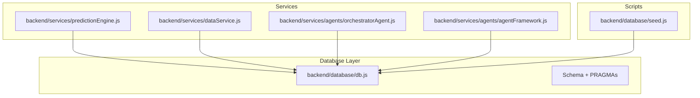
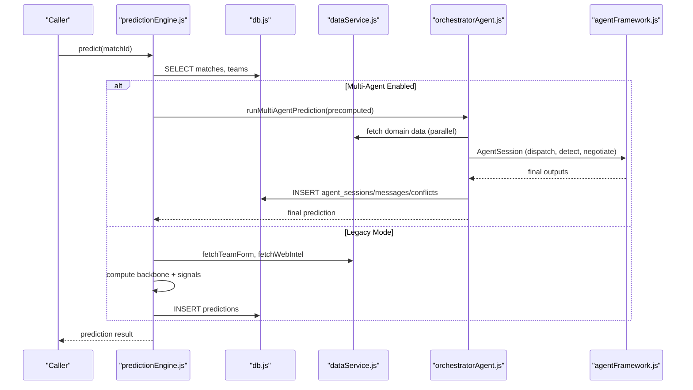
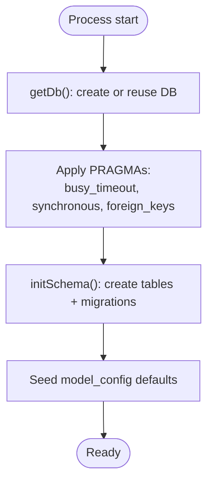
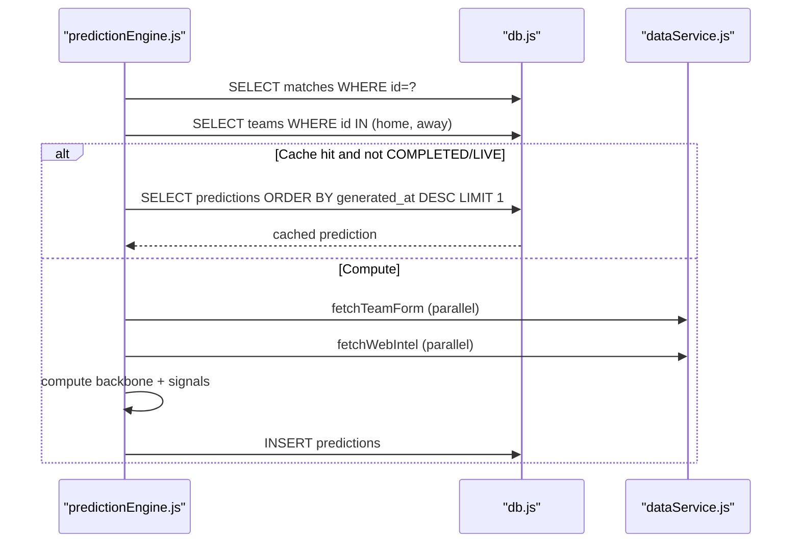
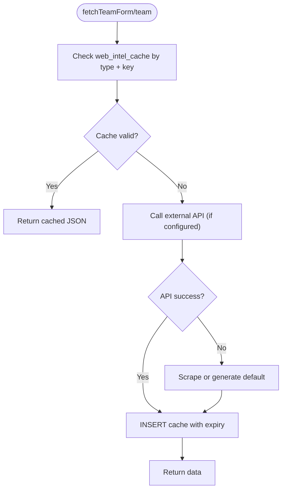
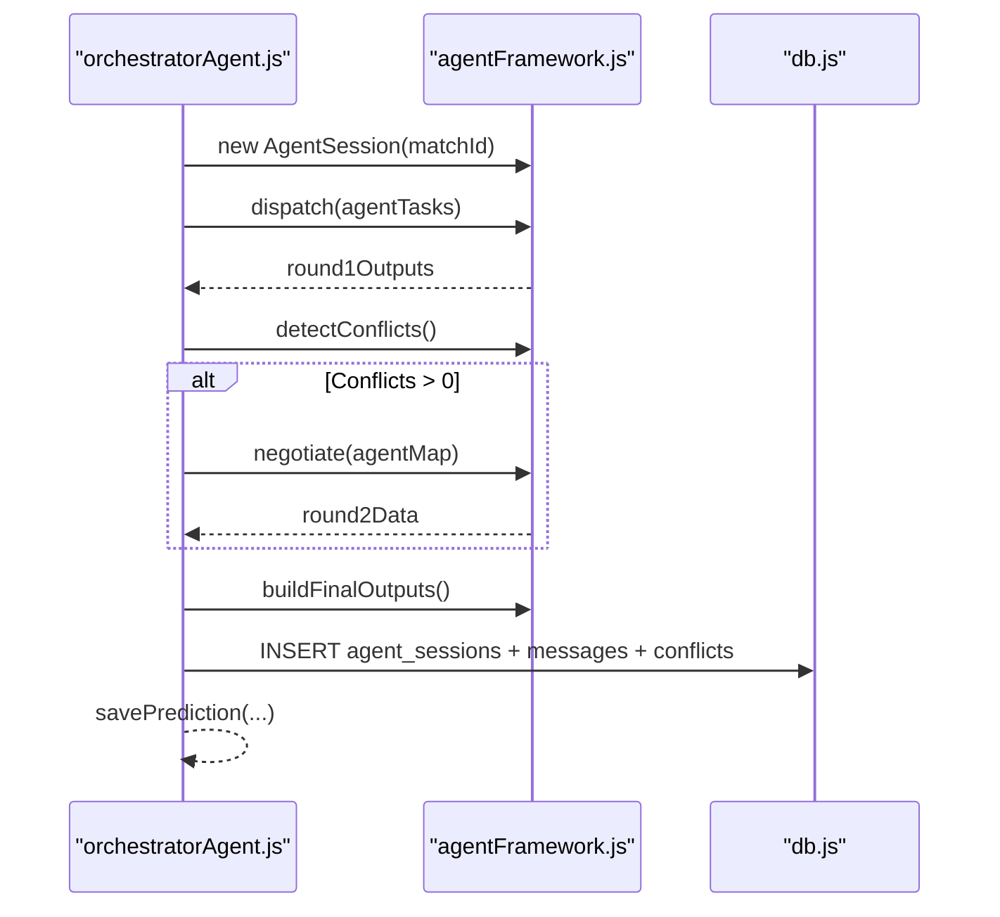
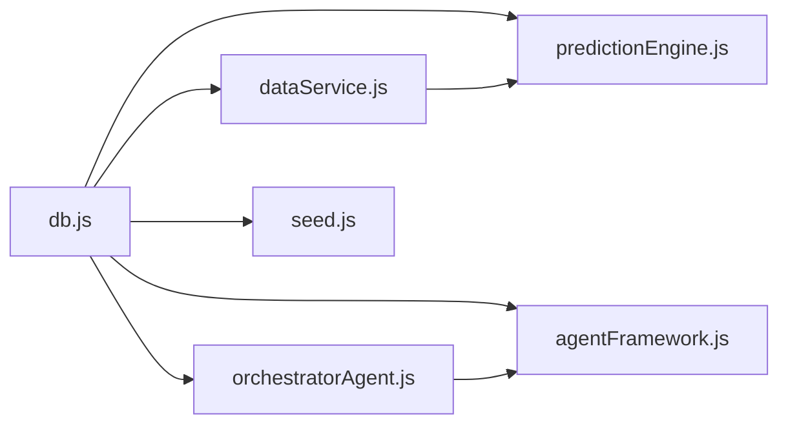
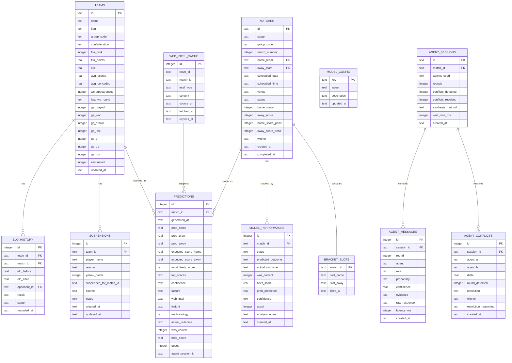

# Performance & Indexing

<cite>
**Referenced Files in This Document**
- [db.js](file://backend/database/db.js)
- [seed.js](file://backend/database/seed.js)
- [predictionEngine.js](file://backend/services/predictionEngine.js)
- [dataService.js](file://backend/services/dataService.js)
- [orchestratorAgent.js](file://backend/services/agents/orchestratorAgent.js)
- [agentFramework.js](file://backend/services/agents/agentFramework.js)
</cite>

## Table of Contents
1. [Introduction](#introduction)
2. [Project Structure](#project-structure)
3. [Core Components](#core-components)
4. [Architecture Overview](#architecture-overview)
5. [Detailed Component Analysis](#detailed-component-analysis)
6. [Dependency Analysis](#dependency-analysis)
7. [Performance Considerations](#performance-considerations)
8. [Troubleshooting Guide](#troubleshooting-guide)
9. [Conclusion](#conclusion)
10. [Appendices](#appendices)

## Introduction
This document focuses on performance optimization for the WC26-Qwen-Qoder database schema and runtime behavior. It covers:
- Indexing strategies for optimal query performance (primary keys, foreign keys, and composite indexes)
- SQLite configuration optimizations (busy_timeout, synchronous settings, foreign_key enforcement)
- Query patterns and access methods used by the prediction engine and multi-agent system
- Performance monitoring and bottleneck identification
- Caching strategies for frequently accessed data
- Recommendations for database maintenance, vacuum operations, and performance tuning
- Impact of WAL mode and concurrent access handling

## Project Structure
The database layer is encapsulated in a single module that initializes schema, enforces integrity, and exposes a shared connection. The prediction engine and multi-agent system rely on this module for all reads and writes. Data service manages external integrations and caches results in the database. Scripts seed the database with initial data.

**Diagram sources**
- [db.js:10-21](file://backend/database/db.js#L10-L21)
- [predictionEngine.js:37-61](file://backend/services/predictionEngine.js#L37-L61)
- [dataService.js:9-16](file://backend/services/dataService.js#L9-L16)
- [orchestratorAgent.js:28-30](file://backend/services/agents/orchestratorAgent.js#L28-L30)
- [agentFramework.js:27-29](file://backend/services/agents/agentFramework.js#L27-L29)
- [seed.js:5-10](file://backend/database/seed.js#L5-L10)

**Section sources**
- [db.js:10-21](file://backend/database/db.js#L10-L21)
- [seed.js:9-16](file://backend/database/seed.js#L9-L16)

## Core Components
- Database initialization and schema: Establishes tables, PRAGMAs, migrations, and default model weights.
- Prediction engine: Computes predictions, coordinates multi-agent mode, and persists results.
- Data service: Fetches and caches external data (form, H2H, intel) with TTL and fallbacks.
- Agent framework: Manages multi-agent sessions, conflict detection, and persistence of agent messages.

Key runtime characteristics:
- Single connection reused across requests.
- Strict foreign key enforcement and synchronous tuning for durability vs performance trade-offs.
- Busy-wait timeout to reduce lock contention under moderate concurrency.
- Extensive caching in the database for web intelligence and team form/H2H.

**Section sources**
- [db.js:23-249](file://backend/database/db.js#L23-L249)
- [predictionEngine.js:665-730](file://backend/services/predictionEngine.js#L665-L730)
- [dataService.js:30-41](file://backend/services/dataService.js#L30-L41)
- [agentFramework.js:32-35](file://backend/services/agents/agentFramework.js#L32-L35)

## Architecture Overview
The prediction pipeline reads match and team data, optionally enriches with external signals, computes probabilities, and persists results. Multi-agent mode delegates computation to specialized agents while sharing a precomputed backbone.

**Diagram sources**
- [predictionEngine.js:665-730](file://backend/services/predictionEngine.js#L665-L730)
- [dataService.js:68-133](file://backend/services/dataService.js#L68-L133)
- [orchestratorAgent.js:290-470](file://backend/services/agents/orchestratorAgent.js#L290-L470)
- [agentFramework.js:345-435](file://backend/services/agents/agentFramework.js#L345-L435)
- [db.js:10-21](file://backend/database/db.js#L10-L21)

## Detailed Component Analysis

### Database Initialization and Schema
- Initializes a single connection with PRAGMAs for robustness under concurrent access.
- Creates all tables with appropriate primary keys and foreign keys.
- Adds migrations for evolving schema needs.
- Seeds default model weights for prediction tuning.

**Diagram sources**
- [db.js:10-21](file://backend/database/db.js#L10-L21)
- [db.js:23-249](file://backend/database/db.js#L23-L249)

**Section sources**
- [db.js:10-21](file://backend/database/db.js#L10-L21)
- [db.js:23-249](file://backend/database/db.js#L23-L249)

### Prediction Engine Query Patterns
- Reads match and teams, ensures ratings exist, and selects recent predictions for caching.
- In multi-agent mode, computes a backbone matrix and delegates to orchestrator.
- In legacy mode, fetches form/intel in parallel, computes signals, blends via log-pool, and inserts prediction.

**Diagram sources**
- [predictionEngine.js:665-700](file://backend/services/predictionEngine.js#L665-L700)
- [predictionEngine.js:734-800](file://backend/services/predictionEngine.js#L734-L800)
- [dataService.js:68-133](file://backend/services/dataService.js#L68-L133)

**Section sources**
- [predictionEngine.js:665-730](file://backend/services/predictionEngine.js#L665-L730)
- [predictionEngine.js:732-800](file://backend/services/predictionEngine.js#L732-L800)

### Data Service Caching and External Fetching
- Caches form, H2H, and intel with TTLs to reduce network load.
- Uses database-backed cache keyed by team or match context.
- Falls back to scraping or synthetic data when APIs are unavailable.

**Diagram sources**
- [dataService.js:68-133](file://backend/services/dataService.js#L68-L133)
- [dataService.js:190-246](file://backend/services/dataService.js#L190-L246)
- [dataService.js:413-490](file://backend/services/dataService.js#L413-L490)

**Section sources**
- [dataService.js:30-41](file://backend/services/dataService.js#L30-L41)
- [dataService.js:68-133](file://backend/services/dataService.js#L68-L133)
- [dataService.js:190-246](file://backend/services/dataService.js#L190-L246)
- [dataService.js:413-490](file://backend/services/dataService.js#L413-L490)

### Multi-Agent Orchestration and Persistence
- Builds match context and pre-fetches domain data in parallel.
- Creates an AgentSession, dispatches agents, detects conflicts, negotiates, and saves outputs.
- Persists agent sessions, messages, and conflict resolutions.

**Diagram sources**
- [orchestratorAgent.js:290-470](file://backend/services/agents/orchestratorAgent.js#L290-L470)
- [agentFramework.js:345-435](file://backend/services/agents/agentFramework.js#L345-L435)
- [agentFramework.js:500-561](file://backend/services/agents/agentFramework.js#L500-L561)

**Section sources**
- [orchestratorAgent.js:290-470](file://backend/services/agents/orchestratorAgent.js#L290-L470)
- [agentFramework.js:345-435](file://backend/services/agents/agentFramework.js#L345-L435)
- [agentFramework.js:500-561](file://backend/services/agents/agentFramework.js#L500-L561)

## Dependency Analysis
- Centralized DB access via a singleton connection initialized with PRAGMAs.
- Prediction engine depends on data service for enrichment and on the database for persistence.
- Multi-agent orchestrator composes specialized agents and persists session artifacts.
- Seed script initializes schema and default weights.

**Diagram sources**
- [db.js:10-21](file://backend/database/db.js#L10-L21)
- [predictionEngine.js:37-53](file://backend/services/predictionEngine.js#L37-L53)
- [dataService.js:9-16](file://backend/services/dataService.js#L9-L16)
- [orchestratorAgent.js:28-30](file://backend/services/agents/orchestratorAgent.js#L28-L30)
- [agentFramework.js:27-29](file://backend/services/agents/agentFramework.js#L27-L29)
- [seed.js:5-10](file://backend/database/seed.js#L5-L10)

**Section sources**
- [db.js:10-21](file://backend/database/db.js#L10-L21)
- [predictionEngine.js:37-53](file://backend/services/predictionEngine.js#L37-L53)
- [dataService.js:9-16](file://backend/services/dataService.js#L9-L16)
- [orchestratorAgent.js:28-30](file://backend/services/agents/orchestratorAgent.js#L28-L30)
- [agentFramework.js:27-29](file://backend/services/agents/agentFramework.js#L27-L29)
- [seed.js:5-10](file://backend/database/seed.js#L5-L10)

## Performance Considerations

### Indexing Strategies
Current schema uses primary keys and foreign keys declared inline. To further optimize query performance:
- Composite indexes for frequent filters:
  - matches(stage, status, scheduled_date) to accelerate scheduling and live match scans
  - matches(group_code, stage, scheduled_date) for group-stage queries
  - predictions(match_id, generated_at) to quickly fetch latest predictions per match
  - model_performance(match_id, stage) to support performance analytics
  - web_intel_cache(team_id, intel_type, fetched_at) to speed up cache lookups
  - agent_messages(session_id, round, agent) to support agent session analysis
- Consider partial indexes for active matches (status IN ('LIVE','SCHEDULED')) to reduce index size and improve selectivity.
- Evaluate covering indexes for hot SELECT queries to avoid table lookups.

Note: These recommendations are based on observed query patterns and schema structure. Implementing indexes requires careful testing and monitoring.

**Section sources**
- [db.js:52-70](file://backend/database/db.js#L52-L70)
- [db.js:72-94](file://backend/database/db.js#L72-L94)
- [db.js:96-110](file://backend/database/db.js#L96-L110)
- [db.js:147-157](file://backend/database/db.js#L147-L157)
- [db.js:167-207](file://backend/database/db.js#L167-L207)
- [predictionEngine.js:669-671](file://backend/services/predictionEngine.js#L669-L671)
- [predictionEngine.js:683-695](file://backend/services/predictionEngine.js#L683-L695)
- [dataService.js:72-76](file://backend/services/dataService.js#L72-L76)
- [agentFramework.js:175-195](file://backend/services/agents/agentFramework.js#L175-L195)

### SQLite Configuration Optimizations
- busy_timeout: Set to a moderate value to reduce immediate lock failures under concurrency.
- synchronous: Set to NORMAL for a balance between durability and performance; consider FULL for critical deployments requiring crash consistency.
- foreign_keys: Enabled to maintain referential integrity across teams, matches, predictions, and agent artifacts.

These settings are applied at connection initialization and influence transaction throughput and reliability.

**Section sources**
- [db.js:15-17](file://backend/database/db.js#L15-L17)

### Query Patterns and Access Methods
- Single-threaded connection pattern: A single Database instance is reused across requests. This simplifies locking but can become a bottleneck under high concurrency.
- Hot read/write paths:
  - Reading latest predictions by match
  - Team and match lookups
  - Parallel fetches for form/intel in data service
  - Multi-agent session writes (messages, conflicts, sessions)

Recommendations:
- Introduce read replicas or separate write/read connections if contention grows.
- Batch writes (BEGIN/COMMIT) for seeding and bulk operations.
- Use prepared statements consistently to leverage query plan caching.

**Section sources**
- [db.js:10-21](file://backend/database/db.js#L10-L21)
- [seed.js:26-42](file://backend/database/seed.js#L26-L42)
- [predictionEngine.js:669-671](file://backend/services/predictionEngine.js#L669-L671)
- [dataService.js:68-133](file://backend/services/dataService.js#L68-L133)
- [agentFramework.js:500-561](file://backend/services/agents/agentFramework.js#L500-L561)

### Performance Monitoring and Bottleneck Identification
- Measure wall-clock time for:
  - Full prediction pipeline (legacy vs multi-agent)
  - Data service fetches (form, H2H, intel)
  - Agent session lifecycle (dispatch, detect, negotiate)
- Track database metrics:
  - Lock waits and timeouts
  - Page cache hits/misses (via PRAGMA) if available
  - Transaction duration and contention
- Instrument LLM calls latency and parse retries in agents.

Use these signals to identify hotspots and adjust concurrency, caching, or indexing accordingly.

**Section sources**
- [agentFramework.js:222-262](file://backend/services/agents/agentFramework.js#L222-L262)
- [agentFramework.js:272-319](file://backend/services/agents/agentFramework.js#L272-L319)
- [agentFramework.js:345-364](file://backend/services/agents/agentFramework.js#L345-L364)
- [agentFramework.js:401-435](file://backend/services/agents/agentFramework.js#L401-L435)

### Caching Strategies
- Database-backed cache for web intelligence:
  - Keys: team_id or composite match-based keys
  - TTLs: form (hours), H2H (hours), intel (shorter hours)
  - Expiry-driven invalidation to ensure freshness
- Prediction caching:
  - Latest prediction per match is returned when not COMPLETED/LIVE
- Recommendations:
  - Add composite indexes on cache tables for fast lookups
  - Consider in-memory cache layer (LRU) for extremely hot keys if DB remains a bottleneck

**Section sources**
- [dataService.js:30-41](file://backend/services/dataService.js#L30-L41)
- [dataService.js:72-80](file://backend/services/dataService.js#L72-L80)
- [predictionEngine.js:669-681](file://backend/services/predictionEngine.js#L669-L681)

### Database Maintenance and Tuning
- Vacuum and analyze periodically to reclaim space and update statistics.
- Monitor growth of agent_messages and agent_sessions tables; archive or prune old sessions if storage becomes constrained.
- Tune PRAGMAs based on deployment profile:
  - higher busy_timeout for bursty loads
  - synchronous FULL for critical correctness
  - foreign_keys ON for integrity

**Section sources**
- [db.js:15-17](file://backend/database/db.js#L15-L17)
- [agentFramework.js:500-561](file://backend/services/agents/agentFramework.js#L500-L561)

### WAL Mode and Concurrent Access
- The current configuration does not enable WAL mode. Enabling WAL can improve concurrency by allowing readers and writers to coexist more efficiently.
- Consider WAL with appropriate checkpoint intervals and journal_mode settings if contention increases under sustained load.
- Ensure backup procedures accommodate WAL mode.

[No sources needed since this section provides general guidance]

## Troubleshooting Guide
- Lock timeouts or slow queries:
  - Increase busy_timeout moderately
  - Review missing composite indexes
  - Inspect long-running transactions and batch them
- Foreign key constraint errors:
  - Verify referential integrity before inserts
  - Confirm migrations executed successfully
- Multi-agent session anomalies:
  - Check agent message persistence and conflict resolution entries
  - Validate JSON parsing and retry logic in agents

**Section sources**
- [db.js:15-17](file://backend/database/db.js#L15-L17)
- [db.js:210-227](file://backend/database/db.js#L210-L227)
- [agentFramework.js:175-195](file://backend/services/agents/agentFramework.js#L175-L195)
- [agentFramework.js:500-561](file://backend/services/agents/agentFramework.js#L500-L561)

## Conclusion
The WC26-Qwen-Qoder system relies on a compact, single-connection SQLite setup with strong integrity checks and extensive caching. Performance hinges on judicious indexing, tuned PRAGMAs, and efficient query patterns. Multi-agent orchestration adds complexity but improves prediction quality—monitor and iterate on concurrency, caching, and schema optimizations to sustain demand.

## Appendices

### Schema Overview and Relationships

**Diagram sources**
- [db.js:24-249](file://backend/database/db.js#L24-L249)