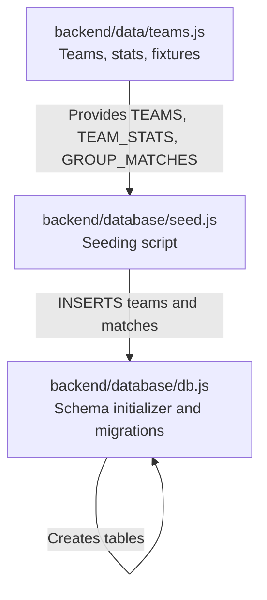
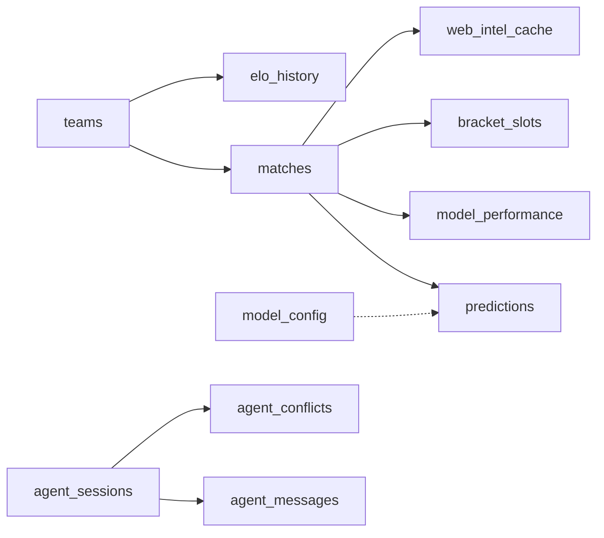

# Table Schemas

<cite>
**Referenced Files in This Document**
- [db.js](file://backend/database/db.js)
- [seed.js](file://backend/database/seed.js)
- [teams.js](file://backend/data/teams.js)
- [predictionEngine.js](file://backend/services/predictionEngine.js)
- [analysisService.js](file://backend/services/analysisService.js)
- [suspensionService.js](file://backend/services/suspensionService.js)
- [oddsService.js](file://backend/services/oddsService.js)
- [dataService.js](file://backend/services/dataService.js)
</cite>

## Table of Contents
1. [Introduction](#introduction)
2. [Project Structure](#project-structure)
3. [Core Components](#core-components)
4. [Architecture Overview](#architecture-overview)
5. [Detailed Component Analysis](#detailed-component-analysis)
6. [Dependency Analysis](#dependency-analysis)
7. [Performance Considerations](#performance-considerations)
8. [Troubleshooting Guide](#troubleshooting-guide)
9. [Conclusion](#conclusion)

## Introduction
This document provides comprehensive table schema documentation for the WC26-Qwen-Qoder system’s SQLite database. It covers all tables involved in team ratings, match fixtures, predictions, model performance tracking, multi-agent orchestration, and auxiliary data such as ELO history, suspensions, and web intelligence caching. For each table, we document columns, data types, constraints, defaults, and the purpose of each field within the prediction and tournament management system. We also summarize migrations and highlight how these tables integrate with the prediction pipeline and analytics.

## Project Structure
The database schema is initialized and maintained in a single module that creates tables, applies migrations, seeds initial data, and exposes a shared database connection. Initial seeding is performed by a dedicated script that inserts teams and group-stage fixtures.



**Diagram sources**
- [db.js:23-249](file://backend/database/db.js#L23-L249)
- [seed.js:9-68](file://backend/database/seed.js#L9-L68)
- [teams.js:7-234](file://backend/data/teams.js#L7-L234)

**Section sources**
- [db.js:23-249](file://backend/database/db.js#L23-L249)
- [seed.js:9-68](file://backend/database/seed.js#L9-L68)
- [teams.js:7-234](file://backend/data/teams.js#L7-L234)

## Core Components
Below are the core tables and their roles in the system. Each table definition is derived from the schema initializer.

- teams: Stores team metadata, ELO ratings, group stage stats, and Dixon–Coles model parameters.
- matches: Fixture data for group and knockout stages, including status and scores.
- predictions: Pre-match probability distributions, confidence metrics, and post-match truth.
- model_performance: Aggregated accuracy and calibration metrics per match.
- bracket_slots: Tracks bracket positions for knockout matches.
- elo_history: Records ELO changes after each completed match.
- suspensions: Player availability and disciplinary records linked to matches.
- web_intel_cache: Cached external intelligence (injury, form, lineup, news).
- model_config: Adjustable model weights and engine parameters.
- agent_sessions: Multi-agent orchestration sessions and outcomes.
- agent_messages: Inter-agent messages and reasoning traces.
- agent_conflicts: Conflicts detected and resolutions.

**Section sources**
- [db.js:26-207](file://backend/database/db.js#L26-L207)

## Architecture Overview
The schema underpins a prediction pipeline that:
- Seeds teams and fixtures.
- Generates predictions with probability distributions and confidence.
- Updates team ELO and Dixon–Coles parameters after matches.
- Tracks model performance and calibration.
- Supports multi-agent orchestration and conflict resolution.
- Caches external intelligence and manages suspensions.

```mermaid
erDiagram
TEAMS {
text id PK
text name
text flag
text group_code
text confederation
integer fifa_rank
real fifa_points
real elo
real avg_scored
real avg_conceded
integer wc_appearances
text last_wc_round
integer gs_played
integer gs_won
integer gs_drawn
integer gs_lost
integer gs_gf
integer gs_ga
integer gs_pts
integer eliminated
text updated_at
real log_alpha
real log_beta
real log_alpha_prior
real log_beta_prior
}
MATCHES {
text id PK
text stage
text group_code
integer match_number
text home_team FK
text away_team FK
text scheduled_date
text scheduled_time
text venue
text status
integer home_score
integer away_score
integer home_score_pens
integer away_score_pens
text winner FK
text created_at
text completed_at
}
PREDICTIONS {
integer id PK
text match_id FK
text generated_at
real prob_home
real prob_draw
real prob_away
real expected_score_home
real expected_score_away
text most_likely_score
text top_scores
text confidence
text factors
text web_intel
text insight
text methodology
text actual_outcome
integer was_correct
real brier_score
integer upset
text agent_session_id
real lambda_home
real lambda_away
}
MODEL_PERFORMANCE {
integer id PK
text match_id FK
text stage
text predicted_outcome
text actual_outcome
integer was_correct
real brier_score
real prob_predicted
text confidence
integer upset
text analysis_notes
text created_at
integer points
}
BRACKET_SLOTS {
text match_id PK FK
text slot_home
text slot_away
text filled_at
}
ELO_HISTORY {
integer id PK
text team_id FK
text match_id FK
real elo_before
real elo_after
text opponent_id FK
text result
text stage
text recorded_at
}
SUSPENSIONS {
integer id PK
text team_id FK
text player_name
text reason
integer yellow_cards
text suspended_for_match_id
text source
text notes
text created_at
text updated_at
}
WEB_INTEL_CACHE {
integer id PK
text team_id
text match_id
text intel_type
text content
text source_url
text fetched_at
text expires_at
}
MODEL_CONFIG {
text key PK
real value
text description
text updated_at
}
AGENT_SESSIONS {
text id PK
text match_id FK
text agents_used
integer rounds
integer conflicts_detected
integer conflicts_resolved
text synthesis_method
integer wall_time_ms
text created_at
}
AGENT_MESSAGES {
integer id PK
text session_id FK
integer round
text agent
text role
text probability
real confidence
text evidence
text raw_response
integer latency_ms
text created_at
}
AGENT_CONFLICTS {
integer id PK
text session_id FK
text agent_a
text agent_b
real delta
integer round_detected
text resolution
text winner
text resolution_reasoning
text created_at
}
TEAMS ||--o{ MATCHES : "home_team/away_team"
TEAMS ||--o{ ELO_HISTORY : "team_id/opponent_id"
MATCHES ||--o{ PREDICTIONS : "match_id"
MATCHES ||--o{ MODEL_PERFORMANCE : "match_id"
MATCHES ||--o{ BRACKET_SLOTS : "match_id"
MATCHES ||--o{ SUSPENSIONS : "suspended_for_match_id"
MATCHES ||--o{ WEB_INTEL_CACHE : "match_id"
AGENT_SESSIONS ||--o{ AGENT_MESSAGES : "session_id"
AGENT_SESSIONS ||--o{ AGENT_CONFILCTS : "session_id"
```

**Diagram sources**
- [db.js:26-207](file://backend/database/db.js#L26-L207)

## Detailed Component Analysis

### teams
Purpose: Central team entity with ELO ratings, group stage statistics, and Dixon–Coles model parameters.

Columns and constraints:
- id: Text, primary key.
- name: Text, not null.
- flag: Text.
- group_code: Text.
- confederation: Text.
- fifa_rank: Integer.
- fifa_points: Real.
- elo: Real, live ELO updated after matches.
- avg_scored: Real, average goals scored.
- avg_conceded: Real, average goals conceded.
- wc_appearances: Integer, default 0.
- last_wc_round: Text.
- gs_played/gs_won/gs_drawn/gs_lost/gs_gf/gs_ga/gs_pts: Integers, defaults 0.
- eliminated: Integer, default 0.
- updated_at: Text, default current timestamp.
- log_alpha/log_beta: Added via migration for Dixon–Coles model.
- log_alpha_prior/log_beta_prior: Added via migration for prior regularization.

Indexes and triggers: None explicitly defined in schema initializer.

Constraints:
- Primary key on id.
- Foreign keys: None (standalone table).

Defaults and computed behavior:
- ELO starts equal to FIFA points during seeding.
- Group stage stats updated after each completed match.

**Section sources**
- [db.js:26-49](file://backend/database/db.js#L26-L49)
- [seed.js:19-42](file://backend/database/seed.js#L19-L42)
- [analysisService.js:248-293](file://backend/services/analysisService.js#L248-L293)

### matches
Purpose: Fixture data for group and knockout stages, including scheduling, venue, and match outcomes.

Columns and constraints:
- id: Text, primary key.
- stage: Text, not null; values include GROUP and knockout rounds.
- group_code: Text.
- match_number: Integer.
- home_team/away_team: Texts referencing teams(id).
- scheduled_date: Text.
- scheduled_time: Text (added via migration).
- venue: Text.
- status: Text, default SCHEDULED; values include SCHEDULED, LIVE, COMPLETED.
- home_score/away_score: Integers.
- home_score_pens/away_score_pens: Integers for penalties.
- winner: Text referencing teams(id).
- created_at: Text, default current timestamp.
- completed_at: Text.

Indexes and triggers: None explicitly defined in schema initializer.

Constraints:
- Primary key on id.
- Foreign keys: home_team, away_team, winner reference teams(id).

Defaults and computed behavior:
- Status defaults to SCHEDULED.
- Winner populated after match completion.

**Section sources**
- [db.js:52-70](file://backend/database/db.js#L52-L70)
- [seed.js:46-62](file://backend/database/seed.js#L46-L62)

### predictions
Purpose: Pre-match predictions with probability distributions, confidence, and post-match truth.

Columns and constraints:
- id: Integer, autoincrement primary key.
- match_id: Text, not null, references matches(id).
- generated_at: Text, default current timestamp.
- prob_home/prob_draw/prob_away: Reals, not null.
- expected_score_home/expected_score_away: Reals.
- most_likely_score: Text.
- top_scores: Text (JSON), top 3 scorelines.
- confidence: Text; values include LOW, MEDIUM, HIGH, VERY_HIGH.
- factors: Text (JSON), factor objects.
- web_intel: Text (JSON), scraped news/injury info.
- insight: Text, human-readable summary.
- methodology: Text.
- actual_outcome: Text; values HOME, DRAW, AWAY.
- was_correct: Integer; 0 or 1.
- brier_score: Real, probability calibration error.
- upset: Integer, default 0.
- agent_session_id: Text (added via migration).
- lambda_home/lambda_away: Reals (added via migration).

Indexes and triggers: None explicitly defined in schema initializer.

Constraints:
- Primary key on id.
- Foreign key: match_id references matches(id).

Defaults and computed behavior:
- Confidence and insights generated by prediction engine.
- Post-match fields populated after match completion.

**Section sources**
- [db.js:73-94](file://backend/database/db.js#L73-L94)
- [predictionEngine.js:912-963](file://backend/services/predictionEngine.js#L912-L963)

### model_performance
Purpose: Aggregated accuracy and calibration metrics per match for model evaluation.

Columns and constraints:
- id: Integer, autoincrement primary key.
- match_id: Text, references matches(id).
- stage: Text.
- predicted_outcome: Text.
- actual_outcome: Text.
- was_correct: Integer.
- brier_score: Real.
- prob_predicted: Real, probability assigned to actual outcome.
- confidence: Text.
- upset: Integer, default 0.
- analysis_notes: Text.
- created_at: Text, default current timestamp.
- points: Integer, default 0 (added via migration).

Indexes and triggers: None explicitly defined in schema initializer.

Constraints:
- Primary key on id.
- Foreign key: match_id references matches(id).

Defaults and computed behavior:
- Populated after match completion and post-match truth assignment.

**Section sources**
- [db.js:97-110](file://backend/database/db.js#L97-L110)
- [analysisService.js:345-384](file://backend/services/analysisService.js#L345-L384)

### bracket_slots
Purpose: Track bracket positions for knockout matches.

Columns and constraints:
- match_id: Text, primary key, references matches(id).
- slot_home/slot_away: Text (e.g., “1A”, “2B”, “3rd-ABCD”).
- filled_at: Text.

Indexes and triggers: None explicitly defined in schema initializer.

Constraints:
- Primary key on match_id.
- Foreign key: match_id references matches(id).

Defaults and computed behavior:
- Populated during bracket construction and updates.

**Section sources**
- [db.js:113-118](file://backend/database/db.js#L113-L118)

### elo_history
Purpose: Record ELO changes after each completed match.

Columns and constraints:
- id: Integer, autoincrement primary key.
- team_id: Text, not null, references teams(id).
- match_id: Text, references matches(id).
- elo_before/elo_after: Reals.
- opponent_id: Text, references teams(id).
- result: Text; values W, D, L.
- stage: Text.
- recorded_at: Text, default current timestamp.

Indexes and triggers: None explicitly defined in schema initializer.

Constraints:
- Primary key on id.
- Foreign keys: team_id, opponent_id, match_id reference teams(id), matches(id).

Defaults and computed behavior:
- Inserted after match completion with before/after ELO and result.

**Section sources**
- [db.js:121-131](file://backend/database/db.js#L121-L131)
- [predictionEngine.js:927-935](file://backend/services/predictionEngine.js#L927-L935)

### suspensions
Purpose: Track player suspensions and disciplinary actions linked to matches.

Columns and constraints:
- id: Integer, autoincrement primary key.
- team_id: Text, not null, references teams(id).
- player_name: Text, not null.
- reason: Text; values include yellow_accumulation, red_card, disciplinary.
- yellow_cards: Integer, default 0.
- suspended_for_match_id: Text, links to match they cannot play.
- source: Text, default manual; values include manual, api, scraped.
- notes: Text.
- created_at: Text, default current timestamp.
- updated_at: Text, default current timestamp.

Indexes and triggers: None explicitly defined in schema initializer.

Constraints:
- Primary key on id.
- Foreign key: team_id references teams(id).

Defaults and computed behavior:
- Suspensions joined to matches for reporting and filtering.

**Section sources**
- [db.js:134-145](file://backend/database/db.js#L134-L145)
- [suspensionService.js:108-143](file://backend/services/suspensionService.js#L108-L143)

### web_intel_cache
Purpose: Cache external intelligence (injury news, form, lineups, odds).

Columns and constraints:
- id: Integer, autoincrement primary key.
- team_id: Text.
- match_id: Text.
- intel_type: Text; values include injury, form, lineup, news, odds.
- content: Text.
- source_url: Text.
- fetched_at: Text, default current timestamp.
- expires_at: Text.

Indexes and triggers: None explicitly defined in schema initializer.

Constraints:
- Primary key on id.
- Foreign keys: team_id references teams(id), match_id references matches(id).

Defaults and computed behavior:
- Fetched and cached by data services; expiry controls freshness.

**Section sources**
- [db.js:148-157](file://backend/database/db.js#L148-L157)
- [oddsService.js:194-200](file://backend/services/oddsService.js#L194-L200)
- [dataService.js:417-462](file://backend/services/dataService.js#L417-L462)

### model_config
Purpose: Adjustable model weights and engine parameters.

Columns and constraints:
- key: Text, primary key.
- value: Real, not null.
- description: Text.
- updated_at: Text, default current timestamp.

Indexes and triggers: None explicitly defined in schema initializer.

Constraints: Primary key on key.

Defaults and computed behavior:
- Seeded with default weights and parameters; updated via tuning scripts.

**Section sources**
- [db.js:160-165](file://backend/database/db.js#L160-L165)
- [db.js:229-248](file://backend/database/db.js#L229-L248)

### agent_sessions
Purpose: Multi-agent orchestration sessions and outcomes.

Columns and constraints:
- id: Text, primary key (UUID).
- match_id: Text, references matches(id).
- agents_used: Text (JSON array of agent names).
- rounds: Integer, default 1.
- conflicts_detected/conflicts_resolved: Integers, defaults 0.
- synthesis_method: Text; values include log_pool_weighted, arbitrated.
- wall_time_ms: Integer.
- created_at: Text, default current timestamp.

Indexes and triggers: None explicitly defined in schema initializer.

Constraints:
- Primary key on id.
- Foreign key: match_id references matches(id).

Defaults and computed behavior:
- Created when multi-agent predictions are generated.

**Section sources**
- [db.js:168-178](file://backend/database/db.js#L168-L178)

### agent_messages
Purpose: Inter-agent messages and reasoning traces.

Columns and constraints:
- id: Integer, autoincrement primary key.
- session_id: Text, references agent_sessions(id).
- round: Integer, not null; values 1 or 2.
- agent: Text, not null.
- role: Text, not null; values include analysis, rebuttal, arbitration.
- probability: Text (JSON), {winHome, draw, winAway}.
- confidence: Real.
- evidence: Text (JSON array of strings).
- raw_response: Text.
- latency_ms: Integer.
- created_at: Text, default current timestamp.

Indexes and triggers: None explicitly defined in schema initializer.

Constraints:
- Primary key on id.
- Foreign key: session_id references agent_sessions(id).

Defaults and computed behavior:
- Captures reasoning and synthesis steps across rounds.

**Section sources**
- [db.js:181-193](file://backend/database/db.js#L181-L193)

### agent_conflicts
Purpose: Detected conflicts and resolution outcomes.

Columns and constraints:
- id: Integer, autoincrement primary key.
- session_id: Text, references agent_sessions(id).
- agent_a/agent_b: Texts.
- delta: Real, max probability gap that triggered conflict.
- round_detected: Integer, default 1.
- resolution: Text; values include agent_a_won, agent_b_won, arbitrated.
- winner: Text.
- resolution_reasoning: Text.
- created_at: Text, default current timestamp.

Indexes and triggers: None explicitly defined in schema initializer.

Constraints:
- Primary key on id.
- Foreign key: session_id references agent_sessions(id).

Defaults and computed behavior:
- Captures conflict detection and resolution decisions.

**Section sources**
- [db.js:196-207](file://backend/database/db.js#L196-L207)

## Dependency Analysis
The tables are interconnected to support the prediction lifecycle and analytics:

- teams ↔ matches: Home/away teams and winner references.
- matches ↔ predictions: One-to-many predictions per match.
- matches ↔ model_performance: One-to-one or many depending on evaluation granularity.
- matches ↔ bracket_slots: One-to-one for knockout slots.
- teams ↔ elo_history: Team and opponent references.
- matches ↔ web_intel_cache: Match-scoped caching.
- model_config ↔ prediction engine and calibration.
- agent_sessions ↔ agent_messages/agent_conflicts: Orchestration and conflict tracking.



**Diagram sources**
- [db.js:26-207](file://backend/database/db.js#L26-L207)

**Section sources**
- [db.js:26-207](file://backend/database/db.js#L26-L207)

## Performance Considerations
- Indexes: No explicit indexes are defined in the schema initializer. Consider adding indexes on frequently filtered or joined columns such as:
  - matches(status), matches(scheduled_date), matches(group_code)
  - predictions(match_id), predictions(generated_at)
  - model_performance(match_id), model_performance(stage)
  - web_intel_cache(match_id), web_intel_cache(intel_type)
  - elo_history(team_id), elo_history(match_id)
  - suspensions(team_id), suspensions(suspended_for_match_id)
  - agent_messages(session_id), agent_messages(round)
  - agent_conflicts(session_id)
- Full scans: Queries that join multiple tables (e.g., suspensions with matches and teams) may benefit from covering indexes.
- Write patterns: Batch updates for group stage stats and ELO updates occur after match completion; ensure transactions are used to minimize contention.

[No sources needed since this section provides general guidance]

## Troubleshooting Guide
- Missing scheduled_time or top_scores columns: The schema initializer adds these via ALTER TABLE statements. If upgrading existing databases, ensure migrations are executed.
- Missing Dixon–Coles model columns: log_alpha, log_beta, and priors are added via migrations; confirm presence if using advanced modeling features.
- Points-based scoring: The points column in model_performance is added via migration; verify default 0 if not present.
- Multi-agent fields: agent_session_id, lambda_home, lambda_away are added via migrations; ensure predictions table reflects these additions.
- Seeding failures: The seed script checks for existing teams and aborts if already seeded; clear database or adjust logic if necessary.

**Section sources**
- [db.js:210-226](file://backend/database/db.js#L210-L226)
- [seed.js:12-16](file://backend/database/seed.js#L12-L16)

## Conclusion
The WC26-Qwen-Qoder database schema is designed to support a robust prediction pipeline with strong traceability and extensibility. The teams table maintains ELO and group stage statistics; matches captures fixtures and outcomes; predictions and model_performance track probabilistic forecasts and accuracy; multi-agent tables enable orchestrated reasoning; and auxiliary tables manage suspensions and cached intelligence. While no explicit indexes are defined, the schema supports targeted indexing for performance and includes migrations to evolve the schema over time.