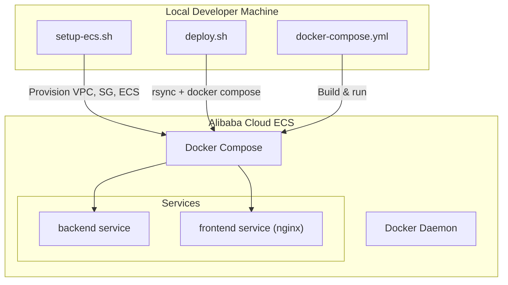
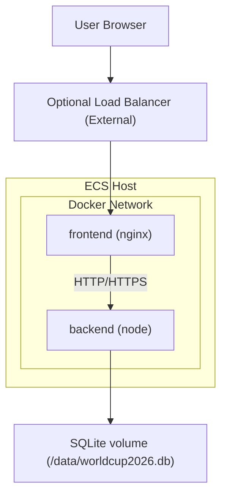
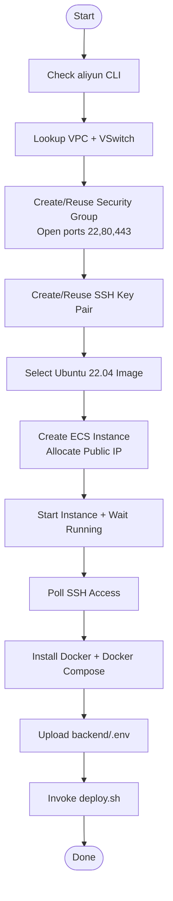
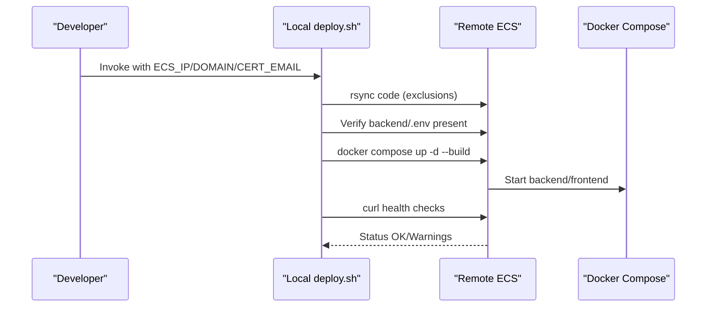
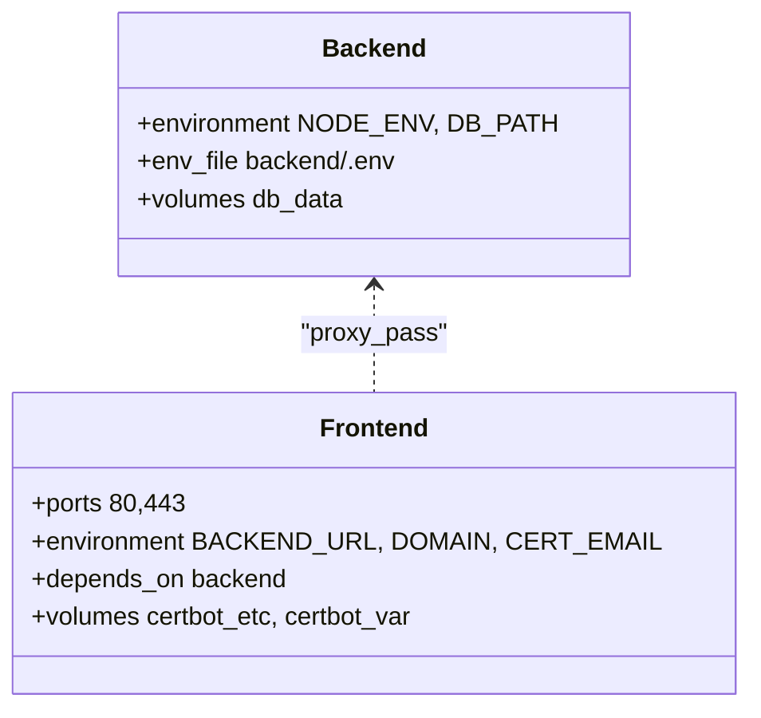
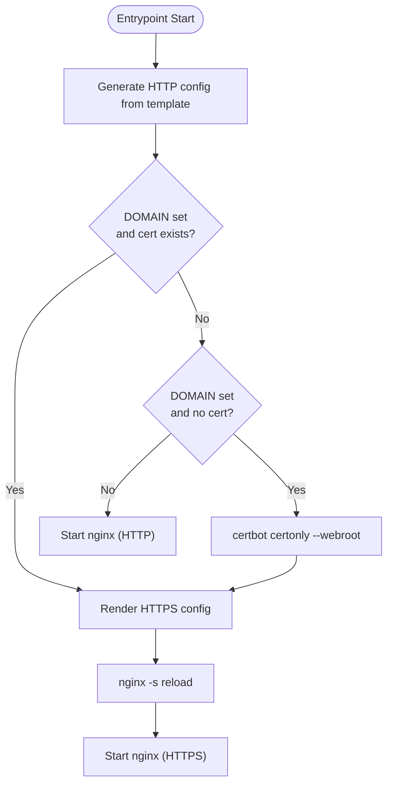
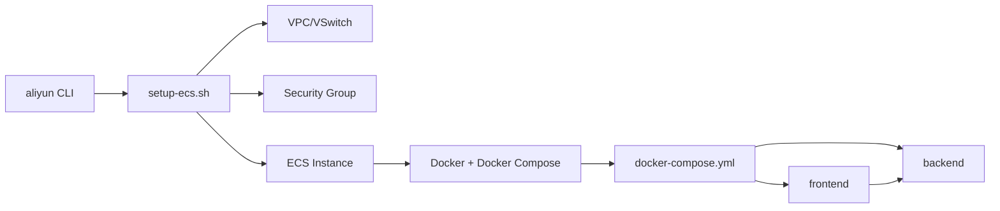

# Cloud Provisioning & ECS

<cite>
**Referenced Files in This Document**
- [setup-ecs.sh](file://setup-ecs.sh)
- [deploy.sh](file://deploy.sh)
- [docker-compose.yml](file://docker-compose.yml)
- [backend/Dockerfile](file://backend/Dockerfile)
- [frontend/Dockerfile](file://frontend/Dockerfile)
- [frontend/nginx.conf.template](file://frontend/nginx.conf.template)
- [frontend/nginx-ssl.conf.template](file://frontend/nginx-ssl.conf.template)
- [frontend/entrypoint.sh](file://frontend/entrypoint.sh)
- [backend/.env.example](file://backend/.env.example)
- [backend/package.json](file://backend/package.json)
- [frontend/package.json](file://frontend/package.json)
- [backend/server.js](file://backend/server.js)
- [README.md](file://README.md)
- [SETUP.md](file://SETUP.md)
</cite>

## Table of Contents
1. [Introduction](#introduction)
2. [Project Structure](#project-structure)
3. [Core Components](#core-components)
4. [Architecture Overview](#architecture-overview)
5. [Detailed Component Analysis](#detailed-component-analysis)
6. [Dependency Analysis](#dependency-analysis)
7. [Performance Considerations](#performance-considerations)
8. [Troubleshooting Guide](#troubleshooting-guide)
9. [Cost Optimization & Disaster Recovery](#cost-optimization--disaster-recovery)
10. [Security Hardening & Compliance](#security-hardening--compliance)
11. [Conclusion](#conclusion)

## Introduction
This document explains the Alibaba Cloud ECS provisioning and deployment automation for WC26-Qwen-Qoder. It covers automated instance provisioning, security group configuration, Docker-based service deployment, HTTPS/TLS setup, environment variable management, health monitoring, and operational best practices. It also outlines strategies for cost optimization, backups, disaster recovery, and security hardening aligned with cloud deployment requirements.

## Project Structure
The deployment pipeline consists of:
- An automated provisioning script that provisions Alibaba Cloud resources and installs Docker
- A deployment script that synchronizes code and orchestrates containerized services
- A Docker Compose stack that defines backend and frontend services
- Nginx-based frontend with dynamic TLS provisioning via Certbot/Let’s Encrypt
- Environment configuration managed via .env files and Docker Compose environment variables

**Diagram sources**
- [setup-ecs.sh:1-443](file://setup-ecs.sh#L1-L443)
- [deploy.sh:1-110](file://deploy.sh#L1-L110)
- [docker-compose.yml:1-34](file://docker-compose.yml#L1-L34)

**Section sources**
- [README.md:231-263](file://README.md#L231-L263)
- [SETUP.md:124-161](file://SETUP.md#L124-L161)

## Core Components
- Automated provisioning script: Creates VPC, VSwitch, security group, SSH key pair, ECS instance, allocates public IP, waits for SSH, installs Docker, uploads .env, and invokes deployment
- Deployment script: Synchronizes files, ensures .env exists on ECS, builds and restarts containers, performs health checks
- Docker Compose: Defines backend and frontend services, volumes, and inter-service dependencies
- Frontend Nginx: Dynamic configuration generation for HTTP/HTTPS, ACME challenges, and automatic TLS renewal
- Environment management: .env files and Docker Compose environment variables

**Section sources**
- [setup-ecs.sh:13-20](file://setup-ecs.sh#L13-L20)
- [deploy.sh:38-96](file://deploy.sh#L38-L96)
- [docker-compose.yml:1-34](file://docker-compose.yml#L1-L34)
- [frontend/entrypoint.sh:1-48](file://frontend/entrypoint.sh#L1-L48)

## Architecture Overview
The system uses a two-tier containerized architecture:
- Backend service exposes an internal API for the frontend
- Frontend service (Nginx) proxies API requests to backend and serves static assets
- TLS termination is handled by Nginx with dynamic certificates via Certbot/Let’s Encrypt

**Diagram sources**
- [docker-compose.yml:14-28](file://docker-compose.yml#L14-L28)
- [backend/Dockerfile:1-8](file://backend/Dockerfile#L1-L8)
- [frontend/Dockerfile:1-18](file://frontend/Dockerfile#L1-L18)
- [frontend/nginx.conf.template:13-23](file://frontend/nginx.conf.template#L13-L23)
- [frontend/nginx-ssl.conf.template:33-43](file://frontend/nginx-ssl.conf.template#L33-L43)

## Detailed Component Analysis

### Automated ECS Provisioning (setup-ecs.sh)
- Prerequisites and defaults: Validates Alibaba Cloud CLI, sets region, instance type, disk size, remote directory, and key name
- VPC and VSwitch discovery/creation: Finds default VPC, selects compatible zones, and creates a VSwitch if needed
- Security group: Creates or reuses a security group and opens ports 22, 80, 443
- SSH key pair: Creates or reuses a named key pair and manages local private key
- ECS instance: Selects Ubuntu 22.04 image, creates instance with selected image and disk size, allocates public IP, starts instance, and waits for running state
- SSH readiness: Polls SSH until reachable
- Docker installation: Installs Docker and Docker Compose on the instance
- Configuration upload: Uploads backend/.env to remote path
- Deployment invocation: Exports ECS_IP and key, then runs deploy.sh

**Diagram sources**
- [setup-ecs.sh:40-373](file://setup-ecs.sh#L40-L373)

**Section sources**
- [setup-ecs.sh:40-373](file://setup-ecs.sh#L40-L373)

### Deployment Automation (deploy.sh)
- Environment: Requires ECS_IP and optional ECS_USER/ECS_KEY; supports HTTPS via DOMAIN and CERT_EMAIL
- File synchronization: rsync excluding development artifacts and sensitive files
- Configuration verification: Ensures backend/.env exists on ECS
- Container lifecycle: Builds and restarts services with docker compose, prunes unused images
- Health checks: Verifies backend API and optional HTTPS response

**Diagram sources**
- [deploy.sh:38-96](file://deploy.sh#L38-L96)

**Section sources**
- [deploy.sh:10-110](file://deploy.sh#L10-L110)

### Docker Compose Services
- Backend service: Node.js app with production environment, DB path volume, and env_file from backend/.env
- Frontend service: Nginx with templates for HTTP/HTTPS, proxy to backend, and mounted volumes for certs and www
- Dependencies: Frontend depends_on backend to ensure startup order

**Diagram sources**
- [docker-compose.yml:2-28](file://docker-compose.yml#L2-L28)

**Section sources**
- [docker-compose.yml:1-34](file://docker-compose.yml#L1-L34)

### Frontend TLS and Proxy (Nginx + Certbot)
- HTTP-only template: Proxies /api/ to backend and serves static assets
- HTTPS template: Redirects HTTP to HTTPS, loads TLS certificates, and proxies /api/
- Entrypoint logic: Generates HTTP config initially; obtains certificate if DOMAIN set; enables HTTPS; sets up daily renewal cron

**Diagram sources**
- [frontend/entrypoint.sh:6-47](file://frontend/entrypoint.sh#L6-L47)
- [frontend/nginx.conf.template:13-23](file://frontend/nginx.conf.template#L13-L23)
- [frontend/nginx-ssl.conf.template:33-43](file://frontend/nginx-ssl.conf.template#L33-L43)

**Section sources**
- [frontend/entrypoint.sh:1-48](file://frontend/entrypoint.sh#L1-L48)
- [frontend/nginx.conf.template:1-25](file://frontend/nginx.conf.template#L1-L25)
- [frontend/nginx-ssl.conf.template:1-45](file://frontend/nginx-ssl.conf.template#L1-L45)

### Environment Variable Management
- Backend .env: Required keys include DashScope API key, optional football-data API key, CORS origin, port, and multi-agent toggle
- Docker Compose: Passes DOMAIN and CERT_EMAIL to frontend service; backend reads env_file
- Frontend Dockerfile: Sets default BACKEND_URL for proxying

**Section sources**
- [backend/.env.example:1-17](file://backend/.env.example#L1-L17)
- [docker-compose.yml:6-23](file://docker-compose.yml#L6-L23)
- [frontend/Dockerfile:15-16](file://frontend/Dockerfile#L15-L16)

### Service Health Monitoring
- Backend health: deploy.sh probes /api/teams endpoint to verify API responsiveness
- Frontend health: deploy.sh optionally checks HTTPS reachability via curl
- Logs: setup-ecs.sh prints commands to inspect container logs on failure

**Section sources**
- [deploy.sh:82-96](file://deploy.sh#L82-L96)
- [setup-ecs.sh:430-442](file://setup-ecs.sh#L430-L442)

## Dependency Analysis
- Provisioning depends on Alibaba Cloud CLI and Python for JSON parsing
- ECS instance depends on VPC/VSwitch availability and compatible zones
- Deployment depends on .env presence and Docker availability
- Frontend depends on backend being reachable and database seeded

**Diagram sources**
- [setup-ecs.sh:40-373](file://setup-ecs.sh#L40-L373)
- [deploy.sh:38-78](file://deploy.sh#L38-L78)
- [docker-compose.yml:1-34](file://docker-compose.yml#L1-L34)

**Section sources**
- [setup-ecs.sh:40-373](file://setup-ecs.sh#L40-L373)
- [deploy.sh:38-78](file://deploy.sh#L38-L78)

## Performance Considerations
- Instance sizing: Default t6 burstable instance is suitable for development/demo; consider higher baseline performance instances for production traffic
- Disk sizing: Automatically adjusts to image minimum; ensure sufficient size for SQLite growth and logs
- Container resource limits: Consider adding memory/cpu constraints in docker-compose for predictable performance
- CDN and caching: Frontend static assets are served by Nginx; consider enabling gzip/static caching and external CDN for global distribution
- Database I/O: SQLite WAL mode improves concurrency; monitor disk I/O under load

[No sources needed since this section provides general guidance]

## Troubleshooting Guide
- SSH connectivity: If SSH times out, verify security group allows port 22 and the instance is running
- HTTPS provisioning: If HTTPS is pending, check Certbot logs and DNS A/AAAA records for the configured domain
- Backend API down: Inspect backend container logs and confirm database seeding and environment variables
- File sync issues: Ensure rsync exclusions are appropriate and backend/.env is uploaded before deployment
- Port conflicts: Confirm only one service binds to ports 80/443 on the host

**Section sources**
- [setup-ecs.sh:375-391](file://setup-ecs.sh#L375-L391)
- [deploy.sh:82-96](file://deploy.sh#L82-L96)
- [setup-ecs.sh:430-442](file://setup-ecs.sh#L430-L442)

## Cost Optimization & Disaster Recovery
- Cost optimization
  - Choose reserved or spot instances judiciously; t6 burstables are cost-effective for low-to-moderate traffic
  - Right-size storage; reduce disk size if not needed for logs or caches
  - Use pay-as-you-go billing with alerts for unexpected spikes
  - Consolidate services on a single instance to minimize overhead
- Backups
  - Persist SQLite database via named volume; snapshot the volume periodically
  - Export database regularly for off-instance archival
- Disaster recovery
  - Maintain a reusable terraform or CLI script to recreate VPC, security group, and instance
  - Store private keys securely and automate key rotation
  - Keep a minimal bootstrap script to reinstall Docker and redeploy from source

[No sources needed since this section provides general guidance]

## Security Hardening & Compliance
- Network isolation
  - Restrict security group ingress to necessary IPs; avoid 0.0.0.0/0 for SSH and management ports
  - Place the instance in a private subnet if only accessing via bastion or VPN
- Secrets management
  - Never commit .env to source control; rotate API keys regularly
  - Use secret managers or encrypted storage for credentials
- TLS and cryptography
  - Enforce HTTPS with strong ciphers and TLS 1.2+/1.3
  - Automate certificate renewal via cron
- Logging and auditing
  - Enable system logs and container logs; ship to centralized logging
  - Monitor failed SSH attempts and unauthorized access patterns
- Compliance
  - Ensure data retention and deletion policies align with regional regulations
  - Limit data collection to what is necessary for predictions

[No sources needed since this section provides general guidance]

## Conclusion
The WC26-Qwen-Qoder deployment leverages a streamlined automation pipeline to provision Alibaba Cloud ECS, install Docker, and deploy containerized services with dynamic TLS. By following the documented scripts, environment management practices, and operational recommendations, teams can reliably operate the system while optimizing costs, maintaining security, and preparing for continuity.