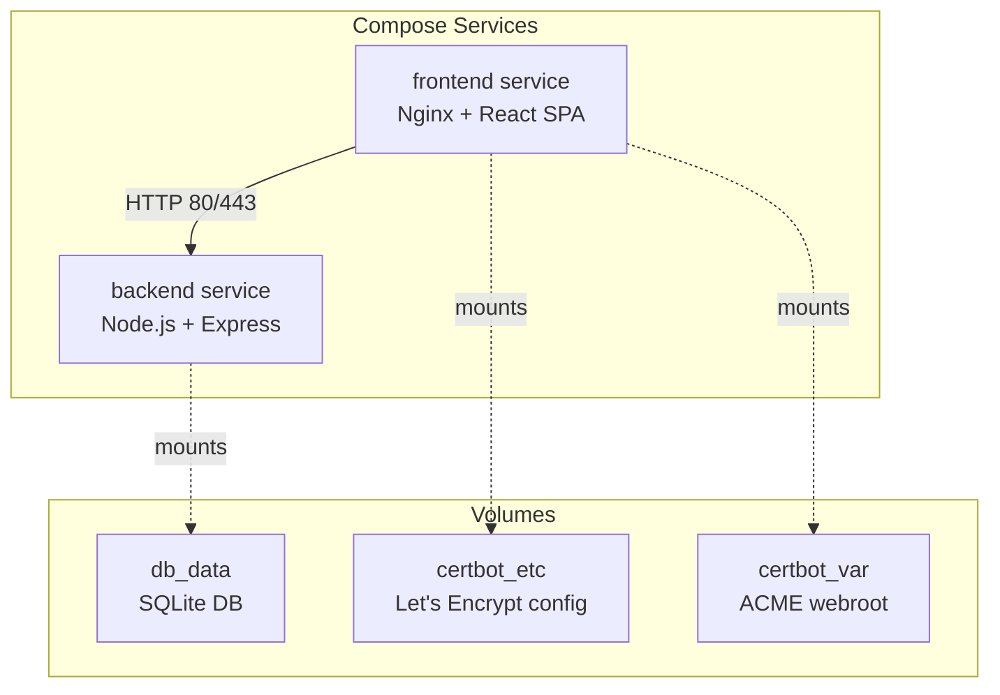
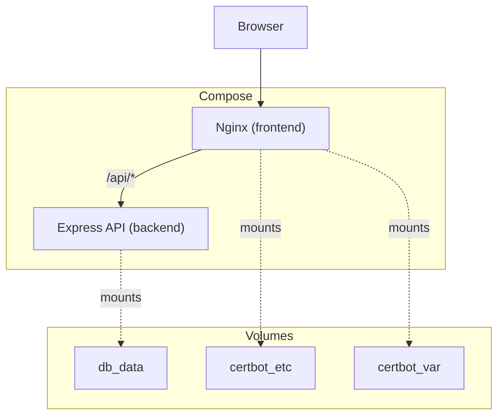
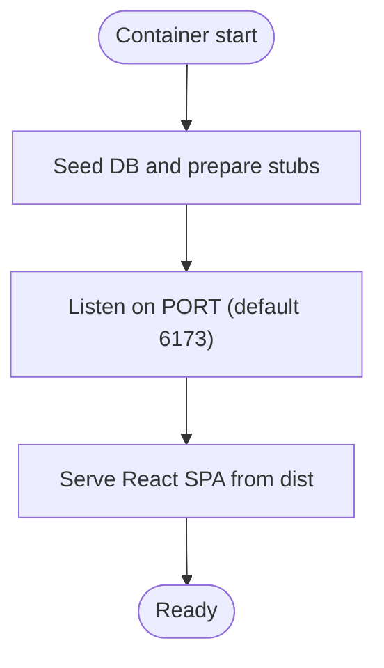
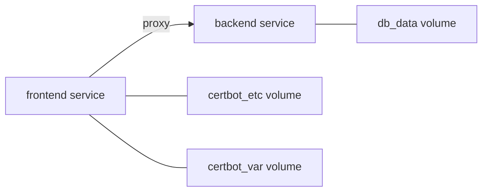
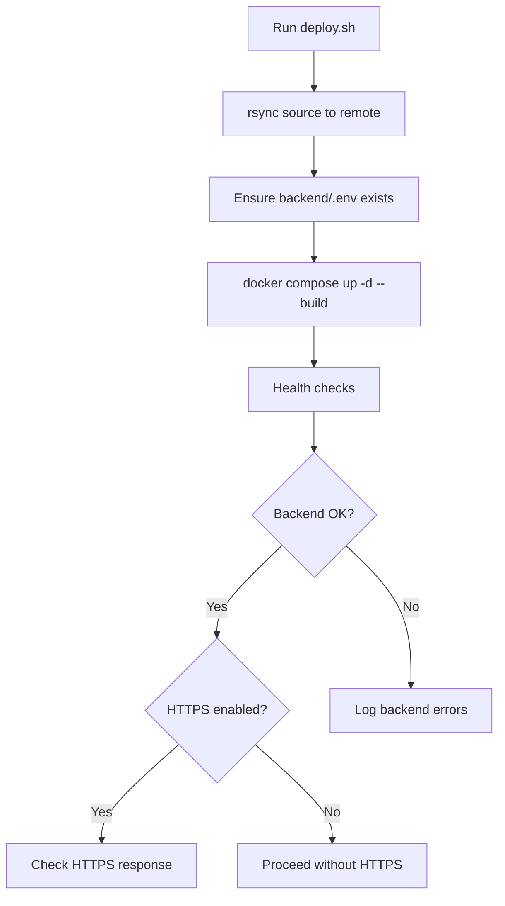
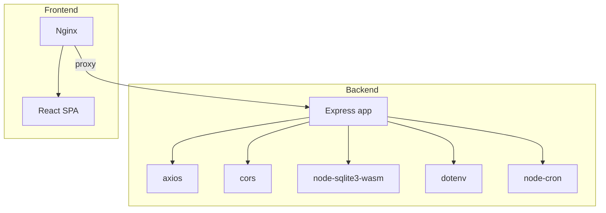

# Containerization & Docker

<cite>
**Referenced Files in This Document**
- [docker-compose.yml](file://docker-compose.yml)
- [backend/Dockerfile](file://backend/Dockerfile)
- [frontend/Dockerfile](file://frontend/Dockerfile)
- [frontend/entrypoint.sh](file://frontend/entrypoint.sh)
- [frontend/nginx.conf.template](file://frontend/nginx.conf.template)
- [frontend/nginx-ssl.conf.template](file://frontend/nginx-ssl.conf.template)
- [backend/package.json](file://backend/package.json)
- [frontend/package.json](file://frontend/package.json)
- [backend/server.js](file://backend/server.js)
- [deploy.sh](file://deploy.sh)
- [setup-ecs.sh](file://setup-ecs.sh)
</cite>

## Table of Contents
1. [Introduction](#introduction)
2. [Project Structure](#project-structure)
3. [Core Components](#core-components)
4. [Architecture Overview](#architecture-overview)
5. [Detailed Component Analysis](#detailed-component-analysis)
6. [Dependency Analysis](#dependency-analysis)
7. [Performance Considerations](#performance-considerations)
8. [Troubleshooting Guide](#troubleshooting-guide)
9. [Conclusion](#conclusion)
10. [Appendices](#appendices)

## Introduction
This document explains the Docker containerization strategy for WC26-Qwen-Qoder. It covers the multi-stage build process for backend and frontend, Docker Compose orchestration, environment handling, SSL provisioning via Nginx and Certbot, and operational guidance for security, resource limits, logging, and troubleshooting.

## Project Structure
The repository uses a two-service Docker Compose setup:
- backend: Node.js service exposing a REST API and serving static assets.
- frontend: Nginx-based service that proxies API traffic to backend and serves the React SPA.



**Diagram sources**
- [docker-compose.yml:1-34](file://docker-compose.yml#L1-L34)

**Section sources**
- [docker-compose.yml:1-34](file://docker-compose.yml#L1-L34)

## Core Components
- Backend service
  - Base image: node:20-alpine
  - Working directory: /app
  - Dependency installation: production-only (omit dev dependencies)
  - Port: 5173 (exposed)
  - Command: npm start (runs seeding and server)
- Frontend service
  - Multi-stage build:
    - Build stage: node:20-alpine, installs deps, builds SPA
    - Runtime stage: nginx:alpine, copies built assets and Nginx configs
  - Entrypoint: entrypoint.sh handles dynamic Nginx config generation, optional HTTPS provisioning, and cron-based renewal
  - Ports: 80, 443
  - Environment:
    - BACKEND_URL: http://backend:6173
    - DOMAIN and CERT_EMAIL for HTTPS automation
- Orchestration
  - docker-compose.yml defines two named services, environment variables, and persistent volumes for DB and certs.

**Section sources**
- [backend/Dockerfile:1-8](file://backend/Dockerfile#L1-L8)
- [frontend/Dockerfile:1-18](file://frontend/Dockerfile#L1-L18)
- [frontend/entrypoint.sh:1-48](file://frontend/entrypoint.sh#L1-L48)
- [docker-compose.yml:1-34](file://docker-compose.yml#L1-L34)

## Architecture Overview
The frontend Nginx container acts as the edge proxy. It:
- Proxies API requests to the backend service.
- Serves the React SPA statically.
- Manages HTTPS via Certbot and dynamic Nginx templates.



**Diagram sources**
- [docker-compose.yml:1-34](file://docker-compose.yml#L1-L34)
- [frontend/nginx.conf.template:1-25](file://frontend/nginx.conf.template#L1-L25)
- [frontend/nginx-ssl.conf.template:1-45](file://frontend/nginx-ssl.conf.template#L1-L45)
- [backend/server.js:1-25](file://backend/server.js#L1-L25)

## Detailed Component Analysis

### Backend Service (Node.js + Express)
- Build and runtime
  - Single-stage Dockerfile using node:20-alpine.
  - Production dependency installation to minimize image size.
  - Exposes port 5173; container listens on 6173 by default.
- Startup behavior
  - npm start runs seeding and starts the server.
  - Seeds knockout match stubs before accepting connections.
  - Serves React SPA from backend dist folder in production.
- API surface
  - CORS configured with FRONTEND_URL or default development origin.
  - Routes include teams, groups, matches, predictions, suspensions, analytics, and synchronization.
  - Scheduled jobs (node-cron) periodically sync live results and regenerate predictions.



**Diagram sources**
- [backend/server.js:642-680](file://backend/server.js#L642-L680)
- [backend/Dockerfile:6-7](file://backend/Dockerfile#L6-L7)

**Section sources**
- [backend/Dockerfile:1-8](file://backend/Dockerfile#L1-L8)
- [backend/package.json:6-12](file://backend/package.json#L6-L12)
- [backend/server.js:1-25](file://backend/server.js#L1-L25)

### Frontend Service (Nginx + React SPA)
- Multi-stage build
  - Build stage: installs dependencies and produces a static site.
  - Runtime stage: copies built assets and Nginx templates.
- Entrypoint logic
  - Generates Nginx config from template using BACKEND_URL.
  - Conditionally enables HTTPS if DOMAIN is set and a certificate exists.
  - Requests certificate via HTTP webroot challenge if missing.
  - Sets up daily cron job to renew certificates and reload Nginx.
  - Runs Nginx in foreground to keep container alive.
- Nginx templates
  - HTTP-only template for initial boot and ACME challenges.
  - HTTPS template with TLSv1.2+/HTTP2 and redirect from 80 to 443.

```mermaid
sequenceDiagram
participant C as "Container"
participant E as "Entrypoint"
participant N as "Nginx"
participant B as "Backend"
C->>E : Start
E->>E : Generate default.conf from template
alt DOMAIN present and cert exists
E->>E : Switch to HTTPS config
else DOMAIN present but no cert
E->>N : Start Nginx (background)
E->>E : Request certificate via webroot
E->>N : Reload Nginx
end
E->>E : Setup daily cron for renewal
E->>N : exec nginx -g "daemon off;"
N->>B : Proxy /api/ to backend
```

**Diagram sources**
- [frontend/entrypoint.sh:1-48](file://frontend/entrypoint.sh#L1-L48)
- [frontend/nginx.conf.template:1-25](file://frontend/nginx.conf.template#L1-L25)
- [frontend/nginx-ssl.conf.template:1-45](file://frontend/nginx-ssl.conf.template#L1-L45)
- [docker-compose.yml:14-28](file://docker-compose.yml#L14-L28)

**Section sources**
- [frontend/Dockerfile:1-18](file://frontend/Dockerfile#L1-L18)
- [frontend/entrypoint.sh:1-48](file://frontend/entrypoint.sh#L1-L48)
- [frontend/nginx.conf.template:1-25](file://frontend/nginx.conf.template#L1-L25)
- [frontend/nginx-ssl.conf.template:1-45](file://frontend/nginx-ssl.conf.template#L1-L45)

### Docker Compose Orchestration
- Services
  - backend: builds from ./backend, sets NODE_ENV and DB_PATH, mounts db_data volume, loads secrets from env_file.
  - frontend: builds from ./frontend, exposes 80/443, sets BACKEND_URL and optional DOMAIN/CERT_EMAIL, depends_on backend, mounts certbot volumes.
- Networking
  - Services communicate over the default Compose network; backend is not exposed to host.
- Volumes
  - db_data persists the SQLite database.
  - certbot_etc and certbot_var persist ACME artifacts and webroot.



**Diagram sources**
- [docker-compose.yml:1-34](file://docker-compose.yml#L1-L34)

**Section sources**
- [docker-compose.yml:1-34](file://docker-compose.yml#L1-L34)

### Deployment and Provisioning Scripts
- deploy.sh
  - Builds and restarts containers with docker compose up -d --build.
  - Performs health checks against backend API and frontend HTTPS.
  - Provides guidance to inspect logs on failure.
- setup-ecs.sh
  - Automates Alibaba Cloud ECS provisioning, Docker installation, uploads backend/.env, and triggers deploy.sh.



**Diagram sources**
- [deploy.sh:38-96](file://deploy.sh#L38-L96)

**Section sources**
- [deploy.sh:1-110](file://deploy.sh#L1-L110)
- [setup-ecs.sh:1-443](file://setup-ecs.sh#L1-L443)

## Dependency Analysis
- Backend
  - Dependencies include Express, CORS, sqlite driver, axios, node-cron, and dotenv.
  - Dev dependencies are omitted in production builds.
- Frontend
  - React SPA built with Vite; includes Tailwind and related tooling.
  - react-snap pre-rendering configuration is present.



**Diagram sources**
- [backend/package.json:14-22](file://backend/package.json#L14-L22)
- [frontend/package.json:38-48](file://frontend/package.json#L38-L48)
- [frontend/Dockerfile:8-10](file://frontend/Dockerfile#L8-L10)

**Section sources**
- [backend/package.json:14-30](file://backend/package.json#L14-L30)
- [frontend/package.json:38-70](file://frontend/package.json#L38-L70)

## Performance Considerations
- Image size and startup
  - Use production-only dependency installation in backend to reduce image size.
  - Nginx runtime stage avoids bundling build tools.
- Static asset delivery
  - Serving SPA from Nginx reduces Node.js overhead for static content.
- Network timeouts
  - Proxy read timeout is set to 60 seconds; adjust if upstream processing increases.
- Cron scheduling
  - Live sync and prediction regeneration are scheduled; ensure adequate CPU headroom for tournament period.

[No sources needed since this section provides general guidance]

## Troubleshooting Guide
- Backend not responding
  - Use docker compose logs backend to inspect initialization and seeding logs.
  - Confirm DB_PATH volume is mounted and accessible.
- Frontend HTTPS not active
  - Ensure DOMAIN is set and certificate files exist under /etc/letsencrypt/live/DOMAIN/fullchain.pem.
  - Check cron logs for renewal failures.
- Certificate acquisition failures
  - Verify DNS records for the domain and that port 80 is reachable.
  - Confirm ACME webroot path is writable inside the container.
- CORS or proxy issues
  - Validate BACKEND_URL matches the internal service name and port.
  - Check Nginx template substitutions and proxy headers.

**Section sources**
- [deploy.sh:82-96](file://deploy.sh#L82-L96)
- [frontend/entrypoint.sh:11-38](file://frontend/entrypoint.sh#L11-L38)
- [frontend/nginx.conf.template:13-19](file://frontend/nginx.conf.template#L13-L19)
- [frontend/nginx-ssl.conf.template:33-39](file://frontend/nginx-ssl.conf.template#L33-L39)

## Conclusion
The containerization strategy leverages a lean backend image, a multi-stage frontend build, and an Nginx-based runtime with automated HTTPS provisioning. The Compose setup ensures clean separation of concerns, persistent state, and secure edge routing.

[No sources needed since this section summarizes without analyzing specific files]

## Appendices

### Environment Variables and Secrets
- Backend
  - NODE_ENV: production
  - DB_PATH: /data/worldcup2026.db
  - FRONTEND_URL: controls CORS origin
  - PORT: overrides default 6173
  - Additional keys loaded from env_file
- Frontend
  - BACKEND_URL: http://backend:6173
  - DOMAIN: enables HTTPS and certificate automation
  - CERT_EMAIL: used for certificate registration

**Section sources**
- [docker-compose.yml:6-12](file://docker-compose.yml#L6-L12)
- [docker-compose.yml:20-24](file://docker-compose.yml#L20-L24)
- [backend/server.js:19-21](file://backend/server.js#L19-L21)
- [frontend/entrypoint.sh:14-15](file://frontend/entrypoint.sh#L14-L15)

### Security Best Practices
- Run containers without privileged access.
- Limit capabilities and disable unnecessary sysctls.
- Keep base images updated; pin versions where possible.
- Use non-root users in containers when feasible.
- Restrict inbound ports to 22, 80, 443 as configured.
- Rotate secrets and review env_file permissions.

[No sources needed since this section provides general guidance]

### Resource Limits and Logging
- Resource limits
  - Consider setting memory and CPU quotas for backend and frontend services in Compose for stability.
- Logging
  - Use docker compose logs to monitor service output.
  - Enable structured logging in backend for observability.
  - Persist logs externally if needed.

[No sources needed since this section provides general guidance]