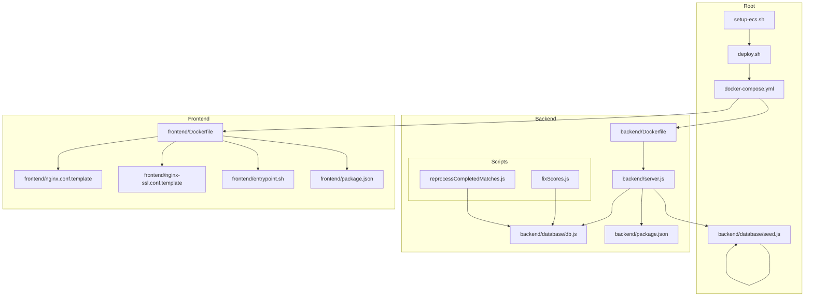
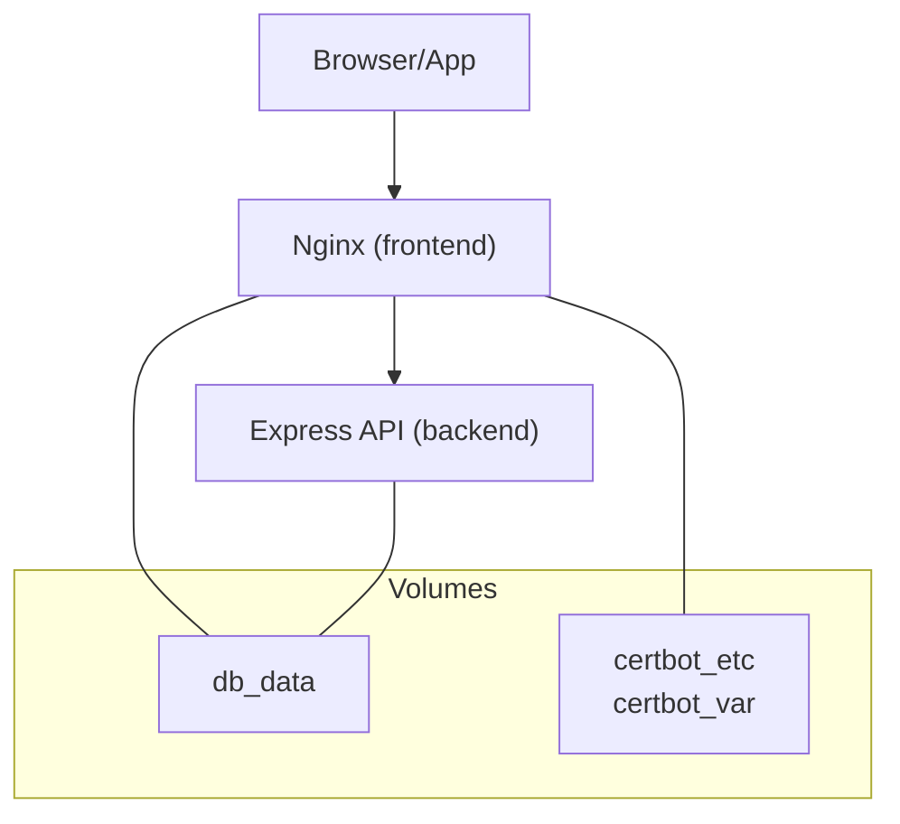
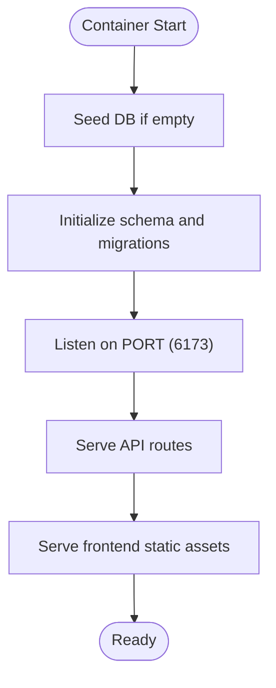
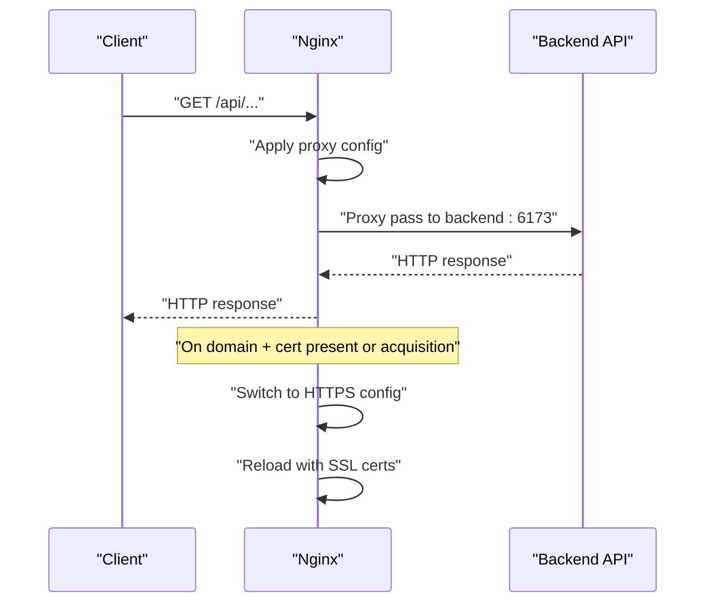
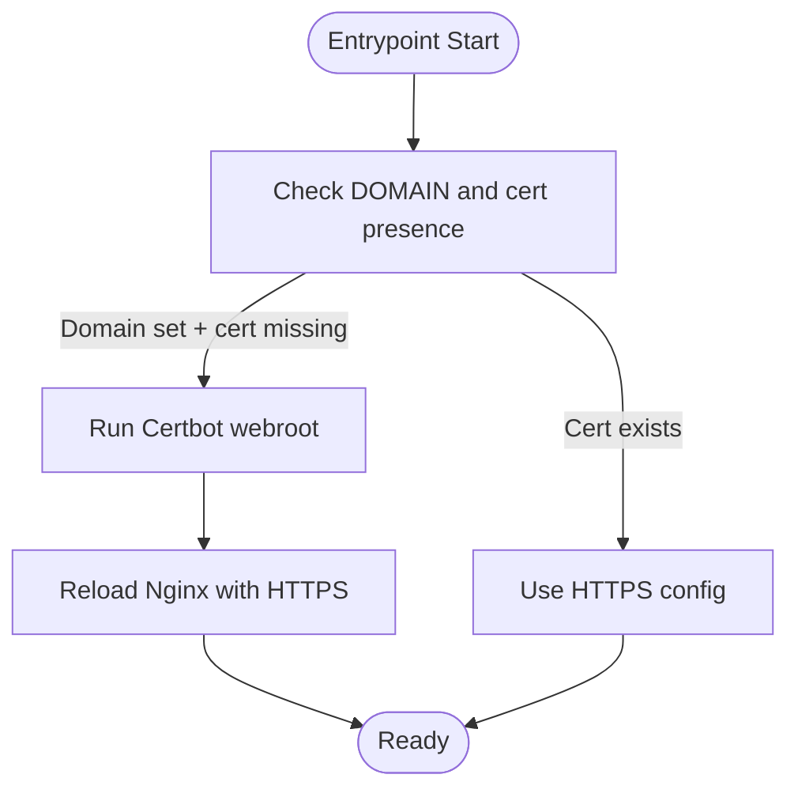
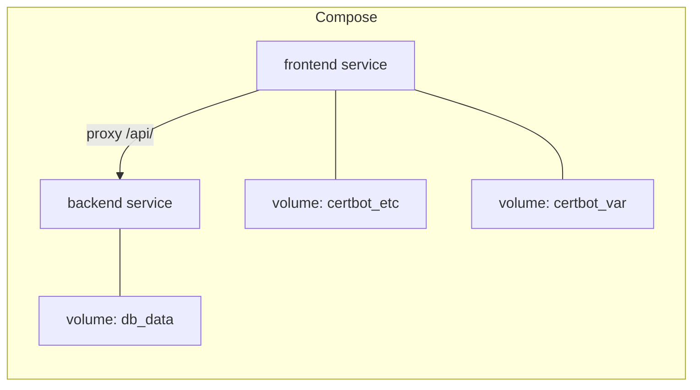
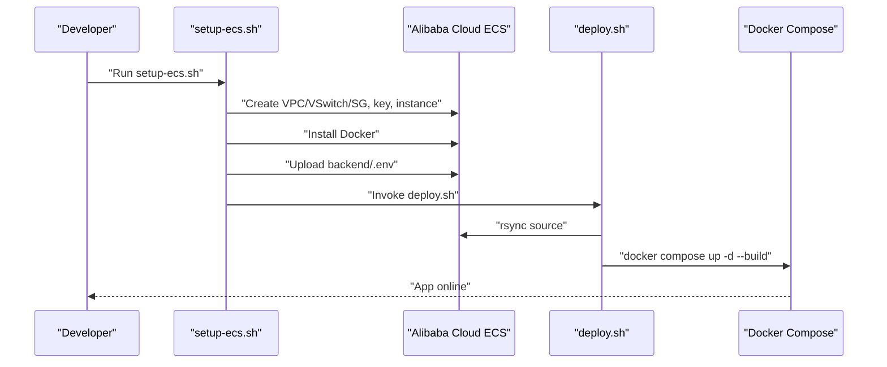
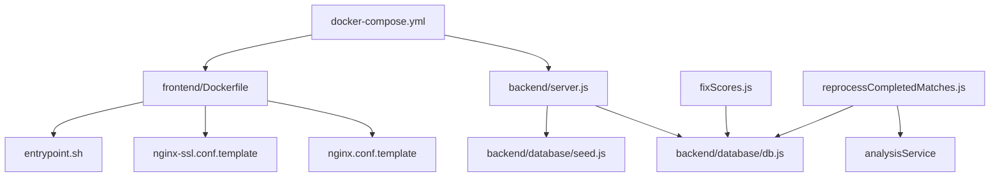

# Deployment & Infrastructure

<cite>
**Referenced Files in This Document**
- [docker-compose.yml](file://docker-compose.yml)
- [deploy.sh](file://deploy.sh)
- [setup-ecs.sh](file://setup-ecs.sh)
- [sync-db.sh](file://sync-db.sh)
- [backend/Dockerfile](file://backend/Dockerfile)
- [frontend/Dockerfile](file://frontend/Dockerfile)
- [frontend/nginx.conf.template](file://frontend/nginx.conf.template)
- [frontend/nginx-ssl.conf.template](file://frontend/nginx-ssl.conf.template)
- [frontend/entrypoint.sh](file://frontend/entrypoint.sh)
- [backend/server.js](file://backend/server.js)
- [backend/package.json](file://backend/package.json)
- [frontend/package.json](file://frontend/package.json)
- [backend/database/db.js](file://backend/database/db.js)
- [backend/database/seed.js](file://backend/database/seed.js)
- [backend/scripts/fixScores.js](file://backend/scripts/fixScores.js)
- [backend/scripts/reprocessCompletedMatches.js](file://backend/scripts/reprocessCompletedMatches.js)
</cite>

## Update Summary
**Changes Made**
- Added comprehensive database maintenance scripts section documenting fixScores.js and reprocessCompletedMatches.js
- Enhanced operational procedures with sync-db.sh for safe database deployment
- Updated maintenance procedures to include database repair and regeneration workflows
- Added database backup and restoration procedures
- Expanded troubleshooting guide with database-specific issues

## Table of Contents
1. [Introduction](#introduction)
2. [Project Structure](#project-structure)
3. [Core Components](#core-components)
4. [Architecture Overview](#architecture-overview)
5. [Detailed Component Analysis](#detailed-component-analysis)
6. [Database Maintenance Operations](#database-maintenance-operations)
7. [Dependency Analysis](#dependency-analysis)
8. [Performance Considerations](#performance-considerations)
9. [Troubleshooting Guide](#troubleshooting-guide)
10. [Conclusion](#conclusion)
11. [Appendices](#appendices)

## Introduction
This document provides comprehensive deployment and infrastructure guidance for WC26-Qwen-Qoder. It covers containerization with Docker, multi-stage builds, Docker Compose orchestration, Alibaba Cloud ECS provisioning, automated deployment pipelines, SSL/TLS with Let's Encrypt, Nginx reverse proxy and load balancing considerations, production environment setup, monitoring and maintenance, CI/CD integration, automated testing, rollback procedures, security configurations, firewall rules, and performance optimization.

## Project Structure
The repository is organized into:
- backend: Node.js Express API with SQLite WASM storage, scheduled tasks, and prediction engine
- frontend: React SPA built with Vite, served by Nginx inside a containerized setup
- backend/scripts: Operational maintenance scripts for database corrections and model regeneration
- Root-level deployment automation: Docker Compose, shell scripts for ECS provisioning and deployment



**Diagram sources**
- [docker-compose.yml](file://docker-compose.yml)
- [deploy.sh](file://deploy.sh)
- [setup-ecs.sh](file://setup-ecs.sh)
- [sync-db.sh](file://sync-db.sh)
- [backend/Dockerfile](file://backend/Dockerfile)
- [frontend/Dockerfile](file://frontend/Dockerfile)
- [frontend/nginx.conf.template](file://frontend/nginx.conf.template)
- [frontend/nginx-ssl.conf.template](file://frontend/nginx-ssl.conf.template)
- [frontend/entrypoint.sh](file://frontend/entrypoint.sh)
- [backend/server.js](file://backend/server.js)
- [backend/database/db.js](file://backend/database/db.js)
- [backend/database/seed.js](file://backend/database/seed.js)
- [backend/package.json](file://backend/package.json)
- [frontend/package.json](file://frontend/package.json)
- [backend/scripts/fixScores.js](file://backend/scripts/fixScores.js)
- [backend/scripts/reprocessCompletedMatches.js](file://backend/scripts/reprocessCompletedMatches.js)

**Section sources**
- [docker-compose.yml](file://docker-compose.yml)
- [deploy.sh](file://deploy.sh)
- [setup-ecs.sh](file://setup-ecs.sh)
- [sync-db.sh](file://sync-db.sh)
- [backend/Dockerfile](file://backend/Dockerfile)
- [frontend/Dockerfile](file://frontend/Dockerfile)
- [frontend/nginx.conf.template](file://frontend/nginx.conf.template)
- [frontend/nginx-ssl.conf.template](file://frontend/nginx-ssl.conf.template)
- [frontend/entrypoint.sh](file://frontend/entrypoint.sh)
- [backend/server.js](file://backend/server.js)
- [backend/database/db.js](file://backend/database/db.js)
- [backend/database/seed.js](file://backend/database/seed.js)
- [backend/package.json](file://backend/package.json)
- [frontend/package.json](file://frontend/package.json)
- [backend/scripts/fixScores.js](file://backend/scripts/fixScores.js)
- [backend/scripts/reprocessCompletedMatches.js](file://backend/scripts/reprocessCompletedMatches.js)

## Core Components
- Backend API service
  - Containerized with a minimal Node.js Alpine image
  - Exposes port 6173; runs seeding and server startup
  - Uses SQLite WASM with persistent volume for DB
- Frontend service
  - Multi-stage build: build stage produces static assets, runtime stage serves via Nginx
  - Includes Nginx templates for HTTP and HTTPS, and an entrypoint script to manage SSL
  - Exposes ports 80 and 443; proxies API requests to backend service
- Orchestration
  - Docker Compose defines two services and named volumes for persistence and certs
- Provisioning and deployment
  - Shell scripts automate Alibaba Cloud ECS creation, Docker installation, environment upload, and deployment via Docker Compose
- Database maintenance scripts
  - Operational scripts for fixing match scores, regenerating model performance records, and safe database deployment

**Section sources**
- [backend/Dockerfile](file://backend/Dockerfile)
- [frontend/Dockerfile](file://frontend/Dockerfile)
- [docker-compose.yml](file://docker-compose.yml)
- [backend/server.js](file://backend/server.js)
- [backend/database/db.js](file://backend/database/db.js)
- [frontend/nginx.conf.template](file://frontend/nginx.conf.template)
- [frontend/nginx-ssl.conf.template](file://frontend/nginx-ssl.conf.template)
- [frontend/entrypoint.sh](file://frontend/entrypoint.sh)
- [deploy.sh](file://deploy.sh)
- [setup-ecs.sh](file://setup-ecs.sh)
- [backend/scripts/fixScores.js](file://backend/scripts/fixScores.js)
- [backend/scripts/reprocessCompletedMatches.js](file://backend/scripts/reprocessCompletedMatches.js)

## Architecture Overview
The system runs as two orchestrated containers behind Nginx:
- Nginx handles inbound HTTP/HTTPS traffic, reverse proxies API requests to the backend service, and manages SSL certificates via Certbot
- Backend serves the API and static assets in production, with scheduled jobs and SQLite WASM persistence



**Diagram sources**
- [docker-compose.yml](file://docker-compose.yml)
- [frontend/nginx.conf.template](file://frontend/nginx.conf.template)
- [frontend/nginx-ssl.conf.template](file://frontend/nginx-ssl.conf.template)
- [backend/server.js](file://backend/server.js)

## Detailed Component Analysis

### Backend Service
- Containerization
  - Base image: node:20-alpine
  - Working directory: /app
  - Production install: npm ci with dev dependencies omitted
  - Exposed port: 5173 (mapped to 6173 in Compose)
  - Command: npm start (runs seeding then server)
- Runtime behavior
  - CORS configured for frontend URL
  - SQLite WASM database initialized with schema and migrations
  - Static assets served from frontend dist in production
  - Scheduled jobs for live sync and prediction generation
- Data persistence
  - Persistent volume mounted at /data for DB file
  - DB path configurable via environment variable



**Diagram sources**
- [backend/Dockerfile](file://backend/Dockerfile)
- [backend/server.js](file://backend/server.js)
- [backend/database/db.js](file://backend/database/db.js)
- [backend/database/seed.js](file://backend/database/seed.js)

**Section sources**
- [backend/Dockerfile](file://backend/Dockerfile)
- [backend/server.js](file://backend/server.js)
- [backend/database/db.js](file://backend/database/db.js)
- [backend/database/seed.js](file://backend/database/seed.js)

### Frontend Service (Nginx + React SPA)
- Multi-stage build
  - Build stage: Node.js Alpine, installs deps, builds static assets
  - Runtime stage: Nginx Alpine, copies built assets and config templates
- Nginx configuration
  - HTTP template: handles ACME challenges and reverse proxies /api/ to backend
  - HTTPS template: redirects HTTP to HTTPS, serves SSL with TLSv1.2+ and modern ciphers
- Entrypoint script
  - Generates configs from templates, obtains/reloads SSL via Certbot when domain is set, sets up daily renewal cron



**Diagram sources**
- [frontend/Dockerfile](file://frontend/Dockerfile)
- [frontend/nginx.conf.template](file://frontend/nginx.conf.template)
- [frontend/nginx-ssl.conf.template](file://frontend/nginx-ssl.conf.template)
- [frontend/entrypoint.sh](file://frontend/entrypoint.sh)
- [docker-compose.yml](file://docker-compose.yml)

**Section sources**
- [frontend/Dockerfile](file://frontend/Dockerfile)
- [frontend/nginx.conf.template](file://frontend/nginx.conf.template)
- [frontend/nginx-ssl.conf.template](file://frontend/nginx-ssl.conf.template)
- [frontend/entrypoint.sh](file://frontend/entrypoint.sh)
- [docker-compose.yml](file://docker-compose.yml)

### SSL Certificate Management with Let's Encrypt
- Workflow
  - On container start, if DOMAIN is set and no certificate exists, Nginx starts, Certbot obtains a certificate via webroot challenge, then reloads Nginx with HTTPS config
  - Daily renewal cron is installed to keep certificates fresh
- Templates
  - ACME challenge locations are exposed via both HTTP and HTTPS templates
  - HTTPS template uses placeholders resolved at runtime



**Diagram sources**
- [frontend/entrypoint.sh](file://frontend/entrypoint.sh)
- [frontend/nginx.conf.template](file://frontend/nginx.conf.template)
- [frontend/nginx-ssl.conf.template](file://frontend/nginx-ssl.conf.template)

**Section sources**
- [frontend/entrypoint.sh](file://frontend/entrypoint.sh)
- [frontend/nginx.conf.template](file://frontend/nginx.conf.template)
- [frontend/nginx-ssl.conf.template](file://frontend/nginx-ssl.conf.template)

### Docker Compose Orchestration
- Services
  - backend: builds from ./backend, sets NODE_ENV and DB_PATH, mounts db_data volume
  - frontend: builds from ./frontend, exposes 80/443, sets BACKEND_URL and domain/email for SSL, depends_on backend, mounts certbot volumes
- Volumes
  - db_data persists SQLite DB
  - certbot_etc and certbot_var persist Certbot state and challenges



**Diagram sources**
- [docker-compose.yml](file://docker-compose.yml)

**Section sources**
- [docker-compose.yml](file://docker-compose.yml)

### Alibaba Cloud ECS Provisioning and Automated Deployment
- setup-ecs.sh
  - Creates VPC and VSwitch if needed, security group with ports 22, 80, 443
  - Creates/uses SSH key pair, creates ECS instance, waits for boot
  - Installs Docker, uploads backend/.env, then invokes deploy.sh
- deploy.sh
  - rsyncs project excluding unnecessary files and DB backups
  - Ensures backend/.env exists on remote host
  - Builds and starts containers with docker compose, prunes images
  - Performs health checks against backend API and HTTPS endpoint if domain is set



**Diagram sources**
- [setup-ecs.sh](file://setup-ecs.sh)
- [deploy.sh](file://deploy.sh)
- [docker-compose.yml](file://docker-compose.yml)

**Section sources**
- [setup-ecs.sh](file://setup-ecs.sh)
- [deploy.sh](file://deploy.sh)
- [docker-compose.yml](file://docker-compose.yml)

### Reverse Proxy and Load Balancing Considerations
- Nginx reverse proxy
  - Proxies /api/ to backend service at http://backend:6173
  - Sets X-Real-IP and Host headers for backend logging and routing
  - HTTP to HTTPS redirect enforced in HTTPS template
- Scaling and load balancing
  - Current Compose setup runs single instances of backend and frontend
  - For production scaling, consider:
    - Multiple frontend replicas behind a load balancer
    - Horizontal scaling of backend replicas with sticky sessions if needed
    - Shared persistent storage or DB clustering for multi-instance backend
  - Nginx supports HTTP/2 and modern TLS; ensure upstream timeouts and health checks are tuned

**Section sources**
- [frontend/nginx.conf.template](file://frontend/nginx.conf.template)
- [frontend/nginx-ssl.conf.template](file://frontend/nginx-ssl.conf.template)
- [docker-compose.yml](file://docker-compose.yml)

### Production Environment Setup
- Environment variables
  - Backend: NODE_ENV=production, DB_PATH, FRONTEND_URL for CORS, and API keys in backend/.env
  - Frontend: BACKEND_URL, DOMAIN, CERT_EMAIL
- Persistence
  - db_data volume ensures DB continuity across deploys
  - certbot_* volumes persist certificates and ACME challenges
- Health checks
  - deploy.sh performs curl checks against backend API and HTTPS endpoint

**Section sources**
- [docker-compose.yml](file://docker-compose.yml)
- [deploy.sh](file://deploy.sh)
- [backend/server.js](file://backend/server.js)
- [backend/database/db.js](file://backend/database/db.js)

### Monitoring Strategies
- Logs
  - Use docker compose logs to monitor backend and frontend
  - Nginx access/error logs are available inside the frontend container
- Metrics
  - Integrate application-level metrics and system metrics (CPU, memory, disk) via platform-specific tools
- Uptime and health
  - curl-based health checks in deploy.sh can be extended to external monitoring systems

**Section sources**
- [deploy.sh](file://deploy.sh)
- [frontend/entrypoint.sh](file://frontend/entrypoint.sh)

## Database Maintenance Operations

### Database Repair Scripts

#### fixScores.js - Correct Completed Group Stage Match Scores
This script addresses discrepancies in completed group stage match scores by applying verified corrections from Wikipedia 2026 FIFA World Cup data.

**Key Features:**
- Batch updates 26 group stage matches with correct scores
- Prevents overwriting already completed matches
- Atomic transaction processing with rollback on failure
- Comprehensive logging of updates and skipped records

**Usage:**
```bash
# Run from project root
node backend/scripts/fixScores.js
```

**Supported Match Types:**
- Regular results (e.g., BRA 3-0 SCO, NED 3-1 TUN)
- Draws (e.g., AUS 0-0 PAR, JPN 1-1 SWE)
- Winner determination for all completed matches

**Section sources**
- [backend/scripts/fixScores.js](file://backend/scripts/fixScores.js)

#### reprocessCompletedMatches.js - Regenerate Model Performance Records
This script reprocesses completed matches to regenerate model performance records, update ELO ratings, and trigger bracket advancement.

**Key Features:**
- Temporarily resets match status to SCHEDULED for reprocessing
- Calls recordMatchResult() to handle all side effects
- Manual restoration on processing failures
- Selective processing of completed matches

**Usage:**
```bash
# Run from project root
node backend/scripts/reprocessCompletedMatches.js
```

**Processing Strategy:**
1. Validates match existence and completion status
2. Temporarily resets match to SCHEDULED state
3. Executes recordMatchResult() with original scores
4. Restores match state on failure

**Section sources**
- [backend/scripts/reprocessCompletedMatches.js](file://backend/scripts/reprocessCompletedMatches.js)

### Safe Database Deployment with sync-db.sh

#### sync-db.sh - Automated Database Synchronization
This script provides a safe mechanism for pushing local database fixes to production with automatic backup and verification.

**Key Features:**
- Automatic production database backup before overwrite
- Local backup preservation for restoration
- Container-safe database replacement
- Backend service restart and health verification
- Comprehensive progress reporting

**Usage Scenarios:**
```bash
# Basic usage with defaults
bash sync-db.sh

# Custom local database path
LOCAL_DB=backend/data/worldcup2026.db bash sync-db.sh

# Custom ECS configuration
ECS_IP=43.98.192.47 ECS_USER=root ECS_KEY=~/.ssh/aliyun-ecs.pem bash sync-db.sh
```

**Process Flow:**
1. **Backup Phase:** Pulls production DB to local backup
2. **Deployment Phase:** Pushes local DB to production container
3. **Verification Phase:** Restarts backend and validates completion count

**Safety Features:**
- Atomic container replacement using temporary files
- Timestamped backup naming for traceability
- Health check verification after deployment
- Error handling with manual restoration instructions

**Section sources**
- [sync-db.sh](file://sync-db.sh)

### Database Maintenance Procedures

#### Routine Maintenance Tasks
- **Score Corrections:** Use fixScores.js for batch score updates
- **Model Regeneration:** Use reprocessCompletedMatches.js for performance record updates
- **Backup Verification:** Regularly verify backup integrity and restoration capability
- **Schema Validation:** Monitor for database schema changes affecting operations

#### Emergency Restoration
1. **Identify Backup:** Locate timestamped backup in backend/data/
2. **Restore Process:** Use sync-db.sh with backup file as LOCAL_DB
3. **Validation:** Verify match counts and application functionality
4. **Monitoring:** Monitor logs for any post-restoration issues

**Section sources**
- [backend/scripts/fixScores.js](file://backend/scripts/fixScores.js)
- [backend/scripts/reprocessCompletedMatches.js](file://backend/scripts/reprocessCompletedMatches.js)
- [sync-db.sh](file://sync-db.sh)

## Maintenance Procedures
- Database maintenance
  - SQLite WASM is used; ensure regular backups of db_data volume
  - Schema migrations are applied at startup; verify DB_PATH correctness
  - Use fixScores.js for batch score corrections
  - Use reprocessCompletedMatches.js for model regeneration
  - Use sync-db.sh for safe database deployments with automatic backups
- Certificate renewal
  - Daily cron is installed for renewal; verify crond is running inside the frontend container
- Image cleanup
  - deploy.sh prunes unused images after deployment

**Section sources**
- [backend/database/db.js](file://backend/database/db.js)
- [frontend/entrypoint.sh](file://frontend/entrypoint.sh)
- [deploy.sh](file://deploy.sh)
- [backend/scripts/fixScores.js](file://backend/scripts/fixScores.js)
- [backend/scripts/reprocessCompletedMatches.js](file://backend/scripts/reprocessCompletedMatches.js)
- [sync-db.sh](file://sync-db.sh)

### CI/CD Pipeline, Automated Testing, and Rollback
- CI/CD
  - Recommended: GitHub Actions or Jenkins pipeline to build images, push to registry, and trigger deploy.sh remotely
  - Keep backend/.env secret and inject via CI secrets
- Automated testing
  - Backend tests: npm test
  - Frontend tests: npm test or npm run test:run
- Rollback
  - Use docker compose pull and down/up to roll back to previous image tag
  - Maintain image tagging and registry retention policies

**Section sources**
- [backend/package.json](file://backend/package.json)
- [frontend/package.json](file://frontend/package.json)
- [deploy.sh](file://deploy.sh)

### Security Configurations and Firewall Rules
- Security group rules
  - setup-ecs.sh opens ports 22, 80, 443; restrict ingress as needed for production
- Nginx hardening
  - HTTPS template enforces TLSv1.2+, strong ciphers, and session caching
- Secrets
  - backend/.env must be uploaded securely and not committed to source control
- Least privilege
  - Run containers as non-root where feasible; ensure minimal capabilities

**Section sources**
- [setup-ecs.sh](file://setup-ecs.sh)
- [frontend/nginx-ssl.conf.template](file://frontend/nginx-ssl.conf.template)
- [setup-ecs.sh](file://setup-ecs.sh)

## Dependency Analysis
- Internal dependencies
  - backend/server.js depends on backend/database/db.js and backend/database/seed.js
  - frontend Dockerfile depends on built assets from frontend build stage
  - fixScores.js depends on backend/database/db.js for database operations
  - reprocessCompletedMatches.js depends on backend/database/db.js and analysisService
- External dependencies
  - Backend: Express, SQLite WASM, Axios, CORS, node-cron
  - Frontend: React, Vite, TailwindCSS, testing libraries



**Diagram sources**
- [backend/server.js](file://backend/server.js)
- [backend/database/db.js](file://backend/database/db.js)
- [backend/database/seed.js](file://backend/database/seed.js)
- [frontend/Dockerfile](file://frontend/Dockerfile)
- [frontend/nginx.conf.template](file://frontend/nginx.conf.template)
- [frontend/nginx-ssl.conf.template](file://frontend/nginx-ssl.conf.template)
- [frontend/entrypoint.sh](file://frontend/entrypoint.sh)
- [docker-compose.yml](file://docker-compose.yml)
- [backend/scripts/fixScores.js](file://backend/scripts/fixScores.js)
- [backend/scripts/reprocessCompletedMatches.js](file://backend/scripts/reprocessCompletedMatches.js)

**Section sources**
- [backend/server.js](file://backend/server.js)
- [backend/database/db.js](file://backend/database/db.js)
- [backend/database/seed.js](file://backend/database/seed.js)
- [frontend/Dockerfile](file://frontend/Dockerfile)
- [frontend/nginx.conf.template](file://frontend/nginx.conf.template)
- [frontend/nginx-ssl.conf.template](file://frontend/nginx-ssl.conf.template)
- [frontend/entrypoint.sh](file://frontend/entrypoint.sh)
- [docker-compose.yml](file://docker-compose.yml)
- [backend/scripts/fixScores.js](file://backend/scripts/fixScores.js)
- [backend/scripts/reprocessCompletedMatches.js](file://backend/scripts/reprocessCompletedMatches.js)

## Performance Considerations
- Container sizing
  - Current setup uses lightweight Alpine images; ensure CPU/memory limits are appropriate for workload
- Database
  - SQLite WASM is single-writer; avoid concurrent writes; consider read replicas or external DB for scale
- Nginx
  - Enable gzip/static caching for frontend assets; adjust proxy_read_timeout for long-running predictions
- CDN and caching
  - Place a CDN in front of Nginx for global distribution and reduced origin load
- Autoscaling
  - Scale frontend replicas behind a load balancer; backend scaling depends on DB constraints

## Troubleshooting Guide
- Backend not responding
  - Check docker compose logs backend
  - Verify DB_PATH and permissions; confirm db_data volume mounted
- HTTPS not active
  - Confirm DOMAIN and CERT_EMAIL are set
  - Inspect Certbot logs and cron status inside frontend container
- API proxy errors
  - Ensure BACKEND_URL points to backend service and port
  - Verify Nginx proxy headers and timeouts
- ECS connectivity
  - Confirm security group allows 22/80/443 and SSH key is correct
  - Use SSH to inspect container logs and filesystem
- Database operation failures
  - Check fixScores.js and reprocessCompletedMatches.js logs for specific error messages
  - Verify database transactions and rollback procedures
  - Use sync-db.sh for safe database restoration from backups

**Section sources**
- [deploy.sh](file://deploy.sh)
- [frontend/entrypoint.sh](file://frontend/entrypoint.sh)
- [docker-compose.yml](file://docker-compose.yml)
- [setup-ecs.sh](file://setup-ecs.sh)
- [backend/scripts/fixScores.js](file://backend/scripts/fixScores.js)
- [backend/scripts/reprocessCompletedMatches.js](file://backend/scripts/reprocessCompletedMatches.js)
- [sync-db.sh](file://sync-db.sh)

## Conclusion
WC26-Qwen-Qoder is designed for straightforward deployment using Docker and Docker Compose, with automated provisioning on Alibaba Cloud ECS and robust SSL/TLS via Let's Encrypt. The architecture separates concerns between Nginx (reverse proxy and SSL) and the backend API, with SQLite WASM for persistence. The addition of comprehensive database maintenance scripts enhances operational capabilities for score corrections, model regeneration, and safe database deployments. For production, extend with horizontal scaling, CDN, monitoring, and hardened security practices.

## Appendices
- Environment variables reference
  - Backend: NODE_ENV, DB_PATH, FRONTEND_URL, API keys in backend/.env
  - Frontend: BACKEND_URL, DOMAIN, CERT_EMAIL
- Useful commands
  - docker compose logs -f backend
  - docker compose exec frontend cat /var/log/nginx/access.log
  - node backend/scripts/fixScores.js
  - node backend/scripts/reprocessCompletedMatches.js
  - bash sync-db.sh