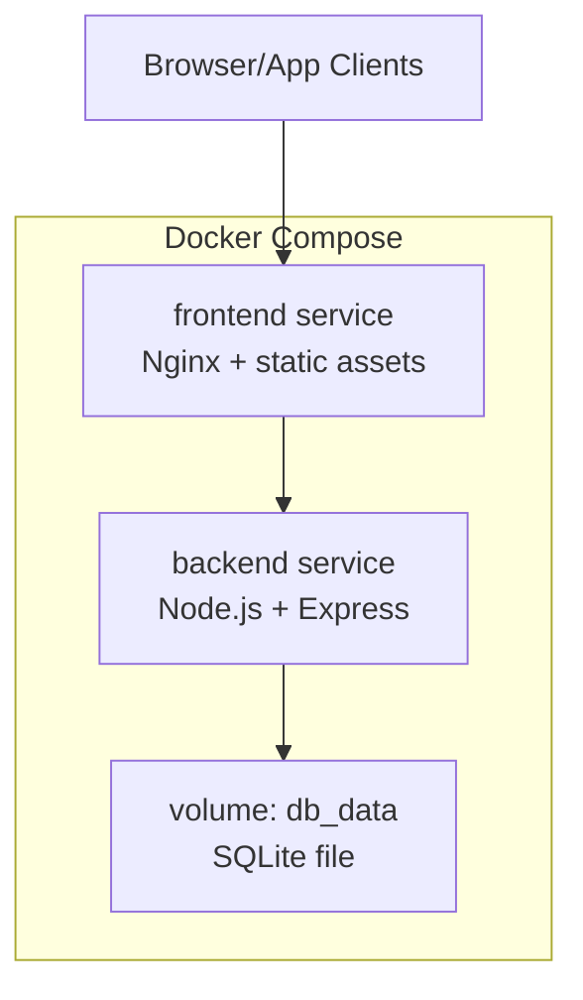
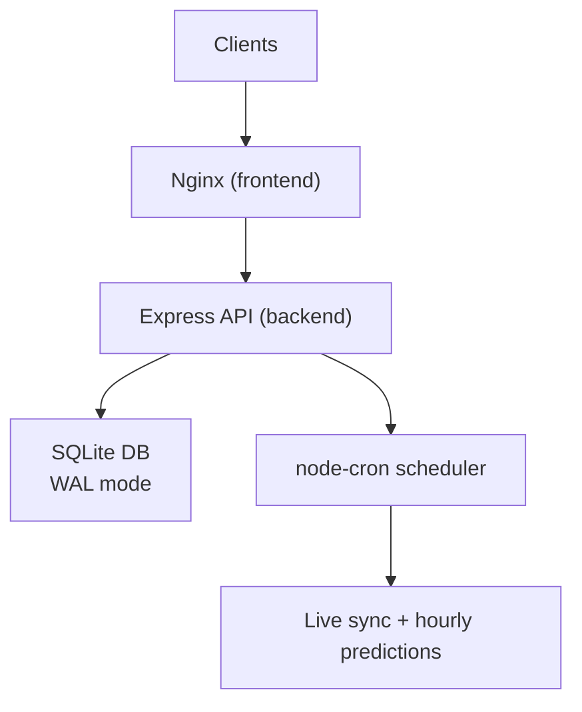
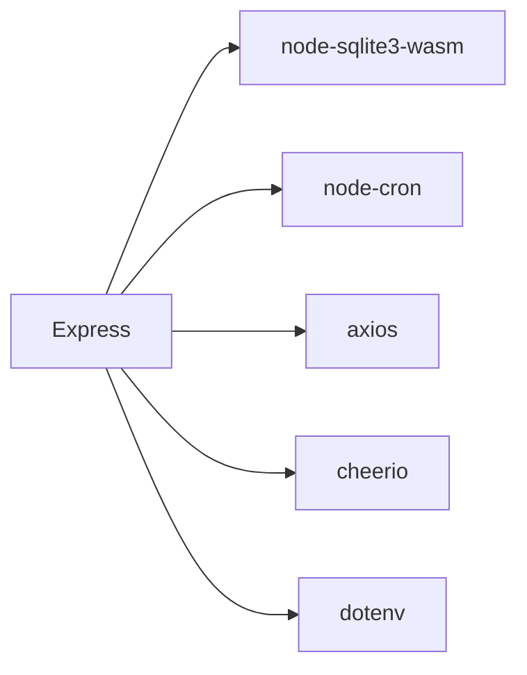

# Production Monitoring & Maintenance

<cite>
**Referenced Files in This Document**
- [README.md](file://README.md)
- [SETUP.md](file://SETUP.md)
- [deploy.sh](file://deploy.sh)
- [docker-compose.yml](file://docker-compose.yml)
- [backend/package.json](file://backend/package.json)
- [frontend/package.json](file://frontend/package.json)
- [backend/server.js](file://backend/server.js)
- [backend/database/db.js](file://backend/database/db.js)
- [backend/services/dataService.js](file://backend/services/dataService.js)
- [backend/services/predictionEngine.js](file://backend/services/predictionEngine.js)
- [backend/services/agents/orchestratorAgent.js](file://backend/services/agents/orchestratorAgent.js)
- [backend/scripts/regen-predictions.js](file://backend/scripts/regen-predictions.js)
- [backend/scripts/backfillPoints.js](file://backend/scripts/backfillPoints.js)
</cite>

## Table of Contents
1. [Introduction](#introduction)
2. [Project Structure](#project-structure)
3. [Core Components](#core-components)
4. [Architecture Overview](#architecture-overview)
5. [Detailed Component Analysis](#detailed-component-analysis)
6. [Dependency Analysis](#dependency-analysis)
7. [Performance Considerations](#performance-considerations)
8. [Troubleshooting Guide](#troubleshooting-guide)
9. [Conclusion](#conclusion)
10. [Appendices](#appendices)

## Introduction
This document provides production-grade monitoring and maintenance guidance for WC26-Qwen-Qoder. It covers system health monitoring, log aggregation, alerting, performance dashboards, database health checks, API response time tracking, maintenance procedures, scheduled tasks, automated cleanup, incident response, backup verification, disaster recovery drills, capacity planning, scaling considerations, and cost monitoring. The guidance is grounded in the repository’s deployment, runtime, and operational artifacts.

## Project Structure
The application is a dual-container Docker Compose stack hosting a Node.js backend API and an Nginx-managed frontend. The backend exposes a REST API, runs scheduled tasks, and persists state to an SQLite database mounted as a named volume. The frontend is served statically by the backend in production.

**Diagram sources**
- [docker-compose.yml:1-34](file://docker-compose.yml#L1-L34)

**Section sources**
- [README.md:231-263](file://README.md#L231-L263)
- [SETUP.md:124-160](file://SETUP.md#L124-L160)
- [docker-compose.yml:1-34](file://docker-compose.yml#L1-L34)

## Core Components
- Backend API (Express)
  - Routes for teams, groups, matches, predictions, analytics, and tournament bracket.
  - Scheduled tasks: live result sync and hourly prediction regeneration.
  - Database: SQLite with WAL mode and migrations.
- Data Services
  - Live data fetching from football-data.org API and web scraping fallback.
  - Web intelligence parsing via Qwen LLM with anti-hallucination verification.
- Prediction Engine
  - Dixon-Coles bivariate Poisson backbone with log-pool blending.
  - Optional multi-agent orchestration with conflict detection and arbitration.
- Frontend
  - Static React build served by backend in production.
- Deployment
  - Automated ECS provisioning and rsync-based deployment with health checks.

**Section sources**
- [backend/server.js:18-681](file://backend/server.js#L18-L681)
- [backend/database/db.js:1-252](file://backend/database/db.js#L1-L252)
- [backend/services/dataService.js:1-583](file://backend/services/dataService.js#L1-L583)
- [backend/services/predictionEngine.js:1-800](file://backend/services/predictionEngine.js#L1-L800)
- [backend/services/agents/orchestratorAgent.js:1-473](file://backend/services/agents/orchestratorAgent.js#L1-L473)
- [deploy.sh:1-110](file://deploy.sh#L1-L110)
- [docker-compose.yml:1-34](file://docker-compose.yml#L1-L34)

## Architecture Overview
The production runtime consists of:
- Backend container exposing HTTP/HTTPS endpoints and serving static assets.
- Frontend container/proxy handling TLS termination and caching.
- Named volumes for database persistence and certificate storage.
- Scheduled tasks orchestrated via node-cron inside the backend container.

**Diagram sources**
- [docker-compose.yml:14-29](file://docker-compose.yml#L14-L29)
- [backend/server.js:584-633](file://backend/server.js#L584-L633)
- [backend/database/db.js:15-18](file://backend/database/db.js#L15-L18)

## Detailed Component Analysis

### System Health Monitoring
- Container health
  - Both services use restart policies; monitor container status and logs via Docker Compose.
- API health endpoint
  - Use the existing deployment health check pattern: curl against the backend API and frontend domains.
- Database connectivity
  - Verify SQLite initialization and WAL pragmas on startup; watch for stale locks and busy timeouts.

Recommended checks:
- Backend responds to GET /api/teams.
- Frontend responds to HTTPS domain (if configured).
- Database schema initialized and migrations applied.

**Section sources**
- [deploy.sh:81-96](file://deploy.sh#L81-L96)
- [backend/server.js:644-647](file://backend/server.js#L644-L647)
- [backend/database/db.js:10-21](file://backend/database/db.js#L10-L21)

### Log Aggregation and Alerting
- Current state
  - Logs are emitted to stdout/stderr by Docker containers. No centralized log shipper is configured in the stack.
- Recommended approach
  - Ship logs to a central collector (e.g., syslog-ng, Fluent Bit, or cloud-native solutions).
  - Define alerts for:
    - Backend crash loops or restart storms.
    - SQLite busy timeout errors.
    - Cron failures (live sync or prediction regeneration).
    - Missing DashScope or football-data.org credentials.
- Alert targets
  - Pager duty, Slack, or email depending on your stack.

[No sources needed since this section provides general guidance]

### Performance Monitoring Dashboards
- Backend metrics
  - Track request latency, throughput, and error rates for each route.
  - Monitor CPU/memory usage of the backend container.
- Database metrics
  - Monitor SQLite file size, WAL file growth, and vacuum frequency.
- AI inference metrics
  - Track Qwen API latency, token usage, and error rates.
- Frontend metrics
  - Monitor CDN/edge caching effectiveness and TLS handshake success.

[No sources needed since this section provides general guidance]

### Database Health Checks
- Schema and migrations
  - Ensure model_config seeding and migration steps are executed on startup.
- Locks and timeouts
  - Watch for stale .lock directories and busy_timeout violations.
- Integrity
  - Periodic PRAGMA integrity_check and analyze.
- Backups
  - Snapshot the db_data volume and verify restore procedure.

**Section sources**
- [backend/database/db.js:23-249](file://backend/database/db.js#L23-L249)
- [backend/database/db.js:15-16](file://backend/database/db.js#L15-L16)

### API Response Time Tracking
- Instrument endpoints with middleware to record response times and error codes.
- Aggregate metrics per route and globally.
- Alert on sustained increases in P95/P99 latency.

[No sources needed since this section provides general guidance]

### Maintenance Procedures

#### Scheduled Tasks
- Live result synchronization
  - Runs every 5 minutes during tournament; transitions matches to LIVE and records results.
- Hourly prediction regeneration
  - Runs across SGT hours to refresh predictions for upcoming matches.

Operational notes:
- Cron tasks are timezone-aware (Asia/Singapore).
- Prediction regeneration respects a cooldown and tournament end date.

**Section sources**
- [backend/server.js:584-633](file://backend/server.js#L584-L633)
- [backend/server.js:596-628](file://backend/server.js#L596-L628)

#### Automated Cleanup Processes
- Web intelligence cache TTLs
  - Form/H2H caches expire after defined hours; Intel cache refreshes more frequently.
- Docker images
  - Deployment script prunes unused images after rebuild.

**Section sources**
- [backend/services/dataService.js:30-41](file://backend/services/dataService.js#L30-L41)
- [deploy.sh:77](file://deploy.sh#L77)

#### Administrative Scripts
- Regenerate predictions for all scheduled matches.
- Backfill model performance points and correctness after rule changes.

**Section sources**
- [backend/scripts/regen-predictions.js:1-31](file://backend/scripts/regen-predictions.js#L1-L31)
- [backend/scripts/backfillPoints.js:1-77](file://backend/scripts/backfillPoints.js#L1-L77)

### Incident Response Procedures
- Immediate actions
  - Inspect backend logs for SQLite errors, DashScope failures, or cron exceptions.
  - Verify API key presence and validity for external services.
- Recovery steps
  - Restart backend container if stuck in crash loop.
  - Manually trigger /api/sync to reconcile live results.
  - Force-refresh predictions for affected matches via batch endpoint.
- Postmortem
  - Capture timestamps, error messages, and remediation steps.

**Section sources**
- [backend/server.js:574-582](file://backend/server.js#L574-L582)
- [backend/services/dataService.js:495-580](file://backend/services/dataService.js#L495-L580)

### Backup Verification and Disaster Recovery Drills
- Backup
  - Export the db_data volume snapshot and store offsite.
- Restore
  - Spin up a temporary ECS instance, mount the volume, and confirm API and frontend serve data.
- DR drill
  - Practice restoring from backup, validating predictions and analytics endpoints.

[No sources needed since this section provides general guidance]

### Capacity Planning, Scaling, and Cost Monitoring
- Compute sizing
  - Scale backend replicas behind a load balancer if traffic grows; otherwise single container suffices.
- Storage
  - Monitor db_data volume growth; plan retention and archival of historical predictions.
- Network and TLS
  - Track certificate renewal and edge caching costs.
- AI spend
  - Monitor DashScope token usage and set budget alerts.

[No sources needed since this section provides general guidance]

## Dependency Analysis
Runtime dependencies and their roles:
- Express: HTTP server and routing.
- node-cron: Scheduling of live sync and prediction regeneration.
- node-sqlite3-wasm: SQLite driver with WAL mode.
- axios: External API and web scraping.
- cheerio: HTML parsing for scraping.
- dotenv: Environment variable loading.

**Diagram sources**
- [backend/package.json:14-31](file://backend/package.json#L14-L31)

**Section sources**
- [backend/package.json:14-31](file://backend/package.json#L14-L31)
- [frontend/package.json:38-71](file://frontend/package.json#L38-L71)

## Performance Considerations
- SQLite tuning
  - Busy timeout and synchronous modes are set for durability and responsiveness.
- Prediction generation
  - Multi-agent orchestration adds latency; consider batching and cooldowns.
- AI inference
  - LLM calls are rate-limited by provider quotas; implement retries with jitter and circuit breakers.
- Caching
  - Use cache TTLs for live data to reduce external API calls.

**Section sources**
- [backend/database/db.js:15-16](file://backend/database/db.js#L15-L16)
- [backend/services/dataService.js:30-41](file://backend/services/dataService.js#L30-L41)
- [backend/services/predictionEngine.js:56-61](file://backend/services/predictionEngine.js#L56-L61)

## Troubleshooting Guide
Common issues and resolutions:
- Backend not responding
  - Check container logs and health checks; verify DB initialization.
- Live sync failing
  - Confirm FOOTBALL_DATA_API_KEY; inspect API responses and team ID mappings.
- Prediction regeneration stalls
  - Review cron logs and tournament end date logic.
- Multi-agent session errors
  - Inspect agent session and message tables; verify Qwen API availability.

**Section sources**
- [deploy.sh:81-96](file://deploy.sh#L81-L96)
- [backend/services/dataService.js:495-580](file://backend/services/dataService.js#L495-L580)
- [backend/server.js:596-628](file://backend/server.js#L596-L628)
- [backend/services/agents/orchestratorAgent.js:290-470](file://backend/services/agents/orchestratorAgent.js#L290-L470)

## Conclusion
The WC26-Qwen-Qoder stack is containerized and self-contained, with robust scheduling and caching. Strengthen production readiness by adding centralized logging, alerting, and observability dashboards; formalizing backup and DR procedures; and instrumenting AI inference metrics. These steps will improve reliability, operability, and cost visibility in production.

## Appendices

### Deployment and Operations Checklist
- Provision ECS and volumes.
- Configure environment variables (.env) and secrets.
- Run initial seed and verify API.
- Enable scheduled tasks and monitor logs.
- Set up log shipping and alerts.
- Perform backup and DR drills.

**Section sources**
- [SETUP.md:124-160](file://SETUP.md#L124-L160)
- [README.md:231-263](file://README.md#L231-L263)
- [deploy.sh:1-110](file://deploy.sh#L1-L110)