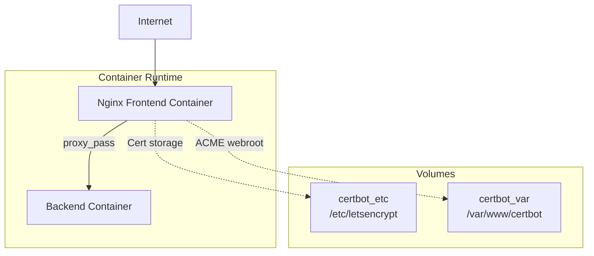
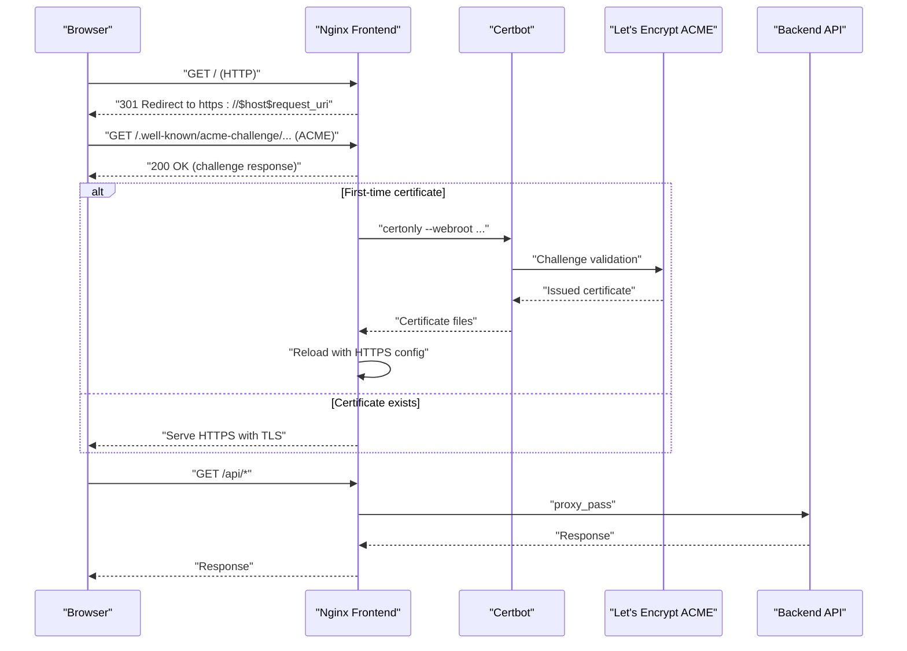
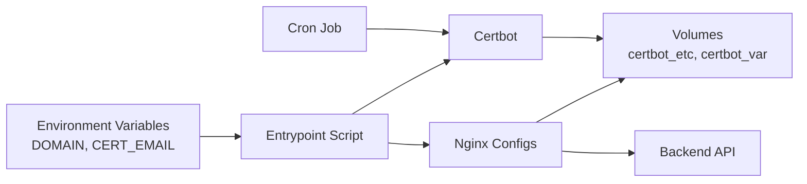

# SSL Certificates & HTTPS

<cite>
**Referenced Files in This Document**
- [nginx-ssl.conf.template](file://frontend/nginx-ssl.conf.template)
- [nginx.conf.template](file://frontend/nginx.conf.template)
- [Dockerfile](file://frontend/Dockerfile)
- [entrypoint.sh](file://frontend/entrypoint.sh)
- [docker-compose.yml](file://docker-compose.yml)
- [deploy.sh](file://deploy.sh)
- [setup-ecs.sh](file://setup-ecs.sh)
- [README.md](file://README.md)
- [SETUP.md](file://SETUP.md)
</cite>

## Table of Contents
1. [Introduction](#introduction)
2. [Project Structure](#project-structure)
3. [Core Components](#core-components)
4. [Architecture Overview](#architecture-overview)
5. [Detailed Component Analysis](#detailed-component-analysis)
6. [Dependency Analysis](#dependency-analysis)
7. [Performance Considerations](#performance-considerations)
8. [Troubleshooting Guide](#troubleshooting-guide)
9. [Conclusion](#conclusion)

## Introduction
This document explains the SSL/TLS and HTTPS configuration for WC26-Qwen-Qoder. It covers how Let's Encrypt certificates are automatically obtained and renewed, DNS requirements for ACME challenges, Nginx SSL configuration templates, cipher suite and protocol choices, HTTP/2 enablement, and operational best practices. It also provides troubleshooting guidance for common certificate and SSL handshake issues.

## Project Structure
The SSL/TLS stack is implemented in the frontend Nginx container, which:
- Serves static assets over HTTP initially
- Handles Let's Encrypt ACME challenges via the webroot method
- Automatically obtains and renews certificates when a domain is configured
- Switches to HTTPS with modern TLS settings and HTTP/2

**Diagram sources**
- [docker-compose.yml:14-34](file://docker-compose.yml#L14-L34)
- [Dockerfile:8-17](file://frontend/Dockerfile#L8-L17)
- [entrypoint.sh:19-38](file://frontend/entrypoint.sh#L19-L38)

**Section sources**
- [docker-compose.yml:14-34](file://docker-compose.yml#L14-L34)
- [Dockerfile:8-17](file://frontend/Dockerfile#L8-L17)

## Core Components
- Nginx HTTP template: Provides the initial HTTP-only configuration and ACME challenge handler.
- Nginx HTTPS template: Defines TLS settings, HTTP/2, and proxying to the backend.
- Entrypoint script: Orchestrates certificate acquisition, switching between HTTP and HTTPS configs, and scheduling renewals.
- Docker Compose: Exposes ports 80/443, mounts Certbot volumes, and passes environment variables for domain and email.

Key behaviors:
- On first boot, Nginx serves the HTTP template.
- If DOMAIN is set and a certificate exists, Nginx switches to the HTTPS template.
- If DOMAIN is set but no certificate exists, the script obtains one via Certbot webroot and reloads Nginx.
- A daily cron job renews certificates and reloads Nginx.

**Section sources**
- [nginx.conf.template:1-24](file://frontend/nginx.conf.template#L1-L24)
- [nginx-ssl.conf.template:1-44](file://frontend/nginx-ssl.conf.template#L1-L44)
- [entrypoint.sh:6-47](file://frontend/entrypoint.sh#L6-L47)
- [docker-compose.yml:14-34](file://docker-compose.yml#L14-L34)

## Architecture Overview
End-to-end flow for certificate automation and HTTPS serving:

**Diagram sources**
- [entrypoint.sh:19-38](file://frontend/entrypoint.sh#L19-L38)
- [nginx.conf.template:8-11](file://frontend/nginx.conf.template#L8-L11)
- [nginx-ssl.conf.template:6-9](file://frontend/nginx-ssl.conf.template#L6-L9)
- [nginx-ssl.conf.template:33-39](file://frontend/nginx-ssl.conf.template#L33-L39)

## Detailed Component Analysis

### Nginx HTTP Template
Purpose:
- Serve static content over HTTP
- Handle ACME challenges via webroot at /.well-known/acme-challenge/
- Redirect non-ACME traffic to HTTPS

Operational notes:
- Uses the same ACME path in both HTTP and HTTPS templates to support renewal flows.
- Proxies API requests to the backend service.

**Section sources**
- [nginx.conf.template:1-24](file://frontend/nginx.conf.template#L1-L24)

### Nginx HTTPS Template
Purpose:
- Provide secure HTTPS with modern TLS settings
- Enable HTTP/2
- Proxy API requests to the backend
- Reference certificate files from Certbot storage

TLS and performance settings:
- TLS protocols: TLSv1.2 and TLSv1.3
- Cipher suite: HIGH:!aNULL:!MD5
- Session caching and timeout for efficient resumption
- HTTP/2 enabled for improved multiplexing and latency

**Section sources**
- [nginx-ssl.conf.template:17-44](file://frontend/nginx-ssl.conf.template#L17-L44)

### Entrypoint Script: Certificate Automation and Switching
Responsibilities:
- Generate the initial HTTP config from the HTTP template
- If DOMAIN is set and a certificate exists, replace placeholder with DOMAIN and apply HTTPS config
- If DOMAIN is set but no certificate exists, start Nginx, obtain a certificate via Certbot webroot, then switch to HTTPS and reload
- Schedule daily certificate renewal via cron with a post-hook to reload Nginx

Environment variables:
- DOMAIN: target domain for certificate issuance/renewal
- CERT_EMAIL: email associated with the certificate
- BACKEND_URL: upstream backend endpoint for proxying

**Section sources**
- [entrypoint.sh:6-47](file://frontend/entrypoint.sh#L6-L47)

### Docker Compose: Ports, Volumes, and Environment
- Exposes ports 80 and 443 to the host
- Mounts Certbot volumes for certificate storage and ACME webroot
- Passes DOMAIN and CERT_EMAIL to the frontend container
- Defines BACKEND_URL for proxying

**Section sources**
- [docker-compose.yml:14-34](file://docker-compose.yml#L14-L34)

### DNS and ACME Validation Requirements
- The ACME webroot path must be reachable at https://YOUR_DOMAIN/.well-known/acme-challenge/
- The webroot directory inside the container is mapped to /var/www/certbot via a named volume
- Ensure your DNS points the configured DOMAIN to the server’s public IP so Certbot can validate ownership

**Section sources**
- [nginx.conf.template:8-11](file://frontend/nginx.conf.template#L8-L11)
- [nginx-ssl.conf.template:6-9](file://frontend/nginx-ssl.conf.template#L6-L9)
- [docker-compose.yml:26-28](file://docker-compose.yml#L26-L28)

### Certificate Renewal Process
- Daily renewal scheduled at 3:00 AM via cron
- Renewal uses the webroot method with the same path as issuance
- Post-hook reloads Nginx to apply new certificate files

**Section sources**
- [entrypoint.sh:40-44](file://frontend/entrypoint.sh#L40-L44)

### Multi-Domain Certificates
- The current template uses a placeholder for certificate paths and replaces it with the configured DOMAIN
- To support multiple SANs, update the certificate issuance command to include additional domains
- After renewal, ensure the replacement logic continues to use the configured DOMAIN for file paths

**Section sources**
- [entrypoint.sh:24-31](file://frontend/entrypoint.sh#L24-L31)
- [entrypoint.sh:14-16](file://frontend/entrypoint.sh#L14-L16)
- [nginx-ssl.conf.template:24-25](file://frontend/nginx-ssl.conf.template#L24-L25)

### Security Headers
- The provided Nginx templates do not define additional security headers (e.g., HSTS, CSP)
- Consider adding security headers at the Nginx level for enhanced protection if required by policy

**Section sources**
- [nginx-ssl.conf.template:17-44](file://frontend/nginx-ssl.conf.template#L17-L44)
- [nginx.conf.template:1-24](file://frontend/nginx.conf.template#L1-24)

## Dependency Analysis
The certificate automation pipeline depends on:
- Nginx serving the ACME webroot path
- Certbot to validate ownership and issue/renew certificates
- Cron for automated renewal scheduling
- Docker volumes for persistent certificate storage and ACME challenge persistence

**Diagram sources**
- [entrypoint.sh:6-47](file://frontend/entrypoint.sh#L6-L47)
- [docker-compose.yml:26-28](file://docker-compose.yml#L26-L28)

**Section sources**
- [entrypoint.sh:6-47](file://frontend/entrypoint.sh#L6-L47)
- [docker-compose.yml:26-28](file://docker-compose.yml#L26-L28)

## Performance Considerations
- HTTP/2: Enabled in the HTTPS template to improve connection reuse and reduce latency
- TLS session caching: Configured to improve handshake performance for returning clients
- OCSP stapling and Certificate Transparency: Not explicitly configured in the provided templates; consider enabling these for stronger security and performance if supported by your environment

**Section sources**
- [nginx-ssl.conf.template:19](file://frontend/nginx-ssl.conf.template#L19)
- [nginx-ssl.conf.template:30-31](file://frontend/nginx-ssl.conf.template#L30-L31)

## Troubleshooting Guide

Common certificate issues:
- Certificate not issued on first boot
  - Verify DOMAIN and CERT_EMAIL are set in the frontend service
  - Confirm DNS resolves to the server IP
  - Check that the ACME webroot path is accessible at https://YOUR_DOMAIN/.well-known/acme-challenge/

- Mixed content warnings
  - Ensure all resources (CSS, JS, images) are served over HTTPS
  - Review Nginx configuration to avoid absolute HTTP URLs in static assets

- SSL handshake failures
  - Confirm TLS protocols and cipher suite compatibility
  - Verify certificate chain and private key match
  - Check firewall/security group allows outbound HTTPS to Let's Encrypt

- Renewal failures
  - Inspect cron job and post-hook execution
  - Validate ACME webroot path remains accessible during renewal
  - Check Certbot logs inside the container for errors

Operational checks:
- Use the deployment script health checks to confirm HTTPS responds
- Review container logs for Nginx and Certbot activity

**Section sources**
- [deploy.sh:81-96](file://deploy.sh#L81-L96)
- [entrypoint.sh:40-44](file://frontend/entrypoint.sh#L40-L44)
- [setup-ecs.sh:182-193](file://setup-ecs.sh#L182-L193)

## Conclusion
WC26-Qwen-Qoder automates SSL/TLS through Nginx, Certbot, and a simple entrypoint script. The system:
- Issues and renews certificates via the ACME webroot method
- Switches seamlessly from HTTP to HTTPS when a domain is configured
- Enables HTTP/2 and uses modern TLS settings
- Relies on Docker volumes for persistent certificate storage and ACME challenge persistence

For enhanced security and performance, consider adding OCSP stapling, Certificate Transparency monitoring, and appropriate security headers at the Nginx level.