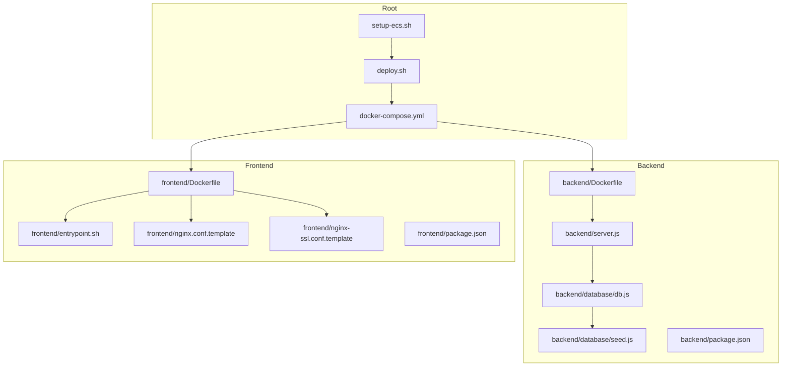
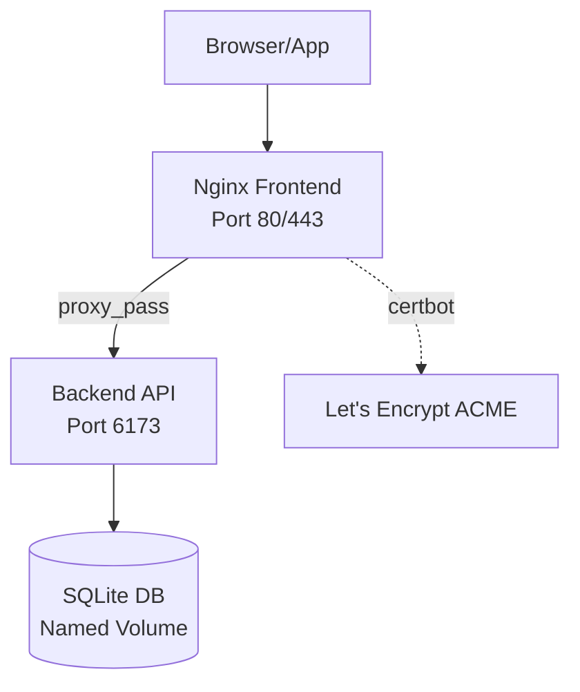
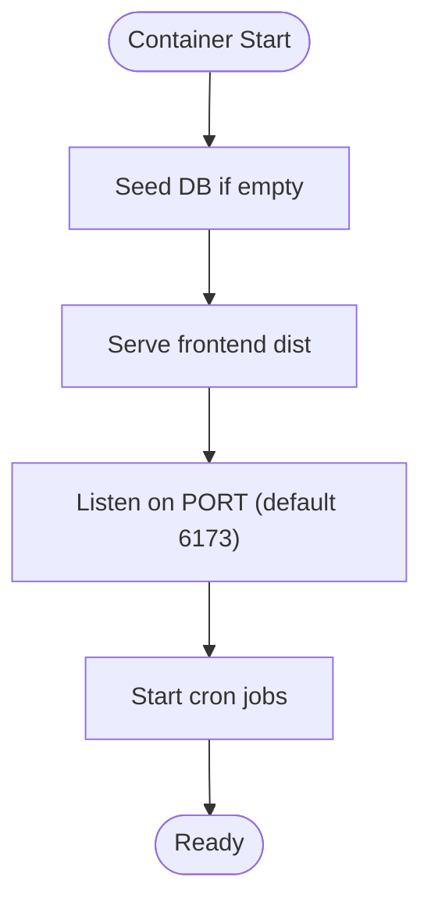
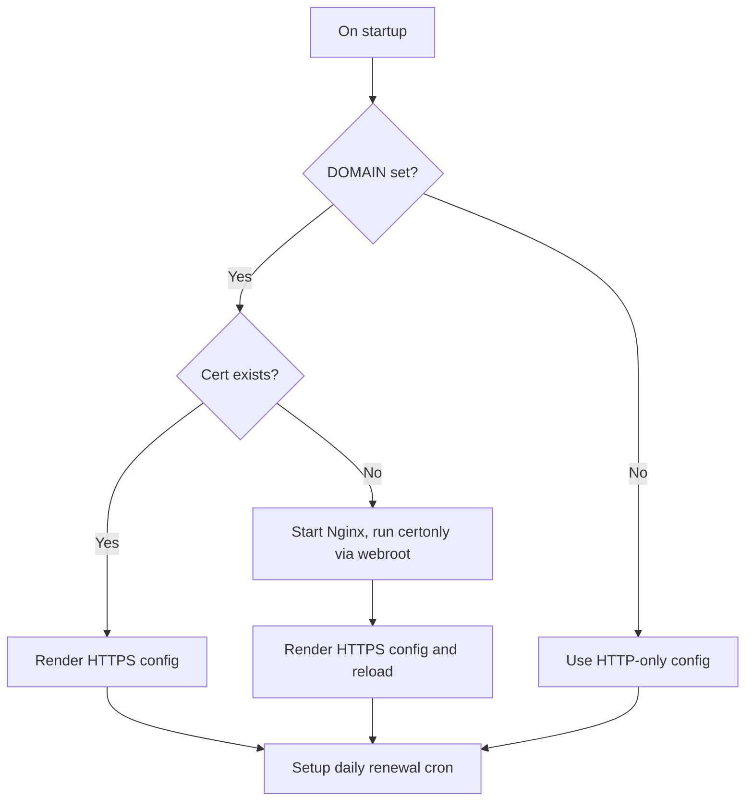
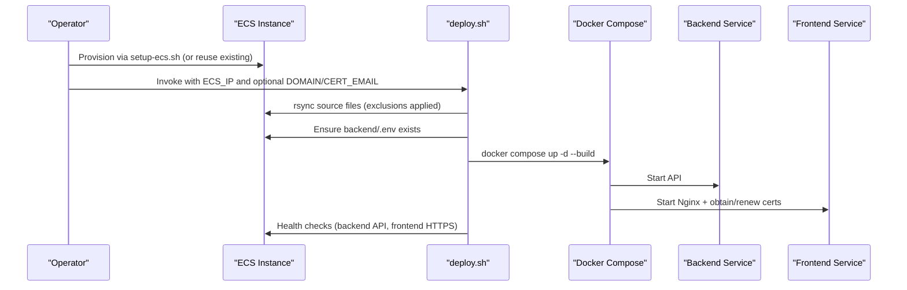
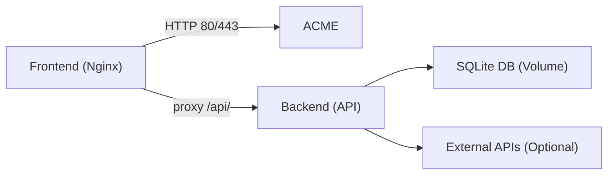

# Deployment and Operations

<cite>
**Referenced Files in This Document**
- [setup-ecs.sh](file://setup-ecs.sh)
- [deploy.sh](file://deploy.sh)
- [docker-compose.yml](file://docker-compose.yml)
- [backend/Dockerfile](file://backend/Dockerfile)
- [frontend/Dockerfile](file://frontend/Dockerfile)
- [frontend/entrypoint.sh](file://frontend/entrypoint.sh)
- [frontend/nginx.conf.template](file://frontend/nginx.conf.template)
- [frontend/nginx-ssl.conf.template](file://frontend/nginx-ssl.conf.template)
- [backend/server.js](file://backend/server.js)
- [backend/database/db.js](file://backend/database/db.js)
- [backend/database/seed.js](file://backend/database/seed.js)
- [backend/package.json](file://backend/package.json)
- [frontend/package.json](file://frontend/package.json)
- [SETUP.md](file://SETUP.md)
- [README.md](file://README.md)
</cite>

## Table of Contents
1. [Introduction](#introduction)
2. [Project Structure](#project-structure)
3. [Core Components](#core-components)
4. [Architecture Overview](#architecture-overview)
5. [Detailed Component Analysis](#detailed-component-analysis)
6. [Dependency Analysis](#dependency-analysis)
7. [Performance Considerations](#performance-considerations)
8. [Troubleshooting Guide](#troubleshooting-guide)
9. [Conclusion](#conclusion)
10. [Appendices](#appendices)

## Introduction
This document provides comprehensive deployment and operations guidance for the World Cup 2026 Prediction App. It covers containerization strategy, production deployment on Alibaba Cloud ECS, SSL/TLS automation with Let's Encrypt, CI/CD and code synchronization, monitoring and health checks, scaling and performance optimization, maintenance procedures, and security hardening. The goal is to enable reliable, repeatable deployments and smooth day-2 operations.

## Project Structure
The repository is organized into:
- backend: Node.js Express API with SQLite database, prediction engine, and scheduled tasks
- frontend: React SPA built with Vite and served via Nginx, with multi-stage Docker build
- Root deployment scripts and Docker Compose for containerized deployment
- Supporting documentation for setup and environment configuration



**Diagram sources**
- [docker-compose.yml:1-34](file://docker-compose.yml#L1-L34)
- [deploy.sh:1-110](file://deploy.sh#L1-L110)
- [setup-ecs.sh:1-443](file://setup-ecs.sh#L1-L443)
- [backend/Dockerfile:1-8](file://backend/Dockerfile#L1-L8)
- [frontend/Dockerfile:1-18](file://frontend/Dockerfile#L1-L18)
- [frontend/entrypoint.sh:1-48](file://frontend/entrypoint.sh#L1-L48)
- [frontend/nginx.conf.template:1-25](file://frontend/nginx.conf.template#L1-L25)
- [frontend/nginx-ssl.conf.template:1-45](file://frontend/nginx-ssl.conf.template#L1-L45)
- [backend/server.js:1-724](file://backend/server.js#L1-L724)
- [backend/database/db.js:1-252](file://backend/database/db.js#L1-L252)
- [backend/database/seed.js:1-69](file://backend/database/seed.js#L1-L69)
- [backend/package.json:1-32](file://backend/package.json#L1-L32)
- [frontend/package.json:1-72](file://frontend/package.json#L1-L72)

**Section sources**
- [SETUP.md:163-224](file://SETUP.md#L163-L224)
- [README.md:153-209](file://README.md#L153-L209)

## Core Components
- Backend API (Express + SQLite): Provides all REST endpoints, scheduled tasks, and serves the static frontend in production.
- Frontend (React + Nginx): Multi-stage Docker build produces a minimal Nginx image with pre-built assets and automatic SSL provisioning.
- Container Orchestration: docker-compose defines two services (backend and frontend), environment variables, and named volumes for persistence.
- Provisioning and Deployment: setup-ecs.sh automates Alibaba Cloud ECS provisioning and initial deployment; deploy.sh synchronizes code and rebuilds containers.

Key operational variables and paths:
- Backend DB path: configured via DB_PATH environment variable and persisted in a named volume
- Frontend domain and certificate email: configurable via DOMAIN and CERT_EMAIL environment variables
- Backend port: 6173 (exposed internally; frontend proxies to backend)

**Section sources**
- [docker-compose.yml:1-34](file://docker-compose.yml#L1-L34)
- [backend/server.js:18-22](file://backend/server.js#L18-L22)
- [backend/database/db.js:5-6](file://backend/database/db.js#L5-L6)
- [frontend/entrypoint.sh:11-17](file://frontend/entrypoint.sh#L11-L17)
- [frontend/nginx.conf.template:13-19](file://frontend/nginx.conf.template#L13-L19)
- [frontend/nginx-ssl.conf.template:33-39](file://frontend/nginx-ssl.conf.template#L33-L39)

## Architecture Overview
The system runs as two Docker services:
- backend: Node.js API exposing REST endpoints and serving static assets in production
- frontend: Nginx proxying API requests to backend and serving the SPA; manages Let's Encrypt certificates



**Diagram sources**
- [docker-compose.yml:14-29](file://docker-compose.yml#L14-L29)
- [frontend/nginx.conf.template:13-19](file://frontend/nginx.conf.template#L13-L19)
- [frontend/nginx-ssl.conf.template:33-39](file://frontend/nginx-ssl.conf.template#L33-L39)
- [backend/server.js:677-682](file://backend/server.js#L677-L682)

## Detailed Component Analysis

### Backend Service
- Containerization: Single-stage Alpine Linux Node.js build with production dependencies only.
- Startup: Runs seeding and then the API server; serves static frontend in production.
- Persistence: Uses a named volume mapped to DB_PATH for SQLite storage.
- Scheduling: node-cron runs live sync and prediction jobs according to tournament schedule.



**Diagram sources**
- [backend/Dockerfile:1-8](file://backend/Dockerfile#L1-L8)
- [backend/server.js:684-723](file://backend/server.js#L684-L723)
- [backend/database/seed.js:9-16](file://backend/database/seed.js#L9-L16)

**Section sources**
- [backend/Dockerfile:1-8](file://backend/Dockerfile#L1-L8)
- [backend/server.js:18-22](file://backend/server.js#L18-L22)
- [backend/server.js:584-632](file://backend/server.js#L584-L632)
- [backend/database/db.js:10-21](file://backend/database/db.js#L10-L21)

### Frontend Service
- Multi-stage build: Build stage compiles the SPA; runtime stage uses Nginx with Certbot.
- Entrypoint logic: Generates Nginx config templates, obtains or validates SSL certificates, sets up daily renewal cron, and starts Nginx.
- Proxying: Routes /api/ to backend service; serves SPA static files.
- SSL templates: Separate HTTP-only and HTTPS configs with ACME challenge paths.

```mermaid
sequenceDiagram
participant Entrypoint as "entrypoint.sh"
participant Nginx as "Nginx"
participant Certbot as "Certbot"
participant Backend as "Backend API"
Entrypoint->>Entrypoint : Render default.conf from template
alt DOMAIN set and cert exists
Entrypoint->>Entrypoint : Render nginx-ssl.conf
else DOMAIN set and no cert
Entrypoint->>Nginx : Start Nginx daemon
Entrypoint->>Certbot : Obtain certificate via webroot
Entrypoint->>Entrypoint : Render nginx-ssl.conf
Entrypoint->>Nginx : Reload config
end
Entrypoint->>Entrypoint : Setup daily cron for renewal
Entrypoint->>Nginx : exec nginx -g "daemon off;"
Nginx->>Backend : proxy_pass /api/ to backend : 6173
```

**Diagram sources**
- [frontend/entrypoint.sh:1-48](file://frontend/entrypoint.sh#L1-L48)
- [frontend/nginx.conf.template:1-25](file://frontend/nginx.conf.template#L1-L25)
- [frontend/nginx-ssl.conf.template:1-45](file://frontend/nginx-ssl.conf.template#L1-L45)
- [docker-compose.yml:20-25](file://docker-compose.yml#L20-L25)

**Section sources**
- [frontend/Dockerfile:1-18](file://frontend/Dockerfile#L1-L18)
- [frontend/entrypoint.sh:6-47](file://frontend/entrypoint.sh#L6-L47)
- [frontend/nginx.conf.template:8-23](file://frontend/nginx.conf.template#L8-L23)
- [frontend/nginx-ssl.conf.template:6-43](file://frontend/nginx-ssl.conf.template#L6-L43)

### SSL Certificate Management (Let's Encrypt)
- Automatic issuance: On first boot with DOMAIN set, Nginx starts and Certbot obtains a certificate via HTTP webroot challenge.
- Certificate storage: Persisted in named volumes mounted at /etc/letsencrypt and /var/www/certbot.
- Renewal: Daily cron job renews certificates and reloads Nginx.
- ACME challenges: Exposes /.well-known/acme-challenge/ for both HTTP and HTTPS configs.



**Diagram sources**
- [frontend/entrypoint.sh:11-44](file://frontend/entrypoint.sh#L11-L44)
- [frontend/nginx.conf.template:8-11](file://frontend/nginx.conf.template#L8-L11)
- [frontend/nginx-ssl.conf.template:6-14](file://frontend/nginx-ssl.conf.template#L6-L14)

**Section sources**
- [frontend/entrypoint.sh:20-38](file://frontend/entrypoint.sh#L20-L38)
- [frontend/nginx.conf.template:8-11](file://frontend/nginx.conf.template#L8-L11)
- [frontend/nginx-ssl.conf.template:6-14](file://frontend/nginx-ssl.conf.template#L6-L14)

### Production Deployment on Alibaba Cloud ECS
- Automated provisioning: setup-ecs.sh provisions VPC, VSwitch, security group (22, 80, 443), SSH key pair, ECS instance, installs Docker, uploads backend/.env, and invokes deploy.sh.
- Initial deployment: deploy.sh rsyncs source (excluding large or cached files), ensures .env exists, builds and restarts containers, performs health checks.
- Subsequent deploys: re-run deploy.sh with ECS_IP and optional DOMAIN/CERT_EMAIL.



**Diagram sources**
- [setup-ecs.sh:415-431](file://setup-ecs.sh#L415-L431)
- [deploy.sh:38-96](file://deploy.sh#L38-L96)
- [docker-compose.yml:1-34](file://docker-compose.yml#L1-L34)

**Section sources**
- [setup-ecs.sh:1-443](file://setup-ecs.sh#L1-L443)
- [deploy.sh:1-110](file://deploy.sh#L1-L110)

### CI/CD Pipeline and Code Synchronization
- Recommended flow: Commit changes to the upstream repository, then rsync to ECS and rebuild containers using deploy.sh.
- Exclusions: deploy.sh excludes .git/, node_modules/, dist/, and database backup files to minimize transfer and avoid overwriting persistent data.
- Container rebuild: docker compose up -d --build ensures images are rebuilt from current source.

Operational notes:
- Keep backend/.env secure and outside the repository; upload it to the remote instance before deploying.
- For zero-downtime deployments, consider adding a reverse proxy or load balancer in front of multiple frontend instances.

**Section sources**
- [deploy.sh:38-79](file://deploy.sh#L38-L79)

## Dependency Analysis
- Internal dependencies:
  - Frontend Nginx depends on backend service being healthy for API routes.
  - Backend depends on SQLite database persistence via named volume.
- External dependencies:
  - Optional: football-data.org API key for live data and form.
  - Required: DashScope API key for Qwen multi-agent predictions.
- Network:
  - Backend is internal-only; frontend exposes ports 80/443 and proxies to backend.



**Diagram sources**
- [docker-compose.yml:14-29](file://docker-compose.yml#L14-L29)
- [frontend/nginx.conf.template:13-19](file://frontend/nginx.conf.template#L13-L19)
- [backend/server.js:1-22](file://backend/server.js#L1-L22)

**Section sources**
- [backend/package.json:14-22](file://backend/package.json#L14-L22)
- [frontend/package.json:38-48](file://frontend/package.json#L38-L48)

## Performance Considerations
- Container sizing: The ECS provisioning script selects a burstable instance type suitable for typical traffic; adjust instance type and disk size based on observed CPU and IO utilization.
- Database tuning: SQLite WAL mode and PRAGMA settings are configured in the backend; monitor disk IO and consider SSD-backed storage.
- Static delivery: Nginx serves SPA assets efficiently; ensure adequate memory for Node.js backend and Nginx workers.
- Prediction workload: Scheduled jobs run during tournament hours; monitor cron logs and adjust schedules if needed.
- Caching: Frontend assets are prebuilt; consider CDN for global audiences if scaling horizontally.

[No sources needed since this section provides general guidance]

## Troubleshooting Guide
Common issues and resolutions:
- ECS connectivity:
  - Ensure security group allows inbound TCP 22, 80, 443.
  - Verify SSH key path and permissions.
- HTTPS not available:
  - Confirm DOMAIN is set and DNS points to ECS IP.
  - Check Certbot logs and ACME challenge paths.
- Backend not responding:
  - Review backend logs for initialization errors or missing environment variables.
  - Confirm DB_PATH volume is mounted and accessible.
- Health checks fail:
  - Use docker compose logs to inspect service startup.
  - Validate API endpoints and CORS configuration.

**Section sources**
- [setup-ecs.sh:182-196](file://setup-ecs.sh#L182-L196)
- [deploy.sh:81-96](file://deploy.sh#L81-L96)
- [frontend/entrypoint.sh:20-38](file://frontend/entrypoint.sh#L20-L38)
- [backend/server.js:18-22](file://backend/server.js#L18-L22)

## Conclusion
The deployment strategy leverages multi-stage Docker builds, automated Alibaba Cloud provisioning, and robust SSL/TLS management. With clear separation of concerns between backend and frontend, along with scheduled tasks and persistent storage, the system is designed for reliability and maintainability. Following the operational runbooks and best practices outlined here will help ensure smooth day-2 operations, predictable scaling, and rapid recovery from incidents.

[No sources needed since this section summarizes without analyzing specific files]

## Appendices

### Monitoring and Logging
- Health checks:
  - Backend: curl against /api/teams endpoint
  - Frontend: curl against root or HTTPS endpoint
- Logs:
  - docker compose logs -f for real-time logs
  - Frontend Nginx access/error logs inside the container
- Metrics:
  - Track container resource usage and external API latencies

**Section sources**
- [deploy.sh:81-96](file://deploy.sh#L81-L96)

### Maintenance Procedures
- Database backups:
  - Back up the named volume path (/data/worldcup2026.db) regularly.
  - Consider offline snapshots or periodic rsync to secure storage.
- Log rotation:
  - Use OS-native logrotate or container log driver options.
- System updates:
  - Apply OS updates on reboot; rebuild containers after major changes.

**Section sources**
- [backend/database/db.js:5-6](file://backend/database/db.js#L5-L6)

### Scaling and Load Balancing
- Horizontal scaling:
  - Run multiple frontend replicas behind a load balancer.
  - Ensure shared persistent storage or a centralized database if stateful.
- Performance optimization:
  - Enable CDN for static assets.
  - Tune Nginx worker processes and keepalive timeouts.
  - Monitor and scale backend resources based on CPU and memory metrics.

[No sources needed since this section provides general guidance]

### Security Best Practices
- Firewall:
  - Restrict SSH to trusted IPs; keep only 22, 80, 443 open.
- Secrets:
  - Store API keys in backend/.env; never commit secrets to repositories.
- TLS:
  - Let's Encrypt certificates are renewed automatically; ensure cron is running.
- Access control:
  - Use bastion hosts and rotate SSH keys periodically.

**Section sources**
- [setup-ecs.sh:182-196](file://setup-ecs.sh#L182-L196)
- [frontend/entrypoint.sh:40-44](file://frontend/entrypoint.sh#L40-L44)

### Operational Runbooks
- Incident response:
  - Isolate failing service, review logs, restore from backup if needed.
  - Communicate with stakeholders and document remediation steps.
- System recovery:
  - Recreate containers with docker compose up -d --build.
  - Re-run seeding if database corruption is suspected.

**Section sources**
- [deploy.sh:67-79](file://deploy.sh#L67-L79)
- [backend/database/seed.js:9-16](file://backend/database/seed.js#L9-L16)