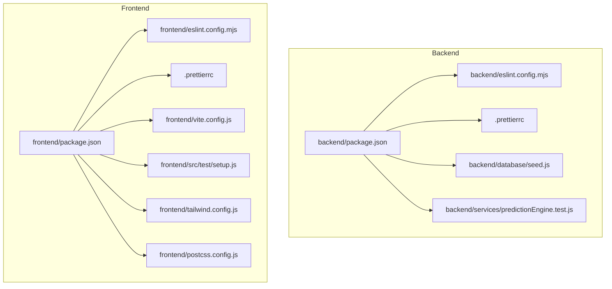
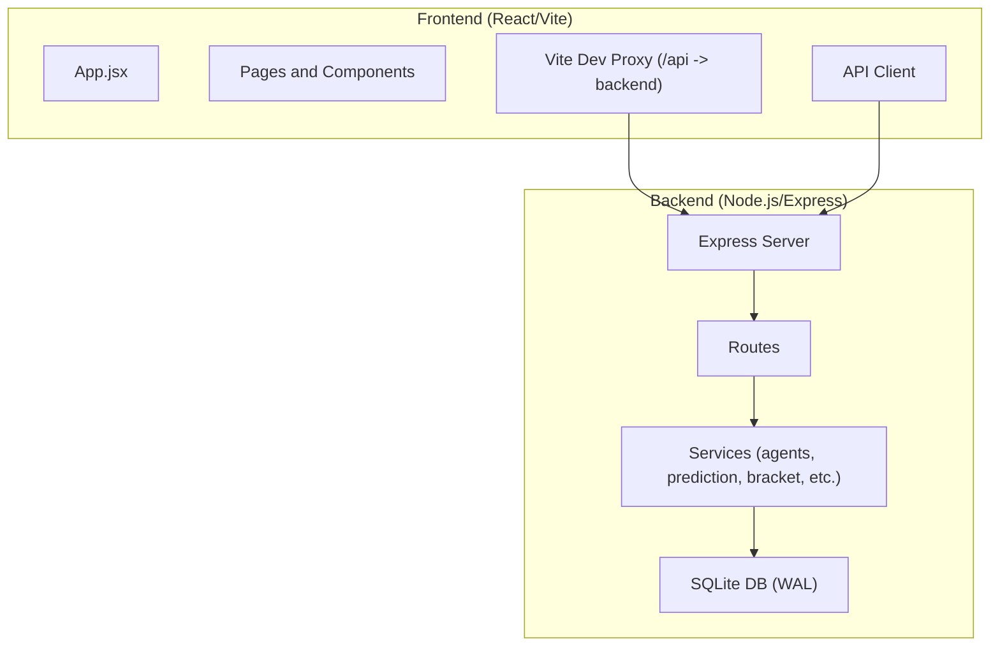
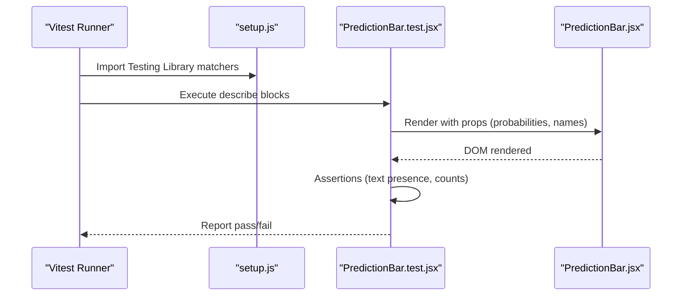
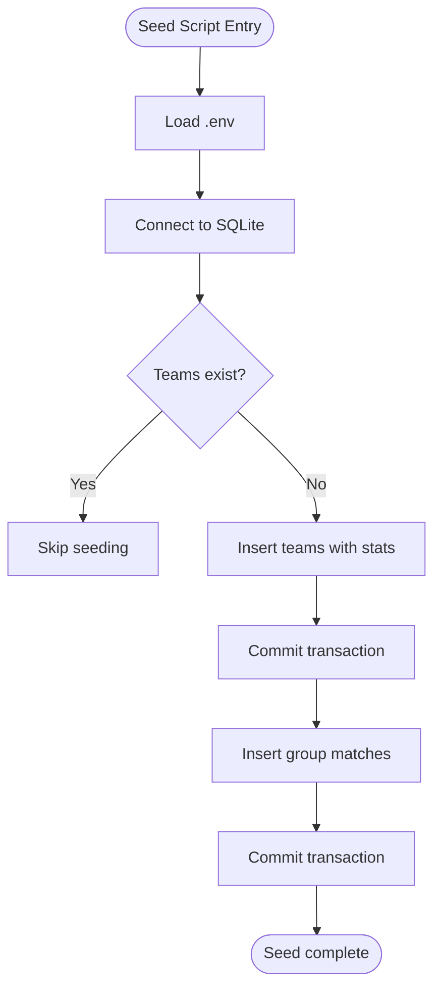
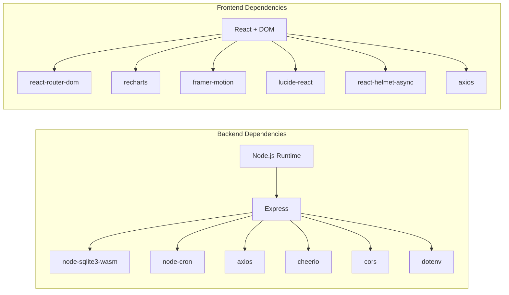

# Development Guidelines

<cite>
**Referenced Files in This Document**
- [README.md](file://README.md)
- [SETUP.md](file://SETUP.md)
- [SPEC.md](file://specs/SPEC.md)
- [backend/package.json](file://backend/package.json)
- [backend/eslint.config.mjs](file://backend/eslint.config.mjs)
- [backend/.prettierrc](file://backend/.prettierrc)
- [backend/database/seed.js](file://backend/database/seed.js)
- [backend/services/predictionEngine.test.js](file://backend/services/predictionEngine.test.js)
- [frontend/package.json](file://frontend/package.json)
- [frontend/eslint.config.mjs](file://frontend/eslint.config.mjs)
- [frontend/.prettierrc](file://frontend/.prettierrc)
- [frontend/vite.config.js](file://frontend/vite.config.js)
- [frontend/src/test/setup.js](file://frontend/src/test/setup.js)
- [frontend/src/components/PredictionBar.test.jsx](file://frontend/src/components/PredictionBar.test.jsx)
- [frontend/postcss.config.js](file://frontend/postcss.config.js)
- [frontend/tailwind.config.js](file://frontend/tailwind.config.js)
</cite>

## Table of Contents
1. [Introduction](#introduction)
2. [Project Structure](#project-structure)
3. [Core Components](#core-components)
4. [Architecture Overview](#architecture-overview)
5. [Detailed Component Analysis](#detailed-component-analysis)
6. [Dependency Analysis](#dependency-analysis)
7. [Performance Considerations](#performance-considerations)
8. [Security and Accessibility](#security-and-accessibility)
9. [Testing Strategies](#testing-strategies)
10. [Code Standards and Formatting](#code-standards-and-formatting)
11. [Development Environment Setup](#development-environment-setup)
12. [Contribution Guidelines](#contribution-guidelines)
13. [Continuous Integration and Quality Gates](#continuous-integration-and-quality-gates)
14. [Documentation and Release Procedures](#documentation-and-release-procedures)
15. [Troubleshooting Guide](#troubleshooting-guide)
16. [Conclusion](#conclusion)

## Introduction
This document defines comprehensive development guidelines for contributing to the World Cup 2026 Prediction App. It covers code standards, testing strategies, linting and formatting workflows, contribution processes, environment setup, debugging, CI/CD considerations, performance and security practices, accessibility requirements, documentation updates, and release procedures. The project consists of a Node.js/Express backend and a React/TypeScript frontend, with shared tooling for linting and formatting across both packages.

## Project Structure
The repository is organized into:
- backend: Node.js/Express API, SQLite database, prediction engine, and agent orchestration
- frontend: React application with Vite, Tailwind CSS, and pre-rendering configuration
- specs: product specification documents
- deployment and infrastructure scripts

**Diagram sources**
- [backend/package.json:1-32](file://backend/package.json#L1-L32)
- [backend/eslint.config.mjs:1-24](file://backend/eslint.config.mjs#L1-L24)
- [backend/.prettierrc:1-7](file://backend/.prettierrc#L1-L7)
- [backend/database/seed.js:1-69](file://backend/database/seed.js#L1-L69)
- [backend/services/predictionEngine.test.js:1-333](file://backend/services/predictionEngine.test.js#L1-L333)
- [frontend/package.json:1-72](file://frontend/package.json#L1-L72)
- [frontend/eslint.config.mjs:1-54](file://frontend/eslint.config.mjs#L1-L54)
- [frontend/.prettierrc:1-7](file://frontend/.prettierrc#L1-L7)
- [frontend/vite.config.js:1-26](file://frontend/vite.config.js#L1-L26)
- [frontend/src/test/setup.js:1-2](file://frontend/src/test/setup.js#L1-L2)
- [frontend/tailwind.config.js:1-161](file://frontend/tailwind.config.js#L1-L161)
- [frontend/postcss.config.js:1-7](file://frontend/postcss.config.js#L1-L7)

**Section sources**
- [README.md:153-224](file://README.md#L153-L224)
- [SETUP.md:163-224](file://SETUP.md#L163-L224)

## Core Components
- Backend
  - Express server and routes
  - SQLite database with WAL mode and seeding
  - Prediction engine and multi-agent orchestration
  - Services for data ingestion, calibration, bracket simulation, and AI client
- Frontend
  - React application with routing and context providers
  - Pages for dashboard, schedule, match detail, groups, tournament, predictions, and team detail
  - Shared components for flags, tables, match cards, prediction bars, SEO, and ornaments
  - Tailwind CSS theming and pre-rendering via react-snap

**Section sources**
- [README.md:106-113](file://README.md#L106-L113)
- [SETUP.md:163-224](file://SETUP.md#L163-L224)

## Architecture Overview
High-level architecture integrates a React frontend served by Vite with a Node.js backend exposing an API. The frontend proxies API requests to the backend during development. The backend seeds a local SQLite database and runs prediction and orchestration services.

**Diagram sources**
- [frontend/vite.config.js:11-19](file://frontend/vite.config.js#L11-L19)
- [backend/package.json:6-13](file://backend/package.json#L6-L13)

**Section sources**
- [frontend/vite.config.js:1-26](file://frontend/vite.config.js#L1-L26)
- [backend/package.json:6-13](file://backend/package.json#L6-L13)

## Detailed Component Analysis

### Backend: Prediction Engine Tests
The backend includes a comprehensive suite of unit tests for the prediction engine using Node’s built-in test runner. Tests cover probability calculations, Dixon-Cole adjustments, log-pool blending, score selection heuristics, and nudges from form and intelligence signals.

```mermaid
flowchart TD
Start(["Test Suite Entry"]) --> Load["Load predictionEngine module"]
Load --> Describe["Describe block: poissonMatchProbs"]
Describe --> Case1["Case: probabilities sum to ~1"]
Describe --> Case2["Case: equal lambdas symmetry"]
Describe --> Case3["Case: higher lambda home favours"]
Describe --> Case4["Case: returns mostLikely scoreline"]
Start --> Describe2["Describe block: eloToMatchProbs"]
Describe2 --> Case5["Case: draws peak near equal ELOs"]
Start --> Describe3["Describe block: dcScoreMatrix"]
Describe3 --> Case6["Case: cells sum to 1 after normalisation"]
Describe3 --> Case7["Case: DC correction shifts low-score cells"]
Start --> Describe4["Describe block: logPool"]
Describe4 --> Case8["Case: preserves unanimous confident vector"]
Describe4 --> Case9["Case: avoids arithmetic-mean collapse"]
Describe4 --> Case10["Case: output sums to 1"]
Start --> Describe5["Describe block: pickTopScoresForPoints"]
Describe5 --> Case11["Case: picks S1 from highest-outcome-class"]
Describe5 --> Case12["Case: hedges S2/S3 across outcomes"]
Describe5 --> Case13["Case: beats naive picker in expected points"]
Start --> Describe6["Describe block: pointsForResult"]
Describe6 --> Case14["Case: awards 3/2/1/0 points correctly"]
Start --> Describe7["Describe block: reweightMatrixToOutcomeProbs"]
Describe7 --> Case15["Case: outcome-class totals match target"]
Start --> Describe8["Describe block: formGoalNudge"]
Describe8 --> Case16["Case: symmetry and conservative caps"]
Start --> Describe9["Describe block: intelGoalNudge"]
Describe9 --> Case17["Case: injury impact and composition"]
Start --> Describe10["Describe block: wcGoalScaleFor"]
Describe10 --> Case18["Case: stage-specific goal scales"]
Start --> Describe11["Describe block: fifaPriorFromPoints"]
Describe11 --> Case19["Case: alpha/beta relationship and envelope"]
```

**Diagram sources**
- [backend/services/predictionEngine.test.js:1-333](file://backend/services/predictionEngine.test.js#L1-L333)

**Section sources**
- [backend/services/predictionEngine.test.js:1-333](file://backend/services/predictionEngine.test.js#L1-L333)

### Frontend: Component Test Example
The frontend demonstrates testing with Vitest and Testing Library. An example component test verifies rendering of team names, percentages, and variants.

**Diagram sources**
- [frontend/src/test/setup.js:1-2](file://frontend/src/test/setup.js#L1-L2)
- [frontend/src/components/PredictionBar.test.jsx:1-32](file://frontend/src/components/PredictionBar.test.jsx#L1-L32)

**Section sources**
- [frontend/src/components/PredictionBar.test.jsx:1-32](file://frontend/src/components/PredictionBar.test.jsx#L1-L32)
- [frontend/src/test/setup.js:1-2](file://frontend/src/test/setup.js#L1-L2)

### Backend: Database Seeding
The backend seed script initializes teams and group-stage fixtures into SQLite, handling transactions and logging.

**Diagram sources**
- [backend/database/seed.js:1-69](file://backend/database/seed.js#L1-L69)

**Section sources**
- [backend/database/seed.js:1-69](file://backend/database/seed.js#L1-L69)

## Dependency Analysis
- Backend
  - Node.js runtime, Express, SQLite WASM driver, cron, Axios, Cheerio, CORS, dotenv
  - Dev: ESLint 9, Prettier, nodemon
- Frontend
  - React, React Router, Recharts, Framer Motion, Lucide icons, Axios, Helmet Async
  - Dev: Vite, Tailwind CSS, PostCSS, ESLint 9, Vitest, Testing Library, react-snap, sharp

**Diagram sources**
- [backend/package.json:14-30](file://backend/package.json#L14-L30)
- [frontend/package.json:38-69](file://frontend/package.json#L38-L69)

**Section sources**
- [backend/package.json:14-30](file://backend/package.json#L14-L30)
- [frontend/package.json:38-69](file://frontend/package.json#L38-L69)

## Performance Considerations
- Backend
  - Use SQLite in WAL mode for concurrency and durability.
  - Keep prediction computations deterministic and cacheable where appropriate.
  - Limit heavy AI calls to necessary paths and avoid redundant model invocations.
- Frontend
  - Prefer memoization for derived data and expensive computations.
  - Lazy-load non-critical components and images.
  - Minimize re-renders by using stable prop references and shallow comparisons.
  - Optimize chart rendering and avoid unnecessary subscriptions.

[No sources needed since this section provides general guidance]

## Security and Accessibility
- Security
  - Validate and sanitize all inputs to backend endpoints.
  - Enforce CORS policies via environment variables.
  - Store secrets in environment variables; never commit credentials.
  - Rate-limit and throttle external API calls to football-data.org and DashScope.
- Accessibility
  - Ensure semantic HTML and ARIA attributes where dynamic content is inserted.
  - Provide keyboard navigation and focus management.
  - Maintain sufficient color contrast and scalable fonts.
  - Support screen readers with proper labels and landmarks.

[No sources needed since this section provides general guidance]

## Testing Strategies
- Backend
  - Built-in Node.js test runner is configured to execute all service tests.
  - Recommended to run tests with coverage reporting and to maintain high coverage for critical modules.
- Frontend
  - Vitest with JSDOM environment and Testing Library assertions.
  - Use setup files to register DOM matchers globally.
  - Snapshot testing for static components and user-flow tests for key interactions.
- Coverage
  - Configure coverage thresholds for both packages to ensure meaningful coverage metrics.

**Section sources**
- [backend/package.json:10-10](file://backend/package.json#L10-L10)
- [frontend/package.json:11-12](file://frontend/package.json#L11-L12)
- [frontend/vite.config.js:20-24](file://frontend/vite.config.js#L20-L24)
- [frontend/src/test/setup.js:1-2](file://frontend/src/test/setup.js#L1-L2)

## Code Standards and Formatting
- ESLint and Prettier
  - Backend: ESLint 9 with recommended config and Prettier integration; ignores node_modules, data, and ESLint config itself.
  - Frontend: ESLint 9 with React, Hooks, and Refresh plugins; Prettier integration; ignores dist, node_modules, and scripts.
- Formatting Rules
  - Single quotes, semicolons, tab width 2, trailing commas per ES5.
- Scripts
  - npm run lint and npm run format in both packages.

**Section sources**
- [backend/eslint.config.mjs:1-24](file://backend/eslint.config.mjs#L1-L24)
- [backend/.prettierrc:1-7](file://backend/.prettierrc#L1-L7)
- [frontend/eslint.config.mjs:1-54](file://frontend/eslint.config.mjs#L1-L54)
- [frontend/.prettierrc:1-7](file://frontend/.prettierrc#L1-L7)
- [backend/package.json:11-12](file://backend/package.json#L11-L12)
- [frontend/package.json:13-14](file://frontend/package.json#L13-L14)

## Development Environment Setup
- Prerequisites
  - Node.js LTS and npm
  - Docker and Docker Compose for deployment automation
- Local Startup
  - Use the provided scripts to install dependencies, seed the database, and start both backend and frontend.
  - Manual steps supported via separate terminal sessions for backend and frontend.
- Environment Variables
  - Copy .env.example to .env and set required keys for DashScope and optional football-data.org integration.
- Frontend Proxy
  - Vite proxies /api requests to the backend during development.

**Section sources**
- [README.md:114-138](file://README.md#L114-L138)
- [SETUP.md:3-50](file://SETUP.md#L3-L50)
- [SETUP.md:53-63](file://SETUP.md#L53-L63)
- [frontend/vite.config.js:11-19](file://frontend/vite.config.js#L11-L19)

## Contribution Guidelines
- Branching
  - Feature branches from develop or main as defined by your workflow.
  - Keep branches focused and short-lived.
- Pull Requests
  - Include a clear description of changes, rationale, and testing performed.
  - Ensure all checks pass (lint, format, tests).
- Code Review
  - Review for adherence to style, correctness, performance, and security.
  - Verify new or changed logic has adequate tests.
- Commit Messages
  - Use imperative mood and concise descriptions; reference issues if applicable.

[No sources needed since this section provides general guidance]

## Continuous Integration and Quality Gates
- Automated Checks
  - Lint and format checks as prerequisites for PRs.
  - Backend tests via Node’s built-in test runner.
  - Frontend tests via Vitest with JSDOM.
- Coverage
  - Define minimum coverage thresholds and enforce via CI configuration.
- Pre-deploy Validation
  - Build and test both packages prior to deployment.
- Deployment
  - Automated ECS provisioning and deployments are supported via provided scripts.

**Section sources**
- [README.md:211-230](file://README.md#L211-L230)
- [SETUP.md:124-160](file://SETUP.md#L124-L160)

## Documentation and Release Procedures
- Documentation Updates
  - Update README, SETUP, and SPEC files for significant changes.
  - Keep product specs aligned with UI and backend behavior.
- Changelog Maintenance
  - Maintain a changelog reflecting features, fixes, and breaking changes.
- Release Procedures
  - Tag releases, update version fields in both package.json files, and publish artifacts as needed.
  - For deployment, follow ECS provisioning and rsync/deploy scripts.

**Section sources**
- [README.md:1-263](file://README.md#L1-L263)
- [SETUP.md:1-224](file://SETUP.md#L1-L224)
- [SPEC.md:1-205](file://specs/SPEC.md#L1-L205)

## Troubleshooting Guide
- Backend
  - Seed failures: verify database connectivity and permissions; check seed script logs.
  - Missing environment variables: confirm .env values for API keys and ports.
  - Cron jobs not firing: validate scheduling and logging.
- Frontend
  - Proxy errors: ensure backend is running on the proxied port.
  - Test failures: run tests in run mode and inspect setup files and component props.
- General
  - Reinstall dependencies if lockfiles diverge.
  - Clear caches and retry builds.

**Section sources**
- [backend/database/seed.js:1-69](file://backend/database/seed.js#L1-L69)
- [frontend/vite.config.js:11-19](file://frontend/vite.config.js#L11-L19)
- [frontend/src/test/setup.js:1-2](file://frontend/src/test/setup.js#L1-L2)

## Conclusion
These guidelines standardize development across the backend and frontend, ensuring consistent code quality, reliable testing, secure practices, and smooth collaboration. Adhering to these standards will help maintain a robust, accessible, and performant application throughout the tournament lifecycle.