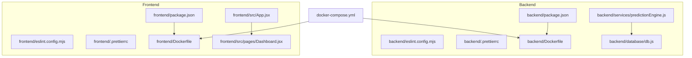
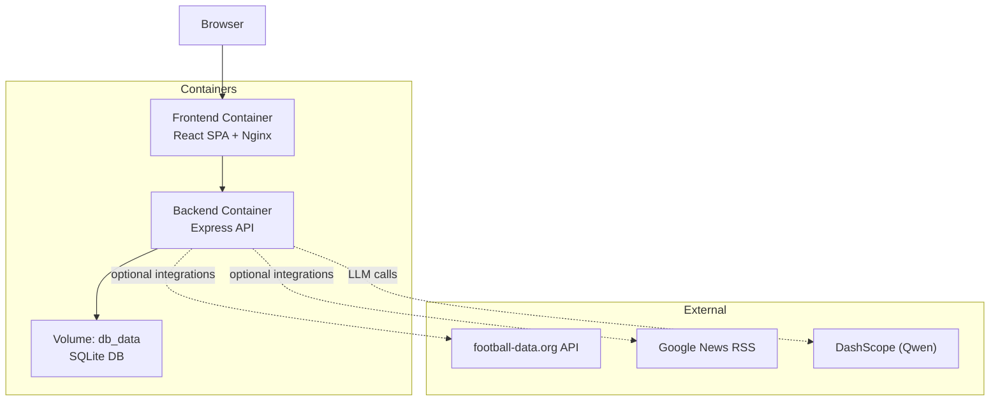
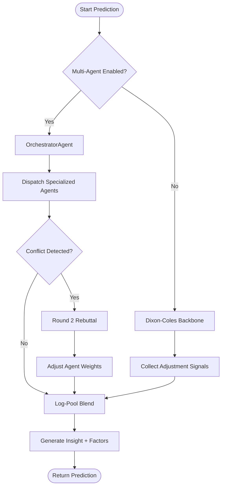
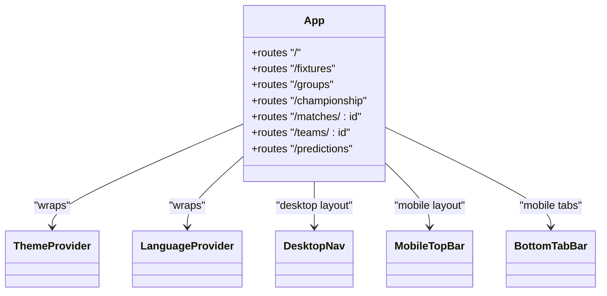
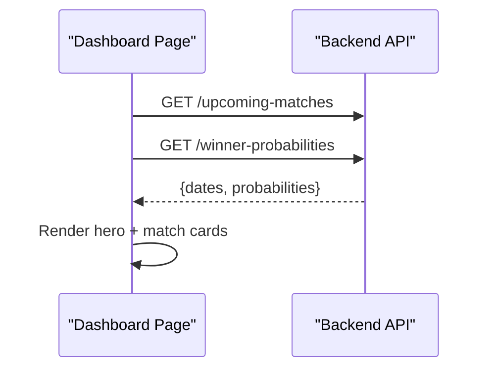
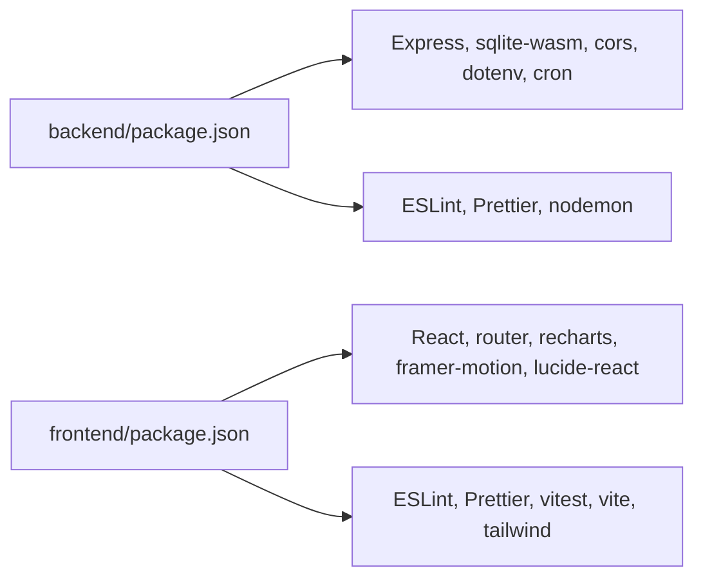

# Development Guidelines

<cite>
**Referenced Files in This Document**
- [README.md](file://README.md)
- [SETUP.md](file://SETUP.md)
- [SPEC.md](file://specs/SPEC.md)
- [docker-compose.yml](file://docker-compose.yml)
- [backend/Dockerfile](file://backend/Dockerfile)
- [frontend/Dockerfile](file://frontend/Dockerfile)
- [backend/package.json](file://backend/package.json)
- [frontend/package.json](file://frontend/package.json)
- [backend/eslint.config.mjs](file://backend/eslint.config.mjs)
- [frontend/eslint.config.mjs](file://frontend/eslint.config.mjs)
- [backend/.prettierrc](file://backend/.prettierrc)
- [frontend/.prettierrc](file://frontend/.prettierrc)
- [backend/vite.config.js](file://backend/vite.config.js)
- [frontend/vite.config.js](file://frontend/vite.config.js)
- [backend/database/db.js](file://backend/database/db.js)
- [backend/services/predictionEngine.js](file://backend/services/predictionEngine.js)
- [backend/services/predictionEngine.test.js](file://backend/services/predictionEngine.test.js)
- [frontend/src/App.jsx](file://frontend/src/App.jsx)
- [frontend/src/pages/Dashboard.jsx](file://frontend/src/pages/Dashboard.jsx)
</cite>

## Table of Contents
1. [Introduction](#introduction)
2. [Project Structure](#project-structure)
3. [Core Components](#core-components)
4. [Architecture Overview](#architecture-overview)
5. [Detailed Component Analysis](#detailed-component-analysis)
6. [Dependency Analysis](#dependency-analysis)
7. [Performance Considerations](#performance-considerations)
8. [Troubleshooting Guide](#troubleshooting-guide)
9. [Conclusion](#conclusion)
10. [Appendices](#appendices)

## Introduction
This document provides comprehensive development guidelines for contributors working on WC26-Qwen-Qoder. It covers code style standards, ESLint and Prettier configurations for backend and frontend, Git workflow and branching strategies, pull request procedures, coding conventions for React components and Node.js services, database migration practices, development environment setup, debugging techniques, local testing procedures, contribution processes, issue reporting guidelines, code review standards, performance optimization guidelines, security best practices, and accessibility requirements.

## Project Structure
The project is organized into a monorepo-like structure with separate backend and frontend directories, each containing their own package management, linting, formatting, and build configurations. Dockerfiles and docker-compose define containerized deployment. The backend exposes an Express API backed by a SQLite database, while the frontend is a React application built with Vite.

**Diagram sources**
- [docker-compose.yml](file://docker-compose.yml)
- [backend/Dockerfile](file://backend/Dockerfile)
- [frontend/Dockerfile](file://frontend/Dockerfile)
- [backend/database/db.js](file://backend/database/db.js)
- [backend/services/predictionEngine.js](file://backend/services/predictionEngine.js)
- [frontend/src/App.jsx](file://frontend/src/App.jsx)
- [frontend/src/pages/Dashboard.jsx](file://frontend/src/pages/Dashboard.jsx)

**Section sources**
- [README.md](file://README.md)
- [SETUP.md](file://SETUP.md)
- [docker-compose.yml](file://docker-compose.yml)

## Core Components
- Backend
  - Node.js + Express API with SQLite (WAL mode) storage
  - Services implement prediction logic, multi-agent orchestration, data ingestion, and analytics
  - Scripts for seeding, testing, linting, and formatting
- Frontend
  - React 18 with Vite, Tailwind CSS, and React Router
  - Pages and components for dashboard, schedule, groups, tournament bracket, match detail, and predictions
  - Internationalization and theme contexts
- Tooling
  - ESLint and Prettier configured per package
  - Vitest for frontend tests, Node’s built-in test runner for backend tests

**Section sources**
- [backend/package.json](file://backend/package.json)
- [frontend/package.json](file://frontend/package.json)
- [backend/services/predictionEngine.js](file://backend/services/predictionEngine.js)
- [frontend/src/App.jsx](file://frontend/src/App.jsx)

## Architecture Overview
The system consists of:
- Backend API container exposing endpoints for predictions, standings, and bracket data
- Frontend container serving a static SPA with routing and API integration
- Shared SQLite database persisted via a named volume
- Optional live data integration via external APIs and web scraping

**Diagram sources**
- [docker-compose.yml](file://docker-compose.yml)
- [backend/Dockerfile](file://backend/Dockerfile)
- [frontend/Dockerfile](file://frontend/Dockerfile)

## Detailed Component Analysis

### Backend Service: Prediction Engine
The prediction engine implements a Dixon-Coles bivariate Poisson model with log-pool blending of adjustment signals. It supports a multi-agent system that coordinates specialized agents and resolves conflicts via negotiation.

**Diagram sources**
- [backend/services/predictionEngine.js](file://backend/services/predictionEngine.js)

**Section sources**
- [backend/services/predictionEngine.js](file://backend/services/predictionEngine.js)
- [backend/services/predictionEngine.test.js](file://backend/services/predictionEngine.test.js)

### Frontend Component: App Routing and Navigation
The App component sets up routing, navigation, theme toggling, and language switching. It defines desktop and mobile layouts with responsive behavior.

**Diagram sources**
- [frontend/src/App.jsx](file://frontend/src/App.jsx)

**Section sources**
- [frontend/src/App.jsx](file://frontend/src/App.jsx)

### Frontend Page: Dashboard
The Dashboard page fetches upcoming matches, winner probabilities, and accuracy metrics, rendering a hero banner and match previews.

**Diagram sources**
- [frontend/src/pages/Dashboard.jsx](file://frontend/src/pages/Dashboard.jsx)

**Section sources**
- [frontend/src/pages/Dashboard.jsx](file://frontend/src/pages/Dashboard.jsx)

## Dependency Analysis
- Backend dependencies include Express, SQLite WASM driver, Axios, Cheerio, CORS, dotenv, node-cron, and development tools like ESLint and Prettier.
- Frontend dependencies include React, React Router, Recharts, Framer Motion, Lucide icons, and Vite with Tailwind CSS.
- Both packages define scripts for development, testing, linting, and formatting.

**Diagram sources**
- [backend/package.json](file://backend/package.json)
- [frontend/package.json](file://frontend/package.json)

**Section sources**
- [backend/package.json](file://backend/package.json)
- [frontend/package.json](file://frontend/package.json)

## Performance Considerations
- Backend
  - Use SQLite WAL mode and appropriate pragmas for concurrency and durability.
  - Cache frequently accessed data and avoid heavy computations in hot paths.
  - Batch database writes and minimize round-trips.
- Frontend
  - Keep components pure and memoized where appropriate.
  - Defer non-critical work to idle callbacks or background threads.
  - Optimize rendering by avoiding unnecessary re-renders and large lists.
- General
  - Prefer log-pool blending for combining probabilistic signals to maintain confidence.
  - Use targeted caching for web intelligence and lineup data.

[No sources needed since this section provides general guidance]

## Troubleshooting Guide
- Database initialization and locking
  - The database initializes on first access and removes stale locks to prevent deadlocks.
- Local development
  - Use the provided scripts to seed the database and start both backend and frontend.
  - Proxy requests from the frontend to the backend during development.
- Testing
  - Backend uses Node’s built-in test runner; frontend uses Vitest.
- Formatting and linting
  - Run format and lint commands in each package to enforce style consistency.

**Section sources**
- [backend/database/db.js](file://backend/database/db.js)
- [SETUP.md](file://SETUP.md)
- [backend/package.json](file://backend/package.json)
- [frontend/package.json](file://frontend/package.json)

## Conclusion
These guidelines establish a consistent development workflow across backend and frontend, ensuring code quality, maintainability, and reliability. By adhering to the outlined conventions, Git workflow, testing procedures, and operational practices, contributors can efficiently collaborate and deliver robust features aligned with the product specification.

[No sources needed since this section summarizes without analyzing specific files]

## Appendices

### Code Style Standards and Tooling

- ESLint and Prettier
  - Backend
    - ESLint config extends recommended rules, ignores node_modules and data directories, and disables unused vars for prefixed parameters.
    - Prettier configuration enforces single quotes, semicolons, 2-space tabs, and trailing commas.
  - Frontend
    - ESLint config enables React, React Hooks, and React Refresh plugins, disables prop-types, and sets React version detection.
    - Prettier configuration mirrors backend settings.

- Scripts
  - Backend scripts include start, dev, seed, test, lint, and format.
  - Frontend scripts include dev, build, postbuild, preview, test, test:run, lint, and format.

**Section sources**
- [backend/eslint.config.mjs](file://backend/eslint.config.mjs)
- [frontend/eslint.config.mjs](file://frontend/eslint.config.mjs)
- [backend/.prettierrc](file://backend/.prettierrc)
- [frontend/.prettierrc](file://frontend/.prettierrc)
- [backend/package.json](file://backend/package.json)
- [frontend/package.json](file://frontend/package.json)

### Git Workflow, Branching, and Pull Requests

- Branching Strategy
  - Use feature branches for new features and bug fixes.
  - Merge to develop for staging and to main for releases.
- Commit Messages
  - Use imperative mood and concise descriptions; reference issues when applicable.
- Pull Requests
  - Open PRs from feature branches targeting develop or main depending on release cycle.
  - Include a summary, rationale, and testing steps; address comments promptly.

[No sources needed since this section provides general guidance]

### Coding Conventions

- React Components
  - Use functional components with hooks.
  - Keep components small and focused; extract reusable logic into custom hooks.
  - Use explicit prop types and default props where helpful.
  - Apply Tailwind utility classes for styling; avoid inline styles.
- Node.js Services
  - Export modular functions and keep side effects encapsulated.
  - Use descriptive variable names and avoid magic numbers.
  - Centralize configuration via environment variables.
- Database Migrations
  - Define schema in a single initialization routine; avoid ad-hoc ALTER TABLE statements.
  - Add migration scripts for incremental schema changes; preserve data integrity.

[No sources needed since this section provides general guidance]

### Development Environment Setup

- Prerequisites
  - Node.js LTS, Docker, and Docker Compose installed locally.
- Steps
  - Copy backend .env.example to .env and add required keys.
  - Seed the database using the provided script.
  - Start backend and frontend in separate terminals.
  - Access frontend at the configured port and backend at the configured port.

**Section sources**
- [SETUP.md](file://SETUP.md)
- [backend/Dockerfile](file://backend/Dockerfile)
- [frontend/Dockerfile](file://frontend/Dockerfile)

### Debugging Techniques

- Backend
  - Use nodemon for automatic restarts during development.
  - Inspect database state and logs inside the backend container.
- Frontend
  - Use React DevTools and browser network tab to monitor API calls.
  - Enable strict mode and test assertions to surface errors early.

**Section sources**
- [backend/package.json](file://backend/package.json)
- [frontend/package.json](file://frontend/package.json)

### Local Testing Procedures

- Backend
  - Run the built-in Node.js test suite.
- Frontend
  - Run Vitest in watch mode for interactive TDD.
  - Optionally run a single test run for CI parity.

**Section sources**
- [backend/package.json](file://backend/package.json)
- [frontend/package.json](file://frontend/package.json)

### Contribution Process and Issue Reporting

- Contribution Process
  - Fork, branch, commit, push, and open a PR with clear description and tests.
- Issue Reporting
  - Provide reproduction steps, expected vs actual behavior, and environment details.
  - Use labels and milestones as appropriate.

[No sources needed since this section provides general guidance]

### Code Review Standards

- Functional Correctness
  - Verify logic correctness and edge cases.
- Code Quality
  - Enforce style consistency, readability, and maintainability.
- Performance and Security
  - Review resource usage, input sanitization, and secret handling.
- Accessibility
  - Ensure semantic HTML, ARIA attributes, keyboard navigation, and screen reader compatibility.

[No sources needed since this section provides general guidance]

### Performance Optimization Guidelines

- Backend
  - Optimize queries, use prepared statements, and batch updates.
  - Cache expensive computations and limit concurrent LLM calls.
- Frontend
  - Lazy-load non-critical resources; use virtualized lists for large datasets.
  - Minimize reflows and repaints; leverage CSS containment.

[No sources needed since this section provides general guidance]

### Security Best Practices

- Secrets Management
  - Store API keys in environment variables; never commit secrets.
- Input Validation
  - Sanitize and validate all inputs; escape output.
- CORS and Headers
  - Configure CORS origins and security headers appropriately.

[No sources needed since this section provides general guidance]

### Accessibility Requirements

- Semantic Markup
  - Use proper heading hierarchy and landmarks.
- Keyboard and Screen Reader
  - Ensure full keyboard navigation and meaningful alt texts.
- Color and Contrast
  - Maintain sufficient contrast and avoid color-only indicators.

[No sources needed since this section provides general guidance]