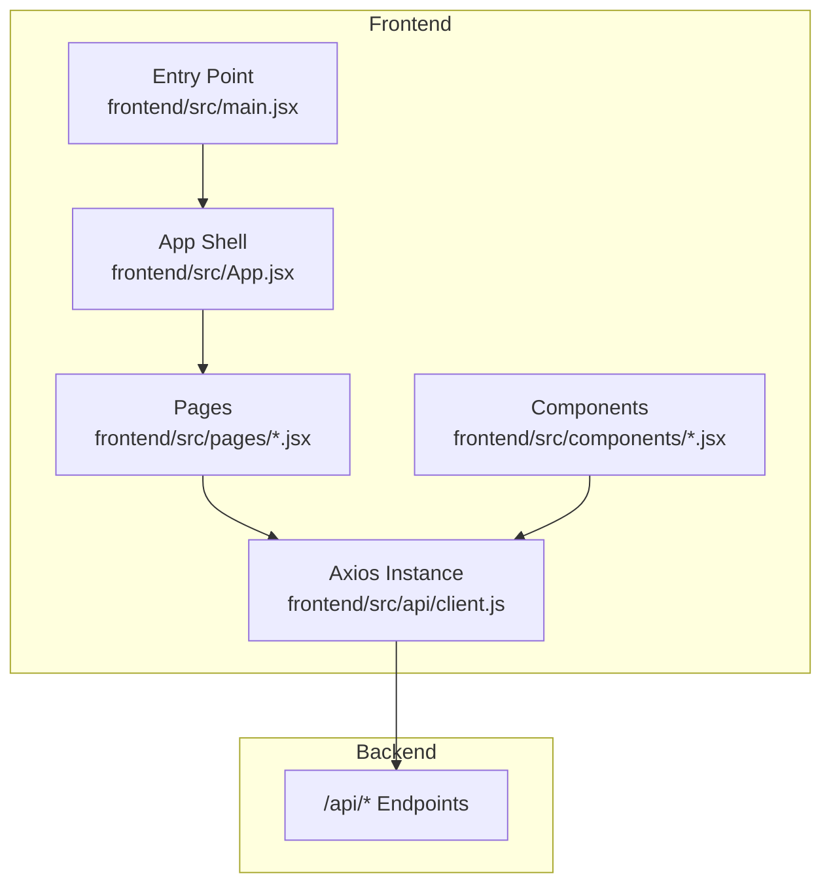
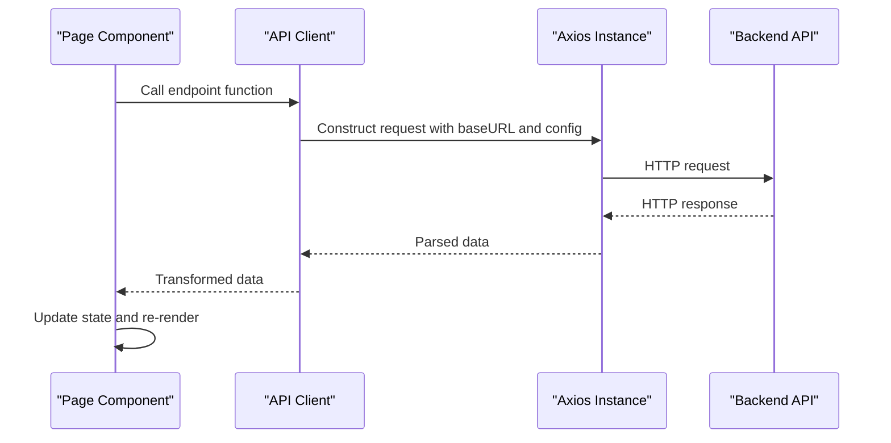
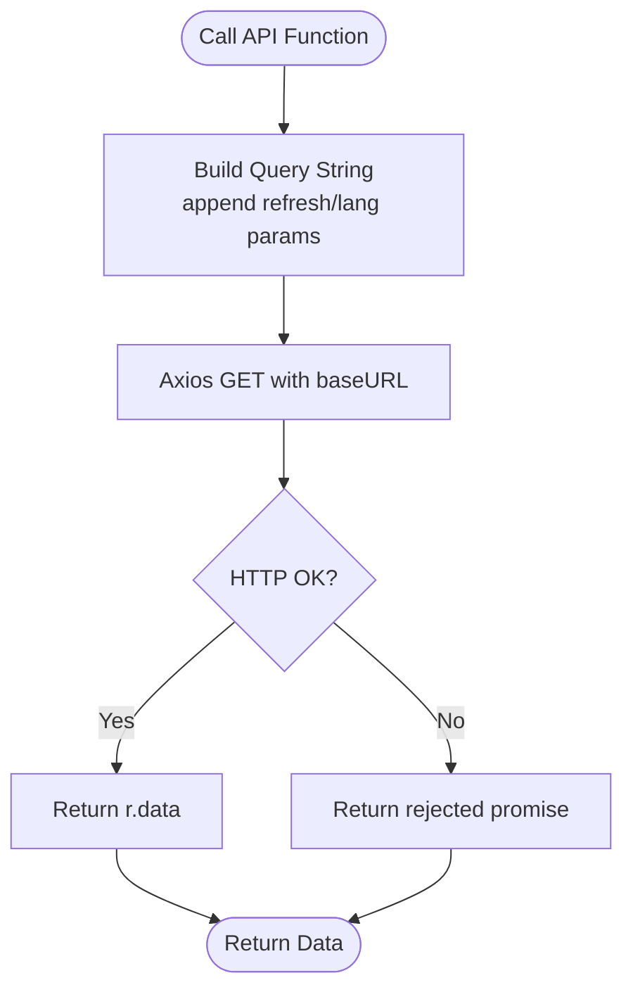
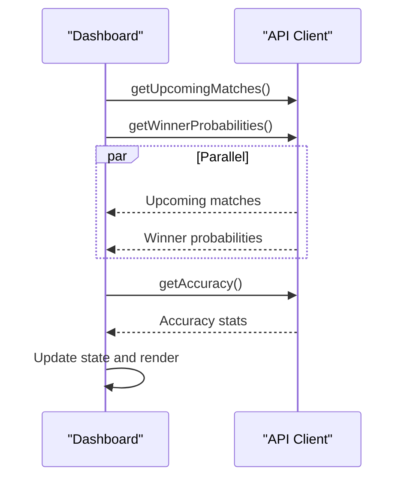
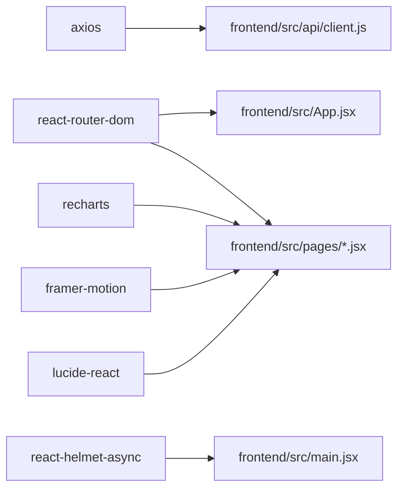

# API Integration

<cite>
**Referenced Files in This Document**
- [client.js](file://frontend/src/api/client.js)
- [main.jsx](file://frontend/src/main.jsx)
- [App.jsx](file://frontend/src/App.jsx)
- [Dashboard.jsx](file://frontend/src/pages/Dashboard.jsx)
- [Schedule.jsx](file://frontend/src/pages/Schedule.jsx)
- [Groups.jsx](file://frontend/src/pages/Groups.jsx)
- [Tournament.jsx](file://frontend/src/pages/Tournament.jsx)
- [Predictions.jsx](file://frontend/src/pages/Predictions.jsx)
- [TeamDetail.jsx](file://frontend/src/pages/TeamDetail.jsx)
- [MatchDetail.jsx](file://frontend/src/pages/MatchDetail.jsx)
- [MatchCard.jsx](file://frontend/src/components/MatchCard.jsx)
- [PredictionBar.jsx](file://frontend/src/components/PredictionBar.jsx)
- [package.json](file://frontend/package.json)
</cite>

## Table of Contents
1. [Introduction](#introduction)
2. [Project Structure](#project-structure)
3. [Core Components](#core-components)
4. [Architecture Overview](#architecture-overview)
5. [Detailed Component Analysis](#detailed-component-analysis)
6. [Dependency Analysis](#dependency-analysis)
7. [Performance Considerations](#performance-considerations)
8. [Troubleshooting Guide](#troubleshooting-guide)
9. [Conclusion](#conclusion)

## Introduction
This document describes the frontend API integration layer for the World Cup 2026 predictor application. It explains how the API client is structured, how requests and responses are handled, and how data fetching patterns, caching, and real-time updates are implemented across the UI. It also documents endpoint mapping, request configuration, response transformation, usage examples in components, loading state management, and error handling strategies.

## Project Structure
The frontend API integration centers around a single Axios-based client module that exposes convenience functions for each backend endpoint. Pages and components consume these functions to fetch data, manage loading states, and render predictions and schedules.

**Diagram sources**
- [client.js:1-50](file://frontend/src/api/client.js#L1-L50)
- [App.jsx:247-283](file://frontend/src/App.jsx#L247-L283)
- [main.jsx:1-22](file://frontend/src/main.jsx#L1-L22)

**Section sources**
- [client.js:1-50](file://frontend/src/api/client.js#L1-L50)
- [main.jsx:1-22](file://frontend/src/main.jsx#L1-L22)
- [App.jsx:247-283](file://frontend/src/App.jsx#L247-L283)

## Core Components
- API Client: Centralized Axios instance with base URL resolution and typed functions for each endpoint.
- Page Components: Consume the API client to fetch data, manage loading/error states, and render UI.
- Shared Components: Presentational components that rely on props from page-level data.

Key responsibilities:
- Endpoint mapping and request configuration
- Response transformation and normalization
- Loading state orchestration
- Real-time refresh triggers
- Error handling and fallbacks

**Section sources**
- [client.js:1-50](file://frontend/src/api/client.js#L1-L50)
- [Dashboard.jsx:137-158](file://frontend/src/pages/Dashboard.jsx#L137-L158)
- [Schedule.jsx:135-154](file://frontend/src/pages/Schedule.jsx#L135-L154)
- [Groups.jsx:11-23](file://frontend/src/pages/Groups.jsx#L11-L23)
- [Tournament.jsx:184-201](file://frontend/src/pages/Tournament.jsx#L184-L201)
- [Predictions.jsx:277-298](file://frontend/src/pages/Predictions.jsx#L277-L298)
- [TeamDetail.jsx:82-117](file://frontend/src/pages/TeamDetail.jsx#L82-L117)
- [MatchDetail.jsx:723-760](file://frontend/src/pages/MatchDetail.jsx#L723-L760)

## Architecture Overview
The frontend uses a thin API client that wraps Axios. Pages orchestrate data fetching via React hooks, often combining multiple endpoints with Promise.all for concurrent loads. Components receive normalized data and render predictions, schedules, and analytics.

**Diagram sources**
- [client.js:1-50](file://frontend/src/api/client.js#L1-L50)
- [Dashboard.jsx:147-156](file://frontend/src/pages/Dashboard.jsx#L147-L156)
- [Schedule.jsx:149-154](file://frontend/src/pages/Schedule.jsx#L149-L154)

## Detailed Component Analysis

### API Client Implementation
The client defines a base URL resolved from environment variables and creates an Axios instance with a default timeout. It exports convenience functions for each endpoint, returning raw data after successful HTTP responses.

- Base URL resolution: Uses VITE_API_URL if present, otherwise defaults to "/api".
- Request configuration: Global timeout of 15 seconds; special overrides for long-running operations.
- Response handling: Returns r.data from each Axios call.

Endpoints covered:
- Teams: getTeams, getTeam
- Matches: getMatches, getTodayMatches, getUpcomingMatches, getUpsetWatch, getMatch, submitResult
- Predictions: getPrediction, getPredictionHistory, generateAllPredictions
- Groups: getGroups, getGroup, getGroupScenarios
- Tournament: getTournamentBracket, getWinnerProbabilities, getRoadToFinal
- Analytics: getAccuracy
- Sync: syncResults
- Simulations: simulateKnockoutBracket
- Match metadata: getMatchSuspensions, getLineup, getH2H, getAgentSession

**Diagram sources**
- [client.js:19-25](file://frontend/src/api/client.js#L19-L25)

**Section sources**
- [client.js:1-50](file://frontend/src/api/client.js#L1-L50)

### Data Fetching Patterns
- Concurrent loads: Pages commonly use Promise.all to fetch multiple datasets in parallel.
- Conditional fetching: Some pages fetch additional resources only when primary data is available.
- Language-aware requests: Prediction endpoints accept a language parameter to localize outputs.
- Real-time refresh: Prediction endpoints support a refresh flag to bypass cached results.

Examples:
- Dashboard: Loads upcoming matches and winner probabilities concurrently, then accuracy.
- Schedule: Loads all matches and teams concurrently.
- Predictions: Loads group-stage matches and accuracy concurrently.
- TeamDetail: Loads team data and sets up periodic reloads when a match day is detected.
- MatchDetail: Loads match and prediction, then conditionally fetches lineup, H2H, history, and suspensions.

**Diagram sources**
- [Dashboard.jsx:147-156](file://frontend/src/pages/Dashboard.jsx#L147-L156)

**Section sources**
- [Dashboard.jsx:137-158](file://frontend/src/pages/Dashboard.jsx#L137-L158)
- [Schedule.jsx:149-154](file://frontend/src/pages/Schedule.jsx#L149-L154)
- [Predictions.jsx:290-298](file://frontend/src/pages/Predictions.jsx#L290-L298)
- [TeamDetail.jsx:90-117](file://frontend/src/pages/TeamDetail.jsx#L90-L117)
- [MatchDetail.jsx:739-756](file://frontend/src/pages/MatchDetail.jsx#L739-L756)

### Loading State Management
- Pages define a loading state and set it to false in a finally block after fetching.
- Many pages render skeleton loaders while loading.
- Some pages use minimal placeholders when no data is returned.

Patterns:
- useState for loading booleans
- useEffect to trigger initial fetch
- Conditional rendering based on loading and data presence

**Section sources**
- [Dashboard.jsx:142-158](file://frontend/src/pages/Dashboard.jsx#L142-L158)
- [Schedule.jsx:139-154](file://frontend/src/pages/Schedule.jsx#L139-L154)
- [Groups.jsx:14-23](file://frontend/src/pages/Groups.jsx#L14-L23)
- [Tournament.jsx:187-201](file://frontend/src/pages/Tournament.jsx#L187-L201)
- [Predictions.jsx:282-298](file://frontend/src/pages/Predictions.jsx#L282-L298)
- [TeamDetail.jsx:87-117](file://frontend/src/pages/TeamDetail.jsx#L87-L117)
- [MatchDetail.jsx:729-760](file://frontend/src/pages/MatchDetail.jsx#L729-L760)

### Error Handling Strategies
- Try/catch blocks around fetch sequences to log errors without crashing.
- Catch-all handlers on individual fetches to prevent unhandled rejections.
- Fallbacks: Empty arrays or null states when data is unavailable.
- No global error boundaries are implemented in the provided code.

Recommendations:
- Add centralized error reporting/logging.
- Implement global error boundaries to gracefully handle network failures.
- Consider optimistic updates with rollback on failure.

**Section sources**
- [Dashboard.jsx:149-155](file://frontend/src/pages/Dashboard.jsx#L149-L155)
- [MatchDetail.jsx:466-470](file://frontend/src/pages/MatchDetail.jsx#L466-L470)
- [MatchDetail.jsx:746-750](file://frontend/src/pages/MatchDetail.jsx#L746-L750)

### Real-Time Updates and Refresh
- Prediction refresh: The getPrediction function accepts a refresh flag to force fresh results.
- Periodic polling: TeamDetail sets an interval to reload team data when a match day is detected.
- Live indicators: Components render live status chips and dynamic charts.

**Section sources**
- [client.js:19-25](file://frontend/src/api/client.js#L19-L25)
- [TeamDetail.jsx:107-117](file://frontend/src/pages/TeamDetail.jsx#L107-L117)
- [MatchCard.jsx:15-19](file://frontend/src/components/MatchCard.jsx#L15-L19)

### Response Transformation
- The client returns raw data from Axios responses.
- Pages normalize and transform data for rendering:
  - Formatting dates and times
  - Computing derived metrics (e.g., goals difference)
  - Building charts and progress bars
  - Localizing labels and confidence tiers

**Section sources**
- [client.js:9-50](file://frontend/src/api/client.js#L9-L50)
- [Schedule.jsx:170-187](file://frontend/src/pages/Schedule.jsx#L170-L187)
- [TeamDetail.jsx:129-135](file://frontend/src/pages/TeamDetail.jsx#L129-L135)
- [PredictionBar.jsx:3-49](file://frontend/src/components/PredictionBar.jsx#L3-L49)

### API Endpoint Mapping and Request Configuration
- Base URL: Resolved from VITE_API_URL or defaults to "/api".
- Timeout: 15 seconds for most requests; some operations override with extended timeouts.
- Query parameters: refresh and lang flags for prediction endpoints.
- Request bodies: submitResult posts match results; generateAllPredictions posts to a generation endpoint.

**Section sources**
- [client.js:3-7](file://frontend/src/api/client.js#L3-L7)
- [client.js:19-25](file://frontend/src/api/client.js#L19-L25)
- [client.js:30-31](file://frontend/src/api/client.js#L30-L31)
- [client.js:17-17](file://frontend/src/api/client.js#L17-L17)

### Integration with Backend Endpoints and Data Synchronization
- Pages coordinate multiple endpoints to assemble complete views.
- Tournament and analytics endpoints feed bracket visuals and probability displays.
- TeamDetail integrates match histories and ELO trends.

**Section sources**
- [Tournament.jsx:184-201](file://frontend/src/pages/Tournament.jsx#L184-L201)
- [Tournament.jsx:264-279](file://frontend/src/pages/Tournament.jsx#L264-L279)
- [TeamDetail.jsx:234-251](file://frontend/src/pages/TeamDetail.jsx#L234-L251)

## Dependency Analysis
The frontend depends on Axios for HTTP transport and React ecosystem packages for routing, rendering, and UI.

**Diagram sources**
- [client.js:1-1](file://frontend/src/api/client.js#L1-L1)
- [package.json:38-47](file://frontend/package.json#L38-L47)
- [main.jsx:1-14](file://frontend/src/main.jsx#L1-L14)
- [App.jsx:1-12](file://frontend/src/App.jsx#L1-L12)

**Section sources**
- [package.json:38-47](file://frontend/package.json#L38-L47)

## Performance Considerations
- Prefer concurrent fetching with Promise.all to reduce total load time.
- Use environment-specific base URLs to avoid unnecessary proxy overhead.
- Apply targeted timeouts for long-running operations (e.g., prediction generation).
- Debounce or throttle frequent polling intervals.
- Lazy-load heavy visualizations until needed.

## Troubleshooting Guide
Common issues and remedies:
- Network errors: Ensure VITE_API_URL is configured correctly; verify backend availability.
- Stale data: Use the refresh flag for prediction endpoints during testing or debugging.
- Missing data: Confirm endpoint responses and handle empty arrays/null states gracefully.
- Rendering crashes: Wrap components in error boundaries and add defensive checks for optional fields.

**Section sources**
- [client.js:3-7](file://frontend/src/api/client.js#L3-L7)
- [client.js:19-25](file://frontend/src/api/client.js#L19-L25)
- [MatchDetail.jsx:746-750](file://frontend/src/pages/MatchDetail.jsx#L746-L750)

## Conclusion
The frontend API integration is concise, focused, and effective. It leverages a centralized client, predictable data-fetching patterns, and component-driven rendering. By expanding error handling, adding global error boundaries, and optimizing polling strategies, the integration can become more robust and responsive.