# Frontend Application

<cite>
**Referenced Files in This Document**
- [main.jsx](file://frontend/src/main.jsx)
- [App.jsx](file://frontend/src/App.jsx)
- [package.json](file://frontend/package.json)
- [vite.config.js](file://frontend/vite.config.js)
- [tailwind.config.js](file://frontend/tailwind.config.js)
- [ThemeContext.jsx](file://frontend/src/contexts/ThemeContext.jsx)
- [LanguageContext.jsx](file://frontend/src/contexts/LanguageContext.jsx)
- [translations.js](file://frontend/src/i18n/translations.js)
- [client.js](file://frontend/src/api/client.js)
- [MatchCard.jsx](file://frontend/src/components/MatchCard.jsx)
- [PredictionBar.jsx](file://frontend/src/components/PredictionBar.jsx)
- [GroupTable.jsx](file://frontend/src/components/GroupTable.jsx)
- [FlagImage.jsx](file://frontend/src/components/FlagImage.jsx)
- [TangOrnaments.jsx](file://frontend/src/components/TangOrnaments.jsx)
- [SEO.jsx](file://frontend/src/components/SEO.jsx)
- [Dashboard.jsx](file://frontend/src/pages/Dashboard.jsx)
- [Schedule.jsx](file://frontend/src/pages/Schedule.jsx)
- [MatchDetail.jsx](file://frontend/src/pages/MatchDetail.jsx)
- [TeamDetail.jsx](file://frontend/src/pages/TeamDetail.jsx)
- [Groups.jsx](file://frontend/src/pages/Groups.jsx)
- [Tournament.jsx](file://frontend/src/pages/Tournament.jsx)
- [Predictions.jsx](file://frontend/src/pages/Predictions.jsx)
</cite>

## Table of Contents
1. [Introduction](#introduction)
2. [Project Structure](#project-structure)
3. [Core Components](#core-components)
4. [Architecture Overview](#architecture-overview)
5. [Detailed Component Analysis](#detailed-component-analysis)
6. [Dependency Analysis](#dependency-analysis)
7. [Performance Considerations](#performance-considerations)
8. [Troubleshooting Guide](#troubleshooting-guide)
9. [Conclusion](#conclusion)

## Introduction
This document describes the React-based frontend application architecture for the World Cup 2026 predictor. It covers the component-based design with React 18 features, routing with React Router, state management patterns, page structure, UI component library, theming and internationalization, responsive design, API integration, error handling, loading states, component composition, and performance optimization strategies.

## Project Structure
The frontend is organized into clear layers:
- Entry point initializes React 18 with hydration and Helmet for SEO metadata.
- App sets up routing, navigation, and global providers for theme and language.
- Pages implement the main views: Dashboard, Schedule, MatchDetail, TeamDetail, Groups, Tournament, Predictions.
- Components encapsulate reusable UI elements and data visualization.
- Contexts manage theme and internationalization state.
- API client abstracts backend communication.
- Tailwind CSS config defines a custom design system with Chinese landscape aesthetics.

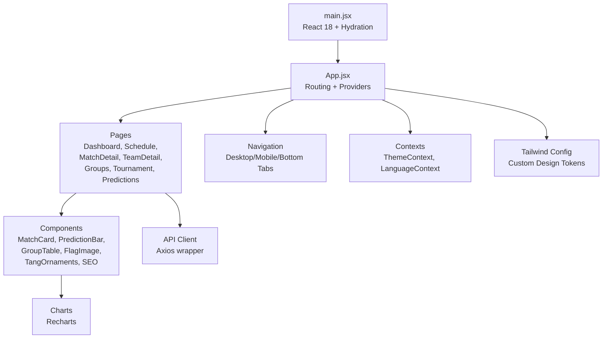

**Diagram sources**
- [main.jsx:1-22](file://frontend/src/main.jsx#L1-L22)
- [App.jsx:1-284](file://frontend/src/App.jsx#L1-L284)
- [Dashboard.jsx:1-706](file://frontend/src/pages/Dashboard.jsx#L1-L706)
- [Schedule.jsx:1-494](file://frontend/src/pages/Schedule.jsx#L1-L494)
- [MatchDetail.jsx:1-800](file://frontend/src/pages/MatchDetail.jsx#L1-L800)
- [TeamDetail.jsx:1-392](file://frontend/src/pages/TeamDetail.jsx#L1-L392)
- [Groups.jsx:1-160](file://frontend/src/pages/Groups.jsx#L1-L160)
- [Tournament.jsx](file://frontend/src/pages/Tournament.jsx)
- [Predictions.jsx](file://frontend/src/pages/Predictions.jsx)
- [MatchCard.jsx:1-175](file://frontend/src/components/MatchCard.jsx#L1-L175)
- [PredictionBar.jsx](file://frontend/src/components/PredictionBar.jsx)
- [GroupTable.jsx](file://frontend/src/components/GroupTable.jsx)
- [FlagImage.jsx](file://frontend/src/components/FlagImage.jsx)
- [TangOrnaments.jsx](file://frontend/src/components/TangOrnaments.jsx)
- [SEO.jsx](file://frontend/src/components/SEO.jsx)
- [ThemeContext.jsx:1-27](file://frontend/src/contexts/ThemeContext.jsx#L1-L27)
- [LanguageContext.jsx:1-69](file://frontend/src/contexts/LanguageContext.jsx#L1-L69)
- [client.js:1-50](file://frontend/src/api/client.js#L1-L50)
- [tailwind.config.js:1-161](file://frontend/tailwind.config.js#L1-L161)

**Section sources**
- [main.jsx:1-22](file://frontend/src/main.jsx#L1-L22)
- [App.jsx:1-284](file://frontend/src/App.jsx#L1-L284)
- [package.json:1-72](file://frontend/package.json#L1-L72)
- [vite.config.js:1-26](file://frontend/vite.config.js#L1-L26)
- [tailwind.config.js:1-161](file://frontend/tailwind.config.js#L1-L161)

## Core Components
- Navigation and Routing
  - Centralized routes for Dashboard, Schedule, Groups, Tournament, MatchDetail, TeamDetail, Predictions with legacy redirects.
  - Responsive navigation with desktop, mobile top bar, and bottom tab bar.
- Providers
  - ThemeProvider persists and toggles dark/light mode using localStorage and prefers-color-scheme.
  - LanguageProvider manages language switching and exposes translation helpers and localized formatters.
- API Client
  - Axios-based client with base URL resolution and convenience methods for teams, matches, predictions, groups, tournament, analytics, and suspensions.
- UI Library
  - MatchCard: compact fixture preview with flags, scores, confidence, and prediction bar.
  - PredictionBar: horizontal probability visualization.
  - GroupTable: standings table with team flags and metrics.
  - FlagImage: country flag rendering.
  - TangOrnaments: decorative SVG elements.
  - SEO: structured metadata and JSON-LD helpers.

**Section sources**
- [App.jsx:1-284](file://frontend/src/App.jsx#L1-L284)
- [ThemeContext.jsx:1-27](file://frontend/src/contexts/ThemeContext.jsx#L1-L27)
- [LanguageContext.jsx:1-69](file://frontend/src/contexts/LanguageContext.jsx#L1-L69)
- [client.js:1-50](file://frontend/src/api/client.js#L1-L50)
- [MatchCard.jsx:1-175](file://frontend/src/components/MatchCard.jsx#L1-L175)
- [PredictionBar.jsx](file://frontend/src/components/PredictionBar.jsx)
- [GroupTable.jsx](file://frontend/src/components/GroupTable.jsx)
- [FlagImage.jsx](file://frontend/src/components/FlagImage.jsx)
- [TangOrnaments.jsx](file://frontend/src/components/TangOrnaments.jsx)
- [SEO.jsx](file://frontend/src/components/SEO.jsx)

## Architecture Overview
The app follows a layered architecture:
- Entry and Providers: React 18 with hydration, Helmet for SEO, Theme and Language providers.
- Routing: BrowserRouter with nested routes for all pages.
- Pages: Feature-focused components fetching data via the API client.
- Components: Reusable UI elements with composition patterns and shared utilities.
- Styling: Tailwind CSS with custom design tokens and dark mode support.

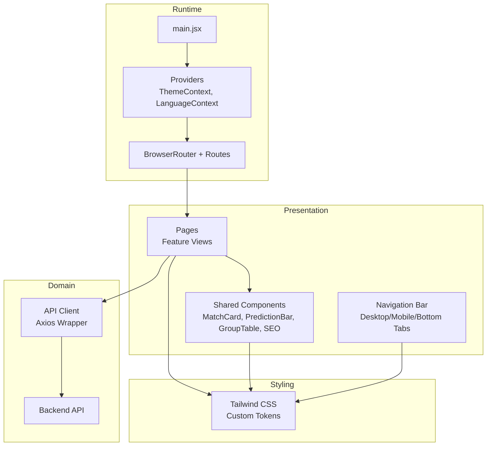

**Diagram sources**
- [main.jsx:1-22](file://frontend/src/main.jsx#L1-L22)
- [App.jsx:1-284](file://frontend/src/App.jsx#L1-L284)
- [ThemeContext.jsx:1-27](file://frontend/src/contexts/ThemeContext.jsx#L1-L27)
- [LanguageContext.jsx:1-69](file://frontend/src/contexts/LanguageContext.jsx#L1-L69)
- [client.js:1-50](file://frontend/src/api/client.js#L1-L50)
- [tailwind.config.js:1-161](file://frontend/tailwind.config.js#L1-L161)

## Detailed Component Analysis

### Navigation and Routing
- Desktop navigation displays a fixed header with logo, navigation links, language toggle, and theme toggle.
- Mobile navigation adapts with a sticky top bar and a bottom tab bar for touch-friendly access.
- Routes include legacy redirects for backward compatibility.

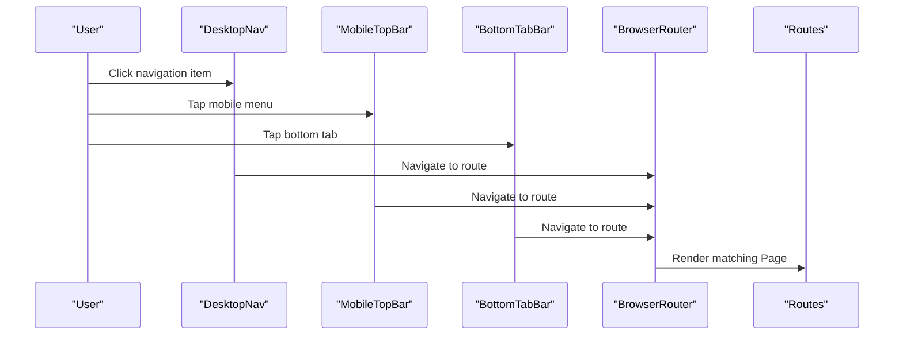

**Diagram sources**
- [App.jsx:99-245](file://frontend/src/App.jsx#L99-L245)
- [App.jsx:262-279](file://frontend/src/App.jsx#L262-L279)

**Section sources**
- [App.jsx:1-284](file://frontend/src/App.jsx#L1-L284)

### Theme and Internationalization
- ThemeContext
  - Persists theme preference in localStorage and applies a class to the root element for dark mode.
  - Provides a toggle function for switching themes.
- LanguageContext
  - Manages language selection and exposes translation function, localized date formatting, and team name resolver.
  - Translations include English and Chinese with team name mappings.

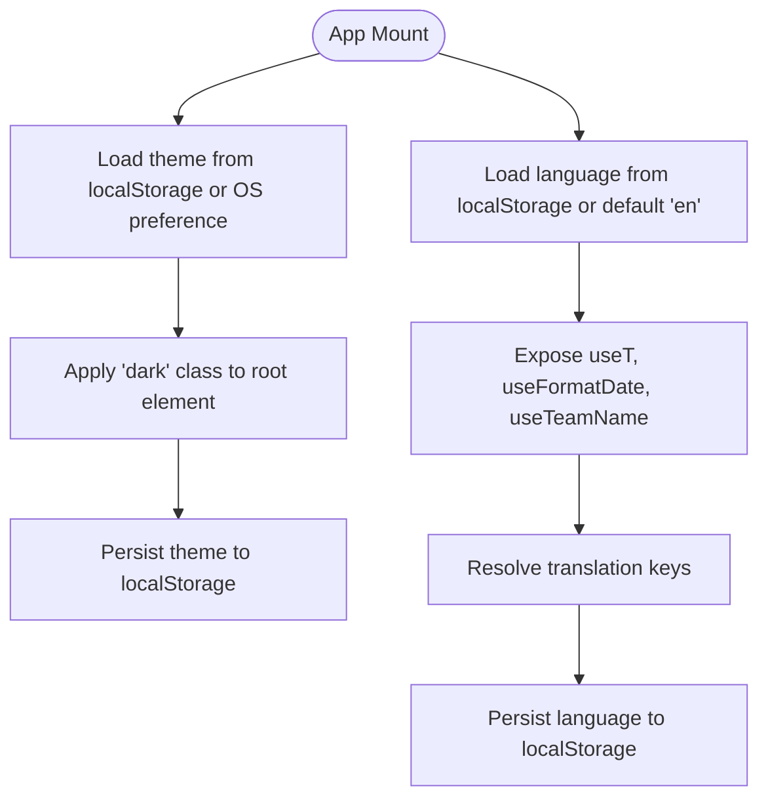

**Diagram sources**
- [ThemeContext.jsx:1-27](file://frontend/src/contexts/ThemeContext.jsx#L1-L27)
- [LanguageContext.jsx:1-69](file://frontend/src/contexts/LanguageContext.jsx#L1-L69)
- [translations.js:1-630](file://frontend/src/i18n/translations.js#L1-L630)

**Section sources**
- [ThemeContext.jsx:1-27](file://frontend/src/contexts/ThemeContext.jsx#L1-L27)
- [LanguageContext.jsx:1-69](file://frontend/src/contexts/LanguageContext.jsx#L1-L69)
- [translations.js:1-630](file://frontend/src/i18n/translations.js#L1-L630)

### API Client and Data Fetching
- The client wraps axios with a base URL derived from environment variables and provides typed fetchers for teams, matches, predictions, groups, tournament, analytics, suspensions, and lineups.
- Pages coordinate data loading using Promise.all for concurrent requests and handle errors gracefully.

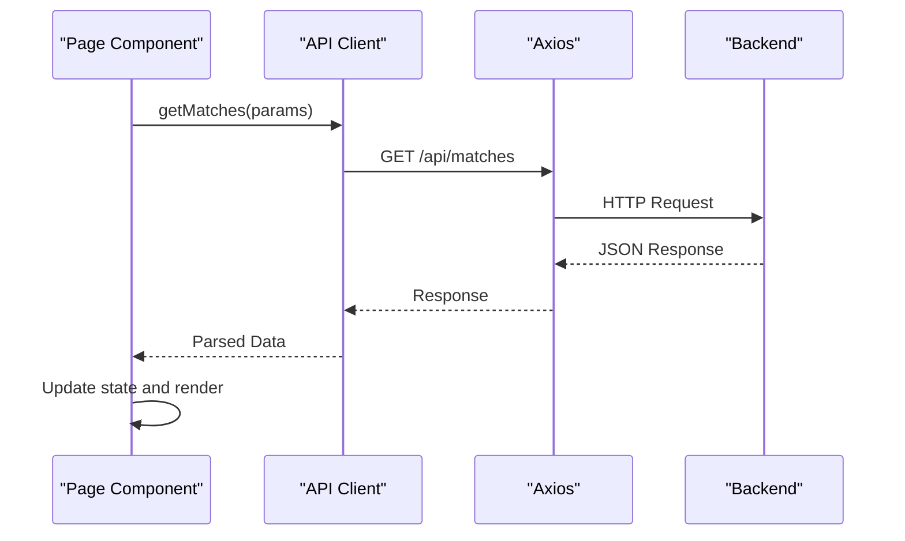

**Diagram sources**
- [client.js:1-50](file://frontend/src/api/client.js#L1-L50)
- [Dashboard.jsx:147-156](file://frontend/src/pages/Dashboard.jsx#L147-L156)
- [Schedule.jsx:149-154](file://frontend/src/pages/Schedule.jsx#L149-L154)

**Section sources**
- [client.js:1-50](file://frontend/src/api/client.js#L1-L50)
- [Dashboard.jsx:147-156](file://frontend/src/pages/Dashboard.jsx#L147-L156)
- [Schedule.jsx:149-154](file://frontend/src/pages/Schedule.jsx#L149-L154)

### Dashboard Page
- Features a hero banner with countdown timers, top picks leaderboard, accuracy stats, and a phase timeline.
- Renders upcoming matches grouped by date using MatchCard components.
- Integrates SEO metadata and decorative ornaments.

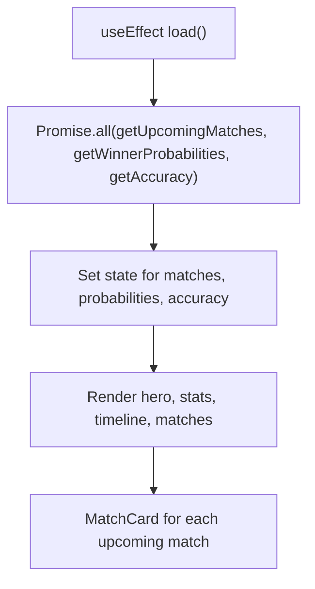

**Diagram sources**
- [Dashboard.jsx:137-159](file://frontend/src/pages/Dashboard.jsx#L137-L159)
- [MatchCard.jsx:1-175](file://frontend/src/components/MatchCard.jsx#L1-L175)

**Section sources**
- [Dashboard.jsx:1-706](file://frontend/src/pages/Dashboard.jsx#L1-L706)
- [MatchCard.jsx:1-175](file://frontend/src/components/MatchCard.jsx#L1-L175)

### Schedule Page
- Implements a searchable and filterable match listing with date and stage views.
- Uses MatchRow components to display match details with confidence badges and live indicators.
- Supports filtering by stage, group, status, and team.

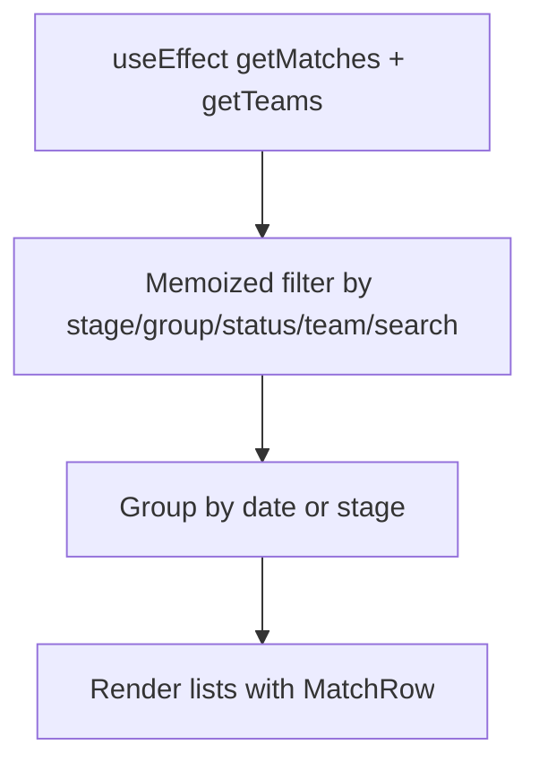

**Diagram sources**
- [Schedule.jsx:135-198](file://frontend/src/pages/Schedule.jsx#L135-L198)
- [MatchCard.jsx:1-175](file://frontend/src/components/MatchCard.jsx#L1-L175)

**Section sources**
- [Schedule.jsx:1-494](file://frontend/src/pages/Schedule.jsx#L1-L494)
- [MatchCard.jsx:1-175](file://frontend/src/components/MatchCard.jsx#L1-L175)

### MatchDetail Page
- Displays match hero with teams, venue, and status.
- Shows prediction history with charts, agent session viewer, suspensions panel, H2H timeline, and lineup formation.
- Integrates Recharts for visualization and celebrates correct predictions.

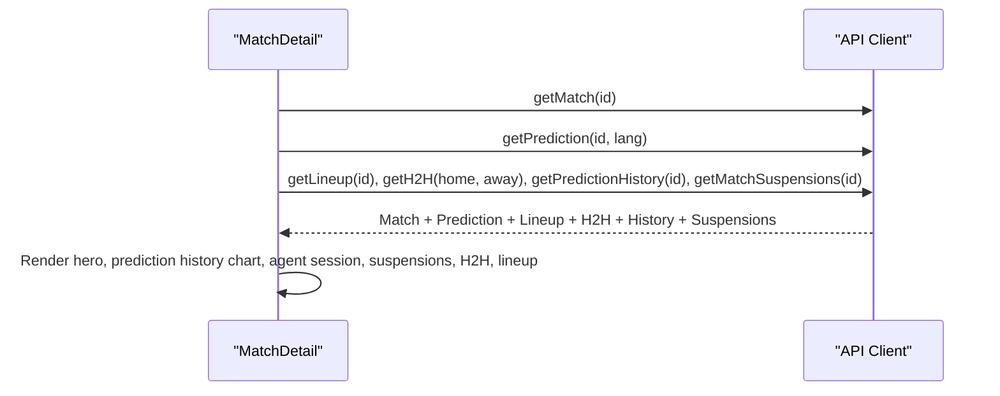

**Diagram sources**
- [MatchDetail.jsx:723-760](file://frontend/src/pages/MatchDetail.jsx#L723-L760)
- [client.js:1-50](file://frontend/src/api/client.js#L1-L50)

**Section sources**
- [MatchDetail.jsx:1-800](file://frontend/src/pages/MatchDetail.jsx#L1-L800)
- [client.js:1-50](file://frontend/src/api/client.js#L1-L50)

### TeamDetail Page
- Shows team profile, stats, ELO trend chart, group context, next match, knockout journey, and all matches.
- Uses Recharts AreaChart for ELO history and responsive layout.

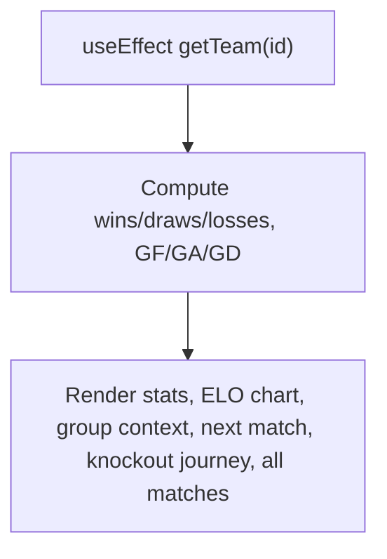

**Diagram sources**
- [TeamDetail.jsx:82-118](file://frontend/src/pages/TeamDetail.jsx#L82-L118)
- [TeamDetail.jsx:14-69](file://frontend/src/pages/TeamDetail.jsx#L14-L69)

**Section sources**
- [TeamDetail.jsx:1-392](file://frontend/src/pages/TeamDetail.jsx#L1-L392)

### Groups Page
- Displays group standings and recent matches for the selected group.
- Provides quick access to all groups with summary cards.

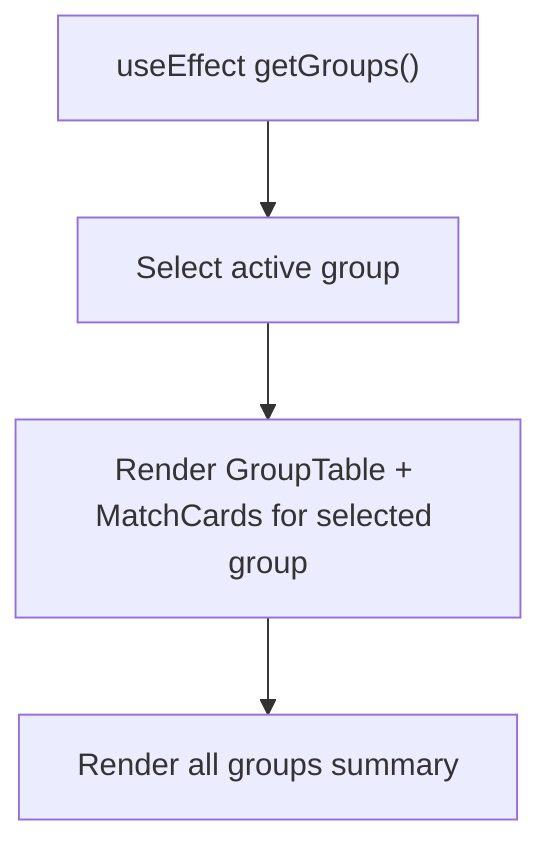

**Diagram sources**
- [Groups.jsx:11-40](file://frontend/src/pages/Groups.jsx#L11-L40)
- [GroupTable.jsx](file://frontend/src/components/GroupTable.jsx)

**Section sources**
- [Groups.jsx:1-160](file://frontend/src/pages/Groups.jsx#L1-L160)

### Tournament and Predictions Pages
- Tournament: Bracket visualization and winner probabilities.
- Predictions: Analytics and scoring explanations.

[No sources needed since these pages are placeholders referenced in routing and component library]

## Dependency Analysis
- Runtime Dependencies
  - React 18, React Router DOM, Axios, Lucide icons, Recharts, Framer Motion, React Helmet Async.
- Build and Dev Dependencies
  - Vite, Tailwind CSS, PostCSS, React Snap for pre-rendering, Vitest for testing.
- Browser Support
  - Vite targets modern browsers with transpilation for older Chromium versions to support react-snap.

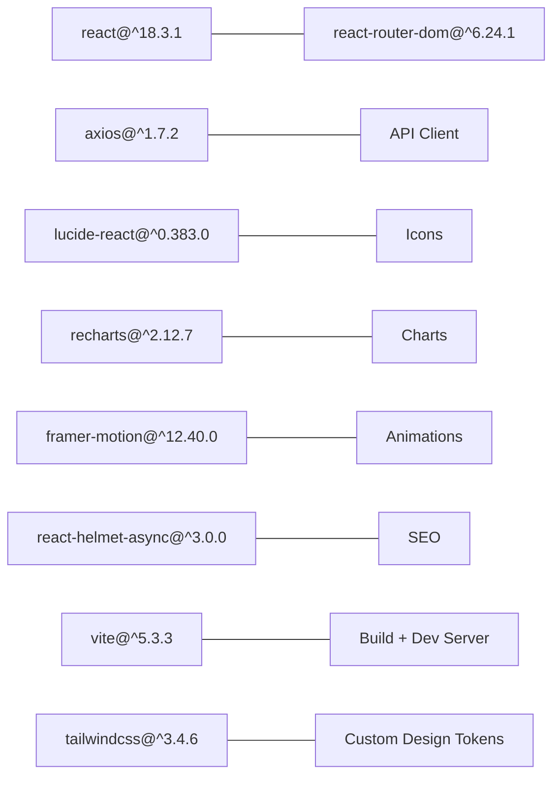

**Diagram sources**
- [package.json:38-69](file://frontend/package.json#L38-L69)
- [vite.config.js:1-26](file://frontend/vite.config.js#L1-L26)
- [tailwind.config.js:1-161](file://frontend/tailwind.config.js#L1-L161)

**Section sources**
- [package.json:1-72](file://frontend/package.json#L1-L72)
- [vite.config.js:1-26](file://frontend/vite.config.js#L1-L26)
- [tailwind.config.js:1-161](file://frontend/tailwind.config.js#L1-L161)

## Performance Considerations
- Pre-rendering and Hydration
  - React Snap pre-renders key routes and main.jsx conditionally hydrates to avoid re-render mismatches.
- Bundle Targets
  - Vite targets modern browsers while ensuring compatibility for older Chromium environments.
- Lazy Loading and Code Splitting
  - Pages are routed and loaded on demand; consider React.lazy for heavy pages (e.g., Tournament, Predictions) to reduce initial bundle size.
- Chart Rendering
  - Recharts components are rendered only when data is present to minimize unnecessary computations.
- Memoization
  - Pages use useMemo for derived data (e.g., filtered matches, grouped dates) to prevent recomputation.
- Image Optimization
  - Flag images are optimized via CDN and styled appropriately; consider lazy-loading for large lists.
- CSS and Utilities
  - Tailwind utilities enable efficient styling without runtime overhead; avoid excessive dynamic class generation.

[No sources needed since this section provides general guidance]

## Troubleshooting Guide
- Hydration Mismatch
  - Ensure conditional rendering in main.jsx matches server-side pre-rendered HTML to avoid hydration errors.
- API Failures
  - Pages catch and log errors during data fetching; confirm network connectivity and backend availability.
- Translation Keys
  - Missing translation keys fall back to the key itself; verify keys exist in translations.js for both languages.
- Dark Mode Persistence
  - Confirm localStorage entries for theme and language preferences; check browser storage settings.
- Responsive Issues
  - Verify Tailwind breakpoints and media queries; test on various screen sizes.

**Section sources**
- [main.jsx:16-21](file://frontend/src/main.jsx#L16-L21)
- [Dashboard.jsx:147-156](file://frontend/src/pages/Dashboard.jsx#L147-L156)
- [LanguageContext.jsx:28-36](file://frontend/src/contexts/LanguageContext.jsx#L28-L36)
- [ThemeContext.jsx:12-15](file://frontend/src/contexts/ThemeContext.jsx#L12-L15)

## Conclusion
The frontend employs a clean, component-based architecture with React 18, robust routing, and strong internationalization and theming foundations. The API client abstracts backend integration, while reusable components and Tailwind’s custom design system deliver a cohesive, responsive user experience. With memoization, pre-rendering, and targeted optimizations, the application balances performance and maintainability for a data-rich sports prediction platform.