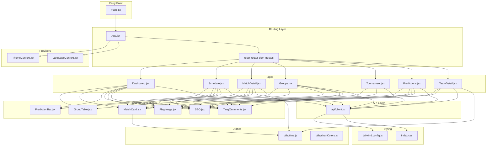
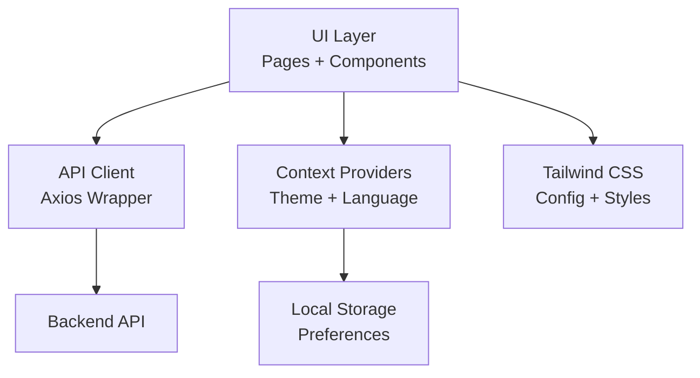
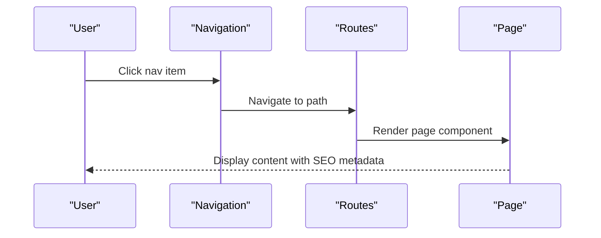
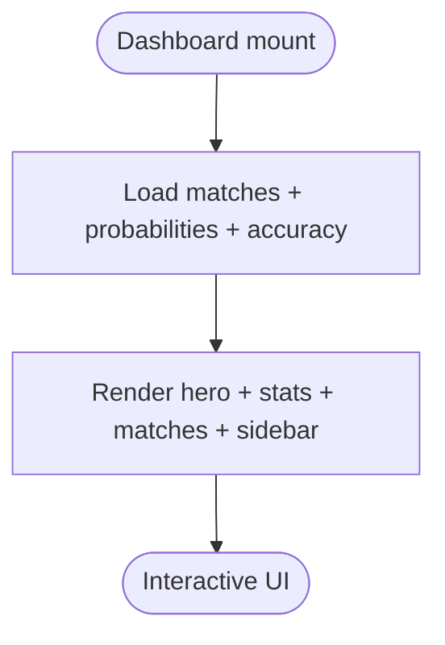
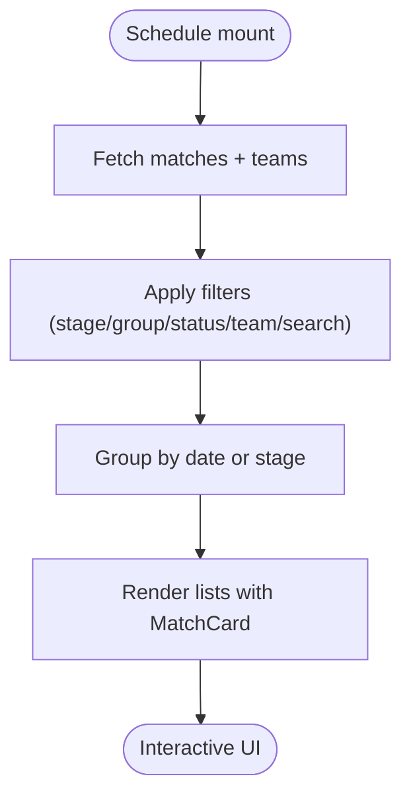
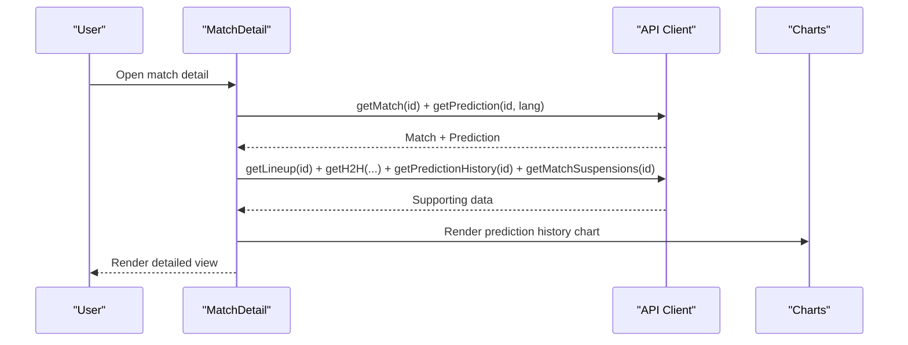
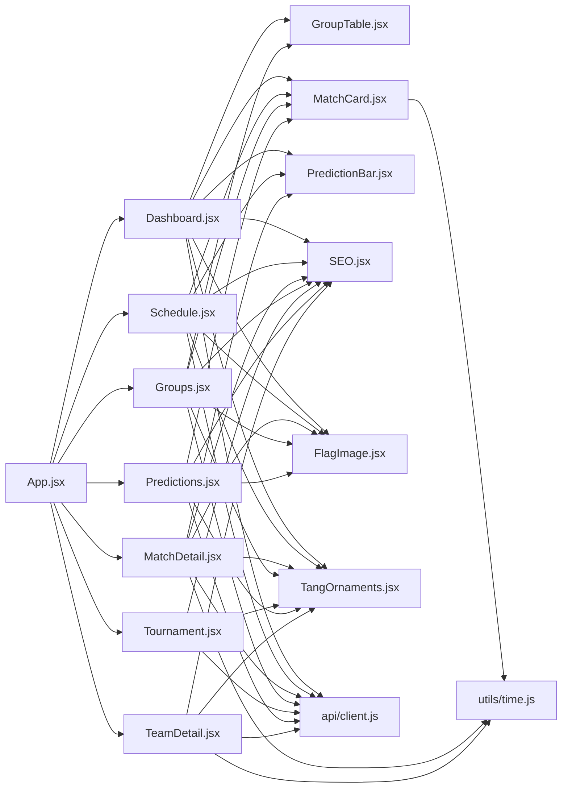

# Frontend Application

<cite>
**Referenced Files in This Document**
- [main.jsx](file://frontend/src/main.jsx)
- [App.jsx](file://frontend/src/App.jsx)
- [Dashboard.jsx](file://frontend/src/pages/Dashboard.jsx)
- [Schedule.jsx](file://frontend/src/pages/Schedule.jsx)
- [MatchDetail.jsx](file://frontend/src/pages/MatchDetail.jsx)
- [Groups.jsx](file://frontend/src/pages/Groups.jsx)
- [Tournament.jsx](file://frontend/src/pages/Tournament.jsx)
- [Predictions.jsx](file://frontend/src/pages/Predictions.jsx)
- [TeamDetail.jsx](file://frontend/src/pages/TeamDetail.jsx)
- [client.js](file://frontend/src/api/client.js)
- [ThemeContext.jsx](file://frontend/src/contexts/ThemeContext.jsx)
- [LanguageContext.jsx](file://frontend/src/contexts/LanguageContext.jsx)
- [GroupTable.jsx](file://frontend/src/components/GroupTable.jsx)
- [MatchCard.jsx](file://frontend/src/components/MatchCard.jsx)
- [PredictionBar.jsx](file://frontend/src/components/PredictionBar.jsx)
- [SEO.jsx](file://frontend/src/components/SEO.jsx)
- [FlagImage.jsx](file://frontend/src/components/FlagImage.jsx)
- [TangOrnaments.jsx](file://frontend/src/components/TangOrnaments.jsx)
- [time.js](file://frontend/src/utils/time.js)
- [chartColors.js](file://frontend/src/utils/chartColors.js)
- [tailwind.config.js](file://frontend/tailwind.config.js)
- [index.css](file://frontend/src/index.css)
</cite>

## Table of Contents
1. [Introduction](#introduction)
2. [Project Structure](#project-structure)
3. [Core Components](#core-components)
4. [Architecture Overview](#architecture-overview)
5. [Detailed Component Analysis](#detailed-component-analysis)
6. [Dependency Analysis](#dependency-analysis)
7. [Performance Considerations](#performance-considerations)
8. [Troubleshooting Guide](#troubleshooting-guide)
9. [Conclusion](#conclusion)

## Introduction
This document describes the React frontend application architecture for the World Cup 2026 predictions platform. It explains the component-based structure, page organization, navigation patterns, reusable UI components, state management via context providers, API client implementation, data fetching strategies, real-time update mechanisms, styling system using Tailwind CSS, responsive design patterns, accessibility features, internationalization, and theme switching functionality.

## Project Structure
The frontend is organized around a component-driven architecture with clear separation of concerns:
- Entry point initializes the React app with hydration support and SEO metadata provider
- App wraps routing and global UI with theme and language providers
- Pages implement domain-specific views with shared components
- API client encapsulates HTTP requests to the backend
- Context providers manage theme and language state
- Utilities handle time formatting and localization
- Styling leverages Tailwind CSS with custom configurations

**Diagram sources**
- [main.jsx:1-22](file://frontend/src/main.jsx#L1-L22)
- [App.jsx:1-284](file://frontend/src/App.jsx#L1-L284)
- [Dashboard.jsx:1-706](file://frontend/src/pages/Dashboard.jsx#L1-L706)
- [Schedule.jsx:1-494](file://frontend/src/pages/Schedule.jsx#L1-L494)
- [MatchDetail.jsx:1-1345](file://frontend/src/pages/MatchDetail.jsx#L1-L1345)
- [Groups.jsx:1-160](file://frontend/src/pages/Groups.jsx#L1-L160)
- [Tournament.jsx:1-444](file://frontend/src/pages/Tournament.jsx#L1-L444)
- [Predictions.jsx:1-514](file://frontend/src/pages/Predictions.jsx#L1-L514)
- [TeamDetail.jsx:1-392](file://frontend/src/pages/TeamDetail.jsx#L1-L392)
- [client.js:1-50](file://frontend/src/api/client.js#L1-L50)
- [ThemeContext.jsx:1-27](file://frontend/src/contexts/ThemeContext.jsx#L1-L27)
- [LanguageContext.jsx:1-69](file://frontend/src/contexts/LanguageContext.jsx#L1-L69)
- [GroupTable.jsx:1-78](file://frontend/src/components/GroupTable.jsx#L1-L78)
- [MatchCard.jsx:1-175](file://frontend/src/components/MatchCard.jsx#L1-L175)
- [PredictionBar.jsx](file://frontend/src/components/PredictionBar.jsx)
- [SEO.jsx](file://frontend/src/components/SEO.jsx)
- [FlagImage.jsx](file://frontend/src/components/FlagImage.jsx)
- [TangOrnaments.jsx](file://frontend/src/components/TangOrnaments.jsx)
- [time.js](file://frontend/src/utils/time.js)
- [chartColors.js](file://frontend/src/utils/chartColors.js)
- [tailwind.config.js](file://frontend/tailwind.config.js)
- [index.css](file://frontend/src/index.css)

**Section sources**
- [main.jsx:1-22](file://frontend/src/main.jsx#L1-L22)
- [App.jsx:1-284](file://frontend/src/App.jsx#L1-L284)

## Core Components
This section outlines the primary building blocks used across pages.

- Navigation and Layout
  - Desktop and mobile navigation bars with theme and language toggles
  - Route-based rendering of pages with SEO metadata injection
  - Responsive design using Tailwind utilities and safe-area insets

- Reusable UI Components
  - MatchCard: Predictive match preview with confidence chips and outcomes
  - GroupTable: Standings table with top-two advancement indicators
  - PredictionBar: Horizontal probability visualization for match outcomes
  - FlagImage: Team flag rendering with fallbacks
  - SEO: Structured metadata and JSON-LD generation
  - TangOrnaments: Decorative watermarks and patterns for visual branding

- State Management
  - ThemeContext: Persists theme preference and applies dark/light classes
  - LanguageContext: Switches language and exposes localized helpers

- API Client
  - Centralized axios client with base URL resolution and typed endpoints

**Section sources**
- [App.jsx:13-284](file://frontend/src/App.jsx#L13-L284)
- [MatchCard.jsx:1-175](file://frontend/src/components/MatchCard.jsx#L1-L175)
- [GroupTable.jsx:1-78](file://frontend/src/components/GroupTable.jsx#L1-L78)
- [PredictionBar.jsx](file://frontend/src/components/PredictionBar.jsx)
- [FlagImage.jsx](file://frontend/src/components/FlagImage.jsx)
- [SEO.jsx](file://frontend/src/components/SEO.jsx)
- [TangOrnaments.jsx](file://frontend/src/components/TangOrnaments.jsx)
- [ThemeContext.jsx:1-27](file://frontend/src/contexts/ThemeContext.jsx#L1-L27)
- [LanguageContext.jsx:1-69](file://frontend/src/contexts/LanguageContext.jsx#L1-L69)
- [client.js:1-50](file://frontend/src/api/client.js#L1-L50)

## Architecture Overview
The application follows a layered architecture:
- Presentation Layer: Pages and components render UI and orchestrate data fetching
- Domain Services: API client abstracts backend communication
- State Management: Context providers supply theme and language state
- Styling: Tailwind CSS with custom configuration and global styles

**Diagram sources**
- [App.jsx:1-284](file://frontend/src/App.jsx#L1-L284)
- [client.js:1-50](file://frontend/src/api/client.js#L1-L50)
- [ThemeContext.jsx:1-27](file://frontend/src/contexts/ThemeContext.jsx#L1-L27)
- [LanguageContext.jsx:1-69](file://frontend/src/contexts/LanguageContext.jsx#L1-L69)
- [tailwind.config.js](file://frontend/tailwind.config.js)
- [index.css](file://frontend/src/index.css)

## Detailed Component Analysis

### Navigation and Routing
- Navigation keys define the top-level menu with icons and localized labels
- ThemeToggle and LangToggle provide quick switches with persistent storage
- Desktop navigation uses a fixed header with gradient backgrounds and backdrop filters
- Mobile navigation adapts with a bottom tab bar and top bar
- Routes map to pages with legacy redirects for compatibility

**Diagram sources**
- [App.jsx:13-284](file://frontend/src/App.jsx#L13-L284)

**Section sources**
- [App.jsx:13-284](file://frontend/src/App.jsx#L13-L284)

### Dashboard
- Features a hero banner with decorative elements and countdown timers
- Displays upcoming matches, top picks, and tournament statistics
- Uses concurrent data loading for matches, probabilities, and accuracy
- Implements responsive grids and animated transitions

**Diagram sources**
- [Dashboard.jsx:147-158](file://frontend/src/pages/Dashboard.jsx#L147-L158)

**Section sources**
- [Dashboard.jsx:1-706](file://frontend/src/pages/Dashboard.jsx#L1-L706)

### Schedule
- Provides filtering by stage, group, status, and team
- Supports date-based and stage-based views
- Renders match rows with live/completed indicators and confidence badges
- Uses time utilities for SGT conversion and formatting

**Diagram sources**
- [Schedule.jsx:149-154](file://frontend/src/pages/Schedule.jsx#L149-L154)
- [MatchCard.jsx:21-175](file://frontend/src/components/MatchCard.jsx#L21-L175)

**Section sources**
- [Schedule.jsx:1-494](file://frontend/src/pages/Schedule.jsx#L1-L494)

### MatchDetail
- Comprehensive single-match view with prediction bar, H2H timeline, suspensions, and lineup
- Integrates multi-agent session viewer and prediction history charts
- Handles real-time updates for live matches with periodic polling
- Generates structured data for SEO (JSON-LD)

**Diagram sources**
- [MatchDetail.jsx:723-760](file://frontend/src/pages/MatchDetail.jsx#L723-L760)
- [client.js:16-28](file://frontend/src/api/client.js#L16-L28)

**Section sources**
- [MatchDetail.jsx:1-1345](file://frontend/src/pages/MatchDetail.jsx#L1-L1345)

### Groups
- Displays group tables and matches with interactive selection
- Shows group overview cards linking to detailed tables
- Uses team name translation for Chinese locale

**Section sources**
- [Groups.jsx:1-160](file://frontend/src/pages/Groups.jsx#L1-L160)
- [GroupTable.jsx:1-78](file://frontend/src/components/GroupTable.jsx#L1-L78)

### Tournament
- Horizontal bracket visualization with SVG connectors
- Winner probabilities podium and full rankings
- Multiple road-to-final snapshots selectable by user

**Section sources**
- [Tournament.jsx:1-444](file://frontend/src/pages/Tournament.jsx#L1-L444)

### Predictions
- Lists group-stage matches with prediction outcomes and grading
- Includes scoring methodology modal and statistics
- Filters by status and group with date grouping

**Section sources**
- [Predictions.jsx:1-514](file://frontend/src/pages/Predictions.jsx#L1-L514)

### TeamDetail
- Team profile with stats, ELO trend chart, group standings, and match history
- Polls for live match updates during match days
- Generates team-specific SEO metadata

**Section sources**
- [TeamDetail.jsx:1-392](file://frontend/src/pages/TeamDetail.jsx#L1-L392)

### Shared Components and Utilities
- MatchCard: Predictive card with confidence chips and status indicators
- GroupTable: Standings table with hover and selection affordances
- PredictionBar: Horizontal bar representing outcome probabilities
- FlagImage: Team flag rendering with lazy loading considerations
- SEO: Dynamic meta tags and JSON-LD generation
- TangOrnaments: Decorative patterns for visual branding
- time utilities: Locale-aware date formatting and SGT conversions
- chartColors: Consistent color palette for charts

**Section sources**
- [MatchCard.jsx:1-175](file://frontend/src/components/MatchCard.jsx#L1-L175)
- [GroupTable.jsx:1-78](file://frontend/src/components/GroupTable.jsx#L1-L78)
- [PredictionBar.jsx](file://frontend/src/components/PredictionBar.jsx)
- [FlagImage.jsx](file://frontend/src/components/FlagImage.jsx)
- [SEO.jsx](file://frontend/src/components/SEO.jsx)
- [TangOrnaments.jsx](file://frontend/src/components/TangOrnaments.jsx)
- [time.js](file://frontend/src/utils/time.js)
- [chartColors.js](file://frontend/src/utils/chartColors.js)

## Dependency Analysis
The application exhibits low coupling and high cohesion:
- Pages depend on shared components and the API client
- Context providers are consumed by pages and components
- Utilities are imported where needed for formatting and localization
- Styling is centralized via Tailwind with minimal overrides

**Diagram sources**
- [App.jsx:1-284](file://frontend/src/App.jsx#L1-L284)
- [Dashboard.jsx:1-706](file://frontend/src/pages/Dashboard.jsx#L1-L706)
- [Schedule.jsx:1-494](file://frontend/src/pages/Schedule.jsx#L1-L494)
- [MatchDetail.jsx:1-1345](file://frontend/src/pages/MatchDetail.jsx#L1-L1345)
- [Groups.jsx:1-160](file://frontend/src/pages/Groups.jsx#L1-L160)
- [Tournament.jsx:1-444](file://frontend/src/pages/Tournament.jsx#L1-L444)
- [Predictions.jsx:1-514](file://frontend/src/pages/Predictions.jsx#L1-L514)
- [TeamDetail.jsx:1-392](file://frontend/src/pages/TeamDetail.jsx#L1-L392)
- [client.js:1-50](file://frontend/src/api/client.js#L1-L50)
- [MatchCard.jsx:1-175](file://frontend/src/components/MatchCard.jsx#L1-L175)
- [GroupTable.jsx:1-78](file://frontend/src/components/GroupTable.jsx#L1-L78)
- [PredictionBar.jsx](file://frontend/src/components/PredictionBar.jsx)
- [FlagImage.jsx](file://frontend/src/components/FlagImage.jsx)
- [SEO.jsx](file://frontend/src/components/SEO.jsx)
- [TangOrnaments.jsx](file://frontend/src/components/TangOrnaments.jsx)
- [time.js](file://frontend/src/utils/time.js)

**Section sources**
- [App.jsx:1-284](file://frontend/src/App.jsx#L1-L284)
- [client.js:1-50](file://frontend/src/api/client.js#L1-L50)

## Performance Considerations
- Concurrent data fetching reduces total load time
- Memoization of computed data prevents unnecessary re-renders
- Lazy rendering of heavy components (charts) improves initial paint
- Local storage avoids repeated server calls for preferences
- Tailwind JIT compilation optimizes CSS delivery
- Responsive design minimizes layout thrashing on small screens

## Troubleshooting Guide
- Hydration mismatch: Ensure server-side rendering aligns with client expectations; the entry point checks for pre-rendered content before hydrating
- API timeouts: Axios client sets a 15-second timeout; long-running operations (simulation) increase timeout
- Language switching: Verify localStorage persistence and context propagation
- Theme persistence: Confirm dark mode class application and localStorage updates
- Live updates: TeamDetail polls for live matches; verify intervals are cleared on unmount

**Section sources**
- [main.jsx:16-21](file://frontend/src/main.jsx#L16-L21)
- [client.js](file://frontend/src/api/client.js#L7)
- [client.js:30-31](file://frontend/src/api/client.js#L30-L31)
- [LanguageContext.jsx:12-14](file://frontend/src/contexts/LanguageContext.jsx#L12-L14)
- [ThemeContext.jsx:12-15](file://frontend/src/contexts/ThemeContext.jsx#L12-L15)
- [TeamDetail.jsx:90-117](file://frontend/src/pages/TeamDetail.jsx#L90-L117)

## Conclusion
The frontend application demonstrates a clean, scalable React architecture with strong separation of concerns. It leverages context providers for global state, a centralized API client for data access, and a robust set of reusable components. The design emphasizes responsiveness, accessibility, and internationalization while maintaining performance through efficient data fetching and rendering strategies.