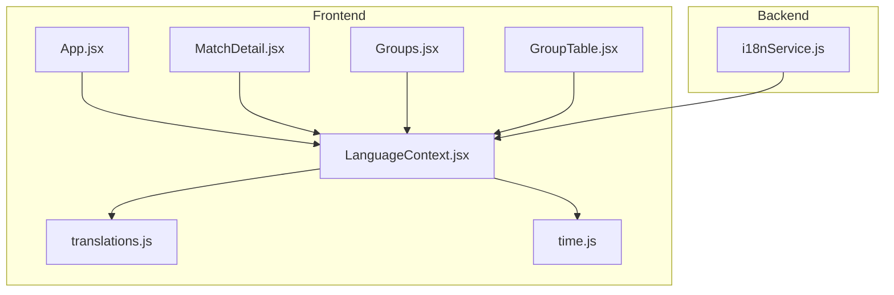
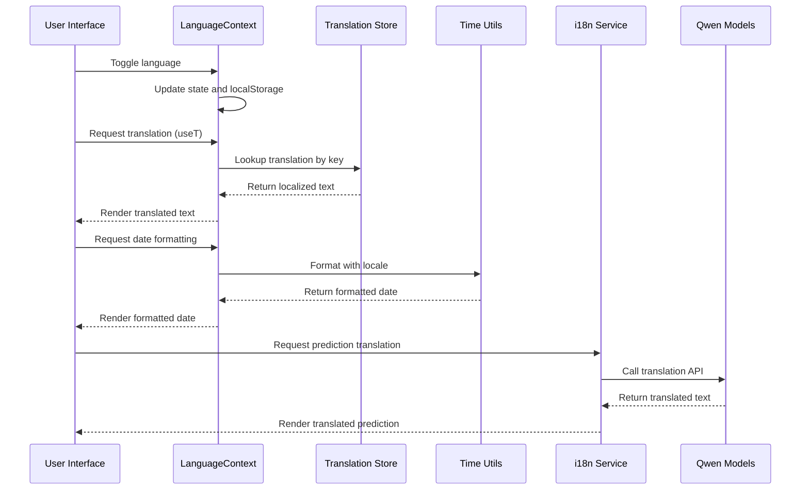
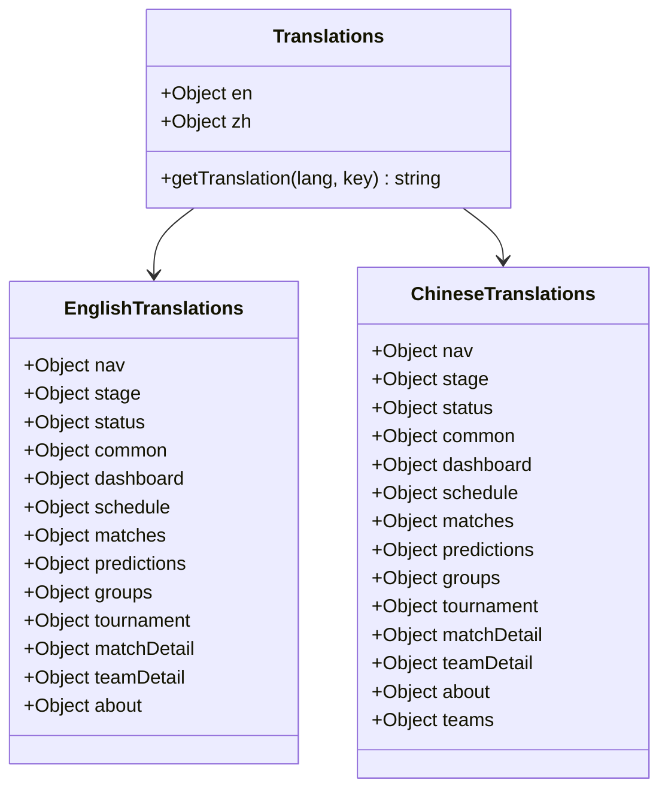
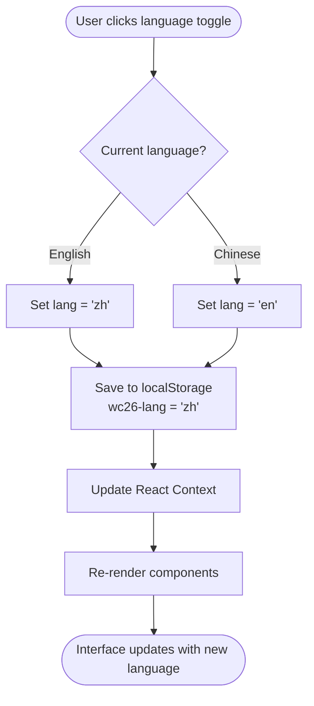
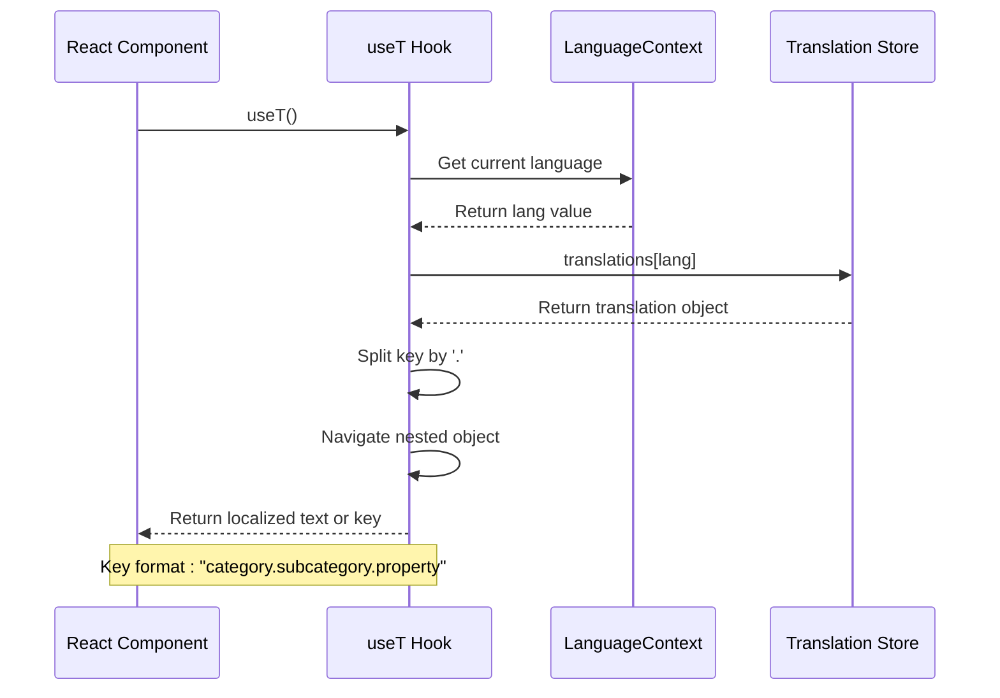
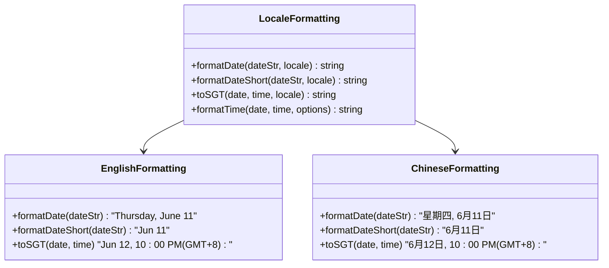
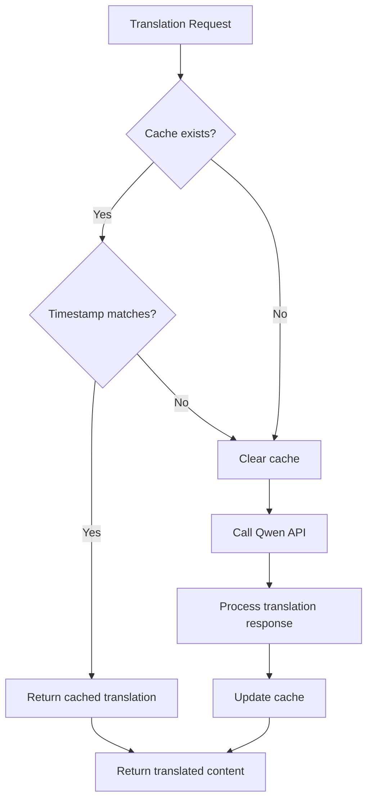
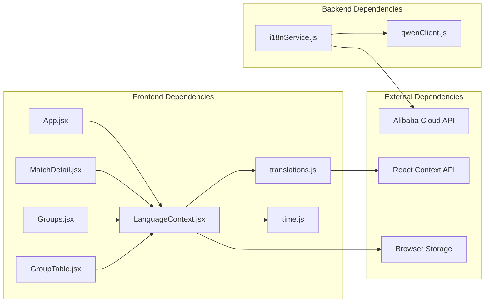

# Internationalization System

<cite>
**Referenced Files in This Document**
- [translations.js](file://frontend/src/i18n/translations.js)
- [LanguageContext.jsx](file://frontend/src/contexts/LanguageContext.jsx)
- [App.jsx](file://frontend/src/App.jsx)
- [time.js](file://frontend/src/utils/time.js)
- [i18nService.js](file://backend/services/i18nService.js)
- [MatchDetail.jsx](file://frontend/src/pages/MatchDetail.jsx)
- [Groups.jsx](file://frontend/src/pages/Groups.jsx)
- [GroupTable.jsx](file://frontend/src/components/GroupTable.jsx)
- [main.jsx](file://frontend/src/main.jsx)
</cite>

## Table of Contents
1. [Introduction](#introduction)
2. [Project Structure](#project-structure)
3. [Core Components](#core-components)
4. [Architecture Overview](#architecture-overview)
5. [Detailed Component Analysis](#detailed-component-analysis)
6. [Dependency Analysis](#dependency-analysis)
7. [Performance Considerations](#performance-considerations)
8. [Troubleshooting Guide](#troubleshooting-guide)
9. [Conclusion](#conclusion)

## Introduction
This document provides comprehensive documentation for the internationalization (i18n) system implementation in the World Cup 2026 prediction application. The system supports English and Chinese languages with dynamic text rendering, language switching, and locale-specific formatting. It combines a static translation structure with on-demand machine translation for specialized content.

## Project Structure
The i18n system is organized across frontend and backend components:



**Diagram sources**
- [LanguageContext.jsx:1-69](file://frontend/src/contexts/LanguageContext.jsx#L1-L69)
- [translations.js:1-630](file://frontend/src/i18n/translations.js#L1-L630)
- [App.jsx:1-284](file://frontend/src/App.jsx#L1-L284)

**Section sources**
- [LanguageContext.jsx:1-69](file://frontend/src/contexts/LanguageContext.jsx#L1-L69)
- [translations.js:1-630](file://frontend/src/i18n/translations.js#L1-L630)
- [App.jsx:1-284](file://frontend/src/App.jsx#L1-L284)

## Core Components
The i18n system consists of four primary components:

### Translation Storage
The frontend maintains a comprehensive translation dictionary supporting both English and Chinese languages with nested key structures for different functional areas.

### Language Context Provider
Manages language state, persistence, and exposes hooks for accessing translations and locale-specific formatting functions.

### Translation Hooks
Provides convenient functions for retrieving localized text, formatting dates, and translating team names.

### Backend Translation Service
Handles on-demand translation of prediction insights and factor descriptions using AI models.

**Section sources**
- [translations.js:1-630](file://frontend/src/i18n/translations.js#L1-L630)
- [LanguageContext.jsx:1-69](file://frontend/src/contexts/LanguageContext.jsx#L1-L69)
- [i18nService.js:1-116](file://backend/services/i18nService.js#L1-L116)

## Architecture Overview



**Diagram sources**
- [LanguageContext.jsx:7-36](file://frontend/src/contexts/LanguageContext.jsx#L7-L36)
- [translations.js:1-630](file://frontend/src/i18n/translations.js#L1-L630)
- [time.js:1-51](file://frontend/src/utils/time.js#L1-L51)
- [i18nService.js:17-63](file://backend/services/i18nService.js#L17-L63)

## Detailed Component Analysis

### Translation Structure Organization
The translation system organizes content into logical categories for maintainability:



**Diagram sources**
- [translations.js:1-630](file://frontend/src/i18n/translations.js#L1-L630)

#### Key Translation Categories
- **Navigation and UI**: Menu items, page titles, and interface labels
- **Sports Terminology**: Match stages, statuses, and competition phases
- **Common Terms**: Frequently used words and phrases
- **Page-Specific Content**: Dashboard, schedule, predictions, groups, tournament
- **Match Details**: Comprehensive match information and analytics
- **Team Information**: Player statistics and team profiles
- **About Section**: Application information and methodology

**Section sources**
- [translations.js:1-630](file://frontend/src/i18n/translations.js#L1-L630)

### Language Switching Mechanism
The system implements seamless language switching with persistent storage:



**Diagram sources**
- [LanguageContext.jsx:7-23](file://frontend/src/contexts/LanguageContext.jsx#L7-L23)

#### Implementation Details
- **State Management**: React Context maintains current language state
- **Persistence**: LocalStorage ensures language preference persists across sessions
- **Toggle Logic**: Simple switch between 'en' and 'zh' values
- **Default Language**: Falls back to English if no stored preference

**Section sources**
- [LanguageContext.jsx:7-23](file://frontend/src/contexts/LanguageContext.jsx#L7-L23)

### Translation Hook Usage Pattern
The `useT` hook provides a standardized approach to accessing translations:



**Diagram sources**
- [LanguageContext.jsx:28-36](file://frontend/src/contexts/LanguageContext.jsx#L28-L36)

#### Usage Examples
Components access translations through the `useT` hook with dot-notation keys:

- Navigation: `t('nav.home')` → "Home" or "首页"
- Status indicators: `t('status.SCHEDULED')` → "Upcoming" or "待赛"
- Page titles: `t('dashboard.heroTitle')` → "Road to Glory" or "荣耀之路"

**Section sources**
- [LanguageContext.jsx:28-36](file://frontend/src/contexts/LanguageContext.jsx#L28-L36)
- [App.jsx:100-155](file://frontend/src/App.jsx#L100-L155)

### Dynamic Text Rendering Patterns
The system demonstrates various approaches to dynamic text rendering:

#### Static Translation Keys
```javascript
// Navigation items with fixed keys
NAV_KEYS = [
  { to: '/', key: 'nav.home', Icon: Home },
  { to: '/fixtures', key: 'nav.fixtures', Icon: CalendarDays },
  // ...
];
```

#### Conditional Text Selection
```javascript
// Confidence level display
<span className={`text-xs font-semibold px-2 py-0.5 rounded ml-auto ${CONF_COLOR[latest.confidence] || 'text-apple-secondary bg-apple-raised'}`}>
  {t('confidence.' + latest.confidence) || latest.confidence}
</span>
```

#### Team Name Localization
```javascript
// Team name translation with fallback
<Link to={`/teams/${team.id}`} className={`font-medium tracking-[-0.01em] hover:underline ${i < 2 ? 'text-apple-text' : 'text-apple-secondary'}`}>
  {teamName(team.id, team.name)}
</Link>
```

**Section sources**
- [MatchDetail.jsx:70-169](file://frontend/src/pages/MatchDetail.jsx#L70-L169)
- [Groups.jsx:12-155](file://frontend/src/pages/Groups.jsx#L12-L155)
- [GroupTable.jsx:43-54](file://frontend/src/components/GroupTable.jsx#L43-L54)

### Locale-Specific Formatting
The system provides locale-aware formatting for dates and times:



**Diagram sources**
- [time.js:1-51](file://frontend/src/utils/time.js#L1-L51)
- [LanguageContext.jsx:41-59](file://frontend/src/contexts/LanguageContext.jsx#L41-L59)

#### Implementation Details
- **Locale Mapping**: English → 'en-US', Chinese → 'zh-CN'
- **Date Formatting**: Long format for full dates, short format for compact displays
- **Time Zone Handling**: Singapore Time (UTC+8) conversion with locale-aware formatting
- **Fallback Behavior**: Returns original key if translation not found

**Section sources**
- [time.js:1-51](file://frontend/src/utils/time.js#L1-L51)
- [LanguageContext.jsx:41-59](file://frontend/src/contexts/LanguageContext.jsx#L41-L59)

### Backend Translation Service
The backend provides AI-powered translation for prediction insights:



**Diagram sources**
- [i18nService.js:17-63](file://backend/services/i18nService.js#L17-L63)

#### AI Translation Features
- **Model Selection**: Uses Qwen Turbo for fast, context-aware translations
- **Batch Processing**: Efficiently translates multiple factors in single API call
- **Caching Strategy**: In-memory cache prevents redundant API calls
- **Fallback Mechanism**: Returns original English text if translation fails

**Section sources**
- [i18nService.js:17-113](file://backend/services/i18nService.js#L17-L113)

## Dependency Analysis



**Diagram sources**
- [LanguageContext.jsx:1-69](file://frontend/src/contexts/LanguageContext.jsx#L1-L69)
- [i18nService.js:1-116](file://backend/services/i18nService.js#L1-L116)

### Component Coupling
- **Frontend**: Low coupling between translation components and UI components
- **Backend**: Tight coupling with external AI services for translation processing
- **Persistence**: Language preference stored independently of UI components

### Circular Dependencies
- No circular dependencies detected in the i18n system
- Translation store is a pure data structure with no side effects

**Section sources**
- [LanguageContext.jsx:1-69](file://frontend/src/contexts/LanguageContext.jsx#L1-L69)
- [i18nService.js:1-116](file://backend/services/i18nService.js#L1-L116)

## Performance Considerations
The i18n system implements several performance optimizations:

### Frontend Optimizations
- **Static Translation Loading**: All translations loaded at startup
- **Memoized Translation Functions**: Hooks return cached functions
- **Selective Re-rendering**: Only affected components re-render on language change
- **Efficient Key Lookup**: Dot-notation parsing with early termination

### Backend Optimizations
- **In-Memory Caching**: Prevents repeated AI API calls for same content
- **Batch Translation**: Multiple factors processed in single API call
- **Smart Fallback**: Graceful degradation when AI services unavailable

### Memory Management
- **Cache Limits**: No explicit cache eviction; relies on garbage collection
- **State Cleanup**: React components automatically clean up on unmount
- **Storage Limits**: LocalStorage usage minimal and bounded

## Troubleshooting Guide

### Common Issues and Solutions

#### Missing Translation Keys
**Problem**: Text appears as raw key instead of localized content
**Solution**: Verify key exists in appropriate language section
- Check translation structure: `translations.[lang].[category].[key]`
- Ensure proper nesting for complex keys
- Validate dot notation formatting

#### Language Toggle Not Persisting
**Problem**: Language preference resets after page refresh
**Solution**: Check browser storage permissions
- Verify LocalStorage availability
- Confirm key name: `wc26-lang`
- Test in incognito mode for conflicts

#### AI Translation Failures
**Problem**: Prediction insights remain in English despite Chinese selection
**Solution**: Review backend service health
- Check network connectivity to Alibaba Cloud
- Verify API credentials and quotas
- Monitor cache invalidation timing

#### Date Formatting Issues
**Problem**: Dates display incorrectly for selected locale
**Solution**: Validate locale mapping and formatting functions
- Confirm locale codes: 'en-US' for English, 'zh-CN' for Chinese
- Test with various date formats
- Check time zone conversions

**Section sources**
- [LanguageContext.jsx:7-23](file://frontend/src/contexts/LanguageContext.jsx#L7-L23)
- [i18nService.js:59-62](file://backend/services/i18nService.js#L59-L62)

## Conclusion
The internationalization system provides a robust foundation for multilingual support with clear separation of concerns between frontend translations and backend AI-powered content. The system successfully balances performance with flexibility, offering both immediate translation capabilities and intelligent content adaptation. Future enhancements could include translation validation, automated testing, and expanded language support while maintaining the current architecture's strengths.