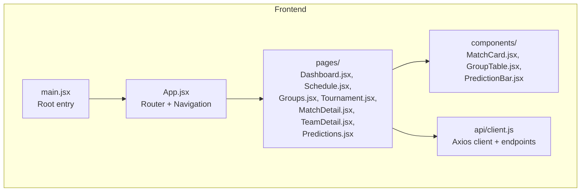
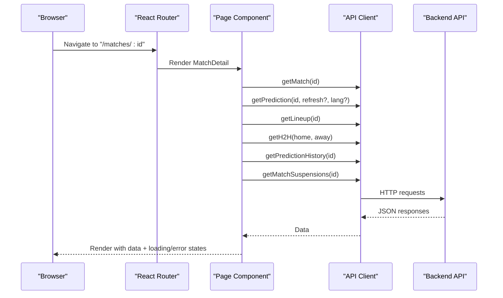
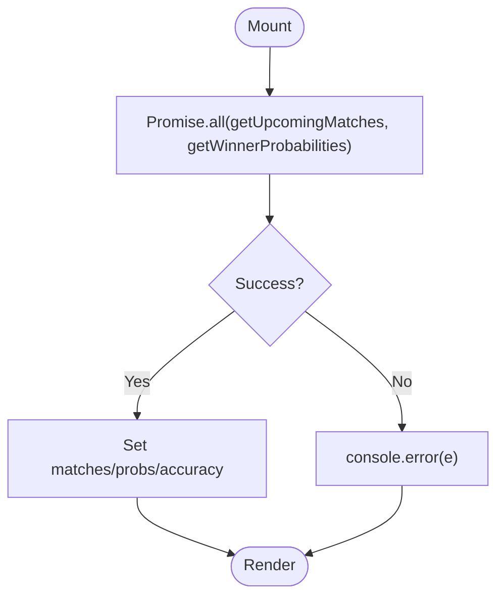
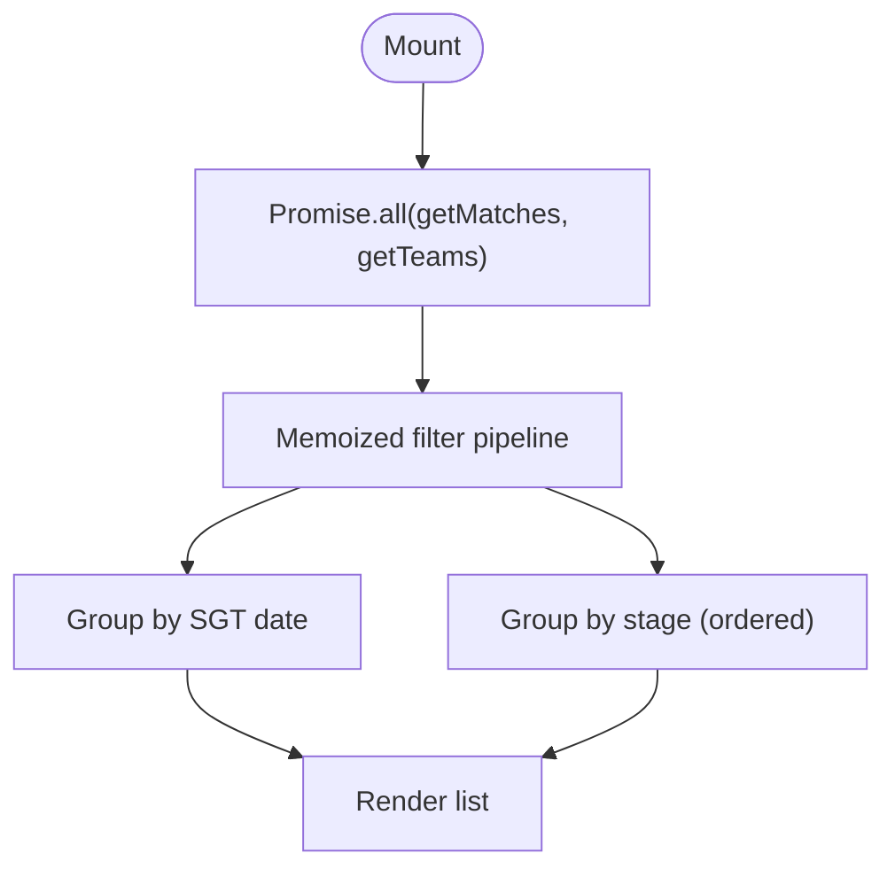
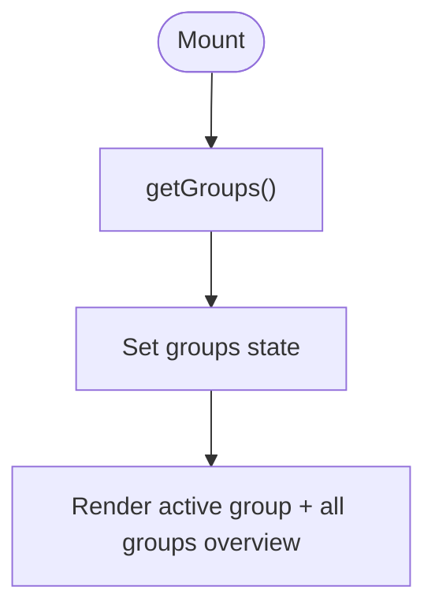
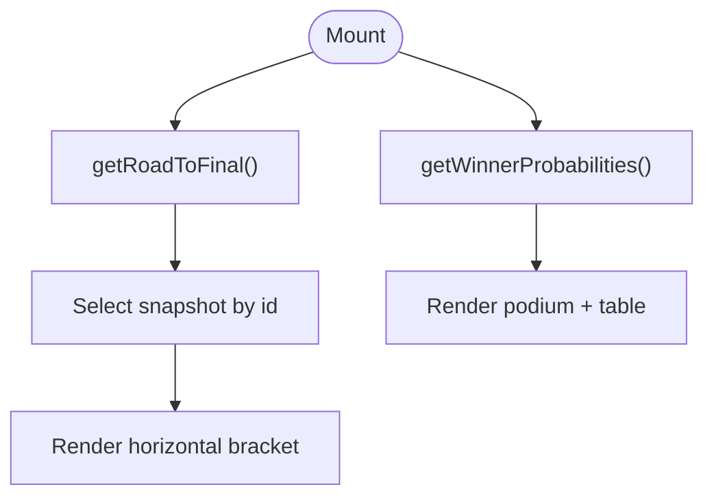
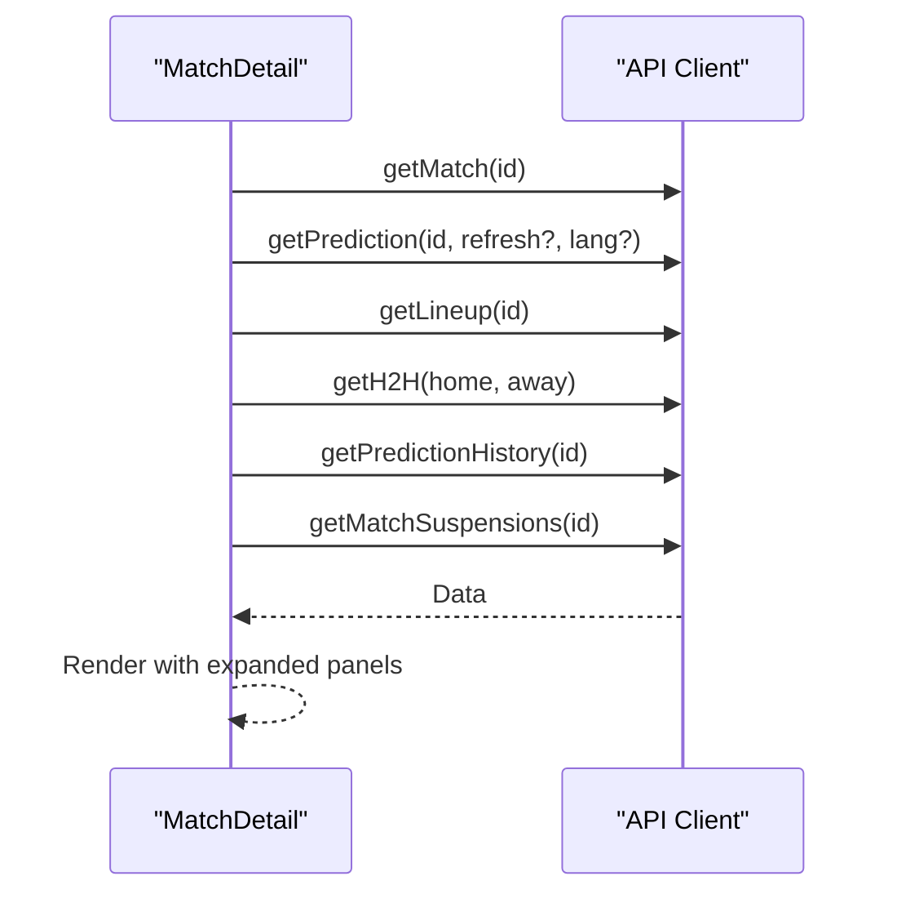
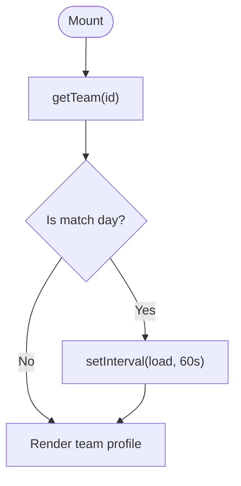
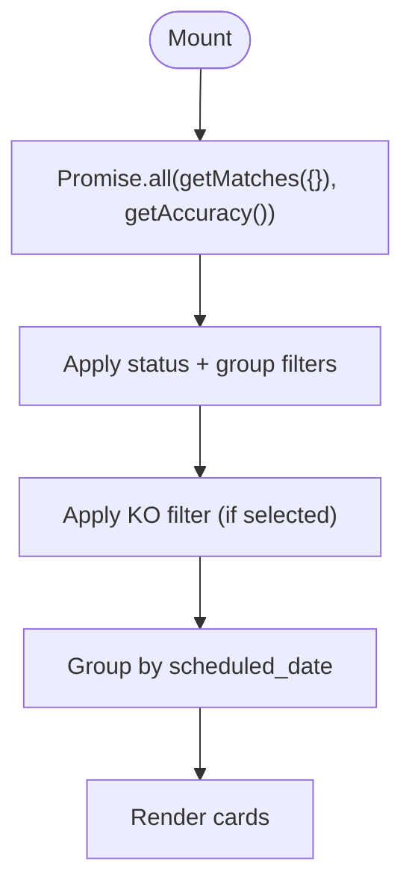
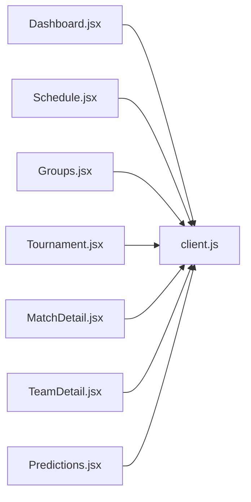

# Page Components

<cite>
**Referenced Files in This Document**
- [Dashboard.jsx](file://frontend/src/pages/Dashboard.jsx)
- [Schedule.jsx](file://frontend/src/pages/Schedule.jsx)
- [Groups.jsx](file://frontend/src/pages/Groups.jsx)
- [Tournament.jsx](file://frontend/src/pages/Tournament.jsx)
- [MatchDetail.jsx](file://frontend/src/pages/MatchDetail.jsx)
- [TeamDetail.jsx](file://frontend/src/pages/TeamDetail.jsx)
- [Predictions.jsx](file://frontend/src/pages/Predictions.jsx)
- [client.js](file://frontend/src/api/client.js)
- [MatchCard.jsx](file://frontend/src/components/MatchCard.jsx)
- [GroupTable.jsx](file://frontend/src/components/GroupTable.jsx)
- [PredictionBar.jsx](file://frontend/src/components/PredictionBar.jsx)
- [App.jsx](file://frontend/src/App.jsx)
- [main.jsx](file://frontend/src/main.jsx)
- [lineupService.js](file://backend/services/lineupService.js)
- [predictionEngine.js](file://backend/services/predictionEngine.js)
- [lineupAgent.js](file://backend/services/agents/lineupAgent.js)
</cite>

## Update Summary
**Changes Made**
- Updated MatchDetail page documentation to reflect the corrected lineup strength score display scale fix
- The strength score display now correctly shows '/10' instead of the previous incorrect '/100' scale indicator
- Enhanced backend lineup service documentation to clarify the 0-10 scale implementation
- Updated prediction engine documentation to show proper strength score formatting

## Table of Contents
1. [Introduction](#introduction)
2. [Project Structure](#project-structure)
3. [Core Components](#core-components)
4. [Architecture Overview](#architecture-overview)
5. [Detailed Component Analysis](#detailed-component-analysis)
6. [Dependency Analysis](#dependency-analysis)
7. [Performance Considerations](#performance-considerations)
8. [Troubleshooting Guide](#troubleshooting-guide)
9. [Conclusion](#conclusion)

## Introduction
This document provides comprehensive technical documentation for the React page components that form the main application views of the World Cup 2026 prediction app. It covers the Dashboard, Schedule, Groups, Tournament, MatchDetail, TeamDetail, and Predictions pages. For each page, we explain component structure, data fetching patterns, prop requirements, API client integration, layout and responsive design, navigation integration, lifecycle management, error handling, loading states, routing configuration, URL parameter handling, and navigation patterns.

## Project Structure
The frontend is a React application bootstrapped with Vite and styled with Tailwind CSS. Pages are located under frontend/src/pages, shared UI components under frontend/src/components, and the API client under frontend/src/api. Routing is configured in App.jsx with React Router DOM.

**Diagram sources**
- [main.jsx:1-22](file://frontend/src/main.jsx#L1-L22)
- [App.jsx:1-284](file://frontend/src/App.jsx#L1-L284)
- [client.js:1-50](file://frontend/src/api/client.js#L1-L50)

**Section sources**
- [main.jsx:1-22](file://frontend/src/main.jsx#L1-L22)
- [App.jsx:1-284](file://frontend/src/App.jsx#L1-L284)

## Core Components
- Dashboard: Hero banner, tournament phase timeline, stats cards, upcoming matches grid, and top picks sidebar.
- Schedule: Filterable list of all matches by date or stage, with search and status/group/team filters.
- Groups: Group standings table and group matches preview, with group selector tabs.
- Tournament: Knockout bracket visualization and winner probabilities.
- MatchDetail: Detailed prediction breakdown, historical prediction charts, H2H timeline, suspensions, agent session viewer, and lineup display.
- TeamDetail: Team profile, stats, ELO trend chart, group/knockout journey, and all matches.
- Predictions: Consolidated predictions vs actual results with scoring methodology and accuracy stats, featuring enhanced KO filtering capabilities.

**Section sources**
- [Dashboard.jsx:137-601](file://frontend/src/pages/Dashboard.jsx#L137-L601)
- [Schedule.jsx:135-484](file://frontend/src/pages/Schedule.jsx#L135-L484)
- [Groups.jsx:11-159](file://frontend/src/pages/Groups.jsx#L11-L159)
- [Tournament.jsx:376-443](file://frontend/src/pages/Tournament.jsx#L376-L443)
- [MatchDetail.jsx:723-1345](file://frontend/src/pages/MatchDetail.jsx#L723-L1345)
- [TeamDetail.jsx:82-392](file://frontend/src/pages/TeamDetail.jsx#L82-L392)
- [Predictions.jsx:277-514](file://frontend/src/pages/Predictions.jsx#L277-L514)

## Architecture Overview
The pages integrate with a centralized API client that wraps Axios. Each page performs data fetching during mount, manages loading and error states, and renders reusable components. Navigation is handled via React Router with programmatic navigation for team links inside match rows.

**Diagram sources**
- [MatchDetail.jsx:723-760](file://frontend/src/pages/MatchDetail.jsx#L723-L760)
- [client.js:16-28](file://frontend/src/api/client.js#L16-L28)

**Section sources**
- [client.js:1-50](file://frontend/src/api/client.js#L1-L50)
- [App.jsx:262-279](file://frontend/src/App.jsx#L262-L279)

## Detailed Component Analysis

### Dashboard
- Purpose: Primary landing page showcasing upcoming matches, tournament phase progress, top teams' win probabilities, and quick access to key sections.
- Data fetching: Uses Promise.all to fetch upcoming matches and winner probabilities concurrently, with an optional accuracy fetch.
- State management: Manages arrays for dates/matches, winner probabilities, and accuracy; loading state toggled around fetch.
- Layout and responsiveness: Hero banner with decorative elements, stats grid, phase timeline, and a two-column layout for matches and sidebar.
- Navigation: Links to team pages and tournament overview; internal decorative elements for branding.
- Lifecycle: useEffect triggers initial load on mount.
- Error handling: Try/catch around fetch; errors logged; loading finally resolves.
- Loading states: Skeleton placeholders while loading; empty state when no matches.
- SEO: Dynamic meta tags and structured data for the homepage.

**Diagram sources**
- [Dashboard.jsx:147-158](file://frontend/src/pages/Dashboard.jsx#L147-L158)

**Section sources**
- [Dashboard.jsx:137-601](file://frontend/src/pages/Dashboard.jsx#L137-L601)

### Schedule
- Purpose: Complete match schedule with filtering by stage, group, status, and team; view modes by date or stage.
- Data fetching: Concurrently loads matches and teams; memoized filtering and grouping computations.
- State management: Tracks filters (stage, group, status, team, search), view mode, and derived counts.
- Layout and responsiveness: Hero banner, progress bar, filter controls, and either grouped-by-date or grouped-by-stage lists.
- Navigation: Programmatic navigation to team pages from match rows; links to match detail pages.
- Lifecycle: useEffect triggers initial load on mount.
- error handling: Catch-all for fetch failures; loading skeleton UI.
- Loading states: Skeleton cards while loading; empty state message when no results.
- Filtering logic: Comprehensive filter pipeline with stage order mapping and group selection.

**Diagram sources**
- [Schedule.jsx:149-154](file://frontend/src/pages/Schedule.jsx#L149-L154)
- [Schedule.jsx:156-197](file://frontend/src/pages/Schedule.jsx#L156-L197)

**Section sources**
- [Schedule.jsx:135-484](file://frontend/src/pages/Schedule.jsx#L135-L484)

### Groups
- Purpose: Group standings and group matches preview; allows switching between groups.
- Data fetching: Loads groups once on mount; sets active group state.
- State management: Active group selection, loading state.
- Layout and responsiveness: Hero banner, group tabs, standings table, and group matches grid.
- Navigation: Links to team pages; scroll-to-top when switching groups.
- Lifecycle: useEffect triggers initial load on mount.
- Error handling: Basic loading skeleton; fallback UI.
- Loading states: Skeleton grid while loading.

**Diagram sources**
- [Groups.jsx:18-23](file://frontend/src/pages/Groups.jsx#L18-L23)

**Section sources**
- [Groups.jsx:11-159](file://frontend/src/pages/Groups.jsx#L11-L159)
- [GroupTable.jsx:7-77](file://frontend/src/components/GroupTable.jsx#L7-L77)

### Tournament
- Purpose: Knockout bracket visualization and winner probabilities.
- Data fetching: RoadToFinal fetches road-to-final snapshots; WinnerProbabilities fetches probabilities and simulation count.
- State management: Tabbed interface (road vs odds), snapshot selection, loading states.
- Layout and responsiveness: Hero banner, tabbed UI, horizontal bracket visualization with SVG connectors, podium and full table.
- Navigation: Links to team pages; snapshot selection toggles.
- Lifecycle: Separate effects per subsection; loading managed per section.
- Error handling: Skeleton loaders; basic fallback UI.
- Bracket rendering: Dynamic columns per stage with connector paths.

**Diagram sources**
- [Tournament.jsx:193-201](file://frontend/src/pages/Tournament.jsx#L193-L201)
- [Tournament.jsx:271-279](file://frontend/src/pages/Tournament.jsx#L271-L279)

**Section sources**
- [Tournament.jsx:376-443](file://frontend/src/pages/Tournament.jsx#L376-L443)

### MatchDetail
- Purpose: Deep dive into a single match's prediction, including historical snapshots, H2H timeline, suspensions, agent session, and lineup.
- Data fetching: Concurrently fetches match and prediction; optional refresh and language parameters; additional data via separate endpoints.
- State management: Match, prediction, lineup, H2H, prediction history, suspensions; loading state; expandable panels.
- Layout and responsiveness: Hero with team flags and metadata, prediction bar, historical chart, H2H timeline, suspensions panel, agent session viewer, and lineup display.
- Navigation: Links to team pages; programmatic navigation from team names in match rows.
- Lifecycle: useEffect triggers load on mount and when language changes; confetti celebration on correct prediction completion.
- Error handling: Try/catch around fetch; loading skeleton; fallback UI when match not found.
- Loading states: Skeleton cards while loading; empty state message when match not found.
- URL parameters: Uses useParams to extract match id; navigates to team pages programmatically.

**Updated** Enhanced lineup strength score display to correctly show '/10' scale instead of '/100'. The strength scores are now properly formatted with one decimal place and display the correct 0-10 scale indicator.

**Diagram sources**
- [MatchDetail.jsx:739-759](file://frontend/src/pages/MatchDetail.jsx#L739-L759)
- [client.js:16-28](file://frontend/src/api/client.js#L16-L28)

**Section sources**
- [MatchDetail.jsx:723-1345](file://frontend/src/pages/MatchDetail.jsx#L723-L1345)
- [MatchCard.jsx:21-174](file://frontend/src/components/MatchCard.jsx#L21-L174)

### TeamDetail
- Purpose: Per-team profile including stats, ELO trend, group/knockout journey, and all matches.
- Data fetching: Loads team data on mount; periodically reloads if a match day is detected.
- State management: Team data, matches, ELO history, group teams; loading state.
- Layout and responsiveness: Hero with blurred flag background, key stats, tournament stats, ELO trend chart, group standings, next match, knockout journey, and all matches list.
- Navigation: Links to group page; navigates to match detail pages.
- Lifecycle: useEffect triggers initial load; sets interval for live updates on match days.
- Error handling: Loading skeleton; fallback UI when team not found.
- Loading states: Skeleton cards while loading; empty state message when team not found.
- Charting: Recharts area chart for ELO history with tooltips.

**Diagram sources**
- [TeamDetail.jsx:90-117](file://frontend/src/pages/TeamDetail.jsx#L90-L117)

**Section sources**
- [TeamDetail.jsx:82-392](file://frontend/src/pages/TeamDetail.jsx#L82-L392)

### Predictions
- Purpose: Consolidated view of predictions vs actual outcomes with scoring methodology and accuracy stats, featuring enhanced KO filtering capabilities.
- Data fetching: Loads group stage matches and accuracy stats concurrently.
- State management: Filters (status, group), memoized filtered and grouped lists, loading state.
- Layout and responsiveness: Hero banner, stats grid, scoring methodology card, filter bar, grouped-by-date match cards.
- Navigation: Links to match detail pages; programmatic navigation to team pages from match rows.
- Lifecycle: useEffect triggers initial load on mount.
- Error handling: Loading spinner; empty state message when no predictions.
- Filtering logic: Enhanced status and group filters with dedicated KO (knockout) filter option; grouping by scheduled date.

**Updated** Enhanced with new KO (knockout) filter functionality that allows users to view only knockout stage matches alongside the existing status and group filters.

**Diagram sources**
- [Predictions.jsx:290-298](file://frontend/src/pages/Predictions.jsx#L290-L298)
- [Predictions.jsx:300-321](file://frontend/src/pages/Predictions.jsx#L300-L321)
- [Predictions.jsx:310-318](file://frontend/src/pages/Predictions.jsx#L310-L318)

**Section sources**
- [Predictions.jsx:277-514](file://frontend/src/pages/Predictions.jsx#L277-L514)

## Dependency Analysis
- API client: Centralized axios instance with base URL derived from environment variables; exports functions for teams, matches, groups, tournament, analytics, and agent sessions.
- Page-to-API mapping:
  - Dashboard: getUpcomingMatches, getWinnerProbabilities, getAccuracy
  - Schedule: getMatches, getTeams
  - Groups: getGroups
  - Tournament: getRoadToFinal, getWinnerProbabilities
  - MatchDetail: getMatch, getPrediction, getLineup, getH2H, getPredictionHistory, getMatchSuspensions, getAgentSession
  - TeamDetail: getTeam
  - Predictions: getMatches, getAccuracy
- Shared components:
  - MatchCard: Used in Dashboard and Schedule; accepts match prop and optional showPrediction flag.
  - GroupTable: Used in Groups page; accepts group and teams props.
  - PredictionBar: Used in MatchCard and Tournament; accepts probabilities and team names.

**Diagram sources**
- [client.js:1-50](file://frontend/src/api/client.js#L1-L50)
- [Dashboard.jsx:6-10](file://frontend/src/pages/Dashboard.jsx#L6-L10)
- [Schedule.jsx:6-9](file://frontend/src/pages/Schedule.jsx#L6-L9)
- [Groups.jsx:3-7](file://frontend/src/pages/Groups.jsx#L3-L7)
- [Tournament.jsx:5-8](file://frontend/src/pages/Tournament.jsx#L5-L8)
- [MatchDetail.jsx:4-12](file://frontend/src/pages/MatchDetail.jsx#L4-L12)
- [TeamDetail.jsx:4-6](file://frontend/src/pages/TeamDetail.jsx#L4-L6)
- [Predictions.jsx:7-9](file://frontend/src/pages/Predictions.jsx#L7-L9)

**Section sources**
- [client.js:1-50](file://frontend/src/api/client.js#L1-L50)

## Performance Considerations
- Concurrent data fetching: Pages use Promise.all to reduce total load time (Dashboard, Schedule, Tournament, Predictions).
- Memoization: Schedule and Predictions use useMemo to derive filtered and grouped lists efficiently.
- Lazy loading: TeamDetail sets an interval only when a match day is detected, minimizing unnecessary polling.
- Rendering optimization: Pages render skeletons/loading states to keep UI responsive while data loads.
- Charting: Recharts components are efficient for small datasets typical in this app.

## Troubleshooting Guide
- Network errors: API client wraps calls with axios; errors are caught and logged. Pages handle errors gracefully with loading states and fallback UIs.
- Missing data: Pages check for presence of required data (e.g., match existence in MatchDetail) and display appropriate messages.
- Language switching: MatchDetail adjusts prediction language via query parameters; ensure lang is passed correctly.
- Route mismatches: App.jsx includes legacy redirects for older paths to ensure smooth navigation.
- KO filter issues: The KO filter uses the absence of group_code field to identify knockout matches; ensure backend properly handles this distinction.
- Lineup strength score display: The strength score now correctly displays '/10' instead of '/100'; ensure frontend formatting matches backend 0-10 scale.

**Section sources**
- [MatchDetail.jsx:739-759](file://frontend/src/pages/MatchDetail.jsx#L739-L759)
- [App.jsx:269-275](file://frontend/src/App.jsx#L269-L275)

## Backend Services Enhancement

### Lineup Service
The backend lineup service processes lineup data and calculates strength scores on a 0-10 scale. The service includes:

- Strength score calculation: Uses homeScore and awayScore with default 5.0 if not provided
- Delta calculation: Computes difference between home and away scores for impact assessment
- Normalization: Scales delta to -1 to +1 range for prediction engine integration
- Key absences detection: Identifies important player absences that amplify lineup impact

**Section sources**
- [lineupService.js:318-362](file://backend/services/lineupService.js#L318-L362)

### Prediction Engine
The prediction engine formats lineup strength scores for display with proper scale indicators:

- Score formatting: Uses toFixed(1) to display one decimal place
- Scale indication: Shows "Lineup strength — Home: {score}/10 | Away: {score}/10"
- Impact calculation: Translates strength delta to probability adjustments

**Section sources**
- [predictionEngine.js:527-545](file://backend/services/predictionEngine.js#L527-L545)

### Lineup Agent
The lineup agent provides calibration guidance for strength delta interpretation:

- Clear advantage: delta > +2.0 indicates strong home lineup advantage
- Slight edge: +0.5 to +2.0 indicates slight home advantage
- Balanced: -0.5 to +0.5 indicates roughly equal lineups
- Slight disadvantage: -2.0 to -0.5 indicates slight away advantage
- Strong disadvantage: delta < -2.0 indicates strong away lineup advantage

**Section sources**
- [lineupAgent.js:27-36](file://backend/services/agents/lineupAgent.js#L27-L36)

## Conclusion
The page components are structured around a clean separation of concerns: each page encapsulates its own data fetching, state management, and rendering logic while leveraging shared components and a centralized API client. The routing integrates seamlessly with navigation patterns, and the design emphasizes responsiveness and accessibility through thoughtful loading states and layout choices. The MatchDetail page now features the corrected lineup strength score display showing the proper '/10' scale instead of the previous '/100' indicator, providing users with accurate lineup strength assessments. The Predictions page continues to offer enhanced filtering capabilities with the new KO (knockout) filter functionality, providing users with more granular control over match viewing preferences.