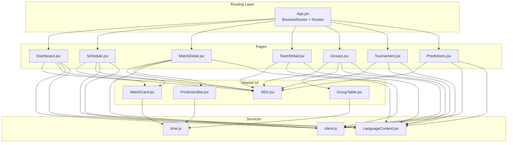
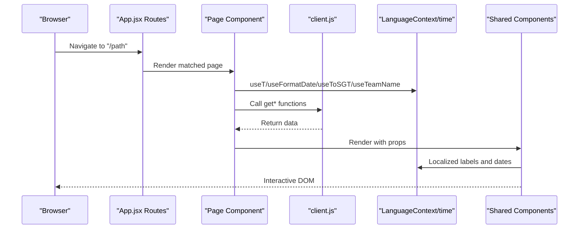
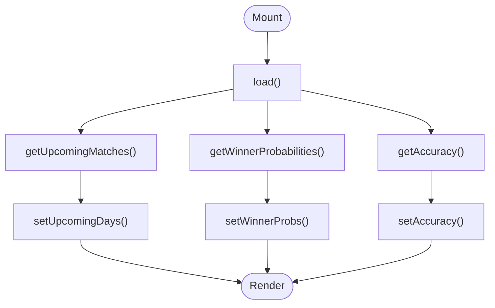
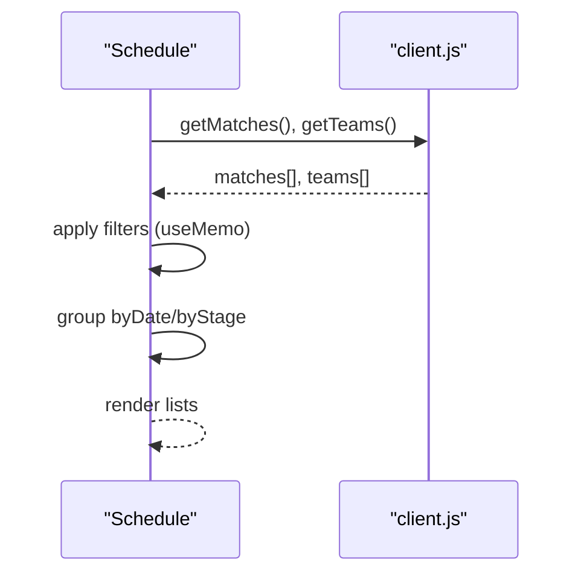
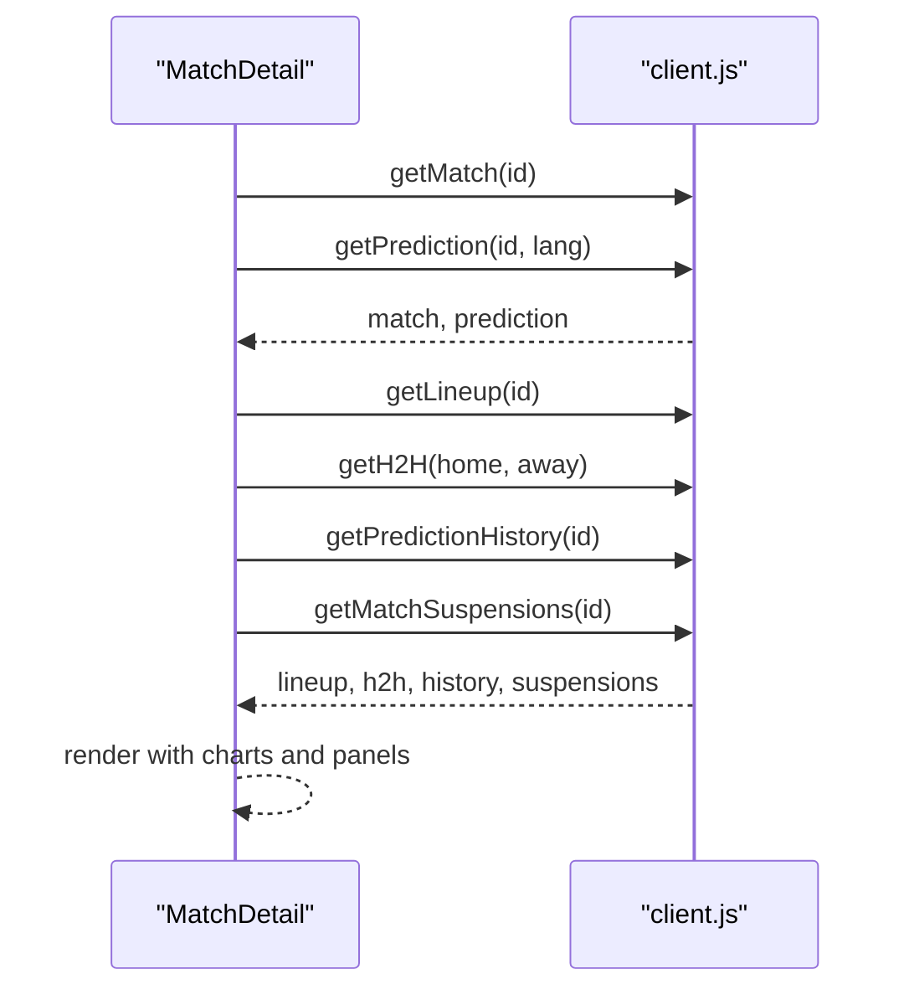
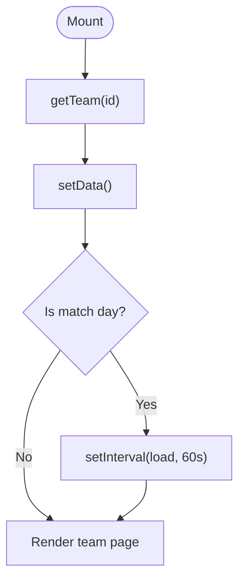
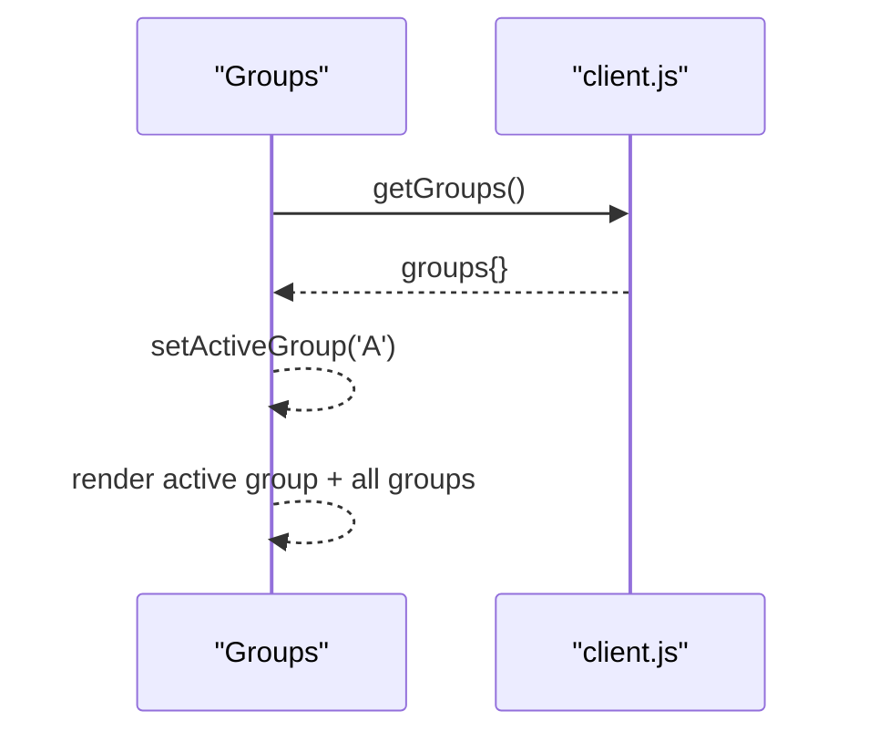
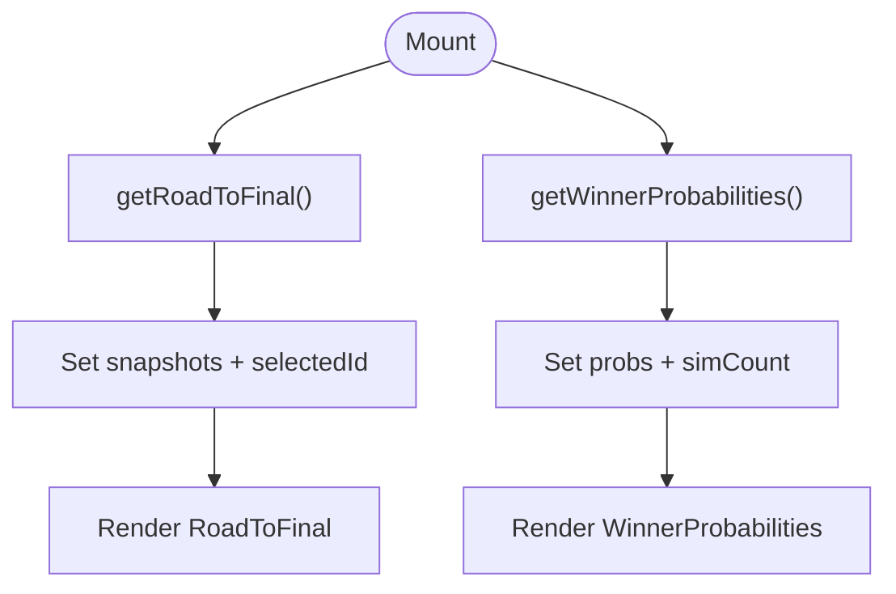
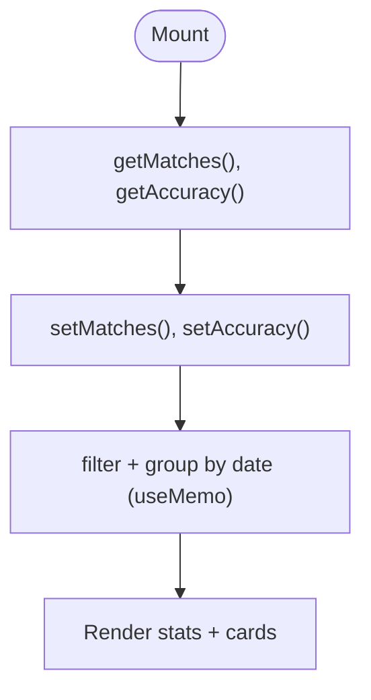
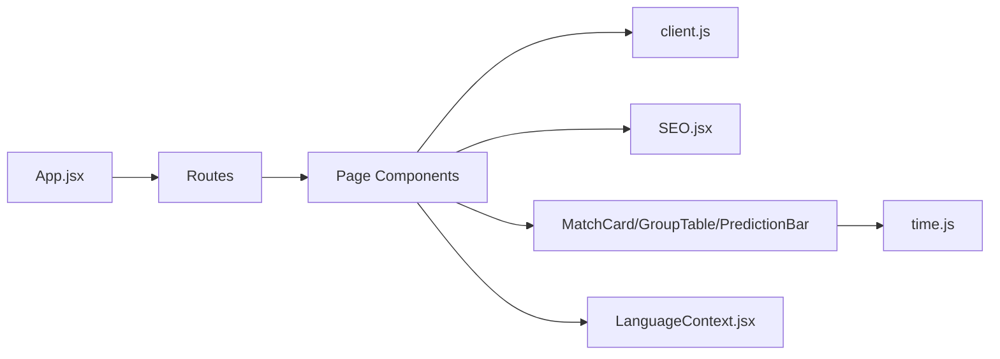

# Page Components

<cite>
**Referenced Files in This Document**
- [App.jsx](file://frontend/src/App.jsx)
- [client.js](file://frontend/src/api/client.js)
- [LanguageContext.jsx](file://frontend/src/contexts/LanguageContext.jsx)
- [time.js](file://frontend/src/utils/time.js)
- [SEO.jsx](file://frontend/src/components/SEO.jsx)
- [MatchCard.jsx](file://frontend/src/components/MatchCard.jsx)
- [GroupTable.jsx](file://frontend/src/components/GroupTable.jsx)
- [PredictionBar.jsx](file://frontend/src/components/PredictionBar.jsx)
- [Dashboard.jsx](file://frontend/src/pages/Dashboard.jsx)
- [Schedule.jsx](file://frontend/src/pages/Schedule.jsx)
- [MatchDetail.jsx](file://frontend/src/pages/MatchDetail.jsx)
- [TeamDetail.jsx](file://frontend/src/pages/TeamDetail.jsx)
- [Groups.jsx](file://frontend/src/pages/Groups.jsx)
- [Tournament.jsx](file://frontend/src/pages/Tournament.jsx)
- [Predictions.jsx](file://frontend/src/pages/Predictions.jsx)
</cite>

## Table of Contents
1. [Introduction](#introduction)
2. [Project Structure](#project-structure)
3. [Core Components](#core-components)
4. [Architecture Overview](#architecture-overview)
5. [Detailed Component Analysis](#detailed-component-analysis)
6. [Dependency Analysis](#dependency-analysis)
7. [Performance Considerations](#performance-considerations)
8. [Troubleshooting Guide](#troubleshooting-guide)
9. [Conclusion](#conclusion)

## Introduction
This document provides comprehensive documentation for the React page components that form the main application views of the World Cup 2026 prediction platform. It covers the Dashboard, Schedule, MatchDetail, TeamDetail, Groups, Tournament, and Predictions pages. For each page, we explain component props, state management, data fetching patterns, integration with the API client, routing configuration, navigation patterns, user workflow flows, lifecycle management, error handling, loading states, and responsive/mobile-first design considerations.

## Project Structure
The application is structured around a single-page app with route-based rendering. Pages are organized under frontend/src/pages, while shared UI components reside under frontend/src/components. Global state for theme and language is provided via context providers. Routing is configured in App.jsx with redirects for legacy paths.

**Diagram sources**
- [App.jsx:262-275](file://frontend/src/App.jsx#L262-L275)
- [Dashboard.jsx:167-183](file://frontend/src/pages/Dashboard.jsx#L167-L183)
- [Schedule.jsx:223-227](file://frontend/src/pages/Schedule.jsx#L223-L227)
- [MatchDetail.jsx:791-800](file://frontend/src/pages/MatchDetail.jsx#L791-L800)
- [TeamDetail.jsx:159-160](file://frontend/src/pages/TeamDetail.jsx#L159-L160)
- [Groups.jsx:43-47](file://frontend/src/pages/Groups.jsx#L43-L47)
- [Tournament.jsx:387-391](file://frontend/src/pages/Tournament.jsx#L387-L391)
- [Predictions.jsx:358](file://frontend/src/pages/Predictions.jsx#L358)
- [MatchCard.jsx:1-175](file://frontend/src/components/MatchCard.jsx#L1-L175)
- [GroupTable.jsx:1-78](file://frontend/src/components/GroupTable.jsx#L1-L78)
- [PredictionBar.jsx:1-51](file://frontend/src/components/PredictionBar.jsx#L1-L51)
- [client.js:1-50](file://frontend/src/api/client.js#L1-L50)
- [LanguageContext.jsx:1-69](file://frontend/src/contexts/LanguageContext.jsx#L1-L69)
- [time.js:1-51](file://frontend/src/utils/time.js#L1-L51)

**Section sources**
- [App.jsx:247-283](file://frontend/src/App.jsx#L247-L283)

## Core Components
This section outlines the primary page components and their roles:
- Dashboard: Tournament overview, key metrics, upcoming matches, and top picks.
- Schedule: Fixture browsing with filtering, grouping, and view modes.
- MatchDetail: Individual match analysis, prediction visualization, H2H, suspensions, agent sessions.
- TeamDetail: Team profiles, statistics, ELO trends, group/knockout progress.
- Groups: Group stage standings and match previews.
- Tournament: Knockout bracket visualization and winner probabilities.
- Predictions: Analytical insights, scoring methodology, and historical predictions.

Each page integrates with the API client for data retrieval, uses shared components for consistency, and leverages the LanguageContext for localization and time formatting.

**Section sources**
- [Dashboard.jsx:137-601](file://frontend/src/pages/Dashboard.jsx#L137-L601)
- [Schedule.jsx:135-484](file://frontend/src/pages/Schedule.jsx#L135-L484)
- [MatchDetail.jsx:723-800](file://frontend/src/pages/MatchDetail.jsx#L723-L800)
- [TeamDetail.jsx:82-392](file://frontend/src/pages/TeamDetail.jsx#L82-L392)
- [Groups.jsx:11-160](file://frontend/src/pages/Groups.jsx#L11-L160)
- [Tournament.jsx:376-444](file://frontend/src/pages/Tournament.jsx#L376-L444)
- [Predictions.jsx:281-532](file://frontend/src/pages/Predictions.jsx#L281-L532)

## Architecture Overview
The application follows a unidirectional data flow:
- Pages fetch data via the API client.
- Shared components render UI and accept props.
- LanguageContext and time utilities handle localization and time conversions.
- SEO component injects metadata and structured data.

**Diagram sources**
- [App.jsx:262-275](file://frontend/src/App.jsx#L262-L275)
- [client.js:9-50](file://frontend/src/api/client.js#L9-L50)
- [LanguageContext.jsx:28-68](file://frontend/src/contexts/LanguageContext.jsx#L28-L68)
- [time.js:2-51](file://frontend/src/utils/time.js#L2-L51)

## Detailed Component Analysis

### Dashboard
- Purpose: Tournament overview, key metrics, countdown to next match, top picks, and upcoming fixtures.
- Props: None (fetches internally).
- State:
  - upcomingDays: array of grouped matches by date.
  - winnerProbs: top teams by win probability.
  - accuracy: model performance metrics.
  - loading: boolean for skeleton UI.
- Lifecycle:
  - useEffect triggers load() on mount.
  - load() performs Promise.all for upcoming matches and winner probabilities, then fetches accuracy.
- Data Fetching:
  - getUpcomingMatches(), getWinnerProbabilities(), getAccuracy().
- Navigation:
  - Links to TeamDetail and Tournament pages.
- Loading/Error:
  - Skeleton loaders during fetch; minimal error logging.
- Responsive/Mobile:
  - Uses grid layouts, responsive typography, and motion animations.

**Diagram sources**
- [Dashboard.jsx:147-158](file://frontend/src/pages/Dashboard.jsx#L147-L158)
- [client.js:14-42](file://frontend/src/api/client.js#L14-L42)

**Section sources**
- [Dashboard.jsx:137-601](file://frontend/src/pages/Dashboard.jsx#L137-L601)
- [client.js:14-42](file://frontend/src/api/client.js#L14-L42)

### Schedule
- Purpose: Browse and filter fixtures across stages and groups.
- Props: None (fetches internally).
- State:
  - matches, teams: arrays of match and team data.
  - filters: stage, group, team, status, search.
  - viewMode: date or stage grouping.
  - loading: boolean.
- Lifecycle:
  - useEffect fetches matches and teams concurrently.
- Filtering:
  - useMemo computes filtered list based on active filters.
  - Grouping: byDate and byStage computed via Map and sort.
- Navigation:
  - Links to MatchDetail and TeamDetail.
- Loading/Error:
  - Skeleton loaders; empty state with search icon.
- Responsive/Mobile:
  - Toggle between date and stage views; compact mobile layout.

**Diagram sources**
- [Schedule.jsx:149-154](file://frontend/src/pages/Schedule.jsx#L149-L154)
- [client.js:9-16](file://frontend/src/api/client.js#L9-L16)

**Section sources**
- [Schedule.jsx:135-484](file://frontend/src/pages/Schedule.jsx#L135-L484)
- [MatchCard.jsx:21-175](file://frontend/src/components/MatchCard.jsx#L21-L175)
- [client.js:9-16](file://frontend/src/api/client.js#L9-L16)

### MatchDetail
- Purpose: Deep dive into a single match with predictions, charts, H2H, suspensions, and agent session.
- Props: None (reads URL params).
- State:
  - match, prediction, lineup, h2h, history, suspensions.
  - loading, expanded panels.
- Lifecycle:
  - useEffect triggers load(lang) on mount and language change.
  - load() uses Promise.all for match and prediction; subsequent calls for related data.
- Data Fetching:
  - getMatch(), getPrediction(), getLineup(), getH2H(), getPredictionHistory(), getMatchSuspensions(), getAgentSession().
- Navigation:
  - Back to Schedule/TeamDetail; links to TeamDetail.
- Special Features:
  - Prediction history panel with area chart.
  - Formation display for lineups.
  - H2H timeline.
  - Suspensions panel.
  - Multi-agent session viewer with conflict detection.
- Loading/Error:
  - Skeleton loaders; graceful fallbacks for missing data.

**Diagram sources**
- [MatchDetail.jsx:739-759](file://frontend/src/pages/MatchDetail.jsx#L739-L759)
- [client.js:16-49](file://frontend/src/api/client.js#L16-L49)

**Section sources**
- [MatchDetail.jsx:723-800](file://frontend/src/pages/MatchDetail.jsx#L723-L800)
- [client.js:16-49](file://frontend/src/api/client.js#L16-L49)

### TeamDetail
- Purpose: Team-centric view with stats, ELO trend, group/knockout progress, and all matches.
- Props: None (reads URL params).
- State:
  - data: team, matches, eloHistory, groupTeams.
  - loading: boolean.
- Lifecycle:
  - useEffect fetches team data; sets interval if match day detected.
- Data Fetching:
  - getTeam(id).
- Navigation:
  - Back to Groups; links to Matches.
- Special Features:
  - ELO trend chart using Recharts.
  - Group standings table.
  - Knockout journey and all matches list.
- Loading/Error:
  - Skeleton loaders; not found fallback.

**Diagram sources**
- [TeamDetail.jsx:90-117](file://frontend/src/pages/TeamDetail.jsx#L90-L117)
- [client.js:9-10](file://frontend/src/api/client.js#L9-L10)

**Section sources**
- [TeamDetail.jsx:82-392](file://frontend/src/pages/TeamDetail.jsx#L82-L392)
- [client.js:9-10](file://frontend/src/api/client.js#L9-L10)

### Groups
- Purpose: Group stage standings and match previews.
- Props: None (fetches internally).
- State:
  - groups: object keyed by group letter.
  - loading: boolean.
  - activeGroup: selected group.
- Lifecycle:
  - useEffect fetches groups on mount.
- Navigation:
  - Tabs switch active group; links to MatchDetail and TeamDetail.
- Loading/Error:
  - Skeleton loaders; renders current group when available.

**Diagram sources**
- [Groups.jsx:18-23](file://frontend/src/pages/Groups.jsx#L18-L23)
- [client.js:33](file://frontend/src/api/client.js#L33)

**Section sources**
- [Groups.jsx:11-160](file://frontend/src/pages/Groups.jsx#L11-L160)
- [GroupTable.jsx:7-78](file://frontend/src/components/GroupTable.jsx#L7-L78)
- [MatchCard.jsx:21-175](file://frontend/src/components/MatchCard.jsx#L21-L175)

### Tournament
- Purpose: Knockout bracket visualization and winner probabilities.
- Props: None (fetches internally).
- State:
  - RoadToFinal: snapshots, selectedId, loading.
  - WinnerProbabilities: probs, simCount, loading.
- Lifecycle:
  - useEffect fetches road-to-final and winner probabilities.
- Data Fetching:
  - getRoadToFinal(), getWinnerProbabilities().
- Navigation:
  - Tabs switch between Road to Final and Winner Probabilities.
- Special Features:
  - Horizontal bracket with SVG connectors.
  - Podium and full probability table.
- Loading/Error:
  - Skeleton loaders; empty states handled.

**Diagram sources**
- [Tournament.jsx:193-201](file://frontend/src/pages/Tournament.jsx#L193-L201)
- [Tournament.jsx:271-279](file://frontend/src/pages/Tournament.jsx#L271-L279)
- [client.js:39-44](file://frontend/src/api/client.js#L39-L44)

**Section sources**
- [Tournament.jsx:376-444](file://frontend/src/pages/Tournament.jsx#L376-L444)
- [client.js:39-44](file://frontend/src/api/client.js#L39-L44)

### Predictions
- Purpose: Analytical insights, scoring methodology, and historical predictions.
- Props: None (fetches internally).
- State:
  - matches, accuracy, loading.
  - statusFilter, groupFilter.
- Lifecycle:
  - useEffect fetches matches and accuracy.
- Filtering:
  - useMemo filters by status and group; groups by date.
- Navigation:
  - Links to MatchDetail.
- Special Features:
  - Scoring methodology card with expand/collapse.
  - Prediction cards with outcomes and top scores.
- Loading/Error:
  - Spinner and empty state handling.

**Diagram sources**
- [Predictions.jsx:294-302](file://frontend/src/pages/Predictions.jsx#L294-L302)
- [client.js:12-42](file://frontend/src/api/client.js#L12-L42)

**Section sources**
- [Predictions.jsx:281-532](file://frontend/src/pages/Predictions.jsx#L281-L532)
- [client.js:12-42](file://frontend/src/api/client.js#L12-L42)

## Dependency Analysis
- Routing and Navigation:
  - App.jsx defines routes and legacy redirects.
  - Pages use react-router-dom Link and useNavigate for navigation.
- Data Access:
  - All pages depend on client.js for API calls.
- Localization and Time:
  - LanguageContext provides translations and localized formatting.
  - time.js handles date/time conversions and formatting.
- Shared UI:
  - MatchCard, GroupTable, PredictionBar encapsulate reusable UI patterns.
- SEO:
  - SEO component injects metadata and structured data for social and SEO benefits.

**Diagram sources**
- [App.jsx:262-275](file://frontend/src/App.jsx#L262-L275)
- [client.js:1-50](file://frontend/src/api/client.js#L1-L50)
- [LanguageContext.jsx:1-69](file://frontend/src/contexts/LanguageContext.jsx#L1-L69)
- [time.js:1-51](file://frontend/src/utils/time.js#L1-L51)
- [MatchCard.jsx:1-175](file://frontend/src/components/MatchCard.jsx#L1-L175)
- [GroupTable.jsx:1-78](file://frontend/src/components/GroupTable.jsx#L1-L78)
- [PredictionBar.jsx:1-51](file://frontend/src/components/PredictionBar.jsx#L1-L51)
- [SEO.jsx:18-49](file://frontend/src/components/SEO.jsx#L18-L49)

**Section sources**
- [App.jsx:247-283](file://frontend/src/App.jsx#L247-L283)

## Performance Considerations
- Concurrent Data Fetching:
  - Pages use Promise.all to reduce total loading time (e.g., Dashboard, Schedule, MatchDetail).
- Memoization:
  - useMemo for derived data (filtered matches, grouped schedules) prevents unnecessary re-renders.
- Lazy Rendering:
  - Motion animations and staggered renders improve perceived performance.
- Chart Rendering:
  - Recharts components are efficient; avoid excessive updates by leveraging memoized datasets.
- Timezone Handling:
  - Centralized time utilities prevent repeated computations and ensure consistency.

[No sources needed since this section provides general guidance]

## Troubleshooting Guide
- API Failures:
  - Pages catch errors during fetch and continue with partial data or loading states. Inspect network tab for failed requests.
- Missing Data:
  - Many pages conditionally render content (e.g., ELO chart, suspensions panel) when data is absent.
- Language/Time Issues:
  - Verify LanguageContext persists language preference and that time utilities receive proper date/time inputs.
- Navigation:
  - Legacy redirects ensure old URLs resolve to new paths; confirm route order in App.jsx.

**Section sources**
- [Dashboard.jsx:147-158](file://frontend/src/pages/Dashboard.jsx#L147-L158)
- [Schedule.jsx:149-154](file://frontend/src/pages/Schedule.jsx#L149-L154)
- [MatchDetail.jsx:739-759](file://frontend/src/pages/MatchDetail.jsx#L739-L759)
- [TeamDetail.jsx:90-117](file://frontend/src/pages/TeamDetail.jsx#L90-L117)
- [Predictions.jsx:294-302](file://frontend/src/pages/Predictions.jsx#L294-L302)

## Conclusion
The page components collectively deliver a comprehensive, localized, and responsive viewing experience for the World Cup 2026 prediction platform. They emphasize efficient data fetching, reusable UI components, robust navigation, and strong SEO support. The modular design enables maintainability and scalability as new features are introduced.