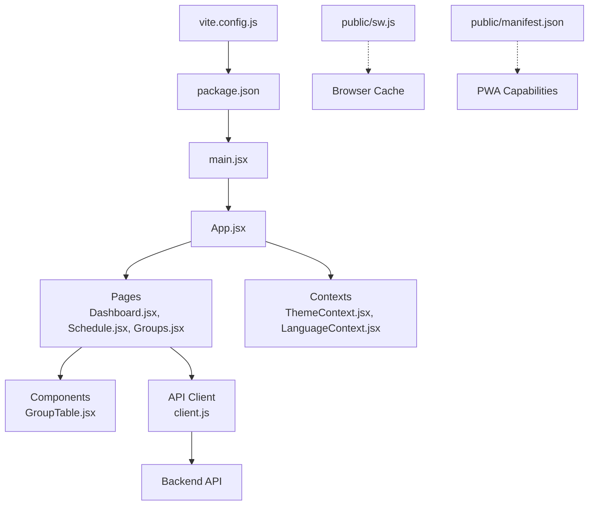
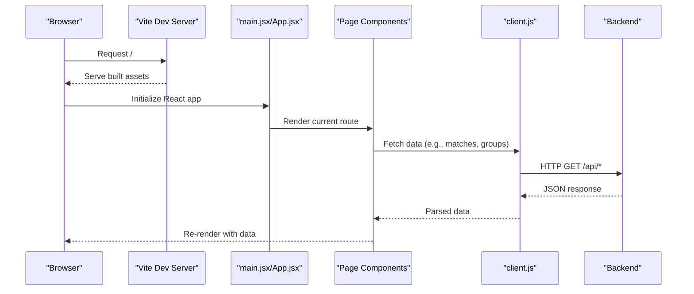
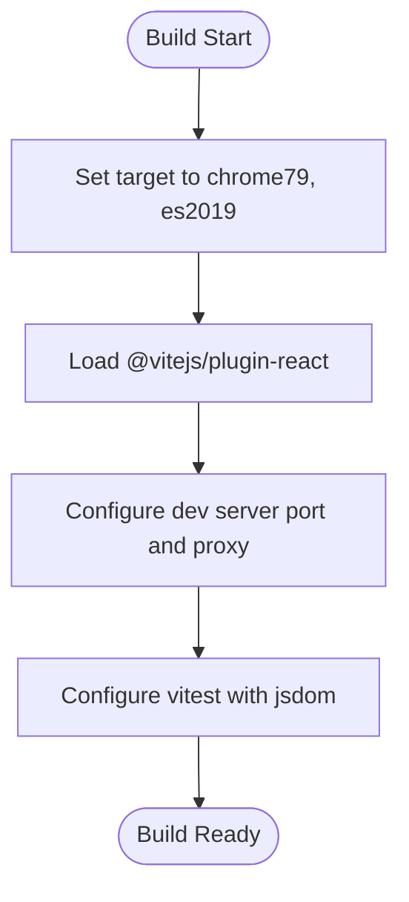
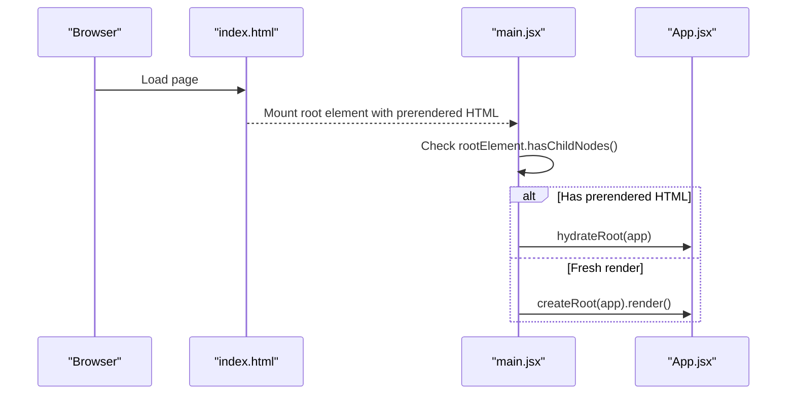
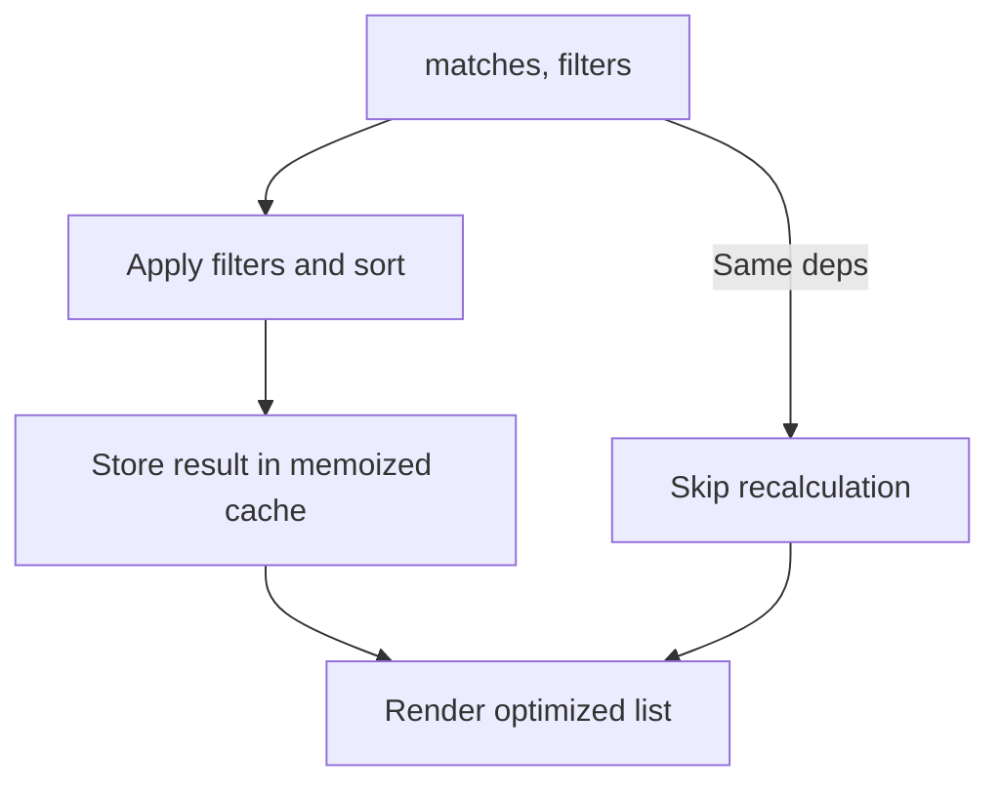
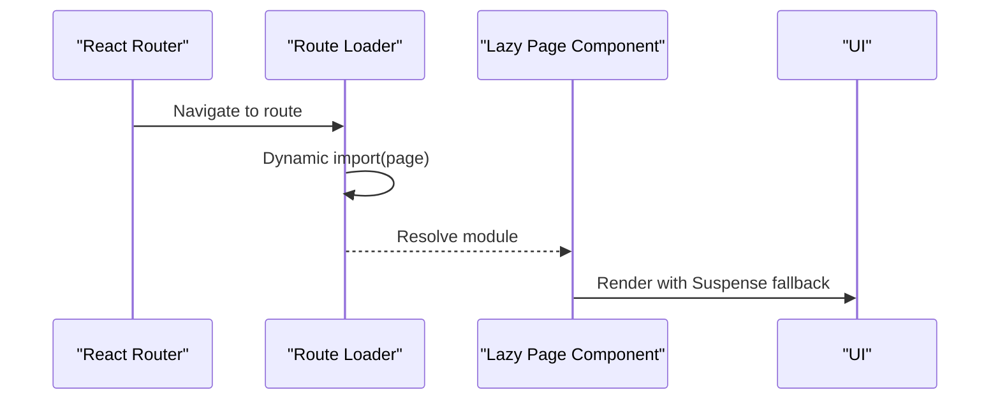
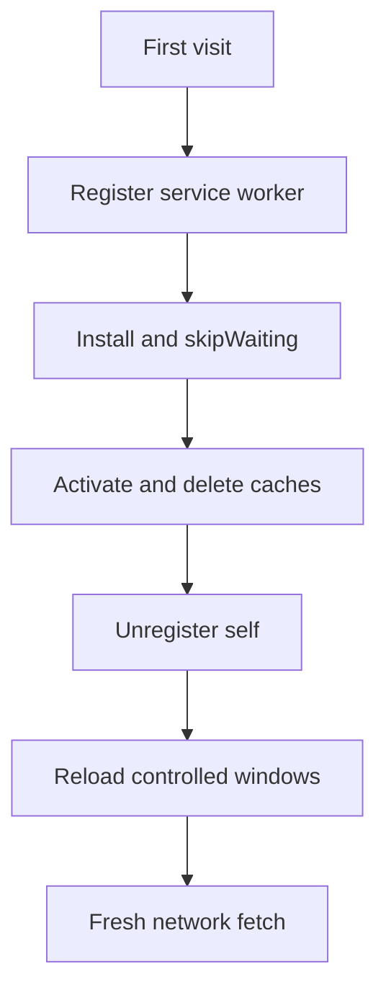
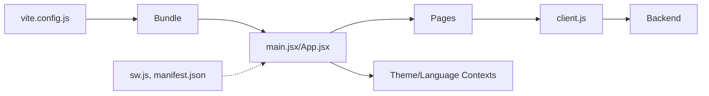

# Performance and Optimization

<cite>
**Referenced Files in This Document**
- [vite.config.js](file://frontend/vite.config.js)
- [package.json](file://frontend/package.json)
- [main.jsx](file://frontend/src/main.jsx)
- [App.jsx](file://frontend/src/App.jsx)
- [Dashboard.jsx](file://frontend/src/pages/Dashboard.jsx)
- [Schedule.jsx](file://frontend/src/pages/Schedule.jsx)
- [Groups.jsx](file://frontend/src/pages/Groups.jsx)
- [GroupTable.jsx](file://frontend/src/components/GroupTable.jsx)
- [client.js](file://frontend/src/api/client.js)
- [time.js](file://frontend/src/utils/time.js)
- [ThemeContext.jsx](file://frontend/src/contexts/ThemeContext.jsx)
- [LanguageContext.jsx](file://frontend/src/contexts/LanguageContext.jsx)
- [sw.js](file://frontend/public/sw.js)
- [manifest.json](file://frontend/public/manifest.json)
</cite>

## Table of Contents
1. [Introduction](#introduction)
2. [Project Structure](#project-structure)
3. [Core Components](#core-components)
4. [Architecture Overview](#architecture-overview)
5. [Detailed Component Analysis](#detailed-component-analysis)
6. [Dependency Analysis](#dependency-analysis)
7. [Performance Considerations](#performance-considerations)
8. [Troubleshooting Guide](#troubleshooting-guide)
9. [Conclusion](#conclusion)
10. [Appendices](#appendices)

## Introduction
This document provides comprehensive guidance on performance optimization and build configuration for the React application. It covers Vite build settings, React rendering patterns, lazy loading and code splitting, bundle analysis and tree shaking, runtime performance, critical rendering path optimization, progressive enhancement, offline capability, and profiling techniques. The goal is to help developers improve load performance, reduce bundle sizes, and deliver smooth user experiences across devices.

## Project Structure
The frontend is a Vite-based React application with:
- Build configuration via Vite
- Client-side routing with React Router
- Feature-based page components
- Shared components and utilities
- Context providers for theme and internationalization
- API client for data fetching
- Progressive Web App assets (service worker and manifest)

**Diagram sources**
- [vite.config.js:1-26](file://frontend/vite.config.js#L1-L26)
- [package.json:1-72](file://frontend/package.json#L1-L72)
- [main.jsx:1-22](file://frontend/src/main.jsx#L1-L22)
- [App.jsx:1-284](file://frontend/src/App.jsx#L1-L284)
- [Dashboard.jsx:1-706](file://frontend/src/pages/Dashboard.jsx#L1-L706)
- [Schedule.jsx:1-494](file://frontend/src/pages/Schedule.jsx#L1-L494)
- [Groups.jsx:1-160](file://frontend/src/pages/Groups.jsx#L1-L160)
- [GroupTable.jsx:1-78](file://frontend/src/components/GroupTable.jsx#L1-L78)
- [ThemeContext.jsx:1-27](file://frontend/src/contexts/ThemeContext.jsx#L1-L27)
- [LanguageContext.jsx:1-69](file://frontend/src/contexts/LanguageContext.jsx#L1-L69)
- [client.js:1-50](file://frontend/src/api/client.js#L1-L50)
- [sw.js:1-32](file://frontend/public/sw.js#L1-L32)
- [manifest.json:1-50](file://frontend/public/manifest.json#L1-L50)

**Section sources**
- [vite.config.js:1-26](file://frontend/vite.config.js#L1-L26)
- [package.json:1-72](file://frontend/package.json#L1-L72)
- [main.jsx:1-22](file://frontend/src/main.jsx#L1-L22)
- [App.jsx:1-284](file://frontend/src/App.jsx#L1-L284)

## Core Components
- Vite build configuration defines transpilation targets and dev server/proxy settings.
- React hydration pattern supports pre-rendering with react-snap.
- Pages implement data fetching and memoization to optimize rendering.
- Contexts encapsulate theme and localization logic.
- API client centralizes HTTP requests with timeouts and query parameters.
- PWA assets enable offline-capable experiences.

**Section sources**
- [vite.config.js:4-25](file://frontend/vite.config.js#L4-L25)
- [main.jsx:16-21](file://frontend/src/main.jsx#L16-L21)
- [Dashboard.jsx:147-158](file://frontend/src/pages/Dashboard.jsx#L147-L158)
- [Schedule.jsx:149-154](file://frontend/src/pages/Schedule.jsx#L149-L154)
- [Groups.jsx:18-23](file://frontend/src/pages/Groups.jsx#L18-L23)
- [ThemeContext.jsx:5-24](file://frontend/src/contexts/ThemeContext.jsx#L5-L24)
- [LanguageContext.jsx:7-36](file://frontend/src/contexts/LanguageContext.jsx#L7-L36)
- [client.js:3-7](file://frontend/src/api/client.js#L3-L7)

## Architecture Overview
The application follows a client-side rendered React architecture with:
- Vite for fast builds and development server
- React Router for navigation
- Context providers for global state
- Axios-based API client
- Optional static pre-rendering via react-snap

**Diagram sources**
- [main.jsx:1-22](file://frontend/src/main.jsx#L1-L22)
- [App.jsx:262-275](file://frontend/src/App.jsx#L262-L275)
- [client.js:9-16](file://frontend/src/api/client.js#L9-L16)
- [Dashboard.jsx:147-158](file://frontend/src/pages/Dashboard.jsx#L147-L158)
- [Schedule.jsx:149-154](file://frontend/src/pages/Schedule.jsx#L149-L154)
- [Groups.jsx:18-23](file://frontend/src/pages/Groups.jsx#L18-L23)

## Detailed Component Analysis

### Vite Build Configuration and Bundling Strategies
- Transpilation target ensures compatibility with older browsers during pre-rendering.
- Dev server proxy routes API traffic to backend during local development.
- Test environment configured for DOM testing.

**Diagram sources**
- [vite.config.js:4-25](file://frontend/vite.config.js#L4-L25)

**Section sources**
- [vite.config.js:4-25](file://frontend/vite.config.js#L4-L25)

### React Hydration and Pre-rendering
- Hydration logic detects pre-rendered content and attaches interactivity.
- Post-build script runs react-snap to generate static HTML for specified routes.

**Diagram sources**
- [main.jsx:16-21](file://frontend/src/main.jsx#L16-L21)
- [package.json:9-37](file://frontend/package.json#L9-L37)

**Section sources**
- [main.jsx:16-21](file://frontend/src/main.jsx#L16-L21)
- [package.json:16-37](file://frontend/package.json#L16-L37)

### Memoization Patterns with useMemo and useCallback
- useMemo is used to compute derived data efficiently in Schedule, preventing unnecessary recomputation when dependencies are unchanged.
- useCallback is implicitly leveraged through stable component boundaries; ensure custom callbacks passed to children are memoized if needed.

**Diagram sources**
- [Schedule.jsx:156-168](file://frontend/src/pages/Schedule.jsx#L156-L168)
- [Schedule.jsx:170-187](file://frontend/src/pages/Schedule.jsx#L170-L187)

**Section sources**
- [Schedule.jsx:156-168](file://frontend/src/pages/Schedule.jsx#L156-L168)
- [Schedule.jsx:170-187](file://frontend/src/pages/Schedule.jsx#L170-L187)

### Lazy Loading and Route-Based Code Splitting
- Current routing statically imports page components. To enable route-based code splitting, wrap page imports with dynamic import and Suspense boundaries.
- This reduces initial bundle size and improves TTI on slower connections.

[No sources needed since this diagram shows conceptual workflow, not actual code structure]

### Virtualized Lists and Efficient Rendering for Large Datasets
- For large match lists, implement a virtualized list to render only visible rows.
- Keep item components pure and memoized to minimize re-renders.
- Use stable keys and avoid expensive computations inside render.

[No sources needed since this section doesn't analyze specific source files]

### Bundle Analysis and Tree Shaking
- Use Vite’s built-in preview and analyzer plugins to inspect bundle composition.
- Prefer named exports and granular imports to maximize tree shaking.
- Remove unused dependencies and deduplicate heavy libraries.

[No sources needed since this section provides general guidance]

### Dependency Management Strategies
- Centralize API calls in a single client module to simplify caching and retries.
- Use environment variables for base URLs and feature flags.
- Audit dependencies regularly and align versions across the monorepo.

**Section sources**
- [client.js:3-7](file://frontend/src/api/client.js#L3-L7)

### Runtime Performance Considerations
- Minimize heavy synchronous work on the main thread.
- Defer non-critical tasks and batch updates.
- Use CSS transforms and opacity for animations; avoid layout thrashing.

[No sources needed since this section provides general guidance]

### Critical Rendering Path Optimization
- Inline critical CSS for above-the-fold content.
- Optimize image sizes and formats; leverage responsive images.
- Reduce main-thread work by deferring non-essential JavaScript.

[No sources needed since this section provides general guidance]

### Progressive Enhancement and Offline Capability
- Implement a service worker lifecycle to clean stale caches and unregister legacy workers.
- Provide a minimal offline-friendly shell and fallback UI.
- Use manifest.json to declare PWA metadata and shortcuts.

**Diagram sources**
- [sw.js:17-31](file://frontend/public/sw.js#L17-L31)

**Section sources**
- [sw.js:1-32](file://frontend/public/sw.js#L1-L32)
- [manifest.json:1-50](file://frontend/public/manifest.json#L1-L50)

### Profiling Techniques and Monitoring Setup
- Use React DevTools Profiler to identify slow components.
- Monitor long tasks and layout thrashing with browser devtools.
- Track Core Web Vitals in production and set up logging for errors.

[No sources needed since this section provides general guidance]

### Examples of Performance Measurement Tools Integration
- Lighthouse for automated audits.
- WebPageTest for real-world performance metrics.
- Application Performance Monitoring (APM) for runtime insights.

[No sources needed since this section provides general guidance]

### Optimization Techniques for Different Device Capabilities
- Adaptive image loading and reduced fidelity on lower-end devices.
- Disable heavy animations or reduce motion preferences.
- Prioritize above-the-fold content and defer non-critical resources.

[No sources needed since this section provides general guidance]

## Dependency Analysis
The application’s performance depends on several key relationships:
- Build toolchain (Vite) influences transpilation and bundling.
- API client latency affects perceived performance; consider caching and retries.
- Context providers influence re-render scopes; keep payload minimal.
- PWA assets enable offline readiness and faster reloads.

**Diagram sources**
- [vite.config.js:4-25](file://frontend/vite.config.js#L4-L25)
- [main.jsx:1-22](file://frontend/src/main.jsx#L1-L22)
- [App.jsx:1-284](file://frontend/src/App.jsx#L1-L284)
- [client.js:1-50](file://frontend/src/api/client.js#L1-L50)
- [sw.js:1-32](file://frontend/public/sw.js#L1-L32)
- [manifest.json:1-50](file://frontend/public/manifest.json#L1-L50)

**Section sources**
- [vite.config.js:4-25](file://frontend/vite.config.js#L4-L25)
- [client.js:1-50](file://frontend/src/api/client.js#L1-L50)
- [ThemeContext.jsx:5-24](file://frontend/src/contexts/ThemeContext.jsx#L5-L24)
- [LanguageContext.jsx:7-36](file://frontend/src/contexts/LanguageContext.jsx#L7-L36)

## Performance Considerations
- Prefer route-based code splitting to reduce initial JS payload.
- Use useMemo for derived data and useCallback for event handlers passed down.
- Implement virtualization for large lists and avoid rendering offscreen elements.
- Optimize images and fonts; leverage modern formats and responsive sizing.
- Minimize main-thread work; move heavy tasks to Web Workers if applicable.
- Monitor and measure Core Web Vitals; set budgets for Largest Contentful Paint and Cumulative Layout Shift.

[No sources needed since this section provides general guidance]

## Troubleshooting Guide
- If pre-rendered pages appear blank after deployment, verify react-snap configuration and ensure the build completes successfully.
- If hydration mismatches occur, check for server/client differences in markup or state.
- If API calls fail under load, adjust timeouts and implement retry/backoff logic.
- If offline behavior is inconsistent, confirm service worker activation and cache deletion steps.

**Section sources**
- [package.json:16-37](file://frontend/package.json#L16-L37)
- [main.jsx:16-21](file://frontend/src/main.jsx#L16-L21)
- [client.js:7-7](file://frontend/src/api/client.js#L7-L7)

## Conclusion
By combining Vite’s efficient build pipeline, React’s rendering optimizations, strategic code splitting, and PWA capabilities, the application can achieve strong performance across diverse devices and network conditions. Adopting the recommended patterns—memoization, virtualization, critical path optimization, and robust monitoring—will further enhance user experience and maintainability.

[No sources needed since this section summarizes without analyzing specific files]

## Appendices
- Build commands and scripts are defined in the frontend package configuration.
- Environment-specific API base URLs are resolved at runtime.

**Section sources**
- [package.json:6-14](file://frontend/package.json#L6-L14)
- [client.js:3-5](file://frontend/src/api/client.js#L3-L5)