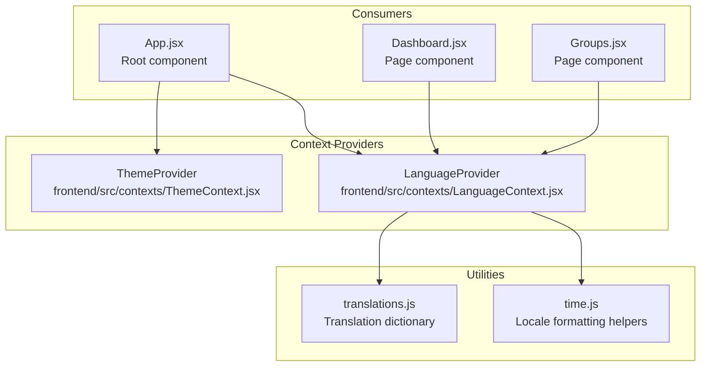
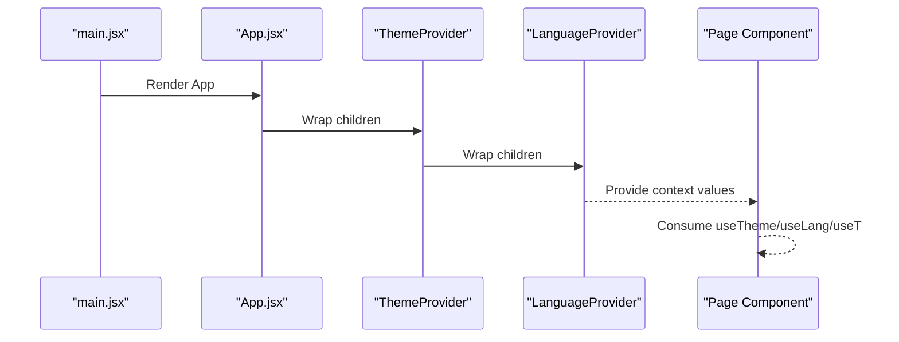
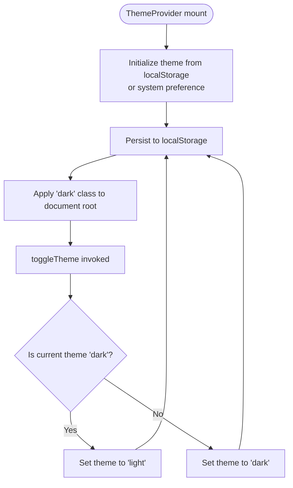
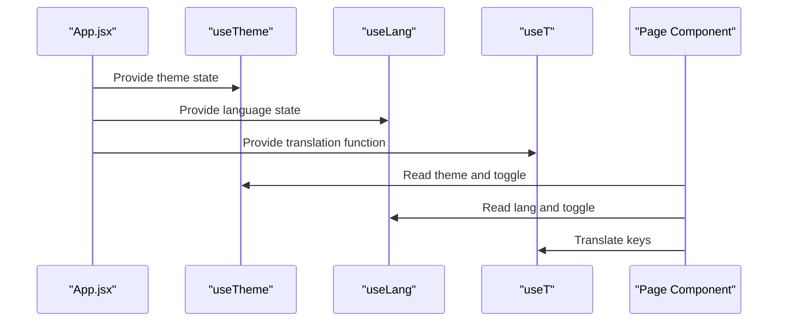
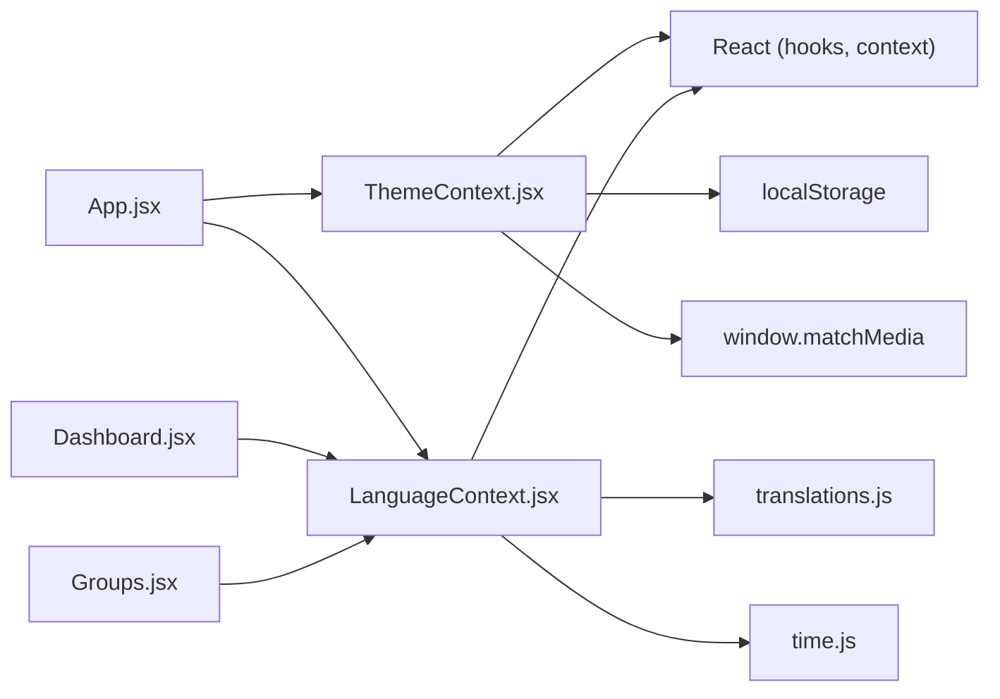

# State Management & Context

<cite>
**Referenced Files in This Document**
- [ThemeContext.jsx](file://frontend/src/contexts/ThemeContext.jsx)
- [LanguageContext.jsx](file://frontend/src/contexts/LanguageContext.jsx)
- [App.jsx](file://frontend/src/App.jsx)
- [main.jsx](file://frontend/src/main.jsx)
- [translations.js](file://frontend/src/i18n/translations.js)
- [time.js](file://frontend/src/utils/time.js)
- [Dashboard.jsx](file://frontend/src/pages/Dashboard.jsx)
- [Groups.jsx](file://frontend/src/pages/Groups.jsx)
</cite>

## Table of Contents
1. [Introduction](#introduction)
2. [Project Structure](#project-structure)
3. [Core Components](#core-components)
4. [Architecture Overview](#architecture-overview)
5. [Detailed Component Analysis](#detailed-component-analysis)
6. [Dependency Analysis](#dependency-analysis)
7. [Performance Considerations](#performance-considerations)
8. [Troubleshooting Guide](#troubleshooting-guide)
9. [Conclusion](#conclusion)

## Introduction
This document explains the React state management system using context providers in the frontend application. It focuses on two primary contexts:
- ThemeContext: Manages theme state (light/dark) and theme switching
- LanguageContext: Manages language state (en/zh), translation lookup, and localized formatting

It documents provider components, consumer hooks, state update mechanisms, persistence strategies, and integration patterns across the application.

## Project Structure
The state management is implemented in the frontend/src/contexts directory with two context modules:
- ThemeContext.jsx: Provides theme state and toggling
- LanguageContext.jsx: Provides language state, translation helpers, and locale-aware formatting

These contexts are consumed by components in the pages and components directories, and integrated at the application root in App.jsx.



**Diagram sources**
- [ThemeContext.jsx:1-27](file://frontend/src/contexts/ThemeContext.jsx#L1-L27)
- [LanguageContext.jsx:1-69](file://frontend/src/contexts/LanguageContext.jsx#L1-L69)
- [App.jsx:247-282](file://frontend/src/App.jsx#L247-L282)
- [Dashboard.jsx:9](file://frontend/src/pages/Dashboard.jsx#L9)
- [Groups.jsx:7](file://frontend/src/pages/Groups.jsx#L7)
- [translations.js:1-630](file://frontend/src/i18n/translations.js#L1-L630)
- [time.js:1-51](file://frontend/src/utils/time.js#L1-L51)

**Section sources**
- [ThemeContext.jsx:1-27](file://frontend/src/contexts/ThemeContext.jsx#L1-L27)
- [LanguageContext.jsx:1-69](file://frontend/src/contexts/LanguageContext.jsx#L1-L69)
- [App.jsx:247-282](file://frontend/src/App.jsx#L247-L282)

## Core Components
- ThemeContext
  - Provider: ThemeProvider
  - Consumer hooks: useTheme
  - State: theme (light/dark)
  - Actions: toggleTheme
  - Persistence: localStorage key "wc26-theme"
  - Side effects: updates document root class for dark mode

- LanguageContext
  - Provider: LanguageProvider
  - Consumer hooks: useLang, useT, useFormatDate, useFormatDateShort, useToSGT, useTeamName
  - State: lang (en/zh)
  - Actions: toggleLang
  - Persistence: localStorage key "wc26-lang"
  - Utilities: translation lookup, locale-aware date formatting, team name localization

**Section sources**
- [ThemeContext.jsx:5-26](file://frontend/src/contexts/ThemeContext.jsx#L5-L26)
- [LanguageContext.jsx:7-25](file://frontend/src/contexts/LanguageContext.jsx#L7-L25)
- [LanguageContext.jsx:28-68](file://frontend/src/contexts/LanguageContext.jsx#L28-L68)

## Architecture Overview
The application wraps the entire UI tree with both providers at the root level. Components can consume either or both contexts depending on their needs.



**Diagram sources**
- [main.jsx:8-14](file://frontend/src/main.jsx#L8-L14)
- [App.jsx:249-281](file://frontend/src/App.jsx#L249-L281)
- [ThemeContext.jsx:5-24](file://frontend/src/contexts/ThemeContext.jsx#L5-L24)
- [LanguageContext.jsx:7-23](file://frontend/src/contexts/LanguageContext.jsx#L7-L23)

## Detailed Component Analysis

### ThemeContext Implementation
- Provider: ThemeProvider
  - Initializes theme from localStorage or prefers-color-scheme media query
  - Persists theme to localStorage on change
  - Applies document.documentElement.classList.toggle('dark', theme === 'dark')
  - Exposes value: { theme, toggleTheme }

- Consumer hook: useTheme
  - Returns the current theme and toggle function

- State update mechanism
  - toggleTheme switches between 'dark' and 'light'
  - useEffect persists to localStorage and applies DOM class

- Persistence strategy
  - Key: "wc26-theme"
  - Initial value: reads from localStorage; otherwise detects system preference



**Diagram sources**
- [ThemeContext.jsx:6-15](file://frontend/src/contexts/ThemeContext.jsx#L6-L15)

**Section sources**
- [ThemeContext.jsx:5-26](file://frontend/src/contexts/ThemeContext.jsx#L5-L26)

### LanguageContext Implementation
- Provider: LanguageProvider
  - Initializes lang from localStorage or defaults to 'en'
  - Persists lang to localStorage on change
  - Exposes value: { lang, toggleLang }

- Consumer hooks
  - useLang: returns { lang, toggleLang }
  - useT: translation function derived from lang
  - useFormatDate: locale-aware date formatter
  - useFormatDateShort: locale-aware short date formatter
  - useToSGT: converts UTC date/time to Singapore Time with locale formatting
  - useTeamName: localized team name resolver

- Translation system
  - translations.js defines keys for both languages
  - useT resolves nested keys using dot notation
  - Fallback to key if translation missing

- Locale mapping and formatting
  - LOCALE_MAP maps 'en' -> 'en-US', 'zh' -> 'zh-CN'
  - time.js provides formatDate, formatDateShort, toSGT utilities

```mermaid
classDiagram
class LanguageProvider {
+string lang
+toggleLang() void
+value : { lang, toggleLang }
}
class useLang {
+returns : { lang, toggleLang }
}
class useT {
+param : string key
+returns : string translation
}
class useFormatDate {
+param : string dateStr
+returns : string formattedDate
}
class useFormatDateShort {
+param : string dateStr
+returns : string formattedDateShort
}
class useToSGT {
+param : string date, time
+returns : string formattedSGT
}
class useTeamName {
+param : string teamId, fallback
+returns : string localizedTeamName
}
LanguageProvider --> useLang : "exposes"
LanguageProvider --> useT : "exposes"
LanguageProvider --> useFormatDate : "exposes"
LanguageProvider --> useFormatDateShort : "exposes"
LanguageProvider --> useToSGT : "exposes"
LanguageProvider --> useTeamName : "exposes"
```

**Diagram sources**
- [LanguageContext.jsx:7-25](file://frontend/src/contexts/LanguageContext.jsx#L7-L25)
- [LanguageContext.jsx:28-68](file://frontend/src/contexts/LanguageContext.jsx#L28-L68)
- [translations.js:1-630](file://frontend/src/i18n/translations.js#L1-L630)
- [time.js:1-51](file://frontend/src/utils/time.js#L1-L51)

**Section sources**
- [LanguageContext.jsx:7-25](file://frontend/src/contexts/LanguageContext.jsx#L7-L25)
- [LanguageContext.jsx:28-68](file://frontend/src/contexts/LanguageContext.jsx#L28-L68)
- [translations.js:1-630](file://frontend/src/i18n/translations.js#L1-L630)
- [time.js:1-51](file://frontend/src/utils/time.js#L1-L51)

### Provider Composition and Root Integration
- App.jsx composes providers around the routing tree
- ThemeProvider wraps LanguageProvider so both contexts are available
- Navigation components (ThemeToggle, LangToggle) consume useTheme and useLang respectively



**Diagram sources**
- [App.jsx:249-281](file://frontend/src/App.jsx#L249-L281)
- [App.jsx:21-47](file://frontend/src/App.jsx#L21-L47)
- [Dashboard.jsx:9](file://frontend/src/pages/Dashboard.jsx#L9)
- [Groups.jsx:7](file://frontend/src/pages/Groups.jsx#L7)

**Section sources**
- [App.jsx:247-282](file://frontend/src/App.jsx#L247-L282)
- [App.jsx:21-47](file://frontend/src/App.jsx#L21-L47)

### Consumer Hook Usage Patterns
- Basic consumption
  - useTheme: access theme and toggleTheme
  - useLang: access lang and toggleLang
- Translation and formatting
  - useT: translate keys like "dashboard.heroTitle"
  - useFormatDate/useFormatDateShort: format dates according to locale
  - useToSGT: convert UTC to Singapore Time with locale formatting
  - useTeamName: localize team names for Chinese language

Examples of usage in components:
- Dashboard.jsx consumes useT, useFormatDate, useFormatDateShort, useTeamName
- Groups.jsx consumes useT and useTeamName
- App.jsx navigation buttons consume useTheme and useLang

**Section sources**
- [Dashboard.jsx:9](file://frontend/src/pages/Dashboard.jsx#L9)
- [Dashboard.jsx:138-141](file://frontend/src/pages/Dashboard.jsx#L138-L141)
- [Groups.jsx:7](file://frontend/src/pages/Groups.jsx#L7)
- [Groups.jsx:12-13](file://frontend/src/pages/Groups.jsx#L12-L13)
- [App.jsx:21-47](file://frontend/src/App.jsx#L21-L47)

### State Synchronization Patterns
- Both contexts synchronize state to localStorage on change
- ThemeContext additionally synchronizes a DOM class to enable CSS-based dark mode
- Consumers receive updated values on re-render when context values change

**Section sources**
- [ThemeContext.jsx:12-15](file://frontend/src/contexts/ThemeContext.jsx#L12-L15)
- [LanguageContext.jsx:12-14](file://frontend/src/contexts/LanguageContext.jsx#L12-L14)

## Dependency Analysis
- ThemeContext depends on:
  - React (useState, useEffect, createContext, useContext)
  - Browser APIs (localStorage, window.matchMedia)
- LanguageContext depends on:
  - React (useState, useEffect, createContext, useContext)
  - translations.js (translation dictionary)
  - time.js (locale formatting utilities)
- App.jsx depends on both contexts for UI controls and page rendering
- Page components depend on LanguageContext for translations and formatting



**Diagram sources**
- [ThemeContext.jsx:1](file://frontend/src/contexts/ThemeContext.jsx#L1)
- [LanguageContext.jsx:1-3](file://frontend/src/contexts/LanguageContext.jsx#L1-L3)
- [translations.js:1](file://frontend/src/i18n/translations.js#L1)
- [time.js:1](file://frontend/src/utils/time.js#L1)
- [App.jsx:10-11](file://frontend/src/App.jsx#L10-L11)
- [Dashboard.jsx:9](file://frontend/src/pages/Dashboard.jsx#L9)
- [Groups.jsx:7](file://frontend/src/pages/Groups.jsx#L7)

**Section sources**
- [ThemeContext.jsx:1](file://frontend/src/contexts/ThemeContext.jsx#L1)
- [LanguageContext.jsx:1-3](file://frontend/src/contexts/LanguageContext.jsx#L1-L3)
- [translations.js:1](file://frontend/src/i18n/translations.js#L1)
- [time.js:1](file://frontend/src/utils/time.js#L1)
- [App.jsx:10-11](file://frontend/src/App.jsx#L10-L11)
- [Dashboard.jsx:9](file://frontend/src/pages/Dashboard.jsx#L9)
- [Groups.jsx:7](file://frontend/src/pages/Groups.jsx#L7)

## Performance Considerations
- Context granularity: Both ThemeContext and LanguageContext are relatively lightweight. They expose small value objects and are consumed widely, which is appropriate for global state.
- Re-renders: Changes to theme or language trigger re-renders of consumers. Since these contexts are near the root and used by many components, consider:
  - Using memoization for expensive computations inside consumers if needed
  - Ensuring consumers only subscribe to the specific values they need (already satisfied by separate hooks)
- Persistence overhead: localStorage writes occur on every state change. This is generally negligible but avoid frequent rapid toggles in tight loops.
- Dark mode DOM class: Applying a class to documentElement is efficient and enables CSS-based theming without deep component traversal.

[No sources needed since this section provides general guidance]

## Troubleshooting Guide
- Theme not persisting
  - Verify localStorage key "wc26-theme" exists and is readable
  - Check browser privacy settings that might block localStorage
  - Confirm ThemeProvider is mounted at the root

- Language not persisting
  - Verify localStorage key "wc26-lang" exists and is readable
  - Confirm LanguageProvider is mounted at the root

- Translations not appearing
  - Ensure translation keys exist in translations.js
  - Confirm useT is called with the correct dot-separated key path
  - Check that lang is set to a supported language ('en' or 'zh')

- Date formatting issues
  - Confirm locale mapping in LanguageContext aligns with time.js expectations
  - Verify date strings passed to formatting functions are valid

**Section sources**
- [ThemeContext.jsx:6-15](file://frontend/src/contexts/ThemeContext.jsx#L6-L15)
- [LanguageContext.jsx:8-14](file://frontend/src/contexts/LanguageContext.jsx#L8-L14)
- [translations.js:1-630](file://frontend/src/i18n/translations.js#L1-L630)
- [time.js:1-51](file://frontend/src/utils/time.js#L1-L51)

## Conclusion
The application employs two focused React contexts to manage theme and language state. ThemeContext handles theme switching with system preference detection and DOM class synchronization. LanguageContext manages language selection, translation resolution, and locale-aware formatting. Together, they provide a clean, centralized state management solution with predictable persistence and easy consumer integration across the UI.