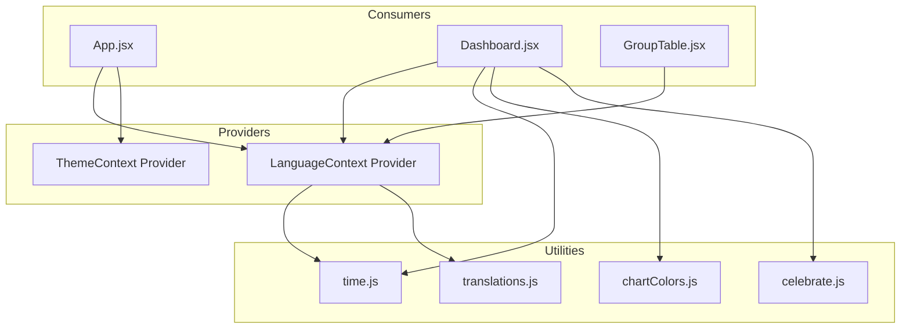
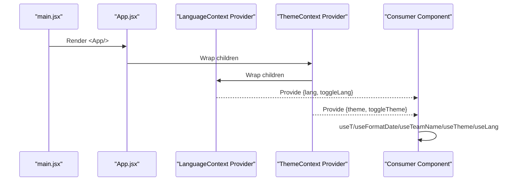
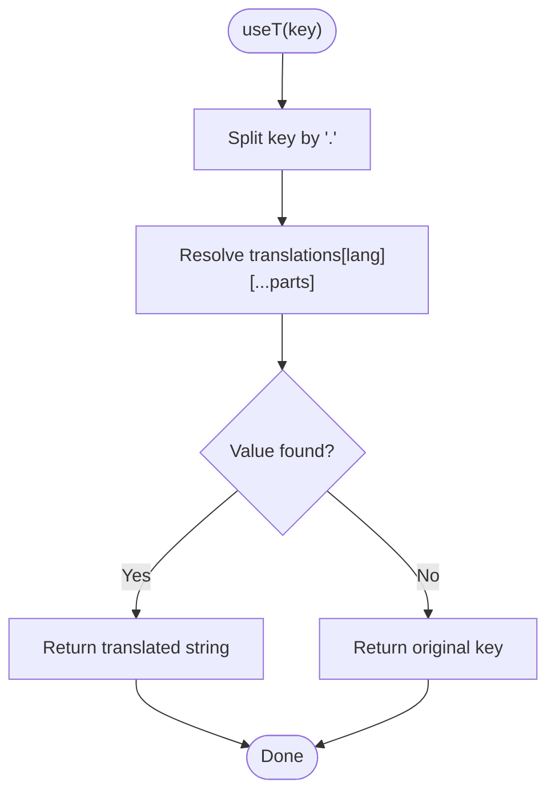
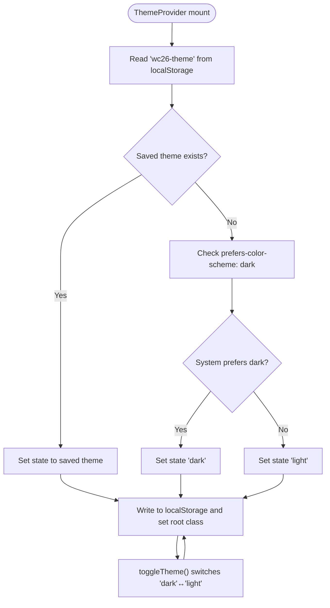
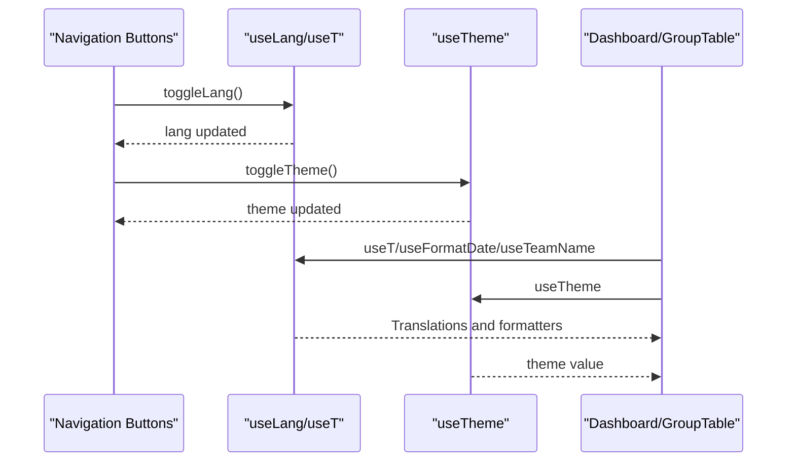
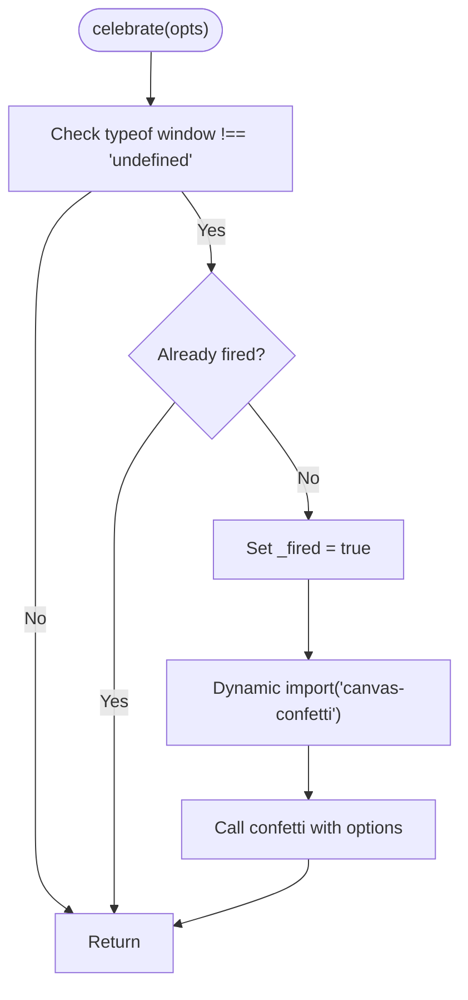
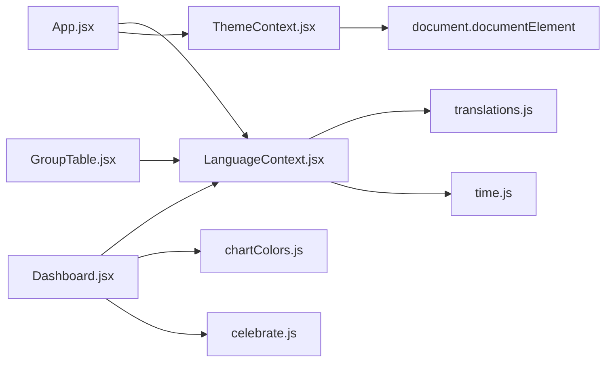

# State Management

<cite>
**Referenced Files in This Document**
- [LanguageContext.jsx](file://frontend/src/contexts/LanguageContext.jsx)
- [ThemeContext.jsx](file://frontend/src/contexts/ThemeContext.jsx)
- [translations.js](file://frontend/src/i18n/translations.js)
- [time.js](file://frontend/src/utils/time.js)
- [celebrate.js](file://frontend/src/utils/celebrate.js)
- [chartColors.js](file://frontend/src/utils/chartColors.js)
- [App.jsx](file://frontend/src/App.jsx)
- [Dashboard.jsx](file://frontend/src/pages/Dashboard.jsx)
- [GroupTable.jsx](file://frontend/src/components/GroupTable.jsx)
- [main.jsx](file://frontend/src/main.jsx)
- [package.json](file://frontend/package.json)
</cite>

## Table of Contents
1. [Introduction](#introduction)
2. [Project Structure](#project-structure)
3. [Core Components](#core-components)
4. [Architecture Overview](#architecture-overview)
5. [Detailed Component Analysis](#detailed-component-analysis)
6. [Dependency Analysis](#dependency-analysis)
7. [Performance Considerations](#performance-considerations)
8. [Troubleshooting Guide](#troubleshooting-guide)
9. [Conclusion](#conclusion)
10. [Appendices](#appendices)

## Introduction
This document explains the state management system for language and theme preferences, along with supporting utilities for celebrations and chart color schemes. It covers context providers, consumers, state update mechanisms, localStorage persistence, context propagation, performance strategies, and SSR considerations. It also outlines best practices for avoiding unnecessary re-renders and integrating with external libraries.

## Project Structure
The state management is implemented using React’s built-in Context API with lightweight providers and custom hooks. Providers wrap the application shell and expose values to deeply nested components. Utility modules encapsulate reusable behaviors such as localized date formatting, celebration animations, and chart color palettes.

**Diagram sources**
- [LanguageContext.jsx:1-69](file://frontend/src/contexts/LanguageContext.jsx#L1-L69)
- [ThemeContext.jsx:1-27](file://frontend/src/contexts/ThemeContext.jsx#L1-L27)
- [App.jsx:247-282](file://frontend/src/App.jsx#L247-L282)
- [Dashboard.jsx:1-706](file://frontend/src/pages/Dashboard.jsx#L1-L706)
- [GroupTable.jsx:1-78](file://frontend/src/components/GroupTable.jsx#L1-L78)
- [time.js:1-51](file://frontend/src/utils/time.js#L1-L51)
- [chartColors.js:1-11](file://frontend/src/utils/chartColors.js#L1-L11)
- [celebrate.js:1-26](file://frontend/src/utils/celebrate.js#L1-L26)
- [translations.js:1-630](file://frontend/src/i18n/translations.js#L1-L630)

**Section sources**
- [LanguageContext.jsx:1-69](file://frontend/src/contexts/LanguageContext.jsx#L1-L69)
- [ThemeContext.jsx:1-27](file://frontend/src/contexts/ThemeContext.jsx#L1-L27)
- [App.jsx:247-282](file://frontend/src/App.jsx#L247-L282)

## Core Components
- LanguageContext: Manages language selection (English/Chinese), persists to localStorage, and exposes helpers for translation lookup, localized date formatting, and team name localization.
- ThemeContext: Manages theme selection (light/dark), detects system preference, persists to localStorage, toggles a root class for styling, and exposes a toggle function.
- Utility modules:
  - time.js: Provides locale-aware date formatting and SGT conversions.
  - celebrate.js: Lightweight animation utility using dynamic imports for confetti.
  - chartColors.js: Exposes WC-themed color constants and a palette for Recharts.

Key capabilities:
- Single-source-of-truth for language/theme state within the app.
- Automatic persistence via localStorage with safe defaults.
- Locale-aware formatting and team name resolution.
- Minimal re-rendering through focused hook exports.

**Section sources**
- [LanguageContext.jsx:1-69](file://frontend/src/contexts/LanguageContext.jsx#L1-L69)
- [ThemeContext.jsx:1-27](file://frontend/src/contexts/ThemeContext.jsx#L1-L27)
- [time.js:1-51](file://frontend/src/utils/time.js#L1-L51)
- [chartColors.js:1-11](file://frontend/src/utils/chartColors.js#L1-L11)
- [celebrate.js:1-26](file://frontend/src/utils/celebrate.js#L1-L26)

## Architecture Overview
The application composes providers at the root level so that any component can consume language and theme state without prop drilling. Consumers use dedicated hooks to access values and functions. Utilities are imported directly by components that need them.

**Diagram sources**
- [main.jsx:1-22](file://frontend/src/main.jsx#L1-L22)
- [App.jsx:247-282](file://frontend/src/App.jsx#L247-L282)
- [LanguageContext.jsx:7-23](file://frontend/src/contexts/LanguageContext.jsx#L7-L23)
- [ThemeContext.jsx:5-24](file://frontend/src/contexts/ThemeContext.jsx#L5-L24)

## Detailed Component Analysis

### LanguageContext Implementation
- State: lang initialized from localStorage or defaults to English.
- Persistence: useEffect writes lang to localStorage whenever it changes.
- Toggle: Switches between English and Chinese.
- Helpers:
  - useT: Curried translation function resolving nested keys with fallback to key itself.
  - useFormatDate/useFormatDateShort: Localized date formatting bound to current locale.
  - useToSGT: Converts UTC date/time to Singapore Time with locale-aware formatting.
  - useTeamName: Returns a function to resolve localized team names for Chinese.

**Diagram sources**
- [LanguageContext.jsx:28-36](file://frontend/src/contexts/LanguageContext.jsx#L28-L36)
- [translations.js:1-630](file://frontend/src/i18n/translations.js#L1-L630)

**Section sources**
- [LanguageContext.jsx:1-69](file://frontend/src/contexts/LanguageContext.jsx#L1-L69)
- [translations.js:1-630](file://frontend/src/i18n/translations.js#L1-L630)
- [time.js:1-51](file://frontend/src/utils/time.js#L1-L51)

### ThemeContext Implementation
- State: theme initialized from localStorage if present; otherwise detected from system preference.
- Persistence: useEffect toggles a root class and writes theme to localStorage.
- Toggle: Switches between dark and light themes.

**Diagram sources**
- [ThemeContext.jsx:5-24](file://frontend/src/contexts/ThemeContext.jsx#L5-L24)

**Section sources**
- [ThemeContext.jsx:1-27](file://frontend/src/contexts/ThemeContext.jsx#L1-L27)

### Consumer Patterns and Examples
- App navigation: The top navigation uses useT for labels and useTheme for styling, and includes toggle buttons for both language and theme.
- Dashboard: Uses useT, useFormatDate, useFormatDateShort, and useTeamName for rendering localized content and dates.
- GroupTable: Demonstrates useT and useTeamName for table headers and team names.

**Diagram sources**
- [App.jsx:21-47](file://frontend/src/App.jsx#L21-L47)
- [App.jsx:99-101](file://frontend/src/App.jsx#L99-L101)
- [Dashboard.jsx:137-142](file://frontend/src/pages/Dashboard.jsx#L137-L142)
- [GroupTable.jsx:7-9](file://frontend/src/components/GroupTable.jsx#L7-L9)

**Section sources**
- [App.jsx:21-47](file://frontend/src/App.jsx#L21-L47)
- [App.jsx:99-101](file://frontend/src/App.jsx#L99-L101)
- [Dashboard.jsx:137-142](file://frontend/src/pages/Dashboard.jsx#L137-L142)
- [GroupTable.jsx:7-9](file://frontend/src/components/GroupTable.jsx#L7-L9)

### Utility Modules
- celebrate.js: Dynamically imports canvas-confetti and renders a one-time celebratory effect with configurable options, resetting internal guard state to prevent repeated firing.
- chartColors.js: Exposes WC-themed color constants and a palette array suitable for Recharts.

**Diagram sources**
- [celebrate.js:3-21](file://frontend/src/utils/celebrate.js#L3-L21)

**Section sources**
- [celebrate.js:1-26](file://frontend/src/utils/celebrate.js#L1-L26)
- [chartColors.js:1-11](file://frontend/src/utils/chartColors.js#L1-L11)

## Dependency Analysis
- LanguageContext depends on:
  - translations.js for key-value lookups.
  - time.js for locale-aware formatting helpers.
- ThemeContext depends on:
  - Browser APIs for system preference detection.
- App.jsx composes providers and consumes hooks for UI controls.
- Dashboard.jsx and GroupTable.jsx consume hooks for localized rendering.

**Diagram sources**
- [LanguageContext.jsx:1-69](file://frontend/src/contexts/LanguageContext.jsx#L1-L69)
- [ThemeContext.jsx:1-27](file://frontend/src/contexts/ThemeContext.jsx#L1-L27)
- [translations.js:1-630](file://frontend/src/i18n/translations.js#L1-L630)
- [time.js:1-51](file://frontend/src/utils/time.js#L1-L51)
- [App.jsx:247-282](file://frontend/src/App.jsx#L247-L282)
- [Dashboard.jsx:1-706](file://frontend/src/pages/Dashboard.jsx#L1-L706)
- [GroupTable.jsx:1-78](file://frontend/src/components/GroupTable.jsx#L1-L78)
- [chartColors.js:1-11](file://frontend/src/utils/chartColors.js#L1-L11)
- [celebrate.js:1-26](file://frontend/src/utils/celebrate.js#L1-L26)

**Section sources**
- [LanguageContext.jsx:1-69](file://frontend/src/contexts/LanguageContext.jsx#L1-L69)
- [ThemeContext.jsx:1-27](file://frontend/src/contexts/ThemeContext.jsx#L1-L27)
- [App.jsx:247-282](file://frontend/src/App.jsx#L247-L282)

## Performance Considerations
- Minimize re-renders:
  - Keep providers near the root to avoid redundant rerenders higher in the tree.
  - Prefer separate providers for language and theme to avoid unnecessary theme updates when toggling language.
  - Memoize derived values (e.g., memoized formatters) at the component level if needed.
- Lazy initialization:
  - Initialize state from localStorage synchronously during mount to avoid intermediate renders.
- Conditional effects:
  - Only write to localStorage when state actually changes (already handled via dependency arrays).
- Bundle size:
  - Dynamic import for celebration animations ensures they are loaded only when triggered.
- Styling:
  - Toggling a single root class for theme reduces cascading style recalculations.

[No sources needed since this section provides general guidance]

## Troubleshooting Guide
- Language not persisting:
  - Verify localStorage key 'wc26-lang' is writable and not blocked by browser privacy settings.
  - Confirm the useEffect runs and localStorage.setItem is called after state change.
- Theme not persisting:
  - Ensure 'wc26-theme' exists in localStorage or system preference is respected.
  - Confirm the root element class toggling occurs on state change.
- SSR hydration mismatch:
  - The app uses react-snap for pre-rendering and hydrateRoot when HTML is present. Ensure the providers initialize state consistently on both server and client.
- Confetti not appearing:
  - Dynamic import requires a browser environment; confirm the call occurs in a client-side context and that the module loads successfully.

**Section sources**
- [LanguageContext.jsx:12-14](file://frontend/src/contexts/LanguageContext.jsx#L12-L14)
- [ThemeContext.jsx:12-15](file://frontend/src/contexts/ThemeContext.jsx#L12-L15)
- [main.jsx:16-21](file://frontend/src/main.jsx#L16-L21)
- [celebrate.js:3-21](file://frontend/src/utils/celebrate.js#L3-L21)

## Conclusion
The state management system leverages React Context for language and theme preferences with minimal overhead. It integrates localStorage for persistence, supports system preference detection for theme, and provides localized formatting and translation helpers. Utility modules enhance UX with celebrations and consistent chart colors. Composition at the root and targeted hook consumption keep the system maintainable and efficient.

[No sources needed since this section summarizes without analyzing specific files]

## Appendices

### Hooks Reference
- useLang: Access { lang, toggleLang } from LanguageContext.
- useT: Curried translation function for localized strings.
- useFormatDate/useFormatDateShort: Locale-aware date formatting helpers.
- useToSGT: Convert UTC date/time to Singapore Time with locale formatting.
- useTeamName: Resolve localized team names for Chinese locale.
- useTheme: Access { theme, toggleTheme } from ThemeContext.

**Section sources**
- [LanguageContext.jsx:25-68](file://frontend/src/contexts/LanguageContext.jsx#L25-L68)
- [ThemeContext.jsx:26](file://frontend/src/contexts/ThemeContext.jsx#L26)

### SSR and Hydration Notes
- Pre-rendering: react-snap generates static HTML for specified routes.
- Hydration: hydrateRoot is used when child nodes exist; otherwise createRoot renders.
- Providers: Initialize state from localStorage or system preference to avoid mismatches.

**Section sources**
- [package.json:16-37](file://frontend/package.json#L16-L37)
- [main.jsx:16-21](file://frontend/src/main.jsx#L16-L21)