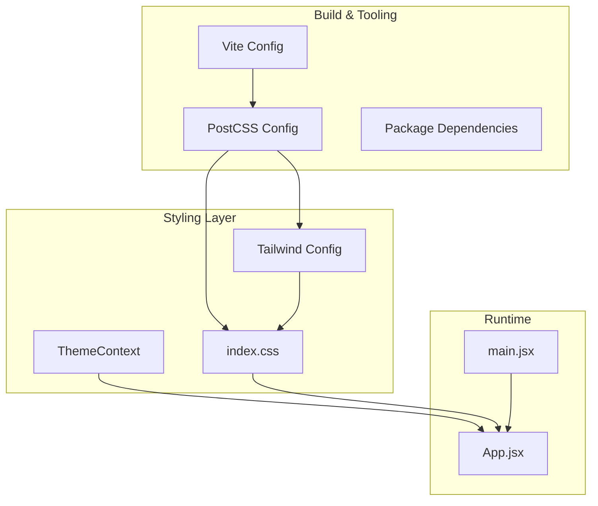
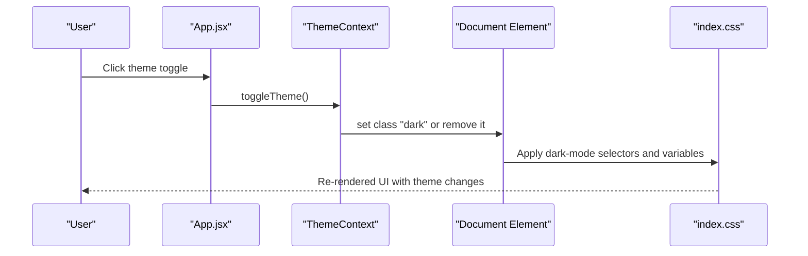
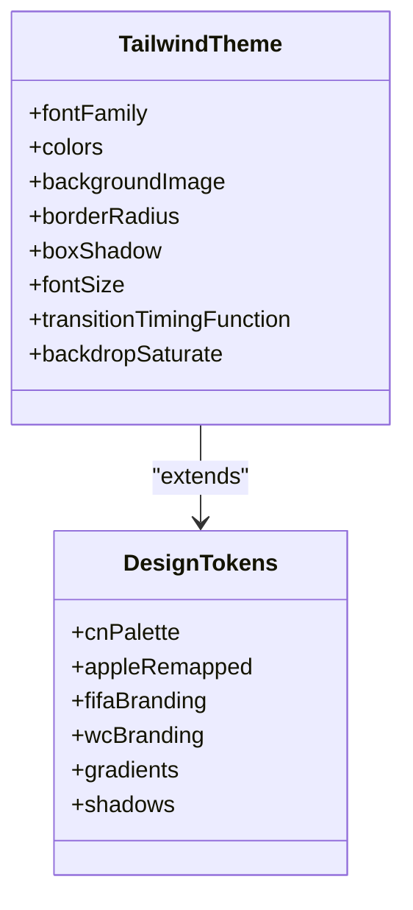
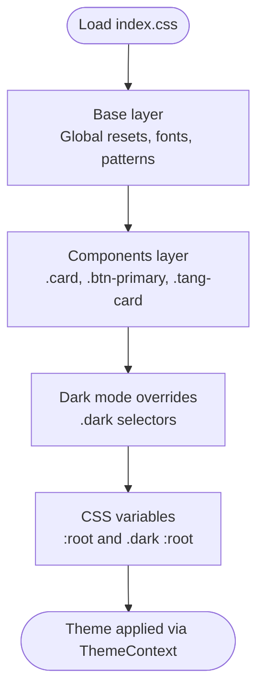
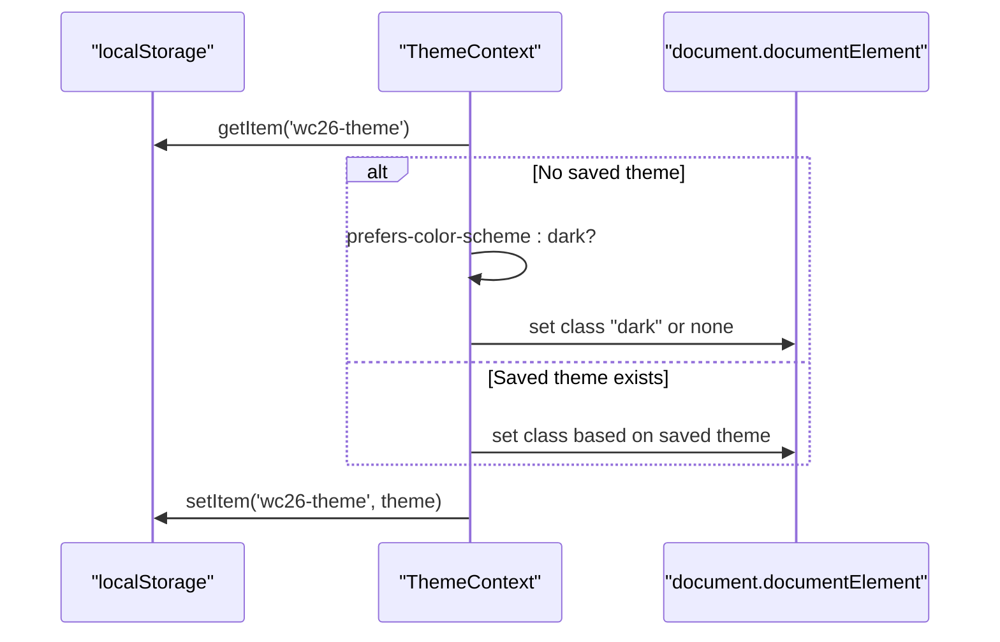
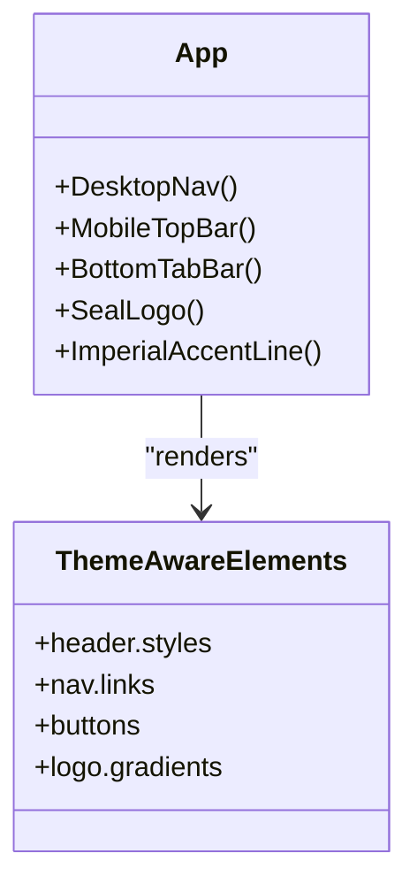
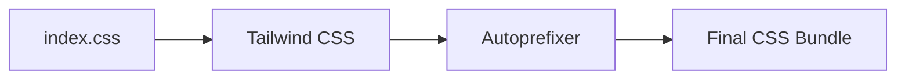
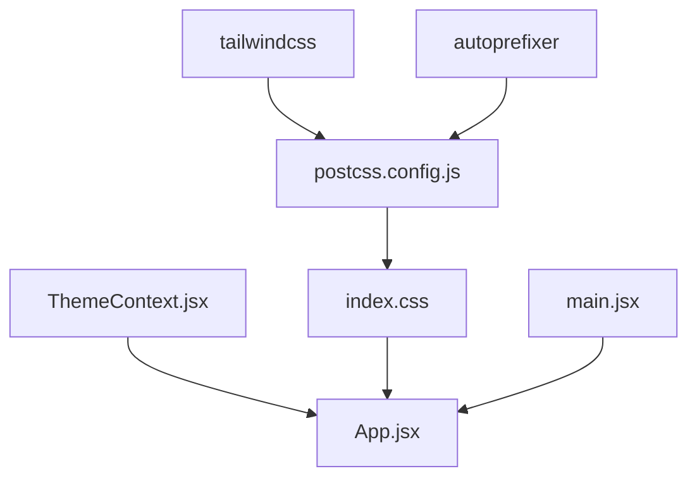

# Styling & Theming System

<cite>
**Referenced Files in This Document**
- [tailwind.config.js](file://frontend/tailwind.config.js)
- [postcss.config.js](file://frontend/postcss.config.js)
- [index.css](file://frontend/src/index.css)
- [ThemeContext.jsx](file://frontend/src/contexts/ThemeContext.jsx)
- [App.jsx](file://frontend/src/App.jsx)
- [package.json](file://frontend/package.json)
- [vite.config.js](file://frontend/vite.config.js)
- [main.jsx](file://frontend/src/main.jsx)
</cite>

## Table of Contents
1. [Introduction](#introduction)
2. [Project Structure](#project-structure)
3. [Core Components](#core-components)
4. [Architecture Overview](#architecture-overview)
5. [Detailed Component Analysis](#detailed-component-analysis)
6. [Dependency Analysis](#dependency-analysis)
7. [Performance Considerations](#performance-considerations)
8. [Troubleshooting Guide](#troubleshooting-guide)
9. [Conclusion](#conclusion)

## Introduction
This document provides comprehensive documentation for the styling and theming system used in the frontend application. It covers the Tailwind CSS configuration, custom CSS utilities, theme customization patterns, dark/light theme implementation, color system, design tokens, responsive design approach, and cross-platform compatibility. It also includes guidelines for adding new styles, maintaining design consistency, implementing theme-aware components, and optimizing CSS through PostCSS.

## Project Structure
The styling system is organized around three pillars:
- Tailwind CSS configuration defines design tokens, color palettes, utilities, and component variants.
- Custom CSS utilities extend Tailwind with brand-specific components and animations.
- ThemeContext manages runtime theme switching with persistence and prefers-color-scheme detection.

**Diagram sources**
- [tailwind.config.js:1-161](file://frontend/tailwind.config.js#L1-L161)
- [postcss.config.js:1-7](file://frontend/postcss.config.js#L1-L7)
- [index.css:1-785](file://frontend/src/index.css#L1-L785)
- [ThemeContext.jsx:1-27](file://frontend/src/contexts/ThemeContext.jsx#L1-L27)
- [App.jsx:1-284](file://frontend/src/App.jsx#L1-L284)
- [main.jsx:1-22](file://frontend/src/main.jsx#L1-L22)

**Section sources**
- [tailwind.config.js:1-161](file://frontend/tailwind.config.js#L1-L161)
- [postcss.config.js:1-7](file://frontend/postcss.config.js#L1-L7)
- [index.css:1-785](file://frontend/src/index.css#L1-L785)
- [ThemeContext.jsx:1-27](file://frontend/src/contexts/ThemeContext.jsx#L1-L27)
- [App.jsx:1-284](file://frontend/src/App.jsx#L1-L284)
- [main.jsx:1-22](file://frontend/src/main.jsx#L1-L22)

## Core Components
- Tailwind CSS configuration: Defines design tokens, color systems, typography, spacing, shadows, borders, and background gradients. Includes brand-specific palettes (Chinese landscape painting, Apple-style remapping, FIFA, and World Cup) and landscape-inspired utilities.
- Custom CSS utilities: Provides reusable component classes (.card, .tang-card, .btn-primary, .glass-card) and dark-mode overrides with CSS variables for consistent theming.
- ThemeContext: Manages theme state, persists user preference, and toggles the dark class on the document element.

Key capabilities:
- Design tokens: Colors, typography scales, spacing, border radius, shadows, transitions, and gradients.
- Theme-aware components: Buttons, cards, navigation, and decorative elements adapt to light/dark modes.
- Responsive utilities: Built-in Tailwind responsive modifiers (sm:, md:, lg:, xl:) are used throughout the app.

**Section sources**
- [tailwind.config.js:5-161](file://frontend/tailwind.config.js#L5-L161)
- [index.css:40-785](file://frontend/src/index.css#L40-L785)
- [ThemeContext.jsx:5-24](file://frontend/src/contexts/ThemeContext.jsx#L5-L24)

## Architecture Overview
The styling architecture integrates Tailwind CSS with custom CSS and React context to deliver a cohesive theming experience.

**Diagram sources**
- [ThemeContext.jsx:12-15](file://frontend/src/contexts/ThemeContext.jsx#L12-L15)
- [index.css:417-421](file://frontend/src/index.css#L417-L421)
- [App.jsx:21-33](file://frontend/src/App.jsx#L21-L33)

## Detailed Component Analysis

### Tailwind Configuration
The Tailwind configuration extends the theme with:
- Font families: Plus Jakarta Sans, Noto Serif SC, Ma Shan Zheng, and system fonts.
- Color systems: cn (Chinese landscape), apple (Apple-style remapped), fifa, wc (World Cup branding), plus gradients and shadows aligned with these palettes.
- Background images: Landscape-inspired gradients for cards and decorative elements.
- Border radius, shadows, and typography scales with clamp-based fluid sizing.
- Transition timing and backdrop saturation utilities.

**Diagram sources**
- [tailwind.config.js:5-161](file://frontend/tailwind.config.js#L5-L161)

**Section sources**
- [tailwind.config.js:5-161](file://frontend/tailwind.config.js#L5-L161)

### Custom CSS Utilities and Dark Mode
Custom CSS utilities define reusable component classes and dark-mode overrides:
- Base layer: Global resets, font smoothing, and ambient background patterns.
- Components layer: Cards, buttons, chips, dividers, and decorative watermarks.
- Dark mode overrides: Comprehensive selector-based overrides for all component classes and utilities.
- CSS variables: :root and .dark :root define theme-specific color values for consistent theming.

**Diagram sources**
- [index.css:40-785](file://frontend/src/index.css#L40-L785)

**Section sources**
- [index.css:40-785](file://frontend/src/index.css#L40-L785)

### ThemeContext and Runtime Behavior
ThemeContext manages theme state and persistence:
- Reads saved theme from localStorage or detects user's OS preference.
- Toggles the "dark" class on the document element.
- Persists theme selection for future sessions.

**Diagram sources**
- [ThemeContext.jsx:6-15](file://frontend/src/contexts/ThemeContext.jsx#L6-L15)

**Section sources**
- [ThemeContext.jsx:1-27](file://frontend/src/contexts/ThemeContext.jsx#L1-L27)

### Theme-Aware Components in App.jsx
App.jsx demonstrates theme-aware components:
- Navigation and headers switch background and border styles based on theme.
- Buttons and interactive elements use theme-aware color classes.
- Safe area insets and responsive layouts integrate with theme visuals.

**Diagram sources**
- [App.jsx:99-244](file://frontend/src/App.jsx#L99-L244)

**Section sources**
- [App.jsx:99-244](file://frontend/src/App.jsx#L99-L244)

### PostCSS and Build Pipeline
PostCSS pipeline:
- Tailwind CSS plugin compiles design tokens and utilities.
- Autoprefixer adds vendor prefixes for compatibility.
- Vite handles asset bundling and development server.

**Diagram sources**
- [postcss.config.js:1-7](file://frontend/postcss.config.js#L1-L7)
- [tailwind.config.js:1-161](file://frontend/tailwind.config.js#L1-L161)

**Section sources**
- [postcss.config.js:1-7](file://frontend/postcss.config.js#L1-L7)
- [package.json:49-70](file://frontend/package.json#L49-L70)
- [vite.config.js:1-26](file://frontend/vite.config.js#L1-L26)

## Dependency Analysis
The styling system depends on Tailwind CSS and PostCSS plugins, with runtime theme management handled by React context.

**Diagram sources**
- [postcss.config.js:1-7](file://frontend/postcss.config.js#L1-L7)
- [ThemeContext.jsx:1-27](file://frontend/src/contexts/ThemeContext.jsx#L1-L27)
- [App.jsx:1-284](file://frontend/src/App.jsx#L1-L284)
- [main.jsx:1-22](file://frontend/src/main.jsx#L1-L22)

**Section sources**
- [package.json:49-70](file://frontend/package.json#L49-L70)
- [postcss.config.js:1-7](file://frontend/postcss.config.js#L1-L7)
- [ThemeContext.jsx:1-27](file://frontend/src/contexts/ThemeContext.jsx#L1-L27)
- [App.jsx:1-284](file://frontend/src/App.jsx#L1-L284)
- [main.jsx:1-22](file://frontend/src/main.jsx#L1-L22)

## Performance Considerations
- CSS optimization: Tailwind purges unused styles during build; ensure content paths in the Tailwind config match the project structure.
- PostCSS plugins: Tailwind and Autoprefixer minimize manual vendor prefixes and reduce CSS size.
- Pre-rendering: Vite build targets older browsers to support snapshotting; ensure CSS remains compatible.
- Theme rendering: CSS variables and class toggling are efficient; avoid excessive reflows by batching DOM updates.

[No sources needed since this section provides general guidance]

## Troubleshooting Guide
Common issues and resolutions:
- Theme not persisting: Verify localStorage availability and ThemeContext initialization logic.
- Dark mode not applying: Confirm the "dark" class is toggled on the document element and CSS selectors match.
- Typography inconsistencies: Ensure font families are loaded and Tailwind font utilities are used consistently.
- Gradient or shadow artifacts: Check Tailwind color tokens and verify dark-mode overrides are present for affected components.

**Section sources**
- [ThemeContext.jsx:6-15](file://frontend/src/contexts/ThemeContext.jsx#L6-L15)
- [index.css:417-785](file://frontend/src/index.css#L417-L785)
- [tailwind.config.js:7-12](file://frontend/tailwind.config.js#L7-L12)

## Conclusion
The styling and theming system combines Tailwind CSS design tokens with custom CSS utilities and React context-driven theme management. It delivers a cohesive, responsive, and theme-consistent experience across platforms while supporting both light and dark modes. Following the guidelines below ensures maintainable and scalable styling practices.

### Guidelines for Adding New Styles
- Define design tokens in Tailwind config (colors, typography, spacing) before using them in components.
- Create reusable component classes in the components layer of index.css for shared patterns.
- Add dark-mode overrides under .dark selectors for new components.
- Use responsive modifiers (sm:, md:, lg:, xl:) to ensure mobile-first responsiveness.
- Keep CSS variables centralized in :root and .dark :root for consistent theming.
- Test theme transitions and ensure accessibility contrast in both modes.

[No sources needed since this section summarizes best practices]