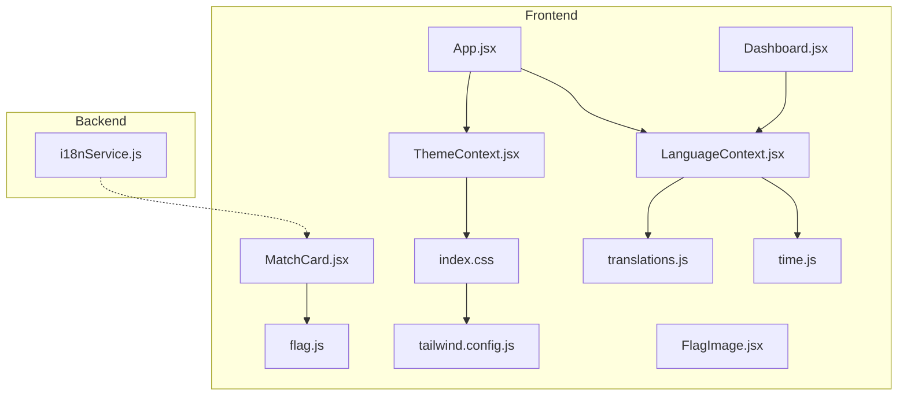
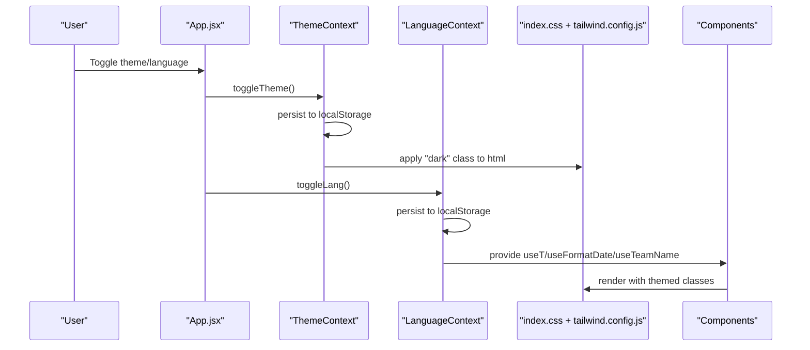
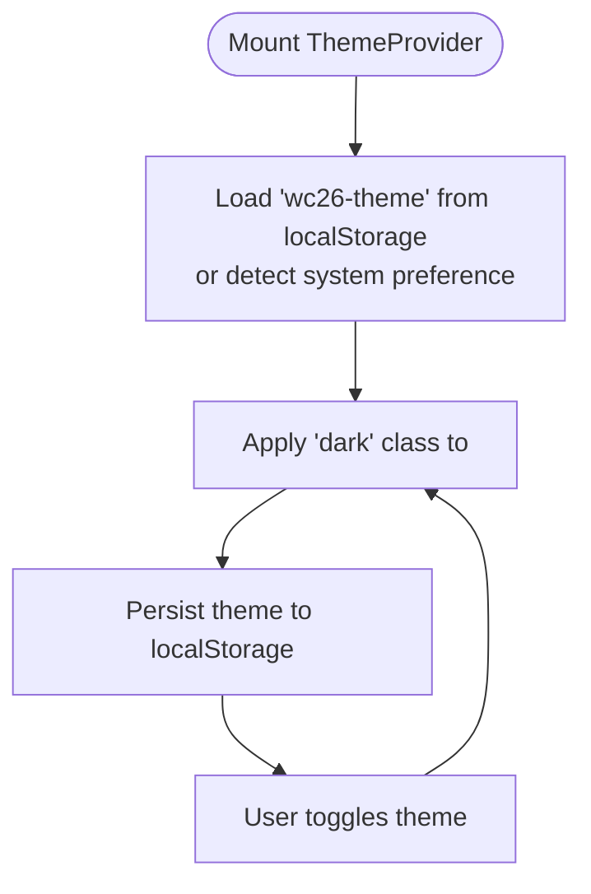
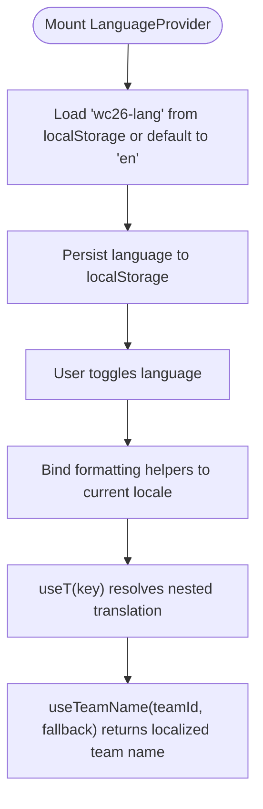
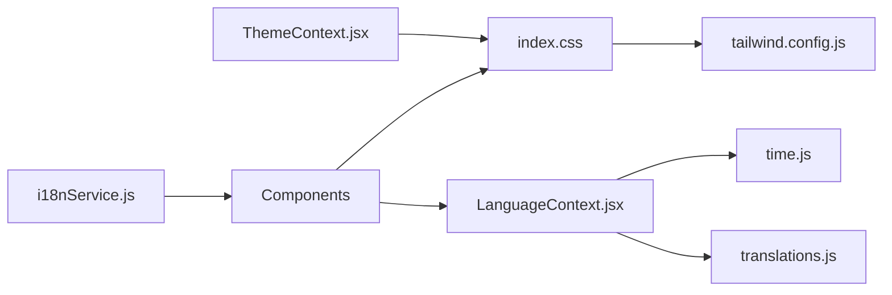

# Theming and Internationalization

<cite>
**Referenced Files in This Document**
- [ThemeContext.jsx](file://frontend/src/contexts/ThemeContext.jsx)
- [LanguageContext.jsx](file://frontend/src/contexts/LanguageContext.jsx)
- [translations.js](file://frontend/src/i18n/translations.js)
- [flag.js](file://frontend/src/utils/flag.js)
- [time.js](file://frontend/src/utils/time.js)
- [index.css](file://frontend/src/index.css)
- [tailwind.config.js](file://frontend/tailwind.config.js)
- [App.jsx](file://frontend/src/App.jsx)
- [FlagImage.jsx](file://frontend/src/components/FlagImage.jsx)
- [MatchCard.jsx](file://frontend/src/components/MatchCard.jsx)
- [Dashboard.jsx](file://frontend/src/pages/Dashboard.jsx)
- [i18nService.js](file://backend/services/i18nService.js)
- [main.jsx](file://frontend/src/main.jsx)
</cite>

## Table of Contents
1. [Introduction](#introduction)
2. [Project Structure](#project-structure)
3. [Core Components](#core-components)
4. [Architecture Overview](#architecture-overview)
5. [Detailed Component Analysis](#detailed-component-analysis)
6. [Dependency Analysis](#dependency-analysis)
7. [Performance Considerations](#performance-considerations)
8. [Troubleshooting Guide](#troubleshooting-guide)
9. [Conclusion](#conclusion)
10. [Appendices](#appendices)

## Introduction
This document explains the theming and internationalization systems that deliver a cohesive global user experience. It covers:
- Theme system with dark/light mode toggle, automatic system preference detection, and CSS variable-based styling
- Internationalization framework supporting English and Chinese with dynamic content switching, date/time formatting, and team name localization
- Translation key structure, context-aware messaging, and server-side translation for prediction insights
- Utility patterns for country flags, time formatting, and component-level integration
- Accessibility and performance considerations for theme switching

## Project Structure
The theming and i18n systems are implemented primarily in the frontend under the src directory, with complementary server-side translation for prediction insights.

**Diagram sources**
- [ThemeContext.jsx:1-27](file://frontend/src/contexts/ThemeContext.jsx#L1-L27)
- [LanguageContext.jsx:1-69](file://frontend/src/contexts/LanguageContext.jsx#L1-L69)
- [translations.js:1-630](file://frontend/src/i18n/translations.js#L1-L630)
- [index.css:1-785](file://frontend/src/index.css#L1-L785)
- [tailwind.config.js:1-161](file://frontend/tailwind.config.js#L1-L161)
- [time.js:1-51](file://frontend/src/utils/time.js#L1-L51)
- [flag.js:1-18](file://frontend/src/utils/flag.js#L1-L18)
- [App.jsx:1-284](file://frontend/src/App.jsx#L1-L284)
- [FlagImage.jsx:1-31](file://frontend/src/components/FlagImage.jsx#L1-L31)
- [MatchCard.jsx:1-175](file://frontend/src/components/MatchCard.jsx#L1-L175)
- [Dashboard.jsx:1-200](file://frontend/src/pages/Dashboard.jsx#L1-L200)
- [i18nService.js:1-116](file://backend/services/i18nService.js#L1-L116)

**Section sources**
- [ThemeContext.jsx:1-27](file://frontend/src/contexts/ThemeContext.jsx#L1-L27)
- [LanguageContext.jsx:1-69](file://frontend/src/contexts/LanguageContext.jsx#L1-L69)
- [translations.js:1-630](file://frontend/src/i18n/translations.js#L1-L630)
- [index.css:1-785](file://frontend/src/index.css#L1-L785)
- [tailwind.config.js:1-161](file://frontend/tailwind.config.js#L1-L161)
- [time.js:1-51](file://frontend/src/utils/time.js#L1-L51)
- [flag.js:1-18](file://frontend/src/utils/flag.js#L1-L18)
- [App.jsx:1-284](file://frontend/src/App.jsx#L1-L284)
- [FlagImage.jsx:1-31](file://frontend/src/components/FlagImage.jsx#L1-L31)
- [MatchCard.jsx:1-175](file://frontend/src/components/MatchCard.jsx#L1-L175)
- [Dashboard.jsx:1-200](file://frontend/src/pages/Dashboard.jsx#L1-L200)
- [i18nService.js:1-116](file://backend/services/i18nService.js#L1-L116)

## Core Components
- ThemeContext: Manages theme state, persists to localStorage, toggles dark mode, and applies a class to the document root for Tailwind dark mode.
- LanguageContext: Provides language state, toggles between English and Chinese, exposes translation keys, and binds formatting helpers to the current locale.
- translations.js: Centralized translation dictionary with nested keys for navigation, stages, statuses, common phrases, and page-specific content, plus a Chinese team name map.
- time.js: Date/time formatting utilities for long/short dates, Singapore Time conversion, and compact time display.
- flag.js: Maps team identifiers to flag CDN URLs for country representation.
- index.css: CSS variable-based theming with light/dark overrides and Tailwind component classes.
- tailwind.config.js: Extends Tailwind with custom colors, gradients, shadows, and typography aligned to the “Chinese landscape painting” aesthetic.

**Section sources**
- [ThemeContext.jsx:1-27](file://frontend/src/contexts/ThemeContext.jsx#L1-L27)
- [LanguageContext.jsx:1-69](file://frontend/src/contexts/LanguageContext.jsx#L1-L69)
- [translations.js:1-630](file://frontend/src/i18n/translations.js#L1-L630)
- [time.js:1-51](file://frontend/src/utils/time.js#L1-L51)
- [flag.js:1-18](file://frontend/src/utils/flag.js#L1-L18)
- [index.css:1-785](file://frontend/src/index.css#L1-L785)
- [tailwind.config.js:1-161](file://frontend/tailwind.config.js#L1-L161)

## Architecture Overview
The theming and i18n systems integrate at the application root and propagate down to components via React Contexts. The theme system relies on CSS variables and Tailwind’s dark mode class strategy. The i18n system uses a hierarchical key structure and locale-bound formatting functions.

**Diagram sources**
- [App.jsx:21-47](file://frontend/src/App.jsx#L21-L47)
- [ThemeContext.jsx:5-24](file://frontend/src/contexts/ThemeContext.jsx#L5-L24)
- [LanguageContext.jsx:7-23](file://frontend/src/contexts/LanguageContext.jsx#L7-L23)
- [index.css:1-785](file://frontend/src/index.css#L1-L785)
- [tailwind.config.js:1-161](file://frontend/tailwind.config.js#L1-L161)

## Detailed Component Analysis

### Theme System
- Automatic detection: On mount, reads from localStorage or checks system preference to initialize theme.
- Persistence: Saves theme selection to localStorage and applies a class to the document root for Tailwind dark mode.
- CSS variable-based theming: Defines color tokens and dark-mode overrides in CSS layers, enabling smooth transitions and component-level theming.

**Diagram sources**
- [ThemeContext.jsx:6-15](file://frontend/src/contexts/ThemeContext.jsx#L6-L15)

**Section sources**
- [ThemeContext.jsx:1-27](file://frontend/src/contexts/ThemeContext.jsx#L1-L27)
- [index.css:417-421](file://frontend/src/index.css#L417-L421)
- [tailwind.config.js:3-3](file://frontend/tailwind.config.js#L3-L3)

### Internationalization Framework
- Language state: Tracks current language and persists to localStorage.
- Translation keys: Hierarchical dot notation keys resolve to localized strings.
- Locale binding: Formatting helpers bind to the current language’s locale for dates and times.
- Team name localization: Specialized hook returns Chinese team names when language is Chinese.

**Diagram sources**
- [LanguageContext.jsx:7-23](file://frontend/src/contexts/LanguageContext.jsx#L7-L23)
- [LanguageContext.jsx:28-36](file://frontend/src/contexts/LanguageContext.jsx#L28-L36)
- [LanguageContext.jsx:41-59](file://frontend/src/contexts/LanguageContext.jsx#L41-L59)
- [LanguageContext.jsx:62-68](file://frontend/src/contexts/LanguageContext.jsx#L62-L68)

**Section sources**
- [LanguageContext.jsx:1-69](file://frontend/src/contexts/LanguageContext.jsx#L1-L69)
- [translations.js:1-630](file://frontend/src/i18n/translations.js#L1-L630)

### Translation Key Structure and Context-Aware Messaging
- Keys are grouped by feature and page (e.g., nav, stage, status, common, dashboard, schedule, matches, predictions, groups, tournament, matchDetail, teamDetail, about).
- Nested structure allows precise targeting of UI segments.
- Context-aware helpers:
  - useT: Resolves dot-notation keys against the current language’s dictionary.
  - useFormatDate/useFormatDateShort: Localized date formatting.
  - useToSGT: Converts UTC date/time to Singapore Time with locale-aware formatting.
  - useTeamName: Returns Chinese team names when language is Chinese.

**Section sources**
- [LanguageContext.jsx:28-68](file://frontend/src/contexts/LanguageContext.jsx#L28-L68)
- [translations.js:1-630](file://frontend/src/i18n/translations.js#L1-L630)

### Time Formatting Utilities
- formatDate: Long date formatting (weekday, month, day).
- formatDateShort: Short date formatting (month, day).
- toSGT: Converts UTC date/time to Singapore Time with timezone suffix.
- toSGTDateKey: Produces a date key in SGT for grouping.
- formatTime: Compact time display with optional short mode.

**Section sources**
- [time.js:1-51](file://frontend/src/utils/time.js#L1-L51)

### Country Flag Utility
- getFlagUrl: Maps team identifiers to ISO 3166-1 alpha-2 codes and constructs a flag CDN URL with configurable width.
- FlagImage: Renders lazy-loaded flags with responsive sizing and error handling.

**Section sources**
- [flag.js:1-18](file://frontend/src/utils/flag.js#L1-L18)
- [FlagImage.jsx:1-31](file://frontend/src/components/FlagImage.jsx#L1-L31)

### Component-Level Theming Integration
- Components use Tailwind utility classes and themed gradients/shadows to reflect the current theme.
- Example integrations:
  - MatchCard: Uses themed chips, status badges, and gradients based on match state and confidence.
  - Dashboard: Applies landscape-themed backgrounds and ornamental overlays that adapt to dark/light modes.

**Section sources**
- [MatchCard.jsx:1-175](file://frontend/src/components/MatchCard.jsx#L1-L175)
- [Dashboard.jsx:1-200](file://frontend/src/pages/Dashboard.jsx#L1-L200)

### Server-Side Translation for Predictions
- i18nService: On-demand translation of prediction insights, factor descriptions, and methodology to Chinese using Qwen Turbo with in-memory caching keyed by match ID and generation timestamp.

**Section sources**
- [i18nService.js:1-116](file://backend/services/i18nService.js#L1-L116)

## Dependency Analysis
- ThemeContext depends on localStorage and Tailwind’s dark mode class.
- LanguageContext depends on translations.js and time.js for locale-bound formatting.
- Components depend on LanguageContext hooks and Tailwind classes defined in index.css and tailwind.config.js.
- Backend i18nService integrates with frontend components to enrich prediction content.

**Diagram sources**
- [ThemeContext.jsx:1-27](file://frontend/src/contexts/ThemeContext.jsx#L1-L27)
- [LanguageContext.jsx:1-69](file://frontend/src/contexts/LanguageContext.jsx#L1-L69)
- [translations.js:1-630](file://frontend/src/i18n/translations.js#L1-L630)
- [time.js:1-51](file://frontend/src/utils/time.js#L1-L51)
- [index.css:1-785](file://frontend/src/index.css#L1-L785)
- [tailwind.config.js:1-161](file://frontend/tailwind.config.js#L1-L161)
- [i18nService.js:1-116](file://backend/services/i18nService.js#L1-L116)

**Section sources**
- [ThemeContext.jsx:1-27](file://frontend/src/contexts/ThemeContext.jsx#L1-L27)
- [LanguageContext.jsx:1-69](file://frontend/src/contexts/LanguageContext.jsx#L1-L69)
- [translations.js:1-630](file://frontend/src/i18n/translations.js#L1-L630)
- [time.js:1-51](file://frontend/src/utils/time.js#L1-L51)
- [index.css:1-785](file://frontend/src/index.css#L1-L785)
- [tailwind.config.js:1-161](file://frontend/tailwind.config.js#L1-L161)
- [i18nService.js:1-116](file://backend/services/i18nService.js#L1-L116)

## Performance Considerations
- Theme switching:
  - Uses CSS variables and Tailwind utilities; minimal JS overhead.
  - Persisting to localStorage avoids redundant calculations on mount.
- Internationalization:
  - useT performs a simple object traversal; negligible cost.
  - Formatting helpers rely on native Intl APIs; efficient and localized.
- Server-side translation:
  - Caching per match ID prevents repeated LLM calls.
  - Batch translation reduces latency for multiple factor descriptions.

[No sources needed since this section provides general guidance]

## Troubleshooting Guide
- Theme not persisting:
  - Verify localStorage availability and that the document root receives the “dark” class.
- Language not switching:
  - Confirm localStorage key and that formatting helpers are bound to the current locale.
- Missing translations:
  - Ensure the key exists in the dictionary and the language is set correctly.
- Flags not rendering:
  - Check team ID mapping and network access to the flag CDN.

**Section sources**
- [ThemeContext.jsx:6-15](file://frontend/src/contexts/ThemeContext.jsx#L6-L15)
- [LanguageContext.jsx:7-23](file://frontend/src/contexts/LanguageContext.jsx#L7-L23)
- [translations.js:1-630](file://frontend/src/i18n/translations.js#L1-L630)
- [flag.js:1-18](file://frontend/src/utils/flag.js#L1-L18)

## Conclusion
The theming and internationalization systems combine React Contexts, CSS variables, and Tailwind utilities to deliver a seamless, customizable experience. The design emphasizes performance, accessibility, and extensibility, enabling easy addition of new themes and languages.

[No sources needed since this section summarizes without analyzing specific files]

## Appendices

### Implementing New Themes
- Define CSS variables for light/dark palettes in index.css.
- Extend Tailwind colors and gradients in tailwind.config.js.
- Add theme toggle UI in App.jsx and persist selection to localStorage.
- Ensure component classes use Tailwind utilities that respect the “dark” class on html.

**Section sources**
- [index.css:6-38](file://frontend/src/index.css#L6-L38)
- [tailwind.config.js:13-112](file://frontend/tailwind.config.js#L13-L112)
- [App.jsx:21-33](file://frontend/src/App.jsx#L21-L33)
- [ThemeContext.jsx:5-24](file://frontend/src/contexts/ThemeContext.jsx#L5-L24)

### Adding New Language Support
- Extend translations.js with keys for the new language.
- Add a locale mapping in LanguageContext for date/time formatting.
- Update the language toggle UI in App.jsx to include the new language option.
- Optionally, add server-side translation for prediction insights using i18nService.

**Section sources**
- [translations.js:1-630](file://frontend/src/i18n/translations.js#L1-L630)
- [LanguageContext.jsx:38-59](file://frontend/src/contexts/LanguageContext.jsx#L38-L59)
- [App.jsx:35-47](file://frontend/src/App.jsx#L35-L47)
- [i18nService.js:1-116](file://backend/services/i18nService.js#L1-L116)

### RTL Language Support Considerations
- The current implementation does not include explicit RTL handling.
- When adding RTL languages, consider:
  - Directionality via CSS direction and writing-mode properties.
  - Adjusting layout utilities and spacing for right-to-left reading order.
  - Ensuring iconography and directional indicators remain meaningful.

[No sources needed since this section provides general guidance]

### Accessibility Implications of Color Schemes
- Ensure sufficient contrast between foreground and background colors in both light and dark modes.
- Prefer semantic color tokens (e.g., wc-* and apple-* palettes) to maintain consistent accessibility across themes.
- Test interactive elements (buttons, links, chips) for visibility and focus states in dark mode.

[No sources needed since this section provides general guidance]