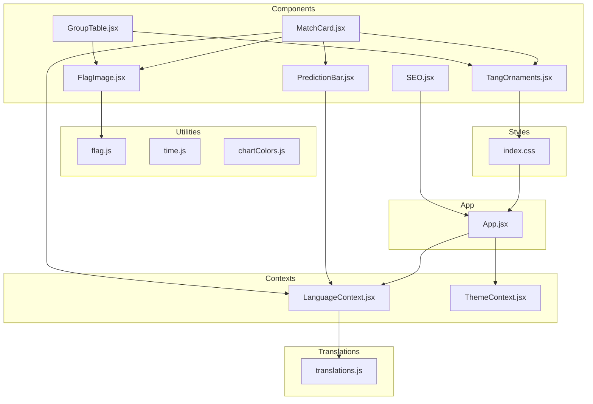
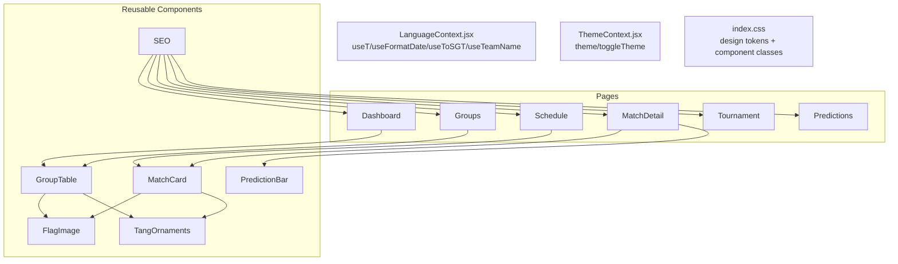
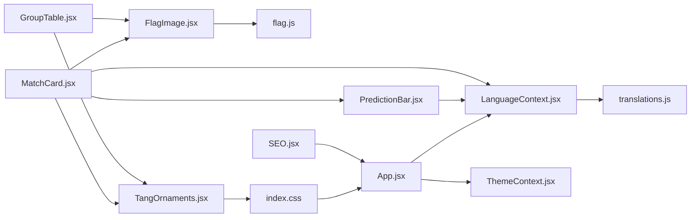

# UI Components

<cite>
**Referenced Files in This Document**
- [FlagImage.jsx](file://frontend/src/components/FlagImage.jsx)
- [GroupTable.jsx](file://frontend/src/components/GroupTable.jsx)
- [MatchCard.jsx](file://frontend/src/components/MatchCard.jsx)
- [PredictionBar.jsx](file://frontend/src/components/PredictionBar.jsx)
- [SEO.jsx](file://frontend/src/components/SEO.jsx)
- [TangOrnaments.jsx](file://frontend/src/components/TangOrnaments.jsx)
- [index.css](file://frontend/src/index.css)
- [LanguageContext.jsx](file://frontend/src/contexts/LanguageContext.jsx)
- [ThemeContext.jsx](file://frontend/src/contexts/ThemeContext.jsx)
- [flag.js](file://frontend/src/utils/flag.js)
- [time.js](file://frontend/src/utils/time.js)
- [chartColors.js](file://frontend/src/utils/chartColors.js)
- [App.jsx](file://frontend/src/App.jsx)
- [translations.js](file://frontend/src/i18n/translations.js)
</cite>

## Table of Contents
1. [Introduction](#introduction)
2. [Project Structure](#project-structure)
3. [Core Components](#core-components)
4. [Architecture Overview](#architecture-overview)
5. [Detailed Component Analysis](#detailed-component-analysis)
6. [Dependency Analysis](#dependency-analysis)
7. [Performance Considerations](#performance-considerations)
8. [Troubleshooting Guide](#troubleshooting-guide)
9. [Conclusion](#conclusion)

## Introduction
This document describes the reusable UI components that compose the application’s front-end. It focuses on six components: FlagImage, GroupTable, MatchCard, PredictionBar, SEO, and TangOrnaments. For each component, we explain props, expected data formats, styling approaches, composition patterns, accessibility features, responsive behavior, and integration with parent components. We also outline how these components participate in the overall UI architecture and maintain design system consistency.

## Project Structure
The UI components live under frontend/src/components and integrate with shared utilities, contexts, and global styles. The design system is primarily defined via Tailwind utility classes and custom CSS variables in index.css, while language and theme contexts provide runtime behavior.

**Diagram sources**
- [FlagImage.jsx:1-31](file://frontend/src/components/FlagImage.jsx#L1-L31)
- [GroupTable.jsx:1-78](file://frontend/src/components/GroupTable.jsx#L1-L78)
- [MatchCard.jsx:1-175](file://frontend/src/components/MatchCard.jsx#L1-L175)
- [PredictionBar.jsx:1-51](file://frontend/src/components/PredictionBar.jsx#L1-L51)
- [SEO.jsx:1-50](file://frontend/src/components/SEO.jsx#L1-L50)
- [TangOrnaments.jsx:1-230](file://frontend/src/components/TangOrnaments.jsx#L1-L230)
- [flag.js:1-18](file://frontend/src/utils/flag.js#L1-L18)
- [time.js:1-51](file://frontend/src/utils/time.js#L1-L51)
- [chartColors.js:1-11](file://frontend/src/utils/chartColors.js#L1-L11)
- [LanguageContext.jsx:1-69](file://frontend/src/contexts/LanguageContext.jsx#L1-L69)
- [ThemeContext.jsx:1-27](file://frontend/src/contexts/ThemeContext.jsx#L1-L27)
- [index.css:1-785](file://frontend/src/index.css#L1-L785)
- [App.jsx:1-284](file://frontend/src/App.jsx#L1-L284)
- [translations.js:1-630](file://frontend/src/i18n/translations.js#L1-L630)

**Section sources**
- [App.jsx:247-283](file://frontend/src/App.jsx#L247-L283)
- [index.css:114-386](file://frontend/src/index.css#L114-L386)

## Core Components
This section summarizes each component’s purpose, props, and integration points.

- FlagImage: Renders a lazy-loaded national team flag image with responsive sizing and fallback handling.
- GroupTable: Displays a tournament group standings table with flags, team names, and ranking indicators.
- MatchCard: Presents a single match with teams, scores, prediction percentages, and optional prediction bar.
- PredictionBar: Visualizes three-way prediction probabilities with labels and gradients.
- SEO: Injects meta tags and JSON-LD for search engine optimization and social sharing.
- TangOrnaments: Provides decorative SVG elements (watermarks, lanterns, pine branches) styled with the design system.

**Section sources**
- [FlagImage.jsx:16-30](file://frontend/src/components/FlagImage.jsx#L16-L30)
- [GroupTable.jsx:7-77](file://frontend/src/components/GroupTable.jsx#L7-L77)
- [MatchCard.jsx:21-174](file://frontend/src/components/MatchCard.jsx#L21-L174)
- [PredictionBar.jsx:3-50](file://frontend/src/components/PredictionBar.jsx#L3-L50)
- [SEO.jsx:18-49](file://frontend/src/components/SEO.jsx#L18-L49)
- [TangOrnaments.jsx:37-229](file://frontend/src/components/TangOrnaments.jsx#L37-L229)

## Architecture Overview
The components are organized around a cohesive design system:
- Design tokens and component classes are defined in index.css, enabling consistent spacing, typography, colors, and card styles.
- Language and theme contexts provide runtime localization and appearance switching.
- Utility modules encapsulate domain logic (flags, dates, colors).
- Parent components compose child components to build pages and views.

**Diagram sources**
- [LanguageContext.jsx:28-68](file://frontend/src/contexts/LanguageContext.jsx#L28-L68)
- [ThemeContext.jsx:5-26](file://frontend/src/contexts/ThemeContext.jsx#L5-L26)
- [index.css:114-386](file://frontend/src/index.css#L114-L386)
- [MatchCard.jsx:1-175](file://frontend/src/components/MatchCard.jsx#L1-L175)
- [GroupTable.jsx:1-78](file://frontend/src/components/GroupTable.jsx#L1-L78)
- [PredictionBar.jsx:1-51](file://frontend/src/components/PredictionBar.jsx#L1-L51)
- [FlagImage.jsx:1-31](file://frontend/src/components/FlagImage.jsx#L1-L31)
- [SEO.jsx:1-50](file://frontend/src/components/SEO.jsx#L1-L50)
- [TangOrnaments.jsx:1-230](file://frontend/src/components/TangOrnaments.jsx#L1-L230)

## Detailed Component Analysis

### FlagImage
Purpose:
- Render a lazy-loaded national team flag image with responsive sizing and graceful fallback.

Props:
- teamId: string (required) — 3-letter team code mapped to ISO alpha-2 country code.
- className: string (optional) — Additional Tailwind classes to customize layout.
- alt: string (optional) — Alt text; defaults to teamId if omitted.
- size: 'xs' | 'sm' | 'md' | 'lg' | 'xl' | 'hero' (optional) — Controls width classes and pixel dimension.

Expected data formats:
- teamId must be present in the ISO mapping; otherwise the component returns null.
- Image URL constructed from flagcdn.com using the computed ISO code and pixel width.

Styling and responsiveness:
- Uses aspect ratio and rounded corners for consistent visuals.
- Applies ring and shadow for depth.
- Size mapping defines Tailwind width classes and pixel dimensions.

Accessibility:
- Provides alt text for screen readers.
- Lazy loading reduces initial payload.

Integration:
- Used within MatchCard and GroupTable to display team flags.

Usage example (paths):
- [MatchCard.jsx](file://frontend/src/components/MatchCard.jsx#L84)
- [GroupTable.jsx](file://frontend/src/components/GroupTable.jsx#L45)

**Section sources**
- [FlagImage.jsx:16-30](file://frontend/src/components/FlagImage.jsx#L16-L30)
- [flag.js:13-17](file://frontend/src/utils/flag.js#L13-L17)

### GroupTable
Purpose:
- Display a tournament group standings table with flags, team names, and ranking indicators.

Props:
- group: string (required) — Group identifier (e.g., "A").
- teams: array (required) — Team entries with gs_* fields for stats.

Expected data formats:
- Each team object includes id, name, and statistics fields (gs_played, gs_won, gs_drawn, gs_lost, gs_gf, gs_ga, gs_pts).

Composition:
- Uses FlagImage for flags.
- Uses TangOrnaments (BatCluster) as decorative watermark.
- Uses LanguageContext for localized headers and labels.

Responsive behavior:
- Horizontal scrolling enabled for small screens.
- Table widths adapt to content and viewport.

Accessibility:
- Semantic table markup with headers.
- Hover and focus states for interactive rows.

Usage example (paths):
- [GroupTable.jsx:7-77](file://frontend/src/components/GroupTable.jsx#L7-L77)

**Section sources**
- [GroupTable.jsx:7-77](file://frontend/src/components/GroupTable.jsx#L7-L77)
- [TangOrnaments.jsx:180-219](file://frontend/src/components/TangOrnaments.jsx#L180-L219)
- [LanguageContext.jsx:28-68](file://frontend/src/contexts/LanguageContext.jsx#L28-L68)

### MatchCard
Purpose:
- Present a single match with teams, scores, prediction percentages, and optional prediction bar.

Props:
- match: object (required) — Contains match metadata and predictions.
- showPrediction: boolean (default true) — Whether to render PredictionBar.

Expected data formats:
- match includes status, scheduled_date/time, group_code/stage, home_team/away_team, home_name/away_name, prob_home/draw/away, most_likely_score, insight, and confidence.

Composition:
- Uses FlagImage for team flags.
- Uses PredictionBar for probability visualization.
- Uses TangOrnaments (QilinMark) as decorative watermark.
- Uses LanguageContext for localized labels and date/time formatting.

Behavior:
- Calculates outcome leads based on predicted probabilities or actual score.
- Conditional rendering for completed vs. upcoming matches.
- Click navigation to team detail pages.

Accessibility:
- Proper heading order and link semantics.
- Hover and focus states for interactive elements.

Usage example (paths):
- [MatchCard.jsx:21-174](file://frontend/src/components/MatchCard.jsx#L21-L174)

**Section sources**
- [MatchCard.jsx:21-174](file://frontend/src/components/MatchCard.jsx#L21-L174)
- [PredictionBar.jsx:3-50](file://frontend/src/components/PredictionBar.jsx#L3-L50)
- [TangOrnaments.jsx:144-177](file://frontend/src/components/TangOrnaments.jsx#L144-L177)
- [LanguageContext.jsx:28-68](file://frontend/src/contexts/LanguageContext.jsx#L28-L68)

### PredictionBar
Purpose:
- Visualize three-way prediction probabilities (home, draw, away) with gradient segments and labels.

Props:
- probHome: number (0..1) — Home win probability.
- probDraw: number (0..1) — Draw probability.
- probAway: number (0..1) — Away win probability.
- homeName: string — Home team name.
- awayName: string — Away team name.
- size: 'md' | 'lg' (default 'md') — Bar thickness and label size.
- isKnockout: boolean (default false) — Changes middle label to “Extra Time / Pens”.

Expected data formats:
- Probabilities should sum approximately to 1.

Styling:
- Gradient segments for terracotta and amber palettes.
- Center label positioned by weighted percentage.
- Responsive sizing via size prop.

Accessibility:
- Labels include both team names and numeric percentages for screen readers.

Usage example (paths):
- [MatchCard.jsx:156-164](file://frontend/src/components/MatchCard.jsx#L156-L164)

**Section sources**
- [PredictionBar.jsx:3-50](file://frontend/src/components/PredictionBar.jsx#L3-L50)

### SEO
Purpose:
- Inject canonical URL, Open Graph, Twitter, and JSON-LD metadata for SEO and social sharing.

Props:
- title: string (optional) — Page title.
- description: string (optional) — Page description.
- path: string (default '') — Relative path appended to site URL.
- image: string (optional) — OG image URL.
- jsonLd: object|array (optional) — Additional JSON-LD objects.

Environment:
- Uses VITE_SITE_URL and VITE_GSC_VERIFICATION from environment variables.

Usage example (paths):
- [SEO.jsx:18-49](file://frontend/src/components/SEO.jsx#L18-L49)

**Section sources**
- [SEO.jsx:18-49](file://frontend/src/components/SEO.jsx#L18-L49)

### TangOrnaments
Purpose:
- Provide decorative SVG elements inspired by Chinese landscape painting motifs.

Exports:
- DragonWatermark, PhoenixWatermark, QilinMark, BatCluster, DragonPhoenixPair.

Props (shared pattern):
- className: string (optional) — Additional Tailwind classes.
- opacity: number (default 0.28/0.24/0.22) — Opacity level.
- size: number (default 280/260/48/64) — Width/height in pixels.

Styling:
- Uses gradient defs scoped to component id to avoid collisions.
- Positioned absolutely with pointer-events disabled for non-interactive overlays.

Usage example (paths):
- [GroupTable.jsx](file://frontend/src/components/GroupTable.jsx#L12)
- [MatchCard.jsx](file://frontend/src/components/MatchCard.jsx#L50)

**Section sources**
- [TangOrnaments.jsx:37-229](file://frontend/src/components/TangOrnaments.jsx#L37-L229)

## Dependency Analysis
This section maps how components depend on utilities, contexts, and styles.

**Diagram sources**
- [FlagImage.jsx:1-31](file://frontend/src/components/FlagImage.jsx#L1-L31)
- [GroupTable.jsx:1-78](file://frontend/src/components/GroupTable.jsx#L1-L78)
- [MatchCard.jsx:1-175](file://frontend/src/components/MatchCard.jsx#L1-L175)
- [PredictionBar.jsx:1-51](file://frontend/src/components/PredictionBar.jsx#L1-L51)
- [SEO.jsx:1-50](file://frontend/src/components/SEO.jsx#L1-L50)
- [TangOrnaments.jsx:1-230](file://frontend/src/components/TangOrnaments.jsx#L1-L230)
- [flag.js:1-18](file://frontend/src/utils/flag.js#L1-L18)
- [LanguageContext.jsx:1-69](file://frontend/src/contexts/LanguageContext.jsx#L1-L69)
- [ThemeContext.jsx:1-27](file://frontend/src/contexts/ThemeContext.jsx#L1-L27)
- [index.css:1-785](file://frontend/src/index.css#L1-L785)
- [App.jsx:1-284](file://frontend/src/App.jsx#L1-L284)
- [translations.js:1-630](file://frontend/src/i18n/translations.js#L1-L630)

**Section sources**
- [index.css:114-386](file://frontend/src/index.css#L114-L386)
- [LanguageContext.jsx:28-68](file://frontend/src/contexts/LanguageContext.jsx#L28-L68)
- [ThemeContext.jsx:5-26](file://frontend/src/contexts/ThemeContext.jsx#L5-L26)

## Performance Considerations
- Lazy loading images: FlagImage uses native lazy loading to defer offscreen flag images.
- Minimal reflows: PredictionBar computes widths via percentages; gradients are static.
- CSS utilities: Tailwind classes minimize inline styles and reduce DOM thrashing.
- Decorative SVGs: TangOrnaments are rendered once per page and use opacity for subtlety.
- Context memoization: useT/useFormatDate/useToSGT are derived from language state; keep renders minimal by avoiding unnecessary recomputation.

## Troubleshooting Guide
Common issues and resolutions:
- Missing flag image:
  - Cause: teamId not present in ISO mapping.
  - Resolution: Verify teamId against known codes; FlagImage returns null when missing.
  - Reference: [flag.js:13-17](file://frontend/src/utils/flag.js#L13-L17), [FlagImage.jsx:16-19](file://frontend/src/components/FlagImage.jsx#L16-L19)
- Broken alt text:
  - Cause: alt not provided.
  - Resolution: Pass alt prop or rely on default fallback to teamId.
  - Reference: [FlagImage.jsx](file://frontend/src/components/FlagImage.jsx#L24)
- Incorrect date/time display:
  - Cause: locale mismatch or missing time.
  - Resolution: Confirm useToSGT/useFormatDate bindings and presence of time field.
  - References: [time.js:23-29](file://frontend/src/utils/time.js#L23-L29), [LanguageContext.jsx:48-52](file://frontend/src/contexts/LanguageContext.jsx#L48-L52)
- SEO metadata not appearing:
  - Cause: missing VITE_SITE_URL or incorrect path.
  - Resolution: Set environment variables and ensure SEO is included in page layout.
  - Reference: [SEO.jsx:3-22](file://frontend/src/components/SEO.jsx#L3-L22)
- Ornament overlap or visibility:
  - Cause: z-index or opacity conflicts.
  - Resolution: Adjust opacity and className; ensure parent container allows absolute positioning.
  - Reference: [TangOrnaments.jsx:37-84](file://frontend/src/components/TangOrnaments.jsx#L37-L84), [index.css:233-246](file://frontend/src/index.css#L233-L246)

**Section sources**
- [flag.js:13-17](file://frontend/src/utils/flag.js#L13-L17)
- [FlagImage.jsx:16-29](file://frontend/src/components/FlagImage.jsx#L16-L29)
- [time.js:23-29](file://frontend/src/utils/time.js#L23-L29)
- [LanguageContext.jsx:48-52](file://frontend/src/contexts/LanguageContext.jsx#L48-L52)
- [SEO.jsx:3-22](file://frontend/src/components/SEO.jsx#L3-L22)
- [TangOrnaments.jsx:37-84](file://frontend/src/components/TangOrnaments.jsx#L37-L84)
- [index.css:233-246](file://frontend/src/index.css#L233-L246)

## Conclusion
These reusable UI components form a cohesive design system that balances visual richness with performance and accessibility. They leverage shared utilities, contexts, and Tailwind-based styles to ensure consistency across pages. By following the documented props, data formats, and composition patterns, developers can integrate these components reliably while maintaining design system alignment.