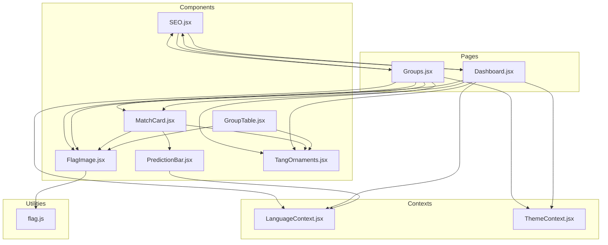
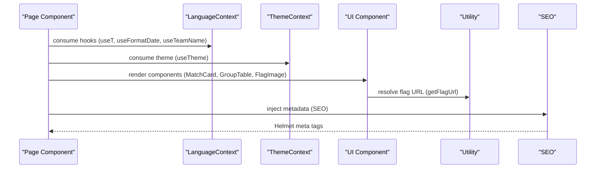
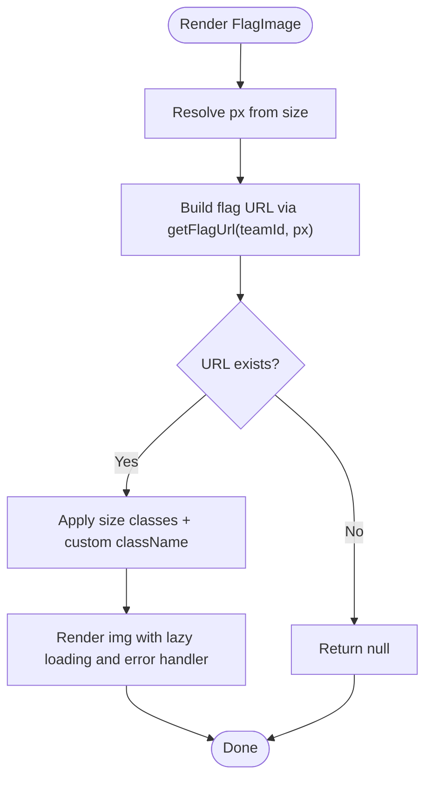
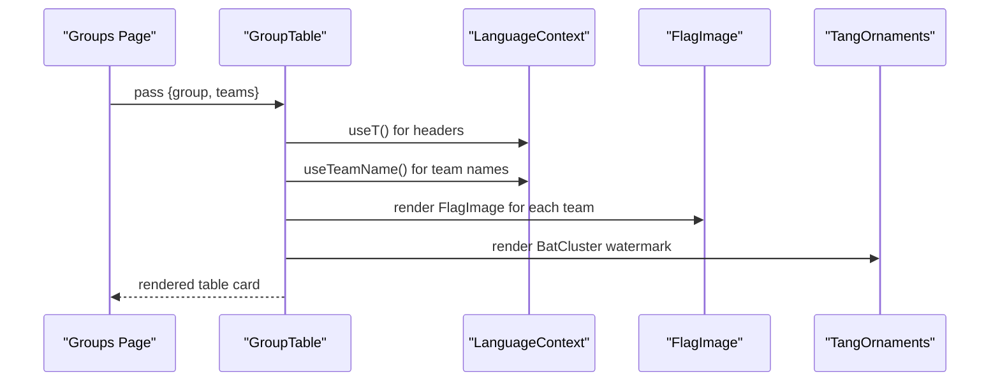
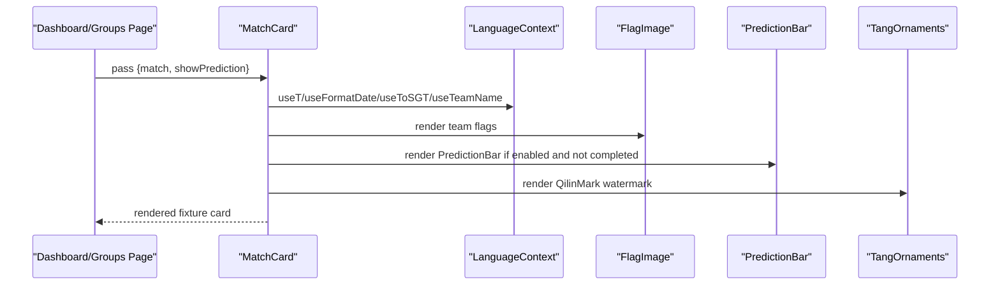
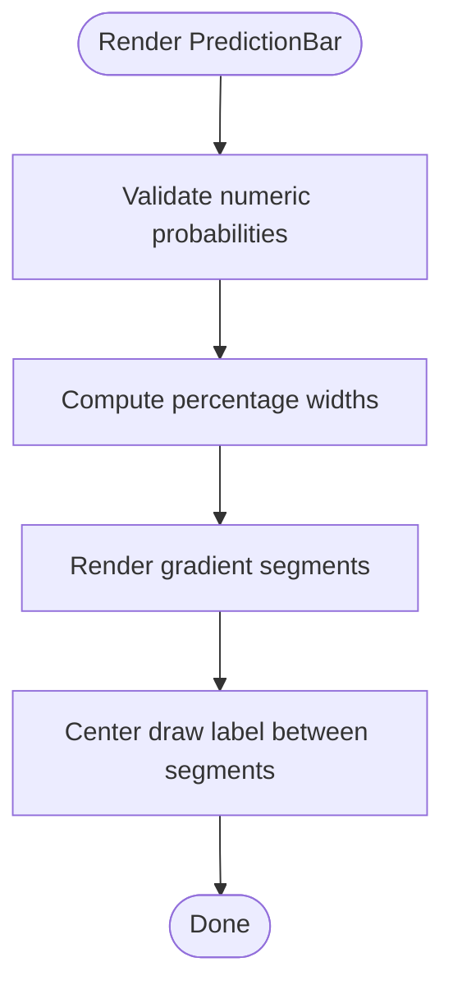
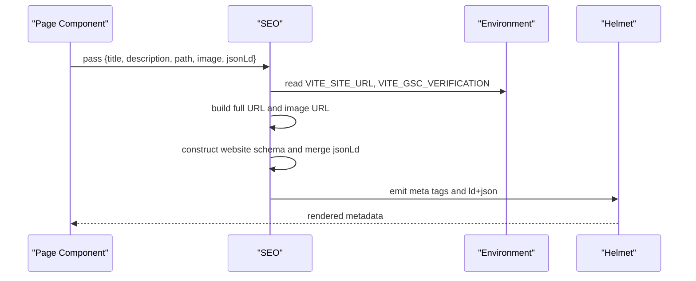
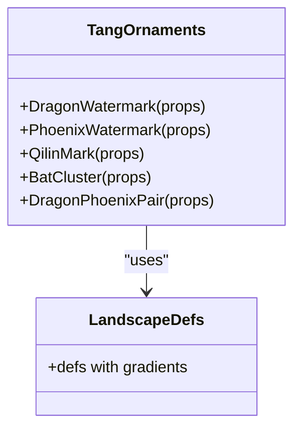
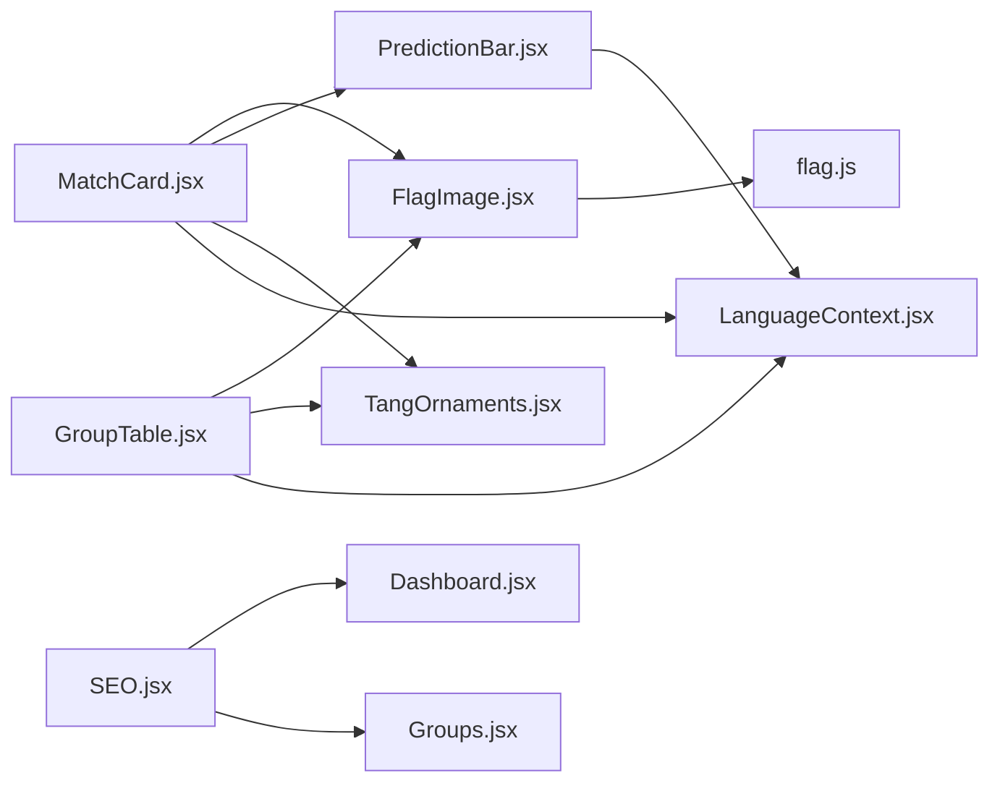

# UI Components

<cite>
**Referenced Files in This Document**
- [FlagImage.jsx](file://frontend/src/components/FlagImage.jsx)
- [GroupTable.jsx](file://frontend/src/components/GroupTable.jsx)
- [MatchCard.jsx](file://frontend/src/components/MatchCard.jsx)
- [PredictionBar.jsx](file://frontend/src/components/PredictionBar.jsx)
- [SEO.jsx](file://frontend/src/components/SEO.jsx)
- [TangOrnaments.jsx](file://frontend/src/components/TangOrnaments.jsx)
- [flag.js](file://frontend/src/utils/flag.js)
- [LanguageContext.jsx](file://frontend/src/contexts/LanguageContext.jsx)
- [ThemeContext.jsx](file://frontend/src/contexts/ThemeContext.jsx)
- [PredictionBar.test.jsx](file://frontend/src/components/PredictionBar.test.jsx)
- [App.jsx](file://frontend/src/App.jsx)
- [Dashboard.jsx](file://frontend/src/pages/Dashboard.jsx)
- [Groups.jsx](file://frontend/src/pages/Groups.jsx)
</cite>

## Table of Contents
1. [Introduction](#introduction)
2. [Project Structure](#project-structure)
3. [Core Components](#core-components)
4. [Architecture Overview](#architecture-overview)
5. [Detailed Component Analysis](#detailed-component-analysis)
6. [Dependency Analysis](#dependency-analysis)
7. [Performance Considerations](#performance-considerations)
8. [Troubleshooting Guide](#troubleshooting-guide)
9. [Conclusion](#conclusion)
10. [Appendices](#appendices)

## Introduction
This document describes the reusable UI components that provide consistent visual identity and functionality across the application. It focuses on:
- FlagImage: country flag images with fallback handling
- GroupTable: group standings with internationalization and decorative accents
- MatchCard: fixture preview with prediction indicators and status chips
- PredictionBar: probability distribution visualization
- SEO: metadata and social sharing management
- TangOrnaments: decorative Chinese landscape-inspired SVG elements

It explains component props, styling approaches, accessibility features, composition patterns, prop validation, event handling, usage examples, customization options, theme integration, performance considerations, and optimization strategies.

## Project Structure
The UI components are located under frontend/src/components and are composed by page-level components under frontend/src/pages. They integrate with shared contexts for language and theme, and rely on utility functions for flag URLs.

**Diagram sources**
- [FlagImage.jsx:1-31](file://frontend/src/components/FlagImage.jsx#L1-L31)
- [GroupTable.jsx:1-78](file://frontend/src/components/GroupTable.jsx#L1-L78)
- [MatchCard.jsx:1-175](file://frontend/src/components/MatchCard.jsx#L1-L175)
- [PredictionBar.jsx:1-51](file://frontend/src/components/PredictionBar.jsx#L1-L51)
- [SEO.jsx:1-50](file://frontend/src/components/SEO.jsx#L1-L50)
- [TangOrnaments.jsx:1-230](file://frontend/src/components/TangOrnaments.jsx#L1-L230)
- [flag.js:1-18](file://frontend/src/utils/flag.js#L1-L18)
- [LanguageContext.jsx:1-69](file://frontend/src/contexts/LanguageContext.jsx#L1-L69)
- [ThemeContext.jsx:1-27](file://frontend/src/contexts/ThemeContext.jsx#L1-L27)
- [Dashboard.jsx:1-706](file://frontend/src/pages/Dashboard.jsx#L1-L706)
- [Groups.jsx:1-160](file://frontend/src/pages/Groups.jsx#L1-L160)

**Section sources**
- [App.jsx:1-284](file://frontend/src/App.jsx#L1-L284)
- [Dashboard.jsx:1-706](file://frontend/src/pages/Dashboard.jsx#L1-L706)
- [Groups.jsx:1-160](file://frontend/src/pages/Groups.jsx#L1-L160)

## Core Components
- FlagImage: renders a lazy-loaded flag image with aspect ratio, rounded corners, shadow, and fallback handling when the URL is unavailable.
- GroupTable: displays group standings with localized headers, team links, and decorative accents.
- MatchCard: presents a fixture preview with status chips, confidence labels, team flags, scores, predicted outcomes, and a PredictionBar.
- PredictionBar: visualizes home/draw/away probabilities with gradient segments and labels.
- SEO: manages meta tags, Open Graph, Twitter Card, canonical URL, and JSON-LD for search engines and social sharing.
- TangOrnaments: decorative SVG components (watermarks, lanterns, pine marks, bat clusters) with shared gradients and configurable opacity/size.

**Section sources**
- [FlagImage.jsx:1-31](file://frontend/src/components/FlagImage.jsx#L1-L31)
- [GroupTable.jsx:1-78](file://frontend/src/components/GroupTable.jsx#L1-L78)
- [MatchCard.jsx:1-175](file://frontend/src/components/MatchCard.jsx#L1-L175)
- [PredictionBar.jsx:1-51](file://frontend/src/components/PredictionBar.jsx#L1-L51)
- [SEO.jsx:1-50](file://frontend/src/components/SEO.jsx#L1-L50)
- [TangOrnaments.jsx:1-230](file://frontend/src/components/TangOrnaments.jsx#L1-L230)

## Architecture Overview
The components are composed within page layouts that provide language and theme contexts. Decorative ornaments are embedded directly into pages and components to maintain consistent visual branding. SEO is injected at the page level to ensure proper metadata for each route.

**Diagram sources**
- [LanguageContext.jsx:1-69](file://frontend/src/contexts/LanguageContext.jsx#L1-L69)
- [ThemeContext.jsx:1-27](file://frontend/src/contexts/ThemeContext.jsx#L1-L27)
- [FlagImage.jsx:1-31](file://frontend/src/components/FlagImage.jsx#L1-L31)
- [flag.js:1-18](file://frontend/src/utils/flag.js#L1-L18)
- [SEO.jsx:1-50](file://frontend/src/components/SEO.jsx#L1-L50)
- [Dashboard.jsx:1-706](file://frontend/src/pages/Dashboard.jsx#L1-L706)
- [Groups.jsx:1-160](file://frontend/src/pages/Groups.jsx#L1-L160)

## Detailed Component Analysis

### FlagImage
- Purpose: Render a country flag image with consistent sizing, aspect ratio, and fallback behavior.
- Props:
  - teamId: string, required. Used to map to ISO alpha-2 code.
  - className: string, optional. Additional Tailwind classes.
  - alt: string, optional. Image alt text; defaults to teamId if not provided.
  - size: string, optional. Predefined size keys: xs, sm, md, lg, xl, hero.
- Behavior:
  - Resolves URL via getFlagUrl(teamId, px) where px is mapped from size.
  - Returns null if URL cannot be resolved.
  - Uses lazy loading and an error handler to hide broken images.
- Styling:
  - Aspect ratio constrained to 3:2.
  - Rounded corners, soft shadow, and subtle ring.
  - Size classes vary by size key; responsive sizes for xl/hero.
- Accessibility:
  - Provides alt text; falls back to teamId.
  - Lazy loading reduces bandwidth and improves performance.
- Integration:
  - Consumed by MatchCard and GroupTable for team avatars.
- Usage examples:
  - Small host country flags in dashboard hero.
  - Medium team badges in leader cards.
  - Standard team flags in group tables and match cards.

**Diagram sources**
- [FlagImage.jsx:1-31](file://frontend/src/components/FlagImage.jsx#L1-L31)
- [flag.js:1-18](file://frontend/src/utils/flag.js#L1-L18)

**Section sources**
- [FlagImage.jsx:1-31](file://frontend/src/components/FlagImage.jsx#L1-L31)
- [flag.js:1-18](file://frontend/src/utils/flag.js#L1-L18)
- [Dashboard.jsx:246-250](file://frontend/src/pages/Dashboard.jsx#L246-L250)
- [Groups.jsx:142-144](file://frontend/src/pages/Groups.jsx#L142-L144)

### GroupTable
- Purpose: Display group standings with localized headers, team links, and decorative accents.
- Props:
  - group: string, required. Group letter identifier.
  - teams: array of team objects, required. Each team includes id, name, and stats.
- Behavior:
  - Renders a table with localized column headers.
  - Highlights top two teams with gold accents and badges.
  - Links to team detail pages.
  - Uses FlagImage for team flags.
  - Integrates decorative BatCluster watermark.
- Styling:
  - Tang-themed card container with gradient header.
  - Hover effects and borders for rows.
  - Gold accents for top two positions.
- Internationalization:
  - Uses useT and useTeamName for localized headers and team names.
- Accessibility:
  - Semantic table structure with headers.
  - Interactive links with keyboard focus styles.
- Usage examples:
  - Active group table in Groups page.
  - Mini overview cards linking to full tables.

**Diagram sources**
- [GroupTable.jsx:1-78](file://frontend/src/components/GroupTable.jsx#L1-L78)
- [LanguageContext.jsx:1-69](file://frontend/src/contexts/LanguageContext.jsx#L1-L69)
- [TangOrnaments.jsx:180-219](file://frontend/src/components/TangOrnaments.jsx#L180-L219)

**Section sources**
- [GroupTable.jsx:1-78](file://frontend/src/components/GroupTable.jsx#L1-L78)
- [Groups.jsx:99-111](file://frontend/src/pages/Groups.jsx#L99-L111)

### MatchCard
- Purpose: Present a fixture preview with status, confidence, team flags, scores, and prediction visualization.
- Props:
  - match: object, required. Fixture data including status, scheduled date/time, scores, probabilities, and metadata.
  - showPrediction: boolean, optional, default true. Controls whether PredictionBar is shown.
- Behavior:
  - Status chip and confidence chip derived from match data.
  - Renders most likely score and actual score depending on completion.
  - Calculates lead indicators for home/away based on prediction or outcome.
  - Clickable team names navigate to team detail pages.
  - Integrates decorative QilinMark watermark.
- Styling:
  - Tang-themed card with hover elevation and gradient accents.
  - Rainbow top accent and decorative watermark.
  - Responsive typography and spacing.
- Internationalization:
  - Uses useT, useFormatDate, useToSGT, useTeamName for localized labels and dates.
- Accessibility:
  - Semantic link structure; interactive elements styled for focus.
- Composition:
  - Uses FlagImage for team flags.
  - Uses PredictionBar for probability visualization.
  - Uses TangOrnaments for decorative accents.

**Diagram sources**
- [MatchCard.jsx:1-175](file://frontend/src/components/MatchCard.jsx#L1-L175)
- [LanguageContext.jsx:1-69](file://frontend/src/contexts/LanguageContext.jsx#L1-L69)
- [PredictionBar.jsx:1-51](file://frontend/src/components/PredictionBar.jsx#L1-L51)
- [TangOrnaments.jsx:144-177](file://frontend/src/components/TangOrnaments.jsx#L144-L177)

**Section sources**
- [MatchCard.jsx:1-175](file://frontend/src/components/MatchCard.jsx#L1-L175)
- [Dashboard.jsx:497-498](file://frontend/src/pages/Dashboard.jsx#L497-L498)
- [Groups.jsx:109-110](file://frontend/src/pages/Groups.jsx#L109-L110)

### PredictionBar
- Purpose: Visualize home/draw/away probabilities as a segmented horizontal bar with labels.
- Props:
  - probHome: number, required. Home win probability (0–1).
  - probDraw: number, required. Draw probability (0–1).
  - probAway: number, required. Away win probability (0–1).
  - homeName: string, required. Home team name.
  - awayName: string, required. Away team name.
  - size: string, optional. 'md' or 'lg'. Controls bar thickness and label size.
  - isKnockout: boolean, optional. Changes draw label to “Extra Time” for knockout stages.
- Behavior:
  - Computes percentage widths from input probabilities.
  - Renders three gradient segments: home, draw, away.
  - Centers draw label between home and away bars.
- Styling:
  - Rounded segment edges with gap-based spacing.
  - Gradient color scheme aligned with team identities.
- Internationalization:
  - Uses useT for localized labels (draw vs extra time).
- Accessibility:
  - Clear labels with sufficient contrast and readable sizes.
- Testing:
  - Verified rendering of names, percentages, and large size variant.

**Diagram sources**
- [PredictionBar.jsx:1-51](file://frontend/src/components/PredictionBar.jsx#L1-L51)
- [LanguageContext.jsx:1-69](file://frontend/src/contexts/LanguageContext.jsx#L1-L69)

**Section sources**
- [PredictionBar.jsx:1-51](file://frontend/src/components/PredictionBar.jsx#L1-L51)
- [PredictionBar.test.jsx:1-32](file://frontend/src/components/PredictionBar.test.jsx#L1-L32)

### SEO
- Purpose: Manage page metadata for SEO and social sharing, including canonical URL, Open Graph, Twitter Card, and JSON-LD.
- Props:
  - title: string, optional. Overrides default site title.
  - description: string, optional. Overrides default description.
  - path: string, optional. Path appended to base site URL for canonical and OG URL.
  - image: string, optional. OG image URL; defaults to og-image.png.
  - jsonLd: object or array, optional. Additional structured data entries.
- Behavior:
  - Constructs full URL from base site URL and path.
  - Generates website schema and merges with provided jsonLd.
  - Emits Helmet tags for title, description, canonical, OG, Twitter, and ld+json.
- Environment:
  - Reads site URL and Google Search Console verification token from environment variables.
- Usage examples:
  - Injected in Dashboard and Groups pages with page-specific titles and descriptions.

**Diagram sources**
- [SEO.jsx:1-50](file://frontend/src/components/SEO.jsx#L1-L50)

**Section sources**
- [SEO.jsx:1-50](file://frontend/src/components/SEO.jsx#L1-L50)
- [Dashboard.jsx:167-183](file://frontend/src/pages/Dashboard.jsx#L167-L183)
- [Groups.jsx:43-47](file://frontend/src/pages/Groups.jsx#L43-L47)

### TangOrnaments
- Purpose: Provide decorative Chinese landscape-inspired SVG elements for visual branding.
- Components:
  - DragonWatermark: layered mountain silhouettes with mist and water elements.
  - PhoenixWatermark: traditional junk boat with sails and ripples.
  - QilinMark: pine branch accent for card corners.
  - BatCluster: three lanterns with strings and tassels.
  - DragonPhoenixPair: combined DragonWatermark and PhoenixWatermark.
- Props:
  - className: string, optional. Additional positioning classes.
  - opacity: number, optional. Opacity value.
  - size: number, optional. Width/height dimension.
- Behavior:
  - Uses shared linear gradients (amber, terracotta, sunrise, pine, sky) defined once per component.
  - Absolute positioning with pointer-events disabled to avoid interfering with interactions.
- Styling:
  - Consistent color palette and stroke weights across components.
  - Configurable opacity and size for responsive integration.

**Diagram sources**
- [TangOrnaments.jsx:1-230](file://frontend/src/components/TangOrnaments.jsx#L1-L230)

**Section sources**
- [TangOrnaments.jsx:1-230](file://frontend/src/components/TangOrnaments.jsx#L1-L230)
- [Dashboard.jsx:193-193](file://frontend/src/pages/Dashboard.jsx#L193-L193)
- [Groups.jsx:58-58](file://frontend/src/pages/Groups.jsx#L58-L58)

## Dependency Analysis
- FlagImage depends on flag.js for URL resolution and is consumed by MatchCard and GroupTable.
- MatchCard composes FlagImage, PredictionBar, and TangOrnaments; it also consumes LanguageContext for localization.
- GroupTable composes FlagImage and TangOrnaments and consumes LanguageContext for headers and team names.
- PredictionBar consumes LanguageContext for localized labels.
- SEO is used at the page level to inject metadata.
- All components integrate with ThemeContext indirectly via global theme classes applied by the app shell.

**Diagram sources**
- [FlagImage.jsx:1-31](file://frontend/src/components/FlagImage.jsx#L1-L31)
- [flag.js:1-18](file://frontend/src/utils/flag.js#L1-L18)
- [MatchCard.jsx:1-175](file://frontend/src/components/MatchCard.jsx#L1-L175)
- [PredictionBar.jsx:1-51](file://frontend/src/components/PredictionBar.jsx#L1-L51)
- [GroupTable.jsx:1-78](file://frontend/src/components/GroupTable.jsx#L1-L78)
- [TangOrnaments.jsx:1-230](file://frontend/src/components/TangOrnaments.jsx#L1-L230)
- [LanguageContext.jsx:1-69](file://frontend/src/contexts/LanguageContext.jsx#L1-L69)
- [SEO.jsx:1-50](file://frontend/src/components/SEO.jsx#L1-L50)
- [Dashboard.jsx:1-706](file://frontend/src/pages/Dashboard.jsx#L1-L706)
- [Groups.jsx:1-160](file://frontend/src/pages/Groups.jsx#L1-L160)

**Section sources**
- [App.jsx:1-284](file://frontend/src/App.jsx#L1-L284)
- [LanguageContext.jsx:1-69](file://frontend/src/contexts/LanguageContext.jsx#L1-L69)
- [ThemeContext.jsx:1-27](file://frontend/src/contexts/ThemeContext.jsx#L1-L27)

## Performance Considerations
- Lazy loading: FlagImage uses lazy loading to defer image fetching until near viewport, reducing initial payload.
- Error handling: FlagImage hides broken images on error to prevent layout shifts and improve perceived performance.
- Minimal re-renders: Components are stateless and rely on props; keep data normalized and memoized at higher levels.
- Conditional rendering: PredictionBar is only rendered when predictions are available and the match is not completed.
- CSS-in-JS gradients: TangOrnaments define gradients once and reuse them; avoid duplicating gradient definitions elsewhere.
- Memoization patterns: For frequently used components, consider React.memo or useMemo around expensive computations (e.g., team name translation) in parent components.
- Rendering optimization: Use virtualization for long lists of MatchCards or GroupTable rows if data scales significantly.

[No sources needed since this section provides general guidance]

## Troubleshooting Guide
- Flag not appearing:
  - Verify teamId exists in the flag mapping; otherwise getFlagUrl returns null.
  - Confirm network connectivity and image URL validity.
  - Check browser console for image load errors.
- Broken image fallback:
  - FlagImage hides the image on error; ensure alt text is meaningful.
- Incorrect localization:
  - Ensure LanguageContext is provided at the root and language toggled appropriately.
  - Confirm translation keys exist for the selected language.
- SEO metadata missing:
  - Verify environment variables for site URL and Google verification token.
  - Ensure SEO is included in the page that requires metadata.
- PredictionBar misalignment:
  - Ensure probabilities sum to approximately 1; slight rounding differences are acceptable.
  - Confirm size prop is either 'md' or 'lg'.

**Section sources**
- [FlagImage.jsx:1-31](file://frontend/src/components/FlagImage.jsx#L1-L31)
- [flag.js:1-18](file://frontend/src/utils/flag.js#L1-L18)
- [LanguageContext.jsx:1-69](file://frontend/src/contexts/LanguageContext.jsx#L1-L69)
- [SEO.jsx:1-50](file://frontend/src/components/SEO.jsx#L1-L50)

## Conclusion
These UI components establish a cohesive, accessible, and performant interface for the tournament application. They leverage shared utilities, contexts, and decorative assets to deliver consistent visuals and internationalization. By following the documented composition patterns, prop validation, and optimization strategies, developers can extend and customize the components while maintaining quality and performance.

[No sources needed since this section summarizes without analyzing specific files]

## Appendices

### Component Prop Reference Summary
- FlagImage
  - teamId: string
  - className: string
  - alt: string
  - size: 'xs' | 'sm' | 'md' | 'lg' | 'xl' | 'hero'
- GroupTable
  - group: string
  - teams: array of team objects
- MatchCard
  - match: fixture object
  - showPrediction: boolean
- PredictionBar
  - probHome: number
  - probDraw: number
  - probAway: number
  - homeName: string
  - awayName: string
  - size: 'md' | 'lg'
  - isKnockout: boolean
- SEO
  - title: string
  - description: string
  - path: string
  - image: string
  - jsonLd: object | array
- TangOrnaments
  - className: string
  - opacity: number
  - size: number

[No sources needed since this section provides a summary]