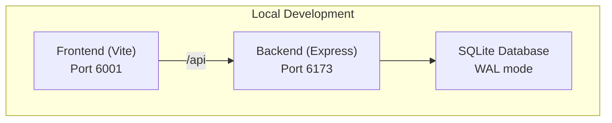

# Getting Started

<cite>
**Referenced Files in This Document**
- [README.md](file://README.md)
- [SETUP.md](file://SETUP.md)
- [start.sh](file://start.sh)
- [backend/.env.example](file://backend/.env.example)
- [backend/package.json](file://backend/package.json)
- [backend/server.js](file://backend/server.js)
- [backend/database/db.js](file://backend/database/db.js)
- [backend/database/seed.js](file://backend/database/seed.js)
- [frontend/package.json](file://frontend/package.json)
- [frontend/vite.config.js](file://frontend/vite.config.js)
- [frontend/src/api/client.js](file://frontend/src/api/client.js)
- [frontend/Dockerfile](file://frontend/Dockerfile)
- [backend/Dockerfile](file://backend/Dockerfile)
- [docker-compose.yml](file://docker-compose.yml)
</cite>

## Table of Contents
1. [Introduction](#introduction)
2. [Prerequisites](#prerequisites)
3. [Quick Start](#quick-start)
4. [Manual Setup](#manual-setup)
5. [Environment Variables](#environment-variables)
6. [Database Seeding](#database-seeding)
7. [Local Development Servers](#local-development-servers)
8. [Port Configuration](#port-configuration)
9. [CORS Settings](#cors-settings)
10. [Obtaining API Keys](#obtaining-api-keys)
11. [Troubleshooting](#troubleshooting)
12. [Architecture Overview](#architecture-overview)
13. [Conclusion](#conclusion)

## Introduction
This guide helps you set up WC26-Qwen-Qoder quickly and reliably. It covers prerequisites, installation, environment configuration, database seeding, and running the development servers. You will learn how to use the convenience start script and how to start the backend and frontend manually. It also explains port configuration, CORS settings, and how to obtain required API keys from DashScope and optionally football-data.org.

## Prerequisites
Ensure you have the following installed on your machine:
- Node.js (version managed by the project; see package.json scripts)
- Docker (for containerized deployment and development)
- Git (for cloning and deploying)

These tools are sufficient to run the application locally and in containers.

**Section sources**
- [backend/package.json:6-12](file://backend/package.json#L6-L12)
- [frontend/package.json:6-14](file://frontend/package.json#L6-L14)
- [docker-compose.yml:1-34](file://docker-compose.yml#L1-L34)

## Quick Start
The fastest way to start everything locally is to run the provided script. It installs dependencies (if needed), seeds the database (if needed), and launches both the backend and frontend servers.

- Run the start script from the repository root:
  ```bash
  bash start.sh
  ```
- After both servers are ready, open the frontend in your browser:
  - Frontend: http://localhost:6001
  - Backend API: http://localhost:6173

The script waits for both services to be responsive before reporting readiness.

**Section sources**
- [SETUP.md:3-16](file://SETUP.md#L3-L16)
- [README.md:114-137](file://README.md#L114-L137)
- [start.sh:1-74](file://start.sh#L1-L74)

## Manual Setup
If you prefer manual control, follow these steps to set up the backend and frontend independently.

### Backend
- Navigate to the backend directory and install dependencies:
  ```bash
  cd backend && npm install
  ```
- Create and edit the environment file:
  - Copy the example file to .env
  - Add your API keys and adjust settings as needed
  - Reference: [backend/.env.example](file://backend/.env.example)
- Seed the database (run once):
  ```bash
  node database/seed.js
  ```
- Start the backend server:
  - Development mode (auto-restart on changes):
    ```bash
    npm run dev
    ```
  - Production mode:
    ```bash
    npm start
    ```

**Section sources**
- [SETUP.md:20-40](file://SETUP.md#L20-L40)
- [backend/package.json:6-12](file://backend/package.json#L6-L12)
- [backend/database/seed.js:1-69](file://backend/database/seed.js#L1-L69)
- [backend/server.js:19-22](file://backend/server.js#L19-L22)

### Frontend
- Navigate to the frontend directory and install dependencies:
  ```bash
  cd frontend && npm install
  ```
- Start the frontend development server:
  ```bash
  npm run dev
  ```
- The frontend runs on port 6001 and proxies API requests to the backend at http://localhost:6173.

**Section sources**
- [SETUP.md:42-49](file://SETUP.md#L42-L49)
- [frontend/package.json:6-14](file://frontend/package.json#L6-L14)
- [frontend/vite.config.js:11-19](file://frontend/vite.config.js#L11-L19)

## Environment Variables
Configure your environment by copying the example file and adding your keys. The backend reads variables from backend/.env.

Key variables:
- DASHSCOPE_API_KEY: Required for Qwen LLM calls (insights, intel parsing, multi-agent). Obtain from DashScope.
- FOOTBALL_DATA_API_KEY: Optional. Enables live scores and form data (free tier rate-limited).
- USE_MULTI_AGENT: Set to true to enable the 5-agent Qwen prediction system.
- FRONTEND_URL: CORS origin for the API (default: http://localhost:6001).
- PORT: Backend port (default: 6173).

Notes:
- Without a DashScope key, the prediction engine falls back to template-generated insights.
- Without a football-data.org key, the app uses FIFA ratings and ELO-based synthetic form data.

**Section sources**
- [backend/.env.example:1-17](file://backend/.env.example#L1-L17)
- [README.md:139-151](file://README.md#L139-L151)
- [SETUP.md:53-63](file://SETUP.md#L53-L63)

## Database Seeding
The database is seeded with teams and group stage fixtures. The seed script checks if the database is already seeded and skips if data exists.

- Run the seed script:
  ```bash
  node database/seed.js
  ```
- The script inserts team data and fixtures, then exits.

You can re-seed at any time by running the script again. The backend also seeds knockout match stubs on startup to avoid race conditions.

**Section sources**
- [backend/database/seed.js:1-69](file://backend/database/seed.js#L1-L69)
- [backend/server.js:640-642](file://backend/server.js#L640-L642)
- [backend/database/db.js:23-249](file://backend/database/db.js#L23-L249)

## Local Development Servers
There are two ways to run the development servers locally.

### Using the Start Script
- The script installs dependencies (if missing), creates .env if absent, seeds the database (if empty), and starts both servers in parallel.
- It waits for the backend and frontend to respond before reporting readiness.

**Section sources**
- [start.sh:15-37](file://start.sh#L15-L37)
- [start.sh:42-68](file://start.sh#L42-L68)

### Manual Startup
- Terminal 1 (Backend):
  ```bash
  cd backend && npm run dev
  ```
- Terminal 2 (Frontend):
  ```bash
  cd frontend && npm run dev
  ```

The frontend proxies API requests to the backend at http://localhost:6173.

**Section sources**
- [README.md:124-132](file://README.md#L124-L132)
- [frontend/vite.config.js:11-19](file://frontend/vite.config.js#L11-L19)

## Port Configuration
Ports are configured as follows:

- Backend API port:
  - Default: 6173
  - Controlled by the PORT environment variable
  - Exposed in the backend Dockerfile and used by the backend server

- Frontend development server:
  - Default: 6001
  - Configured in the frontend Vite config

- Containerized deployment:
  - The frontend container exposes ports 80 and 443
  - The backend container is internal to the Docker network

**Section sources**
- [backend/server.js:19](file://backend/server.js#L19)
- [backend/.env.example:8-9](file://backend/.env.example#L8-L9)
- [backend/Dockerfile:6](file://backend/Dockerfile#L6)
- [frontend/vite.config.js:11-13](file://frontend/vite.config.js#L11-L13)
- [docker-compose.yml:17-19](file://docker-compose.yml#L17-L19)

## CORS Settings
CORS is configured to allow requests from the frontend origin.

- The backend sets CORS to the origin specified by FRONTEND_URL (default: http://localhost:6001).
- Ensure FRONTEND_URL matches the frontend origin you use during development.

**Section sources**
- [backend/server.js:21](file://backend/server.js#L21)
- [backend/.env.example:5-6](file://backend/.env.example#L5-L6)

## Obtaining API Keys
You need at least a DashScope API key to enable AI features. Optionally, obtain a football-data.org key for live data.

- DashScope API key:
  - Required for Qwen LLM calls (insights, intel parsing, multi-agent).
  - Obtain from the DashScope console.

- football-data.org API key:
  - Optional. Enables live scores and form data (free tier: 10 req/min).
  - Obtain from the football-data.org website.

Add these keys to backend/.env after copying the example file.

**Section sources**
- [backend/.env.example:1-17](file://backend/.env.example#L1-L17)
- [README.md:145-151](file://README.md#L145-L151)
- [SETUP.md:57-61](file://SETUP.md#L57-L61)

## Troubleshooting
Common setup issues and resolutions:

- Dependencies not installed:
  - Run dependency installation in both backend and frontend directories.
  - Backend: `cd backend && npm install`
  - Frontend: `cd frontend && npm install`

- Database not seeded:
  - Run the seed script once: `cd backend && node database/seed.js`
  - Re-run if you need to reset team/fixtures data.

- Ports already in use:
  - Change PORT in backend/.env if 6173 is taken.
  - Change the frontend port in frontend/vite.config.js if 6001 is taken.

- CORS errors:
  - Ensure FRONTEND_URL matches the frontend origin (default: http://localhost:6001).

- Missing API keys:
  - Add DASHSCOPE_API_KEY to backend/.env.
  - Optionally add FOOTBALL_DATA_API_KEY for live data.

- Frontend proxy not working:
  - Confirm the frontend Vite proxy targets http://localhost:6173.
  - Restart the frontend dev server after changing proxy settings.

- Docker-related issues:
  - Verify Docker is running and build images with the provided Dockerfiles.
  - Use docker-compose to orchestrate backend and frontend containers.

**Section sources**
- [backend/package.json:6-12](file://backend/package.json#L6-L12)
- [frontend/package.json:6-14](file://frontend/package.json#L6-L14)
- [backend/database/seed.js:12-16](file://backend/database/seed.js#L12-L16)
- [backend/server.js:21](file://backend/server.js#L21)
- [backend/.env.example:5-9](file://backend/.env.example#L5-L9)
- [frontend/vite.config.js:11-19](file://frontend/vite.config.js#L11-L19)
- [docker-compose.yml:1-34](file://docker-compose.yml#L1-L34)

## Architecture Overview
The application consists of:
- Backend API (Node.js + Express) serving predictions, matches, groups, and analytics.
- Frontend (React + Vite) consuming the backend API and rendering the UI.
- SQLite database (WAL mode) storing teams, matches, predictions, and related metadata.
- Optional external services: DashScope for Qwen models and football-data.org for live data.



**Diagram sources**
- [frontend/vite.config.js:11-19](file://frontend/vite.config.js#L11-L19)
- [backend/server.js:19](file://backend/server.js#L19)
- [backend/database/db.js:5](file://backend/database/db.js#L5)

## Conclusion
You now have the essentials to get WC26-Qwen-Qoder running locally. Use the start script for a quick start, or follow the manual steps to understand each component. Configure environment variables, seed the database, and launch both servers. Adjust ports and CORS as needed, and obtain API keys for full functionality. For containerized deployment, refer to the Dockerfiles and docker-compose.yml.