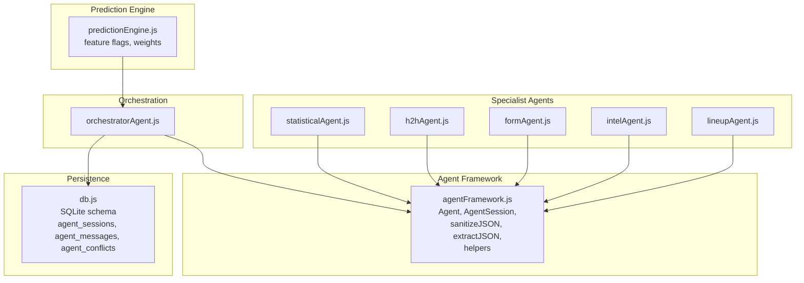
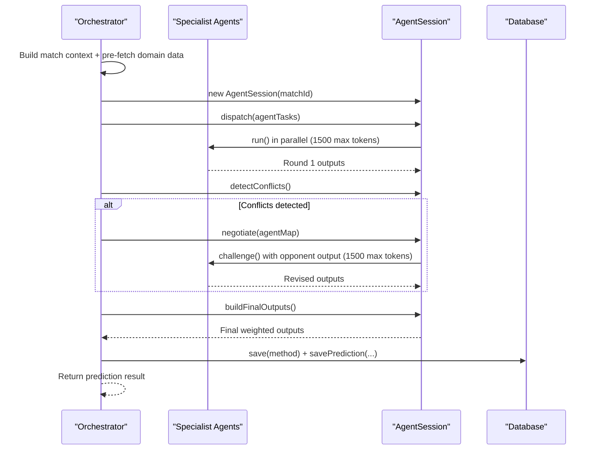
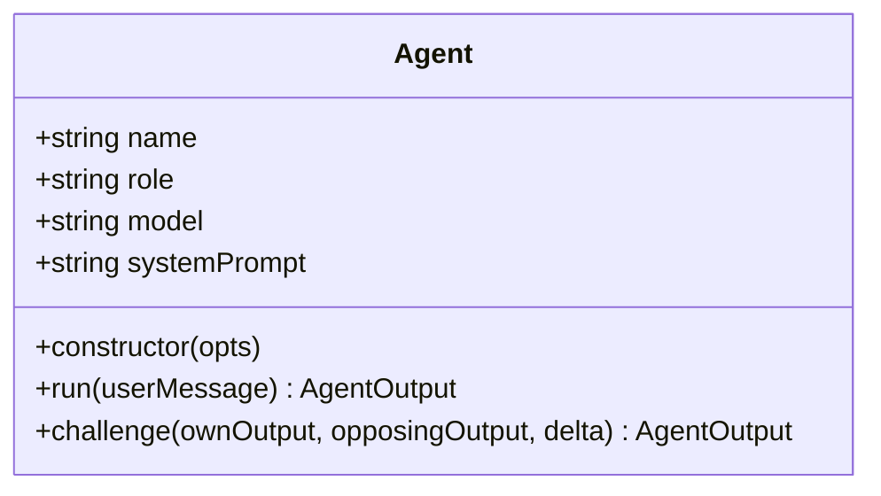
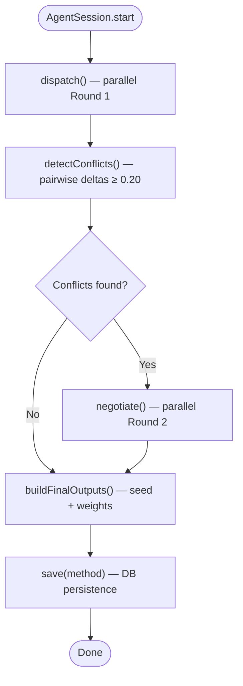
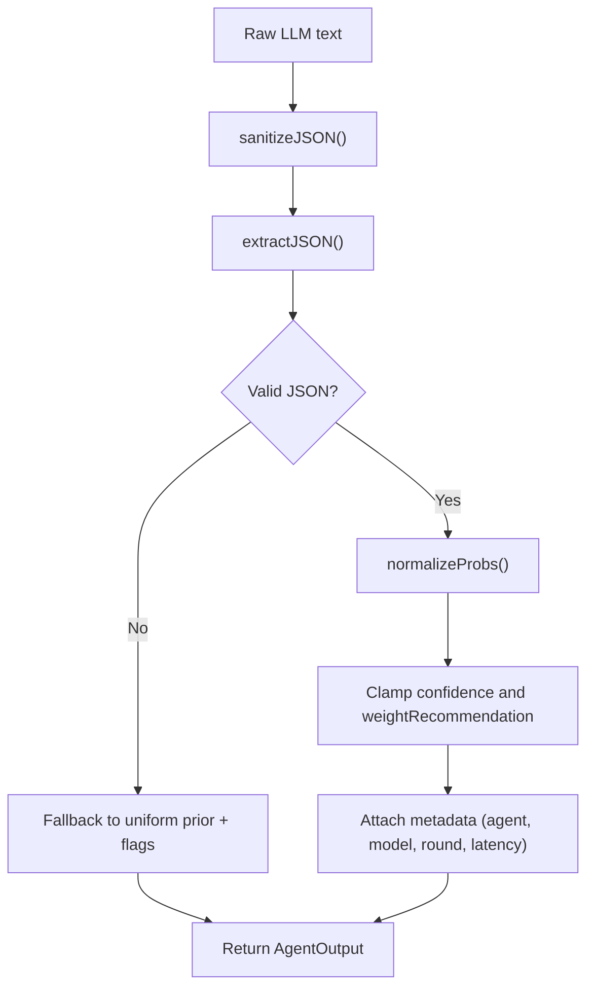
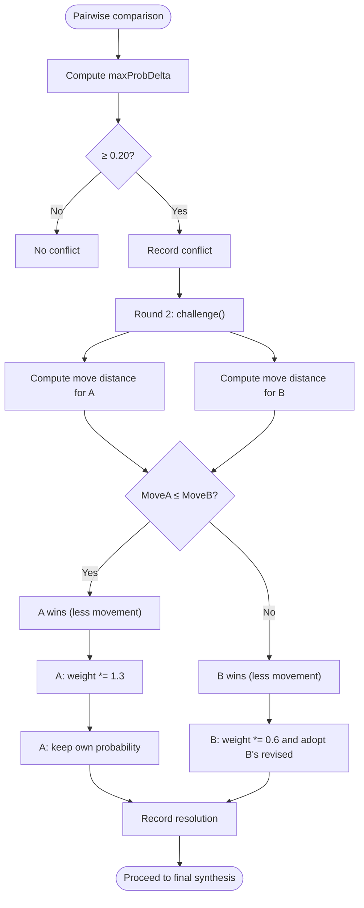
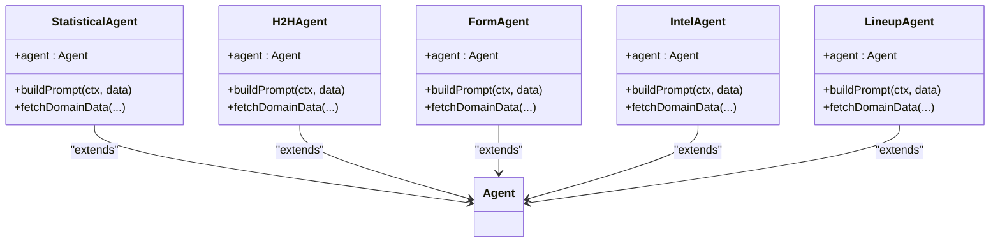
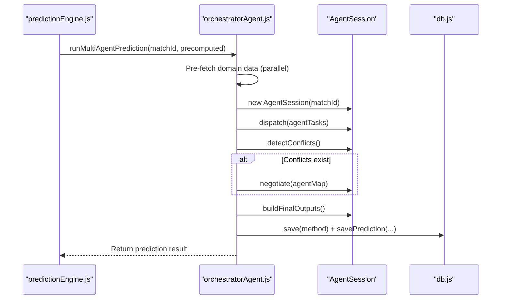
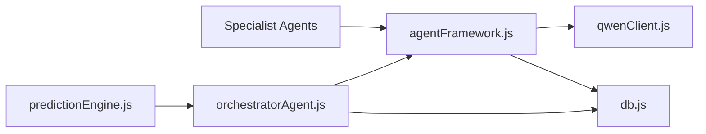
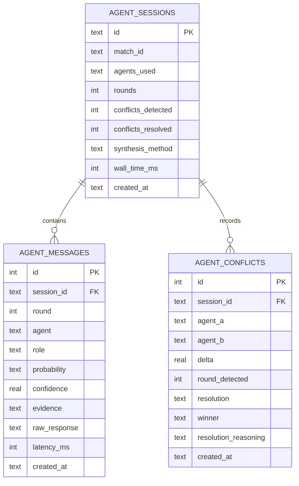

# Agent Framework Design

<cite>
**Referenced Files in This Document**
- [agentFramework.js](file://backend/services/agents/agentFramework.js)
- [orchestratorAgent.js](file://backend/services/agents/orchestratorAgent.js)
- [statisticalAgent.js](file://backend/services/agents/statisticalAgent.js)
- [h2hAgent.js](file://backend/services/agents/h2hAgent.js)
- [formAgent.js](file://backend/services/agents/formAgent.js)
- [intelAgent.js](file://backend/services/agents/intelAgent.js)
- [lineupAgent.js](file://backend/services/agents/lineupAgent.js)
- [db.js](file://backend/database/db.js)
- [predictionEngine.js](file://backend/services/predictionEngine.js)
- [README.md](file://README.md)
</cite>

## Update Summary
**Changes Made**
- Enhanced JSON parsing capabilities with `sanitizeJSON()` function to handle malformed evidence arrays
- Increased maximum tokens from 600 to 1500 across all agent interactions for improved reliability
- Updated troubleshooting guidance for JSON parsing improvements

## Table of Contents
1. [Introduction](#introduction)
2. [Project Structure](#project-structure)
3. [Core Components](#core-components)
4. [Architecture Overview](#architecture-overview)
5. [Detailed Component Analysis](#detailed-component-analysis)
6. [Dependency Analysis](#dependency-analysis)
7. [Performance Considerations](#performance-considerations)
8. [Troubleshooting Guide](#troubleshooting-guide)
9. [Conclusion](#conclusion)
10. [Appendices](#appendices)

## Introduction
This document explains the multi-agent framework architecture used by the World Cup 2026 prediction system. It focuses on the Agent base class design, the AgentSession orchestration, JSON output schema validation, conflict detection and negotiation mechanics, probability normalization, and database persistence. It also covers session management, parallel execution patterns, and how the system integrates with the broader prediction pipeline.

**Updated** Enhanced JSON parsing capabilities now include automatic sanitization of malformed evidence arrays and increased token limits for improved reliability across all agent interactions.

## Project Structure
The multi-agent system is centered around a shared framework and a set of specialized agents, orchestrated by a central orchestrator. The framework defines the Agent base class and AgentSession orchestration, while each agent specializes in a distinct domain (statistical, head-to-head, form, intelligence, lineup). The orchestrator coordinates data fetching, parallel execution, conflict detection, negotiation, and final synthesis.

**Diagram sources**
- [agentFramework.js:198-562](file://backend/services/agents/agentFramework.js#L198-L562)
- [orchestratorAgent.js:1-471](file://backend/services/agents/orchestratorAgent.js#L1-L471)
- [statisticalAgent.js:1-98](file://backend/services/agents/statisticalAgent.js#L1-L98)
- [h2hAgent.js:1-107](file://backend/services/agents/h2hAgent.js#L1-L107)
- [formAgent.js:1-113](file://backend/services/agents/formAgent.js#L1-L113)
- [intelAgent.js:1-126](file://backend/services/agents/intelAgent.js#L1-L126)
- [lineupAgent.js:1-118](file://backend/services/agents/lineupAgent.js#L1-L118)
- [db.js:167-208](file://backend/database/db.js#L167-L208)
- [predictionEngine.js:48-61](file://backend/services/predictionEngine.js#L48-L61)

**Section sources**
- [README.md:18-105](file://README.md#L18-L105)
- [agentFramework.js:1-586](file://backend/services/agents/agentFramework.js#L1-L586)
- [orchestratorAgent.js:1-471](file://backend/services/agents/orchestratorAgent.js#L1-L471)
- [db.js:167-208](file://backend/database/db.js#L167-L208)

## Core Components
- Agent: A lightweight LLM-backed specialist with a fixed role. It supports:
  - Constructor parameters: name, role, model, systemPrompt
  - run(userMessage): executes Round 1 analysis with increased token limit (1500)
  - challenge(own, opposing, delta): executes Round 2 rebuttal with increased token limit (1500)
- AgentSession: Orchestrates a full multi-agent run:
  - dispatch(tasks): parallel Round 1
  - detectConflicts(): pairwise probability delta checks
  - negotiate(map): parallel Round 2 rebuttals
  - buildFinalOutputs(): merges outputs and adjusts weights
  - save(method): persists session, messages, and conflicts to DB

Key constants and helpers:
- Conflict threshold: 0.20
- Weight adjustment: winner boosted by 1.3×, loser penalized to 0.6×
- JSON schema enforced via AGENT_OUTPUT_SCHEMA
- Enhanced JSON parsing via sanitizeJSON() and extractJSON() with automatic evidence array correction
- Probability normalization via normalizeProbs
- Delta computation via maxProbDelta
- Round 2 challenge prompt construction via buildChallengeMessage
- Persistence via saveMessage and agent_sessions/agent_messages/agent_conflicts tables

**Updated** JSON parsing now includes automatic sanitization of malformed evidence arrays where closing brackets are incorrectly placed as closing braces, and all agent interactions now use increased token limits for improved reliability.

**Section sources**
- [agentFramework.js:31-586](file://backend/services/agents/agentFramework.js#L31-L586)

## Architecture Overview
The system follows a five-agent specialization pattern with a central orchestrator. The orchestrator builds match context, pre-fetches domain data, dispatches agents in parallel, detects conflicts, negotiates where needed, and synthesizes a final prediction using a log-pool blend with temperature scaling.

**Diagram sources**
- [orchestratorAgent.js:278-468](file://backend/services/agents/orchestratorAgent.js#L278-L468)
- [agentFramework.js:326-562](file://backend/services/agents/agentFramework.js#L326-L562)
- [db.js:167-208](file://backend/database/db.js#L167-L208)

**Section sources**
- [README.md:18-105](file://README.md#L18-L105)
- [orchestratorAgent.js:1-471](file://backend/services/agents/orchestratorAgent.js#L1-L471)
- [agentFramework.js:1-586](file://backend/services/agents/agentFramework.js#L1-L586)

## Detailed Component Analysis

### Agent Base Class
The Agent class encapsulates a single LLM-backed specialist:
- Constructor accepts name, role, model, and systemPrompt
- run(userMessage) performs:
  - LLM call with systemPrompt + userMessage (increased to 1500 max tokens)
  - Enhanced parseAgentOutput with automatic JSON sanitization
  - Single retry with explicit JSON-only instruction if parsing fails
- challenge(ownOutput, opposingOutput, delta) performs:
  - Builds a Round 2 prompt highlighting differences exceeding the conflict threshold
  - LLM call with systemPrompt + challengeMessage (increased to 1500 max tokens)
  - Enhanced parseAgentOutput with retry and automatic JSON sanitization; if retry fails, returns original Round 1 output unchanged

**Updated** All LLM calls now use increased token limits (1500) to accommodate more complex reasoning and evidence generation, significantly improving the reliability of multi-agent interactions.

**Diagram sources**
- [agentFramework.js:201-330](file://backend/services/agents/agentFramework.js#L201-L330)

**Section sources**
- [agentFramework.js:201-330](file://backend/services/agents/agentFramework.js#L201-L330)

### AgentSession Orchestration
AgentSession manages a complete multi-agent run:
- dispatch(agentTasks): parallel Promise.allSettled of run() across agents; collects successful outputs
- detectConflicts(): pairwise comparison using maxProbDelta; flags conflicts where delta ≥ 0.20
- negotiate(agentMap): for each conflict, concurrently challenges both agents; collects revised outputs
- buildFinalOutputs():
  - Seeds from Round 1 outputs with initial finalWeight = weightRecommendation
  - Computes move distance per agent using maxProbDelta between Round 1 and revised outputs
  - Winner (less movement) receives 1.3× weight boost; loser (more movement) receives 0.6× weight reduction and adopts loser's revised probability
  - Records resolution reasoning
- save(method): inserts agent_sessions row, persists all messages (Round 1 and Round 2 rebuttals), and writes conflict-resolution records

**Diagram sources**
- [agentFramework.js:336-572](file://backend/services/agents/agentFramework.js#L336-L572)

**Section sources**
- [agentFramework.js:336-572](file://backend/services/agents/agentFramework.js#L336-L572)

### Enhanced JSON Output Schema Validation and Parsing
- AGENT_OUTPUT_SCHEMA enforces a strict JSON structure with probability, confidence, evidence, weightRecommendation, and optional flags
- Enhanced parseAgentOutput(text, agentName, model, round, latencyMs) validates and normalizes:
  - Automatic JSON sanitization via sanitizeJSON() to fix malformed evidence arrays
  - Extracts JSON using extractJSON (code fence, first object, or regex fallback)
  - normalizeProbs ensures probabilities sum to 1.0
  - Clamps confidence and weightRecommendation to [0,1]
  - Adds parseError and rawResponse metadata for robustness

**Updated** The JSON parsing pipeline now includes automatic sanitization of malformed evidence arrays where closing brackets are incorrectly placed as closing braces, significantly improving parsing reliability.

**Diagram sources**
- [agentFramework.js:55-156](file://backend/services/agents/agentFramework.js#L55-L156)

**Section sources**
- [agentFramework.js:55-156](file://backend/services/agents/agentFramework.js#L55-L156)

### Conflict Detection and Weight Adjustment
- Conflict detection uses maxProbDelta to compare Round 1 outputs; any outcome probability difference ≥ 0.20 triggers negotiation
- During negotiation, each agent receives the opponent's Round 1 output and justification
- After Round 2, the agent that moved less is considered the winner and gains a 1.3× weight boost; the loser's weight is reduced to 0.6× and adopts the loser's revised probability in the final blend

**Diagram sources**
- [agentFramework.js:103-109](file://backend/services/agents/agentFramework.js#L103-L109)
- [agentFramework.js:447-503](file://backend/services/agents/agentFramework.js#L447-L503)

**Section sources**
- [agentFramework.js:19-25](file://backend/services/agents/agentFramework.js#L19-L25)
- [agentFramework.js:103-109](file://backend/services/agents/agentFramework.js#L103-L109)
- [agentFramework.js:447-503](file://backend/services/agents/agentFramework.js#L447-L503)

### Specialized Agents
Each agent extends the Agent base class and provides:
- A domain-specific systemPrompt embedding AGENT_OUTPUT_SCHEMA
- A buildPrompt(context, domainData) function to construct the userMessage
- A fetchDomainData(...) function to pre-fetch external data
- An agent singleton configured with name, role, model, and systemPrompt

Examples:
- StatisticalAgent: interprets Dixon-Coles backbone outputs
- H2HAgent: interprets competition-weighted head-to-head records
- FormAgent: evaluates recent match form with competition weighting
- IntelAgent: interprets injuries, motivation, and rotation
- LineupAgent: analyzes confirmed starting XI strength

**Diagram sources**
- [statisticalAgent.js:1-98](file://backend/services/agents/statisticalAgent.js#L1-L98)
- [h2hAgent.js:1-107](file://backend/services/agents/h2hAgent.js#L1-L107)
- [formAgent.js:1-113](file://backend/services/agents/formAgent.js#L1-L113)
- [intelAgent.js:1-126](file://backend/services/agents/intelAgent.js#L1-L126)
- [lineupAgent.js:1-118](file://backend/services/agents/lineupAgent.js#L1-L118)
- [agentFramework.js:13-30](file://backend/services/agents/agentFramework.js#L13-L30)

**Section sources**
- [statisticalAgent.js:1-98](file://backend/services/agents/statisticalAgent.js#L1-L98)
- [h2hAgent.js:1-107](file://backend/services/agents/h2hAgent.js#L1-L107)
- [formAgent.js:1-113](file://backend/services/agents/formAgent.js#L1-L113)
- [intelAgent.js:1-126](file://backend/services/agents/intelAgent.js#L1-L126)
- [lineupAgent.js:1-118](file://backend/services/agents/lineupAgent.js#L1-L118)

### Orchestrator Integration and Final Synthesis
The orchestrator coordinates the entire pipeline:
- Pre-fetches domain data in parallel (H2H, form, intel, lineup)
- Builds agent tasks and agentMap
- Creates AgentSession and dispatches Round 1
- Detects conflicts and negotiates if needed
- Builds final outputs and synthesizes using log-pool blending with temperature scaling
- Generates insight via LLM and saves prediction and session to DB

**Diagram sources**
- [predictionEngine.js:48-61](file://backend/services/predictionEngine.js#L48-L61)
- [orchestratorAgent.js:278-468](file://backend/services/agents/orchestratorAgent.js#L278-L468)
- [agentFramework.js:336-572](file://backend/services/agents/agentFramework.js#L336-L572)
- [db.js:167-208](file://backend/database/db.js#L167-L208)

**Section sources**
- [orchestratorAgent.js:1-471](file://backend/services/agents/orchestratorAgent.js#L1-L471)
- [predictionEngine.js:48-61](file://backend/services/predictionEngine.js#L48-L61)

## Dependency Analysis
- Agent depends on:
  - chatComplete (Qwen client) for LLM calls with increased token limits
  - AGENT_OUTPUT_SCHEMA for validation
  - Enhanced sanitizeJSON() and extractJSON() functions for robust parsing
  - normalizeProbs and maxProbDelta for processing
- AgentSession depends on:
  - Agent instances and their outputs
  - Database schema for persistence
  - saveMessage helper for message insertion
- Orchestrator depends on:
  - Specialist agents and their buildPrompt/fetchDomainData
  - AgentSession for orchestration
  - DB for saving predictions and sessions
- Database schema supports:
  - agent_sessions (session metadata)
  - agent_messages (Round 1 and Round 2 rebuttals)
  - agent_conflicts (detected conflicts and resolutions)

**Diagram sources**
- [agentFramework.js:27-29](file://backend/services/agents/agentFramework.js#L27-L29)
- [orchestratorAgent.js:28-30](file://backend/services/agents/orchestratorAgent.js#L28-L30)
- [db.js:1-252](file://backend/database/db.js#L1-L252)
- [predictionEngine.js:37-53](file://backend/services/predictionEngine.js#L37-L53)

**Section sources**
- [agentFramework.js:27-29](file://backend/services/agents/agentFramework.js#L27-L29)
- [orchestratorAgent.js:28-30](file://backend/services/agents/orchestratorAgent.js#L28-L30)
- [db.js:167-208](file://backend/database/db.js#L167-L208)
- [predictionEngine.js:37-53](file://backend/services/predictionEngine.js#L37-L53)

## Performance Considerations
- Parallelism:
  - Round 1: Promise.allSettled across agents to avoid blocking on failures
  - Round 2: Promise.all for simultaneous rebuttals within each conflict
- Robustness:
  - Enhanced JSON parsing with automatic sanitization of malformed evidence arrays
  - Single retry with explicit JSON-only instruction when parsing fails
  - Graceful fallback to uniform prior with parseError flags
- Cost control:
  - Increased token limits (1500) improve reliability while maintaining reasonable costs
  - Lower temperature and smaller maxTokens for deterministic, concise outputs in specialized contexts
- Persistence:
  - Batched inserts for messages and conflicts to minimize overhead

**Updated** The increased token limits (1500) significantly improve the reliability of complex reasoning tasks while maintaining cost efficiency through careful model selection.

## Troubleshooting Guide
Common issues and remedies:
- JSON parsing failures:
  - Enhanced parseAgentOutput now automatically sanitizes malformed evidence arrays where closing brackets are incorrectly placed as closing braces
  - parseAgentOutput returns fallback with parseError and flags; inspect rawResponse and latencyMs
  - Retry attempts apply stricter instructions; if still failing, investigate systemPrompt or model limits
- LLM call failures:
  - Agent.run and Agent.challenge catch exceptions and fall back to parseAgentOutput with empty text
  - All LLM calls now use increased token limits (1500) to accommodate more complex responses
  - Check network connectivity and API credentials
- Session persistence errors:
  - save() and saveMessage wrap DB operations in try/catch; errors are logged and do not abort the run
- Missing or insufficient domain data:
  - Some agents skip when data is unavailable (e.g., H2H with <2 meetings, LineupAgent when unavailable)
  - Verify dataService endpoints and caching layers

**Updated** JSON parsing improvements now automatically handle malformed evidence arrays, reducing the frequency of parse errors and improving system reliability.

**Section sources**
- [agentFramework.js:231-330](file://backend/services/agents/agentFramework.js#L231-L330)
- [agentFramework.js:122-156](file://backend/services/agents/agentFramework.js#L122-L156)
- [agentFramework.js:55-100](file://backend/services/agents/agentFramework.js#L55-L100)
- [orchestratorAgent.js:325-363](file://backend/services/agents/orchestratorAgent.js#L325-L363)

## Conclusion
The multi-agent framework cleanly separates concerns between a reusable Agent base class, a robust AgentSession orchestration, and domain-specialized agents. It enforces strict JSON output validation with enhanced sanitization capabilities, implements conflict detection and negotiation with clear weight adjustments, and persists all artifacts for auditability. The orchestrator coordinates pre-fetching, parallel execution, and final synthesis, integrating seamlessly with the broader prediction pipeline and database schema.

**Updated** Recent enhancements include improved JSON parsing reliability through automatic sanitization of malformed evidence arrays and increased token limits across all agent interactions, significantly improving system robustness and performance.

## Appendices

### Database Schema Overview
- agent_sessions: session metadata (agents_used, rounds, conflicts, synthesis_method, wall_time_ms)
- agent_messages: per-agent messages (round, agent, role, probability, confidence, evidence, raw_response, latency_ms)
- agent_conflicts: detected conflicts and resolutions (delta, resolution, winner, reasoning)

**Diagram sources**
- [db.js:167-208](file://backend/database/db.js#L167-L208)

**Section sources**
- [db.js:167-208](file://backend/database/db.js#L167-L208)