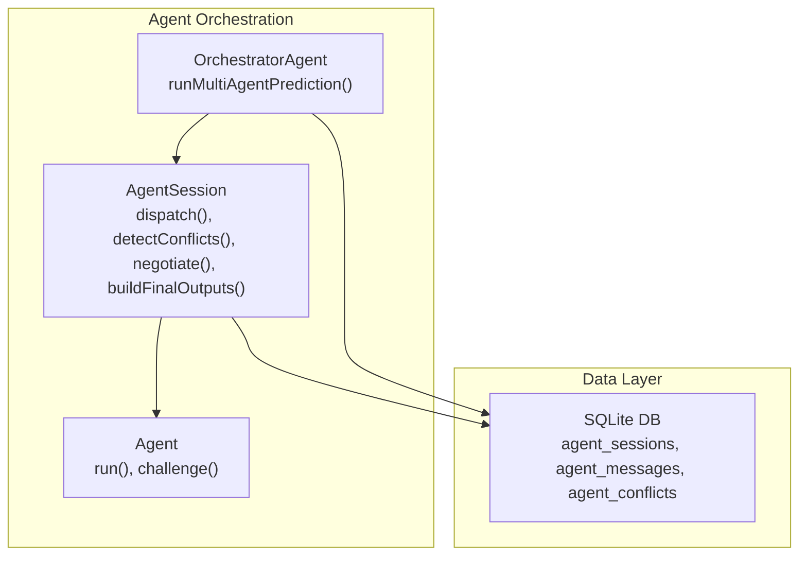
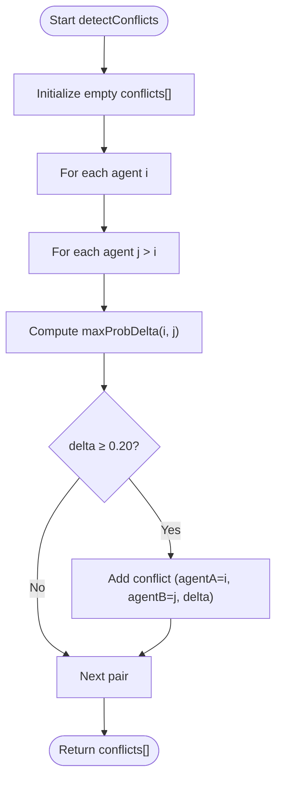
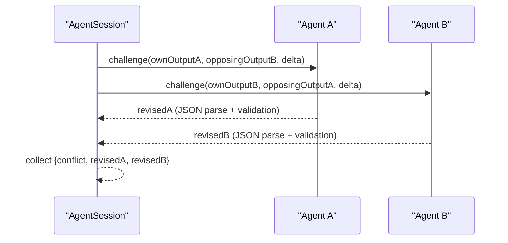
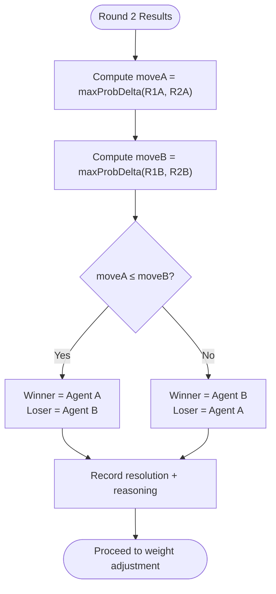
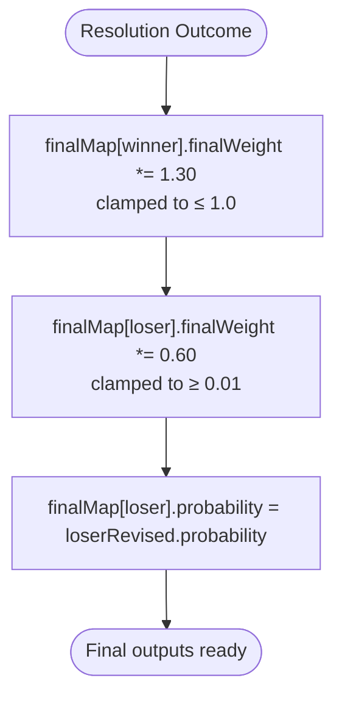
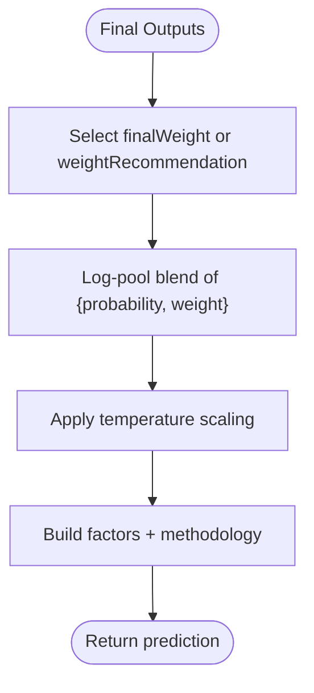
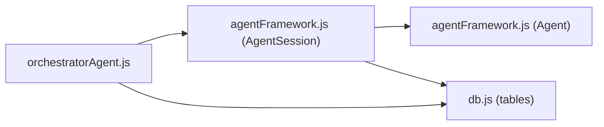

# Conflict Detection & Resolution

<cite>
**Referenced Files in This Document**
- [agentFramework.js](file://backend/services/agents/agentFramework.js)
- [orchestratorAgent.js](file://backend/services/agents/orchestratorAgent.js)
- [db.js](file://backend/database/db.js)
- [README.md](file://README.md)
</cite>

## Table of Contents
1. [Introduction](#introduction)
2. [Project Structure](#project-structure)
3. [Core Components](#core-components)
4. [Architecture Overview](#architecture-overview)
5. [Detailed Component Analysis](#detailed-component-analysis)
6. [Dependency Analysis](#dependency-analysis)
7. [Performance Considerations](#performance-considerations)
8. [Troubleshooting Guide](#troubleshooting-guide)
9. [Conclusion](#conclusion)

## Introduction
This document explains the conflict detection and resolution system used by the multi-agent prediction framework. It covers:
- Pairwise comparison using max probability delta calculations
- Conflict threshold determination (0.20)
- Negotiation protocols (Round 2 rebuttal)
- Decision-making criteria for concessions
- Evidence evaluation and final output merging strategies
- Weight adjustment mechanism (winners boosted 1.3x, losers penalized 0.6x)

## Project Structure
The conflict detection and resolution pipeline spans three primary modules:
- AgentSession: orchestrates multi-agent runs, detects conflicts, negotiates, and merges outputs
- Agent: base class for individual agents with Round 1 and Round 2 challenge behavior
- OrchestratorAgent: coordinates the end-to-end multi-agent prediction flow

**Diagram sources**
- [orchestratorAgent.js:288-468](file://backend/services/agents/orchestratorAgent.js#L288-L468)
- [agentFramework.js:326-562](file://backend/services/agents/agentFramework.js#L326-L562)
- [db.js:195-208](file://backend/database/db.js#L195-L208)

**Section sources**
- [README.md:18-105](file://README.md#L18-L105)
- [orchestratorAgent.js:288-468](file://backend/services/agents/orchestratorAgent.js#L288-L468)
- [agentFramework.js:326-562](file://backend/services/agents/agentFramework.js#L326-L562)

## Core Components
- AgentSession: Manages a single prediction session, including Round 1 dispatch, conflict detection, Round 2 negotiation, and final output assembly with weight adjustments.
- Agent: Base class for specialized agents. Implements Round 1 inference and Round 2 rebuttal via a structured challenge prompt.
- OrchestratorAgent: Top-level coordinator that builds tasks, runs sessions, and produces final predictions.

Key constants and helpers:
- Conflict threshold: 0.20 (max probability delta)
- Winner weight boost: 1.30
- Loser weight penalty: 0.60
- Probability normalization and max-probability delta calculation
- Structured output schema enforced across agents

**Section sources**
- [agentFramework.js:31-35](file://backend/services/agents/agentFramework.js#L31-L35)
- [agentFramework.js:103-109](file://backend/services/agents/agentFramework.js#L103-L109)
- [agentFramework.js:366-394](file://backend/services/agents/agentFramework.js#L366-L394)
- [agentFramework.js:401-435](file://backend/services/agents/agentFramework.js#L401-L435)
- [agentFramework.js:445-493](file://backend/services/agents/agentFramework.js#L445-L493)

## Architecture Overview
The system operates in two rounds:
- Round 1: All agents run concurrently and produce structured outputs.
- Conflict Detection: Pairwise comparisons compute max probability deltas; any ≥ 0.20 triggers negotiation.
- Round 2 (Negotiation): Conflicting agents simultaneously challenge each other with a shared prompt and evidence.
- Resolution: The agent that moved less is declared the winner; winners gain weight, losers lose weight and adopt their revised probabilities.
- Final Blending: Outputs are log-pooled with adjusted weights and temperature scaling.

```mermaid
sequenceDiagram
participant OA as "OrchestratorAgent"
participant AS as "AgentSession"
participant A as "Agent A"
participant B as "Agent B"
participant DB as "Database"
OA->>AS : dispatch(agentTasks)
AS->>A : run(userMessage)
AS->>B : run(userMessage)
A-->>AS : AgentOutput (Round 1)
B-->>AS : AgentOutput (Round 1)
OA->>AS : detectConflicts()
AS-->>OA : conflicts[] (delta ≥ 0.20)
alt conflicts exist
OA->>AS : negotiate(agentMap)
AS->>A : challenge(ownOutput, opposingOutput, delta)
AS->>B : challenge(ownOutput, opposingOutput, delta)
A-->>AS : revisedA (Round 2)
B-->>AS : revisedB (Round 2)
end
OA->>AS : buildFinalOutputs()
AS-->>OA : finalOutputs[] (weights adjusted)
OA->>DB : save(sessionId, messages, conflicts)
OA-->>OA : return final prediction
```

**Diagram sources**
- [orchestratorAgent.js:367-380](file://backend/services/agents/orchestratorAgent.js#L367-L380)
- [agentFramework.js:372-394](file://backend/services/agents/agentFramework.js#L372-L394)
- [agentFramework.js:401-435](file://backend/services/agents/agentFramework.js#L401-L435)
- [agentFramework.js:445-493](file://backend/services/agents/agentFramework.js#L445-L493)
- [db.js:500-550](file://backend/database/db.js#L500-L550)

## Detailed Component Analysis

### Pairwise Conflict Detection
- Purpose: Identify pairs of agents whose Round 1 outputs differ by ≥ 0.20 in any outcome probability.
- Method: maxProbDelta computes the maximum absolute difference across winHome, draw, and winAway.
- Storage: Detected conflicts are logged and persisted to the agent_conflicts table.

**Diagram sources**
- [agentFramework.js:372-394](file://backend/services/agents/agentFramework.js#L372-L394)
- [agentFramework.js:103-109](file://backend/services/agents/agentFramework.js#L103-L109)

**Section sources**
- [agentFramework.js:372-394](file://backend/services/agents/agentFramework.js#L372-L394)
- [agentFramework.js:103-109](file://backend/services/agents/agentFramework.js#L103-L109)
- [db.js:195-208](file://backend/database/db.js#L195-L208)

### Round 2 Rebuttal Process
- Challenge Message Construction: Each agent receives a prompt that includes both its own Round 1 output and the opposing agent’s output, along with the triggering delta.
- Simultaneous Negotiation: For each conflict, both agents are invoked concurrently to produce rebuttals.
- Parsing and Fallback: Responses are parsed into the standardized schema; failures or parse errors cause the agent to retain its Round 1 output.

**Diagram sources**
- [agentFramework.js:149-172](file://backend/services/agents/agentFramework.js#L149-L172)
- [agentFramework.js:272-319](file://backend/services/agents/agentFramework.js#L272-L319)
- [agentFramework.js:409-435](file://backend/services/agents/agentFramework.js#L409-L435)

**Section sources**
- [agentFramework.js:149-172](file://backend/services/agents/agentFramework.js#L149-L172)
- [agentFramework.js:272-319](file://backend/services/agents/agentFramework.js#L272-L319)
- [agentFramework.js:409-435](file://backend/services/agents/agentFramework.js#L409-L435)

### Decision-Making Criteria and Concession Evaluation
- Concession Determination: The agent that moved less from Round 1 to Round 2 is considered to have held position (winner). The agent that moved more is seen as conceding (loser).
- Movement Metric: maxProbDelta between Round 1 and Round 2 outputs for each agent.
- Outcome Recording: Resolution entries capture winner, loser, movement amounts, and reasoning.

**Diagram sources**
- [agentFramework.js:454-490](file://backend/services/agents/agentFramework.js#L454-L490)

**Section sources**
- [agentFramework.js:454-490](file://backend/services/agents/agentFramework.js#L454-L490)

### Weight Adjustment Mechanism
- Winner: Final weight clamped to a maximum of 1.0 after multiplying by 1.30.
- Loser: Final weight multiplied by 0.60 and clamped to a minimum of 0.01.
- Probability Update: The loser’s final probability is replaced with its revised (conceded) Round 2 output.

**Diagram sources**
- [agentFramework.js:463-476](file://backend/services/agents/agentFramework.js#L463-L476)

**Section sources**
- [agentFramework.js:463-476](file://backend/services/agents/agentFramework.js#L463-L476)

### Evidence Evaluation and Final Output Merging
- Evidence: Each agent’s output includes a concise evidence list; these are surfaced in Round 2 challenges and later in the final factors.
- Final Blending: Outputs are log-pooled with weights derived from either Round 1 recommendations or adjusted final weights. Temperature scaling is applied afterward.
- Factors and Methodology: The orchestrator constructs human-readable factor summaries and methodology strings for transparency.

**Diagram sources**
- [orchestratorAgent.js:387-392](file://backend/services/agents/orchestratorAgent.js#L387-L392)
- [orchestratorAgent.js:158-180](file://backend/services/agents/orchestratorAgent.js#L158-L180)
- [orchestratorAgent.js:183-191](file://backend/services/agents/orchestratorAgent.js#L183-L191)

**Section sources**
- [orchestratorAgent.js:387-392](file://backend/services/agents/orchestratorAgent.js#L387-L392)
- [orchestratorAgent.js:158-180](file://backend/services/agents/orchestratorAgent.js#L158-L180)
- [orchestratorAgent.js:183-191](file://backend/services/agents/orchestratorAgent.js#L183-L191)

## Dependency Analysis
- AgentSession depends on:
  - Agent class for Round 1 and Round 2 behavior
  - chatComplete for LLM calls
  - Database for persistence of sessions, messages, and conflicts
- OrchestratorAgent composes AgentSession and manages agent selection, prompt building, and final prediction assembly.
- Database schema supports:
  - agent_sessions: session metadata
  - agent_messages: Round 1 and Round 2 outputs
  - agent_conflicts: conflict detection and resolution outcomes

**Diagram sources**
- [orchestratorAgent.js:288-468](file://backend/services/agents/orchestratorAgent.js#L288-L468)
- [agentFramework.js:326-562](file://backend/services/agents/agentFramework.js#L326-L562)
- [db.js:195-208](file://backend/database/db.js#L195-L208)

**Section sources**
- [orchestratorAgent.js:288-468](file://backend/services/agents/orchestratorAgent.js#L288-L468)
- [agentFramework.js:326-562](file://backend/services/agents/agentFramework.js#L326-L562)
- [db.js:195-208](file://backend/database/db.js#L195-L208)

## Performance Considerations
- Parallelization: Round 1 and Round 2 are executed concurrently wherever possible to minimize latency.
- JSON Parsing: Robust extraction and fallback logic prevent single failures from blocking the session.
- Weight Clamping: Ensures numerical stability and prevents extreme weight drift.
- Database Writes: Batched writes for messages and conflicts reduce overhead.

## Troubleshooting Guide
Common issues and remedies:
- LLM Call Failures: Round 2 fallback returns the Round 1 output unchanged; verify credentials and quotas.
- JSON Parse Errors: The parser attempts a second retry with stricter instructions; review agent output formatting.
- Missing Agents: If an agent instance is not found in the agentMap, the conflict is skipped with a warning.
- No Conflicts Detected: The system logs and proceeds to final blending without Round 2.

**Section sources**
- [agentFramework.js:235-238](file://backend/services/agents/agentFramework.js#L235-L238)
- [agentFramework.js:295-311](file://backend/services/agents/agentFramework.js#L295-L311)
- [agentFramework.js:414-417](file://backend/services/agents/agentFramework.js#L414-L417)
- [agentFramework.js:402-405](file://backend/services/agents/agentFramework.js#L402-L405)

## Conclusion
The conflict detection and resolution system enforces robust peer review among agents. By measuring disagreement via max probability deltas, engaging agents in simultaneous rebuttals, and adjusting weights based on concession magnitude, the system improves prediction quality while maintaining interpretability. The documented thresholds, protocols, and persistence ensure reproducibility and traceability.