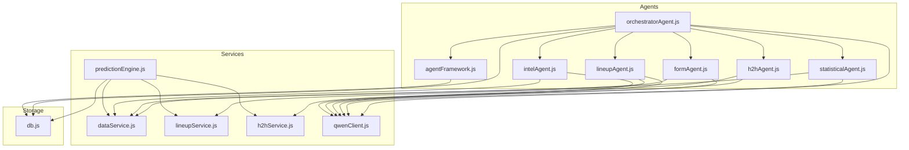
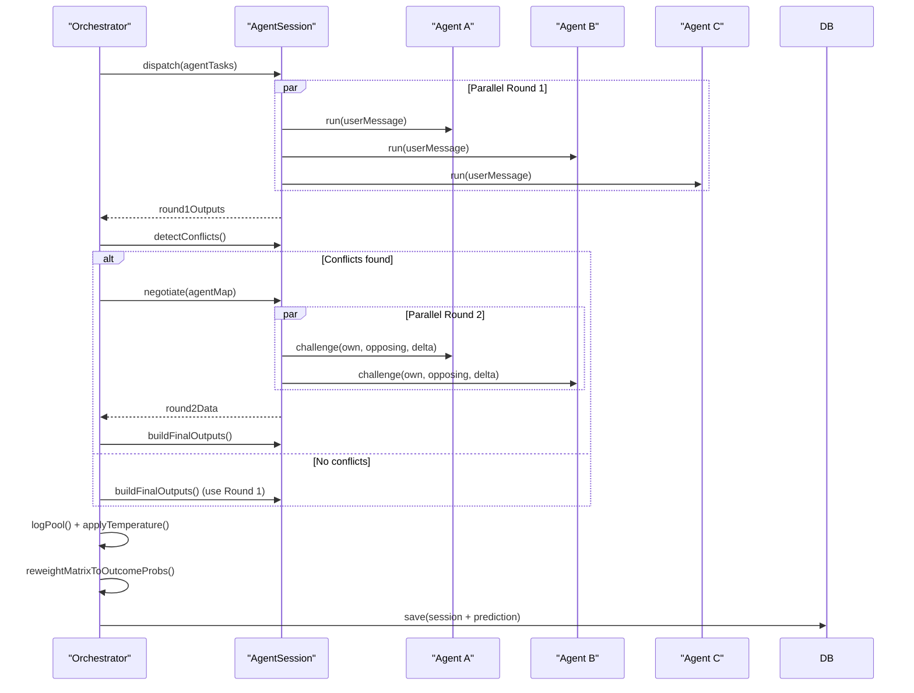
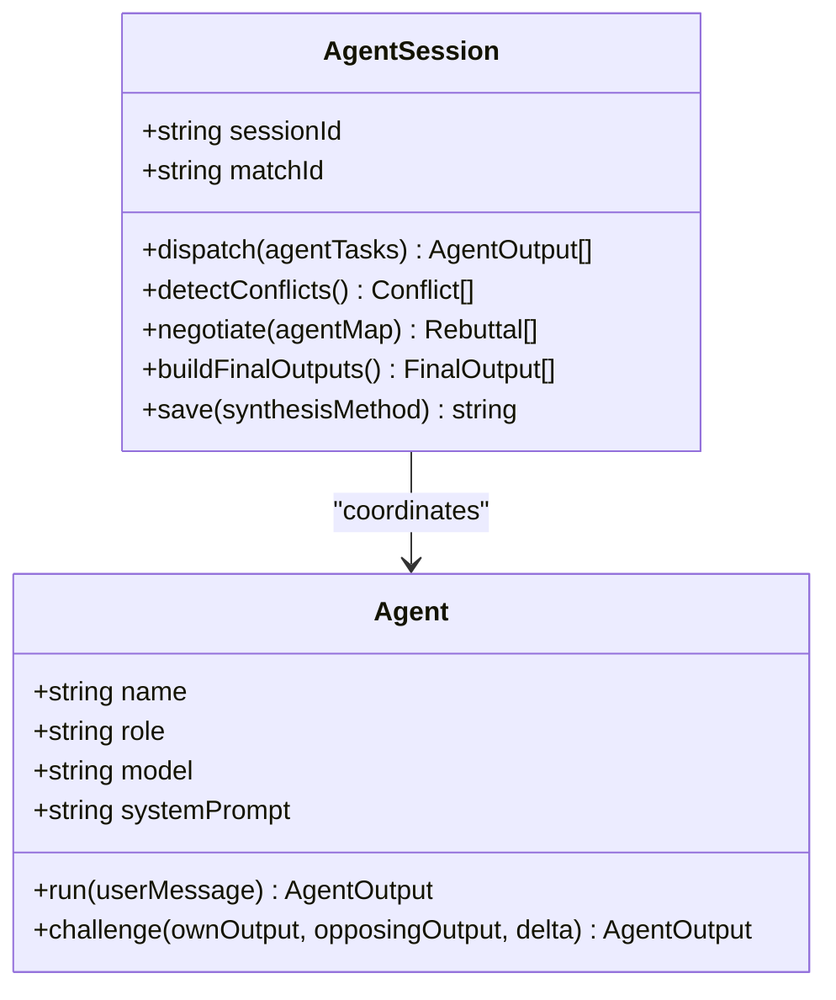
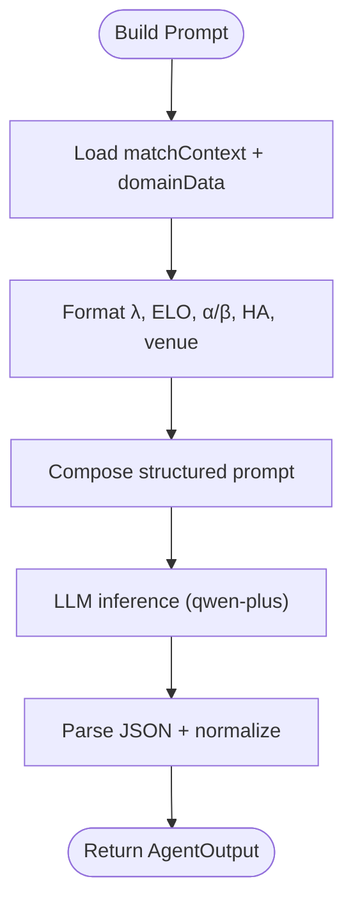
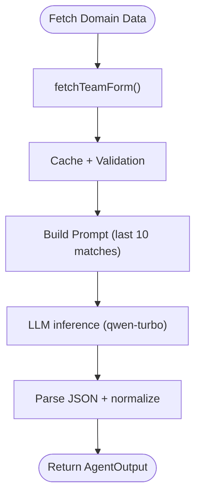
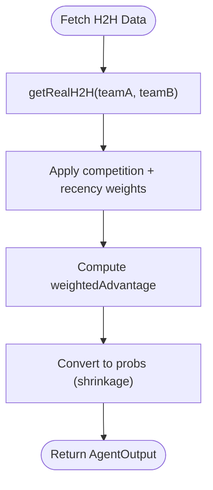
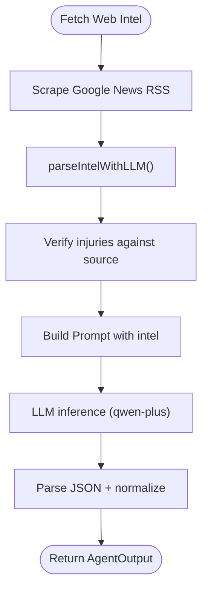
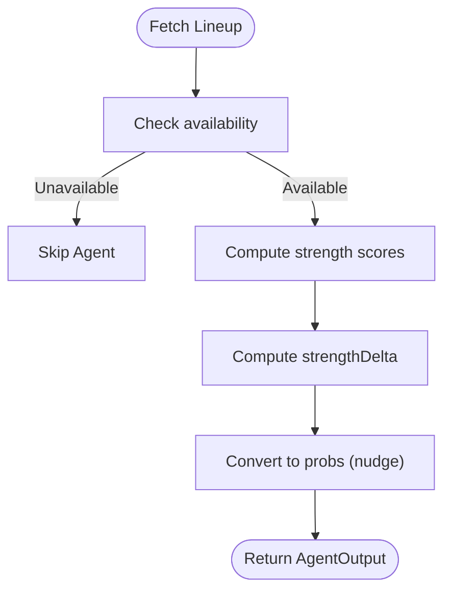
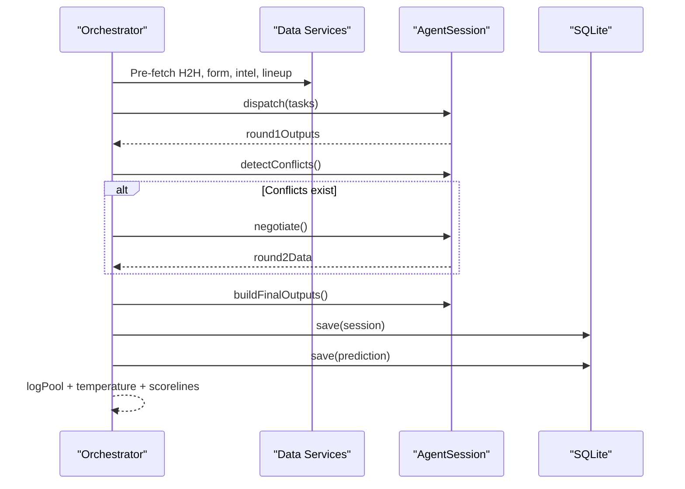
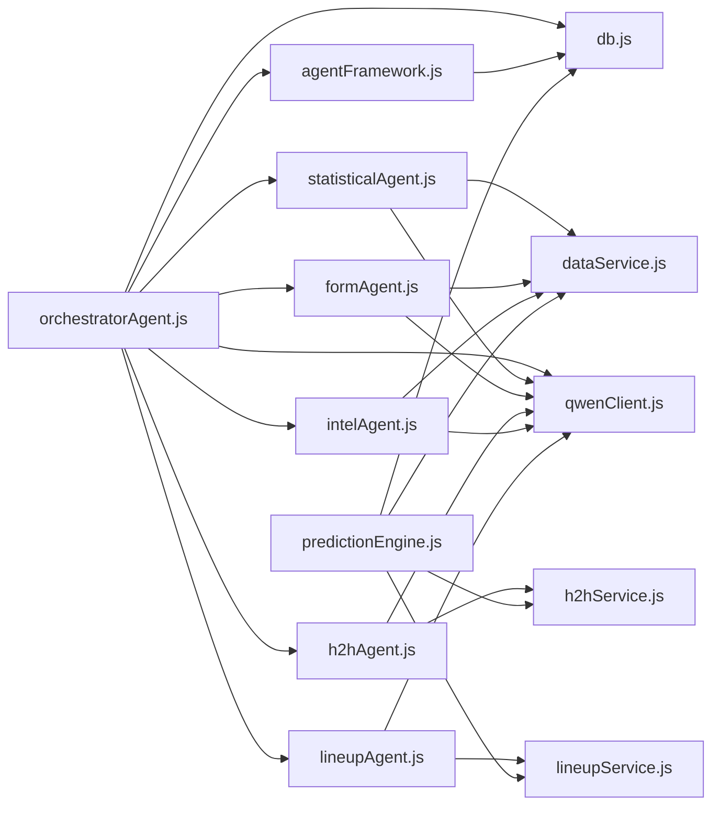

# Multi-Agent AI System

<cite>
**Referenced Files in This Document**
- [agentFramework.js](file://backend/services/agents/agentFramework.js)
- [statisticalAgent.js](file://backend/services/agents/statisticalAgent.js)
- [formAgent.js](file://backend/services/agents/formAgent.js)
- [h2hAgent.js](file://backend/services/agents/h2hAgent.js)
- [intelAgent.js](file://backend/services/agents/intelAgent.js)
- [lineupAgent.js](file://backend/services/agents/lineupAgent.js)
- [orchestratorAgent.js](file://backend/services/agents/orchestratorAgent.js)
- [db.js](file://backend/database/db.js)
- [predictionEngine.js](file://backend/services/predictionEngine.js)
- [dataService.js](file://backend/services/dataService.js)
- [lineupService.js](file://backend/services/lineupService.js)
- [h2hService.js](file://backend/services/h2hService.js)
- [qwenClient.js](file://backend/services/qwenClient.js)
- [analysisService.js](file://backend/services/analysisService.js)
</cite>

## Table of Contents
1. [Introduction](#introduction)
2. [Project Structure](#project-structure)
3. [Core Components](#core-components)
4. [Architecture Overview](#architecture-overview)
5. [Detailed Component Analysis](#detailed-component-analysis)
6. [Dependency Analysis](#dependency-analysis)
7. [Performance Considerations](#performance-considerations)
8. [Troubleshooting Guide](#troubleshooting-guide)
9. [Conclusion](#conclusion)

## Introduction
This document describes the multi-agent AI system architecture used for World Cup 2026 match predictions. The system orchestrates five specialized agents that analyze different aspects of a match (statistical backbone, recent form, head-to-head history, pre-match intelligence, and confirmed lineups), then resolve conflicts and negotiate differences to produce a robust, calibrated final prediction. The framework enforces strict output schemas, conflict detection thresholds, and weight-based blending to ensure reliable probabilistic outcomes.

## Project Structure
The multi-agent system resides in the backend under services/agents and integrates with data services, prediction engines, and persistent storage.

**Diagram sources**
- [agentFramework.js:1-576](file://backend/services/agents/agentFramework.js#L1-L576)
- [statisticalAgent.js:1-98](file://backend/services/agents/statisticalAgent.js#L1-L98)
- [formAgent.js:1-113](file://backend/services/agents/formAgent.js#L1-L113)
- [h2hAgent.js:1-107](file://backend/services/agents/h2hAgent.js#L1-L107)
- [intelAgent.js:1-126](file://backend/services/agents/intelAgent.js#L1-L126)
- [lineupAgent.js:1-118](file://backend/services/agents/lineupAgent.js#L1-L118)
- [orchestratorAgent.js:1-471](file://backend/services/agents/orchestratorAgent.js#L1-L471)
- [dataService.js:1-583](file://backend/services/dataService.js#L1-L583)
- [lineupService.js:1-425](file://backend/services/lineupService.js#L1-L425)
- [h2hService.js:1-315](file://backend/services/h2hService.js#L1-L315)
- [predictionEngine.js:1-1020](file://backend/services/predictionEngine.js#L1-L1020)
- [qwenClient.js:1-123](file://backend/services/qwenClient.js#L1-L123)
- [db.js:1-252](file://backend/database/db.js#L1-L252)

**Section sources**
- [agentFramework.js:1-576](file://backend/services/agents/agentFramework.js#L1-L576)
- [orchestratorAgent.js:1-471](file://backend/services/agents/orchestratorAgent.js#L1-L471)
- [db.js:1-252](file://backend/database/db.js#L1-L252)

## Core Components
- Agent framework: Defines the base Agent class and AgentSession orchestration, including JSON schema enforcement, conflict detection, negotiation, and final output blending.
- Specialized agents: Five agents interpret domain-specific signals and produce structured outputs.
- Orchestrator: Coordinates agent execution, conflict resolution, and final prediction synthesis.
- Data services: Provide external data (form, H2H, intelligence, lineups) and caching.
- Storage: SQLite-backed persistence for predictions, agent sessions, conflicts, and metadata.
- LLM client: Unified Qwen/DashScope integration for agent reasoning.

**Section sources**
- [agentFramework.js:1-576](file://backend/services/agents/agentFramework.js#L1-L576)
- [orchestratorAgent.js:1-471](file://backend/services/agents/orchestratorAgent.js#L1-L471)
- [db.js:167-207](file://backend/database/db.js#L167-L207)
- [qwenClient.js:1-123](file://backend/services/qwenClient.js#L1-L123)

## Architecture Overview
The multi-agent pipeline runs in two rounds:
- Round 1: All active agents run in parallel, generating structured probability assessments.
- Conflict detection: Pairwise comparison of outputs identifies significant probability deltas.
- Round 2: Agents challenge each other on conflicting pairs; the agent that moves less “wins” and receives a weight boost; the loser’s output is replaced with the concession.
- Final blending: Outputs are merged using log-pool weighting and temperature scaling, then scorelines are derived from the adjusted matrix.

**Diagram sources**
- [orchestratorAgent.js:367-467](file://backend/services/agents/orchestratorAgent.js#L367-L467)
- [agentFramework.js:340-561](file://backend/services/agents/agentFramework.js#L340-L561)

**Section sources**
- [orchestratorAgent.js:278-467](file://backend/services/agents/orchestratorAgent.js#L278-L467)
- [agentFramework.js:322-561](file://backend/services/agents/agentFramework.js#L322-L561)

## Detailed Component Analysis

### Agent Framework Design
- Agent class encapsulates:
  - System prompt and model selection.
  - Round 1 run() with LLM invocation and JSON extraction.
  - Round 2 challenge() with negotiation prompt building and retry logic.
  - Robust JSON parsing with fallbacks and normalization.
- AgentSession orchestrates:
  - Parallel dispatch of tasks.
  - Conflict detection using max probability delta threshold.
  - Simultaneous negotiation across all conflicted pairs.
  - Final output construction with weight adjustments.
  - Persistence of sessions, messages, and conflicts.

**Diagram sources**
- [agentFramework.js:201-320](file://backend/services/agents/agentFramework.js#L201-L320)
- [agentFramework.js:326-561](file://backend/services/agents/agentFramework.js#L326-L561)

**Section sources**
- [agentFramework.js:1-576](file://backend/services/agents/agentFramework.js#L1-L576)

### Statistical Agent (Dixon-Coles Interpretation)
- Role: Translates precomputed Dixon-Coles backbone outputs (λ-home/away, ELO, attack/defense α/β, home advantage, venue effect) into natural language probability assessments.
- Data sources: Backboned λ values, ELO ratings, α/β parameters, home advantage, venue effect.
- Processing: Builds a structured prompt with contextual factors and asks the LLM to reconcile the mathematical outputs with observable signals.
- Output: Probability distribution, confidence, evidence bullets, weight recommendation, flags.

**Diagram sources**
- [statisticalAgent.js:32-87](file://backend/services/agents/statisticalAgent.js#L32-L87)
- [agentFramework.js:112-146](file://backend/services/agents/agentFramework.js#L112-L146)

**Section sources**
- [statisticalAgent.js:1-98](file://backend/services/agents/statisticalAgent.js#L1-L98)
- [predictionEngine.js:135-174](file://backend/services/predictionEngine.js#L135-L174)

### Form Agent (Recent Performance Analysis)
- Role: Evaluates recent form using last 10 matches, weighting by competition importance and recency.
- Data sources: Team form fetched from API or web scraping; cached in web_intel_cache.
- Processing: Aggregates results, computes weighted form scores, and synthesizes a comparative assessment.
- Output: Probability distribution aligned with form momentum, confidence, evidence bullets, weight recommendation.

**Diagram sources**
- [formAgent.js:42-102](file://backend/services/agents/formAgent.js#L42-L102)
- [dataService.js:68-133](file://backend/services/dataService.js#L68-L133)
- [agentFramework.js:112-146](file://backend/services/agents/agentFramework.js#L112-L146)

**Section sources**
- [formAgent.js:1-113](file://backend/services/agents/formAgent.js#L1-L113)
- [dataService.js:44-185](file://backend/services/dataService.js#L44-L185)

### H2H Agent (Head-to-Head History)
- Role: Interprets competition-weighted H2H records from a 47k-match dataset, producing a W/D/L probability vector.
- Data sources: Real H2H dataset (martj42), seeded into SQLite; accessed via h2hService.
- Processing: Computes weighted advantages, shrinks toward base rates, and returns probabilities with data quality flags.
- Output: Probability distribution, match counts, WC meetings, weighted advantage, last meeting, data quality.

**Diagram sources**
- [h2hAgent.js:38-96](file://backend/services/agents/h2hAgent.js#L38-L96)
- [h2hService.js:181-312](file://backend/services/h2hService.js#L181-L312)
- [agentFramework.js:112-146](file://backend/services/agents/agentFramework.js#L112-L146)

**Section sources**
- [h2hAgent.js:1-107](file://backend/services/agents/h2hAgent.js#L1-L107)
- [h2hService.js:1-315](file://backend/services/h2hService.js#L1-L315)

### Intel Agent (Injury/Suspension Intelligence)
- Role: Extracts structured pre-match intelligence (injuries, motivation, rotation) from Google News RSS and interprets its impact on probabilities.
- Data sources: Web scraping + LLM parsing; fallback regex extraction; cached in web_intel_cache.
- Processing: Verifies claims against source text to prevent hallucinations; computes injury penalties and motivation adjustments.
- Output: Probability distribution reflecting intel impact, confidence, evidence bullets, weight recommendation.

**Diagram sources**
- [intelAgent.js:48-115](file://backend/services/agents/intelAgent.js#L48-L115)
- [dataService.js:413-490](file://backend/services/dataService.js#L413-L490)
- [agentFramework.js:112-146](file://backend/services/agents/agentFramework.js#L112-L146)

**Section sources**
- [intelAgent.js:1-126](file://backend/services/agents/intelAgent.js#L1-L126)
- [dataService.js:268-490](file://backend/services/dataService.js#L268-L490)

### Lineup Agent (Confirmed Starting XI Analysis)
- Role: Analyzes confirmed starting XI to quantify lineup strength and tactical impact; activates only when available (~60–75 minutes before kickoff).
- Data sources: LineupService fetches API or web-scraped lineups; computes strength scores and detects key absences.
- Processing: Computes strength deltas, converts to probability nudges, and sets high weight recommendation.
- Output: Probability distribution reflecting lineup strength, confidence, evidence bullets, weight recommendation.

**Diagram sources**
- [lineupAgent.js:44-107](file://backend/services/agents/lineupAgent.js#L44-L107)
- [lineupService.js:220-362](file://backend/services/lineupService.js#L220-L362)
- [agentFramework.js:112-146](file://backend/services/agents/agentFramework.js#L112-L146)

**Section sources**
- [lineupAgent.js:1-118](file://backend/services/agents/lineupAgent.js#L1-L118)
- [lineupService.js:1-425](file://backend/services/lineupService.js#L1-L425)

### Session Management and Orchestration
- Orchestrator builds match context and pre-fetches domain data in parallel.
- It constructs agent tasks, skipping agents when data is unavailable (e.g., lineup not yet released).
- AgentSession coordinates dispatch, conflict detection, negotiation, and final output assembly.
- Final blending uses log-pool weighting and temperature scaling; scorelines derived from reweighted matrix.

**Diagram sources**
- [orchestratorAgent.js:300-428](file://backend/services/agents/orchestratorAgent.js#L300-L428)
- [agentFramework.js:326-561](file://backend/services/agents/agentFramework.js#L326-L561)
- [db.js:167-207](file://backend/database/db.js#L167-L207)

**Section sources**
- [orchestratorAgent.js:278-467](file://backend/services/agents/orchestratorAgent.js#L278-L467)
- [agentFramework.js:322-561](file://backend/services/agents/agentFramework.js#L322-L561)
- [db.js:167-207](file://backend/database/db.js#L167-L207)

## Dependency Analysis
- Coupling:
  - Orchestrator depends on all five agents and data services.
  - Agents depend on agentFramework for shared logic and qwenClient for LLM calls.
  - Data services depend on qwenClient for LLM parsing and SQLite for caching.
  - PredictionEngine bridges legacy and multi-agent paths, invoking orchestrator when enabled.
- Cohesion:
  - Each agent encapsulates domain logic and prompt building.
  - AgentSession centralizes orchestration and persistence.
- External dependencies:
  - DashScope Qwen API for LLM inference.
  - SQLite for persistence and caching.
  - HTTP clients for external APIs and web scraping.

**Diagram sources**
- [orchestratorAgent.js:32-37](file://backend/services/agents/orchestratorAgent.js#L32-L37)
- [agentFramework.js:27-29](file://backend/services/agents/agentFramework.js#L27-L29)
- [dataService.js:1-21](file://backend/services/dataService.js#L1-L21)
- [lineupService.js:1-43](file://backend/services/lineupService.js#L1-L43)
- [h2hService.js:1-21](file://backend/services/h2hService.js#L1-L21)
- [predictionEngine.js:37-53](file://backend/services/predictionEngine.js#L37-L53)
- [qwenClient.js:1-21](file://backend/services/qwenClient.js#L1-L21)
- [db.js:1-6](file://backend/database/db.js#L1-L6)

**Section sources**
- [orchestratorAgent.js:1-471](file://backend/services/agents/orchestratorAgent.js#L1-L471)
- [agentFramework.js:1-576](file://backend/services/agents/agentFramework.js#L1-L576)
- [predictionEngine.js:1-1020](file://backend/services/predictionEngine.js#L1-L1020)

## Performance Considerations
- Parallelism: All agents run concurrently in Round 1; negotiations are parallelized per conflict pair.
- JSON parsing: Built-in extraction and normalization reduce LLM overhead and improve robustness.
- Conflict threshold: 0.20 max probability delta prevents unnecessary negotiations.
- Temperature scaling: Calibrates output confidence post-blending.
- Caching: Web intel and team form cached to reduce repeated network calls.
- Weight adjustments: Winners gain 1.3× weight; losers drop to 0.6×, encouraging convergence.

[No sources needed since this section provides general guidance]

## Troubleshooting Guide
- LLM failures:
  - Agents retry once with stricter prompts; if both attempts fail, Round 1 output is returned unchanged.
  - Qwen client retries on transient errors and timeouts.
- JSON parse errors:
  - Fallback to uniform priors with explicit flags; logs warnings for diagnosis.
- Data unavailability:
  - H2HAgent skips when fewer than 2 meetings; IntelAgent and LineupAgent return null prompts when data is missing.
- Persistence issues:
  - Session and conflict records saved with error handling; check agent_messages and agent_conflicts tables.

**Section sources**
- [agentFramework.js:221-320](file://backend/services/agents/agentFramework.js#L221-L320)
- [qwenClient.js:53-101](file://backend/services/qwenClient.js#L53-L101)
- [h2hAgent.js:55-61](file://backend/services/agents/h2hAgent.js#L55-L61)
- [intelAgent.js:65-71](file://backend/services/agents/intelAgent.js#L65-L71)
- [lineupAgent.js:64-66](file://backend/services/agents/lineupAgent.js#L64-L66)
- [db.js:167-207](file://backend/database/db.js#L167-L207)

## Conclusion
The multi-agent system combines rigorous domain expertise (statistical, form, H2H, intelligence, lineup) with principled conflict resolution and weight-based blending. By enforcing strict output schemas, detecting meaningful disagreements, and calibrating final predictions, it produces reliable, interpretable match outcomes while maintaining transparency through persisted agent sessions and conflict resolutions.