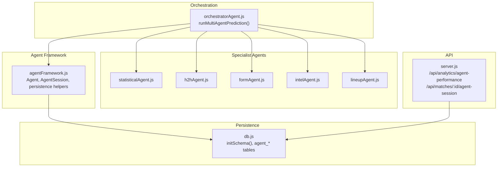
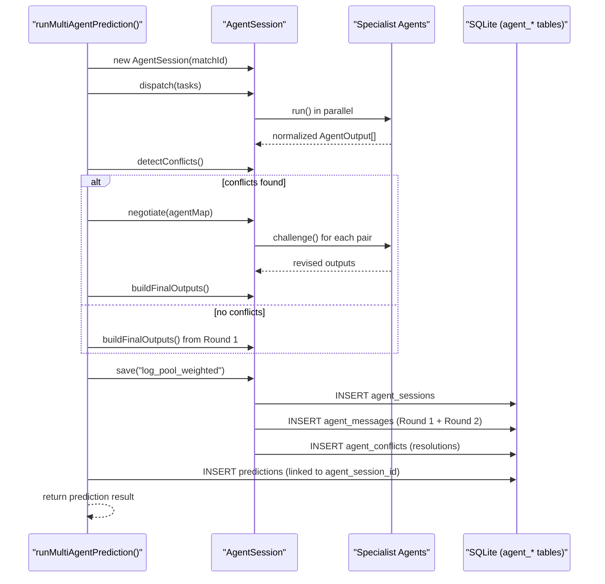
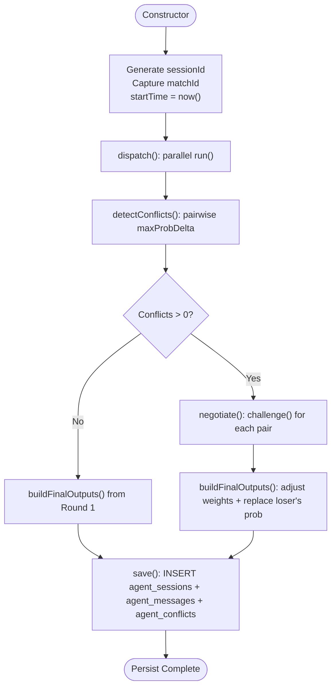
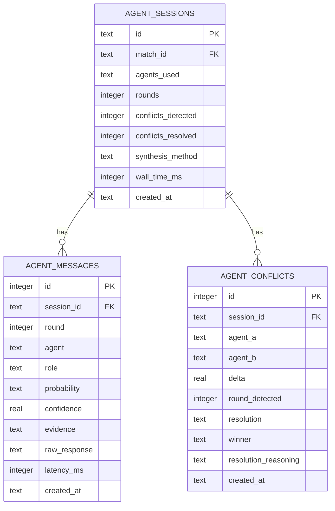
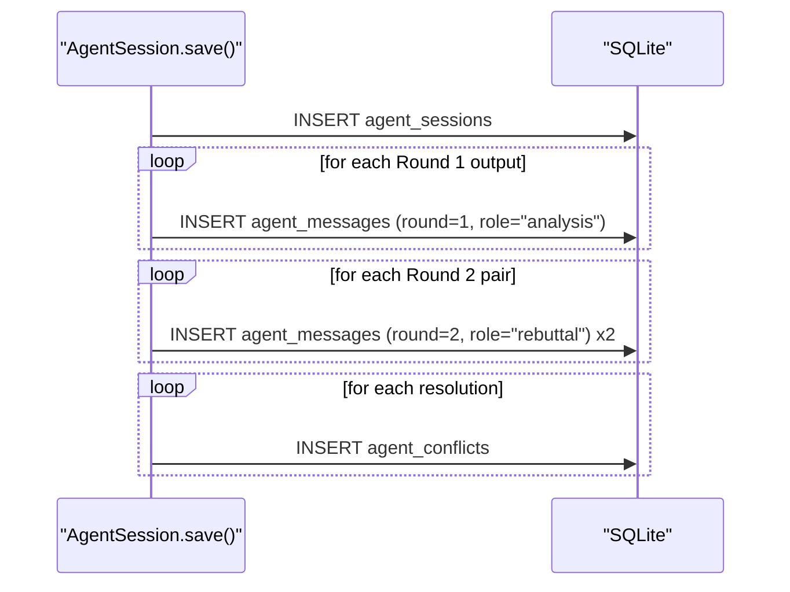
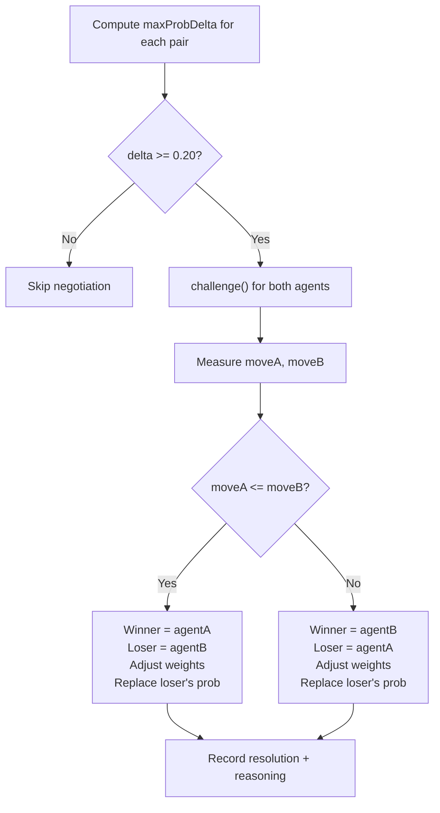
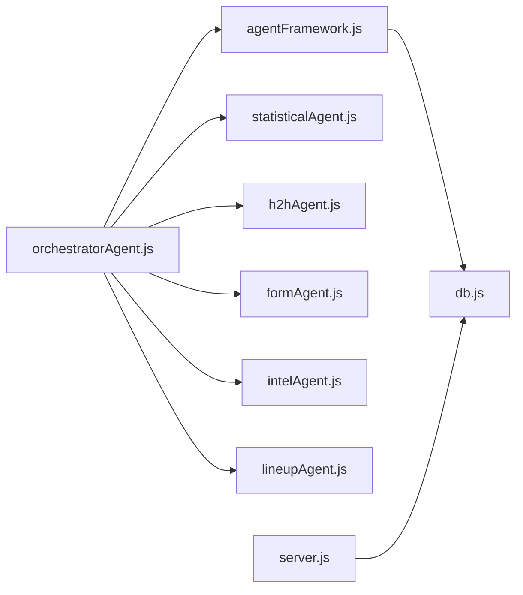

# Session Management & Auditing

<cite>
**Referenced Files in This Document**
- [agentFramework.js](file://backend/services/agents/agentFramework.js)
- [db.js](file://backend/database/db.js)
- [orchestratorAgent.js](file://backend/services/agents/orchestratorAgent.js)
- [server.js](file://backend/server.js)
- [formAgent.js](file://backend/services/agents/formAgent.js)
- [h2hAgent.js](file://backend/services/agents/h2hAgent.js)
- [intelAgent.js](file://backend/services/agents/intelAgent.js)
- [lineupAgent.js](file://backend/services/agents/lineupAgent.js)
- [statisticalAgent.js](file://backend/services/agents/statisticalAgent.js)
</cite>

## Table of Contents
1. [Introduction](#introduction)
2. [Project Structure](#project-structure)
3. [Core Components](#core-components)
4. [Architecture Overview](#architecture-overview)
5. [Detailed Component Analysis](#detailed-component-analysis)
6. [Dependency Analysis](#dependency-analysis)
7. [Performance Considerations](#performance-considerations)
8. [Troubleshooting Guide](#troubleshooting-guide)
9. [Conclusion](#conclusion)
10. [Appendices](#appendices)

## Introduction
This document explains the agent session management and auditing capabilities of the multi-agent prediction system. It covers the AgentSession lifecycle from initialization to completion, including session ID generation, timestamp tracking, and round progression management. It documents the database schema for agent_sessions, agent_messages, and agent_conflicts tables, and details the persistence strategy for Round 1 analyses, Round 2 rebuttals, conflict records, and resolution outcomes. It also describes session metadata tracking, performance metrics collection, error handling and recovery mechanisms, and audit trail generation for debugging and analysis.

## Project Structure
The multi-agent system is centered around a framework that orchestrates several specialized agents, each contributing a distinct signal. Sessions encapsulate a single prediction run for a match, coordinating parallel Round 1 analysis, optional Round 2 negotiation, and comprehensive persistence for auditing.

**Diagram sources**
- [agentFramework.js:1-576](file://backend/services/agents/agentFramework.js#L1-L576)
- [orchestratorAgent.js:1-473](file://backend/services/agents/orchestratorAgent.js#L1-L473)
- [db.js:167-207](file://backend/database/db.js#L167-L207)
- [server.js:359-382](file://backend/server.js#L359-L382)

**Section sources**
- [agentFramework.js:1-576](file://backend/services/agents/agentFramework.js#L1-L576)
- [orchestratorAgent.js:1-473](file://backend/services/agents/orchestratorAgent.js#L1-L473)
- [db.js:167-207](file://backend/database/db.js#L167-L207)
- [server.js:359-382](file://backend/server.js#L359-L382)

## Core Components
- Agent: A single LLM-backed specialist with a fixed role. Provides run() for Round 1 analysis and challenge() for Round 2 rebuttal. Includes robust JSON parsing and retry logic, latency tracking, and standardized output schema.
- AgentSession: Orchestrates a full multi-agent prediction run:
  - dispatch(): parallel Round 1 execution
  - detectConflicts(): pairwise probability delta checks
  - negotiate(): parallel Round 2 rebuttals
  - buildFinalOutputs(): merge and weight adjustment
  - save(): persist session metadata, messages, and conflict resolutions
- Persistence: SQLite schema for agent_sessions, agent_messages, and agent_conflicts; helper to insert messages; atomic transaction-like writes during save().
- Orchestration: runMultiAgentPrediction() builds tasks, coordinates rounds, computes final probabilities, generates insight, persists session and prediction, and returns a unified result.

**Section sources**
- [agentFramework.js:198-562](file://backend/services/agents/agentFramework.js#L198-L562)
- [orchestratorAgent.js:280-470](file://backend/services/agents/orchestratorAgent.js#L280-L470)

## Architecture Overview
The system follows a deterministic pipeline with optional negotiation:
- Preprocessing: match context and domain data are prepared and passed to agents.
- Round 1: All agents run concurrently; outputs are normalized and validated.
- Conflict Detection: pairwise max probability deltas exceeding a threshold trigger negotiation.
- Round 2: Conflicting pairs challenge each other simultaneously; losers’ probabilities are replaced with revised outputs and weights adjusted.
- Aggregation: Final outputs are blended using a log-pool with temperature scaling; top scores and methodology are derived.
- Persistence: Session metadata, all messages, and conflict resolutions are saved atomically.

**Diagram sources**
- [orchestratorAgent.js:290-470](file://backend/services/agents/orchestratorAgent.js#L290-L470)
- [agentFramework.js:326-562](file://backend/services/agents/agentFramework.js#L326-L562)
- [db.js:167-207](file://backend/database/db.js#L167-L207)

## Detailed Component Analysis

### AgentSession Lifecycle
- Initialization: Generates a UUID, captures matchId, and starts a wall-clock timer.
- Round 1: Executes all agent tasks concurrently; collects normalized outputs; logs successes/failures.
- Conflict Detection: Computes pairwise max probability deltas; records conflict tuples with agents, outputs, and delta.
- Round 2: For each conflict, challenges both agents concurrently; captures revised outputs.
- Final Outputs: Seeds from Round 1; adjusts weights and replaces loser’s probability if applicable; records resolutions.
- Persistence: Inserts session metadata, all messages (analysis/rebuttal), and conflict-resolution rows; logs wall time and rounds.

**Diagram sources**
- [agentFramework.js:326-562](file://backend/services/agents/agentFramework.js#L326-L562)

**Section sources**
- [agentFramework.js:326-562](file://backend/services/agents/agentFramework.js#L326-L562)

### Database Schema for Auditing
- agent_sessions: Stores session metadata including match linkage, agents used, rounds executed, conflict counts, synthesis method, and wall time.
- agent_messages: Stores every agent message with round, agent name, role, parsed probability, confidence, evidence, raw response, and latency.
- agent_conflicts: Records detected conflicts and resolution outcomes, including winner and reasoning.

**Diagram sources**
- [db.js:167-207](file://backend/database/db.js#L167-L207)

**Section sources**
- [db.js:167-207](file://backend/database/db.js#L167-L207)

### Persistence Strategy Details
- Session Metadata: Inserted once per session with agents_used (JSON array), rounds (1 or 2), conflict counts, synthesis method, and wall_time_ms.
- Round 1 Messages: One row per agent output with role “analysis”.
- Round 2 Messages: One row per revised output with role “rebuttal”.
- Conflict Resolutions: One row per conflict with resolution outcome (“agent_a_won”/“agent_b_won”), winner, and human-readable reasoning.

**Diagram sources**
- [agentFramework.js:500-561](file://backend/services/agents/agentFramework.js#L500-L561)
- [db.js:167-207](file://backend/database/db.js#L167-L207)

**Section sources**
- [agentFramework.js:500-561](file://backend/services/agents/agentFramework.js#L500-L561)

### Conflict Detection and Resolution Mechanics
- Threshold: Any pairwise max probability delta ≥ 0.20 triggers negotiation.
- Winner/Loser Determination: The agent that moved less in Round 2 is considered the winner and receives a 1.3× weight boost; the loser’s weight is reduced to 0.6× and its probability is replaced with the revised output.
- Resolution Records: Captures reasoning summarizing the movement and outcome.

**Diagram sources**
- [agentFramework.js:366-493](file://backend/services/agents/agentFramework.js#L366-L493)

**Section sources**
- [agentFramework.js:366-493](file://backend/services/agents/agentFramework.js#L366-L493)

### Agent Specializations and Their Roles
- StatisticalAgent: Interprets backbone model outputs (λ, ELO, α/β) into a probability opinion.
- H2HAgent: Uses competition-weighted head-to-head record to inform probabilities.
- FormAgent: Analyzes recent form trends and momentum.
- IntelAgent: Interprets pre-match intelligence (injuries, motivation, rotation).
- LineupAgent: Assesses confirmed starting XI strength and key absences.

These agents are instantiated and dispatched by the orchestrator, which builds prompts from precomputed data and domain-specific fetchers.

**Section sources**
- [statisticalAgent.js:1-98](file://backend/services/agents/statisticalAgent.js#L1-L98)
- [h2hAgent.js:1-107](file://backend/services/agents/h2hAgent.js#L1-L107)
- [formAgent.js:1-113](file://backend/services/agents/formAgent.js#L1-L113)
- [intelAgent.js:1-126](file://backend/services/agents/intelAgent.js#L1-L126)
- [lineupAgent.js:1-118](file://backend/services/agents/lineupAgent.js#L1-L118)

### API Endpoints for Auditing and Analytics
- GET /api/analytics/agent-performance: Provides session-level summaries, conflict counts, average rounds, and recent conflicts.
- GET /api/matches/:id/agent-session: Retrieves session metadata, messages (parsed), and conflict records for a given match.

These endpoints support dashboards and debugging by exposing persisted audit trails.

**Section sources**
- [server.js:538-570](file://backend/server.js#L538-L570)
- [server.js:359-382](file://backend/server.js#L359-L382)

## Dependency Analysis
- AgentSession depends on:
  - Agent (specialists) for Round 1 and Round 2 logic
  - getDb() for SQLite access
  - chatComplete() for LLM calls
- Orchestrator composes multiple agents and invokes AgentSession orchestration.
- Frontend consumes /api/matches/:id/agent-session to render agent session details.

**Diagram sources**
- [orchestratorAgent.js:28-38](file://backend/services/agents/orchestratorAgent.js#L28-L38)
- [agentFramework.js:27-29](file://backend/services/agents/agentFramework.js#L27-L29)
- [db.js:1-252](file://backend/database/db.js#L1-L252)
- [server.js:359-382](file://backend/server.js#L359-L382)

**Section sources**
- [orchestratorAgent.js:28-38](file://backend/services/agents/orchestratorAgent.js#L28-L38)
- [agentFramework.js:27-29](file://backend/services/agents/agentFramework.js#L27-L29)
- [db.js:1-252](file://backend/database/db.js#L1-L252)
- [server.js:359-382](file://backend/server.js#L359-L382)

## Performance Considerations
- Parallelism: Round 1 runs all agents concurrently to minimize wall time; negotiation is also parallelized across conflict pairs.
- Latency Tracking: Each AgentOutput includes latency_ms for profiling and optimization.
- Conflict Threshold: A moderate threshold (0.20) balances detection sensitivity with negotiation overhead.
- Persistence Overhead: Single INSERT statements per row; ensure indexing on session_id for efficient queries.

[No sources needed since this section provides general guidance]

## Troubleshooting Guide
- JSON Parsing Failures:
  - Agent.run() and Agent.challenge() include a retry with a stricter prompt; parse errors are logged and surfaced via flags and fallback outputs.
- LLM Call Failures:
  - On exceptions, the system logs errors and falls back to a normalized baseline output with parseError flag and minimal confidence.
- Session Save Failures:
  - save() wraps inserts in try/catch and logs errors; partial writes are possible if failures occur mid-save.
- Negotiation Skips:
  - If no conflicts are detected, Round 2 is skipped; sessions still persist with rounds=1.

**Section sources**
- [agentFramework.js:221-319](file://backend/services/agents/agentFramework.js#L221-L319)
- [agentFramework.js:500-561](file://backend/services/agents/agentFramework.js#L500-L561)

## Conclusion
The multi-agent session management system provides a robust, auditable pipeline for generating predictions. AgentSession encapsulates lifecycle control, conflict detection, negotiation, and persistence. The SQLite schema for agent_sessions, agent_messages, and agent_conflicts enables comprehensive auditing and analytics. Built-in error handling and retries ensure resilience, while API endpoints expose session details for debugging and monitoring.

[No sources needed since this section summarizes without analyzing specific files]

## Appendices

### Audit Trail Generation and Consumption
- Audit Fields:
  - Session: id, match_id, agents_used, rounds, conflicts_detected/resolved, synthesis_method, wall_time_ms, created_at.
  - Messages: round, agent, role, probability, confidence, evidence, raw_response, latency_ms, created_at.
  - Conflicts: agent_a, agent_b, delta, round_detected, resolution, winner, resolution_reasoning, created_at.
- Consumers:
  - Analytics endpoint aggregates session-level stats and recent conflicts.
  - Match detail page retrieves session messages and conflict records for visualization.

**Section sources**
- [db.js:167-207](file://backend/database/db.js#L167-L207)
- [server.js:538-570](file://backend/server.js#L538-L570)
- [server.js:359-382](file://backend/server.js#L359-L382)