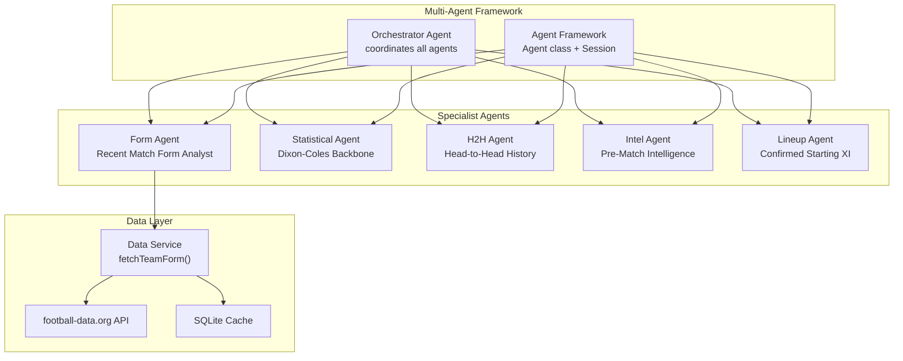
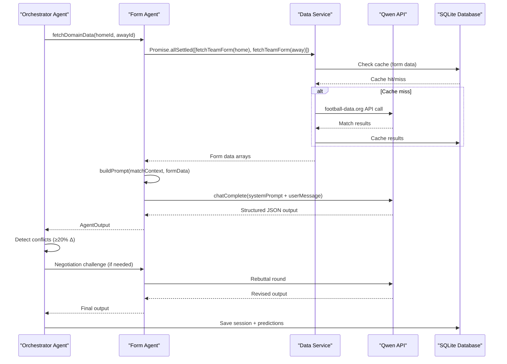
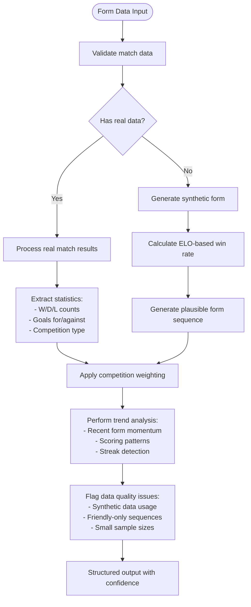
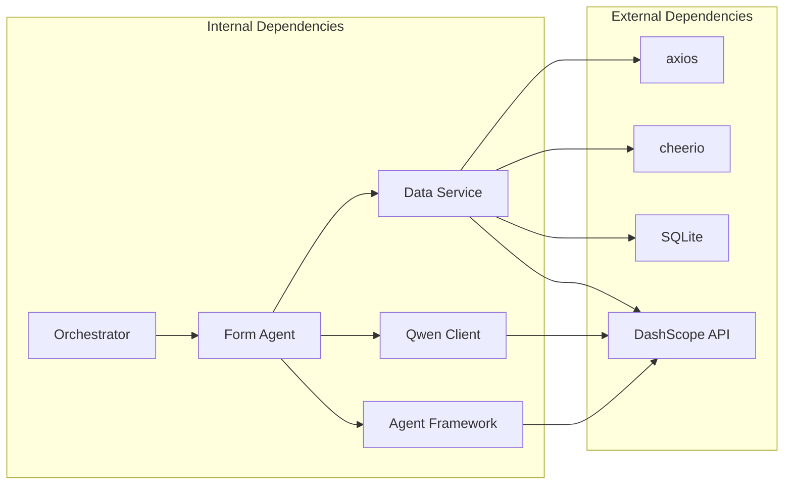

# Form Agent

<cite>
**Referenced Files in This Document**
- [formAgent.js](file://backend/services/agents/formAgent.js)
- [agentFramework.js](file://backend/services/agents/agentFramework.js)
- [orchestratorAgent.js](file://backend/services/agents/orchestratorAgent.js)
- [dataService.js](file://backend/services/dataService.js)
- [qwenClient.js](file://backend/services/qwenClient.js)
- [README.md](file://README.md)
</cite>

## Table of Contents
1. [Introduction](#introduction)
2. [Project Structure](#project-structure)
3. [Core Components](#core-components)
4. [Architecture Overview](#architecture-overview)
5. [Detailed Component Analysis](#detailed-component-analysis)
6. [Dependency Analysis](#dependency-analysis)
7. [Performance Considerations](#performance-considerations)
8. [Troubleshooting Guide](#troubleshooting-guide)
9. [Conclusion](#conclusion)

## Introduction
The Form Agent is a specialized multi-agent component responsible for analyzing recent team performance trends and momentum patterns in World Cup 2026 matches. It evaluates the last 10 match results for both teams, incorporating competition quality weighting, goal scoring and conceding patterns, and contextual factors such as squad rotation and friendly vs competitive context. The agent integrates seamlessly into the multi-agent prediction system, providing structured probability assessments that inform the final prediction blend.

## Project Structure
The Form Agent resides within the multi-agent framework alongside four other specialists: Statistical, H2H, Intel, and Lineup agents. It follows a consistent pattern of domain data fetching, prompt construction, and structured output interpretation.



**Diagram sources**
- [orchestratorAgent.js:280-470](file://backend/services/agents/orchestratorAgent.js#L280-L470)
- [formAgent.js:104-112](file://backend/services/agents/formAgent.js#L104-L112)
- [dataService.js:68-133](file://backend/services/dataService.js#L68-L133)

**Section sources**
- [README.md:18-60](file://README.md#L18-L60)
- [orchestratorAgent.js:280-470](file://backend/services/agents/orchestratorAgent.js#L280-L470)

## Core Components
The Form Agent consists of several key components that work together to deliver reliable form analysis:

### Agent Class Instance
The Form Agent is instantiated as a singleton Agent with specific configuration:
- Model: qwen-turbo (optimized for fast, high-throughput analysis)
- Role: Recent Match Form Analyst
- System Prompt: Structured guidance for pattern recognition and recent form evaluation

### Domain Data Fetcher
The agent fetches recent form data using a parallelized approach:
- fetchTeamForm() for both home and away teams
- Automatic error handling with fallback mechanisms
- Parallel execution for optimal performance

### Prompt Builder
The buildPrompt() function constructs comprehensive analysis prompts that include:
- Team-specific recent form summaries
- Competition quality context
- Momentum indicators and trend analysis
- Data quality flags and caveats

**Section sources**
- [formAgent.js:104-112](file://backend/services/agents/formAgent.js#L104-L112)
- [formAgent.js:42-48](file://backend/services/agents/formAgent.js#L42-L48)
- [formAgent.js:65-102](file://backend/services/agents/formAgent.js#L65-L102)

## Architecture Overview
The Form Agent operates within a sophisticated multi-agent system that coordinates five specialized agents to produce comprehensive match predictions.



**Diagram sources**
- [orchestratorAgent.js:302-367](file://backend/services/agents/orchestratorAgent.js#L302-L367)
- [formAgent.js:42-48](file://backend/services/agents/formAgent.js#L42-L48)
- [agentFramework.js:221-319](file://backend/services/agents/agentFramework.js#L221-L319)

## Detailed Component Analysis

### Form Calculation Methodology
The Form Agent employs a comprehensive approach to calculate team form and momentum:

#### Data Sources and Collection
The agent retrieves recent match results through a multi-tiered approach:
1. **Primary Source**: football-data.org API with authentication
2. **Fallback**: Web scraping from ESPN for team form data
3. **Synthetic Generation**: ELO-based form generation when no real data available

#### Competition Quality Weighting
The system implements explicit competition weighting:
- World Cup / Copa América / AFCON / Euros: Highest quality
- World Cup qualifiers / Confederations: High quality
- Nations League / Gold Cup: Medium quality
- Friendly / International: Low quality

#### Trend Analysis Algorithms
The agent analyzes multiple aspects of recent performance:
- **Win/Draw/Loss Sequences**: Recent results carry exponentially increasing weight
- **Goal Scoring Patterns**: Differentiates between high-scoring and low-scoring victories
- **Momentum Detection**: Identifies winning/losing streaks and their duration
- **Contextual Factors**: Flags squad rotation, friendly vs competitive context



**Diagram sources**
- [dataService.js:68-133](file://backend/services/dataService.js#L68-L133)
- [dataService.js:171-185](file://backend/services/dataService.js#L171-L185)
- [formAgent.js:78-86](file://backend/services/agents/formAgent.js#L78-L86)

#### Momentum Detection Systems
The agent implements sophisticated momentum detection:
- **Streak Analysis**: Identifies consecutive wins/losses and their impact
- **Recency Weighting**: Most recent results have exponentially higher weight
- **Pattern Recognition**: Distinguishes between sustainable form and temporary hot/cold streaks
- **Contextual Adjustment**: Considers competition importance and fixture difficulty

### System Prompt Structure
The Form Agent's system prompt is designed to guide the LLM through comprehensive pattern recognition:

#### Performance Pattern Recognition
The prompt emphasizes:
- **Recent Results Weighting**: Most recent match carries significant weight
- **Scoring Pattern Analysis**: Differentiates between dominant and marginal victories
- **Competition Quality Assessment**: Adjusts expectations based on match importance
- **Momentum Evaluation**: Identifies sustained improvement or decline

#### Recent Form Evaluation Focus
The system prompt specifically instructs the model to:
- Evaluate the last 10 matches per team
- Assess whether teams are on winning or losing streaks
- Consider the quality of opponents faced
- Flag potential squad rotation or rest scenarios
- Provide confidence levels based on data quality

### Output Format Specifications
The Form Agent produces structured JSON output following the agent framework's standardized schema:

#### Core Output Fields
- **probability**: Three-way probability distribution (win/home, draw, win/away)
- **confidence**: Certainty level (0-1 scale)
- **evidence**: 2-4 concise bullet points (≤80 characters each)
- **weightRecommendation**: Suggested weight for final blending (0-1 scale)
- **flags**: Optional diagnostic tags (e.g., synthetic data usage)

#### Confidence Level Classification
The orchestrator system classifies confidence as:
- Very High: Maximum probability ≥ 65%
- High: Maximum probability ≥ 50%
- Medium: Maximum probability ≥ 40%
- Low: Maximum probability < 40%

**Section sources**
- [formAgent.js:17-33](file://backend/services/agents/formAgent.js#L17-L33)
- [formAgent.js:65-102](file://backend/services/agents/formAgent.js#L65-L102)
- [agentFramework.js:40-53](file://backend/services/agents/agentFramework.js#L40-L53)
- [orchestratorAgent.js:121-127](file://backend/services/agents/orchestratorAgent.js#L121-L127)

### Integration Patterns with Orchestration System
The Form Agent integrates deeply with the orchestration system through several mechanisms:

#### Parallel Data Fetching
The orchestrator pre-fetches form data in parallel with other domain data:
```javascript
const [h2hSettled, formSettled, intelSettled, lineupSettled] = await Promise.allSettled([
    h2hMod.fetchDomainData(homeTeam.id, awayTeam.id),
    formMod.fetchDomainData(homeTeam.id, awayTeam.id),
    intelMod.fetchDomainData(homeTeam.id, awayTeam.id, match.scheduled_date, match.stage),
    lineupMod.fetchDomainData(matchId),
]);
```

#### Conditional Activation
The Form Agent activates when:
- Data fetching succeeds (formData is truthy)
- buildPrompt returns a valid prompt (not null)
- The agent is included in the active agent list

#### Conflict Resolution
During negotiation, the Form Agent's output participates in:
- Probability delta calculations (threshold: 20%)
- Weight adjustment based on positional concessions
- Final output blending in the log-pool mechanism

**Section sources**
- [orchestratorAgent.js:302-367](file://backend/services/agents/orchestratorAgent.js#L302-L367)
- [orchestratorAgent.js:338-345](file://backend/services/agents/orchestratorAgent.js#L338-L345)

## Dependency Analysis
The Form Agent has well-defined dependencies that ensure modularity and maintainability:



**Diagram sources**
- [formAgent.js:13-15](file://backend/services/agents/formAgent.js#L13-L15)
- [dataService.js:7-21](file://backend/services/dataService.js#L7-L21)
- [qwenClient.js:13-39](file://backend/services/qwenClient.js#L13-L39)

### Coupling and Cohesion
The Form Agent demonstrates excellent design principles:
- **Low Coupling**: Minimal dependencies on external systems
- **High Cohesion**: All form-related functionality concentrated in single module
- **Clear Interfaces**: Well-defined data fetching and prompt building functions
- **Error Resilience**: Comprehensive error handling and fallback mechanisms

### Potential Circular Dependencies
The system avoids circular dependencies through:
- Lazy loading of analysisService from dataService
- Clear separation between agent modules and shared frameworks
- Independent data caching layer

**Section sources**
- [formAgent.js:13-15](file://backend/services/agents/formAgent.js#L13-L15)
- [dataService.js:10-16](file://backend/services/dataService.js#L10-L16)

## Performance Considerations
The Form Agent is optimized for both accuracy and efficiency:

### Data Freshness Requirements
- **Cache TTL**: 12 hours for form data (CACHE_HOURS.form = 12)
- **Automatic Refresh**: Cache validation checks ensure data currency
- **Fallback Mechanisms**: Synthetic data generation when real data unavailable
- **Parallel Processing**: Concurrent data fetching reduces overall latency

### Optimization Strategies
The system implements several performance optimizations:
- **Promise.allSettled**: Continues processing even if individual data fetches fail
- **Early Termination**: Skips agents when insufficient data is available
- **Structured Output**: Reduces parsing overhead through standardized JSON schema
- **Model Selection**: Uses qwen-turbo for cost-effective form analysis

### Memory and Resource Management
- **Lazy Loading**: Qwen client initialization deferred until needed
- **Connection Pooling**: Reuses axios clients across requests
- **Error Recovery**: Graceful degradation when external APIs fail
- **Timeout Handling**: Configurable timeouts prevent resource starvation

**Section sources**
- [dataService.js:30-41](file://backend/services/dataService.js#L30-L41)
- [dataService.js:78-80](file://backend/services/dataService.js#L78-L80)
- [qwenClient.js:23-39](file://backend/services/qwenClient.js#L23-L39)

## Troubleshooting Guide

### Common Issues and Solutions

#### Data Fetching Failures
**Problem**: Form data not available or incomplete
**Causes**:
- Missing FOOTBALL_DATA_API_KEY environment variable
- API rate limiting or service unavailability
- Team ID mapping mismatches
- Network connectivity issues

**Solutions**:
- Verify API key configuration
- Check team ID mappings in TEAM_ID_MAP
- Monitor API rate limits (10 req/min free tier)
- Implement retry logic with exponential backoff

#### Output Parsing Errors
**Problem**: LLM response doesn't match expected JSON schema
**Causes**:
- Model output format variations
- API response inconsistencies
- Network timeouts causing partial responses

**Solutions**:
- Implement robust JSON extraction with multiple fallback strategies
- Use structured prompts that explicitly require JSON output
- Apply retry logic with stricter validation
- Log raw responses for debugging

#### Performance Degradation
**Problem**: Slow prediction processing times
**Causes**:
- Excessive concurrent API calls
- Large response payload processing
- Inefficient cache utilization

**Solutions**:
- Optimize cache TTL values based on data volatility
- Implement request batching for multiple teams
- Use streaming response processing
- Monitor and adjust model parameters (temperature, max_tokens)

### Debugging Tools and Techniques
The system provides comprehensive logging and monitoring:
- **AgentSession Logging**: Detailed round-by-round analysis
- **Cache Validation**: Timestamp-based freshness checking
- **Error Tracking**: Structured error reporting with stack traces
- **Performance Metrics**: Latency measurements for each component

**Section sources**
- [agentFramework.js:112-146](file://backend/services/agents/agentFramework.js#L112-L146)
- [dataService.js:112-124](file://backend/services/dataService.js#L112-L124)
- [qwenClient.js:83-100](file://backend/services/qwenClient.js#L83-L100)

## Conclusion
The Form Agent represents a sophisticated implementation of recent performance trend analysis within a multi-agent prediction system. Its design balances accuracy with efficiency through careful data sourcing, structured output formatting, and intelligent integration with the broader orchestration framework. The agent's ability to handle diverse data sources, apply quality weighting, and provide nuanced momentum analysis makes it a valuable component in the comprehensive World Cup 2026 prediction system.

The modular architecture ensures maintainability while the parallel processing capabilities support scalable performance. The standardized output format enables seamless integration with other agents and the final prediction synthesis process. Through continuous refinement and monitoring, the Form Agent contributes significantly to the overall accuracy and reliability of the multi-agent prediction system.