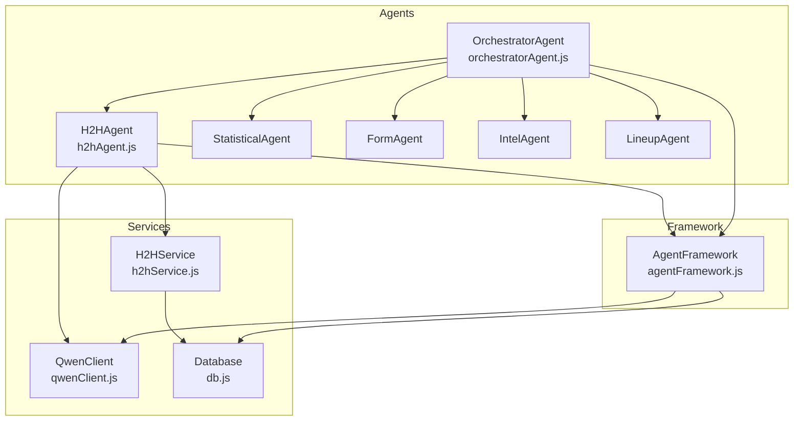
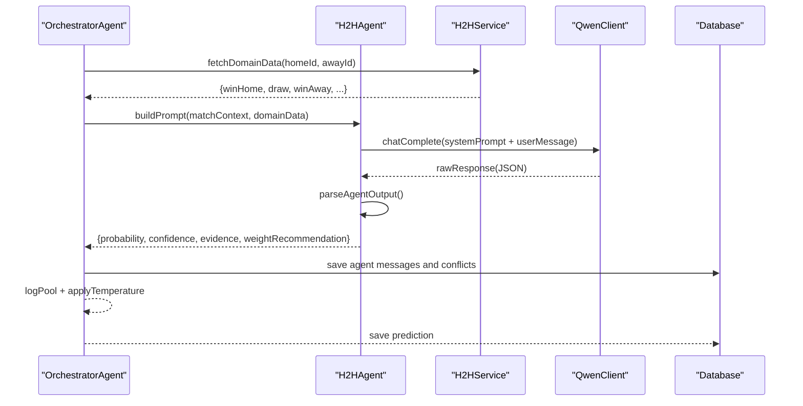
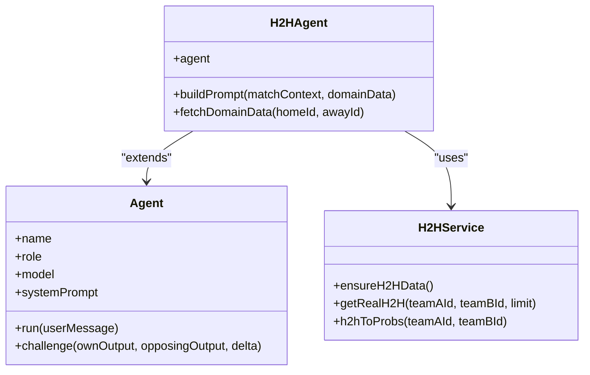
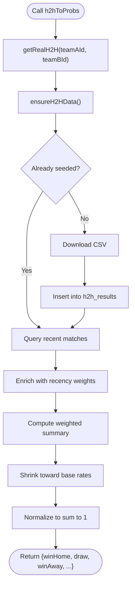
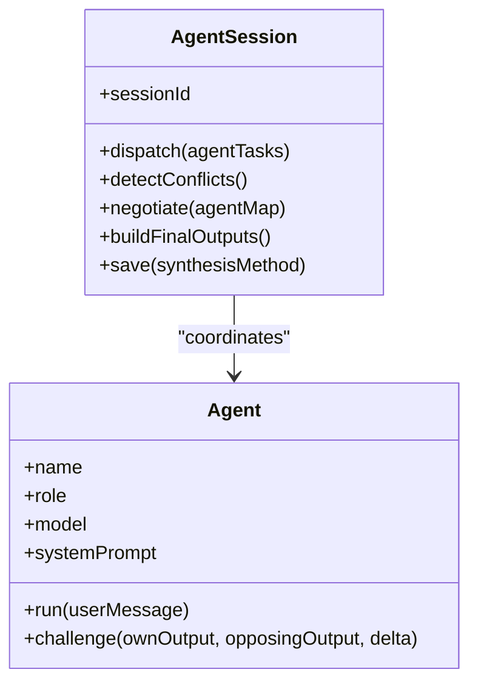
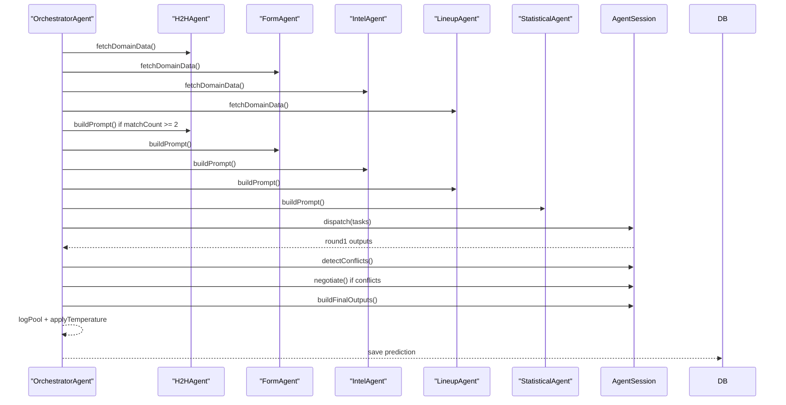
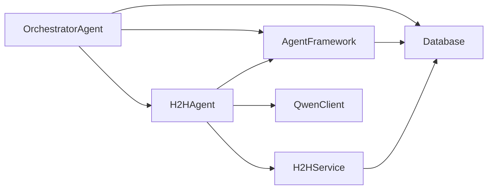

# H2H Agent

<cite>
**Referenced Files in This Document**
- [h2hAgent.js](file://backend/services/agents/h2hAgent.js)
- [h2hService.js](file://backend/services/h2hService.js)
- [orchestratorAgent.js](file://backend/services/agents/orchestratorAgent.js)
- [agentFramework.js](file://backend/services/agents/agentFramework.js)
- [qwenClient.js](file://backend/services/qwenClient.js)
- [db.js](file://backend/database/db.js)
- [SPEC.md](file://specs/SPEC.md)
</cite>

## Table of Contents
1. [Introduction](#introduction)
2. [Project Structure](#project-structure)
3. [Core Components](#core-components)
4. [Architecture Overview](#architecture-overview)
5. [Detailed Component Analysis](#detailed-component-analysis)
6. [Dependency Analysis](#dependency-analysis)
7. [Performance Considerations](#performance-considerations)
8. [Troubleshooting Guide](#troubleshooting-guide)
9. [Conclusion](#conclusion)

## Introduction
The H2H Agent is a specialized multi-agent component that analyzes historical head-to-head (H2H) match data to inform match outcome predictions. It interprets a competition-weighted record spanning nearly 50,000 international matches and translates it into actionable probabilities and confidence signals. The agent focuses on historical context, competitive dynamics, and recency effects, while integrating seamlessly with the broader multi-agent orchestration system.

## Project Structure
The H2H Agent resides within the multi-agent prediction framework alongside other specialists. It interacts with:
- The H2H service for historical data processing and probability computation
- The agent framework for standardized output parsing and conflict resolution
- The orchestrator for coordinated multi-agent runs
- The Qwen client for LLM inference
- The database for persistent storage and configuration

**Diagram sources**
- [h2hAgent.js:1-107](file://backend/services/agents/h2hAgent.js#L1-L107)
- [h2hService.js:1-315](file://backend/services/h2hService.js#L1-L315)
- [orchestratorAgent.js:1-473](file://backend/services/agents/orchestratorAgent.js#L1-L473)
- [agentFramework.js:1-576](file://backend/services/agents/agentFramework.js#L1-L576)
- [qwenClient.js:1-123](file://backend/services/qwenClient.js#L1-L123)
- [db.js:1-252](file://backend/database/db.js#L1-L252)

**Section sources**
- [h2hAgent.js:1-107](file://backend/services/agents/h2hAgent.js#L1-L107)
- [h2hService.js:1-315](file://backend/services/h2hService.js#L1-L315)
- [orchestratorAgent.js:1-473](file://backend/services/agents/orchestratorAgent.js#L1-L473)
- [agentFramework.js:1-576](file://backend/services/agents/agentFramework.js#L1-L576)
- [qwenClient.js:1-123](file://backend/services/qwenClient.js#L1-L123)
- [db.js:1-252](file://backend/database/db.js#L1-L252)

## Core Components
- H2H Agent: Interprets competition-weighted H2H records and produces structured probability outputs with confidence and evidence.
- H2H Service: Loads and maintains a local SQLite copy of the martj42 dataset, computes weighted summaries, and converts them to probabilities.
- Agent Framework: Provides standardized output parsing, conflict detection, negotiation, and persistence for multi-agent runs.
- Orchestrator Agent: Coordinates multi-agent runs, pre-fetches domain data, builds agent tasks, and synthesizes final outputs.
- Qwen Client: Manages LLM calls with robust retry logic and model selection.
- Database: Stores predictions, agent sessions, conflicts, and model configuration.

**Section sources**
- [h2hAgent.js:18-106](file://backend/services/agents/h2hAgent.js#L18-L106)
- [h2hService.js:55-314](file://backend/services/h2hService.js#L55-L314)
- [agentFramework.js:40-146](file://backend/services/agents/agentFramework.js#L40-L146)
- [orchestratorAgent.js:290-470](file://backend/services/agents/orchestratorAgent.js#L290-L470)
- [qwenClient.js:17-123](file://backend/services/qwenClient.js#L17-L123)
- [db.js:23-249](file://backend/database/db.js#L23-L249)

## Architecture Overview
The H2H Agent participates in a multi-agent pipeline:
1. The orchestrator pre-fetches H2H data and constructs prompts.
2. The H2H Agent runs a Qwen model (qwen-turbo) to interpret the H2H record.
3. Outputs are parsed into a standardized JSON schema with probabilities, confidence, evidence, and weight recommendations.
4. The orchestrator detects conflicts among agents and negotiates differences.
5. Final outputs are blended using a log-pool mechanism and saved to the database.

**Diagram sources**
- [orchestratorAgent.js:302-336](file://backend/services/agents/orchestratorAgent.js#L302-L336)
- [h2hAgent.js:38-45](file://backend/services/agents/h2hAgent.js#L38-L45)
- [h2hService.js:272-312](file://backend/services/h2hService.js#L272-L312)
- [agentFramework.js:221-262](file://backend/services/agents/agentFramework.js#L221-L262)
- [qwenClient.js:53-101](file://backend/services/qwenClient.js#L53-L101)
- [db.js:168-207](file://backend/database/db.js#L168-L207)

## Detailed Component Analysis

### H2H Agent
The H2H Agent specializes in interpreting historical head-to-head records and translating them into actionable predictions. It enforces a strict minimum sample size and incorporates recency and competition weighting.

Key behaviors:
- System prompt emphasizes historical context, WC emphasis, recency, and data quality.
- Fetches domain data via the H2H service and returns null when fewer than two meetings exist.
- Builds a structured prompt containing match context, H2H record, weighted probabilities, recent meeting, and data quality.
- Uses qwen-turbo for efficient inference.

**Diagram sources**
- [h2hAgent.js:99-106](file://backend/services/agents/h2hAgent.js#L99-L106)
- [agentFramework.js:201-320](file://backend/services/agents/agentFramework.js#L201-L320)
- [h2hService.js:95-314](file://backend/services/h2hService.js#L95-L314)

**Section sources**
- [h2hAgent.js:18-106](file://backend/services/agents/h2hAgent.js#L18-L106)

### H2H Service
The H2H Service manages a local SQLite copy of the martj42 dataset, normalizes team names, and computes competition-weighted summaries with recency adjustments. It converts raw H2H records into probabilities using shrinkage toward base rates.

Processing pipeline:
- Ensures database tables and indexes exist.
- Downloads and seeds the dataset on first use, storing normalized matches.
- Computes weighted advantages and probabilities with shrinkage.
- Returns structured summaries for downstream consumption.

**Diagram sources**
- [h2hService.js:95-312](file://backend/services/h2hService.js#L95-L312)

**Section sources**
- [h2hService.js:55-314](file://backend/services/h2hService.js#L55-L314)

### Agent Framework
The Agent Framework defines the standardized output schema and parsing logic, enabling consistent interpretation across agents. It also handles conflict detection, negotiation, and persistence.

Key mechanisms:
- Output schema enforces JSON structure with probabilities, confidence, evidence, and weight recommendations.
- JSON extraction with fallbacks and retries.
- Conflict detection via maximum probability deltas.
- Negotiation adjusts weights based on concessions.
- Persistence of agent sessions, messages, and conflicts.

**Diagram sources**
- [agentFramework.js:201-320](file://backend/services/agents/agentFramework.js#L201-L320)
- [agentFramework.js:326-562](file://backend/services/agents/agentFramework.js#L326-L562)

**Section sources**
- [agentFramework.js:40-146](file://backend/services/agents/agentFramework.js#L40-L146)
- [agentFramework.js:326-562](file://backend/services/agents/agentFramework.js#L326-L562)

### Orchestrator Agent
The Orchestrator Agent coordinates multi-agent runs, pre-fetches domain data, and synthesizes final outputs. It conditionally includes the H2H Agent based on data availability and integrates its output into the broader prediction pipeline.

Workflow highlights:
- Pre-fetches H2H, form, intel, and lineup data in parallel.
- Builds agent tasks, skipping agents with insufficient data.
- Detects conflicts and negotiates differences.
- Blends outputs using log-pool and temperature scaling.
- Persists agent sessions and predictions.

**Diagram sources**
- [orchestratorAgent.js:302-470](file://backend/services/agents/orchestratorAgent.js#L302-L470)
- [agentFramework.js:345-493](file://backend/services/agents/agentFramework.js#L345-L493)
- [db.js:244-249](file://backend/database/db.js#L244-L249)

**Section sources**
- [orchestratorAgent.js:290-470](file://backend/services/agents/orchestratorAgent.js#L290-L470)

## Dependency Analysis
The H2H Agent depends on:
- H2H Service for historical data and probability computation
- Agent Framework for standardized output parsing and conflict handling
- Qwen Client for LLM inference
- Database for persistence and configuration

**Diagram sources**
- [h2hAgent.js:14-16](file://backend/services/agents/h2hAgent.js#L14-L16)
- [h2hService.js:20-21](file://backend/services/h2hService.js#L20-L21)
- [agentFramework.js:27-29](file://backend/services/agents/agentFramework.js#L27-L29)
- [qwenClient.js:13-14](file://backend/services/qwenClient.js#L13-L14)
- [db.js:1-3](file://backend/database/db.js#L1-L3)

**Section sources**
- [h2hAgent.js:14-16](file://backend/services/agents/h2hAgent.js#L14-L16)
- [h2hService.js:20-21](file://backend/services/h2hService.js#L20-L21)
- [agentFramework.js:27-29](file://backend/services/agents/agentFramework.js#L27-L29)
- [qwenClient.js:13-14](file://backend/services/qwenClient.js#L13-L14)
- [db.js:1-3](file://backend/database/db.js#L1-L3)

## Performance Considerations
- Data loading: The H2H dataset is downloaded and seeded once, then served from SQLite for fast, offline access.
- Parallelization: The orchestrator pre-fetches domain data in parallel to minimize latency.
- Model selection: The H2H Agent uses qwen-turbo for efficient inference, balancing cost and speed.
- Conflict handling: Negotiation reduces extreme swings and improves consensus among agents.
- Temperature scaling: Post-processing calibrates output probabilities for improved reliability.

[No sources needed since this section provides general guidance]

## Troubleshooting Guide
Common issues and resolutions:
- Insufficient H2H data: When fewer than two meetings exist, the agent returns null and is skipped by the orchestrator. The orchestrator falls back to neutral probabilities.
- JSON parsing failures: The agent framework retries once and falls back to uniform priors with explicit flags.
- LLM call failures: The Qwen client retries on transient errors; failures are logged and handled gracefully.
- Database initialization: The database initializes schema and default weights on first access.

**Section sources**
- [h2hAgent.js:38-45](file://backend/services/agents/h2hAgent.js#L38-L45)
- [agentFramework.js:112-146](file://backend/services/agents/agentFramework.js#L112-L146)
- [qwenClient.js:67-101](file://backend/services/qwenClient.js#L67-L101)
- [db.js:23-249](file://backend/database/db.js#L23-L249)

## Conclusion
The H2H Agent provides a robust, data-driven analysis of historical head-to-head patterns, incorporating competition weighting, recency, and quality metrics. Its integration into the multi-agent orchestration ensures balanced, calibrated predictions with transparent reasoning and conflict resolution. The system’s modular design, standardized output schema, and persistent logging enable continuous improvement and traceability.