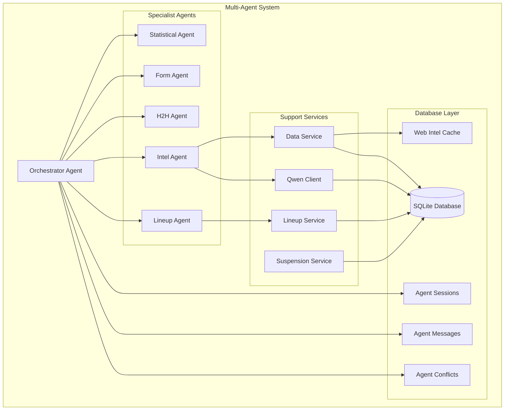
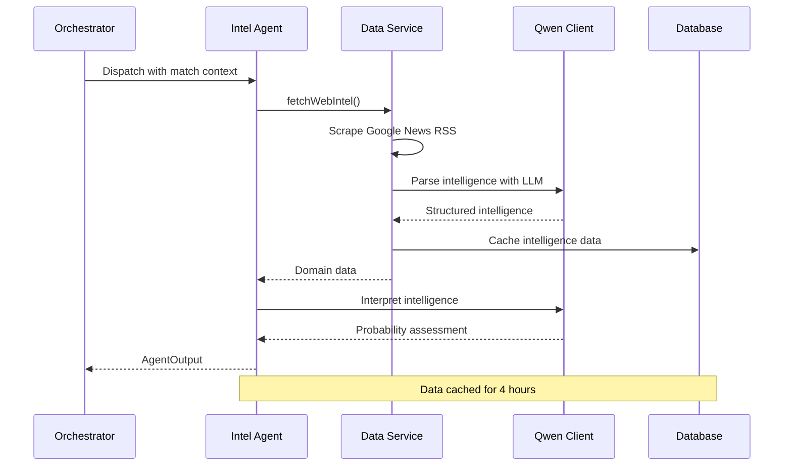
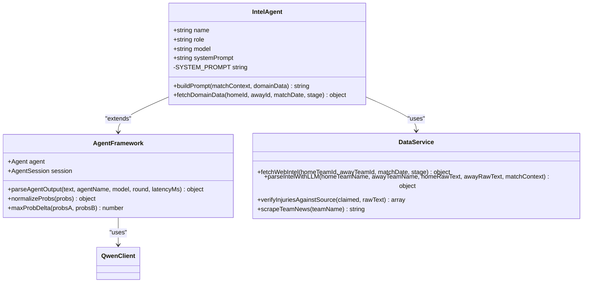
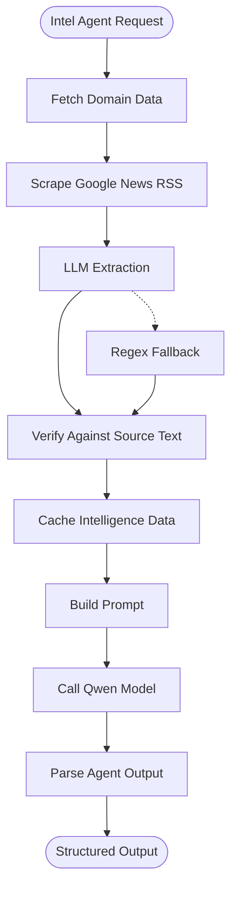
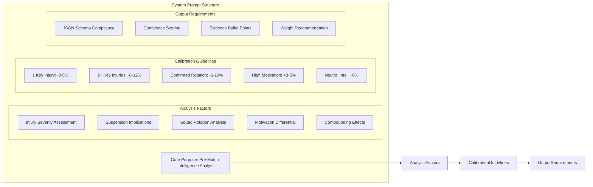
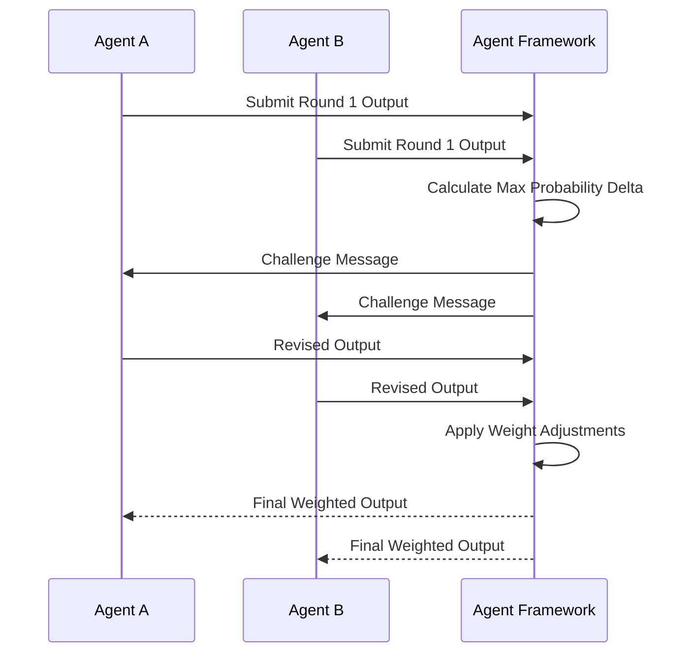
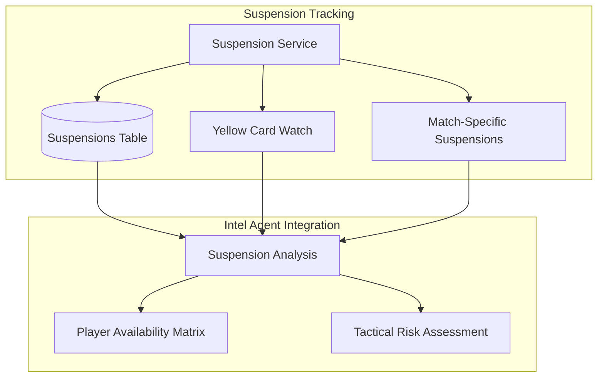
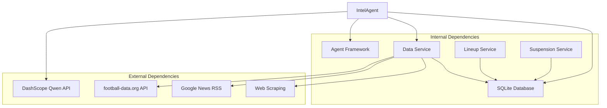

# Intel Agent

<cite>
**Referenced Files in This Document**
- [intelAgent.js](file://backend/services/agents/intelAgent.js)
- [agentFramework.js](file://backend/services/agents/agentFramework.js)
- [orchestratorAgent.js](file://backend/services/agents/orchestratorAgent.js)
- [dataService.js](file://backend/services/dataService.js)
- [suspensionService.js](file://backend/services/suspensionService.js)
- [lineupService.js](file://backend/services/lineupService.js)
- [predictionEngine.js](file://backend/services/predictionEngine.js)
- [qwenClient.js](file://backend/services/qwenClient.js)
- [db.js](file://backend/database/db.js)
- [README.md](file://README.md)
</cite>

## Table of Contents
1. [Introduction](#introduction)
2. [Project Structure](#project-structure)
3. [Core Components](#core-components)
4. [Architecture Overview](#architecture-overview)
5. [Detailed Component Analysis](#detailed-component-analysis)
6. [Dependency Analysis](#dependency-analysis)
7. [Performance Considerations](#performance-considerations)
8. [Troubleshooting Guide](#troubleshooting-guide)
9. [Conclusion](#conclusion)

## Introduction
The Intel Agent is a specialized multi-agent component that processes pre-match intelligence for World Cup 2026 predictions. It focuses on interpreting injury reports, suspension information, tactical intelligence, and motivation factors to adjust probability distributions from the baseline prediction model. The agent operates within a five-agent system that includes Statistical, Form, H2H, Intel, and Lineup specialists, each contributing unique insights through structured reasoning and calibration.

The Intel Agent specifically targets off-pitch factors that influence match outcomes—key player injuries, squad rotation, motivation differentials, and tactical adaptations. It leverages both machine learning extraction from web sources and human-curated verification processes to ensure reliable intelligence interpretation.

## Project Structure
The Intel Agent is part of a larger multi-agent prediction system built with Node.js and integrated with Alibaba Cloud's Qwen AI models. The system follows a modular architecture where each agent specializes in a specific domain while coordinating through a central orchestrator.

**Diagram sources**
- [orchestratorAgent.js:27-473](file://backend/services/agents/orchestratorAgent.js#L27-L473)
- [intelAgent.js:15-126](file://backend/services/agents/intelAgent.js#L15-L126)
- [dataService.js:1-583](file://backend/services/dataService.js#L1-L583)
- [db.js:23-252](file://backend/database/db.js#L23-L252)

**Section sources**
- [README.md:18-105](file://README.md#L18-L105)
- [orchestratorAgent.js:27-473](file://backend/services/agents/orchestratorAgent.js#L27-L473)

## Core Components
The Intel Agent system consists of several interconnected components that work together to process and interpret pre-match intelligence:

### Intel Agent Core
The Intel Agent serves as a dedicated intelligence interpreter that transforms raw web-scraped data into actionable probability adjustments. It operates with a specialized system prompt designed to handle injury severity assessment, suspension implications, and tactical adaptation strategies.

### Data Integration Layer
The agent integrates with multiple external data sources through the Data Service, which handles web scraping, API integration, and intelligent caching. This ensures real-time data synchronization while maintaining performance through strategic caching mechanisms.

### Multi-Agent Framework
The Intel Agent participates in a sophisticated negotiation framework where agents debate conflicting probability assessments. The system automatically detects significant differences (≥20% probability deltas) and engages agents in a structured rebuttal process.

### Output Generation
The agent produces standardized JSON outputs containing probability distributions, confidence scores, evidence bullets, and weight recommendations. This structured format enables seamless integration with the broader prediction system.

**Section sources**
- [intelAgent.js:15-126](file://backend/services/agents/intelAgent.js#L15-L126)
- [agentFramework.js:40-146](file://backend/services/agents/agentFramework.js#L40-L146)
- [dataService.js:30-490](file://backend/services/dataService.js#L30-L490)

## Architecture Overview
The Intel Agent operates within a comprehensive multi-agent architecture that coordinates five specialized agents to produce robust predictions. The system follows a parallel processing model where agents operate independently but contribute to a unified decision-making process.

**Diagram sources**
- [orchestratorAgent.js:302-367](file://backend/services/agents/orchestratorAgent.js#L302-L367)
- [intelAgent.js:48-55](file://backend/services/agents/intelAgent.js#L48-L55)
- [dataService.js:413-490](file://backend/services/dataService.js#L413-L490)

The architecture emphasizes real-time data processing while maintaining reliability through caching and fallback mechanisms. The Intel Agent specifically focuses on pre-match intelligence that can significantly impact game outcomes.

**Section sources**
- [orchestratorAgent.js:290-473](file://backend/services/agents/orchestratorAgent.js#L290-L473)
- [dataService.js:268-490](file://backend/services/dataService.js#L268-L490)

## Detailed Component Analysis

### Intel Agent Implementation
The Intel Agent is implemented as a specialized LLM agent with a carefully crafted system prompt designed to handle complex pre-match intelligence interpretation. The agent operates with a dual-layer approach: initial intelligence extraction followed by structured probability assessment.

**Diagram sources**
- [intelAgent.js:15-126](file://backend/services/agents/intelAgent.js#L15-L126)
- [agentFramework.js:201-320](file://backend/services/agents/agentFramework.js#L201-L320)
- [dataService.js:413-490](file://backend/services/dataService.js#L413-L490)

The Intel Agent's system prompt emphasizes key factors including injury severity assessment, suspension implications, and tactical adaptation strategies. The prompt structure ensures comprehensive coverage of all relevant pre-match factors that could influence match outcomes.

**Section sources**
- [intelAgent.js:20-38](file://backend/services/agents/intelAgent.js#L20-L38)
- [intelAgent.js:62-115](file://backend/services/agents/intelAgent.js#L62-L115)

### Data Integration and Processing Workflow
The Intel Agent relies on sophisticated data integration mechanisms that combine multiple intelligence sources with verification processes to ensure accuracy and reliability.

**Diagram sources**
- [dataService.js:413-490](file://backend/services/dataService.js#L413-L490)
- [dataService.js:294-380](file://backend/services/dataService.js#L294-L380)

The data processing workflow includes multiple verification layers to prevent hallucinations and ensure that intelligence claims are substantiated by source material. This dual-layer approach (LLM extraction with regex fallback) provides robustness against various failure modes.

**Section sources**
- [dataService.js:294-380](file://backend/services/dataService.js#L294-L380)
- [dataService.js:413-490](file://backend/services/dataService.js#L413-L490)

### System Prompt Structure and Calibration
The Intel Agent's system prompt is meticulously designed to handle complex reasoning about injury severity, suspension implications, and tactical adaptation strategies. The prompt includes calibration guidelines that translate observed intelligence into quantified probability shifts.

**Diagram sources**
- [intelAgent.js:20-38](file://backend/services/agents/intelAgent.js#L20-L38)

The calibration guidelines provide specific quantitative impacts for different intelligence scenarios, enabling precise probability adjustments. This structured approach ensures consistency across different intelligence interpretations.

**Section sources**
- [intelAgent.js:29-36](file://backend/services/agents/intelAgent.js#L29-L36)

### Multi-Agent Negotiation Integration
The Intel Agent participates in a sophisticated negotiation framework where agents debate conflicting probability assessments. The system automatically detects significant differences and engages agents in structured rebuttal processes.

**Diagram sources**
- [agentFramework.js:366-435](file://backend/services/agents/agentFramework.js#L366-L435)

The negotiation protocol ensures that agents with strong evidence can defend their positions while maintaining system-wide consistency. The weight adjustment mechanism rewards agents that maintain confidence in their positions.

**Section sources**
- [agentFramework.js:366-493](file://backend/services/agents/agentFramework.js#L366-L493)

### Suspension Integration and Tactical Intelligence
The Intel Agent integrates with the suspension tracking system to provide comprehensive coverage of player availability issues. This integration ensures that suspension-related intelligence is accurately reflected in probability assessments.

**Diagram sources**
- [suspensionService.js:43-83](file://backend/services/suspensionService.js#L43-L83)
- [suspensionService.js:85-105](file://backend/services/suspensionService.js#L85-L105)

The suspension integration provides real-time tracking of yellow card accumulation and red card suspensions, enabling accurate assessment of player availability for upcoming matches.

**Section sources**
- [suspensionService.js:15-83](file://backend/services/suspensionService.js#L15-L83)
- [suspensionService.js:107-151](file://backend/services/suspensionService.js#L107-L151)

## Dependency Analysis
The Intel Agent has several key dependencies that enable its functionality and integration within the broader system.

**Diagram sources**
- [intelAgent.js:16-18](file://backend/services/agents/intelAgent.js#L16-L18)
- [dataService.js:18-28](file://backend/services/dataService.js#L18-L28)
- [qwenClient.js:15-21](file://backend/services/qwenClient.js#L15-L21)

The dependency structure reveals a clear separation between external data sources and internal processing components. This design enables flexibility in adapting to changing data availability while maintaining system stability.

**Section sources**
- [intelAgent.js:16-18](file://backend/services/agents/intelAgent.js#L16-L18)
- [dataService.js:18-28](file://backend/services/dataService.js#L18-L28)

## Performance Considerations
The Intel Agent system incorporates several performance optimization strategies to ensure efficient operation while maintaining accuracy and reliability.

### Caching Strategy
The system implements intelligent caching mechanisms that balance freshness with performance. Intelligence data is cached for four hours, allowing for rapid retrieval while ensuring data currency.

### Parallel Processing
The multi-agent architecture enables parallel processing of intelligence data, reducing overall processing time and improving system responsiveness.

### Error Handling and Resilience
The system includes comprehensive error handling mechanisms that gracefully handle API failures, network timeouts, and data inconsistencies. Fallback mechanisms ensure system continuity even when primary data sources are unavailable.

### Memory Management
The agent framework includes memory management strategies that prevent resource exhaustion during intensive processing periods.

## Troubleshooting Guide
Common issues and their solutions when working with the Intel Agent system:

### API Key Configuration
Ensure that the DASHSCOPE_API_KEY environment variable is properly configured. Without this key, the system cannot make Qwen API calls and will fall back to template-based responses.

### Data Source Failures
Monitor the status of external data sources including football-data.org API and Google News RSS feeds. Implement monitoring for service degradation and plan appropriate fallback strategies.

### Model Response Parsing
The system includes robust JSON parsing with fallback mechanisms. Monitor for parsing errors that may indicate model response format changes or API modifications.

### Database Connectivity
Ensure proper database connectivity and schema initialization. The system requires specific tables and indexes to function correctly.

**Section sources**
- [qwenClient.js:60-101](file://backend/services/qwenClient.js#L60-L101)
- [db.js:23-252](file://backend/database/db.js#L23-L252)

## Conclusion
The Intel Agent represents a sophisticated component within a comprehensive multi-agent prediction system. Its specialized focus on pre-match intelligence interpretation, combined with robust data integration and verification mechanisms, enables accurate assessment of factors that significantly influence match outcomes.

The agent's integration with the broader system ensures that intelligence insights are effectively combined with other analytical approaches to produce comprehensive predictions. The structured negotiation framework further enhances prediction quality by incorporating diverse perspectives and maintaining consistency across different analytical approaches.

Through careful system design, performance optimization, and comprehensive error handling, the Intel Agent provides reliable intelligence processing capabilities essential for accurate World Cup 2026 predictions.