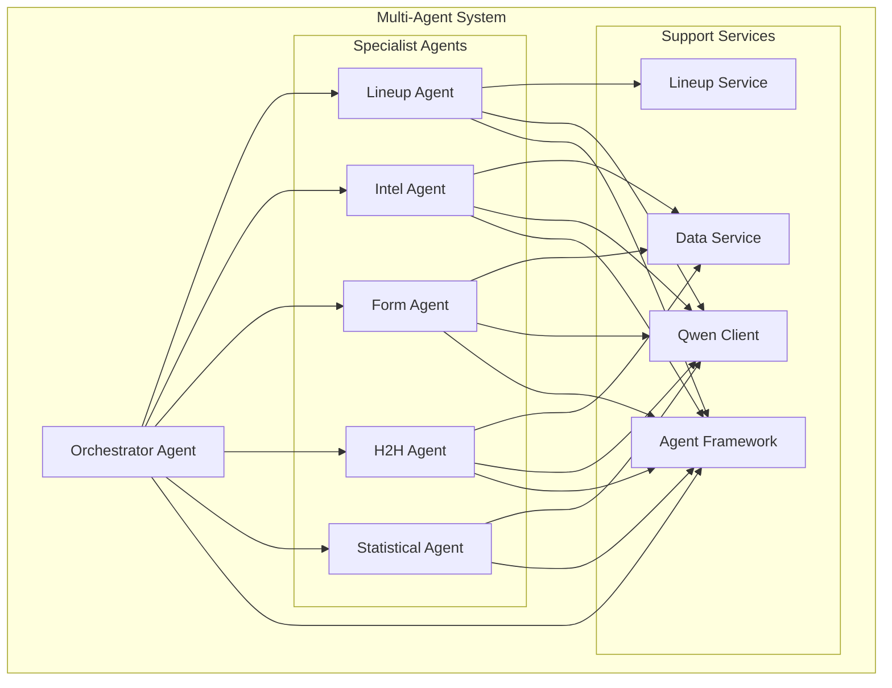
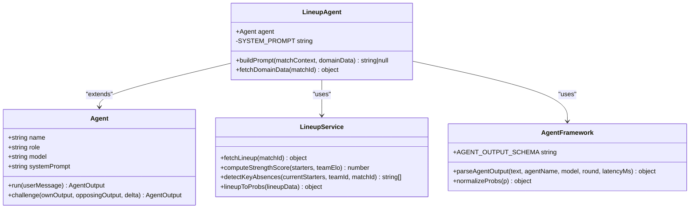
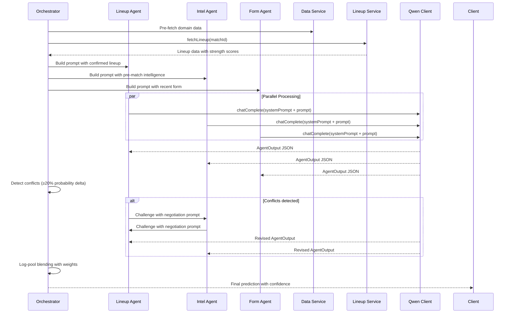
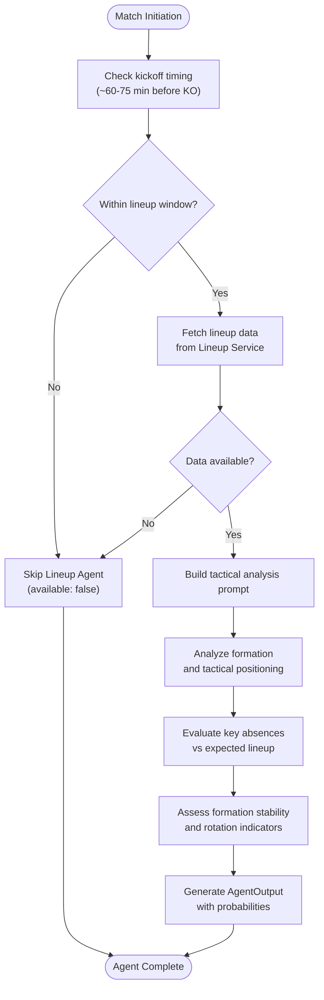
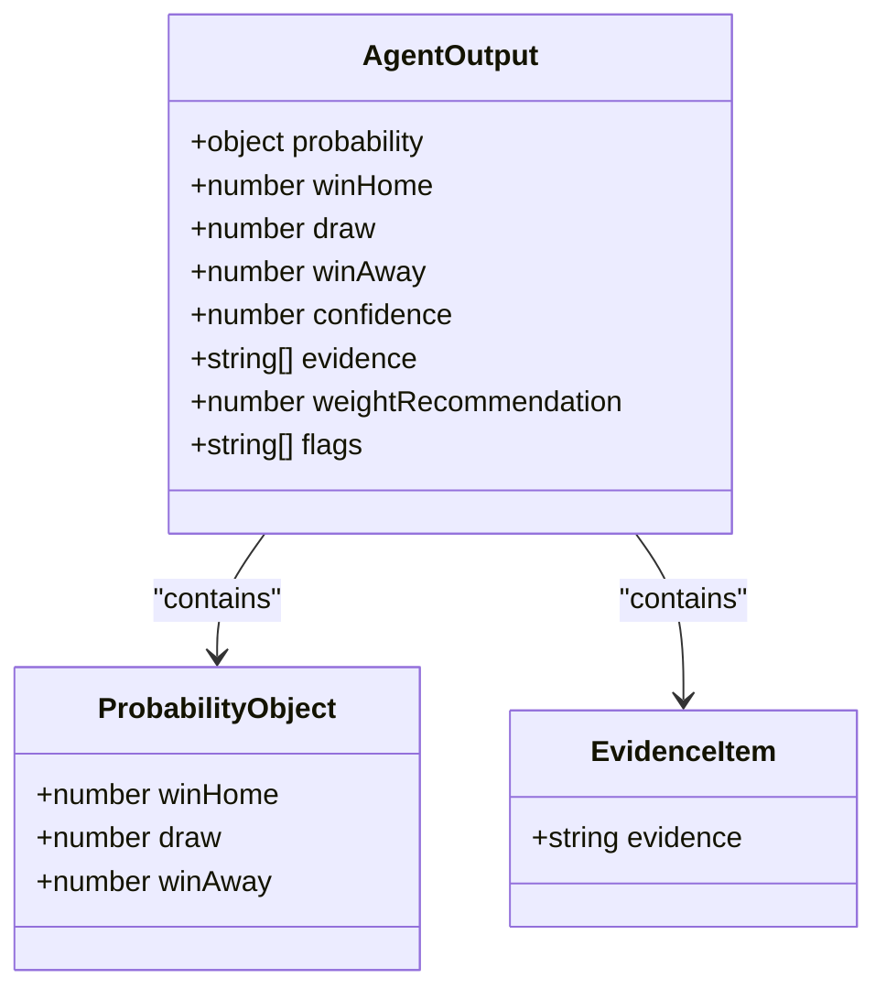
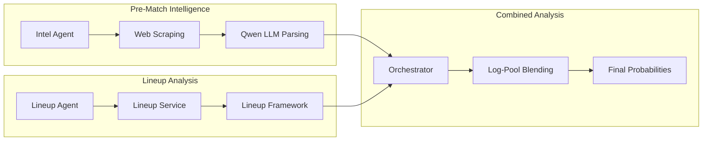
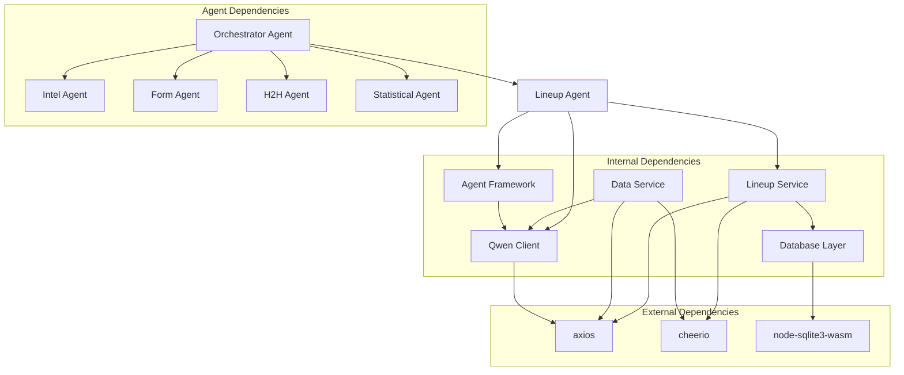

# Lineup Agent

<cite>
**Referenced Files in This Document**
- [lineupAgent.js](file://backend/services/agents/lineupAgent.js)
- [lineupService.js](file://backend/services/lineupService.js)
- [agentFramework.js](file://backend/services/agents/agentFramework.js)
- [orchestratorAgent.js](file://backend/services/agents/orchestratorAgent.js)
- [qwenClient.js](file://backend/services/qwenClient.js)
- [dataService.js](file://backend/services/dataService.js)
- [db.js](file://backend/database/db.js)
- [predictionEngine.js](file://backend/services/predictionEngine.js)
</cite>

## Table of Contents
1. [Introduction](#introduction)
2. [Project Structure](#project-structure)
3. [Core Components](#core-components)
4. [Architecture Overview](#architecture-overview)
5. [Detailed Component Analysis](#detailed-component-analysis)
6. [Dependency Analysis](#dependency-analysis)
7. [Performance Considerations](#performance-considerations)
8. [Troubleshooting Guide](#troubleshooting-guide)
9. [Conclusion](#conclusion)

## Introduction
The Lineup Agent is a specialized multi-agent component responsible for analyzing confirmed starting XI data and formation systems in World Cup 2026 matches. It operates on a strict timing window (~60-75 minutes before kickoff) when lineup data becomes available, providing high-confidence tactical assessments that resolve uncertainty about actual playing personnel.

The agent focuses on formation analysis, tactical positioning, player roles, and team shape evaluation while integrating with the broader multi-agent prediction system. It serves as a crucial bridge between raw lineup data and strategic probability modeling, carrying the highest signal weight (0.40) among all agents due to the certainty of confirmed lineups.

## Project Structure
The Lineup Agent is part of a sophisticated multi-agent system that combines specialized agents for different aspects of football analysis:

**Diagram sources**
- [orchestratorAgent.js:280-473](file://backend/services/agents/orchestratorAgent.js#L280-L473)
- [lineupAgent.js:14-118](file://backend/services/agents/lineupAgent.js#L14-L118)

**Section sources**
- [lineupAgent.js:1-118](file://backend/services/agents/lineupAgent.js#L1-L118)
- [orchestratorAgent.js:1-473](file://backend/services/agents/orchestratorAgent.js#L1-L473)

## Core Components

### Lineup Agent Implementation
The Lineup Agent is implemented as a specialized Agent class with a focused system prompt and domain-specific logic:

**Diagram sources**
- [lineupAgent.js:110-118](file://backend/services/agents/lineupAgent.js#L110-L118)
- [agentFramework.js:201-320](file://backend/services/agents/agentFramework.js#L201-L320)

### Formation Analysis Capabilities
The agent analyzes several key aspects of formation systems:

- **Tactical Positioning**: Evaluates formation effectiveness based on positional importance weights
- **Player Roles**: Assesses key player absences and their impact on team shape
- **Team Shape Evaluation**: Analyzes formation matchups and tactical coherence
- **Captain Selection**: Considers captaincy impact on player ratings
- **Formation Stability**: Evaluates whether teams appear to be playing weakened or rotated sides

**Section sources**
- [lineupAgent.js:18-37](file://backend/services/agents/lineupAgent.js#L18-L37)
- [lineupService.js:46-60](file://backend/services/lineupService.js#L46-L60)

## Architecture Overview

### Multi-Agent Prediction Workflow
The Lineup Agent participates in a sophisticated two-round negotiation system:

**Diagram sources**
- [orchestratorAgent.js:290-473](file://backend/services/agents/orchestratorAgent.js#L290-L473)
- [agentFramework.js:326-562](file://backend/services/agents/agentFramework.js#L326-L562)

### Lineup Processing Workflow
The agent follows a structured workflow for processing lineup data:

**Diagram sources**
- [lineupAgent.js:61-107](file://backend/services/agents/lineupAgent.js#L61-L107)
- [lineupService.js:221-316](file://backend/services/lineupService.js#L221-L316)

**Section sources**
- [lineupAgent.js:44-51](file://backend/services/agents/lineupAgent.js#L44-L51)
- [lineupService.js:221-316](file://backend/services/lineupService.js#L221-L316)

## Detailed Component Analysis

### System Prompt Analysis
The Lineup Agent's system prompt establishes clear analytical guidelines:

**Key Analytical Focus Areas:**
- Lineup strength scores (0-10 scale) and team strength delta calculations
- Key player absences evaluation compared to expected lineup patterns
- Formation matchup effectiveness analysis
- Team rotation and weakened side identification
- Tactical positioning impact assessment

**Confidence Calibration Guidelines:**
- Strength delta > +2.0: Home team clearly stronger with meaningful home advantage
- Strength delta -0.5 to +0.5: Lineups roughly equal
- Weight recommendation: 0.35-0.45 for confirmed lineup data

**Section sources**
- [lineupAgent.js:18-37](file://backend/services/agents/lineupAgent.js#L18-L37)

### Output Format Specification
The agent produces standardized JSON output following the AGENT_OUTPUT_SCHEMA:

**Diagram sources**
- [agentFramework.js:40-53](file://backend/services/agents/agentFramework.js#L40-L53)

**Output Components:**
- **Probability Distribution**: Three-way win/draw/lose probabilities that sum to 1.0
- **Confidence Score**: 0-1 scale representing agent certainty
- **Evidence Array**: 2-4 concise bullet points (≤80 characters each)
- **Weight Recommendation**: 0-1 scale for signal integration (0.35-0.45 for lineup)
- **Flags**: Optional tags for special conditions

**Section sources**
- [agentFramework.js:40-53](file://backend/services/agents/agentFramework.js#L40-L53)
- [lineupAgent.js:109-118](file://backend/services/agents/lineupAgent.js#L109-L118)

### Formation Analysis Engine
The Lineup Service provides sophisticated formation analysis through:

**Position Importance Weights:**
- Goalkeeper: 1.5 (critical defensive role)
- Centre-backs: 1.0 each (×2 for defensive stability)
- Wing-backs: 0.6 each (×2 for attacking width)
- Defensive midfield: 0.85 each (×2 for defensive shield)
- Attacking midfield: 0.75 each (×2 for creative play)
- Strikers: 1.3 (highest offensive impact)

**Strength Calculation Method:**
- Base rating approximation from team ELO
- Position-weighted contribution calculation
- Captain/starter variance (+3/-3 rating adjustment)
- Normalized 0-10 scale output

**Section sources**
- [lineupService.js:46-60](file://backend/services/lineupService.js#L46-L60)
- [lineupService.js:158-183](file://backend/services/lineupService.js#L158-L183)

### Integration with Intel Agent
The Lineup Agent coordinates with the Intel Agent for comprehensive match analysis:

**Diagram sources**
- [orchestratorAgent.js:304-367](file://backend/services/agents/orchestratorAgent.js#L304-L367)
- [dataService.js:413-490](file://backend/services/dataService.js#L413-L490)

**Section sources**
- [orchestratorAgent.js:304-367](file://backend/services/agents/orchestratorAgent.js#L304-L367)
- [dataService.js:413-490](file://backend/services/dataService.js#L413-L490)

### Real-Time Lineup Adjustments
The system supports real-time lineup adjustments during match analysis:

**Integration Points:**
- Database caching for lineup persistence
- Dynamic captain selection consideration
- Key absence detection using historical lineup patterns
- Impact score conversion to probability adjustments

**Section sources**
- [lineupService.js:318-362](file://backend/services/lineupService.js#L318-L362)
- [lineupService.js:399-422](file://backend/services/lineupService.js#L399-L422)

## Dependency Analysis

### Component Dependencies
The Lineup Agent has well-defined dependencies within the multi-agent ecosystem:

**Diagram sources**
- [lineupAgent.js:14-16](file://backend/services/agents/lineupAgent.js#L14-L16)
- [lineupService.js:41-43](file://backend/services/lineupService.js#L41-L43)
- [qwenClient.js:13-39](file://backend/services/qwenClient.js#L13-L39)

### Data Flow Dependencies
The agent participates in a complex data flow system:

**Primary Data Sources:**
- Lineup Service: Confirmed starting XI data
- Data Service: Pre-match intelligence (injuries, motivation)
- Database: Historical lineup patterns and team statistics

**Integration Points:**
- Agent Framework: Standardized output format and negotiation protocol
- Orchestrator: Multi-agent coordination and conflict resolution
- Qwen Client: LLM inference with retry mechanisms

**Section sources**
- [lineupService.js:221-316](file://backend/services/lineupService.js#L221-L316)
- [agentFramework.js:568-576](file://backend/services/agents/agentFramework.js#L568-L576)

## Performance Considerations

### Timing Constraints
The Lineup Agent operates within strict temporal constraints:
- **Activation Window**: ~60-75 minutes before kickoff
- **Data Availability**: Confirmed lineup data only
- **Processing Priority**: Highest signal weight (0.40) among all agents

### Computational Efficiency
- **Parallel Processing**: Agents execute concurrently during Round 1
- **Retry Mechanisms**: Automatic retry for LLM failures with exponential backoff
- **Memory Management**: Lightweight JSON parsing and output validation
- **Database Caching**: Persistent storage reduces redundant API calls

### Scalability Factors
- **Model Selection**: Qwen Plus model balances cost and capability
- **Output Validation**: Robust JSON extraction prevents downstream failures
- **Conflict Resolution**: Efficient pairwise comparison algorithm
- **Weight Adjustment**: Dynamic weight scaling based on negotiation outcomes

## Troubleshooting Guide

### Common Issues and Resolutions

**Lineup Data Unavailable**
- **Symptom**: Agent prompt returns null, agent skipped
- **Cause**: Outside lineup release window or API failure
- **Resolution**: Wait for confirmed lineup data or manual entry

**JSON Parsing Failures**
- **Symptom**: AgentOutput contains PARSE_ERROR flag
- **Cause**: LLM response format violations
- **Resolution**: Retry with stricter system prompt enforcement

**LLM API Failures**
- **Symptom**: AgentOutput with fallback values
- **Cause**: Network timeouts or service unavailability
- **Resolution**: Automatic retry with exponential backoff

**Section sources**
- [agentFramework.js:112-146](file://backend/services/agents/agentFramework.js#L112-L146)
- [lineupAgent.js:44-51](file://backend/services/agents/lineupAgent.js#L44-L51)

### Database Integration Issues
- **Schema Mismatch**: Missing table or column definitions
- **Constraint Violations**: Unique key conflicts in lineup storage
- **Migration Failures**: Version upgrade issues

**Section sources**
- [db.js:63-81](file://backend/database/db.js#L63-L81)
- [db.js:228-249](file://backend/database/db.js#L228-L249)

## Conclusion

The Lineup Agent represents a sophisticated component within the multi-agent prediction system, specializing in confirmed starting XI analysis and formation evaluation. Its integration with the broader system provides several key advantages:

**Strategic Value:**
- Resolves uncertainty about actual playing personnel
- Provides high-confidence tactical assessments
- Enables formation matchup analysis and player role evaluation
- Supports real-time lineup adjustments during match analysis

**Technical Excellence:**
- Well-defined output format ensures consistent integration
- Robust error handling and retry mechanisms
- Efficient parallel processing architecture
- Comprehensive conflict resolution system

**System Integration:**
- Seamless coordination with Intel Agent for comprehensive analysis
- Standardized interface compatible with multi-agent framework
- Persistent data storage for historical pattern recognition
- Flexible weight adjustment based on negotiation outcomes

The agent's design demonstrates best practices in AI-powered sports analytics, combining domain expertise with advanced machine learning capabilities to deliver actionable insights for match prediction and analysis.