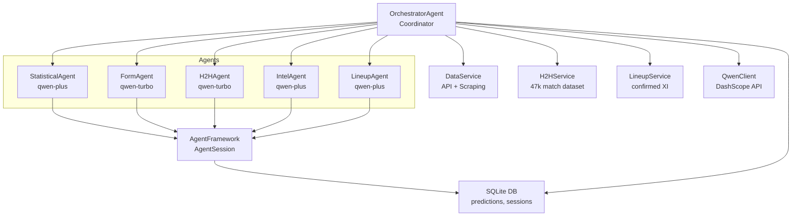
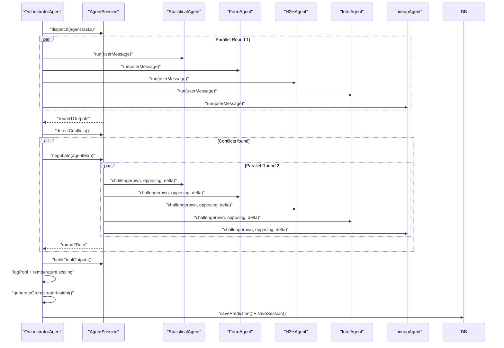
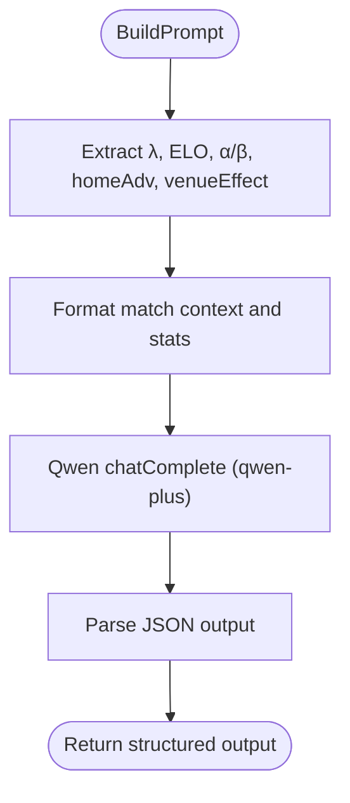
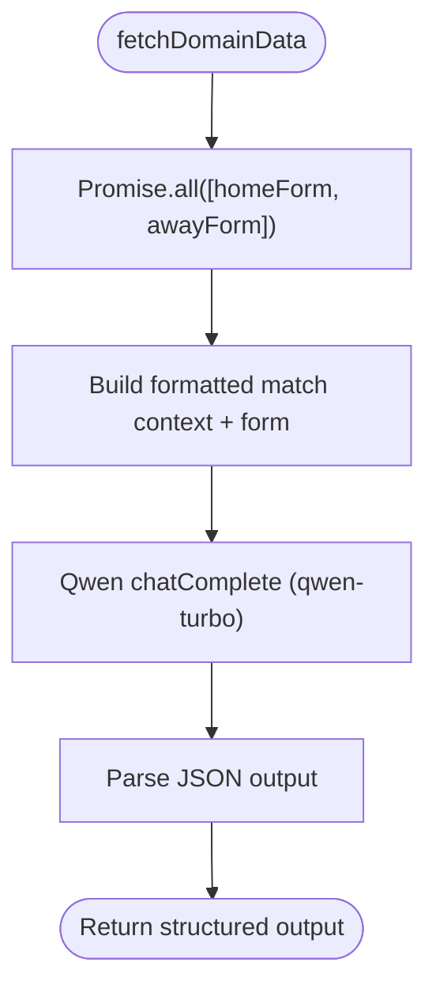
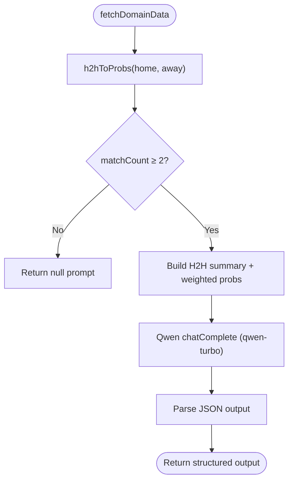
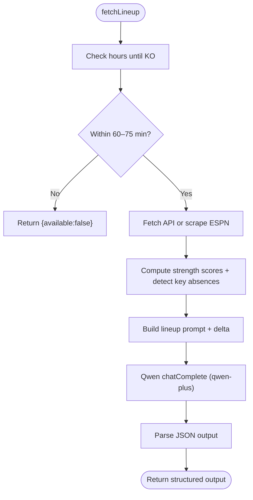
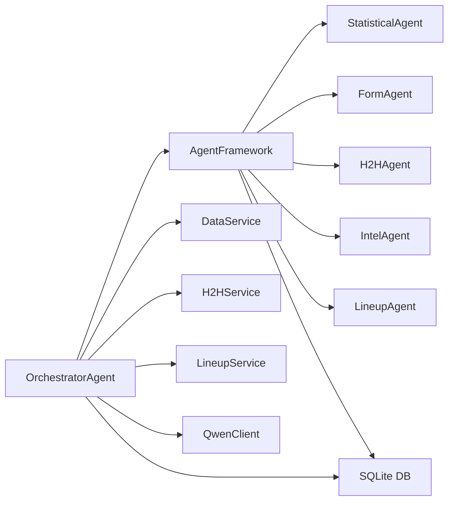

# Specialized Agents

<cite>
**Referenced Files in This Document**
- [statisticalAgent.js](file://backend/services/agents/statisticalAgent.js)
- [formAgent.js](file://backend/services/agents/formAgent.js)
- [h2hAgent.js](file://backend/services/agents/h2hAgent.js)
- [intelAgent.js](file://backend/services/agents/intelAgent.js)
- [lineupAgent.js](file://backend/services/agents/lineupAgent.js)
- [orchestratorAgent.js](file://backend/services/agents/orchestratorAgent.js)
- [agentFramework.js](file://backend/services/agents/agentFramework.js)
- [dataService.js](file://backend/services/dataService.js)
- [h2hService.js](file://backend/services/h2hService.js)
- [lineupService.js](file://backend/services/lineupService.js)
- [qwenClient.js](file://backend/services/qwenClient.js)
- [db.js](file://backend/database/db.js)
- [README.md](file://README.md)
</cite>

## Table of Contents
1. [Introduction](#introduction)
2. [Project Structure](#project-structure)
3. [Core Components](#core-components)
4. [Architecture Overview](#architecture-overview)
5. [Detailed Component Analysis](#detailed-component-analysis)
6. [Dependency Analysis](#dependency-analysis)
7. [Performance Considerations](#performance-considerations)
8. [Troubleshooting Guide](#troubleshooting-guide)
9. [Conclusion](#conclusion)

## Introduction
This document explains the five specialized AI agents that power the multi-agent prediction system for the World Cup 2026 tournament. Each agent focuses on a distinct domain: Statistical (Dixon-Coles model interpretation and ELO rating analysis), Form (recent performance trends and momentum), H2H (head-to-head historical data and pattern recognition), Intel (injury reports, suspensions, and tactical intelligence), and Lineup (confirmed starting XI and formation analysis). For each agent, we describe data sources, processing workflows, system prompts, output formats, domain expertise, configuration options, performance characteristics, and integration patterns with the orchestration system.

## Project Structure
The agents are implemented as modular services within the backend, orchestrated by a central coordinator that manages parallel execution, conflict detection, and final probability blending. The system integrates with external APIs and web scraping to gather real-time data, while persisting agent sessions and predictions to a local SQLite database.



**Diagram sources**
- [orchestratorAgent.js:278-471](file://backend/services/agents/orchestratorAgent.js#L278-L471)
- [agentFramework.js:198-576](file://backend/services/agents/agentFramework.js#L198-L576)
- [dataService.js:413-490](file://backend/services/dataService.js#L413-L490)
- [h2hService.js:272-312](file://backend/services/h2hService.js#L272-L312)
- [lineupService.js:221-362](file://backend/services/lineupService.js#L221-L362)
- [qwenClient.js:13-123](file://backend/services/qwenClient.js#L13-L123)
- [db.js:23-252](file://backend/database/db.js#L23-L252)

**Section sources**
- [README.md:18-105](file://README.md#L18-L105)
- [orchestratorAgent.js:278-471](file://backend/services/agents/orchestratorAgent.js#L278-L471)

## Core Components
- Agent framework: Defines the Agent and AgentSession classes, JSON output schema, conflict detection, negotiation protocol, and persistence.
- Qwen client: Provides OpenAI-compatible chat completions using DashScope.
- Data services: Fetch team form, H2H records, and web intelligence (injuries, motivation, rotation) via API and web scraping.
- H2H service: Loads and queries a 47k-match international results dataset with competition weighting and recency.
- Lineup service: Confirms starting XI, computes strength scores, detects key absences, and converts lineup impact to probabilities.
- Orchestrator: Coordinates agent dispatch, conflict detection, negotiation, and final probability blending.

**Section sources**
- [agentFramework.js:36-146](file://backend/services/agents/agentFramework.js#L36-L146)
- [qwenClient.js:13-123](file://backend/services/qwenClient.js#L13-L123)
- [dataService.js:68-133](file://backend/services/dataService.js#L68-L133)
- [h2hService.js:70-165](file://backend/services/h2hService.js#L70-L165)
- [lineupService.js:158-218](file://backend/services/lineupService.js#L158-L218)
- [orchestratorAgent.js:300-471](file://backend/services/agents/orchestratorAgent.js#L300-L471)

## Architecture Overview
The multi-agent system runs in two rounds:
- Round 1: All agents run in parallel, producing structured JSON outputs with probabilities, confidence, evidence, weight recommendation, and optional flags.
- Conflict detection: Pairwise comparison checks if any outcome probability delta exceeds 20%.
- Round 2 (negotiation): Conflicting agents exchange rebuttals; the agent that moves less “wins” and receives a 1.3× weight boost, while the other’s weight is reduced to 0.6×.
- Final synthesis: Probabilities are blended using a log-pool method with adjusted weights and temperature scaling, then mapped to scoreline probabilities.



**Diagram sources**
- [orchestratorAgent.js:367-471](file://backend/services/agents/orchestratorAgent.js#L367-L471)
- [agentFramework.js:340-562](file://backend/services/agents/agentFramework.js#L340-L562)

**Section sources**
- [agentFramework.js:198-576](file://backend/services/agents/agentFramework.js#L198-L576)
- [orchestratorAgent.js:386-471](file://backend/services/agents/orchestratorAgent.js#L386-L471)

## Detailed Component Analysis

### Statistical Agent
- Purpose: Interpret Dixon-Coles model backbone output (λ values, ELO ratings, attack/defense α/β parameters, home advantage, venue effect) and translate it into a natural-language probability opinion.
- Data sources:
  - Precomputed backbone from the prediction engine (λ_home, λ_away, backbone probabilities, homeAdv, venueEffect).
  - Team ELO and ranking data from match context.
- Processing workflow:
  - Build a structured prompt containing λ values, ELO differential, α/β ratings, and contextual factors.
  - Run LLM inference with qwen-plus.
  - Return JSON with probability distribution, confidence, evidence bullets, weight recommendation, and optional flags.
- System prompt focus areas:
  - Expected goals interpretation (attacking intent, defensive quality).
  - ELO gap significance and historical impact.
  - Attack/defense rating differentials.
  - Home advantage and venue effects.
- Output format: JSON schema enforced by the agent framework.
- Domain expertise: Bivariate Poisson goal modeling, ELO rating systems, and statistical reasoning anchored to precomputed numbers.
- Configuration and performance:
  - Model: qwen-plus.
  - Weight recommendation: used as-is in final synthesis; no negotiation.
  - Always active; no skip conditions.



**Diagram sources**
- [statisticalAgent.js:42-87](file://backend/services/agents/statisticalAgent.js#L42-L87)
- [agentFramework.js:112-146](file://backend/services/agents/agentFramework.js#L112-L146)

**Section sources**
- [statisticalAgent.js:1-98](file://backend/services/agents/statisticalAgent.js#L1-L98)
- [agentFramework.js:36-53](file://backend/services/agents/agentFramework.js#L36-L53)

### Form Agent
- Purpose: Analyze recent team performance trends using the last 10 matches, emphasizing momentum, scoring/conceding trends, and competition quality weighting.
- Data sources:
  - Team form via API (football-data.org) or web scraping fallback.
  - Competition weighting scheme embedded in the prompt.
- Processing workflow:
  - Fetch home and away form in parallel.
  - Build a formatted prompt summarizing last 10 results, goals for/between, and competition quality.
  - Run LLM inference with qwen-turbo.
- System prompt focus areas:
  - Momentum sequences and recency.
  - Goals for/conceded patterns.
  - Competition quality (WC finals > qualifiers > NL > friendlies).
  - Rest tendencies in friendlies.
- Output format: JSON schema with probability distribution, confidence, evidence bullets, weight recommendation.
- Domain expertise: Recent form analysis, competition weighting, and trend interpretation.
- Configuration and performance:
  - Model: qwen-turbo.
  - Weight recommendation: moderate; negotiable.
  - Active only if form data is available.



**Diagram sources**
- [formAgent.js:42-48](file://backend/services/agents/formAgent.js#L42-L48)
- [formAgent.js:65-102](file://backend/services/agents/formAgent.js#L65-L102)
- [agentFramework.js:112-146](file://backend/services/agents/agentFramework.js#L112-L146)

**Section sources**
- [formAgent.js:1-113](file://backend/services/agents/formAgent.js#L1-L113)
- [dataService.js:68-133](file://backend/services/dataService.js#L68-L133)

### H2H Agent
- Purpose: Interpret competition-weighted head-to-head records from a 47k-match dataset and assess historical patterns’ predictive value for the upcoming World Cup match.
- Data sources:
  - Real H2H dataset via h2hService (seeded locally).
  - Competition weighting scheme and recency weighting.
- Processing workflow:
  - Fetch H2H data for the pair; skip if fewer than 2 meetings.
  - Build prompt with total meetings, WC meetings, raw record, weighted probabilities, and last meeting.
  - Run LLM inference with qwen-turbo.
- System prompt focus areas:
  - Win/draw/loss ratios and dominance signals.
  - WC meetings and recency.
  - Quality weighting and small-sample caution.
- Output format: JSON schema; returns null prompt if insufficient data.
- Domain expertise: Historical pattern recognition, weighting schemes, and predictive interpretation.
- Configuration and performance:
  - Model: qwen-turbo.
  - Weight recommendation: depends on data quality; negotiable.
  - Skips when matchCount < 2.



**Diagram sources**
- [h2hAgent.js:38-45](file://backend/services/agents/h2hAgent.js#L38-L45)
- [h2hAgent.js:52-96](file://backend/services/agents/h2hAgent.js#L52-L96)
- [h2hService.js:272-312](file://backend/services/h2hService.js#L272-L312)
- [agentFramework.js:112-146](file://backend/services/agents/agentFramework.js#L112-L146)

**Section sources**
- [h2hAgent.js:1-107](file://backend/services/agents/h2hAgent.js#L1-L107)
- [h2hService.js:272-312](file://backend/services/h2hService.js#L272-L312)

### Intel Agent
- Purpose: Interpret pre-match intelligence (injuries, suspensions, squad rotation, motivation) and quantify its impact on outcome probabilities.
- Data sources:
  - Web scraping Google News RSS for both teams.
  - Structured extraction via Qwen (primary) or regex fallback.
- Processing workflow:
  - Scrape raw news for both teams in parallel.
  - Attempt LLM parsing; fall back to regex extraction if needed.
  - Build prompt highlighting injuries, rotation, form narrative, motivation, and key summary.
  - Run LLM inference with qwen-plus.
- System prompt focus areas:
  - Key injury impacts and confirmed rotation.
  - Motivation differential (must-win vs dead rubber).
  - Compounding effects (multiple absences/low motivation).
- Output format: JSON schema; returns neutral distribution if no intel.
- Domain expertise: Off-pitch factors, risk assessment, and calibrated probability nudges.
- Configuration and performance:
  - Model: qwen-plus.
  - Weight recommendation: moderate; negotiable.
  - Active only if intel data is available.

```mermaid
flowchart TD
Start(["fetchWebIntel"]) --> ParallelScrape["Parallel scrape home/away news"]
ParallelScrape --> LLM["parseIntelWithLLM (qwen-plus)"]
alt LLM fails
LLM --> Fallback["scrapeInjuriesFallback (regex)"]
end
LLM --> BuildPrompt["Build intel prompt + key summary"]
Fallback --> BuildPrompt
BuildPrompt --> LLM2["Qwen chatComplete (qwen-plus)"]
LLM2 --> Parse["Parse JSON output"]
Parse --> Return(["Return structured output"])
```

**Diagram sources**
- [intelAgent.js:48-55](file://backend/services/agents/intelAgent.js#L48-L55)
- [intelAgent.js:62-115](file://backend/services/agents/intelAgent.js#L62-L115)
- [dataService.js:413-490](file://backend/services/dataService.js#L413-L490)
- [agentFramework.js:112-146](file://backend/services/agents/agentFramework.js#L112-L146)

**Section sources**
- [intelAgent.js:1-126](file://backend/services/agents/intelAgent.js#L1-L126)
- [dataService.js:294-490](file://backend/services/dataService.js#L294-L490)

### Lineup Agent
- Purpose: Analyze confirmed starting XI strength, formation matchups, and key absences to refine outcome probabilities.
- Data sources:
  - Confirmed lineups (~60–75 min before kickoff) via API or web scraping.
  - Strength scoring derived from position weights and ELO-based ratings.
- Processing workflow:
  - Check availability and time proximity to kickoff.
  - Compute strength scores and detect key absences vs recent patterns.
  - Build prompt with formations, starters, strength scores, and key absences.
  - Run LLM inference with qwen-plus.
- System prompt focus areas:
  - Lineup strength scores and delta between teams.
  - Key absences amplifying the delta.
  - Formation matchups and tactical implications.
- Output format: JSON schema; returns null prompt if lineup unavailable.
- Domain expertise: Tactical reasoning, lineup strength modeling, and formation analysis.
- Configuration and performance:
  - Model: qwen-plus.
  - Weight recommendation: high (0.35–0.45) due to high reliability.
  - Activates only when lineup is confirmed; otherwise skipped.



**Diagram sources**
- [lineupAgent.js:44-51](file://backend/services/agents/lineupAgent.js#L44-L51)
- [lineupAgent.js:61-107](file://backend/services/agents/lineupAgent.js#L61-L107)
- [lineupService.js:221-362](file://backend/services/lineupService.js#L221-L362)
- [agentFramework.js:112-146](file://backend/services/agents/agentFramework.js#L112-L146)

**Section sources**
- [lineupAgent.js:1-118](file://backend/services/agents/lineupAgent.js#L1-L118)
- [lineupService.js:158-218](file://backend/services/lineupService.js#L158-L218)

## Dependency Analysis
The agents depend on shared infrastructure:
- Agent framework enforces output schema, conflict detection, and persistence.
- Qwen client provides unified model access with retry/backoff logic.
- Data services abstract API and scraping layers for form, H2H, and intel.
- H2H service encapsulates dataset seeding and weighted probability computation.
- Lineup service manages lineup retrieval, strength scoring, and key absence detection.
- Orchestrator coordinates pre-fetching, dispatch, negotiation, and final synthesis.



**Diagram sources**
- [agentFramework.js:198-576](file://backend/services/agents/agentFramework.js#L198-L576)
- [orchestratorAgent.js:300-471](file://backend/services/agents/orchestratorAgent.js#L300-L471)
- [dataService.js:68-133](file://backend/services/dataService.js#L68-L133)
- [h2hService.js:70-165](file://backend/services/h2hService.js#L70-L165)
- [lineupService.js:158-218](file://backend/services/lineupService.js#L158-L218)
- [qwenClient.js:13-123](file://backend/services/qwenClient.js#L13-L123)
- [db.js:23-252](file://backend/database/db.js#L23-L252)

**Section sources**
- [agentFramework.js:198-576](file://backend/services/agents/agentFramework.js#L198-L576)
- [orchestratorAgent.js:300-471](file://backend/services/agents/orchestratorAgent.js#L300-L471)

## Performance Considerations
- Throughput: Agents use qwen-turbo for Form and H2H to maximize throughput; qwen-plus for agents requiring deeper reasoning (Statistical, Intel, Lineup).
- Latency: AgentSession runs Round 1 in parallel; negotiation (Round 2) is also parallelized. QwenClient includes retry/backoff logic.
- Conflict threshold: 20% probability delta triggers negotiation; winners gain 1.3× weight, losers drop to 0.6×.
- Blending: Log-pool with temperature scaling ensures robust aggregation; weights are normalized per agent output.
- Data freshness: Caching strategies for form, H2H, and intel reduce repeated network calls; lineup activation window (~60–75 min before KO) minimizes speculative analysis.

[No sources needed since this section provides general guidance]

## Troubleshooting Guide
- Missing DashScope API key: QwenClient throws an error; the system cannot call LLMs. Ensure DASHSCOPE_API_KEY is set.
- Agent output parsing failures: Agent.run and Agent.challenge include JSON extraction with fallbacks and retries; parse errors are logged and treated conservatively.
- Insufficient H2H data: H2HAgent returns a null prompt when matchCount < 2; Orchestrator skips the agent.
- No lineup available: LineupAgent returns null prompt when outside the activation window; Orchestrator skips the agent.
- Data service failures: DataService wraps API and scraping calls with try/catch and caches fallbacks; failures are logged and do not block the pipeline.
- Database initialization: db.js initializes schema and migrations; stale locks are removed automatically.

**Section sources**
- [qwenClient.js:60-101](file://backend/services/qwenClient.js#L60-L101)
- [agentFramework.js:221-320](file://backend/services/agents/agentFramework.js#L221-L320)
- [h2hAgent.js:55-61](file://backend/services/agents/h2hAgent.js#L55-L61)
- [lineupAgent.js:64-66](file://backend/services/agents/lineupAgent.js#L64-L66)
- [dataService.js:413-490](file://backend/services/dataService.js#L413-L490)
- [db.js:10-252](file://backend/database/db.js#L10-L252)

## Conclusion
The five-agent system combines domain-specific expertise with rigorous negotiation and blending to produce robust, interpretable match predictions. Each agent contributes unique insights—statistical backbone interpretation, recent form, historical patterns, off-pitch intelligence, and confirmed lineup strength—while the orchestrator ensures consistency, resolves disagreements, and synthesizes final outcomes with calibrated confidence.

[No sources needed since this section summarizes without analyzing specific files]