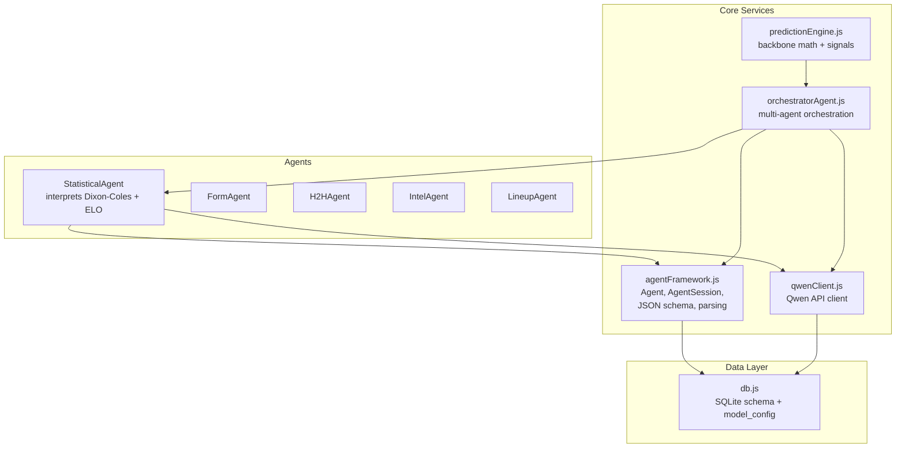
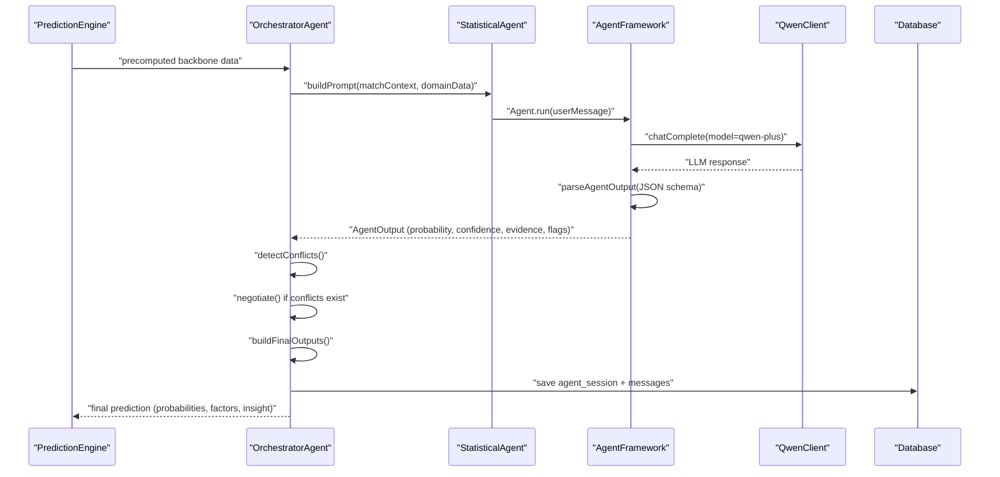
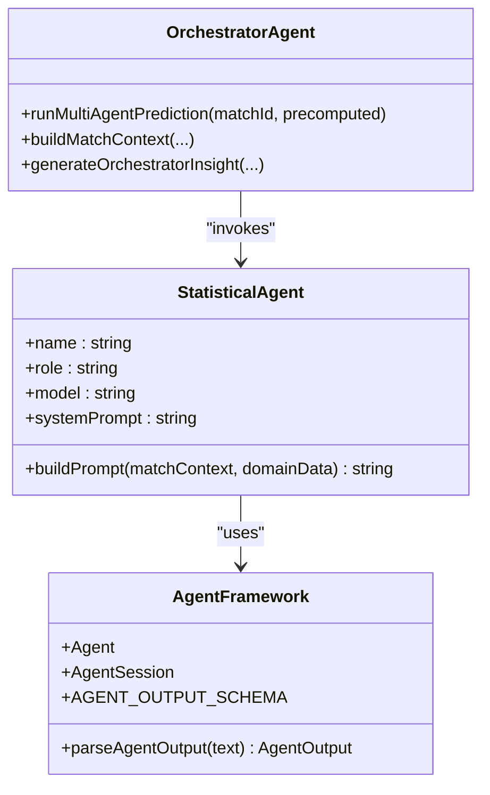
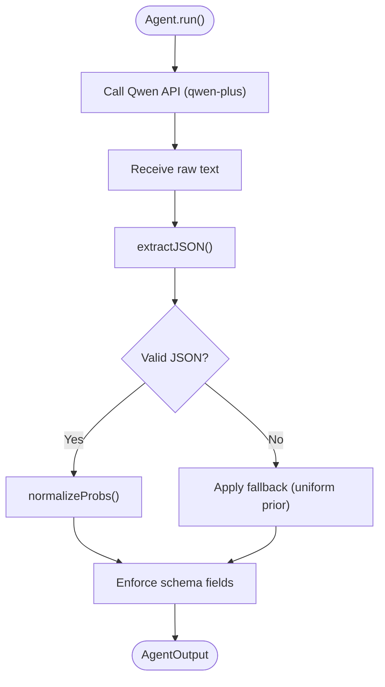
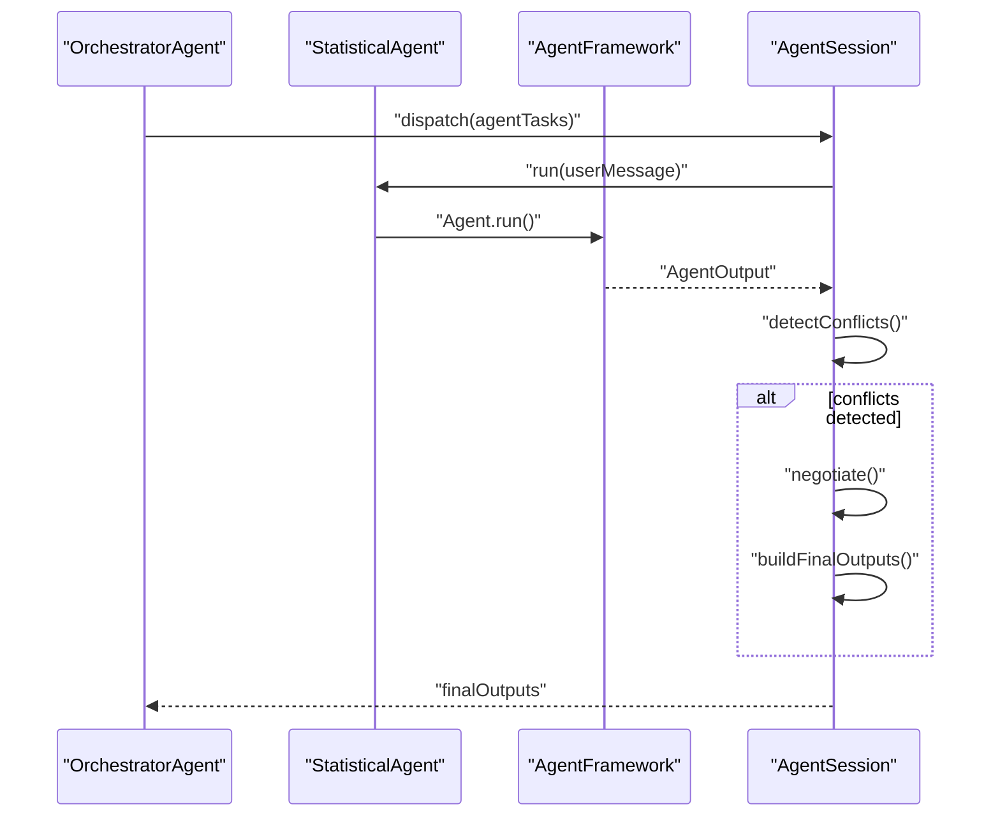
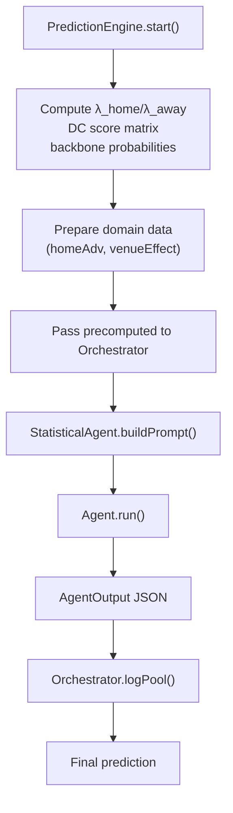
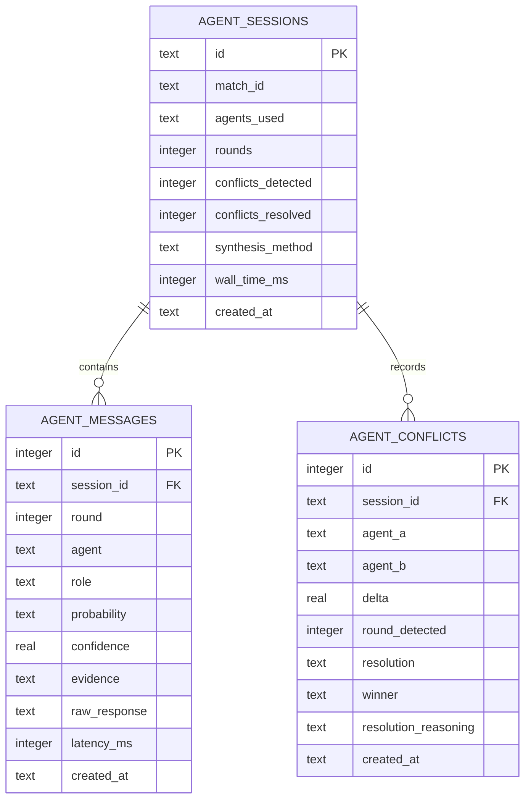
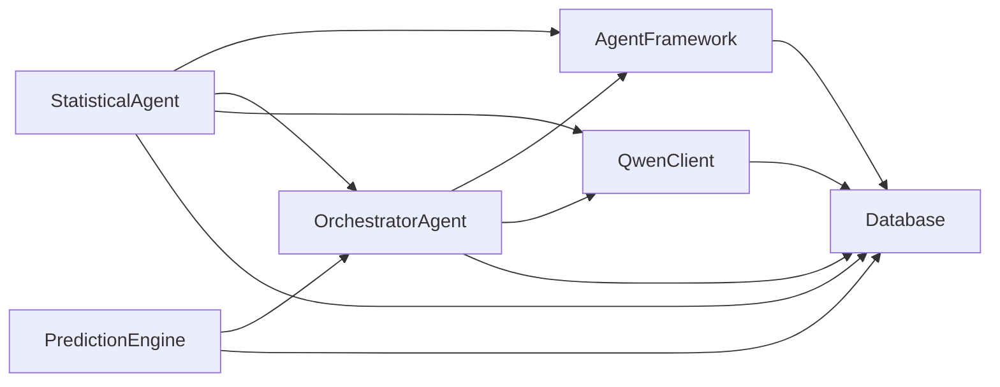

# Statistical Agent

<cite>
**Referenced Files in This Document**
- [statisticalAgent.js](file://backend/services/agents/statisticalAgent.js)
- [agentFramework.js](file://backend/services/agents/agentFramework.js)
- [orchestratorAgent.js](file://backend/services/agents/orchestratorAgent.js)
- [predictionEngine.js](file://backend/services/predictionEngine.js)
- [qwenClient.js](file://backend/services/qwenClient.js)
- [db.js](file://backend/database/db.js)
</cite>

## Table of Contents
1. [Introduction](#introduction)
2. [Project Structure](#project-structure)
3. [Core Components](#core-components)
4. [Architecture Overview](#architecture-overview)
5. [Detailed Component Analysis](#detailed-component-analysis)
6. [Dependency Analysis](#dependency-analysis)
7. [Performance Considerations](#performance-considerations)
8. [Troubleshooting Guide](#troubleshooting-guide)
9. [Conclusion](#conclusion)

## Introduction
The Statistical Agent is a specialized multi-agent component that interprets the Dixon-Coles bivariate Poisson backbone output and ELO ratings to produce a human-readable probability assessment. It focuses on translating mathematical outputs (expected goals λ, win/draw/loss probabilities, attack/defense parameters α/β, and home advantage) into clear statistical reasoning while flagging potential anomalies.

The agent operates within the multi-agent prediction framework, receiving pre-computed backbone data from the prediction engine and applying a structured interpretation workflow that emphasizes:
- Expected goal values and their implications for attacking intent and defensive quality
- ELO rating differentials and their historical significance
- Attack (α) and defense (β) rating differentials
- Host-nation home advantage and venue effects
- Statistical clarity and uncertainty indicators

## Project Structure
The Statistical Agent resides in the agents subsystem alongside other specialists (Form, H2H, Intel, Lineup). It integrates with the multi-agent orchestration system and relies on shared infrastructure for LLM communication, output parsing, and database persistence.

**Diagram sources**
- [statisticalAgent.js:1-98](file://backend/services/agents/statisticalAgent.js#L1-L98)
- [agentFramework.js:1-576](file://backend/services/agents/agentFramework.js#L1-L576)
- [orchestratorAgent.js:1-473](file://backend/services/agents/orchestratorAgent.js#L1-L473)
- [predictionEngine.js:1-1020](file://backend/services/predictionEngine.js#L1-L1020)
- [qwenClient.js:1-123](file://backend/services/qwenClient.js#L1-L123)
- [db.js:1-252](file://backend/database/db.js#L1-L252)

**Section sources**
- [statisticalAgent.js:1-98](file://backend/services/agents/statisticalAgent.js#L1-L98)
- [agentFramework.js:1-576](file://backend/services/agents/agentFramework.js#L1-L576)
- [orchestratorAgent.js:1-473](file://backend/services/agents/orchestratorAgent.js#L1-L473)
- [predictionEngine.js:1-1020](file://backend/services/predictionEngine.js#L1-L1020)
- [qwenClient.js:1-123](file://backend/services/qwenClient.js#L1-L123)
- [db.js:1-252](file://backend/database/db.js#L1-L252)

## Core Components
- StatisticalAgent: The interpreter that transforms Dixon-Coles/ELO outputs into a probability assessment with statistical reasoning and anomaly flags.
- Agent Framework: Provides the Agent class, AgentSession orchestration, JSON schema enforcement, and robust parsing utilities.
- Orchestrator: Coordinates multi-agent runs, detects conflicts, negotiates differences, and synthesizes final outputs via log-pool blending.
- Prediction Engine: Computes the Dixon-Coles backbone (λ values, score matrix, W/D/L probabilities) and prepares precomputed data for agents.
- Qwen Client: Manages LLM calls across models (qwen-plus for agents, qwen-turbo for insight generation).
- Database: Stores model configuration, predictions, agent sessions, and performance metrics.

Key responsibilities:
- StatisticalAgent builds a structured prompt from precomputed backbone data and returns a standardized JSON output.
- Agent Framework enforces output schema, parses LLM responses, and manages multi-agent negotiation.
- Orchestrator coordinates agent tasks, handles conflicts, and persists session data.
- Prediction Engine performs the mathematical backbone and prepares domain data for agents.
- Qwen Client abstracts API interactions and retries.
- Database persists configuration, predictions, and agent session traces.

**Section sources**
- [statisticalAgent.js:1-98](file://backend/services/agents/statisticalAgent.js#L1-L98)
- [agentFramework.js:1-576](file://backend/services/agents/agentFramework.js#L1-L576)
- [orchestratorAgent.js:1-473](file://backend/services/agents/orchestratorAgent.js#L1-L473)
- [predictionEngine.js:1-1020](file://backend/services/predictionEngine.js#L1-L1020)
- [qwenClient.js:1-123](file://backend/services/qwenClient.js#L1-L123)
- [db.js:1-252](file://backend/database/db.js#L1-L252)

## Architecture Overview
The Statistical Agent participates in a multi-agent pipeline that begins with the prediction engine computing the Dixon-Coles backbone. The orchestrator then dispatches agents in parallel, collects their outputs, detects conflicts, negotiates differences, and synthesizes a final prediction using log-pool blending.

**Diagram sources**
- [predictionEngine.js:665-729](file://backend/services/predictionEngine.js#L665-L729)
- [orchestratorAgent.js:290-470](file://backend/services/agents/orchestratorAgent.js#L290-L470)
- [statisticalAgent.js:90-98](file://backend/services/agents/statisticalAgent.js#L90-L98)
- [agentFramework.js:201-320](file://backend/services/agents/agentFramework.js#L201-L320)
- [qwenClient.js:53-101](file://backend/services/qwenClient.js#L53-L101)
- [db.js:168-207](file://backend/database/db.js#L168-L207)

## Detailed Component Analysis

### Statistical Agent Analysis
The Statistical Agent specializes in interpreting Dixon-Coles bivariate Poisson outputs and ELO ratings. It receives precomputed λ values, backbone probabilities, home advantage, and venue effects, then constructs a prompt that guides the LLM to provide a probability assessment anchored by the backbone while incorporating contextual factors.

Key implementation patterns:
- System prompt emphasizes bivariate Poisson and ELO reasoning, instructing the model to avoid inventing data and to flag incompleteness.
- Prompt builder aggregates match context, λ values, backbone probabilities, ELO ratings, attack/defense parameters, home advantage, and venue effects into a structured narrative.
- Output format strictly follows the agent output schema enforced by the framework.

**Diagram sources**
- [statisticalAgent.js:90-98](file://backend/services/agents/statisticalAgent.js#L90-L98)
- [agentFramework.js:40-53](file://backend/services/agents/agentFramework.js#L40-L53)
- [orchestratorAgent.js:129-155](file://backend/services/agents/orchestratorAgent.js#L129-L155)

**Section sources**
- [statisticalAgent.js:1-98](file://backend/services/agents/statisticalAgent.js#L1-L98)

### Agent Output Schema and Parsing
The Agent Framework defines a strict JSON schema that all agents must follow. The Statistical Agent’s output adheres to this schema, ensuring consistent downstream processing.

**Diagram sources**
- [agentFramework.js:56-146](file://backend/services/agents/agentFramework.js#L56-L146)

**Section sources**
- [agentFramework.js:40-53](file://backend/services/agents/agentFramework.js#L40-L53)
- [agentFramework.js:112-146](file://backend/services/agents/agentFramework.js#L112-L146)

### Multi-Agent Orchestration and Conflict Resolution
The Orchestrator coordinates agent runs, detects conflicts based on maximum probability deltas, and negotiates differences. The Statistical Agent contributes to this process by providing a structured probability assessment with confidence and evidence.

**Diagram sources**
- [orchestratorAgent.js:340-439](file://backend/services/agents/orchestratorAgent.js#L340-L439)
- [agentFramework.js:326-562](file://backend/services/agents/agentFramework.js#L326-L562)

**Section sources**
- [orchestratorAgent.js:340-439](file://backend/services/agents/orchestratorAgent.js#L340-L439)
- [agentFramework.js:326-562](file://backend/services/agents/agentFramework.js#L326-L562)

### Data Processing Workflow
The Statistical Agent consumes precomputed data from the prediction engine and transforms it into a structured prompt. The prediction engine computes the Dixon-Coles backbone, including λ values, score matrices, and W/D/L probabilities, then passes this data to the orchestrator.

**Diagram sources**
- [predictionEngine.js:665-729](file://backend/services/predictionEngine.js#L665-L729)
- [orchestratorAgent.js:320-325](file://backend/services/agents/orchestratorAgent.js#L320-L325)
- [statisticalAgent.js:42-87](file://backend/services/agents/statisticalAgent.js#L42-L87)

**Section sources**
- [predictionEngine.js:665-729](file://backend/services/predictionEngine.js#L665-L729)
- [orchestratorAgent.js:320-325](file://backend/services/agents/orchestratorAgent.js#L320-L325)
- [statisticalAgent.js:42-87](file://backend/services/agents/statisticalAgent.js#L42-L87)

### Output Format and Integration
The Statistical Agent’s output conforms to the agent output schema, enabling seamless integration with the orchestrator and downstream prediction synthesis. The orchestrator saves agent sessions and messages to the database for auditability and future analysis.

**Diagram sources**
- [db.js:168-207](file://backend/database/db.js#L168-L207)

**Section sources**
- [agentFramework.js:40-53](file://backend/services/agents/agentFramework.js#L40-L53)
- [db.js:168-207](file://backend/database/db.js#L168-L207)

## Dependency Analysis
The Statistical Agent depends on:
- Agent Framework for output schema enforcement and parsing
- Orchestrator for coordination and session management
- Prediction Engine for precomputed backbone data
- Qwen Client for LLM interactions
- Database for configuration and persistence

**Diagram sources**
- [statisticalAgent.js:15-16](file://backend/services/agents/statisticalAgent.js#L15-L16)
- [agentFramework.js:27-29](file://backend/services/agents/agentFramework.js#L27-L29)
- [orchestratorAgent.js:28-30](file://backend/services/agents/orchestratorAgent.js#L28-L30)
- [predictionEngine.js:37-43](file://backend/services/predictionEngine.js#L37-L43)
- [qwenClient.js:13-39](file://backend/services/qwenClient.js#L13-L39)
- [db.js:1-252](file://backend/database/db.js#L1-L252)

**Section sources**
- [statisticalAgent.js:15-16](file://backend/services/agents/statisticalAgent.js#L15-L16)
- [agentFramework.js:27-29](file://backend/services/agents/agentFramework.js#L27-L29)
- [orchestratorAgent.js:28-30](file://backend/services/agents/orchestratorAgent.js#L28-L30)
- [predictionEngine.js:37-43](file://backend/services/predictionEngine.js#L37-L43)
- [qwenClient.js:13-39](file://backend/services/qwenClient.js#L13-L39)
- [db.js:1-252](file://backend/database/db.js#L1-L252)

## Performance Considerations
- Model selection: The Statistical Agent uses qwen-plus, balancing reasoning capability and cost for numerical reasoning tasks.
- Prompt construction: Efficient aggregation of λ, ELO, α/β, and venue/home advantage minimizes token overhead while maintaining clarity.
- Multi-agent throughput: Parallel agent execution reduces end-to-end latency; conflicts trigger negotiation only when needed.
- Database writes: Session and message persistence occurs after final synthesis, minimizing write contention.

[No sources needed since this section provides general guidance]

## Troubleshooting Guide
Common issues and resolutions:
- JSON parsing failures: The Agent Framework applies a fallback when LLM output cannot be parsed, logging warnings and returning a uniform prior.
- LLM API errors: The Qwen Client retries on transient failures and timeouts, with configurable backoff.
- Missing domain data: The Statistical Agent prompt flags incomplete data; ensure precomputed backbone data is provided by the orchestrator.
- Session persistence: Verify database initialization and migrations; confirm model_config seeding for multi-agent feature flags.

**Section sources**
- [agentFramework.js:112-146](file://backend/services/agents/agentFramework.js#L112-L146)
- [qwenClient.js:67-101](file://backend/services/qwenClient.js#L67-L101)
- [db.js:228-249](file://backend/database/db.js#L228-L249)

## Conclusion
The Statistical Agent serves as the Dixon-Coles backbone interpreter within the multi-agent prediction system. By anchoring probabilistic assessments to precomputed λ values, ELO ratings, and contextual factors, it provides clear statistical reasoning while flagging anomalies. Its integration with the Agent Framework ensures consistent output formatting, while the Orchestrator coordinates multi-agent runs, detects conflicts, and synthesizes final predictions via log-pool blending. Together, these components deliver a robust, auditable, and explainable prediction pipeline.

[No sources needed since this section summarizes without analyzing specific files]