# Adjustment Signals & Weighting

<cite>
**Referenced Files in This Document**
- [predictionEngine.js](file://backend/services/predictionEngine.js)
- [orchestratorAgent.js](file://backend/services/agents/orchestratorAgent.js)
- [agentFramework.js](file://backend/services/agents/agentFramework.js)
- [h2hAgent.js](file://backend/services/agents/h2hAgent.js)
- [formAgent.js](file://backend/services/agents/formAgent.js)
- [intelAgent.js](file://backend/services/agents/intelAgent.js)
- [lineupAgent.js](file://backend/services/agents/lineupAgent.js)
- [statisticalAgent.js](file://backend/services/agents/statisticalAgent.js)
- [h2hService.js](file://backend/services/h2hService.js)
- [lineupService.js](file://backend/services/lineupService.js)
- [dataService.js](file://backend/services/dataService.js)
- [README.md](file://README.md)
- [SPEC.md](file://specs/SPEC.md)
</cite>

## Table of Contents
1. [Introduction](#introduction)
2. [Project Structure](#project-structure)
3. [Core Components](#core-components)
4. [Architecture Overview](#architecture-overview)
5. [Detailed Component Analysis](#detailed-component-analysis)
6. [Dependency Analysis](#dependency-analysis)
7. [Performance Considerations](#performance-considerations)
8. [Troubleshooting Guide](#troubleshooting-guide)
9. [Conclusion](#conclusion)

## Introduction
This document explains the adjustment signal system that enhances the backbone Dixon–Coles bivariate Poisson model. It documents each signal type (Head-to-Head history, recent form, pre-match intelligence, confirmed lineup strength, and rest days difference), the log-pool blending mechanism, the weighting scheme, normalization and combination procedures, mathematical transformations, goal-channel nudges, confidence propagation, signal quality assessment, fallback mechanisms, and the impact of each signal on final predictions.

## Project Structure
The adjustment signals are integrated into two prediction pipelines:
- Single-model pipeline: the prediction engine computes signals directly and blends them via log-pool.
- Multi-agent pipeline: specialized agents interpret signals and negotiate differences; the orchestrator performs log-pool blending and temperature scaling.

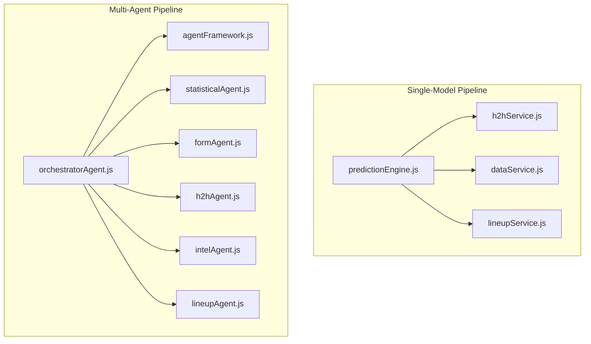

**Diagram sources**
- [predictionEngine.js:665-800](file://backend/services/predictionEngine.js#L665-L800)
- [orchestratorAgent.js:288-471](file://backend/services/agents/orchestratorAgent.js#L288-L471)
- [agentFramework.js:198-576](file://backend/services/agents/agentFramework.js#L198-L576)

**Section sources**
- [README.md:18-105](file://README.md#L18-L105)
- [SPEC.md:125-178](file://specs/SPEC.md#L125-L178)

## Core Components
- Backbonemodel: Dixon–Coles bivariate Poisson with λ-home and λ-away, low-score correction ρ, and goal scaling by tournament phase and venue conditions.
- Adjustment signals: Head-to-Head (H2H), recent form (FORM), pre-match intelligence (INTEL), confirmed lineup (LINEUP), and rest days difference (REST).
- Blending: log-pool (geometric mean) with per-signal exponents, followed by temperature scaling.
- Confidence propagation: derived from maximum outcome probability and propagated through matrix reweighting to scorelines.

**Section sources**
- [predictionEngine.js:665-800](file://backend/services/predictionEngine.js#L665-L800)
- [predictionEngine.js:214-238](file://backend/services/predictionEngine.js#L214-L238)
- [predictionEngine.js:364-459](file://backend/services/predictionEngine.js#L364-L459)

## Architecture Overview
The system supports two modes:
- Single-model mode: fetches form/intel, computes H2H/lineup/rest signals, nudges λ, builds the score matrix, blends via log-pool, and derives top scorelines.
- Multi-agent mode: orchestrator pre-fetches domain data, dispatches agents, detects conflicts, negotiates, adjusts weights, blends via log-pool, applies temperature scaling, and reweights the matrix.

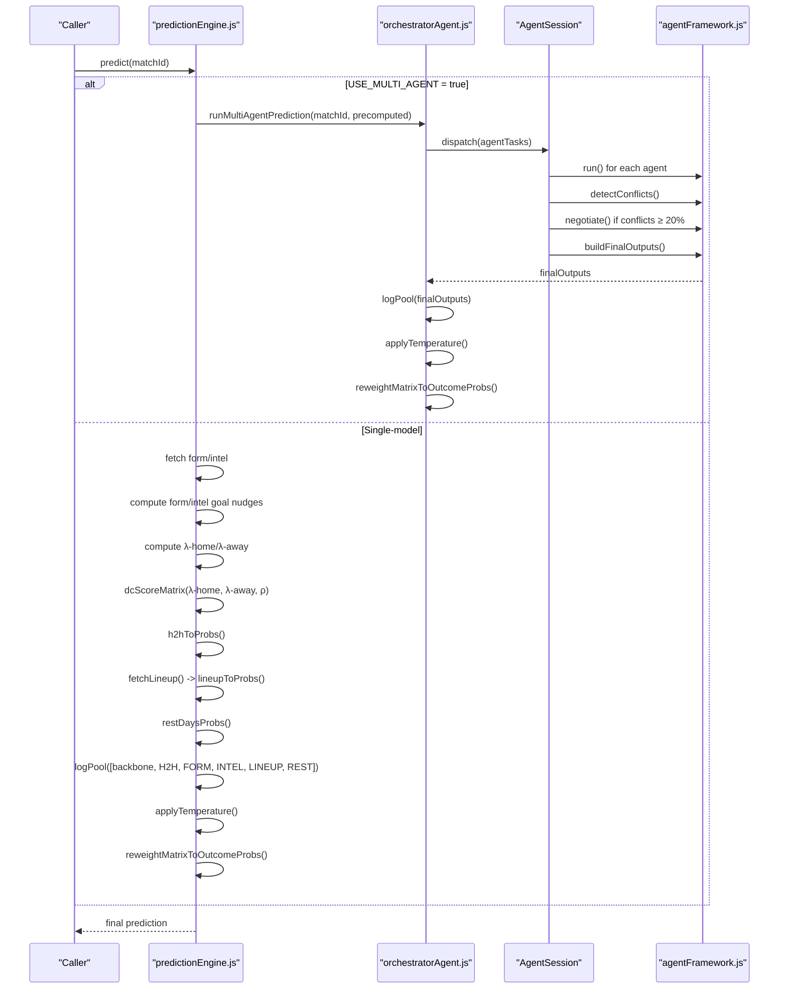

**Diagram sources**
- [predictionEngine.js:665-800](file://backend/services/predictionEngine.js#L665-L800)
- [orchestratorAgent.js:288-471](file://backend/services/agents/orchestratorAgent.js#L288-L471)
- [agentFramework.js:340-562](file://backend/services/agents/agentFramework.js#L340-L562)

## Detailed Component Analysis

### Signal Types and Transformations

#### Head-to-Head History (H2H)
- Data source: real 47k match dataset with competition-weighted and recency-weighted history.
- Transformation: converts weighted record to win/draw/loss probabilities with shrinkage toward base rates; quality assessed by match count and WC meeting frequency.
- Activation: only when ≥2 meetings; otherwise treated as insufficient data.

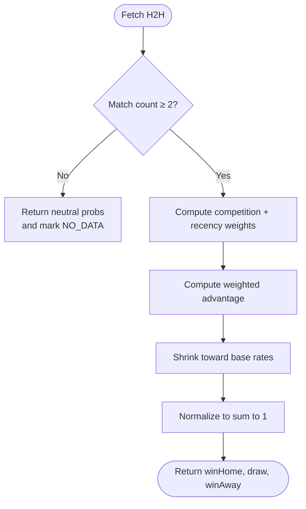

**Diagram sources**
- [h2hService.js:272-312](file://backend/services/h2hService.js#L272-L312)

**Section sources**
- [h2hService.js:272-312](file://backend/services/h2hService.js#L272-L312)
- [h2hAgent.js:32-96](file://backend/services/agents/h2hAgent.js#L32-L96)

#### Recent Form (FORM)
- Data source: last 10 results per team; competition weighting increases the impact of qualifiers and major tournaments.
- Transformation: computes a form score as a weighted average of results, then maps to win/draw/loss probabilities with baseline draw compression and bounded outputs.

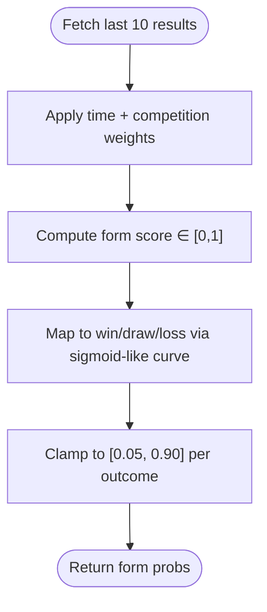

**Diagram sources**
- [predictionEngine.js:254-281](file://backend/services/predictionEngine.js#L254-L281)
- [dataService.js:68-185](file://backend/services/dataService.js#L68-L185)

**Section sources**
- [predictionEngine.js:254-281](file://backend/services/predictionEngine.js#L254-L281)
- [dataService.js:68-185](file://backend/services/dataService.js#L68-L185)

#### Pre-Match Intelligence (INTEL)
- Data source: Google News RSS for both teams; structured extraction via LLM with anti-hallucination verification; fallback to regex extraction.
- Transformation: maps injuries, rotation, motivation, and form into numeric adjustments; produces outcome probabilities with bounded outputs.

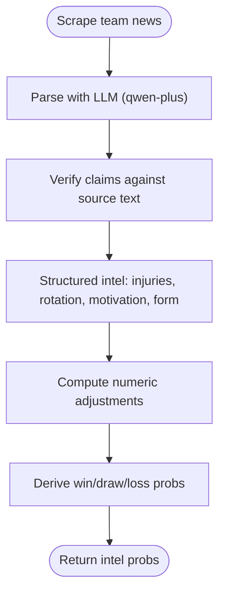

**Diagram sources**
- [dataService.js:413-490](file://backend/services/dataService.js#L413-L490)
- [intelAgent.js:57-115](file://backend/services/agents/intelAgent.js#L57-L115)

**Section sources**
- [dataService.js:413-490](file://backend/services/dataService.js#L413-L490)
- [intelAgent.js:57-115](file://backend/services/agents/intelAgent.js#L57-L115)

#### Confirmed Lineup Strength (LINEUP)
- Data source: lineup service with priority API and web scraping; computes strength scores and key absences.
- Transformation: converts lineup impact into a −1..+1 signal and maps to outcome probabilities with bounded shifts.

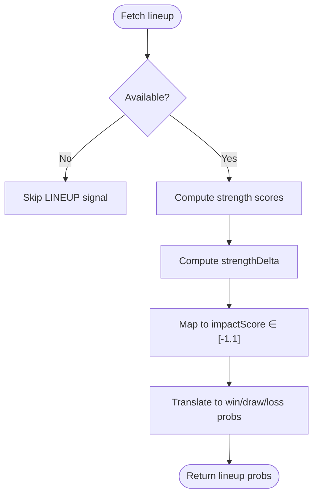

**Diagram sources**
- [lineupService.js:399-422](file://backend/services/lineupService.js#L399-L422)
- [lineupAgent.js:61-107](file://backend/services/agents/lineupAgent.js#L61-L107)

**Section sources**
- [lineupService.js:399-422](file://backend/services/lineupService.js#L399-L422)
- [lineupAgent.js:61-107](file://backend/services/agents/lineupAgent.js#L61-L107)

#### Rest Days Difference (REST)
- Data source: last completed match per team before the fixture; computes rest-day penalty with asymmetric nudges.
- Transformation: quantifies net rest advantage and maps to outcome probabilities with bounded shifts.

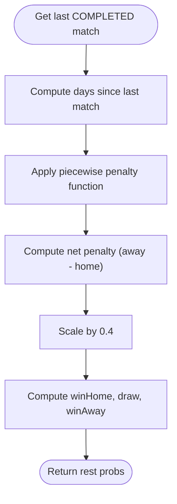

**Diagram sources**
- [predictionEngine.js:337-362](file://backend/services/predictionEngine.js#L337-L362)

**Section sources**
- [predictionEngine.js:337-362](file://backend/services/predictionEngine.js#L337-L362)

### Log-Pool Blending Mechanism
- Geometric mean of probabilities raised to per-signal exponents, then renormalized.
- Prevents arithmetic averaging from collapsing probabilities toward 1/3,1/3,1/3 and preserves confidence.

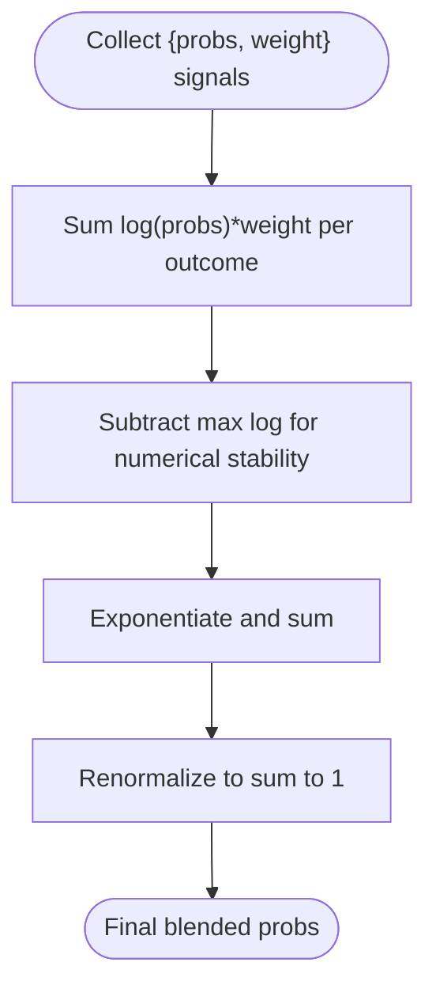

**Diagram sources**
- [predictionEngine.js:214-238](file://backend/services/predictionEngine.js#L214-L238)
- [orchestratorAgent.js:41-55](file://backend/services/agents/orchestratorAgent.js#L41-L55)

**Section sources**
- [predictionEngine.js:214-238](file://backend/services/predictionEngine.js#L214-L238)
- [orchestratorAgent.js:41-55](file://backend/services/agents/orchestratorAgent.js#L41-L55)

### Weighting Scheme and Normalization
- Weights (per signal): H2H: 0.30, FORM: 0.20, INTEL: 0.20, LINEUP: 0.40, REST: 0.10.
- Normalization: log-pool sums weights internally; final probabilities are renormalized.
- Multi-agent weights: agents propose weightRecommendation; conflicts trigger adjustments (winner ×1.3, loser ×0.6).

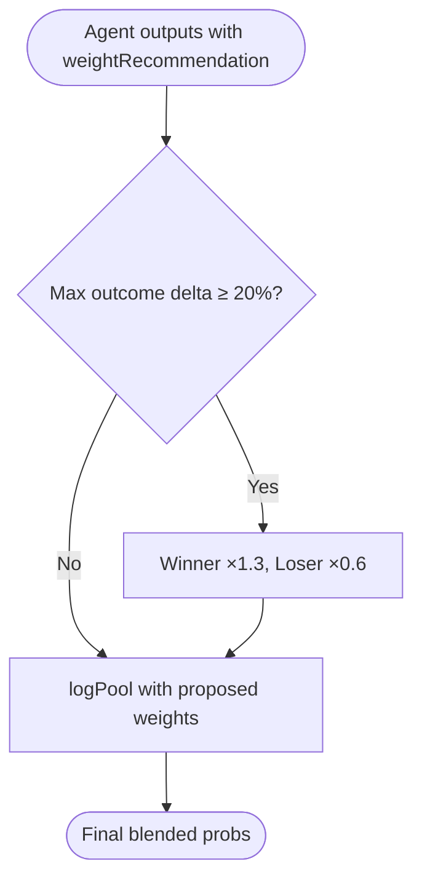

**Diagram sources**
- [agentFramework.js:366-493](file://backend/services/agents/agentFramework.js#L366-L493)
- [orchestratorAgent.js:371-391](file://backend/services/agents/orchestratorAgent.js#L371-L391)

**Section sources**
- [predictionEngine.js:92-100](file://backend/services/predictionEngine.js#L92-L100)
- [agentFramework.js:366-493](file://backend/services/agents/agentFramework.js#L366-L493)

### Mathematical Implementation Details
- Goal-channel nudges:
  - Form: log-space nudges based on form gap; conservatively scaled to influence λ before matrix construction.
  - Intel: log-space nudges based on injuries, rotation, and motivation; symmetric for own/opponent.
- Matrix reweighting: scales outcome-class totals to match final W/D/L probabilities while preserving within-class scoreline shape.

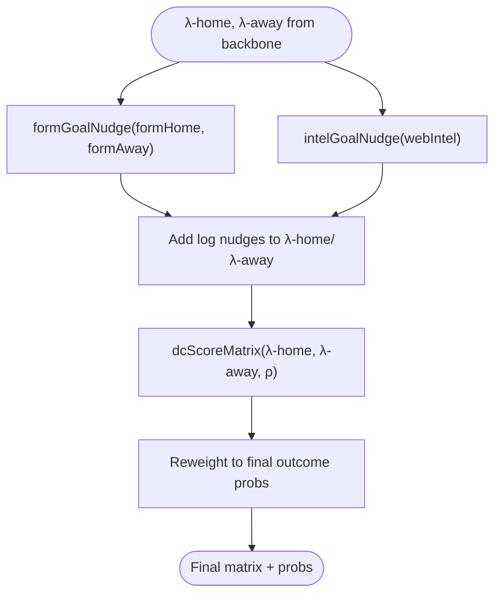

**Diagram sources**
- [predictionEngine.js:305-335](file://backend/services/predictionEngine.js#L305-L335)
- [predictionEngine.js:377-394](file://backend/services/predictionEngine.js#L377-L394)

**Section sources**
- [predictionEngine.js:305-335](file://backend/services/predictionEngine.js#L305-L335)
- [predictionEngine.js:377-394](file://backend/services/predictionEngine.js#L377-L394)

### Confidence Propagation
- Derived from the maximum of final win/draw/away probabilities.
- Used to categorize confidence tiers and inform factor impact calculations.

**Section sources**
- [predictionEngine.js:365-371](file://backend/services/predictionEngine.js#L365-L371)

### Signal Quality Assessment and Fallbacks
- H2H: dataQuality depends on match count; returns neutral probs when insufficient.
- Intel: llmParsed indicates reliable extraction; otherwise regex fallback with lower reliability.
- Form: synthetic generation from ELO when API/scrape fail.
- Lineup: available only within ~60–75 minutes before kickoff; otherwise skipped.

**Section sources**
- [h2hService.js:298-311](file://backend/services/h2hService.js#L298-L311)
- [dataService.js:459-490](file://backend/services/dataService.js#L459-L490)
- [dataService.js:171-185](file://backend/services/dataService.js#L171-L185)
- [lineupService.js:250-262](file://backend/services/lineupService.js#L250-L262)

### Impact of Each Signal on Final Predictions
- H2H: strengthens predictions when ≥2 meetings; shrinks toward base rates with sparse data.
- FORM: captures momentum and opponent-quality weighting; bounded mapping prevents extreme shifts.
- INTEL: additive effects for injuries, rotation, and motivation; calibrated nudges.
- LINEUP: highest weight (0.40); resolves uncertainty when confirmed; bounded mapping.
- REST: asymmetric penalty favors fresher team; bounded shifts.

**Section sources**
- [predictionEngine.js:92-100](file://backend/services/predictionEngine.js#L92-L100)
- [predictionEngine.js:254-281](file://backend/services/predictionEngine.js#L254-L281)
- [predictionEngine.js:283-303](file://backend/services/predictionEngine.js#L283-L303)
- [lineupService.js:399-422](file://backend/services/lineupService.js#L399-L422)
- [predictionEngine.js:337-362](file://backend/services/predictionEngine.js#L337-L362)

## Dependency Analysis
The multi-agent system depends on the agent framework for conflict detection and negotiation, while the single-model pipeline integrates services directly.

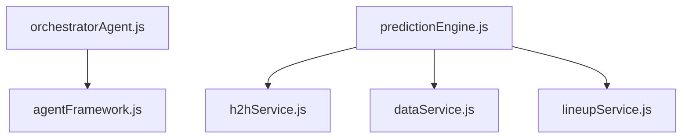

**Diagram sources**
- [agentFramework.js:198-576](file://backend/services/agents/agentFramework.js#L198-L576)
- [orchestratorAgent.js:288-471](file://backend/services/agents/orchestratorAgent.js#L288-L471)
- [predictionEngine.js:665-800](file://backend/services/predictionEngine.js#L665-L800)

**Section sources**
- [agentFramework.js:198-576](file://backend/services/agents/agentFramework.js#L198-L576)
- [orchestratorAgent.js:288-471](file://backend/services/agents/orchestratorAgent.js#L288-L471)
- [predictionEngine.js:665-800](file://backend/services/predictionEngine.js#L665-L800)

## Performance Considerations
- Parallelization: multi-agent dispatch and single-model parallel fetches improve throughput.
- Numerical stability: log-sum-exp normalization in log-pool and matrix reweighting prevent overflow/underflow.
- Early exits: agents and signals are skipped when insufficient data (e.g., H2H <2 meetings, lineup unavailable).
- Caching: form/H2H/intel cached with TTL to reduce repeated network calls.

[No sources needed since this section provides general guidance]

## Troubleshooting Guide
- LLM parsing failures: agent framework falls back to uniform priors and logs parse errors; verify API keys and model availability.
- Incomplete signals: ensure USE_MULTI_AGENT setting and that required data sources (form/intel/H2H/lineup) are available.
- Extreme probabilities: log-pool renormalization ensures valid distributions; check for malformed JSON outputs.
- Temperature scaling: calibrationService refits temperature and DC ρ; verify model_config entries.

**Section sources**
- [agentFramework.js:112-146](file://backend/services/agents/agentFramework.js#L112-L146)
- [agentFramework.js:221-320](file://backend/services/agents/agentFramework.js#L221-L320)
- [SPEC.md:160-178](file://specs/SPEC.md#L160-L178)

## Conclusion
The adjustment signal system augments the Dixon–Coles backbone with robust, data-driven signals and principled blending. The log-pool mechanism preserves confidence, while multi-agent negotiation and weight adjustments refine outcomes. Quality-aware fallbacks ensure reliable predictions even when data is partial, and goal-channel nudges align λ with contextual factors for accurate scoreline inference.