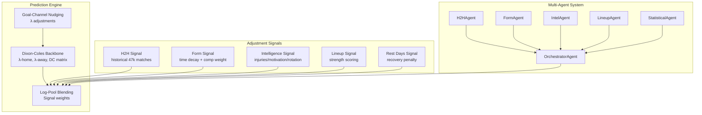
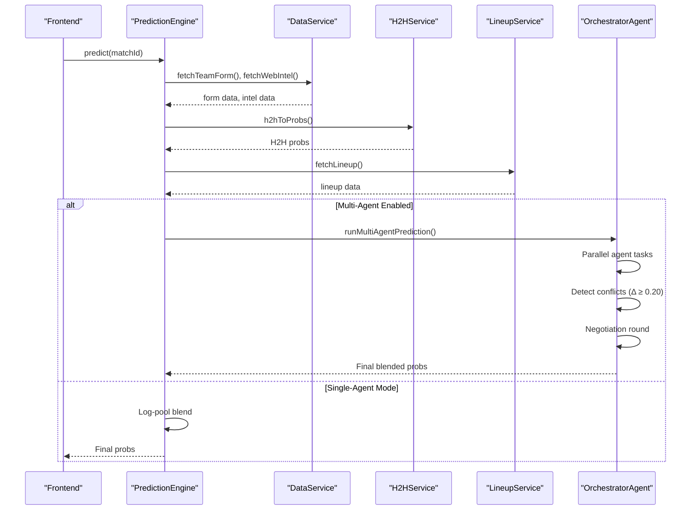
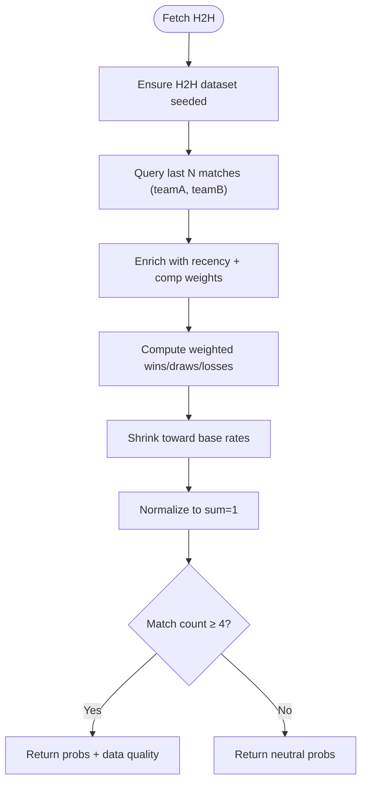
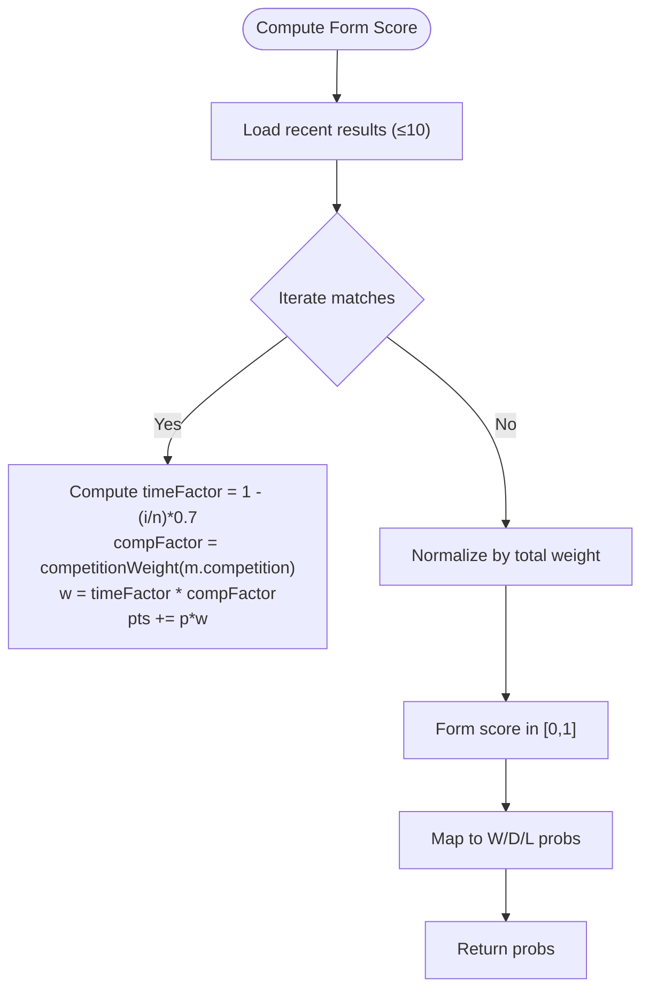
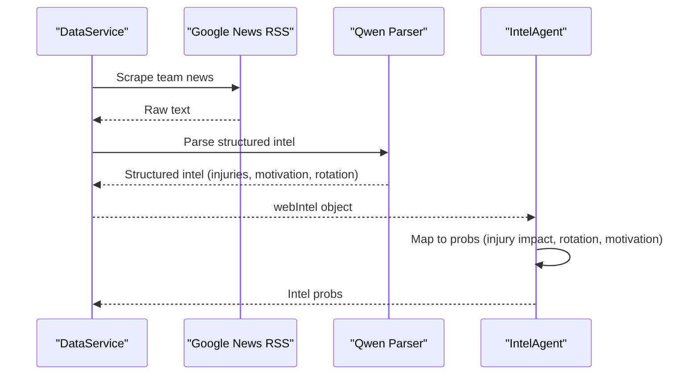
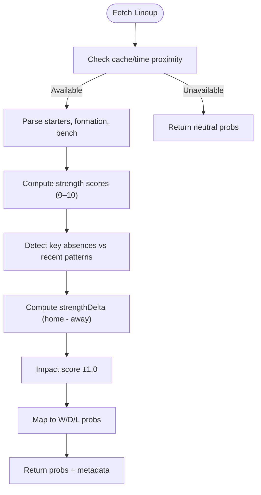
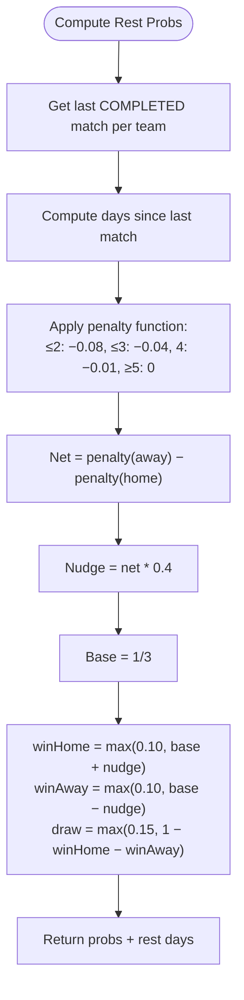
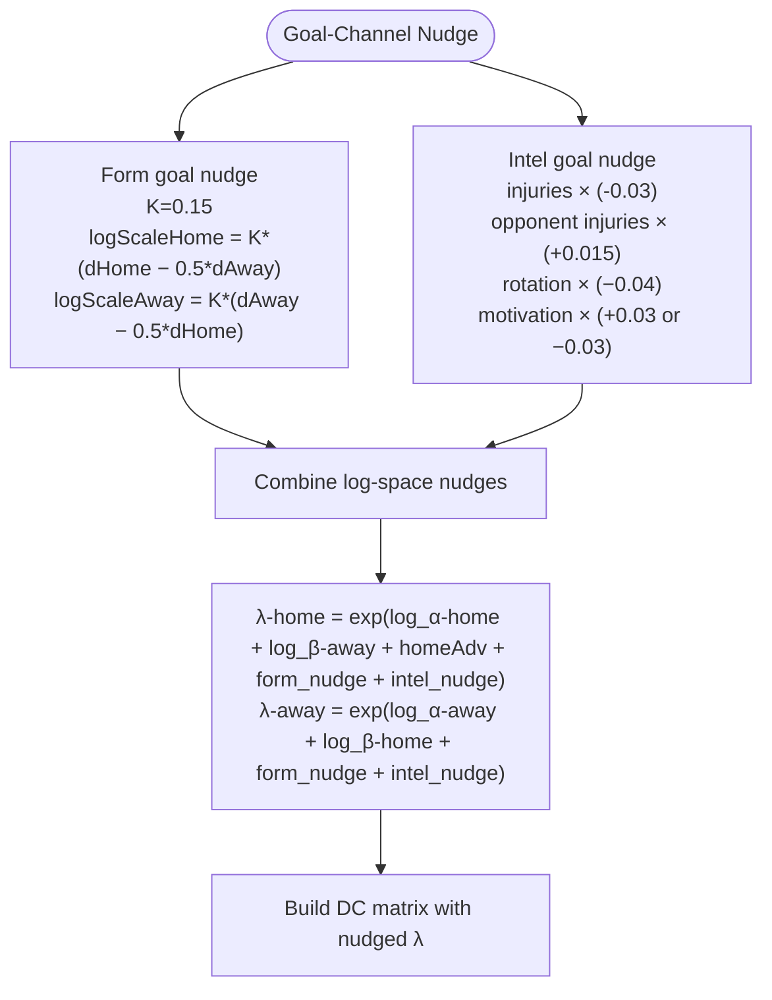
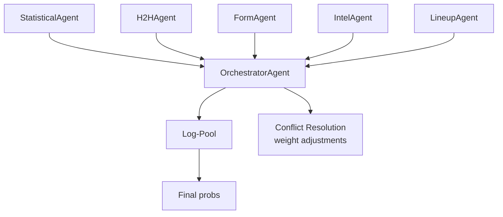

# Adjustment Signals

<cite>
**Referenced Files in This Document**
- [predictionEngine.js](file://backend/services/predictionEngine.js)
- [h2hService.js](file://backend/services/h2hService.js)
- [dataService.js](file://backend/services/dataService.js)
- [lineupService.js](file://backend/services/lineupService.js)
- [agents/h2hAgent.js](file://backend/services/agents/h2hAgent.js)
- [agents/formAgent.js](file://backend/services/agents/formAgent.js)
- [agents/intelAgent.js](file://backend/services/agents/intelAgent.js)
- [agents/lineupAgent.js](file://backend/services/agents/lineupAgent.js)
- [agents/orchestratorAgent.js](file://backend/services/agents/orchestratorAgent.js)
- [agents/agentFramework.js](file://backend/services/agents/agentFramework.js)
- [SPEC.md](file://specs/SPEC.md)
</cite>

## Table of Contents
1. [Introduction](#introduction)
2. [Project Structure](#project-structure)
3. [Core Components](#core-components)
4. [Architecture Overview](#architecture-overview)
5. [Detailed Component Analysis](#detailed-component-analysis)
6. [Dependency Analysis](#dependency-analysis)
7. [Performance Considerations](#performance-considerations)
8. [Troubleshooting Guide](#troubleshooting-guide)
9. [Conclusion](#conclusion)

## Introduction
This document explains the six adjustment signal systems that enhance the Dixon-Coles backbone predictions. Each signal contributes a W/D/L probability vector that is blended with the Poisson-based model using log-pooling. The signals are:
- Head-to-Head (H2H): historical 47k match dataset with weighted advantage calculations and minimum meeting requirements
- Form: opponent-quality weighted recent performance with time decay and competition importance weighting
- Intelligence (INTEL): web scraping and LLM parsing for injuries, motivation, and rotation effects
- Lineup: confirmed lineup strength scoring and key player absence impact
- Rest Days: recovery advantages with penalty functions for different rest intervals
- Goal-Channel nudging: λ parameter adjustments before matrix construction

## Project Structure
The prediction pipeline combines a deterministic Dixon-Coles Poisson backbone with probabilistic adjustment signals. The multi-agent system can operate in two modes:
- Single-agent mode: signals are computed inline and blended via log-pooling
- Multi-agent mode: each signal is produced by a dedicated agent, with conflict detection and negotiation

**Diagram sources**
- [predictionEngine.js:12-35](file://backend/services/predictionEngine.js#L12-L35)
- [predictionEngine.js:92-100](file://backend/services/predictionEngine.js#L92-L100)
- [agents/orchestratorAgent.js:309-502](file://backend/services/agents/orchestratorAgent.js#L309-L502)

**Section sources**
- [SPEC.md:125-177](file://specs/SPEC.md#L125-L177)
- [predictionEngine.js:663-668](file://backend/services/predictionEngine.js#L663-L668)

## Core Components
- Dixon-Coles backbone: Poisson-based λ-home/λ-away with τ low-score correction
- Log-pool blending: geometric mean of probabilities raised to per-signal exponents
- Goal-channel nudging: conservative λ adjustments before matrix construction
- Signal weights: H2H 0.30, Form 0.20, Intel 0.20, Lineup 0.40, Rest 0.10

**Section sources**
- [predictionEngine.js:12-35](file://backend/services/predictionEngine.js#L12-L35)
- [predictionEngine.js:92-100](file://backend/services/predictionEngine.js#L92-L100)
- [predictionEngine.js:305-335](file://backend/services/predictionEngine.js#L305-L335)

## Architecture Overview
The system computes signals in parallel and blends them into outcome probabilities. In multi-agent mode, each signal is produced by a specialized agent with negotiation when conflicts exceed 0.20.

**Diagram sources**
- [predictionEngine.js:690-756](file://backend/services/predictionEngine.js#L690-L756)
- [agents/orchestratorAgent.js:309-502](file://backend/services/agents/orchestratorAgent.js#L309-L502)

## Detailed Component Analysis

### Head-to-Head (H2H) Signal
- Dataset: 47k+ international matches since 1872, competition-weighted
- Computation: recency-weighted combined with competition weights; shrinkage toward base rates
- Minimum requirement: at least 2 meetings; fewer yield neutral probabilities
- Output: W/D/L probability vector with data quality assessment

**Diagram sources**
- [h2hService.js:192-266](file://backend/services/h2hService.js#L192-L266)
- [h2hService.js:272-312](file://backend/services/h2hService.js#L272-L312)

**Section sources**
- [h2hService.js:11-18](file://backend/services/h2hService.js#L11-L18)
- [h2hService.js:55-67](file://backend/services/h2hService.js#L55-L67)
- [h2hService.js:272-312](file://backend/services/h2hService.js#L272-L312)
- [agents/h2hAgent.js:18-30](file://backend/services/agents/h2hAgent.js#L18-L30)

Mathematical formulation:
- Recency weight: linearly decreasing from 1.0 to ~0.3 over N matches
- Competition weight: 4.0 for WC finals, 2.5 for qualifiers, 2.0 for continental finals, 1.5 for qualifiers, 1.2 for Nations League/Gold Cup, 0.5 for friendlies
- Combined weight per match: comp_weight × recency_weight
- Raw advantage: (Σ teamA wins) − (Σ teamB wins) / total_weight
- Shrinkage toward base rates (home win ~39%, draw ~27%, away ~34%) based on match count

Signal quality assessment:
- Data quality: HIGH (≥8), MEDIUM (4–7), LOW (<4), NO_DATA (<2)

### Form Signal
- Input: recent results (≤10), opponent quality, recency
- Computation: time-decayed weighted points with competition importance
- Output: form score in [0,1], then mapped to W/D/L via sigmoid-like function

**Diagram sources**
- [predictionEngine.js:254-281](file://backend/services/predictionEngine.js#L254-L281)

**Section sources**
- [predictionEngine.js:241-252](file://backend/services/predictionEngine.js#L241-L252)
- [predictionEngine.js:254-281](file://backend/services/predictionEngine.js#L254-L281)
- [agents/formAgent.js:17-33](file://backend/services/agents/formAgent.js#L17-L33)

Mathematical formulation:
- Time decay: timeFactor decreases linearly from 1.0 to ~0.3 over 10 matches
- Competition importance: 2.0 for WC, 1.5 for qualifiers, 1.3 for continental finals, 1.1 for Nations League/Confederations, 0.5 for friendlies
- Form score: weighted average normalized to [0,1]
- Probs mapping: draw compression 0.25, baseline draw 0.27, winBoost increases with score difference

### Intelligence (INTEL) Signal
- Data collection: Google News RSS scraping, LLM parsing (Qwen), regex fallback
- Structured fields: injuries, motivation, rotation, form narrative
- Output: W/D/L probability vector with injury impact, rotation effects, and motivation factors

**Diagram sources**
- [dataService.js:271-292](file://backend/services/dataService.js#L271-L292)
- [dataService.js:313-399](file://backend/services/dataService.js#L313-L399)
- [agents/intelAgent.js:20-40](file://backend/services/agents/intelAgent.js#L20-L40)

**Section sources**
- [dataService.js:271-292](file://backend/services/dataService.js#L271-L292)
- [dataService.js:313-399](file://backend/services/dataService.js#L313-L399)
- [agents/intelAgent.js:42-57](file://backend/services/agents/intelAgent.js#L42-L57)

Mathematical formulation:
- Injury impact: up to 3 injuries per side; each injury reduces λ by ~0.03 (own) and increases opponent λ by ~0.015
- Rotation penalty: ~0.04 reduction to λ for rotated team
- Motivation: high motivation adds ~0.03 to λ; low motivation subtracts ~0.03
- Probabilistic mapping: base 1/3, net advantage per side, draw computed to sum to 1

Goal-channel nudging:
- logScaleHome = −0.03 × hInj + 0.015 × aInj + (rotation penalty if rotated) + (motivation bonus/penalty)
- Similar for logScaleAway

### Lineup Signal
- Availability: confirmed ~60–75 min before kickoff
- Strength scoring: position weights × player ratings; normalized to 0–10 scale
- Key absences: compared to recent starting patterns; amplifies delta effect
- Output: W/D/L probability vector with strengthDelta and impactScore

**Diagram sources**
- [lineupService.js:220-362](file://backend/services/lineupService.js#L220-L362)
- [lineupService.js:398-422](file://backend/services/lineupService.js#L398-L422)

**Section sources**
- [lineupService.js:157-183](file://backend/services/lineupService.js#L157-L183)
- [lineupService.js:185-218](file://backend/services/lineupService.js#L185-L218)
- [lineupService.js:398-422](file://backend/services/lineupService.js#L398-L422)
- [agents/lineupAgent.js:18-37](file://backend/services/agents/lineupAgent.js#L18-L37)

Mathematical formulation:
- Position weights: GK 1.5, CB×2 2.0, WB/FB×2 1.2, DM/CM×2 1.6, AM/W×2 1.4, ST 1.3
- Player rating approximated from team ELO; captain/bench variations ±3
- Strength score normalized to 0–10 scale
- Impact score: ±1.0 based on normalized delta; maps to ±12% probability shift

### Rest Days Signal
- Computation: last match date per team, compute days since last match
- Penalty function: ≤2 days: −0.08, ≤3 days: −0.04, 4 days: −0.01, ≥5 days: 0
- Net advantage: penalty(away) − penalty(home)
- Output: W/D/L with emphasis on home/away advantage

**Diagram sources**
- [predictionEngine.js:337-362](file://backend/services/predictionEngine.js#L337-L362)

**Section sources**
- [predictionEngine.js:337-362](file://backend/services/predictionEngine.js#L337-L362)

### Goal-Channel Nudging
- Purpose: adjust λ before matrix construction to align scoreline expectations with form/intel signals
- Form nudge: K=0.15; logScaleHome = K × (dHome − 0.5 × dAway), logScaleAway = K × (dAway − 0.5 × dHome)
- Intel nudge: injury/rotation/motivation impacts applied to log λ

**Diagram sources**
- [predictionEngine.js:305-335](file://backend/services/predictionEngine.js#L305-L335)

**Section sources**
- [predictionEngine.js:305-335](file://backend/services/predictionEngine.js#L305-L335)

## Dependency Analysis
The multi-agent system orchestrates specialists that feed into a unified log-pool blend. Conflict detection triggers negotiation where the agent that moves less retains higher weight.

**Diagram sources**
- [agents/orchestratorAgent.js:346-411](file://backend/services/agents/orchestratorAgent.js#L346-L411)
- [agents/agentFramework.js:376-503](file://backend/services/agents/agentFramework.js#L376-L503)

**Section sources**
- [agents/orchestratorAgent.js:346-411](file://backend/services/agents/orchestratorAgent.js#L346-L411)
- [agents/agentFramework.js:376-503](file://backend/services/agents/agentFramework.js#L376-L503)

## Performance Considerations
- Multi-agent mode: parallel agent execution with conflict detection and negotiation; adds latency but improves robustness
- Signal caching: form, H2H, and intel cached with TTLs to reduce repeated network calls
- Goal-channel nudging: conservative magnitudes to preserve backbone dominance while guiding scoreline expectations
- Temperature calibration: post-processing scaling to improve probability calibration

[No sources needed since this section provides general guidance]

## Troubleshooting Guide
Common issues and resolutions:
- H2H insufficient data: returns neutral probabilities; ensure teams have ≥2 historical meetings
- Intel parsing failures: fallback to regex extraction; verify injury claims against source text
- Lineup not available: occurs when too early before kickoff; confirm timing and sources
- Multi-agent parse errors: agents fall back to uniform priors; check LLM output formatting

**Section sources**
- [h2hService.js:272-312](file://backend/services/h2hService.js#L272-L312)
- [dataService.js:313-399](file://backend/services/dataService.js#L313-L399)
- [lineupService.js:250-262](file://backend/services/lineupService.js#L250-L262)
- [agents/agentFramework.js:121-156](file://backend/services/agents/agentFramework.js#L121-L156)

## Conclusion
The six adjustment signals provide complementary insights that refine Dixon-Coles predictions:
- H2H anchors expectations with historical context and competition weighting
- Form captures recent momentum with opponent-quality weighting and time decay
- Intelligence integrates off-pitch factors (injuries, motivation, rotation) into probabilistic outcomes
- Lineup resolves pre-match uncertainty with strength scoring and key absence detection
- Rest days quantify recovery advantages with penalty functions
- Goal-channel nudging ensures λ adjustments align scoreline expectations before matrix construction

Together, these mechanisms produce robust, explainable predictions with calibrated confidence and transparent factor attribution.