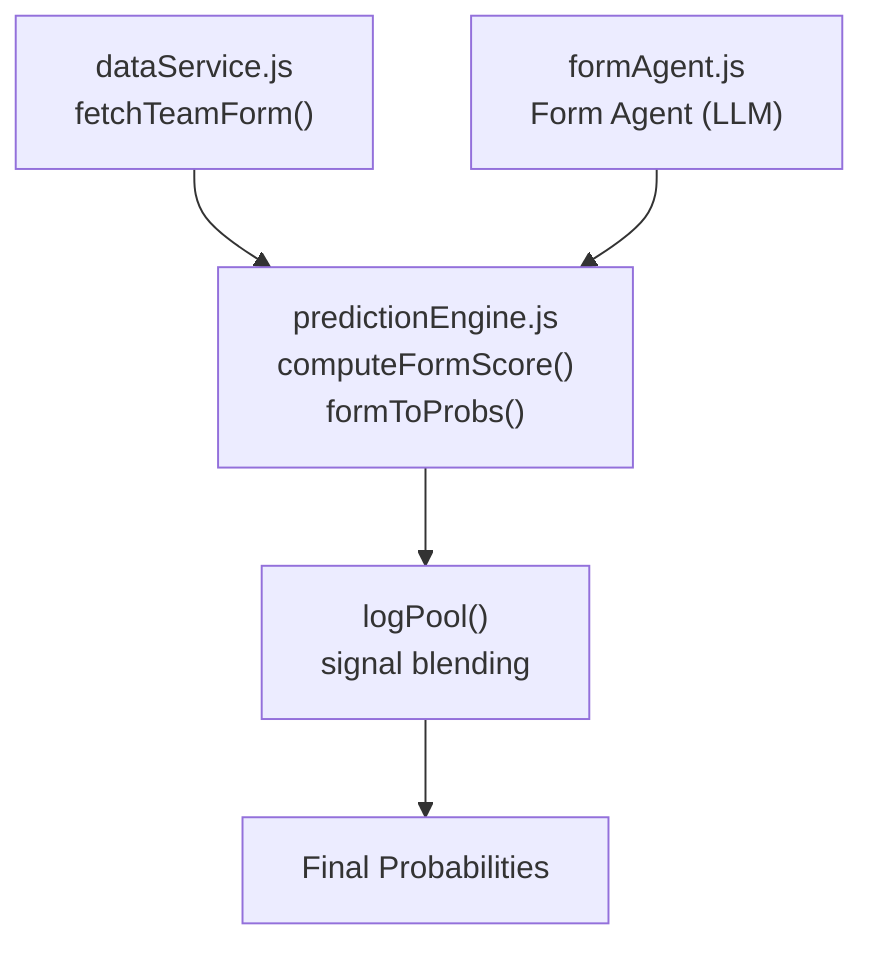
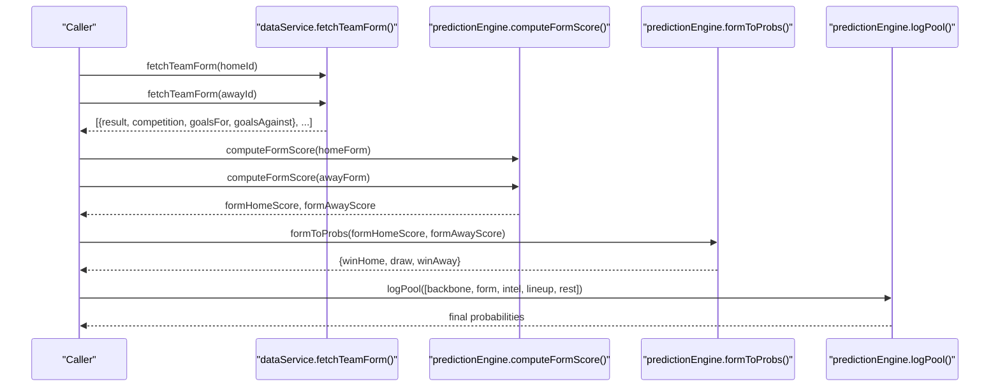
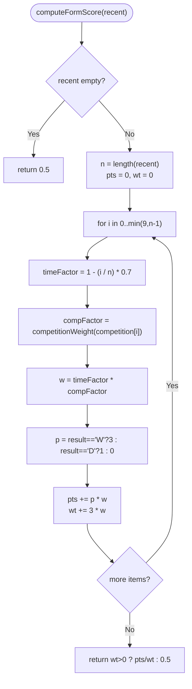
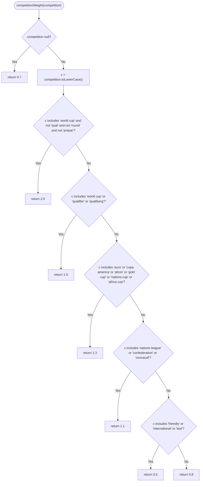
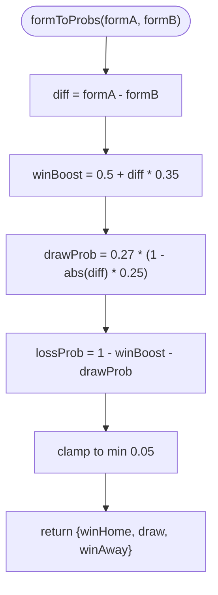
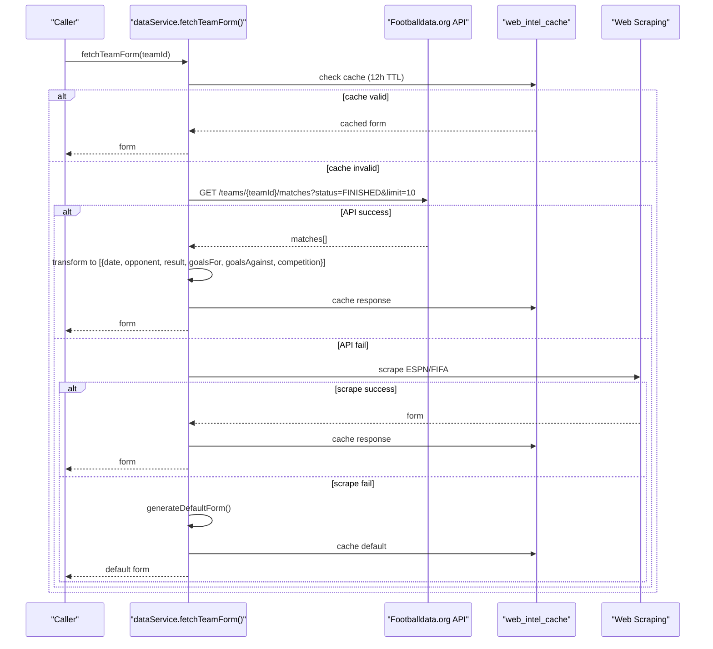
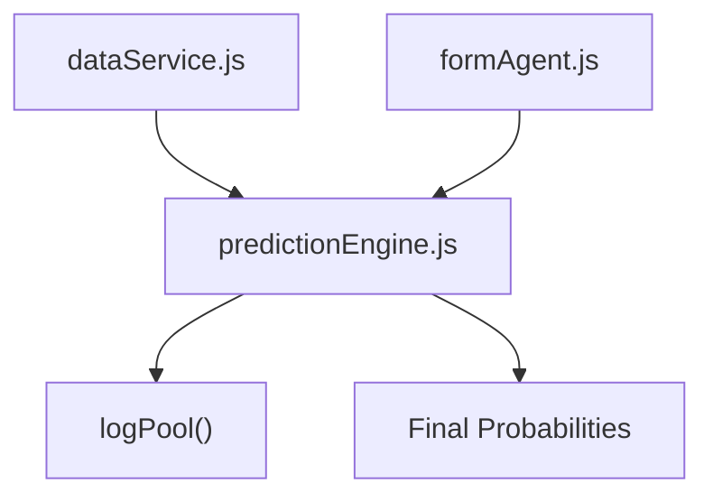

# Form Signal

<cite>
**Referenced Files in This Document**
- [formAgent.js](file://backend/services/agents/formAgent.js)
- [predictionEngine.js](file://backend/services/predictionEngine.js)
- [dataService.js](file://backend/services/dataService.js)
- [modelBaseline.js](file://backend/scripts/modelBaseline.js)
- [predictionEngine.test.js](file://backend/services/predictionEngine.test.js)
</cite>

## Table of Contents
1. [Introduction](#introduction)
2. [Project Structure](#project-structure)
3. [Core Components](#core-components)
4. [Architecture Overview](#architecture-overview)
5. [Detailed Component Analysis](#detailed-component-analysis)
6. [Dependency Analysis](#dependency-analysis)
7. [Performance Considerations](#performance-considerations)
8. [Troubleshooting Guide](#troubleshooting-guide)
9. [Conclusion](#conclusion)

## Introduction
This document explains the Form adjustment signal system used in the prediction engine. It covers the opponent-quality weighted recent performance calculation using time decay factors and competition importance weighting, the computeFormScore algorithm, and the formToProbs conversion function that maps form scores to win/draw/loss probabilities. It also includes examples of recent form processing, weight application, and resulting probability adjustments.

## Project Structure
The Form signal system spans several modules:
- Data fetching: retrieves recent match results for teams
- Form computation: calculates weighted form scores with time decay and competition weighting
- Probability mapping: converts form differences into outcome probabilities
- Integration: feeds form signals into the prediction pipeline

**Diagram sources**
- [dataService.js:68-133](file://backend/services/dataService.js#L68-L133)
- [predictionEngine.js:254-281](file://backend/services/predictionEngine.js#L254-L281)
- [formAgent.js:104-113](file://backend/services/agents/formAgent.js#L104-L113)

**Section sources**
- [dataService.js:68-133](file://backend/services/dataService.js#L68-L133)
- [predictionEngine.js:254-281](file://backend/services/predictionEngine.js#L254-L281)
- [formAgent.js:104-113](file://backend/services/agents/formAgent.js#L104-L113)

## Core Components
- computeFormScore: Opponent-quality weighted recent performance calculation using time decay and competition importance weighting
- competitionWeight: Maps competition names to importance weights
- formToProbs: Converts form score differences into win/draw/loss probabilities

**Section sources**
- [predictionEngine.js:241-267](file://backend/services/predictionEngine.js#L241-L267)
- [predictionEngine.js:269-281](file://backend/services/predictionEngine.js#L269-L281)

## Architecture Overview
The Form signal integrates into the prediction pipeline as follows:
- fetchTeamForm retrieves recent matches for both teams
- computeFormScore transforms recent results into normalized form scores
- formToProbs maps the form difference to outcome probabilities
- These probabilities are combined with other signals via log-pool blending

**Diagram sources**
- [dataService.js:68-133](file://backend/services/dataService.js#L68-L133)
- [predictionEngine.js:254-281](file://backend/services/predictionEngine.js#L254-L281)
- [predictionEngine.js:835-846](file://backend/services/predictionEngine.js#L835-L846)

## Detailed Component Analysis

### computeFormScore Algorithm
The computeFormScore function aggregates recent results into a normalized form score using:
- Time decay: Each position i in the recent list receives a timeFactor of 1 - (i/n) * 0.7
- Competition weighting: Each match contributes compFactor based on competition importance
- Points accumulation: W=3 points, D=1 point, L=0 points
- Normalization: Form score equals total weighted points divided by total possible weighted points

**Diagram sources**
- [predictionEngine.js:254-267](file://backend/services/predictionEngine.js#L254-L267)

**Section sources**
- [predictionEngine.js:254-267](file://backend/services/predictionEngine.js#L254-L267)

### competitionWeight Mapping
The competitionWeight function assigns importance weights to competitions:
- Highest: World Cup (excluding qualifiers/rounds/preparatory), major continental finals
- High: World Cup qualifiers, qualifying rounds
- Medium: European Championship, Copa América, AFCON, Gold Cup, Nations Cup, Africa Cup
- Low: Nations League, Confederations, Concacaf
- Lowest: Friendly, International, Test

**Diagram sources**
- [predictionEngine.js:242-252](file://backend/services/predictionEngine.js#L242-L252)

**Section sources**
- [predictionEngine.js:242-252](file://backend/services/predictionEngine.js#L242-L252)

### formToProbs Conversion
The formToProbs function maps the form score difference to outcome probabilities:
- diff = formA - formB
- winBoost = 0.5 + diff * 0.35
- drawProb = 0.27 * (1 - Math.abs(diff) * 0.25)
- lossProb = 1 - winBoost - drawProb
- Clamped to minimum 0.05 for numerical stability

**Diagram sources**
- [predictionEngine.js:269-281](file://backend/services/predictionEngine.js#L269-L281)

**Section sources**
- [predictionEngine.js:269-281](file://backend/services/predictionEngine.js#L269-L281)

### Data Fetching and Processing
The dataService module retrieves recent form data:
- fetchTeamForm queries the API for up to 10 most recent finished matches
- Extracts result, opponent, goals for/against, and competition
- Falls back to web scraping or synthetic generation if API fails
- Caches results for 12 hours

**Diagram sources**
- [dataService.js:68-133](file://backend/services/dataService.js#L68-L133)

**Section sources**
- [dataService.js:68-133](file://backend/services/dataService.js#L68-L133)

### Example Workflows

#### Example 1: Strong Home Form vs Weak Away Form
- Home team: 5 recent wins with high-quality competitions
- Away team: 3 losses in friendly competitions
- computeFormScore yields formHome ≈ 0.85, formAway ≈ 0.25
- diff = 0.60 → winBoost ≈ 0.71, drawProb ≈ 0.13, lossProb ≈ 0.16
- Resulting probabilities favor home win significantly

#### Example 2: Moderate Form Gap
- Home team: 3W-1D-1L in high-quality comps
- Away team: 2W-2D-1L in mid-tier comps
- computeFormScore yields formHome ≈ 0.65, formAway ≈ 0.55
- diff = 0.10 → winBoost ≈ 0.535, drawProb ≈ 0.25, lossProb ≈ 0.215
- Resulting probabilities show slight home preference

#### Example 3: Neutral Form Difference
- Both teams: balanced recent form (e.g., 2W-2D-1L each)
- computeFormScore yields formHome ≈ 0.50, formAway ≈ 0.50
- diff = 0.00 → winBoost = 0.50, drawProb ≈ 0.27, lossProb ≈ 0.23
- Resulting probabilities approximate 50/27/23 split

**Section sources**
- [predictionEngine.js:254-281](file://backend/services/predictionEngine.js#L254-L281)

## Dependency Analysis
The Form signal depends on:
- dataService for recent match data
- predictionEngine for scoring and probability conversion
- formAgent for LLM-based form analysis (complementary)

**Diagram sources**
- [dataService.js:68-133](file://backend/services/dataService.js#L68-L133)
- [predictionEngine.js:254-281](file://backend/services/predictionEngine.js#L254-L281)
- [formAgent.js:104-113](file://backend/services/agents/formAgent.js#L104-L113)

**Section sources**
- [dataService.js:68-133](file://backend/services/dataService.js#L68-L133)
- [predictionEngine.js:254-281](file://backend/services/predictionEngine.js#L254-L281)
- [formAgent.js:104-113](file://backend/services/agents/formAgent.js#L104-L113)

## Performance Considerations
- computeFormScore processes up to 10 matches with O(n) complexity
- competitionWeight uses string matching; negligible overhead
- formToProbs performs constant-time arithmetic
- Data caching reduces API calls and improves latency

## Troubleshooting Guide
Common issues and resolutions:
- Empty form data: computeFormScore returns 0.5 as neutral baseline
- API failures: dataService falls back to web scraping or synthetic generation
- Cache invalidation: adjust CACHE_HOURS.form if data freshness is critical
- Competition name mismatches: ensure competitionWeight handles variant spellings

**Section sources**
- [predictionEngine.js:254-267](file://backend/services/predictionEngine.js#L254-L267)
- [dataService.js:68-133](file://backend/services/dataService.js#L68-L133)

## Conclusion
The Form adjustment signal system provides a robust mechanism for incorporating recent performance into match predictions. By combining time decay, competition importance weighting, and a stable probability mapping, it offers nuanced insights that complement other signals in the prediction pipeline. The modular design allows for easy maintenance and extension as requirements evolve.