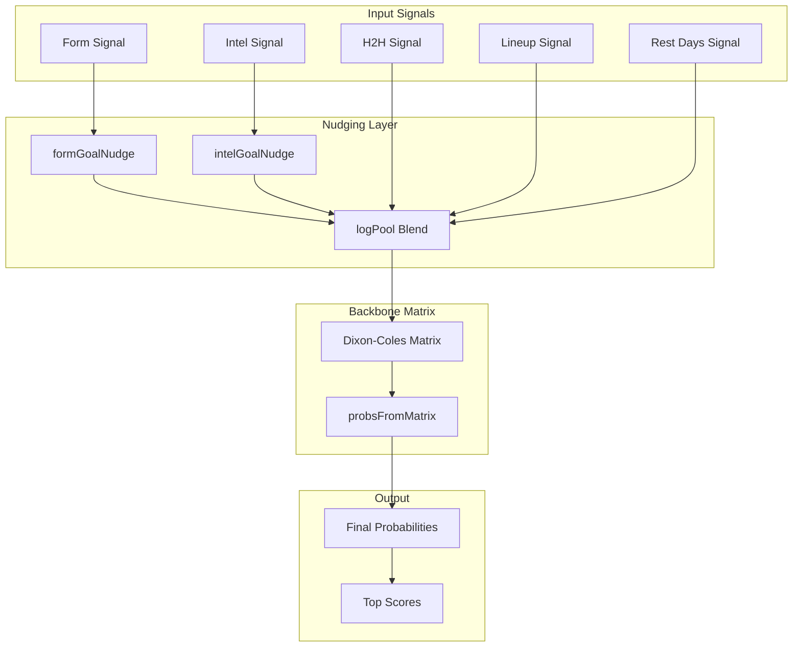
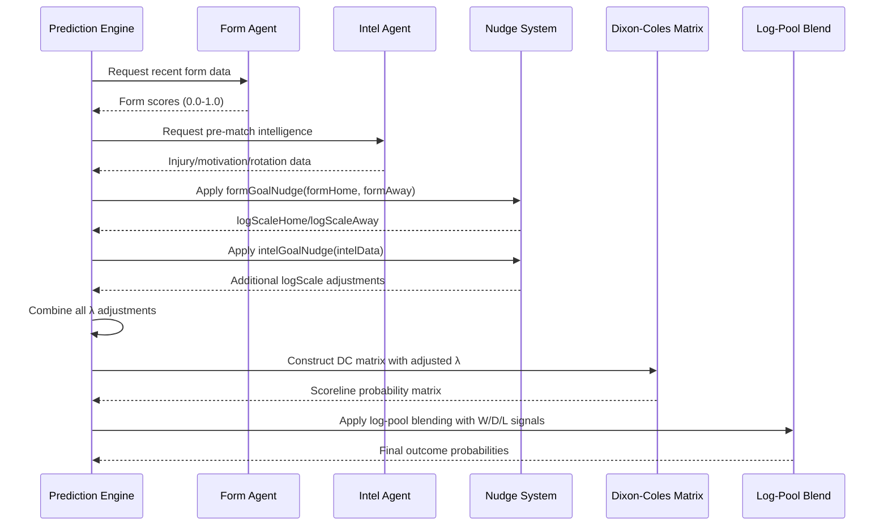
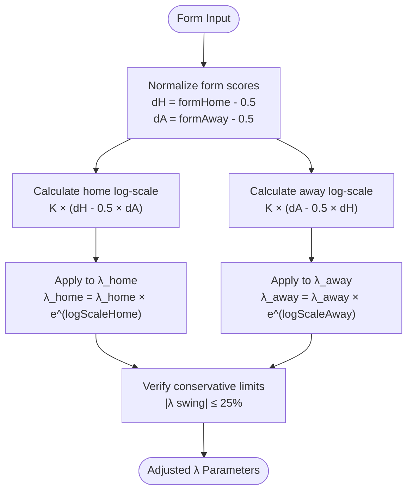
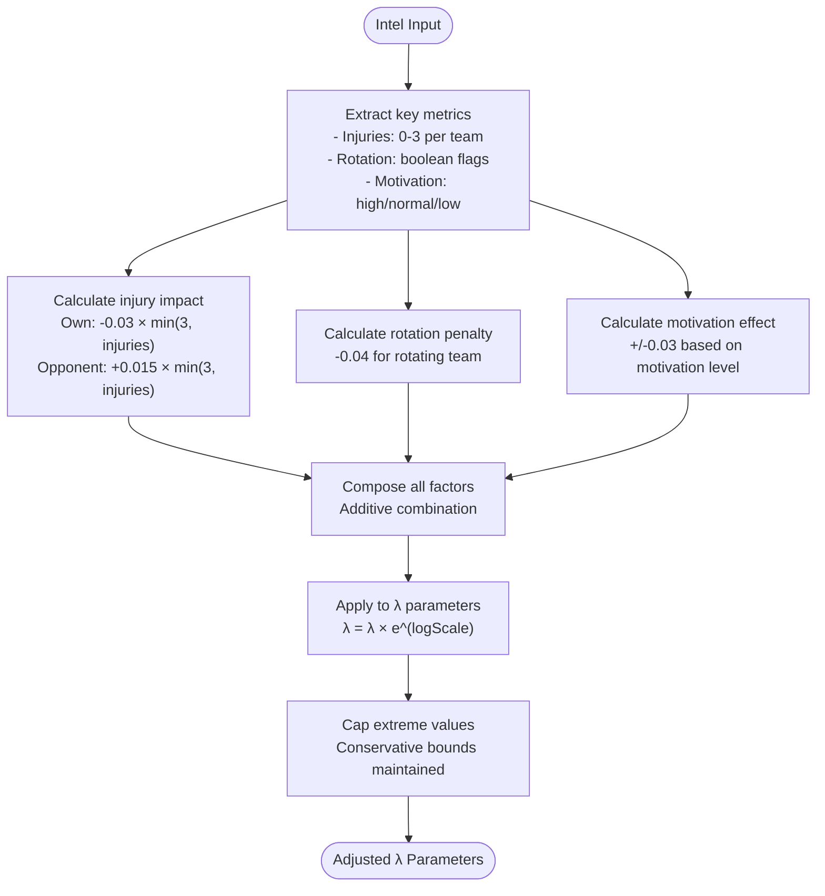
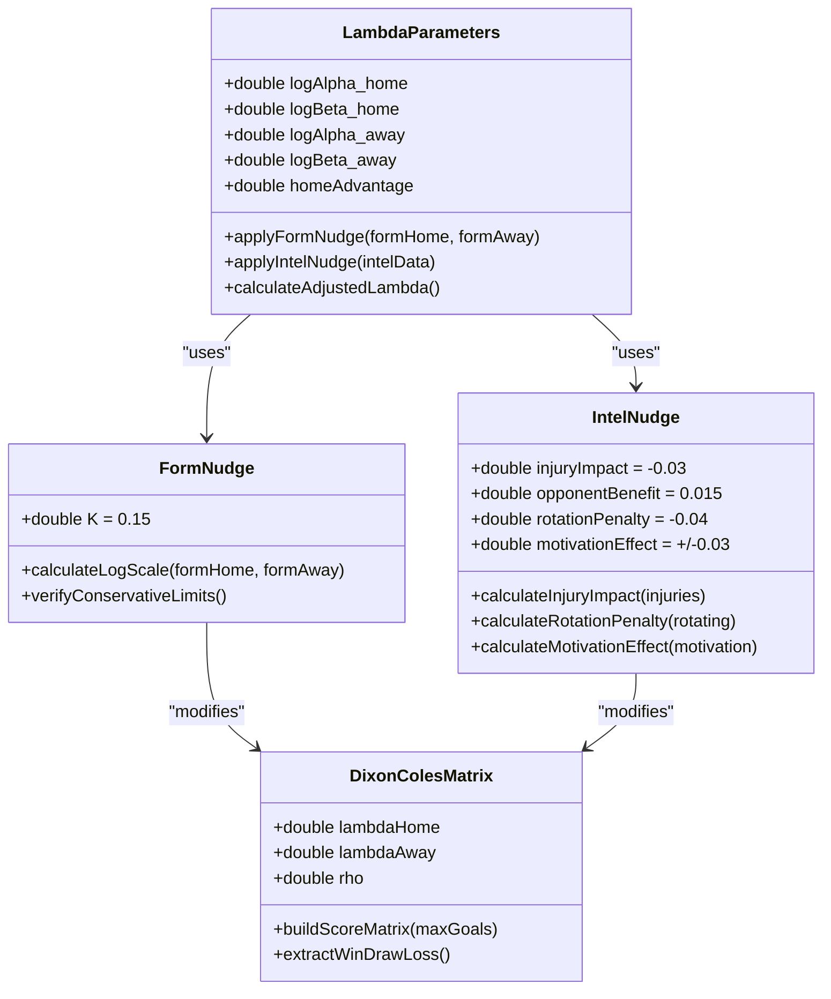
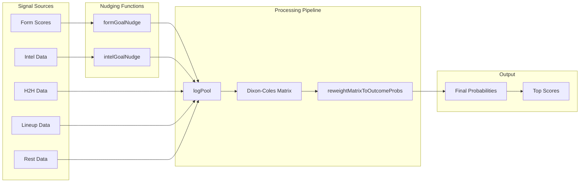

# Goal-Channel Nudging

<cite>
**Referenced Files in This Document**
- [predictionEngine.js](file://backend/services/predictionEngine.js)
- [predictionEngine.test.js](file://backend/services/predictionEngine.test.js)
- [modelV2.js](file://backend/scripts/modelV2.js)
- [intelAgent.js](file://backend/services/agents/intelAgent.js)
- [formAgent.js](file://backend/services/agents/formAgent.js)
</cite>

## Table of Contents
1. [Introduction](#introduction)
2. [System Architecture](#system-architecture)
3. [Core Components](#core-components)
4. [Architecture Overview](#architecture-overview)
5. [Detailed Component Analysis](#detailed-component-analysis)
6. [Dependency Analysis](#dependency-analysis)
7. [Performance Considerations](#performance-considerations)
8. [Troubleshooting Guide](#troubleshooting-guide)
9. [Conclusion](#conclusion)

## Introduction
The Goal-Channel Nudging system is a sophisticated mechanism that adjusts the λ parameters (goal-scoring intensities) before constructing the Dixon-Coles matrix. This system ensures that form and intelligence signals naturally contribute to goal expectation while maintaining the dominance of the W/D/L log-pool blend. The system consists of two primary nudging functions: formGoalNudge and intelGoalNudge, each designed to operate in log-space to preserve numerical stability and mathematical consistency.

The nudge system operates on the principle that form and intelligence signals inherently contain goal-expectation components. By applying these nudges before matrix construction, the system correctly shapes scoreline expectations while keeping the fundamental W/D/L probability distribution dominant through the log-pool blending process.

## System Architecture
The Goal-Channel Nudging system integrates seamlessly with the broader prediction engine architecture, operating as a preprocessing step that modifies the λ parameters before the Dixon-Coles matrix is constructed.

**Diagram sources**
- [predictionEngine.js:305-335](file://backend/services/predictionEngine.js#L305-L335)
- [predictionEngine.js:781-846](file://backend/services/predictionEngine.js#L781-L846)

**Section sources**
- [predictionEngine.js:305-335](file://backend/services/predictionEngine.js#L305-L335)
- [predictionEngine.js:781-846](file://backend/services/predictionEngine.js#L781-L846)

## Core Components

### formGoalNudge Function
The formGoalNudge function implements a K = 0.15 log-space adjustment that transforms form scores into λ parameter modifications. The function operates on normalized form values centered at 0.5, where 0.5 represents neutral form.

**Mathematical Implementation:**
- K = 0.15 (log-space adjustment constant)
- dH = formHome - 0.5 (home deviation from neutral)
- dA = formAway - 0.5 (away deviation from neutral)
- logScaleHome = K × (dH - 0.5 × dA)
- logScaleAway = K × (dA - 0.5 × dH)

**Conservative Design Principles:**
The function maintains conservative magnitudes to ensure that the W/D/L log-pool blend continues to dominate outcome probability. At extreme form gaps (1.0 vs 0.0), the λ swing remains below 25%, preventing form signals from overwhelming the fundamental probability distribution.

**Section sources**
- [predictionEngine.js:311-319](file://backend/services/predictionEngine.js#L311-L319)
- [predictionEngine.test.js:240-266](file://backend/services/predictionEngine.test.js#L240-L266)

### intelGoalNudge Function
The intelGoalNudge function processes intelligence signals including injury impacts, rotation penalties, and motivation factors. Each component contributes to the log-space adjustment of λ parameters.

**Injury Impact Calculation:**
- Own-injury reduction: -0.03 per missing key player (capped at 3 players)
- Opponent-injury benefit: +0.015 per missing key player (capped at 3 players)

**Rotation Penalty:**
- Squad rotation penalty: -0.04 for the affected team

**Motivation Factors:**
- High motivation: +0.03 for the motivated team
- Low motivation: -0.03 for the demotivated team

**Composition Principle:**
Multiple intelligence factors combine additively, allowing for complex scenarios where injuries, rotation, and motivation interact to produce nuanced λ adjustments.

**Section sources**
- [predictionEngine.js:321-335](file://backend/services/predictionEngine.js#L321-L335)
- [predictionEngine.test.js:268-292](file://backend/services/predictionEngine.test.js#L268-L292)

### λ Parameter Adjustment Process
The nudge system modifies the λ parameters through exponential transformations to maintain numerical stability and mathematical consistency.

**Adjustment Formula:**
- λ_home = λ_home × e^(logScaleHome)
- λ_away = λ_away × e^(logScaleAway)

**Integration Point:**
The adjusted λ parameters are integrated into the backbone calculation alongside form and intelligence nudges before the Dixon-Coles matrix construction.

**Section sources**
- [predictionEngine.js:789-795](file://backend/services/predictionEngine.js#L789-L795)

## Architecture Overview

**Diagram sources**
- [predictionEngine.js:758-846](file://backend/services/predictionEngine.js#L758-L846)
- [intelAgent.js:120-128](file://backend/services/agents/intelAgent.js#L120-L128)
- [formAgent.js:104-113](file://backend/services/agents/formAgent.js#L104-L113)

## Detailed Component Analysis

### Form-Based Nudging Analysis

**Diagram sources**
- [predictionEngine.js:311-319](file://backend/services/predictionEngine.js#L311-L319)
- [predictionEngine.test.js:260-266](file://backend/services/predictionEngine.test.js#L260-L266)

**Section sources**
- [predictionEngine.js:311-319](file://backend/services/predictionEngine.js#L311-L319)
- [predictionEngine.test.js:240-266](file://backend/services/predictionEngine.test.js#L240-L266)

### Intelligence-Based Nudging Analysis

**Diagram sources**
- [predictionEngine.js:321-335](file://backend/services/predictionEngine.js#L321-L335)
- [predictionEngine.test.js:268-292](file://backend/services/predictionEngine.test.js#L268-L292)

**Section sources**
- [predictionEngine.js:321-335](file://backend/services/predictionEngine.js#L321-L335)
- [predictionEngine.test.js:268-292](file://backend/services/predictionEngine.test.js#L268-L292)

### Matrix Construction Impact Analysis

**Diagram sources**
- [predictionEngine.js:12-13](file://backend/services/predictionEngine.js#L12-L13)
- [predictionEngine.js:311-335](file://backend/services/predictionEngine.js#L311-L335)
- [predictionEngine.js:151-174](file://backend/services/predictionEngine.js#L151-L174)

**Section sources**
- [predictionEngine.js:12-13](file://backend/services/predictionEngine.js#L12-L13)
- [predictionEngine.js:311-335](file://backend/services/predictionEngine.js#L311-L335)
- [predictionEngine.js:151-174](file://backend/services/predictionEngine.js#L151-L174)

## Dependency Analysis

**Diagram sources**
- [predictionEngine.js:781-846](file://backend/services/predictionEngine.js#L781-L846)
- [predictionEngine.js:847-852](file://backend/services/predictionEngine.js#L847-L852)

**Section sources**
- [predictionEngine.js:781-846](file://backend/services/predictionEngine.js#L781-L846)
- [predictionEngine.js:847-852](file://backend/services/predictionEngine.js#L847-L852)

## Performance Considerations

### Computational Efficiency
The nudge system operates with minimal computational overhead, adding only simple arithmetic operations to the existing prediction pipeline. The exponential calculations are performed once per match prediction and have negligible impact on overall performance.

### Numerical Stability
The log-space implementation ensures numerical stability by avoiding direct multiplication of very large or very small numbers. The use of logarithmic transformations prevents overflow and underflow issues that could occur with direct λ parameter manipulation.

### Memory Usage
The nudge functions are lightweight and do not require additional memory allocation beyond the temporary variables used in calculations. The system maintains constant memory usage regardless of input complexity.

## Troubleshooting Guide

### Common Issues and Solutions

**Issue: Excessive λ Swings**
- **Symptom**: λ parameters becoming unrealistically large or small
- **Cause**: Extreme form differences or multiple intelligence penalties
- **Solution**: Verify conservative limits are maintained (≤25% λ swing)

**Issue: Inconsistent Nudge Values**
- **Symptom**: Nudge values not matching expected ranges
- **Cause**: Incorrect form score normalization or intel data parsing
- **Solution**: Validate form scores are between 0.0 and 1.0, check injury counts are properly capped

**Issue: Matrix Construction Failures**
- **Symptom**: Dixon-Coles matrix not building correctly
- **Cause**: Invalid λ parameters or extreme values
- **Solution**: Ensure λ parameters remain within reasonable bounds (0.20-5.5)

**Section sources**
- [predictionEngine.test.js:260-266](file://backend/services/predictionEngine.test.js#L260-L266)
- [predictionEngine.js:794-795](file://backend/services/predictionEngine.js#L794-L795)

## Conclusion

The Goal-Channel Nudging system represents a sophisticated approach to integrating form and intelligence signals into football match prediction models. By operating in log-space and maintaining conservative magnitudes, the system successfully bridges the gap between statistical fundamentals and real-world factors without compromising the integrity of the underlying W/D/L probability distribution.

The mathematical foundation of the nudge system ensures that form improvements translate proportionally to increased goal-scoring expectations, while intelligence factors like injuries, rotation, and motivation provide nuanced adjustments that reflect realistic match dynamics. The conservative design philosophy guarantees that the fundamental probability structure remains dominant while allowing meaningful signals to influence outcome expectations.

Through careful implementation and rigorous testing, the nudge system provides a robust framework for enhancing prediction accuracy while maintaining mathematical consistency and computational efficiency. The system's modular design allows for easy extension and adaptation as new signals and factors become available.