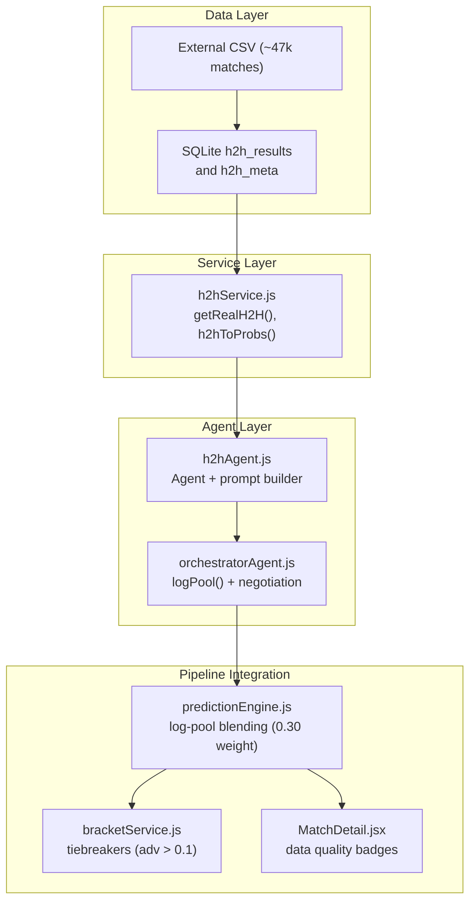
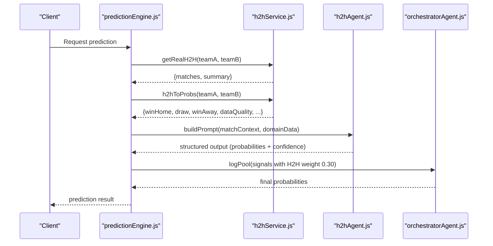
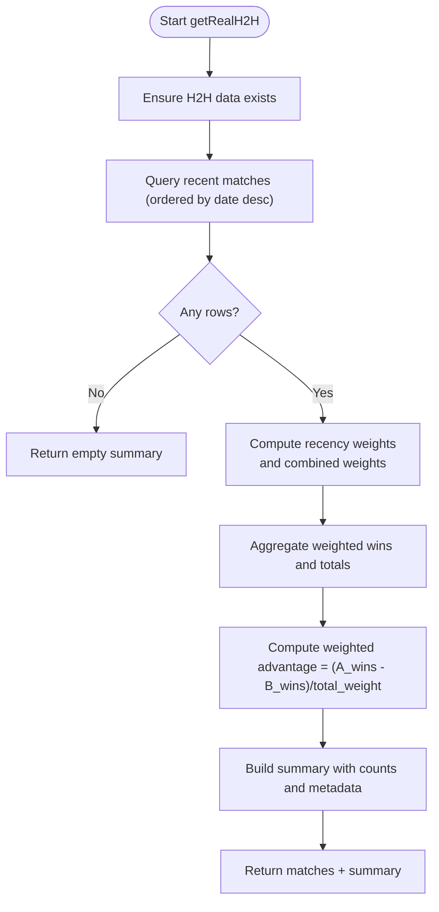
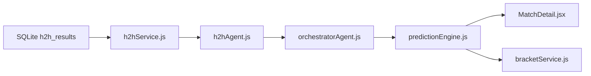

# Head-to-Head Signal

<cite>
**Referenced Files in This Document**
- [h2hService.js](file://backend/services/h2hService.js)
- [h2hAgent.js](file://backend/services/agents/h2hAgent.js)
- [predictionEngine.js](file://backend/services/predictionEngine.js)
- [orchestratorAgent.js](file://backend/services/agents/orchestratorAgent.js)
- [bracketService.js](file://backend/services/bracketService.js)
- [MatchDetail.jsx](file://frontend/src/pages/MatchDetail.jsx)
- [SPEC-PREDICT.md](file://specs/SPEC-PREDICT.md)
- [README.md](file://README.md)
</cite>

## Table of Contents
1. [Introduction](#introduction)
2. [Project Structure](#project-structure)
3. [Core Components](#core-components)
4. [Architecture Overview](#architecture-overview)
5. [Detailed Component Analysis](#detailed-component-analysis)
6. [Dependency Analysis](#dependency-analysis)
7. [Performance Considerations](#performance-considerations)
8. [Troubleshooting Guide](#troubleshooting-guide)
9. [Conclusion](#conclusion)

## Introduction
This document explains the Head-to-Head (H2H) adjustment signal used in the prediction pipeline. It covers the weighted historical advantage calculation using the real 47k match dataset, the minimum meeting requirements for reliable predictions, the weighted advantage computation formula, historical match weighting schemes, and the threshold-based signal activation. It also documents the data quality assessment mechanism and how the H2H signal contributes to the log-pool blending with a 0.30 weight. Finally, it provides examples of signal processing, quality scoring, and integration with the overall prediction pipeline.

## Project Structure
The H2H signal spans three layers:
- Data layer: a local SQLite table seeded from the external martj42 dataset, with competition-weighted match records.
- Service layer: a dedicated H2H service that computes weighted advantages and converts them to probability vectors.
- Agent and orchestration layer: an LLM agent that interprets the H2H record and integrates it into the multi-agent prediction system via log-pool blending.

**Diagram sources**
- [h2hService.js:1-315](file://backend/services/h2hService.js#L1-L315)
- [h2hAgent.js:1-107](file://backend/services/agents/h2hAgent.js#L1-L107)
- [orchestratorAgent.js:1-200](file://backend/services/agents/orchestratorAgent.js#L1-L200)
- [predictionEngine.js:92-100](file://backend/services/predictionEngine.js#L92-L100)
- [bracketService.js:504-517](file://backend/services/bracketService.js#L504-L517)
- [MatchDetail.jsx:1139-1170](file://frontend/src/pages/MatchDetail.jsx#L1139-L1170)

**Section sources**
- [README.md:18-105](file://README.md#L18-L105)
- [SPEC-PREDICT.md:131-147](file://specs/SPEC-PREDICT.md#L131-L147)

## Core Components
- Real H2H dataset: The system seeds a local SQLite table from the martj42 CSV, normalizing team names and storing matches with competition weights and neutral venue flags.
- Weighted advantage computation: Historical matches are enriched with competition weight and recency weight, then combined to compute a normalized weighted advantage score.
- Probability conversion: The H2H summary is transformed into a W/D/L probability vector with shrinkage toward base rates and data quality scoring.
- Threshold-based activation: The H2H signal is included in the multi-agent pipeline only when sufficient historical meetings exist; otherwise, it is skipped.
- Log-pool blending: The H2H probability vector is blended with other signals using a 0.30 weight in the geometric mean (log-pool) combination.
- Tiebreaker usage: In bracket tiebreaking, H2H advantage is used when at least two meetings exist and the absolute advantage exceeds a small threshold.

**Section sources**
- [h2hService.js:181-312](file://backend/services/h2hService.js#L181-L312)
- [h2hAgent.js:18-106](file://backend/services/agents/h2hAgent.js#L18-L106)
- [predictionEngine.js:92-100](file://backend/services/predictionEngine.js#L92-L100)
- [predictionEngine.js:835-845](file://backend/services/predictionEngine.js#L835-L845)
- [bracketService.js:504-517](file://backend/services/bracketService.js#L504-L517)

## Architecture Overview
The H2H signal follows a clear flow:
1. Seed and normalize the dataset into SQLite.
2. Query recent matches between two teams and enrich with weights.
3. Compute weighted advantage and convert to probabilities.
4. Integrate into the multi-agent pipeline via log-pool blending with a 0.30 weight.
5. Use H2H advantage as a tiebreaker in bracket simulations when thresholds are met.

**Diagram sources**
- [predictionEngine.js:835-845](file://backend/services/predictionEngine.js#L835-L845)
- [h2hService.js:181-312](file://backend/services/h2hService.js#L181-L312)
- [h2hAgent.js:38-96](file://backend/services/agents/h2hAgent.js#L38-L96)
- [orchestratorAgent.js:41-71](file://backend/services/agents/orchestratorAgent.js#L41-L71)

## Detailed Component Analysis

### Weighted Historical Advantage Calculation
- Dataset seeding: The system downloads the CSV, parses lines, normalizes team names, and inserts records into SQLite with competition weights and neutral flags.
- Query and enrichment: The query returns up to a fixed number of recent matches, then applies recency weighting so the most recent match has full weight and older ones taper off.
- Combined weights: Each match receives a combined weight equal to competition weight multiplied by recency weight.
- Outcome aggregation: Wins for each side are summed using the combined weights, and a normalized weighted advantage is computed as (weighted wins_A - weighted wins_B) / total_weight.
- Summary fields: The summary includes counts of wins, draws, total matches, World Cup meetings, last meeting, and the computed weighted advantage.

**Diagram sources**
- [h2hService.js:95-165](file://backend/services/h2hService.js#L95-L165)
- [h2hService.js:201-266](file://backend/services/h2hService.js#L201-L266)

**Section sources**
- [h2hService.js:95-165](file://backend/services/h2hService.js#L95-L165)
- [h2hService.js:201-266](file://backend/services/h2hService.js#L201-L266)

### Minimum Meeting Requirements and Reliability
- Minimum meetings: The H2H signal is considered unreliable when fewer than two meetings exist. In this case, the system falls back to neutral probabilities and marks data quality as NO_DATA.
- Data quality thresholds: When computing probabilities, data quality is assessed based on total match count:
  - HIGH: ≥8 meetings
  - MEDIUM: ≥4 meetings
  - LOW: <4 meetings
- Agent-level fallback: The H2H agent builds a prompt indicating near-uniform probabilities and low confidence when fewer than two meetings are available.

**Section sources**
- [h2hService.js:275-278](file://backend/services/h2hService.js#L275-L278)
- [h2hService.js:298-299](file://backend/services/h2hService.js#L298-L299)
- [h2hAgent.js:55-61](file://backend/services/agents/h2hAgent.js#L55-L61)

### Weighted Advantage Computation Formula and Historical Weighting Schemes
- Competition weighting: Matches are assigned weights based on tournament type:
  - FIFA World Cup: 4.0
  - FIFA World Cup qualification: 2.5
  - Continental championship: 2.0
  - Continental qualification: 1.5
  - Nations League / Confederations: 1.2
  - Friendly: 0.5
  - Other official matches: 1.0
- Recency weighting: Most recent match = 1.0; oldest in the set ≈ 0.3, with linear interpolation across the set.
- Combined weight: Each match’s weight equals competition weight × recency weight.
- Normalized advantage: Advantage score is computed as (sum of weighted A-wins − sum of weighted B-wins) / total combined weight, ranging from −1 to +1.

**Section sources**
- [h2hService.js:56-67](file://backend/services/h2hService.js#L56-L67)
- [h2hService.js:214-217](file://backend/services/h2hService.js#L214-L217)
- [h2hService.js:252-254](file://backend/services/h2hService.js#L252-L254)

### Probability Conversion and Shrinkage
- Raw frequencies: The proportion of wins, draws, and losses is computed from the weighted counts.
- Shrinkage toward base rates: To avoid overfitting sparse histories, the raw probabilities are shrunk toward empirical base rates:
  - Home win: ~39%
  - Draw: ~27%
  - Away win: ~34%
  - Shrinkage strength increases with more data, capped at a minimum.
- Normalization: Probabilities are normalized to sum to 1.
- Data quality assignment: Based on total match count, quality is HIGH/MEDIUM/LOW.

**Section sources**
- [h2hService.js:282-311](file://backend/services/h2hService.js#L282-L311)

### Threshold-Based Signal Activation
- Multi-agent pipeline: The H2H signal is included only when the H2H probability vector is available (i.e., at least two meetings).
- Log-pool blending: The H2H contribution uses a fixed weight of 0.30 in the geometric mean combination with other signals.
- Factor reporting: The weighted advantage is used to determine favorability and impact in the factors list, with a small threshold applied to treat near-zero advantage as neutral.

**Section sources**
- [predictionEngine.js:837-842](file://backend/services/predictionEngine.js#L837-L842)
- [predictionEngine.js:477-492](file://backend/services/predictionEngine.js#L477-L492)

### Tiebreaker Usage in Bracket Simulation
- Tiebreaker logic: When two teams are tied on points, the system resolves the tie using H2H advantage if at least two meetings exist and the absolute advantage exceeds a small threshold.
- Reporting: The tiebreaker method is recorded in the bracket results.

**Section sources**
- [bracketService.js:504-517](file://backend/services/bracketService.js#L504-L517)

### Data Quality Assessment and UI Presentation
- Backend quality scoring: Data quality is computed from the total number of meetings.
- Frontend presentation: The match detail page displays a data quality badge reflecting the quality derived from the meeting count.

**Section sources**
- [h2hService.js:298-299](file://backend/services/h2hService.js#L298-L299)
- [MatchDetail.jsx:1139-1152](file://frontend/src/pages/MatchDetail.jsx#L1139-L1152)

### Integration with the Overall Prediction Pipeline
- Multi-agent orchestration: The H2H agent interprets the H2H record and provides structured probabilities with confidence and evidence. The orchestrator blends all agent outputs via log-pool.
- Single-model fallback: When multi-agent is disabled, the H2H signal is not used; the pipeline relies on the Dixon-Coles backbone and other deterministic signals.

**Section sources**
- [h2hAgent.js:18-106](file://backend/services/agents/h2hAgent.js#L18-L106)
- [orchestratorAgent.js:41-71](file://backend/services/agents/orchestratorAgent.js#L41-L71)
- [README.md:99-105](file://README.md#L99-L105)

## Dependency Analysis
The H2H signal depends on:
- SQLite-backed storage of normalized historical matches with competition weights.
- The H2H service for weighted advantage computation and probability conversion.
- The H2H agent for structured interpretation and prompting.
- The orchestrator for log-pool blending and conflict resolution.
- The prediction engine for integrating the H2H signal into the final probabilities.
- The bracket service for tiebreaker usage.

**Diagram sources**
- [h2hService.js:70-90](file://backend/services/h2hService.js#L70-L90)
- [h2hAgent.js:14-16](file://backend/services/agents/h2hAgent.js#L14-L16)
- [orchestratorAgent.js:28-37](file://backend/services/agents/orchestratorAgent.js#L28-L37)
- [predictionEngine.js:40-43](file://backend/services/predictionEngine.js#L40-L43)
- [bracketService.js:504-517](file://backend/services/bracketService.js#L504-L517)

**Section sources**
- [h2hService.js:70-90](file://backend/services/h2hService.js#L70-L90)
- [h2hAgent.js:14-16](file://backend/services/agents/h2hAgent.js#L14-L16)
- [orchestratorAgent.js:28-37](file://backend/services/agents/orchestratorAgent.js#L28-L37)
- [predictionEngine.js:40-43](file://backend/services/predictionEngine.js#L40-L43)
- [bracketService.js:504-517](file://backend/services/bracketService.js#L504-L517)

## Performance Considerations
- Offline-first design: After initial seeding, all H2H queries run locally against SQLite, minimizing latency and avoiding external dependencies.
- Indexing: A composite index on team pairs accelerates lookups for H2H queries.
- Weighted aggregation: The computation scales linearly with the number of queried matches, keeping overhead predictable.
- Data quality gating: Skipping weak signals prevents noisy contributions and maintains model stability.

[No sources needed since this section provides general guidance]

## Troubleshooting Guide
- No historical data: When fewer than two meetings exist, the system returns neutral probabilities and marks data quality as NO_DATA. Verify team IDs and ensure the dataset is seeded.
- Seeding failures: If the initial CSV download fails, the seeding routine logs an error and leaves the table uninitialized. Retry seeding or inspect network connectivity.
- Name normalization mismatches: Team names must be present in the normalization map; otherwise, matches are skipped during seeding. Confirm team names align with the expected mapping.
- Agent prompt issues: If the H2H agent fails to fetch domain data, it logs a warning and returns null, causing the agent to be skipped in the multi-agent pipeline.

**Section sources**
- [h2hService.js:160-164](file://backend/services/h2hService.js#L160-L164)
- [h2hService.js:133-136](file://backend/services/h2hService.js#L133-L136)
- [h2hAgent.js:41-44](file://backend/services/agents/h2hAgent.js#L41-L44)

## Conclusion
The H2H signal leverages a real 47k match dataset to compute a competition- and recency-weighted historical advantage, converting it into a robust probability vector with shrinkage and quality scoring. It activates only when sufficient data exists, integrates into the multi-agent pipeline via log-pool blending with a 0.30 weight, and supports tiebreaking in bracket simulations when thresholds are met. Together, these mechanisms ensure that historical head-to-head patterns contribute meaningfully to predictions while maintaining reliability and interpretability.