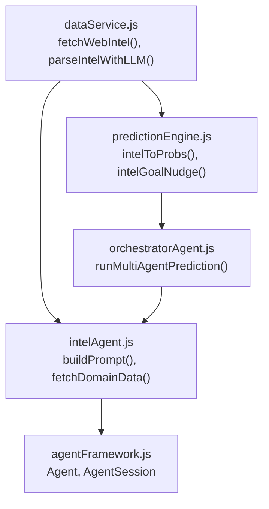
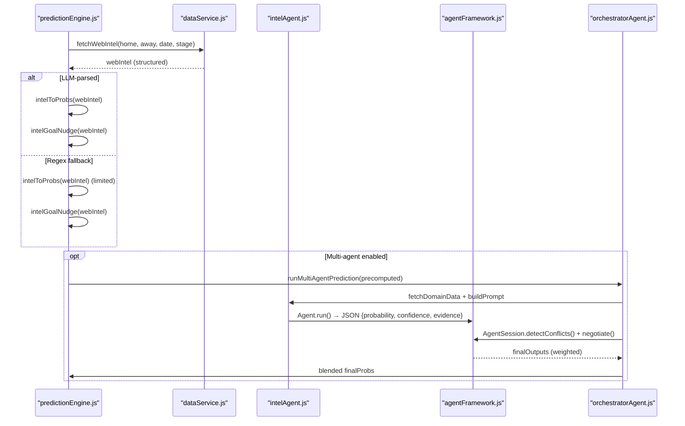
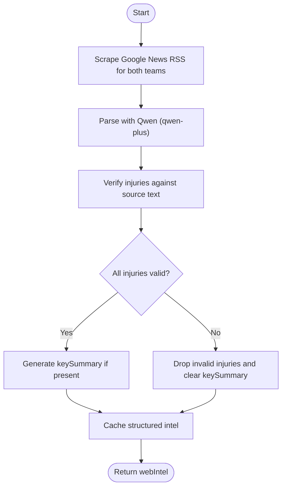
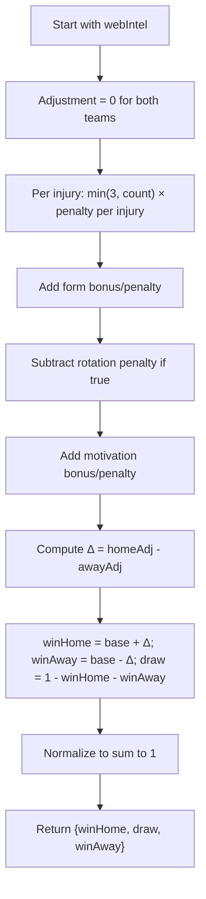
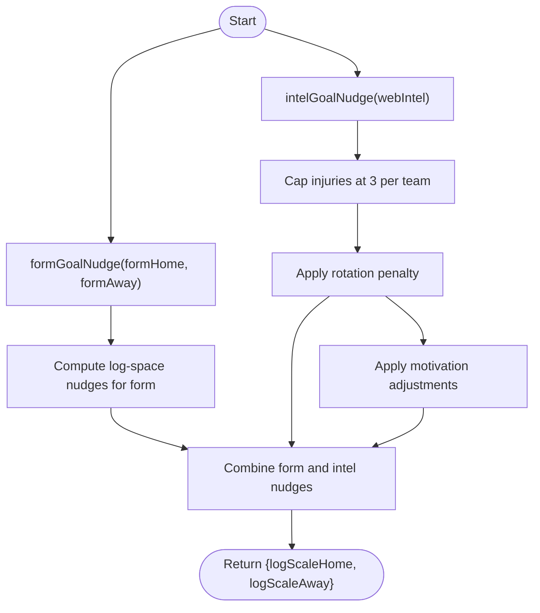
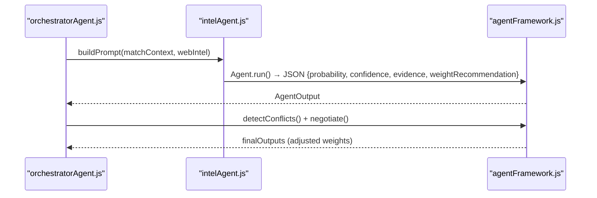
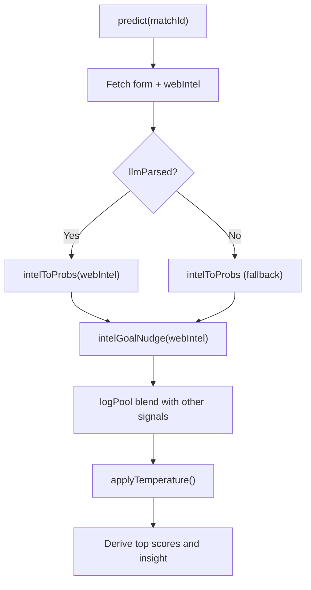
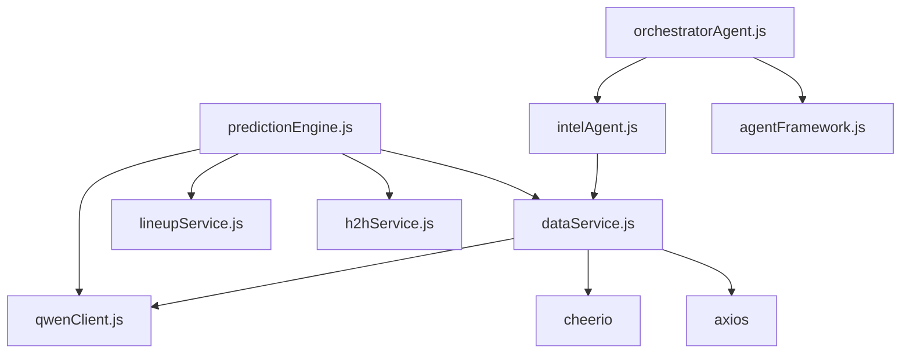

# Intelligence Signal

<cite>
**Referenced Files in This Document**
- [intelAgent.js](file://backend/services/agents/intelAgent.js)
- [dataService.js](file://backend/services/dataService.js)
- [predictionEngine.js](file://backend/services/predictionEngine.js)
- [orchestratorAgent.js](file://backend/services/agents/orchestratorAgent.js)
- [agentFramework.js](file://backend/services/agents/agentFramework.js)
- [README.md](file://README.md)
</cite>

## Table of Contents
1. [Introduction](#introduction)
2. [Project Structure](#project-structure)
3. [Core Components](#core-components)
4. [Architecture Overview](#architecture-overview)
5. [Detailed Component Analysis](#detailed-component-analysis)
6. [Dependency Analysis](#dependency-analysis)
7. [Performance Considerations](#performance-considerations)
8. [Troubleshooting Guide](#troubleshooting-guide)
9. [Conclusion](#conclusion)

## Introduction
This document explains the Intelligence (INTEL) adjustment signal system used to gather and interpret pre-match intelligence for the World Cup 2026 prediction engine. It covers the web scraping and LLM parsing workflow, the intelToProbs function that converts intelligence into a probability shift, and the goal expectation nudge system driven by formGoalNudge and intelGoalNudge. It also documents signal quality assessment, conflict handling in multi-agent mode, and integration with the prediction engine.

## Project Structure
The INTEL signal spans several modules:
- Web scraping and LLM parsing: performed by dataService’s fetchWebIntel and parseIntelWithLLM
- Interpretation and probability conversion: handled by predictionEngine’s intelToProbs and intelGoalNudge
- Multi-agent orchestration: managed by orchestratorAgent and agentFramework, which can route intelligence to IntelAgent for LLM interpretation
- Agent roles: IntelAgent consumes structured intelligence and returns a probability shift with confidence and evidence

**Diagram sources**
- [dataService.js:432-509](file://backend/services/dataService.js#L432-L509)
- [predictionEngine.js:282-335](file://backend/services/predictionEngine.js#L282-L335)
- [intelAgent.js:50-127](file://backend/services/agents/intelAgent.js#L50-L127)
- [orchestratorAgent.js:319-499](file://backend/services/agents/orchestratorAgent.js#L319-L499)
- [agentFramework.js:209-330](file://backend/services/agents/agentFramework.js#L209-L330)

**Section sources**
- [README.md:18-105](file://README.md#L18-L105)

## Core Components
- Web scraping and LLM parsing:
  - fetchWebIntel scrapes Google News RSS for both teams, then passes raw text to parseIntelWithLLM for structured extraction. Anti-hallucination checks ensure only verified injuries are included.
  - Fallback regex extraction is available when LLM parsing fails.
- Intel probability conversion:
  - intelToProbs transforms injuries, rotation, motivation, and form into a W/D/L probability shift using bounded adjustments.
- Goal expectation nudges:
  - formGoalNudge and intelGoalNudge compute log-space nudges to λ for home and away teams, keeping changes conservative and phase-appropriate.
- Multi-agent integration:
  - When multi-agent mode is enabled, IntelAgent builds a prompt from the structured intelligence and returns a probability shift with confidence and evidence. The orchestrator coordinates agent outputs and resolves conflicts.

**Section sources**
- [dataService.js:268-509](file://backend/services/dataService.js#L268-L509)
- [predictionEngine.js:282-335](file://backend/services/predictionEngine.js#L282-L335)
- [intelAgent.js:50-127](file://backend/services/agents/intelAgent.js#L50-L127)
- [orchestratorAgent.js:319-499](file://backend/services/agents/orchestratorAgent.js#L319-L499)
- [agentFramework.js:40-53](file://backend/services/agents/agentFramework.js#L40-L53)

## Architecture Overview
The INTEL pipeline integrates data fetching, LLM parsing, and signal blending:

**Diagram sources**
- [predictionEngine.js:758-846](file://backend/services/predictionEngine.js#L758-L846)
- [dataService.js:432-509](file://backend/services/dataService.js#L432-L509)
- [intelAgent.js:50-127](file://backend/services/agents/intelAgent.js#L50-L127)
- [agentFramework.js:209-330](file://backend/services/agents/agentFramework.js#L209-L330)
- [orchestratorAgent.js:319-499](file://backend/services/agents/orchestratorAgent.js#L319-L499)

## Detailed Component Analysis

### Web Scraping and LLM Parsing Workflow
- Fetch raw news:
  - scrapeTeamNews queries Google News RSS for each team and concatenates items.
- Structured extraction:
  - parseIntelWithLLM sends both raw texts plus match context to Qwen (qwen-plus) to produce a JSON object containing injuries, form, rotation, motivation, and a concise key summary.
- Anti-hallucination safeguards:
  - verifyInjuriesAgainstSource ensures claimed injuries appear in the source text near an injury-related keyword within a narrow context window.
  - If any injury is dropped, keySummary is cleared to prevent contradictory statements.
- Fallback:
  - scrapeInjuriesFallback uses regex to extract injury mentions when LLM parsing fails.
- Caching and freshness:
  - Results are cached with a short TTL (intel: 4 hours) to balance freshness and cost.

**Diagram sources**
- [dataService.js:273-292](file://backend/services/dataService.js#L273-L292)
- [dataService.js:313-399](file://backend/services/dataService.js#L313-L399)
- [dataService.js:402-430](file://backend/services/dataService.js#L402-L430)
- [dataService.js:432-509](file://backend/services/dataService.js#L432-L509)

**Section sources**
- [dataService.js:268-509](file://backend/services/dataService.js#L268-L509)

### Intel Probability Conversion: intelToProbs
- Injury impact:
  - Each confirmed injury contributes a capped penalty: limiting to a maximum of 3 injuries yields a bounded reduction per team.
- Form assessment:
  - excellent: +0.07; good: +0.03; normal: 0; poor: -0.06.
- Rotation penalty:
  - Confirmed rotation subtracts 0.08 from the team’s adjustment.
- Motivation impact:
  - high: +0.04; low: -0.05; normal: 0.
- Outcome construction:
  - Base probability is 1/3 for each outcome.
  - Adjustments are applied asymmetrically: home adjustment affects home and away outcomes; away adjustment similarly affects both sides.
  - Probabilities are normalized to sum to 1.

**Diagram sources**
- [predictionEngine.js:282-303](file://backend/services/predictionEngine.js#L282-L303)

**Section sources**
- [predictionEngine.js:282-303](file://backend/services/predictionEngine.js#L282-L303)

### Goal Expectation Nudge: formGoalNudge and intelGoalNudge
- formGoalNudge:
  - Computes log-space nudges to λ based on form gap between teams, keeping changes conservative.
- intelGoalNudge:
  - Caps injury impact at 3 missing players per team.
  - Applies penalties for own injuries and small boosts for opponents’ injuries.
  - Adds penalties for confirmed rotation and adjusts for motivation states.

**Diagram sources**
- [predictionEngine.js:311-335](file://backend/services/predictionEngine.js#L311-L335)

**Section sources**
- [predictionEngine.js:311-335](file://backend/services/predictionEngine.js#L311-L335)

### Multi-Agent Integration and Signal Quality
- IntelAgent:
  - Builds a prompt from the structured intelligence and asks Qwen (qwen-plus) to assess probability impact with confidence and evidence.
  - The prompt explicitly instructs the model to reference only confirmed facts and to reduce confidence when data is sparse or regex-only.
- AgentSession:
  - Detects conflicts (≥20% outcome delta) and negotiates resolutions.
  - Adjusts weights: winner gains 1.3× weight; loser drops to 0.6× weight.
- Signal quality:
  - llmParsed indicates whether Qwen produced a structured extraction; regex fallback lowers confidence and weight recommendation.

**Diagram sources**
- [intelAgent.js:64-117](file://backend/services/agents/intelAgent.js#L64-L117)
- [agentFramework.js:355-503](file://backend/services/agents/agentFramework.js#L355-L503)
- [orchestratorAgent.js:376-411](file://backend/services/agents/orchestratorAgent.js#L376-L411)

**Section sources**
- [intelAgent.js:20-41](file://backend/services/agents/intelAgent.js#L20-L41)
- [agentFramework.js:32-53](file://backend/services/agents/agentFramework.js#L32-L53)
- [orchestratorAgent.js:376-411](file://backend/services/agents/orchestratorAgent.js#L376-L411)

### Integration with the Prediction Engine
- Single-model path:
  - fetchWebIntel is called; if llmParsed is true, intelToProbs produces a W/D/L shift; intelGoalNudge computes λ nudges; signals are combined via log-pool blending.
- Multi-agent path:
  - runMultiAgentPrediction precomputes backbone matrices and delegates intelligence interpretation to IntelAgent; outputs are blended with other agents.

**Diagram sources**
- [predictionEngine.js:758-846](file://backend/services/predictionEngine.js#L758-L846)

**Section sources**
- [predictionEngine.js:758-846](file://backend/services/predictionEngine.js#L758-L846)

## Dependency Analysis
- dataService depends on:
  - cheerio for HTML/XML parsing
  - axios for HTTP requests
  - Qwen client for structured extraction
- predictionEngine depends on:
  - dataService for form and intel
  - h2hService and lineupService for complementary signals
  - qwenClient for insight generation
- agentFramework provides:
  - Agent and AgentSession for multi-agent orchestration
- orchestratorAgent composes:
  - statistical, form, h2h, intel, and lineup agents

**Diagram sources**
- [dataService.js:7-21](file://backend/services/dataService.js#L7-L21)
- [predictionEngine.js:37-43](file://backend/services/predictionEngine.js#L37-L43)
- [orchestratorAgent.js:28-37](file://backend/services/agents/orchestratorAgent.js#L28-L37)
- [agentFramework.js:27-29](file://backend/services/agents/agentFramework.js#L27-L29)

**Section sources**
- [dataService.js:7-21](file://backend/services/dataService.js#L7-L21)
- [predictionEngine.js:37-43](file://backend/services/predictionEngine.js#L37-L43)
- [orchestratorAgent.js:28-37](file://backend/services/agents/orchestratorAgent.js#L28-L37)

## Performance Considerations
- Caching:
  - Intel cache TTL is 4 hours to balance freshness and cost.
- Conservative nudges:
  - Goal expectation nudges are small to preserve the backbone model’s dominance.
- Parallelization:
  - Multi-agent mode runs agents concurrently; conflict detection and negotiation occur in rounds to keep latency reasonable.
- Anti-hallucination filtering:
  - Reduces costly retries and improves signal reliability.

[No sources needed since this section provides general guidance]

## Troubleshooting Guide
- LLM parsing failures:
  - parseIntelWithLLM returns null on error; dataService falls back to regex extraction and caches defaults.
- Anti-hallucination drops:
  - If injuries are removed due to lack of nearby injury keywords, keySummary is cleared to avoid contradictions.
- Multi-agent parse errors:
  - AgentSession marks outputs with flags and falls back to uniform priors; negotiation continues with remaining agents.
- Signal quality flags:
  - llmParsed indicates whether extraction was successful; regex fallback lowers confidence and weight recommendation.

**Section sources**
- [dataService.js:395-399](file://backend/services/dataService.js#L395-L399)
- [dataService.js:490-501](file://backend/services/dataService.js#L490-L501)
- [agentFramework.js:122-156](file://backend/services/agents/agentFramework.js#L122-L156)
- [intelAgent.js:113-117](file://backend/services/agents/intelAgent.js#L113-L117)

## Conclusion
The INTEL adjustment signal system combines robust web scraping, strict anti-hallucination verification, and careful probability modeling to produce reliable pre-match intelligence signals. Whether used in single-model or multi-agent mode, the system balances nuance and reliability, ensuring that intelligence inputs meaningfully influence both outcome probabilities and expected goals without overwhelming the underlying Dixon–Coles backbone.