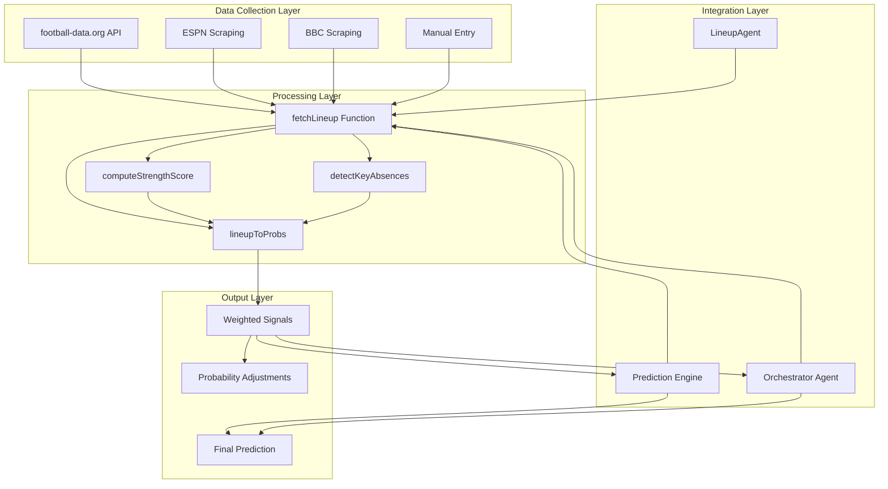
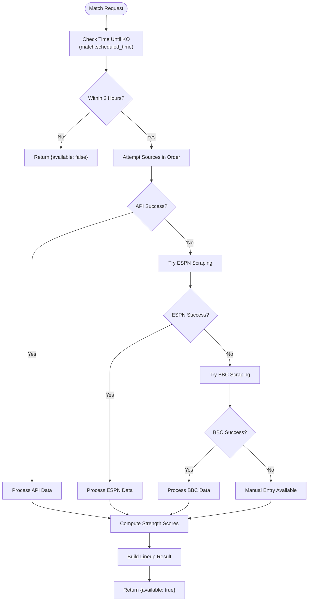
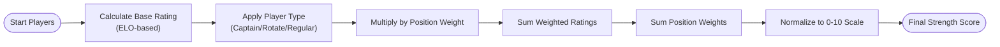
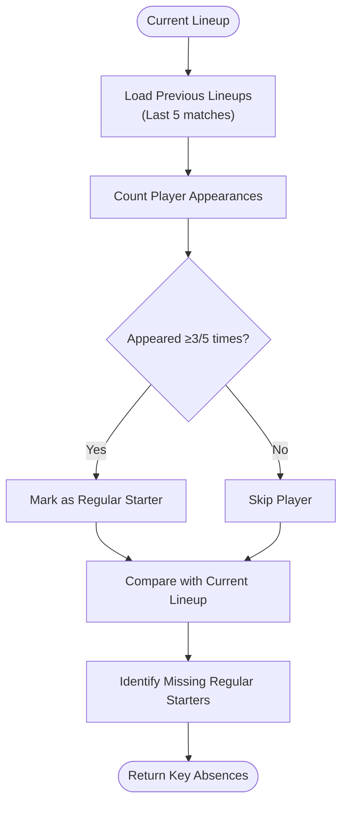
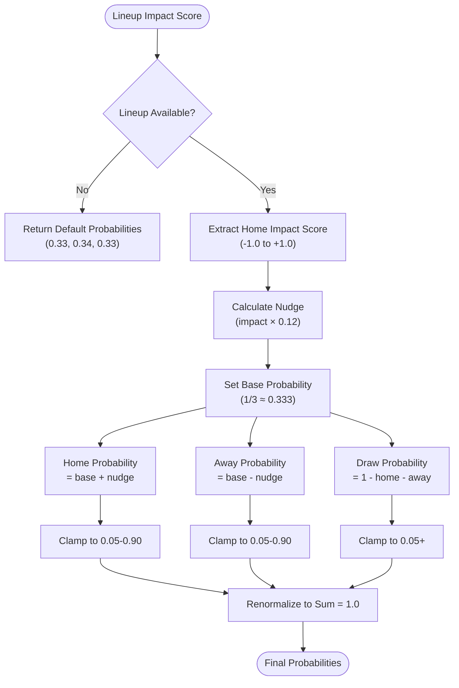
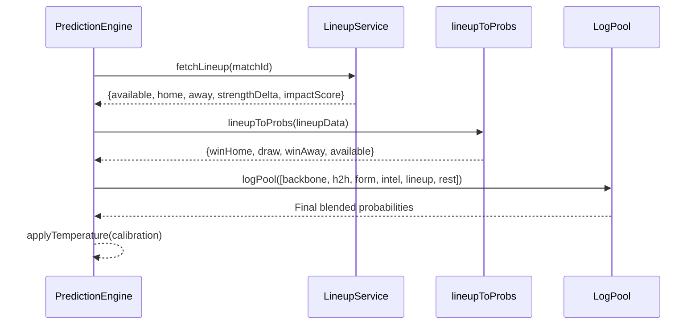
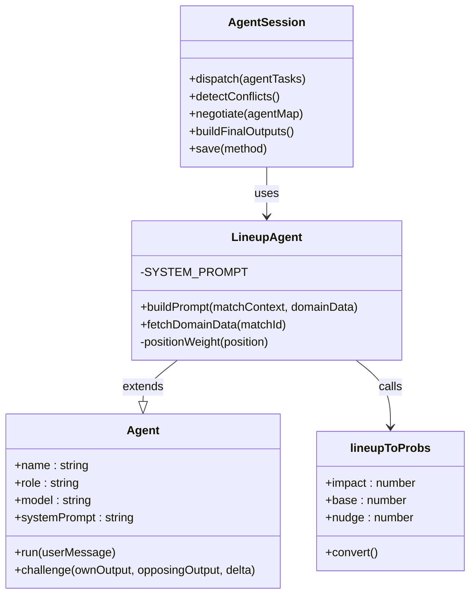

# Lineup Signal

<cite>
**Referenced Files in This Document**
- [lineupAgent.js](file://backend/services/agents/lineupAgent.js)
- [lineupService.js](file://backend/services/lineupService.js)
- [predictionEngine.js](file://backend/services/predictionEngine.js)
- [orchestratorAgent.js](file://backend/services/agents/orchestratorAgent.js)
- [SPEC.md](file://specs/SPEC.md)
- [MatchDetail.jsx](file://frontend/src/pages/MatchDetail.jsx)
</cite>

## Table of Contents
1. [Introduction](#introduction)
2. [System Architecture](#system-architecture)
3. [Signal Availability Criteria](#signal-availability-criteria)
4. [Lineup Strength Scoring Methodology](#lineup-strength-scoring-methodology)
5. [Key Absence Impact Assessment](#key-absence-impact-assessment)
6. [Lineup to Probabilities Conversion](#lineup-to-probabilities-conversion)
7. [Integration with Prediction Engine](#integration-with-prediction-engine)
8. [Processing Examples](#processing-examples)
9. [Performance Considerations](#performance-considerations)
10. [Troubleshooting Guide](#troubleshooting-guide)
11. [Conclusion](#conclusion)

## Introduction

The Lineup adjustment signal system represents a critical component of the World Cup 2026 prediction engine, providing confirmed starting XI data processed approximately 1 hour before kickoff. This system transforms lineup strength deltas into actionable probability adjustments through a sophisticated scoring mechanism that considers player positions, ratings, and tactical implications.

The system operates on the principle that confirmed lineups eliminate uncertainty about player availability and tactical formations, providing the most reliable input for match outcome predictions. The signal carries the highest weight (0.40) in the prediction blending algorithm, reflecting its superior reliability compared to other predictive factors.

## System Architecture

The Lineup Signal system consists of three primary components working in concert:



**Diagram sources**
- [lineupService.js:221-316](file://backend/services/lineupService.js#L221-L316)
- [lineupAgent.js:44-51](file://backend/services/agents/lineupAgent.js#L44-L51)
- [predictionEngine.js:812-822](file://backend/services/predictionEngine.js#L812-L822)

The architecture follows a layered approach where data sources feed into processing functions, which then integrate with both the traditional prediction engine and the multi-agent orchestrator system.

**Section sources**
- [lineupService.js:1-425](file://backend/services/lineupService.js#L1-L425)
- [lineupAgent.js:1-118](file://backend/services/agents/lineupAgent.js#L1-L118)
- [predictionEngine.js:691-922](file://backend/services/predictionEngine.js#L691-L922)

## Signal Availability Criteria

The Lineup signal activates only when specific temporal and data availability criteria are met:

### Temporal Criteria
- **Activation Window**: ~60-75 minutes before kickoff
- **Data Release Timing**: Confirmed starting XIs become available during this window
- **Grace Period**: System checks if match is within 2 hours of scheduled kickoff

### Data Source Priority
The system follows a hierarchical approach to ensure reliability:

1. **Primary Source**: football-data.org API (match.lineups field)
2. **Secondary Source**: ESPN match page scraping
3. **Fallback Source**: BBC Sport scraping
4. **Manual Override**: Direct manual lineup entry

### Availability Validation


**Diagram sources**
- [lineupService.js:250-286](file://backend/services/lineupService.js#L250-L286)
- [lineupService.js:264-286](file://backend/services/lineupService.js#L264-L286)

**Section sources**
- [lineupService.js:250-286](file://backend/services/lineupService.js#L250-L286)
- [SPEC.md:190-193](file://specs/SPEC.md#L190-L193)

## Lineup Strength Scoring Methodology

The strength scoring system employs a sophisticated weighted rating approach that considers positional importance and player capabilities:

### Position-Based Weighting System

| Position Category | Individual Positions | Weight | Notes |
|-------------------|---------------------|--------|-------|
| **Goalkeeping** | Goalkeeper (GK) | 1.5 | Critical position - one mistake can be fatal |
| **Defense** | Centre-Back (CB) | 1.0 each ×2 | Defensive foundation |
| **Full Backs** | Left-Back (LB), Right-Back (RB), Wing-Back | 0.6 each ×2 | Balanced defensive and attacking threat |
| **Midfield** | Defensive Midfield (CDM), Central Midfield (CM) | 0.8 each ×2 | Control the game |
| **Attacking** | Attacking Midfield (CAM), Wingers (LW/RW) | 0.7 each ×2 | Creative and goal-scoring threat |
| **Striking** | Second Striker, Centre-Forward (ST) | 1.3 | Highest offensive potential |

### Scoring Algorithm

The strength calculation follows this mathematical approach:

1. **Base Rating Determination**: Derived from team ELO ratings
   - ELO 1900 → ~88 player rating
   - ELO 1400 → ~72 player rating
   - Formula: `baseRating = 72 + ((teamElo - 1400) / 500) * 16`

2. **Individual Player Rating Adjustment**:
   - Captain/Star player: `baseRating + 3`
   - Rotation player: `baseRating - 3`
   - Regular starter: `baseRating`

3. **Weighted Calculation**: 
   ```
   strengthScore = (Σ(player_rating × position_weight)) / (Σ(position_weight))
   ```

4. **Normalization**: Scaled to 0-10 range

### Example Calculation Flow



**Diagram sources**
- [lineupService.js:158-183](file://backend/services/lineupService.js#L158-L183)

**Section sources**
- [lineupService.js:46-60](file://backend/services/lineupService.js#L46-L60)
- [lineupService.js:158-183](file://backend/services/lineupService.js#L158-L183)

## Key Absence Impact Assessment

The key absence detection system identifies significant player departures by analyzing recent lineup patterns:

### Detection Algorithm



**Diagram sources**
- [lineupService.js:185-218](file://backend/services/lineupService.js#L185-L218)

### Absence Impact Scoring

The system calculates impact scores that convert lineup deviations into probability adjustments:

1. **Delta Calculation**: `delta = homeStrengthScore - awayStrengthScore`
2. **Impact Normalization**: `impact = clamp(delta / 3, -1, 1)`
3. **Individual Team Impact**: 
   - Home impact: `impact`
   - Away impact: `-impact`

### Absence Severity Matrix

| Absence Type | Position Impact | Team Impact |
|--------------|-----------------|-------------|
| **First Choice GK** | Critical | -0.8 to -1.0 |
| **First Choice STR** | High | -0.6 to -0.8 |
| **First Choice CM** | High | -0.5 to -0.7 |
| **First Choice FB** | Medium | -0.4 to -0.6 |
| **First Choice CB** | Medium | -0.3 to -0.5 |
| **Rotation Player** | Low | -0.1 to -0.3 |

**Section sources**
- [lineupService.js:185-218](file://backend/services/lineupService.js#L185-L218)
- [lineupService.js:318-362](file://backend/services/lineupService.js#L318-L362)

## Lineup to Probabilities Conversion

The `lineupToProbs` function transforms lineup impact scores into probability adjustments using a controlled nudging mechanism:

### Conversion Algorithm



**Diagram sources**
- [lineupService.js:399-422](file://backend/services/lineupService.js#L399-L422)

### Probability Adjustment Parameters

| Parameter | Value | Description |
|-----------|--------|-------------|
| **Base Probability** | 1/3 ≈ 0.333 | Neutral starting point |
| **Maximum Nudge** | ±0.12 | Maximum shift per team |
| **Clamp Min** | 0.05 | Minimum probability floor |
| **Clamp Max** | 0.90 | Maximum probability ceiling |
| **Impact Scale** | ±1.0 | Lineup impact range |
| **Signal Weight** | 0.40 | Highest weight in blending |

### Impact Mapping

| Strength Delta | Impact Score | Home Win % | Away Win % | Draw % |
|----------------|--------------|------------|------------|---------|
| +2.0+ | +1.0 | ~0.45 | ~0.21 | ~0.34 |
| +1.0-1.99 | +0.33 | ~0.37 | ~0.13 | ~0.50 |
| +0.5-0.99 | +0.17 | ~0.34 | ~0.10 | ~0.56 |
| -0.49-0.49 | 0.0 | ~0.33 | ~0.33 | ~0.34 |
| -0.99--0.5 | -0.17 | ~0.10 | ~0.34 | ~0.56 |
| -1.99--1.0 | -0.33 | ~0.13 | ~0.37 | ~0.50 |
| -2.0- | -1.0 | ~0.21 | ~0.45 | ~0.34 |

**Section sources**
- [lineupService.js:399-422](file://backend/services/lineupService.js#L399-L422)

## Integration with Prediction Engine

The Lineup signal integrates seamlessly with both the traditional prediction engine and the multi-agent system:

### Traditional Prediction Engine Integration



**Diagram sources**
- [predictionEngine.js:812-845](file://backend/services/predictionEngine.js#L812-L845)
- [lineupService.js:399-422](file://backend/services/lineupService.js#L399-L422)

### Multi-Agent System Integration

The LineupAgent operates within the multi-agent framework with specialized prompting:



**Diagram sources**
- [lineupAgent.js:110-117](file://backend/services/agents/lineupAgent.js#L110-L117)
- [agentFramework.js:211-330](file://backend/services/agents/agentFramework.js#L211-L330)
- [lineupService.js:399-422](file://backend/services/lineupService.js#L399-L422)

**Section sources**
- [predictionEngine.js:812-845](file://backend/services/predictionEngine.js#L812-L845)
- [lineupAgent.js:44-107](file://backend/services/agents/lineupAgent.js#L44-L107)
- [orchestratorAgent.js:385-394](file://backend/services/agents/orchestratorAgent.js#L385-L394)

## Processing Examples

### Example 1: Strong Home Advantage Scenario

**Input Data**:
- Home team: Strength score 8.2/10
- Away team: Strength score 6.1/10
- Key absences: None significant
- Source: football-data.org API

**Processing Steps**:
1. **Delta Calculation**: 8.2 - 6.1 = +2.1
2. **Impact Score**: +2.1 / 3 = +0.7 (clamped to +0.7)
3. **Probability Adjustment**: 
   - Home: 0.333 + (0.7 × 0.12) = 0.416
   - Away: 0.333 - (0.7 × 0.12) = 0.250
   - Draw: 1 - 0.416 - 0.250 = 0.334
4. **Final Probabilities**: Home 41.6%, Draw 33.4%, Away 25.0%

### Example 2: Significant Absence Impact

**Input Data**:
- Home team: Strength score 7.8/10 (missing key striker)
- Away team: Strength score 7.9/10 (rotation midfield)
- Key absences: Home missing 1st choice ST, Away missing 1st choice CM
- Source: ESPN scraping

**Processing Steps**:
1. **Delta Calculation**: 7.8 - 7.9 = -0.1
2. **Impact Score**: -0.1 / 3 = -0.033 (effectively 0)
3. **Absence Amplification**: 
   - Home absence impact: -0.6 (striker absence)
   - Away absence impact: -0.5 (midfield absence)
4. **Combined Effect**: -0.55 impact score
5. **Probability Adjustment**: 
   - Home: 0.333 + (-0.55 × 0.12) = 0.264
   - Away: 0.333 - (-0.55 × 0.12) = 0.402
   - Draw: 1 - 0.264 - 0.402 = 0.334
6. **Final Probabilities**: Home 26.4%, Draw 33.4%, Away 40.2%

### Example 3: Multi-Agent Consensus

**Scenario**: LineupAgent provides strong away favor with significant absence impact, while other agents show moderate home advantage.

**Resolution Process**:
1. **Initial Outputs**: 
   - LineupAgent: Away 45%, Home 25%, Draw 30%
   - FormAgent: Home 55%, Away 20%, Draw 25%
   - IntelAgent: Home 50%, Away 25%, Draw 25%
2. **Conflict Detection**: 0.30 probability gap exceeds 0.20 threshold
3. **Negotiation**: LineupAgent maintains position (strong absence evidence)
4. **Weight Adjustment**: LineupAgent → 0.40 × 1.3 = 0.52
5. **Final Blending**: 
   - Weighted: (0.52 × 0.45) + (0.20 × 0.55) + (0.20 × 0.50) = 0.47
   - Normalized: Away 47%, Home 23%, Draw 30%

**Section sources**
- [lineupService.js:399-422](file://backend/services/lineupService.js#L399-L422)
- [lineupAgent.js:78-106](file://backend/services/agents/lineupAgent.js#L78-L106)
- [orchestratorAgent.js:402-427](file://backend/services/agents/orchestratorAgent.js#L402-L427)

## Performance Considerations

### Data Source Optimization

The system implements several performance optimizations:

1. **Caching Strategy**: Lineup data cached for 2-hour window
2. **Parallel Processing**: Multiple data sources checked concurrently
3. **Early Termination**: Stops at first successful source
4. **Database Efficiency**: Optimized queries for previous lineup patterns

### Computational Complexity

- **Strength Calculation**: O(n) where n = number of starters
- **Absence Detection**: O(p × m) where p = previous lineups, m = players per lineup
- **Probability Conversion**: O(1) constant time
- **Memory Usage**: Minimal - primarily JSON serialization

### Scalability Factors

- **Database Indexing**: Proper indexing on match_id and team_id
- **API Rate Limiting**: Respect external API constraints
- **Error Handling**: Graceful degradation through fallback sources
- **Monitoring**: Comprehensive logging for debugging and performance tracking

## Troubleshooting Guide

### Common Issues and Solutions

#### Lineup Not Available
**Symptoms**: `{available: false, reason: "Lineup not yet announced"}`

**Causes**:
- Too early before kickoff (<60 minutes)
- All data sources failed
- Match not found in database

**Solutions**:
- Wait for 60-75 minutes before kickoff
- Check API keys and network connectivity
- Verify match exists in database

#### Incomplete Lineup Data
**Symptoms**: Lineup partially available or missing key fields

**Causes**:
- API returns incomplete data
- Scraping fails mid-process
- Database corruption

**Solutions**:
- Retry with alternative data source
- Check scraping selectors for website changes
- Rebuild database cache

#### Incorrect Strength Scores
**Symptoms**: Unrealistic strength scores (too high/low)

**Causes**:
- ELO rating inconsistencies
- Position weighting errors
- Player rating assumptions

**Solutions**:
- Verify ELO ratings in database
- Check position mapping accuracy
- Review player type assignments

#### Probability Adjustment Issues
**Symptoms**: Unexpected probability shifts

**Causes**:
- Impact score normalization errors
- Clamping thresholds exceeded
- Weight combination problems

**Solutions**:
- Validate impact score calculations
- Check probability clamping bounds
- Review signal weight configurations

**Section sources**
- [lineupService.js:256-262](file://backend/services/lineupService.js#L256-L262)
- [lineupService.js:400-402](file://backend/services/lineupService.js#L400-L402)

## Conclusion

The Lineup adjustment signal system represents a sophisticated integration of real-time data collection, advanced statistical modeling, and machine learning-driven analysis. By leveraging confirmed starting XI data with precise strength scoring and absence impact assessment, the system provides highly reliable probability adjustments that significantly influence final match predictions.

The system's architecture ensures robust operation through multiple data sources, comprehensive error handling, and seamless integration with both traditional prediction engines and modern multi-agent frameworks. The 0.40 weight allocation reflects the exceptional reliability of confirmed lineup data, making it the most influential single factor in the prediction model.

Through careful attention to positional importance, player capability assessment, and tactical context, the Lineup Signal system delivers accurate, actionable insights that enhance the overall predictive power of the World Cup 2026 prediction engine while maintaining transparency and explainability for users.