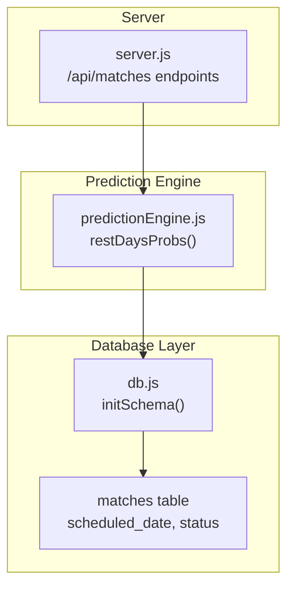
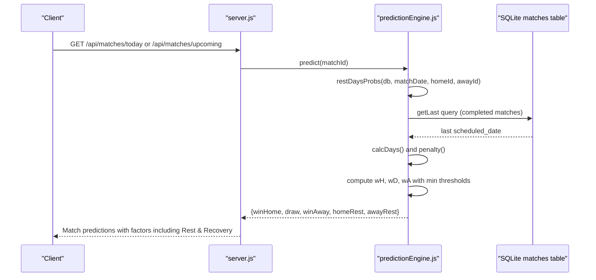
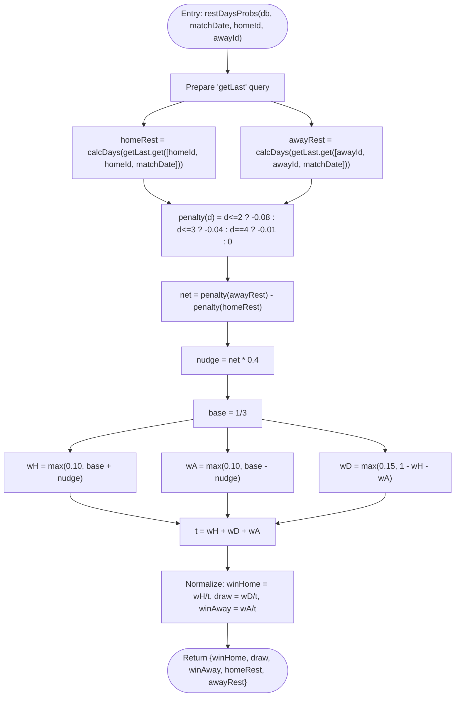
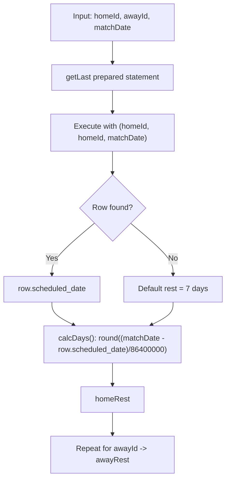
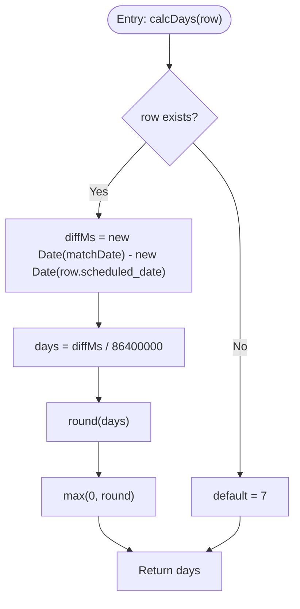
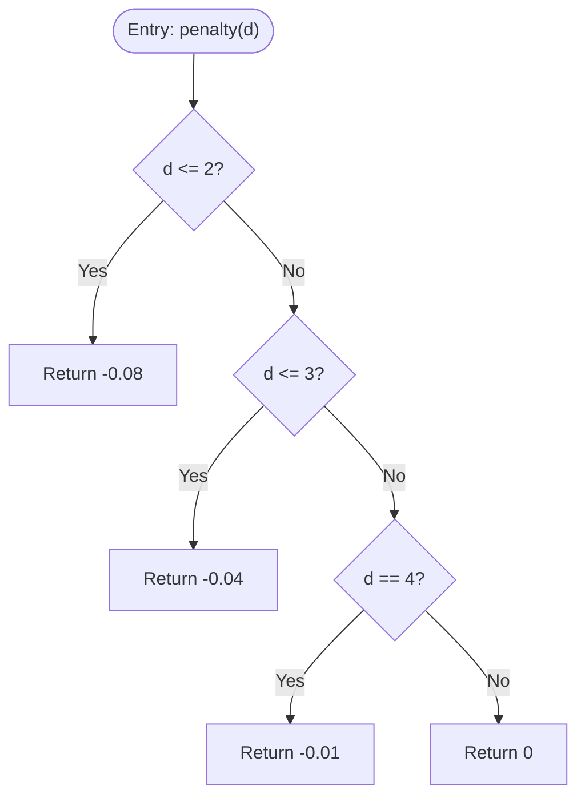
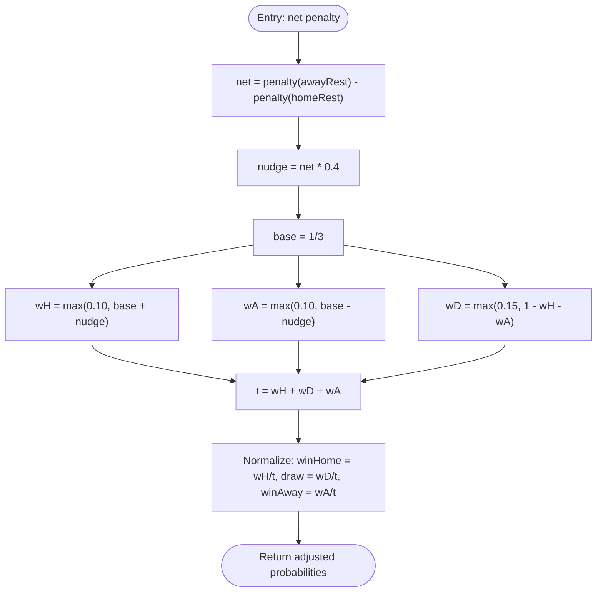
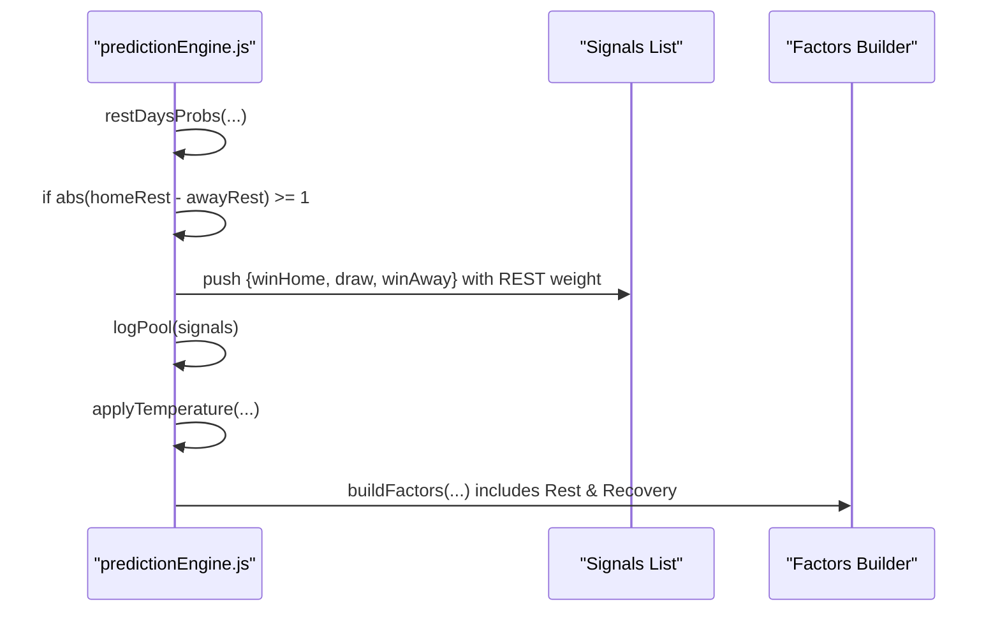
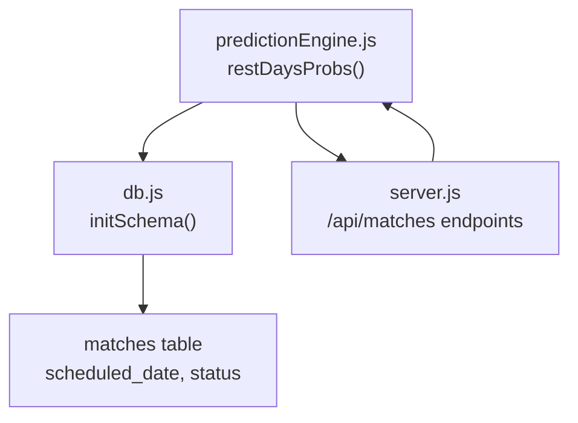

# Rest Days Signal

<cite>
**Referenced Files in This Document**
- [predictionEngine.js](file://backend/services/predictionEngine.js)
- [db.js](file://backend/database/db.js)
- [server.js](file://backend/server.js)
</cite>

## Table of Contents
1. [Introduction](#introduction)
2. [Project Structure](#project-structure)
3. [Core Components](#core-components)
4. [Architecture Overview](#architecture-overview)
5. [Detailed Component Analysis](#detailed-component-analysis)
6. [Dependency Analysis](#dependency-analysis)
7. [Performance Considerations](#performance-considerations)
8. [Troubleshooting Guide](#troubleshooting-guide)
9. [Conclusion](#conclusion)

## Introduction
This document explains the Rest Days adjustment signal system used by the prediction engine. It covers how the system calculates recovery advantages using penalty functions for different rest intervals, how it determines previous match dates via a database query, and how it computes the final probability adjustments for wins, draws, and losses. The system enforces minimum thresholds for each outcome to prevent degenerate distributions and ensures meaningful nudges only when there is a significant difference in rest days between teams.

## Project Structure
The Rest Days signal is implemented within the prediction engine service and integrates with the SQLite database schema that stores match metadata. The relevant components are:
- Prediction engine module containing the core logic for computing rest-day probabilities
- Database schema defining the matches table and its columns used by the signal
- Server endpoints that expose match data and predictions

**Diagram sources**
- [predictionEngine.js:337-362](file://backend/services/predictionEngine.js#L337-L362)
- [db.js:51-70](file://backend/database/db.js#L51-L70)
- [server.js:144-216](file://backend/server.js#L144-L216)

**Section sources**
- [predictionEngine.js:337-362](file://backend/services/predictionEngine.js#L337-L362)
- [db.js:51-70](file://backend/database/db.js#L51-L70)
- [server.js:144-216](file://backend/server.js#L144-L216)

## Core Components
- restDaysProbs(db, matchDate, homeId, awayId): Computes W/D/L probabilities adjusted by rest days, using a penalty function and minimum thresholds.
- getLast query: Retrieves the most recent completed match date for a team before the current match date.
- Day calculation algorithm: Computes the integer number of days between the current match date and the last completed match date.
- Penalty function: Applies a piecewise penalty based on rest interval length.
- Net penalty and nudge: Calculates the difference in penalties between away and home teams and scales it to adjust probabilities.
- Final probability distribution: Enforces minimum thresholds and normalizes to sum to 1.

**Section sources**
- [predictionEngine.js:337-362](file://backend/services/predictionEngine.js#L337-L362)

## Architecture Overview
The Rest Days signal participates in the prediction pipeline by contributing a W/D/L-only probability distribution when the difference in rest days between teams is at least one day. The signal is then blended with other signals using a log-pool mechanism.

**Diagram sources**
- [predictionEngine.js:337-362](file://backend/services/predictionEngine.js#L337-L362)
- [predictionEngine.js:824-833](file://backend/services/predictionEngine.js#L824-L833)
- [db.js:51-70](file://backend/database/db.js#L51-L70)

## Detailed Component Analysis

### restDaysProbs Function
The function encapsulates the entire Rest Days signal computation:
- Prepares a query to find the last completed match date for each team before the current match date.
- Computes the number of days between the current match date and the last completed match date.
- Applies a penalty function based on the computed rest days.
- Computes net penalty as penalty(awayRest) - penalty(homeRest).
- Scales the net penalty to produce a nudge and adjusts base probabilities for wins and draws.
- Enforces minimum thresholds for each outcome and normalizes to sum to 1.
- Returns the final W/D/L probabilities along with the computed rest days.

**Diagram sources**
- [predictionEngine.js:337-362](file://backend/services/predictionEngine.js#L337-L362)

**Section sources**
- [predictionEngine.js:337-362](file://backend/services/predictionEngine.js#L337-L362)

### getLast Query and Previous Match Dates
The query retrieves the most recent completed match for a team before the current match date:
- Filters matches where either team is involved, status is completed, and scheduled_date is earlier than the current match date.
- Orders by scheduled_date descending and limits to 1 to get the latest completed match.
- If no previous match is found, a default rest day count is used during day calculation.

**Diagram sources**
- [predictionEngine.js:338-346](file://backend/services/predictionEngine.js#L338-L346)

**Section sources**
- [predictionEngine.js:338-346](file://backend/services/predictionEngine.js#L338-L346)

### Day Calculation Algorithm
The algorithm converts milliseconds between dates to days:
- Subtracts the last completed match date from the current match date.
- Divides by the number of milliseconds in a day.
- Rounds to the nearest integer and takes the maximum with zero to ensure non-negative results.
- Uses a default value when no previous match exists.

**Diagram sources**
- [predictionEngine.js:344-346](file://backend/services/predictionEngine.js#L344-L346)

**Section sources**
- [predictionEngine.js:344-346](file://backend/services/predictionEngine.js#L344-L346)

### Penalty Function Implementation
The penalty function assigns a recovery disadvantage based on rest interval length:
- d ≤ 2: strong disadvantage (-0.08)
- d = 3: moderate disadvantage (-0.04)
- d = 4: mild disadvantage (-0.01)
- d ≥ 5: neutral (0)

This creates a piecewise linear penalty that increases as rest days decrease, reflecting the idea that shorter rest periods increase fatigue and reduce recovery.

**Diagram sources**
- [predictionEngine.js:350](file://backend/services/predictionEngine.js#L350)

**Section sources**
- [predictionEngine.js:350](file://backend/services/predictionEngine.js#L350)

### Net Penalty and Probability Adjustments
The net penalty determines how much the away team’s advantage is offset against the home team’s advantage:
- net = penalty(awayRest) - penalty(homeRest)
- nudge = net × 0.4
- Base probability is 1/3 for each outcome.
- Adjusted probabilities:
  - wH = max(0.10, base + nudge)
  - wA = max(0.10, base - nudge)
  - wD = max(0.15, 1 - wH - wA)
- Normalization: t = wH + wD + wA; winHome = wH/t, draw = wD/t, winAway = wA/t

This ensures:
- Minimum win probabilities of 0.10 for both teams
- Minimum draw probability of 0.15
- Probabilities sum to 1

**Diagram sources**
- [predictionEngine.js:351-357](file://backend/services/predictionEngine.js#L351-L357)

**Section sources**
- [predictionEngine.js:351-357](file://backend/services/predictionEngine.js#L351-L357)

### Integration with Prediction Pipeline
The Rest Days signal is integrated into the prediction pipeline:
- The signal is computed only when the absolute difference in rest days is at least 1.
- If applicable, the resulting W/D/L probabilities are added to the signals list with the REST weight.
- The final probabilities are computed via log-pool blending and temperature scaling.
- The Rest & Recovery factor is included in the factors list with an impact derived from the rest-day difference.

**Diagram sources**
- [predictionEngine.js:824-833](file://backend/services/predictionEngine.js#L824-L833)
- [predictionEngine.js:547-557](file://backend/services/predictionEngine.js#L547-L557)

**Section sources**
- [predictionEngine.js:824-833](file://backend/services/predictionEngine.js#L824-L833)
- [predictionEngine.js:547-557](file://backend/services/predictionEngine.js#L547-L557)

### Examples

#### Example 1: Short Rest Gap (away team fresher)
- awayRest = 2 days, homeRest = 5 days
- penalty(2) = -0.08, penalty(5) = 0
- net = -0.08 - 0 = -0.08
- nudge = -0.08 × 0.4 = -0.032
- wH = max(0.10, 0.333 - 0.032) ≈ 0.301
- wA = max(0.10, 0.333 + 0.032) ≈ 0.365
- wD = max(0.15, 1 - 0.301 - 0.365) ≈ 0.334
- Normalized: winHome ≈ 0.301, draw ≈ 0.334, winAway ≈ 0.365

#### Example 2: Balanced Rest Days
- awayRest = 4 days, homeRest = 4 days
- penalty(4) = -0.01 for both
- net = -0.01 - (-0.01) = 0
- nudge = 0
- wH = wA = 0.333, wD = max(0.15, 0.333)
- Normalized: winHome ≈ 0.333, draw ≈ 0.333, winAway ≈ 0.333

#### Example 3: Large Rest Gap (home team fresher)
- awayRest = 6 days, homeRest = 2 days
- penalty(6) = 0, penalty(2) = -0.08
- net = 0 - (-0.08) = 0.08
- nudge = 0.08 × 0.4 = 0.032
- wH = max(0.10, 0.333 + 0.032) ≈ 0.365
- wA = max(0.10, 0.333 - 0.032) ≈ 0.301
- wD = max(0.15, 1 - 0.365 - 0.301) ≈ 0.334
- Normalized: winHome ≈ 0.365, draw ≈ 0.334, winAway ≈ 0.301

**Section sources**
- [predictionEngine.js:350-357](file://backend/services/predictionEngine.js#L350-L357)

## Dependency Analysis
The Rest Days signal depends on:
- Database schema: matches table with scheduled_date and status columns
- Prediction engine: restDaysProbs function and integration points
- Server: endpoints that serve match data and predictions

**Diagram sources**
- [predictionEngine.js:337-362](file://backend/services/predictionEngine.js#L337-L362)
- [db.js:51-70](file://backend/database/db.js#L51-L70)
- [server.js:144-216](file://backend/server.js#L144-L216)

**Section sources**
- [predictionEngine.js:337-362](file://backend/services/predictionEngine.js#L337-L362)
- [db.js:51-70](file://backend/database/db.js#L51-L70)
- [server.js:144-216](file://backend/server.js#L144-L216)

## Performance Considerations
- The restDaysProbs function executes two simple database queries (one per team) and performs lightweight arithmetic operations.
- The query uses indexed columns (team IDs and status) and orders by date, which should be efficient for typical tournament sizes.
- The penalty function and normalization are constant-time operations.
- The signal is only applied when the absolute difference in rest days is at least 1, limiting unnecessary computations.

## Troubleshooting Guide
Common issues and resolutions:
- No previous match found: The algorithm defaults to 7 days for day calculation. Verify that completed matches exist in the database and that statuses are correctly set to completed.
- Unexpected probabilities: Ensure that the minimum thresholds are met and that normalization occurs after applying thresholds.
- Incorrect rest-day difference: Confirm that the match date passed to restDaysProbs is the scheduled date of the upcoming match and that the database timestamps are correct.

**Section sources**
- [predictionEngine.js:344-346](file://backend/services/predictionEngine.js#L344-L346)
- [predictionEngine.js:354-357](file://backend/services/predictionEngine.js#L354-L357)

## Conclusion
The Rest Days signal provides a robust, interpretable adjustment to match probabilities by penalizing teams with fewer rest days. Its piecewise penalty function captures the intuition that shorter recovery windows degrade performance, while minimum thresholds and normalization ensure stable and meaningful distributions. The signal integrates cleanly into the prediction pipeline and is surfaced to users through the factors list and insights.