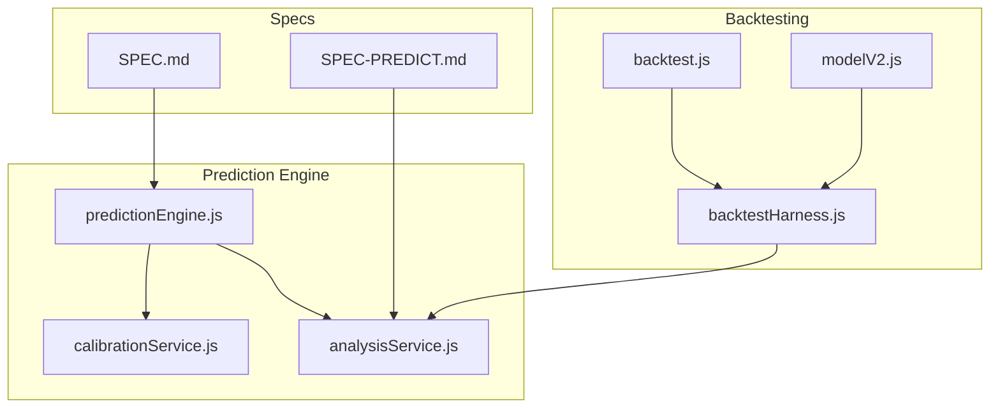
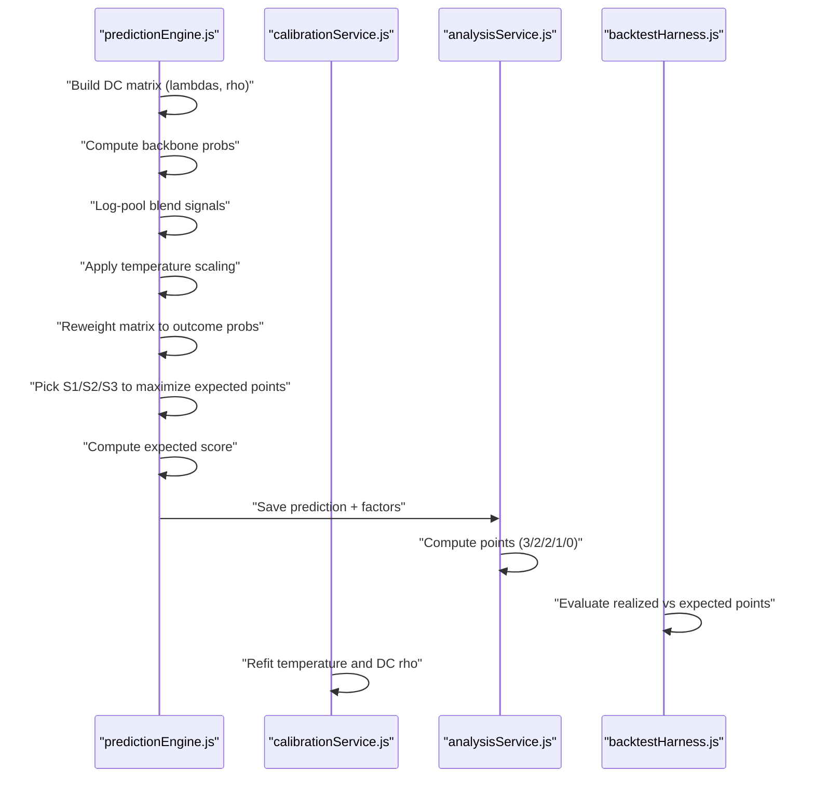
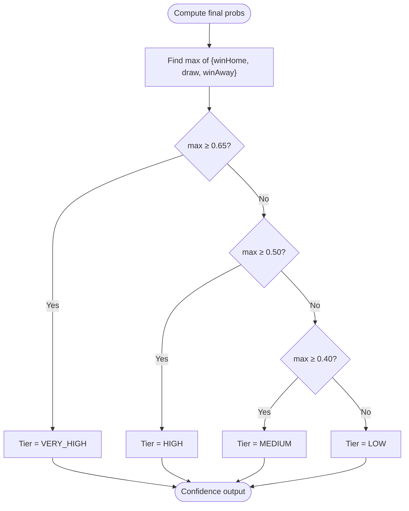
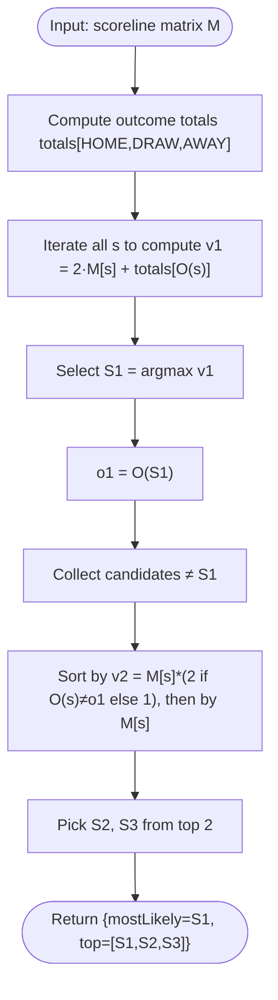
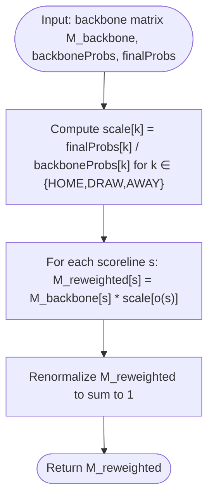
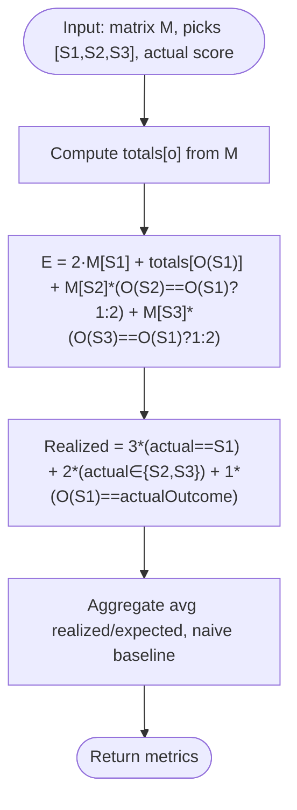
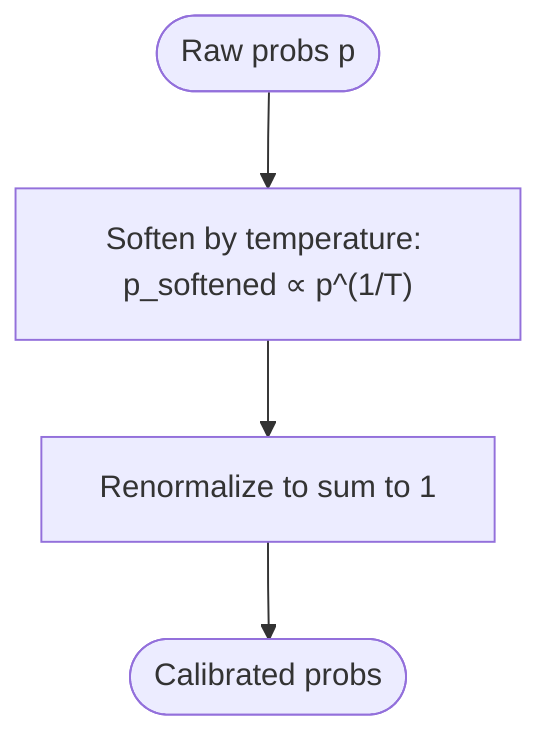
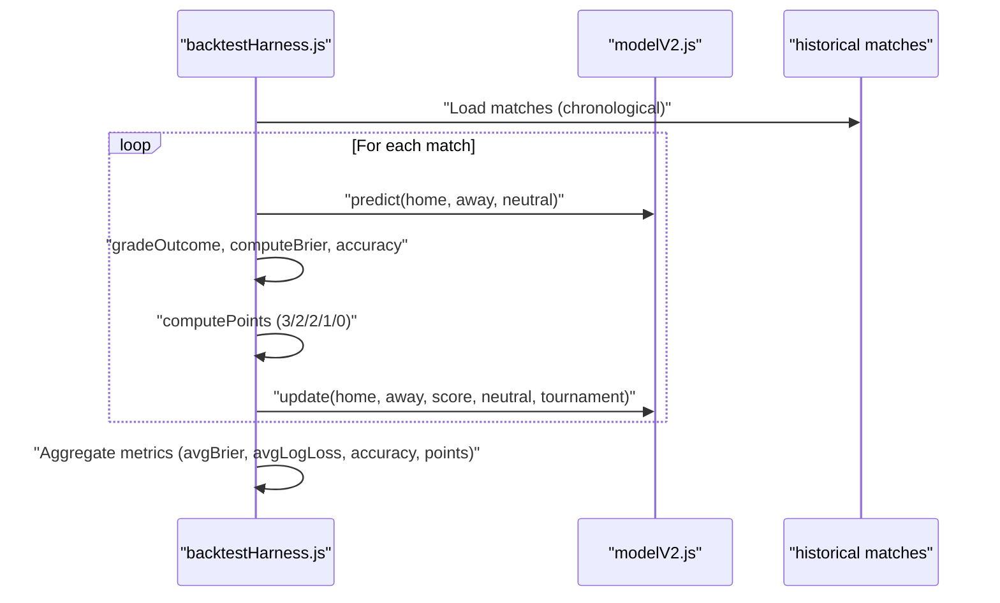
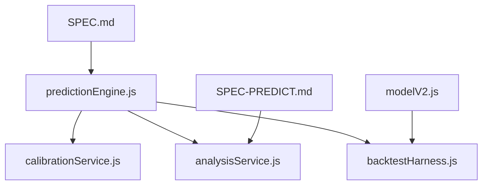

# Confidence Scoring & Scoreline Derivation

<cite>
**Referenced Files in This Document**
- [predictionEngine.js](file://backend/services/predictionEngine.js)
- [calibrationService.js](file://backend/services/calibrationService.js)
- [analysisService.js](file://backend/services/analysisService.js)
- [backtestHarness.js](file://backend/scripts/backtestHarness.js)
- [backtest.js](file://backend/scripts/backtest.js)
- [modelV2.js](file://backend/scripts/modelV2.js)
- [SPEC.md](file://specs/SPEC.md)
- [SPEC-PREDICT.md](file://specs/SPEC-PREDICT.md)
</cite>

## Table of Contents
1. [Introduction](#introduction)
2. [Project Structure](#project-structure)
3. [Core Components](#core-components)
4. [Architecture Overview](#architecture-overview)
5. [Detailed Component Analysis](#detailed-component-analysis)
6. [Dependency Analysis](#dependency-analysis)
7. [Performance Considerations](#performance-considerations)
8. [Troubleshooting Guide](#troubleshooting-guide)
9. [Conclusion](#conclusion)

## Introduction
This document explains the confidence scoring system and scoreline derivation algorithms used by the World Cup 2026 prediction engine. It covers:
- Confidence tier classification (VERY_HIGH, HIGH, MEDIUM, LOW) based on maximum probability values and threshold logic
- The scoreline selection algorithm that maximizes expected points under the tournament scoring system (3/2/2/1/0 rule)
- Matrix reweighting technique that adjusts the backbone scoreline distribution to match the final blended outcome probabilities while preserving within-class scoreline shapes
- Expected points calculation, realized points scoring for backtesting, and the mathematical optimization behind the scoreline selection process

## Project Structure
The confidence and scoreline derivation logic is implemented primarily in the prediction engine and calibration services, with supporting backtesting infrastructure and scoring rules defined in analysis and test harness modules.

**Diagram sources**
- [predictionEngine.js:1-1020](file://backend/services/predictionEngine.js#L1-L1020)
- [calibrationService.js:1-132](file://backend/services/calibrationService.js#L1-L132)
- [analysisService.js:1-422](file://backend/services/analysisService.js#L1-L422)
- [backtestHarness.js:1-156](file://backend/scripts/backtestHarness.js#L1-L156)
- [backtest.js:1-102](file://backend/scripts/backtest.js#L1-L102)
- [modelV2.js:1-240](file://backend/scripts/modelV2.js#L1-L240)
- [SPEC.md:125-177](file://specs/SPEC.md#L125-L177)
- [SPEC-PREDICT.md:105-114](file://specs/SPEC-PREDICT.md#L105-L114)

**Section sources**
- [SPEC.md:125-177](file://specs/SPEC.md#L125-L177)
- [SPEC-PREDICT.md:105-114](file://specs/SPEC-PREDICT.md#L105-L114)

## Core Components
- Confidence scoring: Threshold-based classification of prediction certainty based on the maximum of win/draw/loss probabilities
- Scoreline selection: Optimization to maximize expected points under the tournament scoring rule
- Matrix reweighting: Adjusts backbone scoreline distribution to align with final blended outcome probabilities
- Expected points and realized points scoring: Mathematical frameworks for evaluating prediction quality and backtesting

**Section sources**
- [predictionEngine.js:364-460](file://backend/services/predictionEngine.js#L364-L460)
- [predictionEngine.js:821-834](file://backend/services/predictionEngine.js#L821-L834)
- [calibrationService.js:28-82](file://backend/services/calibrationService.js#L28-L82)
- [analysisService.js:19-57](file://backend/services/analysisService.js#L19-L57)
- [backtestHarness.js:43-70](file://backend/scripts/backtestHarness.js#L43-L70)

## Architecture Overview
The prediction pipeline builds a Dixon-Coles scoreline matrix, blends multiple signals using log-pool weighting, derives confidence tiers, selects top scorelines to maximize expected points, and computes expected/realized points for evaluation.

**Diagram sources**
- [predictionEngine.js:707-729](file://backend/services/predictionEngine.js#L707-L729)
- [predictionEngine.js:818-826](file://backend/services/predictionEngine.js#L818-L826)
- [calibrationService.js:53-129](file://backend/services/calibrationService.js#L53-L129)
- [analysisService.js:37-57](file://backend/services/analysisService.js#L37-L57)
- [backtestHarness.js:43-70](file://backend/scripts/backtestHarness.js#L43-L70)

## Detailed Component Analysis

### Confidence Scoring System
- Threshold logic:
  - VERY_HIGH: maximum probability ≥ 0.65
  - HIGH: maximum probability ≥ 0.50
  - MEDIUM: maximum probability ≥ 0.40
  - LOW: otherwise
- The confidence tier is derived from the final blended probabilities after log-pool blending and temperature scaling.

**Diagram sources**
- [predictionEngine.js:364-371](file://backend/services/predictionEngine.js#L364-L371)

**Section sources**
- [predictionEngine.js:364-371](file://backend/services/predictionEngine.js#L364-L371)

### Scoreline Selection Algorithm (Maximize Expected Points)
- Tournament scoring rule: 3 points for exact scoreline match, 2 points for appearing in top_scores[1..2], 1 point if outcome matches the headline pick, 0 otherwise.
- Optimization objective: Choose S1, S2, S3 to maximize expected points under the scoring rule.
- Mathematical formulation:
  - Let M[s] be the matrix probability of scoreline s
  - Let totals[o] be the total probability for outcome class o
  - Objective: maximize E = 2·M[S1] + M[O(S1)] + Σᵢ M[Sᵢ]·(2 − 𝟙[O(Sᵢ)=O(S1)]) for distinct S1, S2, S3
  - Strategy:
    - S1 maximizes 2·M[s] + M[O(s)] (cell value plus outcome-class total)
    - S2, S3 maximize M[s]·(2 if different outcome from S1 else 1), breaking ties by raw cell value
- Implementation details:
  - Compute outcome totals across the matrix
  - Select S1 by maximizing 2·M[s] + totals[O(s)]
  - Sort remaining candidates by M[s]·(2 if O(s)≠O(S1) else 1), then by M[s]
  - Return top 3 picks

**Diagram sources**
- [predictionEngine.js:401-438](file://backend/services/predictionEngine.js#L401-L438)

**Section sources**
- [predictionEngine.js:401-438](file://backend/services/predictionEngine.js#L401-L438)

### Matrix Reweighting Technique
- Goal: Align the backbone scoreline distribution with the final blended outcome probabilities while preserving within-class scoreline shapes.
- Method:
  - Compute per-outcome scaling factors: scale[HOME] = finalProbs.winHome / backboneProbs.winHome, similarly for DRAW and AWAY
  - For each scoreline s with outcome o(s), multiply its probability by scale[o(s)]
  - Renormalize to obtain the blended matrix
- This ensures that the outcome-class totals match the final blended W/D/L while keeping the within-class shape intact.

**Diagram sources**
- [predictionEngine.js:373-394](file://backend/services/predictionEngine.js#L373-L394)

**Section sources**
- [predictionEngine.js:373-394](file://backend/services/predictionEngine.js#L373-L394)

### Expected Points Calculation and Realized Points Scoring
- Expected points under the matrix M for a given top-3 pick:
  - E = 2·M[S1] + totals[O(S1)] + M[S2]·(I(O(S2)=O(S1))) + M[S3]·(I(O(S3)=O(S1)))
  - Where totals[o] is the total probability for outcome class o
- Realized points for an observed actual scoreline:
  - 3 if actual == S1
  - 2 if actual == S2 or actual == S3
  - 1 if outcome of S1 equals actual outcome
  - 0 otherwise
- Backtesting harness:
  - Computes realized and expected points for each prediction
  - Provides naive picker baseline (top-3 by raw probability) for comparison
  - Aggregates metrics including average realized/expected points and lift over naive

**Diagram sources**
- [predictionEngine.js:440-460](file://backend/services/predictionEngine.js#L440-L460)
- [backtestHarness.js:43-70](file://backend/scripts/backtestHarness.js#L43-L70)

**Section sources**
- [predictionEngine.js:440-460](file://backend/services/predictionEngine.js#L440-L460)
- [backtestHarness.js:43-70](file://backend/scripts/backtestHarness.js#L43-L70)

### Temperature Scaling and Calibration
- Temperature scaling softens or sharpens output probabilities via log-space normalization with inverse temperature T
- The system periodically refits:
  - Temperature T by minimizing negative log-likelihood on completed matches
  - Dixon-Coles ρ parameter by fitting on observed scorelines
- These calibrations improve probability reliability and scoreline fit.

**Diagram sources**
- [calibrationService.js:28-82](file://backend/services/calibrationService.js#L28-L82)
- [predictionEngine.js:650-662](file://backend/services/predictionEngine.js#L650-L662)

**Section sources**
- [calibrationService.js:28-82](file://backend/services/calibrationService.js#L28-L82)
- [predictionEngine.js:650-662](file://backend/services/predictionEngine.js#L650-L662)

### Backtesting and Evaluation
- Backtest harness:
  - Iterates through historical matches in chronological order
  - Predicts using current model state, scores outcomes, and updates model
  - Computes accuracy, Brier score, log-loss, and calibration buckets
  - Calculates expected and realized points under the tournament scoring rule
- Comparison with naive picker:
  - Naive top-3 by raw probability provides a baseline
  - Lift shows improvement of the optimal picker over naive

**Diagram sources**
- [backtestHarness.js:72-153](file://backend/scripts/backtestHarness.js#L72-L153)
- [modelV2.js:132-237](file://backend/scripts/modelV2.js#L132-L237)
- [backtest.js:47-96](file://backend/scripts/backtest.js#L47-L96)

**Section sources**
- [backtestHarness.js:72-153](file://backend/scripts/backtestHarness.js#L72-L153)
- [modelV2.js:132-237](file://backend/scripts/modelV2.js#L132-L237)
- [backtest.js:47-96](file://backend/scripts/backtest.js#L47-L96)

## Dependency Analysis
- predictionEngine.js depends on:
  - calibrationService.js for temperature scaling and DC ρ refit
  - analysisService.js for scoring rules and points computation
  - backtestHarness.js for expected/realized points evaluation
- modelV2.js provides a standalone implementation of the same scoring logic for backtesting
- SPEC.md and SPEC-PREDICT.md define the tournament scoring rule and prediction output semantics

**Diagram sources**
- [predictionEngine.js:1-1020](file://backend/services/predictionEngine.js#L1-L1020)
- [calibrationService.js:1-132](file://backend/services/calibrationService.js#L1-L132)
- [analysisService.js:1-422](file://backend/services/analysisService.js#L1-L422)
- [backtestHarness.js:1-156](file://backend/scripts/backtestHarness.js#L1-L156)
- [modelV2.js:1-240](file://backend/scripts/modelV2.js#L1-L240)
- [SPEC.md:125-177](file://specs/SPEC.md#L125-L177)
- [SPEC-PREDICT.md:105-114](file://specs/SPEC-PREDICT.md#L105-L114)

**Section sources**
- [SPEC.md:125-177](file://specs/SPEC.md#L125-L177)
- [SPEC-PREDICT.md:105-114](file://specs/SPEC-PREDICT.md#L105-L114)

## Performance Considerations
- Matrix construction and normalization: The scoreline matrix is constructed with a bounded maximum number of goals (e.g., 8), limiting computational cost
- Log-pool blending: Uses log-space computations to avoid numerical underflow and maintain stability
- Weight adjustments in multi-agent system: Reduce unnecessary recomputation by applying penalties only where conflicts occur
- Backtesting: Warmup period avoids early scoring bias and stabilizes ratings before metrics accumulation

## Troubleshooting Guide
- Confidence tier unexpectedly low:
  - Verify final blended probabilities after log-pool and temperature scaling
  - Check signal weights and whether any agent outputs were excluded
- Scoreline selection not as expected:
  - Confirm outcome totals are computed correctly from the reweighted matrix
  - Ensure S1 maximizes 2·M[s] + totals[O(s)] and tie-breaking by M[s] is applied consistently
- Points scoring discrepancies:
  - Validate outcome classification for actual and predicted scorelines
  - Confirm the scoring rule: 3 for exact, 2 for top-2, 1 for outcome match, 0 otherwise
- Calibration not improving:
  - Ensure sufficient completed matches have been processed for refit
  - Check that temperature and DC ρ refits are executed at the expected intervals

**Section sources**
- [predictionEngine.js:364-460](file://backend/services/predictionEngine.js#L364-L460)
- [analysisService.js:37-57](file://backend/services/analysisService.js#L37-L57)
- [calibrationService.js:53-129](file://backend/services/calibrationService.js#L53-L129)

## Conclusion
The confidence scoring system and scoreline derivation algorithms combine probabilistic modeling, careful matrix manipulation, and tournament-aware scoring to produce reliable predictions. The confidence tiers reflect prediction certainty, the scoreline selection optimizes for expected points under the 3/2/2/1/0 rule, and matrix reweighting preserves within-class shapes while aligning outcome totals with final probabilities. Calibration via temperature scaling and DC ρ refit further improves reliability, and backtesting provides robust evaluation against naive baselines.