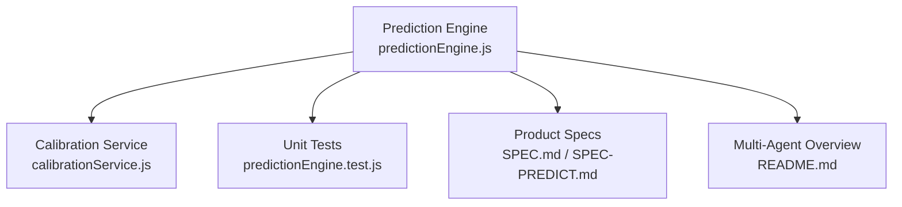
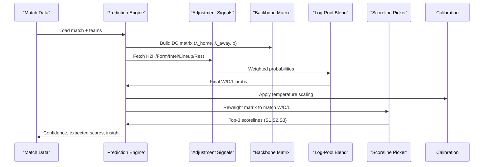
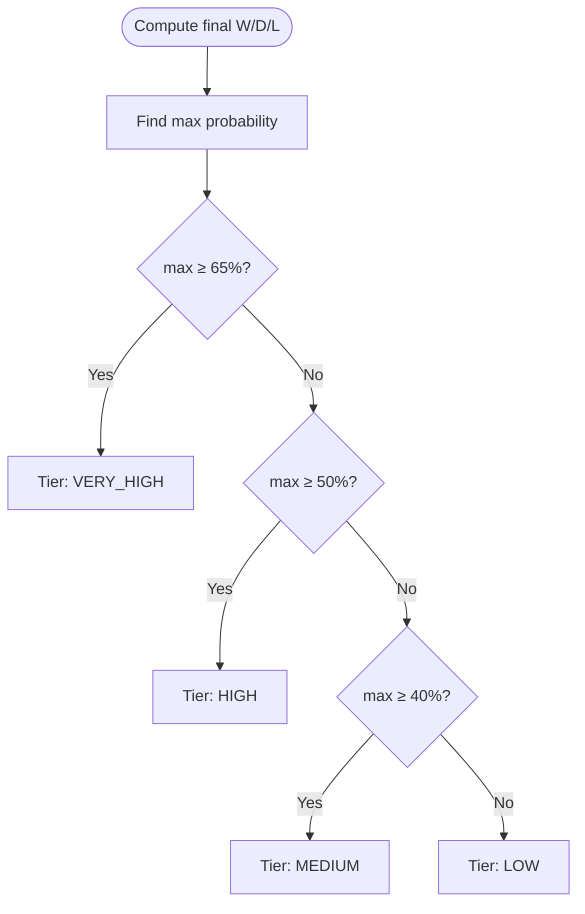
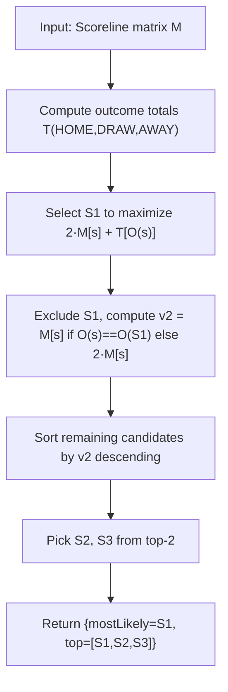
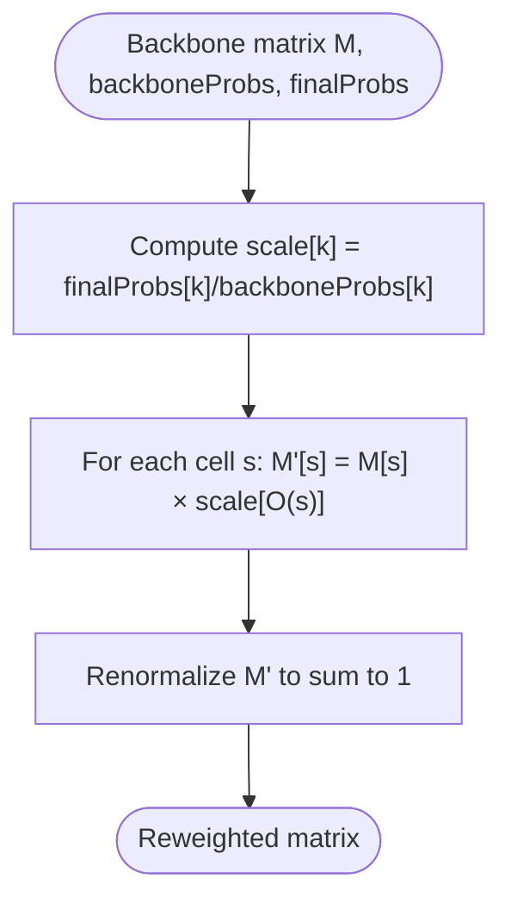
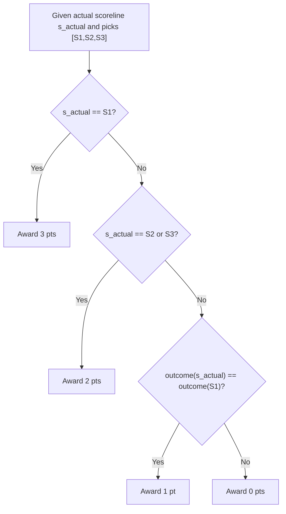
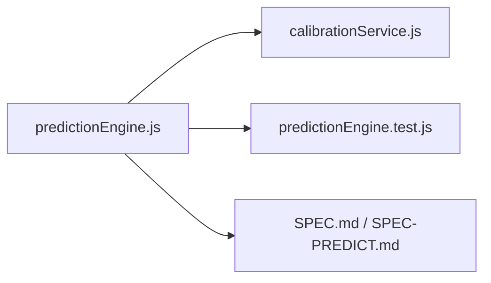

# Confidence Scoring and Scoreline Derivation

<cite>
**Referenced Files in This Document**
- [predictionEngine.js](file://backend/services/predictionEngine.js)
- [predictionEngine.test.js](file://backend/services/predictionEngine.test.js)
- [calibrationService.js](file://backend/services/calibrationService.js)
- [SPEC.md](file://specs/SPEC.md)
- [SPEC-PREDICT.md](file://specs/SPEC-PREDICT.md)
- [README.md](file://README.md)
</cite>

## Table of Contents
1. [Introduction](#introduction)
2. [Project Structure](#project-structure)
3. [Core Components](#core-components)
4. [Architecture Overview](#architecture-overview)
5. [Detailed Component Analysis](#detailed-component-analysis)
6. [Dependency Analysis](#dependency-analysis)
7. [Performance Considerations](#performance-considerations)
8. [Troubleshooting Guide](#troubleshooting-guide)
9. [Conclusion](#conclusion)
10. [Appendices](#appendices)

## Introduction
This document explains the confidence scoring system and scoreline derivation algorithms used to rank prediction outcomes in the World Cup 2026 prediction engine. It covers:
- Confidence tier classification based on maximum probability
- The scoreline ranking algorithm that maximizes expected points under the 3-2-2-1 scoring system
- The reweighting process that adjusts the backbone matrix to match final W/D/L probabilities while preserving within-class scoreline shapes
- Expected points calculation and point assignment rules for actual vs predicted outcomes
- The top-3 scoreline selection process, probability thresholding, and scoring rule optimization
- Examples of confidence calculations, scoreline ranking, and point expectation maximization with detailed mathematical derivations

## Project Structure
The prediction engine resides in the backend services module and integrates with supporting services for calibration and multi-agent orchestration. The key files are:
- Prediction engine core: [predictionEngine.js](file://backend/services/predictionEngine.js)
- Tests validating algorithms: [predictionEngine.test.js](file://backend/services/predictionEngine.test.js)
- Calibration service (temperature scaling and DC ρ refit): [calibrationService.js](file://backend/services/calibrationService.js)
- Product specifications: [SPEC.md](file://specs/SPEC.md), [SPEC-PREDICT.md](file://specs/SPEC-PREDICT.md)
- Multi-agent system overview: [README.md](file://README.md)

**Diagram sources**
- [predictionEngine.js:691-922](file://backend/services/predictionEngine.js#L691-L922)
- [calibrationService.js:53-129](file://backend/services/calibrationService.js#L53-L129)
- [predictionEngine.test.js:1-333](file://backend/services/predictionEngine.test.js#L1-L333)
- [SPEC.md:125-178](file://specs/SPEC.md#L125-L178)
- [SPEC-PREDICT.md:1-147](file://specs/SPEC-PREDICT.md#L1-L147)
- [README.md:18-105](file://README.md#L18-L105)

**Section sources**
- [SPEC.md:125-178](file://specs/SPEC.md#L125-L178)
- [SPEC-PREDICT.md:1-147](file://specs/SPEC-PREDICT.md#L1-L147)
- [README.md:18-105](file://README.md#L18-L105)

## Core Components
- Confidence scoring: Classification based on the maximum of win/draw/lose probabilities
- Scoreline derivation: Selection of top-3 scorelines to maximize expected points under the 3-2-2-1 rule
- Reweighting: Adjusting the backbone matrix to match final W/D/L totals while preserving within-class shapes
- Expected points calculation: Mathematical formulation for optimizing point expectations
- Point assignment rules: Exact hit (3 pts), near hit (2 pts), correct outcome (1 pt), else 0 pts

**Section sources**
- [predictionEngine.js:364-460](file://backend/services/predictionEngine.js#L364-L460)
- [predictionEngine.test.js:123-199](file://backend/services/predictionEngine.test.js#L123-L199)

## Architecture Overview
The prediction pipeline builds a Dixon-Coles bivariate Poisson backbone, blends adjustment signals via log-pool, derives confidence and scorelines, and applies temperature scaling for calibration.

**Diagram sources**
- [predictionEngine.js:691-922](file://backend/services/predictionEngine.js#L691-L922)
- [calibrationService.js:53-82](file://backend/services/calibrationService.js#L53-L82)

## Detailed Component Analysis

### Confidence Scoring System
Confidence tiers are derived from the maximum of the final W/D/L probabilities:
- VERY_HIGH: max ≥ 65%
- HIGH: max ≥ 50%
- MEDIUM: max ≥ 40%
- LOW: max < 40%

**Diagram sources**
- [predictionEngine.js:364-371](file://backend/services/predictionEngine.js#L364-L371)

**Section sources**
- [predictionEngine.js:364-371](file://backend/services/predictionEngine.js#L364-L371)
- [predictionEngine.test.js:138-147](file://backend/services/predictionEngine.test.js#L138-L147)

### Scoreline Ranking Under 3-2-2-1 Scoring
The algorithm selects S1, S2, S3 to maximize expected points under the scoring rule:
- 3 points for exact match to S1
- 2 points for exact match to S2 or S3
- 1 point if actual outcome equals outcome of S1 and no exact hit
- 0 points otherwise

Expected points formula:
- E = 2·M[S1] + M[O(S1)] + Σᵢ M[Sᵢ]·(2 − 𝟙[O(Sᵢ)=O(S1)])
- Simplified: S1 maximizes 2·M[s] + M[O(s)], then S2,S3 maximize M[s] with outcome-based tie-breaker

**Diagram sources**
- [predictionEngine.js:401-438](file://backend/services/predictionEngine.js#L401-L438)

**Section sources**
- [predictionEngine.js:401-438](file://backend/services/predictionEngine.js#L401-L438)
- [predictionEngine.test.js:123-199](file://backend/services/predictionEngine.test.js#L123-L199)

### Reweighting to Match Final W/D/L Probabilities
The backbone matrix is reweighted so that outcome-class totals match the blended W/D/L probabilities while preserving within-class scoreline shapes:
- Scale factor per class: finalProbs[k] / backboneProbs[k]
- For each cell s with outcome O(s): M'[s] = M[s] × scale[O(s)]
- Renormalize to sum to 1

**Diagram sources**
- [predictionEngine.js:373-394](file://backend/services/predictionEngine.js#L373-L394)

**Section sources**
- [predictionEngine.js:373-394](file://backend/services/predictionEngine.js#L373-L394)
- [predictionEngine.test.js:217-238](file://backend/services/predictionEngine.test.js#L217-L238)

### Expected Points Calculation and Point Assignment Rules
- Expected points for a given top-3 pick: sum over S1,S2,S3 of the scoring rule applied to each cell
- Point assignment rules:
  - 3 pts if actual score equals S1
  - 2 pts if actual score equals S2 or S3
  - 1 pt if actual outcome equals outcome of S1 and actual score differs from S1
  - 0 pts otherwise

**Diagram sources**
- [predictionEngine.js:440-460](file://backend/services/predictionEngine.js#L440-L460)

**Section sources**
- [predictionEngine.js:440-460](file://backend/services/predictionEngine.js#L440-L460)
- [predictionEngine.test.js:201-215](file://backend/services/predictionEngine.test.js#L201-L215)

### Probability Thresholding and Scoring Rule Optimization
- Thresholds for confidence tiers are chosen to reflect the maximum probability cutoffs
- The scoreline selection optimizes expected points under the 3-2-2-1 rule, balancing certainty (S1) with hedging across outcomes (S2,S3)
- Tests demonstrate that the optimal picker beats naive top-3-by-probability in expected points

**Section sources**
- [predictionEngine.js:364-371](file://backend/services/predictionEngine.js#L364-L371)
- [predictionEngine.js:401-438](file://backend/services/predictionEngine.js#L401-L438)
- [predictionEngine.test.js:123-199](file://backend/services/predictionEngine.test.js#L123-L199)

### Example Walkthroughs

#### Example 1: Confidence Calculation
- Input: final W/D/L probabilities [0.45, 0.30, 0.25]
- Maximum: 0.45
- Confidence tier: MEDIUM (since 0.45 ≥ 40%)

**Section sources**
- [predictionEngine.js:364-371](file://backend/services/predictionEngine.js#L364-L371)
- [predictionEngine.test.js:138-147](file://backend/services/predictionEngine.test.js#L138-L147)

#### Example 2: Scoreline Ranking Under 3-2-2-1
- Scenario: Home-favoured match with concentrated home-win cells and a strong draw cluster
- S1: Highest cell by combined metric 2·M[s] + T[O(s)]
- S2,S3: Highest remaining cells with tie-breaker favoring different outcomes from S1
- Result: Cross-outcome hedge improves expected points compared to naive top-3-by-probability

**Section sources**
- [predictionEngine.js:401-438](file://backend/services/predictionEngine.js#L401-L438)
- [predictionEngine.test.js:149-163](file://backend/services/predictionEngine.test.js#L149-L163)

#### Example 3: Reweighting to Match Final W/D/L
- Input: Backbone matrix M, backboneProbs = [0.50, 0.30, 0.20], finalProbs = [0.40, 0.40, 0.20]
- Scale factors: HOME=0.80, DRAW=1.33, AWAY=1.00
- For each cell s with outcome O(s): M'[s] = M[s] × scale[O(s)]
- Renormalize to sum to 1

**Section sources**
- [predictionEngine.js:373-394](file://backend/services/predictionEngine.js#L373-L394)
- [predictionEngine.test.js:217-227](file://backend/services/predictionEngine.test.js#L217-L227)

#### Example 4: Expected Points Maximization
- Given matrix M and picks [S1,S2,S3], compute:
  - E = 2·M[S1] + T[O(S1)] + M[S2]·(outcome(S2)==O(S1)?1:2) + M[S3]·(outcome(S3)==O(S1)?1:2)
- Compare to naive picks to verify improvement

**Section sources**
- [predictionEngine.js:401-450](file://backend/services/predictionEngine.js#L401-L450)
- [predictionEngine.test.js:165-189](file://backend/services/predictionEngine.test.js#L165-L189)

## Dependency Analysis
The prediction engine depends on:
- Calibration service for temperature scaling and DC ρ refit
- Unit tests to validate algorithms and edge cases
- Product specifications for scoring rules and confidence thresholds

**Diagram sources**
- [predictionEngine.js:691-922](file://backend/services/predictionEngine.js#L691-L922)
- [calibrationService.js:53-129](file://backend/services/calibrationService.js#L53-L129)
- [predictionEngine.test.js:1-333](file://backend/services/predictionEngine.test.js#L1-L333)
- [SPEC.md:125-178](file://specs/SPEC.md#L125-L178)
- [SPEC-PREDICT.md:1-147](file://specs/SPEC-PREDICT.md#L1-L147)

**Section sources**
- [SPEC.md:125-178](file://specs/SPEC.md#L125-L178)
- [SPEC-PREDICT.md:1-147](file://specs/SPEC-PREDICT.md#L1-L147)

## Performance Considerations
- Matrix construction and normalization: O(K²) for K goals per side; capped at 8 goals
- Log-pool blending: O(N) over signals; numerically stable via log-space
- Scoreline picker: O(K²) for sorting and selection; efficient due to bounded K
- Reweighting: O(K²) pass over matrix cells
- Temperature scaling: O(1) per prediction; grid search for refit is batched

[No sources needed since this section provides general guidance]

## Troubleshooting Guide
Common issues and resolutions:
- Zero or near-zero probabilities: Ensure renormalization and clipping are applied during matrix construction and blending
- Numerical instability: Use log-space computations and avoid log(0)
- Incorrect confidence tiers: Verify maximum probability thresholds and rounding
- Scoreline ties: Tie-break by cell probability within outcome class
- Calibration drift: Periodic refit of temperature and DC ρ parameters

**Section sources**
- [predictionEngine.js:136-163](file://backend/services/predictionEngine.js#L136-L163)
- [predictionEngine.js:218-238](file://backend/services/predictionEngine.js#L218-L238)
- [predictionEngine.js:364-371](file://backend/services/predictionEngine.js#L364-L371)
- [calibrationService.js:53-129](file://backend/services/calibrationService.js#L53-L129)

## Conclusion
The prediction engine employs a robust confidence scoring system and a principled scoreline derivation algorithm designed to maximize expected points under the 3-2-2-1 rule. By reweighting the backbone matrix to align with final W/D/L probabilities while preserving within-class shapes, the system ensures that top-3 picks reflect both certainty and strategic hedging. Temperature scaling and DC ρ refit further improve calibration and accuracy over time.

[No sources needed since this section summarizes without analyzing specific files]

## Appendices

### Mathematical Definitions and Formulas
- Confidence tiers: max probability thresholds define VERY_HIGH, HIGH, MEDIUM, LOW
- Expected points: E = 2·M[S1] + M[O(S1)] + Σᵢ M[Sᵢ]·(2 − 𝟙[O(Sᵢ)=O(S1)])
- Point assignment:
  - 3 pts if actual score equals S1
  - 2 pts if actual score equals S2 or S3
  - 1 pt if outcome matches O(S1) and no exact hit
  - 0 pts otherwise

**Section sources**
- [predictionEngine.js:364-460](file://backend/services/predictionEngine.js#L364-L460)
- [predictionEngine.test.js:201-215](file://backend/services/predictionEngine.test.js#L201-L215)