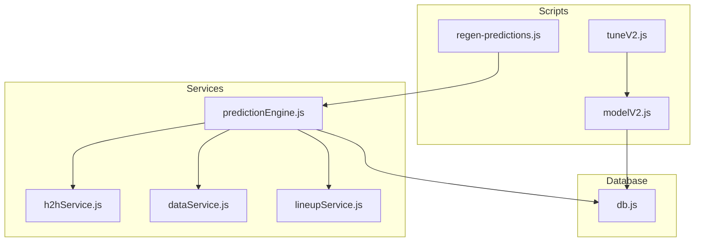
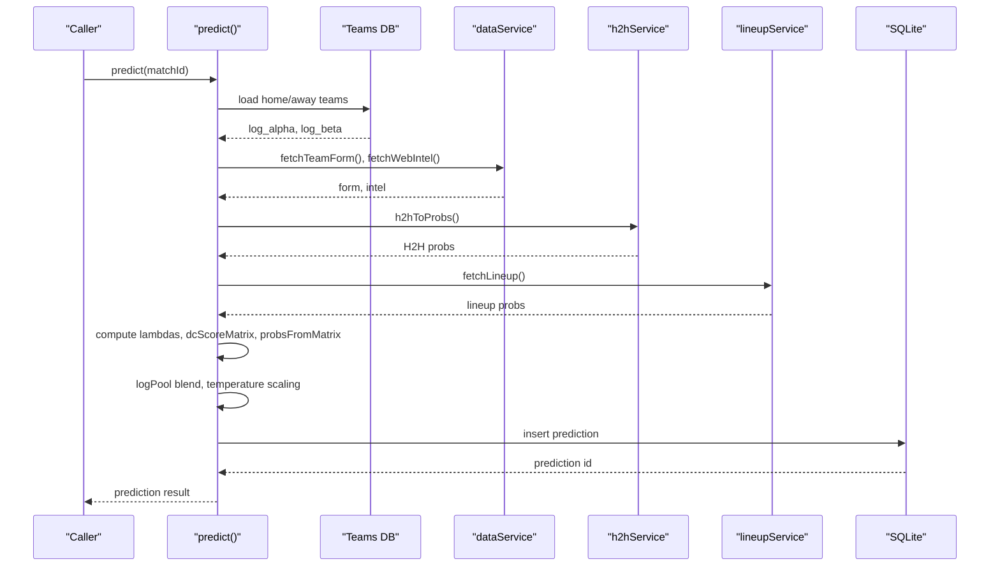
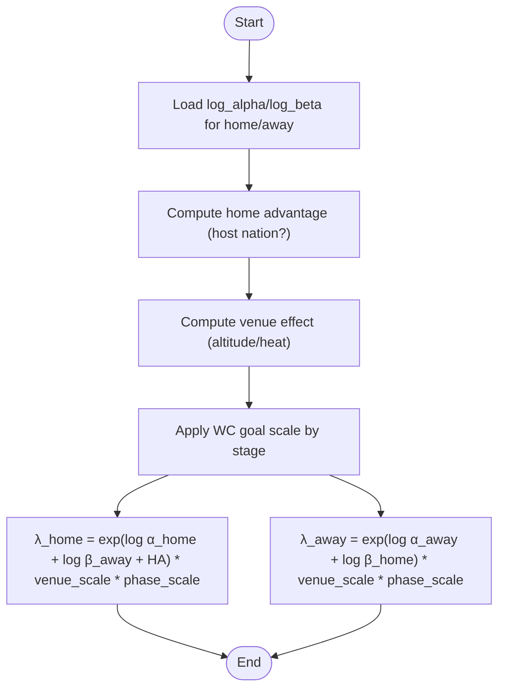
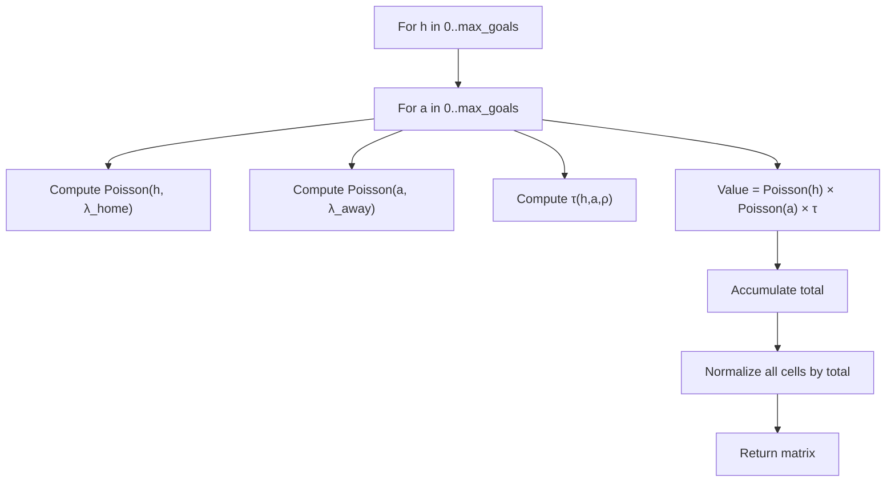
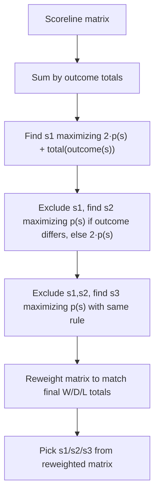
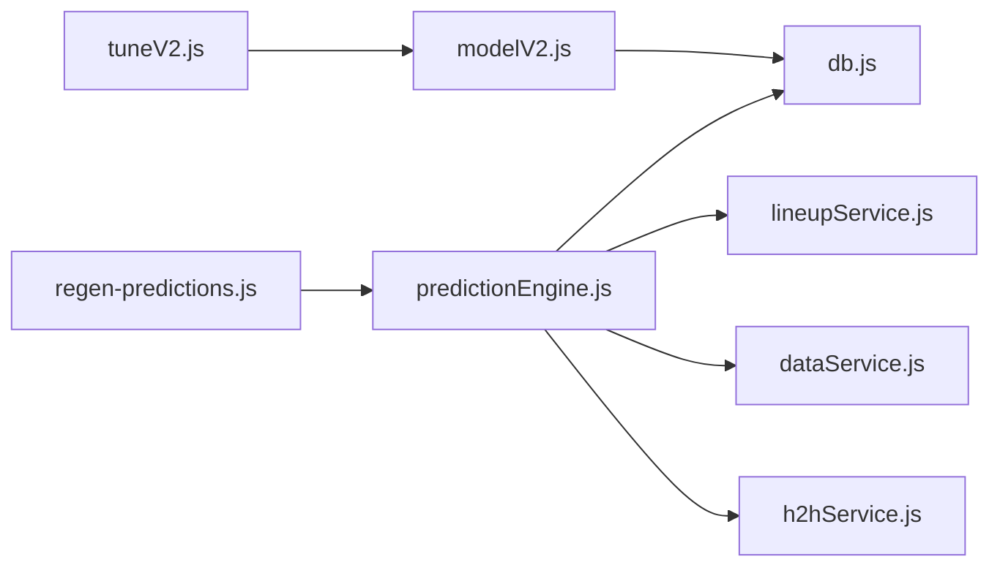

# Dixon-Coles Bivariate Poisson Model

<cite>
**Referenced Files in This Document**
- [SPEC-PREDICT.md](file://specs/SPEC-PREDICT.md)
- [SPEC.md](file://specs/SPEC.md)
- [predictionEngine.js](file://backend/services/predictionEngine.js)
- [modelV2.js](file://backend/scripts/modelV2.js)
- [tuneV2.js](file://backend/scripts/tuneV2.js)
- [regen-predictions.js](file://backend/scripts/regen-predictions.js)
- [h2hService.js](file://backend/services/h2hService.js)
- [dataService.js](file://backend/services/dataService.js)
- [lineupService.js](file://backend/services/lineupService.js)
- [db.js](file://backend/database/db.js)
</cite>

## Table of Contents
1. [Introduction](#introduction)
2. [Project Structure](#project-structure)
3. [Core Components](#core-components)
4. [Architecture Overview](#architecture-overview)
5. [Detailed Component Analysis](#detailed-component-analysis)
6. [Dependency Analysis](#dependency-analysis)
7. [Performance Considerations](#performance-considerations)
8. [Troubleshooting Guide](#troubleshooting-guide)
9. [Conclusion](#conclusion)
10. [Appendices](#appendices)

## Introduction
This document explains the Dixon-Coles bivariate Poisson model implementation powering the World Cup 2026 prediction engine. It covers the mathematical foundations, hyperparameters, lambda calculations, the tau correction for low-scoring probabilities, scoreline matrix construction, normalization, and the adjustments that correct over-prediction of 1-1 and under-prediction of 0-0/1-0/0-1 outcomes. It also documents how attack/defense ratings relate to expected goals, how the model integrates with external data sources, and how tuning and calibration are performed.

## Project Structure
The prediction system is implemented primarily in the prediction engine service, with supporting scripts for model creation and tuning, and services for data ingestion and historical head-to-head records. The database schema stores teams, matches, predictions, and model configuration.

**Diagram sources**
- [predictionEngine.js:1-1020](file://backend/services/predictionEngine.js#L1-L1020)
- [h2hService.js:1-315](file://backend/services/h2hService.js#L1-L315)
- [dataService.js:1-583](file://backend/services/dataService.js#L1-L583)
- [lineupService.js:1-425](file://backend/services/lineupService.js#L1-L425)
- [modelV2.js:1-240](file://backend/scripts/modelV2.js#L1-L240)
- [tuneV2.js:1-58](file://backend/scripts/tuneV2.js#L1-L58)
- [regen-predictions.js:1-31](file://backend/scripts/regen-predictions.js#L1-L31)
- [db.js:1-252](file://backend/database/db.js#L1-L252)

**Section sources**
- [SPEC.md:125-177](file://specs/SPEC.md#L125-L177)
- [SPEC-PREDICT.md:1-147](file://specs/SPEC-PREDICT.md#L1-L147)

## Core Components
- Dixon-Coles bivariate Poisson backbone with online attack/defense rating updates
- Lambda calculation for home and away teams using log-alpha/log-beta parameters and home advantage
- Dixon-Coles tau correction function for low-score cells
- Scoreline matrix construction and normalization
- Probability mass function for Poisson distribution
- Adjustment signals blending via log-pool
- Temperature scaling for calibration
- Tuning and hyperparameter sweeps

**Section sources**
- [predictionEngine.js:665-896](file://backend/services/predictionEngine.js#L665-L896)
- [modelV2.js:132-237](file://backend/scripts/modelV2.js#L132-L237)

## Architecture Overview
The prediction pipeline:
- Loads match and team data
- Ensures attack/defense ratings exist for both teams
- Computes goal expectations with lambda formulas
- Builds a scoreline matrix with Dixon-Coles tau correction
- Extracts win/draw/loss probabilities and top scorelines
- Blends with adjustment signals using log-pool
- Applies temperature scaling
- Stores results and metadata

**Diagram sources**
- [predictionEngine.js:665-896](file://backend/services/predictionEngine.js#L665-L896)
- [dataService.js:68-133](file://backend/services/dataService.js#L68-L133)
- [h2hService.js:272-312](file://backend/services/h2hService.js#L272-L312)
- [lineupService.js:221-316](file://backend/services/lineupService.js#L221-L316)
- [db.js:72-94](file://backend/database/db.js#L72-L94)

## Detailed Component Analysis

### Mathematical Foundation and Hyperparameters
- Attack/Defense Ratings: Each team maintains log-alpha (attack) and log-beta (defence) parameters initialized from FIFA points and per-team scoring averages.
- Home Advantage: A log-space home advantage constant is applied when one of the teams is a host nation (USA/CAN/MEX).
- Dixon-Coles rho (ρ): A negative correction parameter (-0.18) applied to low-score cells to adjust for dependence between goals.
- Goal Scaling Factors: Separate factors for group stage versus knockout phases to align with observed scoring rates.
- Learning Rate and Regularization: Controls online updates to attack/defense ratings.

**Section sources**
- [predictionEngine.js:66-83](file://backend/services/predictionEngine.js#L66-L83)
- [modelV2.js:54-66](file://backend/scripts/modelV2.js#L54-L66)

### Lambda Calculations and Expected Goals
- Home lambda: λ_home = exp(log α_home + log β_away + home_adv)
- Away lambda: λ_away = exp(log α_away + log β_home)
- Venue and phase effects: lambdas are scaled by venue altitude/heat factor and WC goal scale by stage.

**Diagram sources**
- [predictionEngine.js:208-212](file://backend/services/predictionEngine.js#L208-L212)
- [predictionEngine.js:116-133](file://backend/services/predictionEngine.js#L116-L133)
- [predictionEngine.js:87-90](file://backend/services/predictionEngine.js#L87-L90)
- [predictionEngine.js:763-769](file://backend/services/predictionEngine.js#L763-L769)

**Section sources**
- [predictionEngine.js:208-212](file://backend/services/predictionEngine.js#L208-L212)
- [predictionEngine.js:116-133](file://backend/services/predictionEngine.js#L116-L133)
- [predictionEngine.js:87-90](file://backend/services/predictionEngine.js#L87-L90)
- [predictionEngine.js:763-769](file://backend/services/predictionEngine.js#L763-L769)

### Dixon-Coles Tau Correction and Scoreline Matrix
- Poisson PMF: p(k; λ) computed in log-space to avoid overflow.
- Tau correction function τ(h, a, λ_home, λ_away, ρ) modifies low-score cells:
  - τ(0,0) = 1 − λ_home ⋅ λ_away ⋅ ρ
  - τ(0,1) = 1 + λ_home ⋅ ρ
  - τ(1,0) = 1 + λ_away ⋅ ρ
  - τ(1,1) = 1 − ρ
  - τ(others) = 1
- Scoreline matrix: For each h,a pair, value = Poisson(h,λ_home) × Poisson(a,λ_away) × τ(h,a,ρ), then normalized to sum to 1.

**Diagram sources**
- [predictionEngine.js:136-163](file://backend/services/predictionEngine.js#L136-L163)
- [predictionEngine.js:143-149](file://backend/services/predictionEngine.js#L143-L149)
- [modelV2.js:100-130](file://backend/scripts/modelV2.js#L100-L130)
- [modelV2.js:107-113](file://backend/scripts/modelV2.js#L107-L113)

**Section sources**
- [predictionEngine.js:136-163](file://backend/services/predictionEngine.js#L136-L163)
- [predictionEngine.js:143-149](file://backend/services/predictionEngine.js#L143-L149)
- [modelV2.js:100-130](file://backend/scripts/modelV2.js#L100-L130)
- [modelV2.js:107-113](file://backend/scripts/modelV2.js#L107-L113)

### Probability Mass Function and Matrix Normalization
- Poisson PMF: Implemented in log-space to prevent overflow and underflow.
- Matrix normalization: After computing all cell values, divide each by the total to ensure probabilities sum to 1.

**Section sources**
- [predictionEngine.js:136-141](file://backend/services/predictionEngine.js#L136-L141)
- [predictionEngine.js:161-162](file://backend/services/predictionEngine.js#L161-L162)
- [modelV2.js:100-105](file://backend/scripts/modelV2.js#L100-L105)
- [modelV2.js:126-129](file://backend/scripts/modelV2.js#L126-L129)

### Outcome Probabilities and Scoreline Selection
- Outcome probabilities: Sum matrix cells by outcome class (h>a, h=a, h<a).
- Top scorelines: Select the most likely scoreline and two others to maximize expected points under the tournament scoring rule (3/2/2/1/0), preserving the shape while reweighting to match final W/D/L probabilities.

**Diagram sources**
- [predictionEngine.js:165-174](file://backend/services/predictionEngine.js#L165-L174)
- [predictionEngine.js:410-438](file://backend/services/predictionEngine.js#L410-L438)
- [predictionEngine.js:377-394](file://backend/services/predictionEngine.js#L377-L394)

**Section sources**
- [predictionEngine.js:165-174](file://backend/services/predictionEngine.js#L165-L174)
- [predictionEngine.js:410-438](file://backend/services/predictionEngine.js#L410-L438)
- [predictionEngine.js:377-394](file://backend/services/predictionEngine.js#L377-L394)

### Adjustment Signals and Log-Pool Blending
- Signals include H2H, recent form, web intelligence, confirmed lineup, and rest days.
- Each signal contributes a W/D/L probability vector; these are combined using log-pool blending to preserve confidence and avoid arithmetic averaging collapse.

**Section sources**
- [predictionEngine.js:93-100](file://backend/services/predictionEngine.js#L93-L100)
- [predictionEngine.js:218-238](file://backend/services/predictionEngine.js#L218-L238)
- [predictionEngine.js:810-819](file://backend/services/predictionEngine.js#L810-L819)

### Temperature Scaling and Calibration
- After blending, probabilities are scaled by a temperature parameter to improve calibration; default is 1.0 (no scaling).

**Section sources**
- [predictionEngine.js:639-662](file://backend/services/predictionEngine.js#L639-L662)
- [predictionEngine.js:819](file://backend/services/predictionEngine.js#L819)

### Online Rating Updates (Attack/Defense)
- Ratings are updated after each completed match using a Poisson MLE gradient with Gaussian regularization toward prior distributions derived from FIFA points and per-team averages.
- Gradients clipped to stabilize updates.

**Section sources**
- [predictionEngine.js:938-960](file://backend/services/predictionEngine.js#L938-L960)
- [modelV2.js:206-228](file://backend/scripts/modelV2.js#L206-L228)
- [modelV2.js:185-191](file://backend/scripts/modelV2.js#L185-L191)

### Venue and Tournament Phase Effects
- Venue conditions: Altitude and heat reduce expected goals via a multiplicative factor.
- WC goal scale: Different factors for group stage versus knockout rounds.

**Section sources**
- [predictionEngine.js:116-133](file://backend/services/predictionEngine.js#L116-L133)
- [predictionEngine.js:87-90](file://backend/services/predictionEngine.js#L87-L90)

### External Data Integration
- Head-to-Head: Historical records from a large international results dataset, weighted by competition importance and recency.
- Form and Intelligence: Scraped from web sources and parsed by LLM; injuries verified against source text.
- Lineups: Confirmed starting XI from API or web scrapes; converted to strength scores and W/D/L adjustments.

**Section sources**
- [h2hService.js:1-315](file://backend/services/h2hService.js#L1-L315)
- [dataService.js:68-133](file://backend/services/dataService.js#L68-L133)
- [dataService.js:413-490](file://backend/services/dataService.js#L413-L490)
- [lineupService.js:1-425](file://backend/services/lineupService.js#L1-L425)

### Model Creation and Tuning
- Standalone model with configurable hyperparameters for learning rate, regularization, home advantage, and Dixon-Coles rho.
- Grid search over hyperparameters to minimize Brier score.

**Section sources**
- [modelV2.js:132-237](file://backend/scripts/modelV2.js#L132-L237)
- [tuneV2.js:16-55](file://backend/scripts/tuneV2.js#L16-L55)

## Dependency Analysis
- predictionEngine depends on:
  - h2hService for historical head-to-head probabilities
  - dataService for team form and web intelligence
  - lineupService for confirmed lineup strengths
  - db for storing and retrieving model configuration and predictions
- modelV2 provides a simplified model interface for backtesting and tuning
- tuneV2 performs hyperparameter sweeps using modelV2

**Diagram sources**
- [predictionEngine.js:37-53](file://backend/services/predictionEngine.js#L37-L53)
- [h2hService.js:1-10](file://backend/services/h2hService.js#L1-L10)
- [dataService.js:1-16](file://backend/services/dataService.js#L1-L16)
- [lineupService.js:1-12](file://backend/services/lineupService.js#L1-L12)
- [db.js:1-252](file://backend/database/db.js#L1-L252)
- [modelV2.js:1-240](file://backend/scripts/modelV2.js#L1-L240)
- [tuneV2.js:1-58](file://backend/scripts/tuneV2.js#L1-L58)
- [regen-predictions.js:1-31](file://backend/scripts/regen-predictions.js#L1-L31)

**Section sources**
- [predictionEngine.js:37-53](file://backend/services/predictionEngine.js#L37-L53)
- [db.js:228-249](file://backend/database/db.js#L228-L249)

## Performance Considerations
- Matrix size: The scoreline matrix grows quadratically with max goals; practical limits are enforced (e.g., 8).
- Numerical stability: Log-space computation for Poisson PMF prevents overflow.
- Clipping: Gradients and log-space parameters are clipped to maintain stable updates.
- Caching: Web intelligence and H2H data are cached to reduce repeated network calls.

[No sources needed since this section provides general guidance]

## Troubleshooting Guide
- Null or invalid predictions: Check that teams have log_alpha/log_beta initialized; ensure match exists and is not completed/live unless cached.
- Incorrect lambdas: Verify home advantage and venue/phase scaling are applied correctly.
- Low-scoring anomalies: Confirm Dixon-Coles rho is loaded from model_config and applied in matrix construction.
- Signal blending issues: Ensure weights are configured and log-pool blending is executed after all signals are computed.
- Rating drift: Review learning rate and regularization parameters; confirm clipping thresholds are appropriate.

**Section sources**
- [predictionEngine.js:665-695](file://backend/services/predictionEngine.js#L665-L695)
- [predictionEngine.js:644-648](file://backend/services/predictionEngine.js#L644-L648)
- [db.js:228-249](file://backend/database/db.js#L228-L249)

## Conclusion
The Dixon-Coles bivariate Poisson model provides a robust framework for football match prediction by modeling joint goal scoring with a dependence correction for low scores. Combined with adjustment signals and careful calibration, it delivers internally consistent outcome and scoreline forecasts. The implementation emphasizes numerical stability, modular data integration, and iterative tuning to fit tournament-specific scoring dynamics.

[No sources needed since this section summarizes without analyzing specific files]

## Appendices

### Appendix A: Mathematical Definitions
- Poisson PMF: p(k; λ) = exp(-λ + k log λ − Σ_{i=1}^k log i)
- λ_home = exp(log α_home + log β_away + home_adv)
- λ_away = exp(log α_away + log β_home)
- τ(0,0) = 1 − λ_home ⋅ λ_away ⋅ ρ
- τ(0,1) = 1 + λ_home ⋅ ρ
- τ(1,0) = 1 + λ_away ⋅ ρ
- τ(1,1) = 1 − ρ
- τ(otherwise) = 1

**Section sources**
- [predictionEngine.js:136-149](file://backend/services/predictionEngine.js#L136-L149)
- [modelV2.js:100-113](file://backend/scripts/modelV2.js#L100-L113)

### Appendix B: Database Schema Notes
- Teams table includes log_alpha, log_beta, and prior values for the v2 model.
- Predictions table captures probabilities, expected scores, top scorelines, confidence, and methodology.

**Section sources**
- [db.js:26-49](file://backend/database/db.js#L26-L49)
- [db.js:72-94](file://backend/database/db.js#L72-L94)