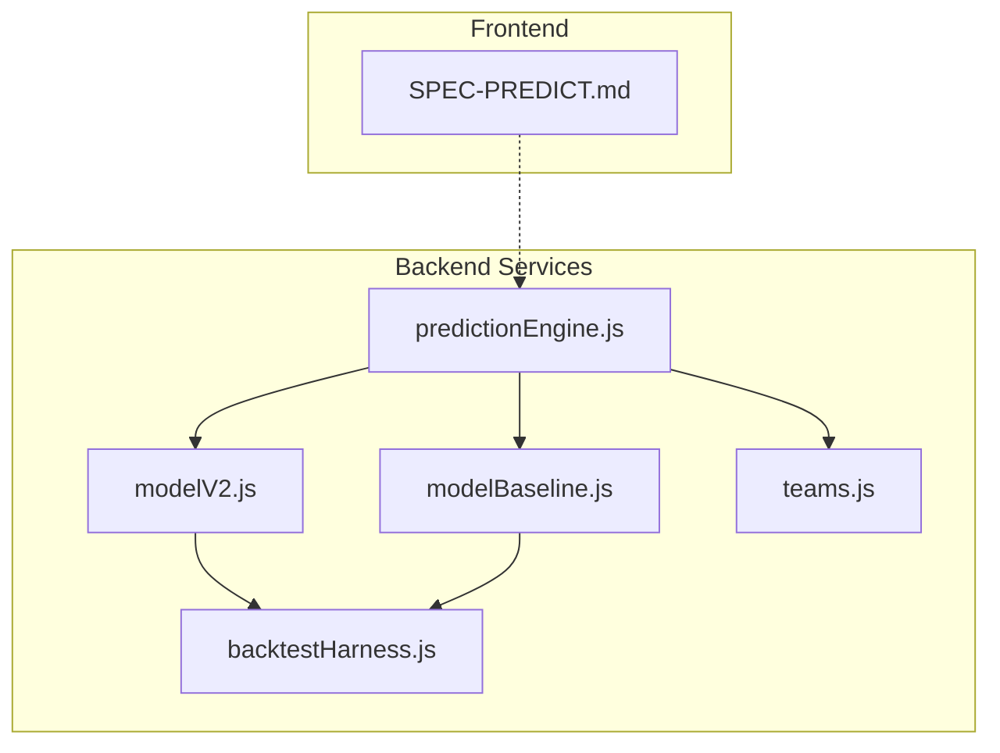
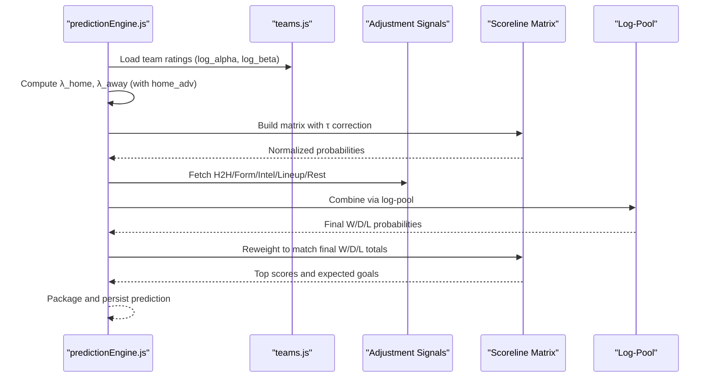
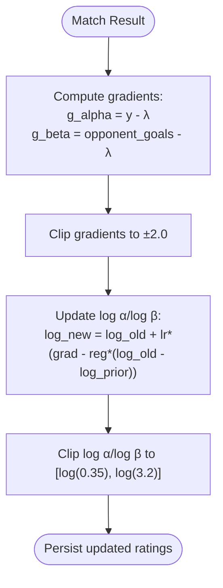
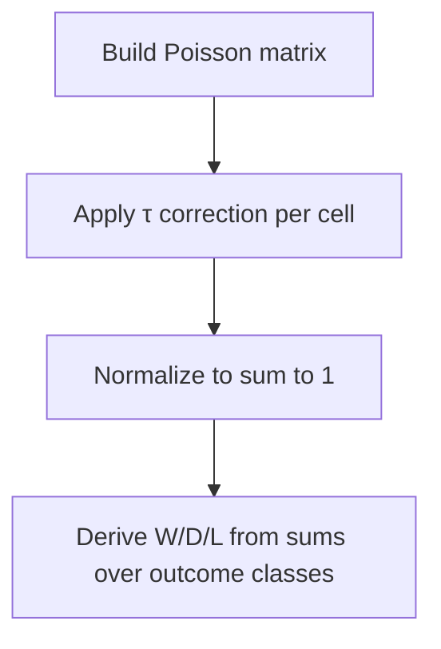
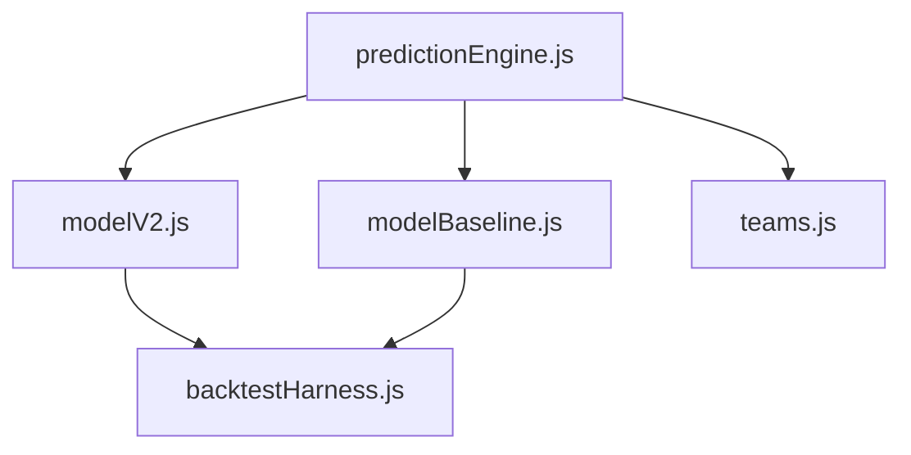

# Dixon-Coles Poisson Model

<cite>
**Referenced Files in This Document**
- [predictionEngine.js](file://backend/services/predictionEngine.js)
- [modelV2.js](file://backend/scripts/modelV2.js)
- [modelBaseline.js](file://backend/scripts/modelBaseline.js)
- [teams.js](file://backend/data/teams.js)
- [backtestHarness.js](file://backend/scripts/backtestHarness.js)
- [SPEC-PREDICT.md](file://specs/SPEC-PREDICT.md)
</cite>

## Table of Contents
1. [Introduction](#introduction)
2. [Project Structure](#project-structure)
3. [Core Components](#core-components)
4. [Architecture Overview](#architecture-overview)
5. [Detailed Component Analysis](#detailed-component-analysis)
6. [Dependency Analysis](#dependency-analysis)
7. [Performance Considerations](#performance-considerations)
8. [Troubleshooting Guide](#troubleshooting-guide)
9. [Conclusion](#conclusion)

## Introduction
This document explains the Dixon-Coles bivariate Poisson model that powers the prediction engine. It covers the mathematical foundations, including λ home/away parameters, the attack/defense rating system using log α and log β values, and the τ low-score correction mechanism. It documents the home advantage parameter (1.30 multiplier) and its application to host nations in USA/CAN/MEX, the DC_rho tuning (-0.18 for World Cup), and the scoreline matrix generation, probability normalization, and geometric correction applied to low-scoring combinations. It also details the MAX_GOALS setting (8), learning rate (0.06), regularization strength (0.002), and lambda clipping bounds. Finally, it provides examples of λ calculations, matrix construction, and probability derivation for win/draw/loss outcomes.

## Project Structure
The prediction engine is implemented in a single service module with supporting scripts for model variants, backtesting, and team data. The key files are:
- Backend service: predictionEngine.js (main prediction logic)
- Model variants: modelV2.js (Dixon-Coles Poisson with online updates)
- Baseline model: modelBaseline.js (historical-only factors for backtests)
- Team data: teams.js (team metadata and stats)
- Backtesting: backtestHarness.js (evaluation metrics and scoring)
- Frontend spec: SPEC-PREDICT.md (predictions page behavior)

**Diagram sources**
- [predictionEngine.js:1-1046](file://backend/services/predictionEngine.js#L1-L1046)
- [modelV2.js:1-240](file://backend/scripts/modelV2.js#L1-L240)
- [modelBaseline.js:1-228](file://backend/scripts/modelBaseline.js#L1-L228)
- [teams.js:1-234](file://backend/data/teams.js#L1-L234)
- [backtestHarness.js:1-156](file://backend/scripts/backtestHarness.js#L1-L156)
- [SPEC-PREDICT.md:1-147](file://specs/SPEC-PREDICT.md#L1-L147)

**Section sources**
- [predictionEngine.js:1-1046](file://backend/services/predictionEngine.js#L1-L1046)
- [modelV2.js:1-240](file://backend/scripts/modelV2.js#L1-L240)
- [modelBaseline.js:1-228](file://backend/scripts/modelBaseline.js#L1-L228)
- [teams.js:1-234](file://backend/data/teams.js#L1-L234)
- [backtestHarness.js:1-156](file://backend/scripts/backtestHarness.js#L1-L156)
- [SPEC-PREDICT.md:1-147](file://specs/SPEC-PREDICT.md#L1-L147)

## Core Components
- Dixon-Coles backbone: Poisson PMF with τ low-score correction, scoreline matrix normalization, and outcome extraction.
- Attack/defense ratings: log α (attack) and log β (defence) parameters initialized from FIFA points and team stats, updated via online Poisson MLE with regularization.
- Home advantage: 1.30 multiplier applied when a host nation plays at home or away in USA/CAN/MEX.
- DC_rho tuning: -0.18 for World Cup group stage to correct over-predicted 1-1 and under-predicted 0-0/1-0/0-1.
- Signal blending: log-pool geometric combination of backbone and adjustment signals (H2H, form, intel, lineup, rest days).
- Venue effects: altitude and heat adjustments to λ scaling.
- WC phase scaling: group vs knockout goal expectations.

**Section sources**
- [predictionEngine.js:66-83](file://backend/services/predictionEngine.js#L66-L83)
- [predictionEngine.js:135-174](file://backend/services/predictionEngine.js#L135-L174)
- [predictionEngine.js:205-212](file://backend/services/predictionEngine.js#L205-L212)
- [predictionEngine.js:214-238](file://backend/services/predictionEngine.js#L214-L238)
- [predictionEngine.js:116-133](file://backend/services/predictionEngine.js#L116-L133)
- [predictionEngine.js:85-90](file://backend/services/predictionEngine.js#L85-L90)

## Architecture Overview
The prediction pipeline combines a Dixon-Coles Poisson backbone with adjustment signals. The backbone computes λ_home and λ_away from log α/log β parameters and home advantage, builds a scoreline matrix with τ correction, normalizes probabilities, and derives W/D/L outcomes. Adjustment signals (H2H, form, intel, lineup, rest days) are combined via log-pool blending and reweight the matrix to preserve within-class scoreline shapes while aligning outcome totals to the blended probabilities.

**Diagram sources**
- [predictionEngine.js:691-922](file://backend/services/predictionEngine.js#L691-L922)
- [predictionEngine.js:135-174](file://backend/services/predictionEngine.js#L135-L174)
- [predictionEngine.js:214-238](file://backend/services/predictionEngine.js#L214-L238)
- [teams.js:1-234](file://backend/data/teams.js#L1-L234)

## Detailed Component Analysis

### Mathematical Foundations: λ Home/Away Parameters
- λ_home = exp(log_α_home + log_β_away + home_adv)
- λ_away = exp(log_α_away + log_β_home)
- Ratings initialized from FIFA points and team stats; updated via online Poisson MLE with Gaussian regularization.

Key constants and bounds:
- Learning rate: 0.06
- Regularization strength: 0.002
- Clipping bounds: log(0.35) ≤ log_α/log_β ≤ log(3.2)
- Gradient clipping: ±2.0

**Section sources**
- [predictionEngine.js:12-13](file://backend/services/predictionEngine.js#L12-L13)
- [predictionEngine.js:67-75](file://backend/services/predictionEngine.js#L67-L75)
- [predictionEngine.js:964-981](file://backend/services/predictionEngine.js#L964-L981)

### Attack/Defense Rating System: log α and log β
- Initialization: prior from FIFA points, blended with per-team scoring averages.
- Update: Poisson MLE gradient clipped to ±2.0, then regularized toward prior with strength 0.002.
- Bounds: log(0.35) to log(3.2) clamp log α/log β.

**Diagram sources**
- [predictionEngine.js:964-981](file://backend/services/predictionEngine.js#L964-L981)
- [modelV2.js:206-228](file://backend/scripts/modelV2.js#L206-L228)

**Section sources**
- [predictionEngine.js:176-203](file://backend/services/predictionEngine.js#L176-L203)
- [modelV2.js:87-98](file://backend/scripts/modelV2.js#L87-L98)
- [modelV2.js:206-228](file://backend/scripts/modelV2.js#L206-L228)

### τ Low-Score Correction (Dixon-Coles)
- Applies τ(h,a,lH,lA,ρ) to adjust low-scoring cells:
  - τ(0,0) = 1 - lH·lA·ρ
  - τ(0,1) = 1 + lH·ρ
  - τ(1,0) = 1 + lA·ρ
  - τ(1,1) = 1 - ρ
  - Otherwise τ = 1
- ρ tuned to -0.18 for World Cup group stage to correct over-predicted 1-1 and under-predicted 0-0/1-0/0-1.

**Diagram sources**
- [predictionEngine.js:143-163](file://backend/services/predictionEngine.js#L143-L163)

**Section sources**
- [predictionEngine.js:143-149](file://backend/services/predictionEngine.js#L143-L149)
- [predictionEngine.js:69-69](file://backend/services/predictionEngine.js#L69-L69)

### Home Advantage Parameter (1.30 Multiplier)
- Applied only when one team is a host nation (USA/CAN/MEX).
- Positive contribution when host plays at home; negative when host plays away.
- Host nations set: USA, CAN, MEX.

**Section sources**
- [predictionEngine.js:64](file://backend/services/predictionEngine.js#L64-L64)
- [predictionEngine.js:208-212](file://backend/services/predictionEngine.js#L208-L212)

### DC_rho Tuning (-0.18 for World Cup)
- ρ = -0.18 for World Cup group stage; configurable via model_config with fallback to backbone default.
- Improves fit compared to generic -0.13 by reducing overconfidence in 1-1 and increasing mass on 0-0/1-0/0-1.

**Section sources**
- [predictionEngine.js:69](file://backend/services/predictionEngine.js#L69-L69)
- [predictionEngine.js:671-674](file://backend/services/predictionEngine.js#L671-L674)

### Scoreline Matrix Generation and Probability Normalization
- Construct matrix with h,a from 0 to MAX_GOALS (8).
- Cell value = PoissonPMF(h,lH) × PoissonPMF(a,lA) × τ(h,a,lH,lA,ρ).
- Normalize by total mass to obtain probabilities.
- Extract W/D/L by summing over outcome classes.

**Section sources**
- [predictionEngine.js:151-163](file://backend/services/predictionEngine.js#L151-L163)
- [predictionEngine.js:165-174](file://backend/services/predictionEngine.js#L165-L174)

### Geometric Correction and Log-Pool Blending
- Adjustment signals produce W/D/L vectors; combined via log-pool:
  - p_combined ∝ ∏ (p_i)^w_i — geometric mean raised to per-signal exponents, then renormalized.
- Preserves confidence better than arithmetic averaging.

**Section sources**
- [predictionEngine.js:214-238](file://backend/services/predictionEngine.js#L214-L238)
- [predictionEngine.js:93-100](file://backend/services/predictionEngine.js#L93-L100)

### Venue Effects and WC Phase Scaling
- Venue conditions (altitude and heat) reduce λ by a multiplicative factor derived from conditions.
- WC goal scale differs by phase:
  - Group: 0.82
  - Knockout: 0.72

**Section sources**
- [predictionEngine.js:116-133](file://backend/services/predictionEngine.js#L116-L133)
- [predictionEngine.js:85-90](file://backend/services/predictionEngine.js#L85-L90)

### Example: λ Calculations and Matrix Construction
- λ_home = exp(log_α_home + log_β_away + home_adv)
- λ_away = exp(log_α_away + log_β_home)
- Matrix built with τ correction, normalized, then reweighted to match final W/D/L totals.
- Top scores chosen to maximize expected points under 3/2/2/1/0 rule.

**Section sources**
- [predictionEngine.js:789-795](file://backend/services/predictionEngine.js#L789-L795)
- [predictionEngine.js:797-799](file://backend/services/predictionEngine.js#L797-L799)
- [predictionEngine.js:377-394](file://backend/services/predictionEngine.js#L377-L394)
- [predictionEngine.js:410-438](file://backend/services/predictionEngine.js#L410-L438)

### Model Variants and Backtesting
- modelV2.js: Inline implementation of Dixon-Coles with initialization, λ computation, matrix building, and online updates.
- modelBaseline.js: Historical-only factors (ELO, Poisson, form) for backtests; excludes situational signals.
- backtestHarness.js: Walk-forward evaluation with Brier score, log loss, accuracy, and expected points.

**Section sources**
- [modelV2.js:132-237](file://backend/scripts/modelV2.js#L132-L237)
- [modelBaseline.js:146-225](file://backend/scripts/modelBaseline.js#L146-L225)
- [backtestHarness.js:72-153](file://backend/scripts/backtestHarness.js#L72-L153)

## Dependency Analysis
The prediction engine depends on team data for ratings and stats, and integrates multiple adjustment signals. The model variants and backtesting harnesses operate independently but share the same core mathematics.

**Diagram sources**
- [predictionEngine.js:37-43](file://backend/services/predictionEngine.js#L37-L43)
- [modelV2.js:23](file://backend/scripts/modelV2.js#L23)
- [modelBaseline.js:21](file://backend/scripts/modelBaseline.js#L21)
- [teams.js:1-234](file://backend/data/teams.js#L1-L234)
- [backtestHarness.js:1-156](file://backend/scripts/backtestHarness.js#L1-L156)

**Section sources**
- [predictionEngine.js:37-43](file://backend/services/predictionEngine.js#L37-L43)
- [modelV2.js:23](file://backend/scripts/modelV2.js#L23)
- [modelBaseline.js:21](file://backend/scripts/modelBaseline.js#L21)
- [teams.js:1-234](file://backend/data/teams.js#L1-L234)
- [backtestHarness.js:1-156](file://backend/scripts/backtestHarness.js#L1-L156)

## Performance Considerations
- Matrix size: MAX_GOALS = 8 yields 81 cells (0–8 for both teams), acceptable computational cost.
- Clipping: Gradients and log parameters prevent runaway updates and numerical instability.
- Normalization: Matrix normalization ensures valid probabilities; reweighting preserves within-class shapes.
- Venue scaling: Reduces λ for high-altitude and heat conditions to reflect realistic scoring environments.

[No sources needed since this section provides general guidance]

## Troubleshooting Guide
- Unexpected probabilities near 0.33/0.33/0.33: Verify log-pool blending weights and ensure at least one strong signal is present.
- Overconfident predictions: Check temperature calibration and ensure regularization is active.
- Incorrect λ values: Confirm log α/log β initialization and that updates are occurring after completed matches.
- Venue anomalies: Validate venue condition parsing and λ scaling factor.

**Section sources**
- [predictionEngine.js:663-688](file://backend/services/predictionEngine.js#L663-L688)
- [predictionEngine.js:924-989](file://backend/services/predictionEngine.js#L924-L989)

## Conclusion
The Dixon-Coles Poisson model forms the backbone of the prediction engine, combining robust attack/defense ratings with τ low-score correction and careful home advantage and venue adjustments. The model’s hyperparameters (MAX_GOALS, learning rate, regularization, DC_rho) are tuned for World Cup dynamics, and the log-pool blending ensures coherent integration of multiple signals. The provided examples and diagrams illustrate how λ is computed, how the scoreline matrix is constructed, and how final probabilities and top scores are derived.