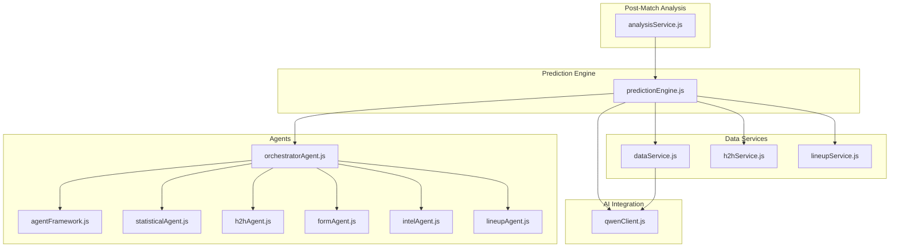
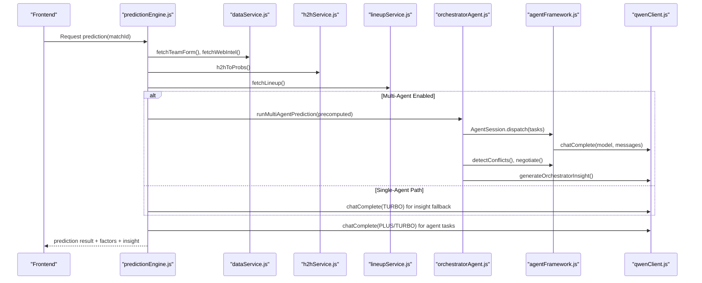
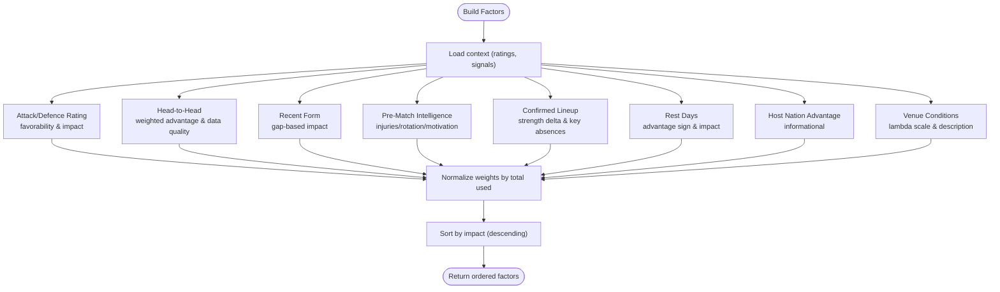
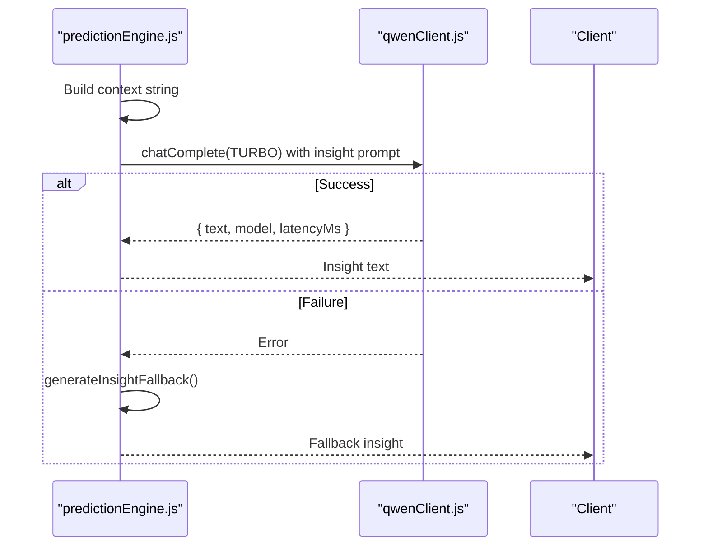
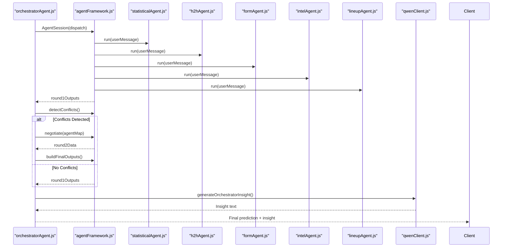
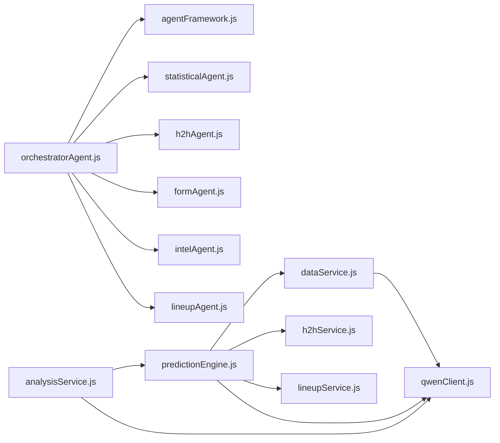

# Factor Analysis & Insight Generation

<cite>
**Referenced Files in This Document**
- [SPEC.md](file://specs/SPEC.md)
- [predictionEngine.js](file://backend/services/predictionEngine.js)
- [analysisService.js](file://backend/services/analysisService.js)
- [qwenClient.js](file://backend/services/qwenClient.js)
- [agentFramework.js](file://backend/services/agents/agentFramework.js)
- [orchestratorAgent.js](file://backend/services/agents/orchestratorAgent.js)
- [statisticalAgent.js](file://backend/services/agents/statisticalAgent.js)
- [h2hAgent.js](file://backend/services/agents/h2hAgent.js)
- [formAgent.js](file://backend/services/agents/formAgent.js)
- [intelAgent.js](file://backend/services/agents/intelAgent.js)
- [lineupAgent.js](file://backend/services/agents/lineupAgent.js)
- [dataService.js](file://backend/services/dataService.js)
- [h2hService.js](file://backend/services/h2hService.js)
- [lineupService.js](file://backend/services/lineupService.js)
</cite>

## Table of Contents
1. [Introduction](#introduction)
2. [Project Structure](#project-structure)
3. [Core Components](#core-components)
4. [Architecture Overview](#architecture-overview)
5. [Detailed Component Analysis](#detailed-component-analysis)
6. [Dependency Analysis](#dependency-analysis)
7. [Performance Considerations](#performance-considerations)
8. [Troubleshooting Guide](#troubleshooting-guide)
9. [Conclusion](#conclusion)

## Introduction
This document explains the factor analysis system and automated insight generation for the World Cup 2026 prediction application. It covers how the system builds detailed explanations of prediction drivers (attack/defense ratings, head-to-head advantages, form assessments, injury reports, lineup strengths, venue effects), computes factor impacts and weight distributions, and prioritizes the most influential factors. It also documents the multi-agent insight generation pipeline using Qwen AI models, including prompt engineering, context formatting, and fallback mechanisms.

## Project Structure
The factor analysis and insight generation span several backend services:
- Prediction engine: core probabilistic model and factor aggregation
- Multi-agent orchestration: specialized agents interpret signals and negotiate differences
- Data services: fetch live data, injuries, forms, and lineups
- Qwen client: integrates with DashScope for AI inference
- Analysis service: post-match evaluation and calibration

**Diagram sources**
- [predictionEngine.js:664-800](file://backend/services/predictionEngine.js#L664-L800)
- [agentFramework.js:1-576](file://backend/services/agents/agentFramework.js#L1-L576)
- [orchestratorAgent.js:276-473](file://backend/services/agents/orchestratorAgent.js#L276-L473)
- [statisticalAgent.js:1-98](file://backend/services/agents/statisticalAgent.js#L1-L98)
- [h2hAgent.js:1-107](file://backend/services/agents/h2hAgent.js#L1-L107)
- [formAgent.js:1-113](file://backend/services/agents/formAgent.js#L1-L113)
- [intelAgent.js:1-126](file://backend/services/agents/intelAgent.js#L1-L126)
- [lineupAgent.js:1-118](file://backend/services/agents/lineupAgent.js#L1-L118)
- [dataService.js:1-583](file://backend/services/dataService.js#L1-L583)
- [h2hService.js:1-315](file://backend/services/h2hService.js#L1-L315)
- [lineupService.js:1-425](file://backend/services/lineupService.js#L1-L425)
- [qwenClient.js:1-123](file://backend/services/qwenClient.js#L1-L123)
- [analysisService.js:1-422](file://backend/services/analysisService.js#L1-L422)

**Section sources**
- [SPEC.md:125-178](file://specs/SPEC.md#L125-L178)
- [predictionEngine.js:664-800](file://backend/services/predictionEngine.js#L664-L800)

## Core Components
- Prediction engine: constructs the Dixon-Coles backbone, applies adjustment signals (H2H, form, intel, lineup, rest), blends via log-pool, derives top scorelines, and generates human-readable insights with Qwen.
- Multi-agent system: specialized agents analyze separate domains (statistical, H2H, form, intel, lineup), propose probability assessments, negotiate conflicts, and feed into a final log-pooled output.
- Data services: fetch recent form, H2H records, pre-match intelligence (injuries, motivation, rotation), and confirmed lineups.
- Qwen client: unified interface to DashScope with retry/backoff and model selection.
- Post-match analysis: grades predictions, computes Brier score, recalibrates temperature and Dixon-Coles ρ, and maintains model performance metrics.

**Section sources**
- [predictionEngine.js:462-583](file://backend/services/predictionEngine.js#L462-L583)
- [agentFramework.js:36-53](file://backend/services/agents/agentFramework.js#L36-L53)
- [dataService.js:68-133](file://backend/services/dataService.js#L68-L133)
- [qwenClient.js:53-101](file://backend/services/qwenClient.js#L53-L101)
- [analysisService.js:76-218](file://backend/services/analysisService.js#L76-L218)

## Architecture Overview
The system combines deterministic modeling with AI interpretation:
- Deterministic backbone: Dixon-Coles bivariate Poisson with attack/defense ratings, home advantage, and venue scaling.
- Adjustment signals: H2H, form, intel, lineup, and rest days contribute via weighted log-pool blending.
- Multi-agent interpretation: each agent independently assesses a domain and proposes probabilities; conflicts trigger negotiation; final weights are adjusted based on concessions.
- Insight generation: Qwen synthesizes a concise analyst-style narrative from the top factors and context.

**Diagram sources**
- [predictionEngine.js:664-800](file://backend/services/predictionEngine.js#L664-L800)
- [dataService.js:413-490](file://backend/services/dataService.js#L413-L490)
- [h2hService.js:272-312](file://backend/services/h2hService.js#L272-L312)
- [lineupService.js:221-362](file://backend/services/lineupService.js#L221-L362)
- [orchestratorAgent.js:290-470](file://backend/services/agents/orchestratorAgent.js#L290-L470)
- [agentFramework.js:345-493](file://backend/services/agents/agentFramework.js#L345-L493)
- [qwenClient.js:53-101](file://backend/services/qwenClient.js#L53-L101)

## Detailed Component Analysis

### Factor Building Pipeline
The factor builder aggregates multiple signals into a prioritized list:
- Attack/Defense Ratings: compares λ-home/λ-away to determine favorability and impact magnitude.
- Head-to-Head: weighted advantage from 47k match dataset; includes data quality and recent meeting context.
- Recent Form: opponent-quality-weighted form score; translates to impact proportional to the gap.
- Pre-Match Intelligence: injuries, rotation, motivation; impact capped by severity.
- Confirmed Lineup: strength delta and key absences; highest weight when available.
- Rest Days: differential in rest days influences momentum and recovery.
- Host Nation Advantage and Venue Effects: informational adjustments embedded in backbone.

**Diagram sources**
- [predictionEngine.js:462-583](file://backend/services/predictionEngine.js#L462-L583)

**Section sources**
- [predictionEngine.js:462-583](file://backend/services/predictionEngine.js#L462-L583)

### Factor Impact Calculation and Weight Distribution
- Impact quantification:
  - Attack/Defense: minimal logarithmic distance from 1.0 favors the stronger side.
  - H2H: absolute weighted advantage capped at 0.5.
  - Form: absolute difference between normalized scores.
  - Intel: capped by number of injuries and severity indicators.
  - Lineup: normalized delta divided by 3 with a cap.
  - Rest: proportional to day difference with diminishing returns.
- Weight distribution:
  - Weights are normalized percentages of total weights used.
  - Signal weights: BACKBONE (dominant), H2H (0.30), FORM (0.20), INTEL (0.20), LINEUP (0.40), REST (0.10).
  - Multi-agent weights: final weights adjusted post-negotiation; winner gains 1.3×, loser drops to 0.6×.

**Section sources**
- [predictionEngine.js:93-100](file://backend/services/predictionEngine.js#L93-L100)
- [predictionEngine.js:462-583](file://backend/services/predictionEngine.js#L462-L583)
- [agentFramework.js:32-34](file://backend/services/agents/agentFramework.js#L32-L34)
- [agentFramework.js:445-493](file://backend/services/agents/agentFramework.js#L445-L493)

### Automated Insight Generation (Single-Agent Path)
- Context formatting: includes match context, probabilities, top scorelines, top factors, and key intel summary.
- Prompt engineering: concise analyst-style instruction, specifying team names, numbers, and most decisive factors.
- Fallback: if Qwen fails, a deterministic fallback composes a concise insight based on favorites and top factor.

**Diagram sources**
- [predictionEngine.js:606-635](file://backend/services/predictionEngine.js#L606-L635)
- [qwenClient.js:53-101](file://backend/services/qwenClient.js#L53-L101)

**Section sources**
- [predictionEngine.js:606-635](file://backend/services/predictionEngine.js#L606-L635)
- [qwenClient.js:53-101](file://backend/services/qwenClient.js#L53-L101)

### Multi-Agent Insight Generation
- Agents: Statistical, H2H, Form, Intel, Lineup (each with domain-specific prompts and recommended weights).
- Session orchestration: parallel Round 1, conflict detection (threshold 0.20), simultaneous Round 2 rebuttals, and final weight adjustments.
- Final synthesis: log-pool blend of agent outputs, temperature scaling, reweighting of scoreline matrix, and Qwen insight generation.

**Diagram sources**
- [orchestratorAgent.js:290-470](file://backend/services/agents/orchestratorAgent.js#L290-L470)
- [agentFramework.js:345-493](file://backend/services/agents/agentFramework.js#L345-L493)
- [statisticalAgent.js:42-87](file://backend/services/agents/statisticalAgent.js#L42-L87)
- [h2hAgent.js:52-96](file://backend/services/agents/h2hAgent.js#L52-L96)
- [formAgent.js:65-102](file://backend/services/agents/formAgent.js#L65-L102)
- [intelAgent.js:62-115](file://backend/services/agents/intelAgent.js#L62-L115)
- [lineupAgent.js:61-107](file://backend/services/agents/lineupAgent.js#L61-L107)
- [qwenClient.js:53-101](file://backend/services/qwenClient.js#L53-L101)

**Section sources**
- [orchestratorAgent.js:290-470](file://backend/services/agents/orchestratorAgent.js#L290-L470)
- [agentFramework.js:32-53](file://backend/services/agents/agentFramework.js#L32-L53)
- [SPEC.md:148-159](file://specs/SPEC.md#L148-L159)

### Data Sources and Signal Processing
- Form: fetches last 10 results from API or web-scrapes ESPN; generates plausible defaults if needed.
- H2H: downloads and seeds a 47k-match dataset; computes competition-weighted, recency-weighted summary; converts to probabilities with shrinkage toward base rates.
- Intel: scrapes Google News RSS; uses Qwen to parse structured signals (injuries, form, motivation, rotation); validates claims against source text; falls back to regex extraction.
- Lineup: attempts API and ESPN scrapes; computes strength scores by position weights and player ratings; detects key absences; converts to probability nudges.

**Section sources**
- [dataService.js:68-185](file://backend/services/dataService.js#L68-L185)
- [h2hService.js:95-312](file://backend/services/h2hService.js#L95-L312)
- [dataService.js:273-490](file://backend/services/dataService.js#L273-L490)
- [lineupService.js:158-362](file://backend/services/lineupService.js#L158-L362)

### Post-Match Analysis and Calibration
- Records match results, updates group standings and bracket, recalculates ELO and attack/defense ratings.
- Grades predictions: computes Brier score, outcome correctness, points, and upset detection.
- Automatic calibration: refits temperature scaling and Dixon-Coles ρ every 10 results after 20.

**Section sources**
- [analysisService.js:76-218](file://backend/services/analysisService.js#L76-L218)
- [analysisService.js:298-316](file://backend/services/analysisService.js#L298-L316)
- [analysisService.js:321-384](file://backend/services/analysisService.js#L321-L384)

## Dependency Analysis
The system exhibits layered dependencies:
- predictionEngine depends on dataService, h2hService, lineupService, and qwenClient.
- orchestratorAgent depends on agentFramework and all specialist agents.
- dataService depends on qwenClient for structured intel parsing.
- analysisService depends on predictionEngine for post-match updates and on qwenClient for insight fallbacks.

**Diagram sources**
- [predictionEngine.js:37-43](file://backend/services/predictionEngine.js#L37-L43)
- [agentFramework.js:28-30](file://backend/services/agents/agentFramework.js#L28-L30)
- [orchestratorAgent.js:28-37](file://backend/services/agents/orchestratorAgent.js#L28-L37)
- [dataService.js:21](file://backend/services/dataService.js#L21)
- [analysisService.js:13-16](file://backend/services/analysisService.js#L13-L16)

**Section sources**
- [predictionEngine.js:37-43](file://backend/services/predictionEngine.js#L37-L43)
- [agentFramework.js:28-30](file://backend/services/agents/agentFramework.js#L28-L30)
- [orchestratorAgent.js:28-37](file://backend/services/agents/orchestratorAgent.js#L28-L37)
- [dataService.js:21](file://backend/services/dataService.js#L21)
- [analysisService.js:13-16](file://backend/services/analysisService.js#L13-L16)

## Performance Considerations
- Parallelism: multi-agent dispatch and data fetches (form, H2H, intel, lineup) leverage Promise.allSettled to minimize latency.
- Caching: form, H2H, and intel caches reduce repeated network calls; lineup availability gating prevents unnecessary work.
- Log-pool blending: numerically stable computation with centering to avoid overflow.
- Retry/backoff: Qwen client retries on transient failures with exponential backoff.
- Calibration cadence: periodic refits prevent drift without overfitting.

[No sources needed since this section provides general guidance]

## Troubleshooting Guide
- Qwen API key missing: chatComplete throws an error; ensure DASHSCOPE_API_KEY is configured.
- Agent JSON parsing failures: agentFramework falls back to uniform priors and attaches flags; inspect raw responses and refine prompts.
- Live result sync disabled: if FOOTBALL_DATA_API_KEY is unset, live sync is skipped; manual result entry remains available.
- Multi-agent disabled: USE_MULTI_AGENT=false or config disables orchestration; single-agent path executes instead.

**Section sources**
- [qwenClient.js:60-62](file://backend/services/qwenClient.js#L60-L62)
- [agentFramework.js:112-146](file://backend/services/agents/agentFramework.js#L112-L146)
- [dataService.js:495-580](file://backend/services/dataService.js#L495-L580)
- [SPEC.md:170-177](file://specs/SPEC.md#L170-L177)

## Conclusion
The factor analysis and insight generation system combines a robust Dixon-Coles backbone with adaptive, multi-source signals and AI interpretation. Factors are quantified consistently, weights are distributed deliberately, and the most influential drivers are surfaced through prioritized factor lists and concise analyst insights. The multi-agent framework ensures diverse perspectives, resolves conflicts rigorously, and maintains interpretability while leveraging AI for nuanced synthesis.