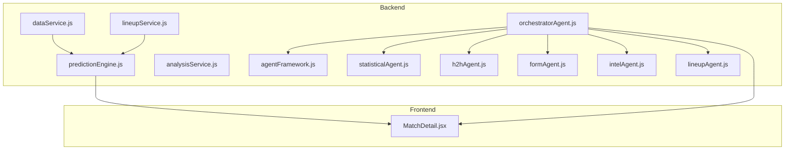
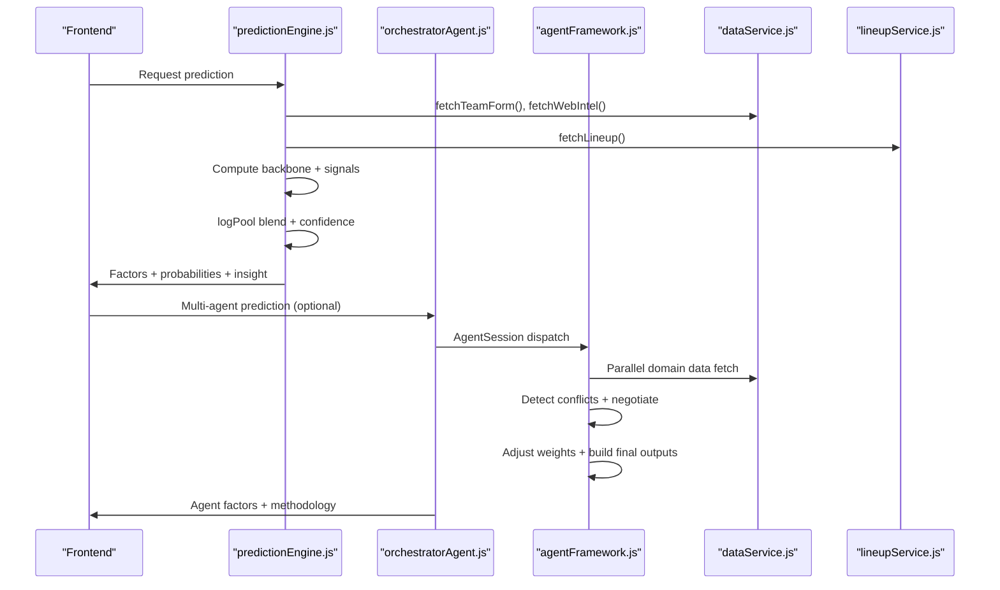
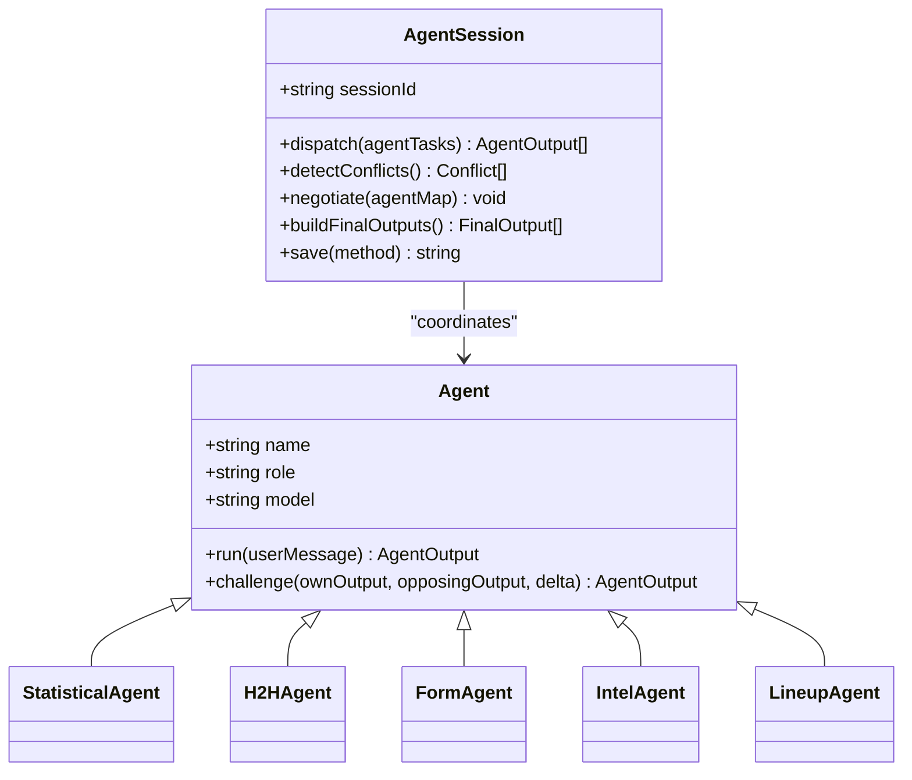
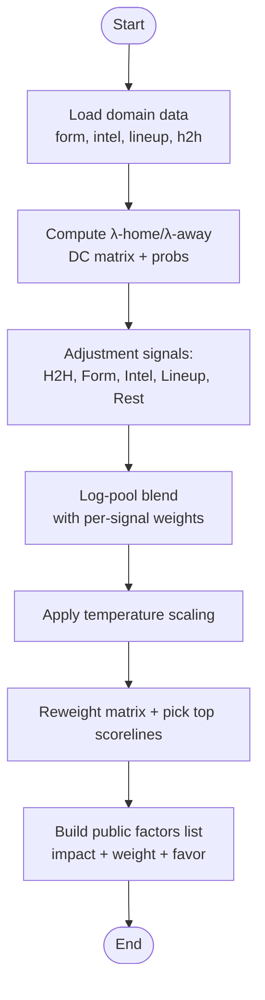
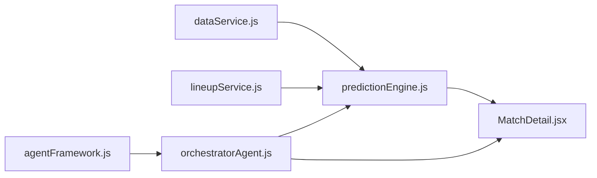

# Factor Analysis and Attribution

<cite>
**Referenced Files in This Document**
- [SPEC-PREDICT.md](file://specs/SPEC-PREDICT.md)
- [SPEC.md](file://specs/SPEC.md)
- [predictionEngine.js](file://backend/services/predictionEngine.js)
- [analysisService.js](file://backend/services/analysisService.js)
- [dataService.js](file://backend/services/dataService.js)
- [lineupService.js](file://backend/services/lineupService.js)
- [orchestratorAgent.js](file://backend/services/agents/orchestratorAgent.js)
- [agentFramework.js](file://backend/services/agents/agentFramework.js)
- [statisticalAgent.js](file://backend/services/agents/statisticalAgent.js)
- [h2hAgent.js](file://backend/services/agents/h2hAgent.js)
- [formAgent.js](file://backend/services/agents/formAgent.js)
- [intelAgent.js](file://backend/services/agents/intelAgent.js)
- [lineupAgent.js](file://backend/services/agents/lineupAgent.js)
- [MatchDetail.jsx](file://frontend/src/pages/MatchDetail.jsx)
</cite>

## Table of Contents
1. [Introduction](#introduction)
2. [Project Structure](#project-structure)
3. [Core Components](#core-components)
4. [Architecture Overview](#architecture-overview)
5. [Detailed Component Analysis](#detailed-component-analysis)
6. [Dependency Analysis](#dependency-analysis)
7. [Performance Considerations](#performance-considerations)
8. [Troubleshooting Guide](#troubleshooting-guide)
9. [Conclusion](#conclusion)
10. [Appendices](#appendices)

## Introduction
This document explains the factor analysis system that attributes prediction outcomes to specific contributing factors. It covers how weighted factor lists are built, showing impact magnitude, favor alignment, and contribution percentages; documents the factor categories; details impact calculation methods and weight distribution; and explains the administrative view versus the public-facing presentation. It also includes examples of factor attribution, methodology transparency, factor quality indicators, data-source validation, and confidence-adjusted factor presentation.

## Project Structure
The factor analysis spans both the prediction engine and the multi-agent orchestration system:
- Prediction Engine: computes the base Dixon–Coles model, applies adjustment signals, builds a final probability blend, derives scorelines, and constructs the public-facing factor list.
- Multi-Agent Orchestration: runs specialized agents in parallel, detects conflicts, negotiates differences, adjusts weights, and synthesizes a final prediction with agent-derived factors.
- Frontend: displays the factors with impact bars, weights, and favor indicators.

**Diagram sources**
- [predictionEngine.js:691-800](file://backend/services/predictionEngine.js#L691-L800)
- [orchestratorAgent.js:309-502](file://backend/services/agents/orchestratorAgent.js#L309-L502)
- [agentFramework.js:208-586](file://backend/services/agents/agentFramework.js#L208-L586)
- [MatchDetail.jsx:927-968](file://frontend/src/pages/MatchDetail.jsx#L927-L968)

**Section sources**
- [SPEC-PREDICT.md:1-147](file://specs/SPEC-PREDICT.md#L1-L147)
- [SPEC.md:125-178](file://specs/SPEC.md#L125-L178)

## Core Components
- Prediction Engine: Implements the Dixon–Coles backbone, computes adjustment signals (H2H, form, intel, lineup, rest), blends via log-pool, derives confidence and top scorelines, and builds the public factor list.
- Multi-Agent Orchestration: Runs five agents (Statistical, H2H, Form, Intel, Lineup), detects conflicts, negotiates, adjusts weights, and synthesizes final probabilities and factors.
- Data Services: Provides recent form, H2H records, and pre-match intelligence with structured extraction and validation.
- Lineup Service: Computes lineup strength scores, detects key absences, and converts lineup impact into probability adjustments.
- Frontend Presentation: Renders factor names, descriptions, weights, favor indicators, and impact bars.

**Section sources**
- [predictionEngine.js:461-583](file://backend/services/predictionEngine.js#L461-L583)
- [orchestratorAgent.js:157-193](file://backend/services/agents/orchestratorAgent.js#L157-L193)
- [dataService.js:68-133](file://backend/services/dataService.js#L68-L133)
- [lineupService.js:399-422](file://backend/services/lineupService.js#L399-L422)
- [MatchDetail.jsx:927-968](file://frontend/src/pages/MatchDetail.jsx#L927-L968)

## Architecture Overview
The system combines deterministic modeling with probabilistic blending and human-readable explanations:
- Deterministic backbone: Dixon–Coles bivariate Poisson with attack/defense ratings and home advantage.
- Adjustment signals: H2H, recent form, pre-match intelligence, confirmed lineup, and rest days.
- Blending: Log-pool aggregation of probabilities with per-signal weights.
- Factor attribution: Public-facing factors list with impact magnitudes and weights; administrative view shows raw weights.

**Diagram sources**
- [predictionEngine.js:691-800](file://backend/services/predictionEngine.js#L691-L800)
- [orchestratorAgent.js:309-502](file://backend/services/agents/orchestratorAgent.js#L309-L502)
- [agentFramework.js:350-503](file://backend/services/agents/agentFramework.js#L350-L503)
- [dataService.js:432-509](file://backend/services/dataService.js#L432-L509)
- [lineupService.js:220-316](file://backend/services/lineupService.js#L220-L316)

## Detailed Component Analysis

### Factor Building Pipeline (Public-Facing)
The public factor list aggregates contributions from the backbone and adjustment signals:
- Attack/Defense Ratings: Base strength inferred from α/β ratings and expected goals.
- Head-to-Head History: Historical record with weighted advantage and data quality.
- Recent Form: Opponent-quality-weighted form score and difference.
- Pre-Match Intelligence: Injuries, motivation, rotation, and key summary.
- Confirmed Lineup: Strength delta and key absences.
- Rest & Recovery: Rest-day difference effect.
- Host Nation Advantage: Informational note folded into home advantage.
- Venue Conditions: Informational note with goal expectation adjustment.

Impact calculation and prioritization:
- Impact magnitude is derived from the strength of the signal (e.g., log-ratio for ratings, absolute difference for form, bounded by signal-specific caps).
- Favor alignment is determined by direction of effect (e.g., higher λ ratio favors home).
- Contribution percentages are computed from weights used and normalized across all active signals.

Administrative view vs public view:
- Administrative view: Raw weights used in blending are visible for inspection.
- Public view: Descriptive summaries tailored for readability, with impact bars and favor indicators.

**Section sources**
- [predictionEngine.js:461-583](file://backend/services/predictionEngine.js#L461-L583)
- [MatchDetail.jsx:927-968](file://frontend/src/pages/MatchDetail.jsx#L927-L968)

### Multi-Agent Factor Attribution
When multi-agent mode is enabled, each agent contributes a probability assessment with evidence and confidence:
- Agents: Statistical, H2H, Form, Intel, Lineup.
- Conflict detection: Probability deltas ≥ 20% trigger negotiation.
- Weight adjustment: Winner retains position (boosted weight); loser’s weight reduced and uses revised probabilities.
- Final factors: Built from agent outputs with weights normalized to percentages.

**Diagram sources**
- [agentFramework.js:208-586](file://backend/services/agents/agentFramework.js#L208-L586)
- [statisticalAgent.js:89-98](file://backend/services/agents/statisticalAgent.js#L89-L98)
- [h2hAgent.js:98-107](file://backend/services/agents/h2hAgent.js#L98-L107)
- [formAgent.js:104-113](file://backend/services/agents/formAgent.js#L104-L113)
- [intelAgent.js:118-128](file://backend/services/agents/intelAgent.js#L118-L128)
- [lineupAgent.js:109-118](file://backend/services/agents/lineupAgent.js#L109-L118)

**Section sources**
- [orchestratorAgent.js:157-193](file://backend/services/agents/orchestratorAgent.js#L157-L193)
- [agentFramework.js:376-503](file://backend/services/agents/agentFramework.js#L376-L503)

### Impact Calculation Methods and Weight Distribution
- Backboned Dixon–Coles model: λ-home and λ-away derived from α/β ratings, home advantage, and venue conditions; score matrices computed with low-score correction.
- Adjustment signals:
  - H2H: Weighted probabilities from historical records; impact capped by advantage magnitude.
  - Form: Score difference mapped to win/draw/loss probabilities with compression.
  - Intel: Injury and motivation effects translated to probability nudges; goal-channel adjustments included.
  - Lineup: Strength delta converted to probability shift; available only when confirmed.
  - Rest: Days-since-last-play effect with asymmetric penalties.
- Log-pool blending: Probabilities combined as geometric mean with per-signal exponents; weights normalized; temperature scaling applied.

**Diagram sources**
- [predictionEngine.js:781-800](file://backend/services/predictionEngine.js#L781-L800)
- [predictionEngine.js:214-238](file://backend/services/predictionEngine.js#L214-L238)
- [predictionEngine.js:663-688](file://backend/services/predictionEngine.js#L663-L688)
- [predictionEngine.js:377-394](file://backend/services/predictionEngine.js#L377-L394)

**Section sources**
- [predictionEngine.js:67-133](file://backend/services/predictionEngine.js#L67-L133)
- [predictionEngine.js:240-362](file://backend/services/predictionEngine.js#L240-L362)
- [predictionEngine.js:663-688](file://backend/services/predictionEngine.js#L663-L688)

### Factor Categories and Examples
- Attack/Defense Ratings: Base strength inferred from α/β; impact from λ ratio; favors determined by direction.
- Head-to-Head History: Record summary, WC meetings, and data quality; impact from weighted advantage.
- Recent Form: Form scores and difference; impact from absolute gap.
- Pre-Match Intelligence: Injuries, rotation, motivation; impact from severity and count.
- Confirmed Lineup: Strength delta and key absences; impact from normalized delta.
- Rest & Recovery: Rest-day difference; impact from penalty function.
- Host Nation Advantage: Informational; folded into home advantage.
- Venue Conditions: Informational; goal expectation adjustment.

Example scenarios (conceptual):
- Strong lineup delta with key absences: High impact, clear favor shift; weight reflects confidence.
- Balanced form with H2H edge: Moderate impact; favor determined by advantage magnitude.
- Injury-heavy side with rotation: Elevated impact; weight adjusted by data quality.

**Section sources**
- [predictionEngine.js:461-583](file://backend/services/predictionEngine.js#L461-L583)
- [lineupService.js:399-422](file://backend/services/lineupService.js#L399-L422)
- [dataService.js:294-399](file://backend/services/dataService.js#L294-L399)

### Factor Quality Indicators and Data Validation
- Data quality flags: H2H agent surfaces data quality; Intel agent indicates LLM-parsed status.
- Anti-hallucination checks: Injuries verified against source text within injury keywords; invalid claims removed; key summary sanitized.
- Confidence thresholds: Agents set confidence and weight recommendations; conflicts trigger negotiation.

**Section sources**
- [h2hAgent.js:92-96](file://backend/services/agents/h2hAgent.js#L92-L96)
- [dataService.js:294-399](file://backend/services/dataService.js#L294-L399)
- [agentFramework.js:376-404](file://backend/services/agents/agentFramework.js#L376-L404)

### Administrative View vs Public-Facing Presentation
- Administrative view: Raw weights used in blending; factor names correspond to signals; impact and favor derived from computations.
- Public-facing presentation: Human-readable descriptions, impact bars, and favor indicators; methodology string shows agent contributions when multi-agent is used.

**Section sources**
- [predictionEngine.js:461-583](file://backend/services/predictionEngine.js#L461-L583)
- [orchestratorAgent.js:184-193](file://backend/services/agents/orchestratorAgent.js#L184-L193)
- [MatchDetail.jsx:927-968](file://frontend/src/pages/MatchDetail.jsx#L927-L968)

## Dependency Analysis
The factor analysis system depends on:
- Data services for form, H2H, and intelligence.
- Lineup service for confirmed lineup strength and impact.
- Agent framework for multi-agent orchestration and conflict resolution.
- Frontend for rendering factors and insights.

**Diagram sources**
- [predictionEngine.js:37-43](file://backend/services/predictionEngine.js#L37-L43)
- [lineupService.js:41-43](file://backend/services/lineupService.js#L41-L43)
- [agentFramework.js:27-29](file://backend/services/agents/agentFramework.js#L27-L29)
- [orchestratorAgent.js:28-30](file://backend/services/agents/orchestratorAgent.js#L28-L30)

**Section sources**
- [predictionEngine.js:37-43](file://backend/services/predictionEngine.js#L37-L43)
- [lineupService.js:41-43](file://backend/services/lineupService.js#L41-L43)
- [agentFramework.js:27-29](file://backend/services/agents/agentFramework.js#L27-L29)
- [orchestratorAgent.js:28-30](file://backend/services/agents/orchestratorAgent.js#L28-L30)

## Performance Considerations
- Parallel data fetching: Form, H2H, intel, and lineup are fetched concurrently to minimize latency.
- Log-pool blending: Efficient computation using logarithmic transforms and normalization.
- Multi-agent negotiation: Parallel processing of conflicts; weight adjustments reduce iterations needed.
- Caching: Form, H2H, and intel cached with TTL to reduce repeated network calls.

[No sources needed since this section provides general guidance]

## Troubleshooting Guide
- Factor list empty or incomplete: Verify that required signals are available (e.g., lineup not yet confirmed).
- High-impact factor with low weight: Indicates signal presence but low confidence; check data quality flags.
- Discrepancies between multi-agent and single-engine outputs: Review conflict detection and weight adjustments; inspect agent messages and resolutions.
- Data validation failures: Check anti-hallucination logs for invalid injury claims or key summary sanitization.

**Section sources**
- [agentFramework.js:376-404](file://backend/services/agents/agentFramework.js#L376-L404)
- [dataService.js:294-399](file://backend/services/dataService.js#L294-L399)

## Conclusion
The factor analysis system provides transparent, confidence-adjusted attribution of prediction outcomes across multiple domains. It combines a robust deterministic backbone with validated adjustment signals and, optionally, a multi-agent synthesis that exposes reasoning and resolves disagreements. The public view communicates impact and favor with readable descriptions, while administrative views reveal raw weights and methodologies for deeper inspection.

[No sources needed since this section summarizes without analyzing specific files]

## Appendices

### Factor Categories Reference
- Attack/Defense Ratings
- Head-to-Head History
- Recent Form
- Pre-Match Intelligence
- Confirmed Lineup
- Rest & Recovery
- Host Nation Advantage
- Venue Conditions

**Section sources**
- [predictionEngine.js:461-583](file://backend/services/predictionEngine.js#L461-L583)