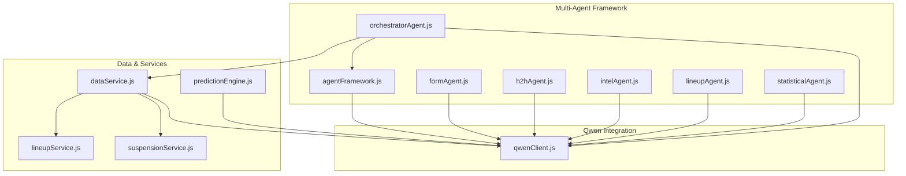
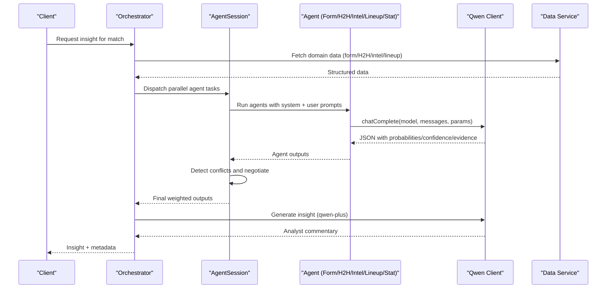
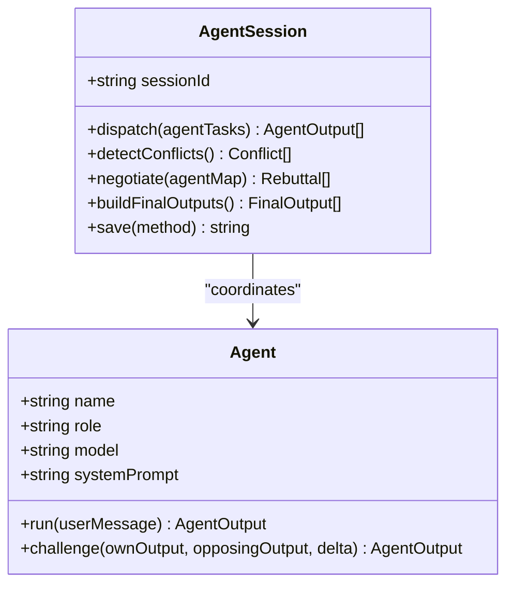
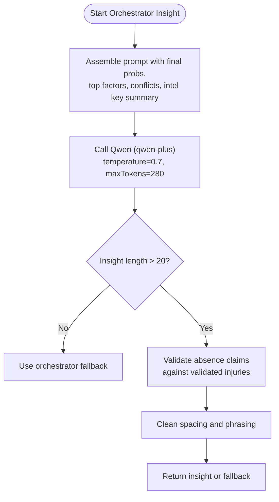
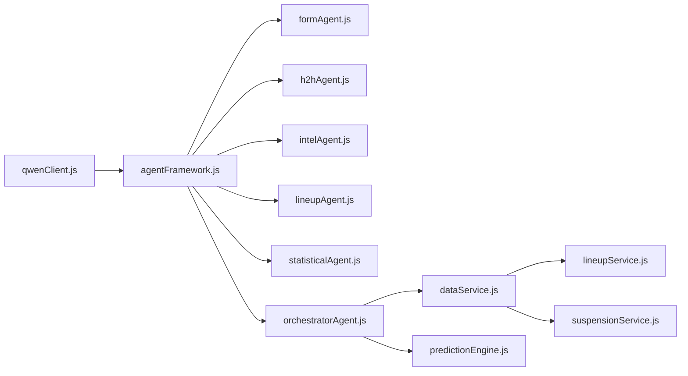

# Insight Generation and LLM Integration

<cite>
**Referenced Files in This Document**
- [qwenClient.js](file://backend/services/qwenClient.js)
- [agentFramework.js](file://backend/services/agents/agentFramework.js)
- [orchestratorAgent.js](file://backend/services/agents/orchestratorAgent.js)
- [formAgent.js](file://backend/services/agents/formAgent.js)
- [h2hAgent.js](file://backend/services/agents/h2hAgent.js)
- [intelAgent.js](file://backend/services/agents/intelAgent.js)
- [lineupAgent.js](file://backend/services/agents/lineupAgent.js)
- [statisticalAgent.js](file://backend/services/agents/statisticalAgent.js)
- [predictionEngine.js](file://backend/services/predictionEngine.js)
- [dataService.js](file://backend/services/dataService.js)
- [lineupService.js](file://backend/services/lineupService.js)
- [suspensionService.js](file://backend/services/suspensionService.js)
</cite>

## Table of Contents
1. [Introduction](#introduction)
2. [Project Structure](#project-structure)
3. [Core Components](#core-components)
4. [Architecture Overview](#architecture-overview)
5. [Detailed Component Analysis](#detailed-component-analysis)
6. [Dependency Analysis](#dependency-analysis)
7. [Performance Considerations](#performance-considerations)
8. [Troubleshooting Guide](#troubleshooting-guide)
9. [Conclusion](#conclusion)

## Introduction
This document explains the AI-powered insight generation system that produces analyst-style match commentary using Alibaba Cloud Qwen models. The system integrates a multi-agent framework with Qwen to assemble context from match data, probability distributions, top factors, and latest intelligence. It selects appropriate models (qwen-plus for orchestrator insights, qwen-turbo for fast agents), engineers prompts for concise, factual analysis, and implements robust fallbacks and validation to prevent unauthorized claims (such as unvalidated player absences). The document also covers temperature tuning, token limits, and post-processing steps that ensure high-quality, trustworthy insights.

## Project Structure
The insight generation spans several backend services:
- Qwen client abstraction for API calls and model selection
- Multi-agent framework with specialized agents (form, H2H, intel, lineup, statistical)
- Orchestrator that synthesizes agent outputs into a final prediction and insight
- Data service for fetching form, H2H, and web intelligence
- Prediction engine for traditional path and fallback insight generation
- Supporting services for lineups and suspensions

**Diagram sources**
- [qwenClient.js:1-123](file://backend/services/qwenClient.js#L1-L123)
- [agentFramework.js:1-586](file://backend/services/agents/agentFramework.js#L1-L586)
- [orchestratorAgent.js:1-502](file://backend/services/agents/orchestratorAgent.js#L1-L502)
- [formAgent.js:1-113](file://backend/services/agents/formAgent.js#L1-L113)
- [h2hAgent.js:1-107](file://backend/services/agents/h2hAgent.js#L1-L107)
- [intelAgent.js:1-128](file://backend/services/agents/intelAgent.js#L1-L128)
- [lineupAgent.js:1-118](file://backend/services/agents/lineupAgent.js#L1-L118)
- [statisticalAgent.js:1-98](file://backend/services/agents/statisticalAgent.js#L1-L98)
- [dataService.js:1-602](file://backend/services/dataService.js#L1-L602)
- [lineupService.js:200-236](file://backend/services/lineupService.js#L200-L236)
- [suspensionService.js:1-105](file://backend/services/suspensionService.js#L1-L105)
- [predictionEngine.js:580-779](file://backend/services/predictionEngine.js#L580-L779)

**Section sources**
- [qwenClient.js:1-123](file://backend/services/qwenClient.js#L1-L123)
- [agentFramework.js:1-586](file://backend/services/agents/agentFramework.js#L1-L586)
- [orchestratorAgent.js:1-502](file://backend/services/agents/orchestratorAgent.js#L1-L502)
- [dataService.js:1-602](file://backend/services/dataService.js#L1-L602)

## Core Components
- Qwen client: Provides OpenAI-compatible chat completions with model selection, retry/backoff, and connectivity checks.
- Multi-agent framework: Defines the Agent and AgentSession abstractions, conflict detection, negotiation, and final output synthesis.
- Specialized agents: Form, H2H, Intel, Lineup, and Statistical agents each construct domain-specific prompts and interpret results.
- Orchestrator insight generator: Builds a concise analyst commentary using final probabilities, top factors, conflict resolutions, and validated intelligence.
- Data service: Scrapes and structures web intelligence, validates injury claims against source text, and caches results.
- Prediction engine fallback: Generates insights when multi-agent mode is disabled, with strict validation and post-processing.

**Section sources**
- [qwenClient.js:1-123](file://backend/services/qwenClient.js#L1-L123)
- [agentFramework.js:1-586](file://backend/services/agents/agentFramework.js#L1-L586)
- [orchestratorAgent.js:195-271](file://backend/services/agents/orchestratorAgent.js#L195-L271)
- [dataService.js:294-399](file://backend/services/dataService.js#L294-L399)
- [predictionEngine.js:585-661](file://backend/services/predictionEngine.js#L585-L661)

## Architecture Overview
The insight generation pipeline follows two primary paths:
- Multi-agent path: Agents analyze separate domains, negotiate conflicts, synthesize final probabilities, and the orchestrator generates a concise analyst insight.
- Traditional path: The prediction engine computes backbone probabilities, optionally nudged by form and intel, then generates an insight with validation and fallback.

**Diagram sources**
- [orchestratorAgent.js:309-499](file://backend/services/agents/orchestratorAgent.js#L309-L499)
- [agentFramework.js:336-572](file://backend/services/agents/agentFramework.js#L336-L572)
- [qwenClient.js:53-101](file://backend/services/qwenClient.js#L53-L101)
- [dataService.js:432-509](file://backend/services/dataService.js#L432-L509)

## Detailed Component Analysis

### Qwen Client and Model Selection
- Model selection:
  - qwen-max: Orchestrator (complex reasoning, full context)
  - qwen-plus: Statistical, Intel, Lineup agents (balanced)
  - qwen-turbo: Form, H2H agents (fast, high-throughput)
- Chat completion supports temperature, max tokens, retries, and latency tracking.
- Connectivity ping uses qwen-turbo for quick health checks.

**Section sources**
- [qwenClient.js:7-21](file://backend/services/qwenClient.js#L7-L21)
- [qwenClient.js:53-101](file://backend/services/qwenClient.js#L53-L101)
- [qwenClient.js:107-120](file://backend/services/qwenClient.js#L107-L120)

### Multi-Agent Framework
- Agent: Encapsulates system prompt, model, and runs Round 1 and Round 2 challenges.
- AgentSession: Manages parallel dispatch, conflict detection (threshold 0.20), simultaneous negotiation, and final output synthesis with weight adjustments.
- JSON schema enforced for deterministic parsing and validation.

**Diagram sources**
- [agentFramework.js:211-330](file://backend/services/agents/agentFramework.js#L211-L330)
- [agentFramework.js:336-572](file://backend/services/agents/agentFramework.js#L336-L572)

**Section sources**
- [agentFramework.js:1-586](file://backend/services/agents/agentFramework.js#L1-L586)

### Specialized Agents
- Form Agent: Recent form analysis with competition weighting and structured summary.
- H2H Agent: Head-to-head interpretation with weighted probabilities and recency considerations.
- Intel Agent: Interprets validated injuries, motivation, and rotation to adjust probabilities.
- Lineup Agent: Confirmed lineup analysis with strength delta and key absences.
- Statistical Agent: Translates Dixon–Coles model outputs into natural language.

**Section sources**
- [formAgent.js:1-113](file://backend/services/agents/formAgent.js#L1-L113)
- [h2hAgent.js:1-107](file://backend/services/agents/h2hAgent.js#L1-L107)
- [intelAgent.js:1-128](file://backend/services/agents/intelAgent.js#L1-L128)
- [lineupAgent.js:1-118](file://backend/services/agents/lineupAgent.js#L1-L118)
- [statisticalAgent.js:1-98](file://backend/services/agents/statisticalAgent.js#L1-L98)

### Orchestrator Insight Generation
- Builds a concise analyst commentary using:
  - Final probabilities
  - Top 3 factors by confidence
  - Conflict resolutions
  - Latest intelligence key summary
- Uses qwen-plus with temperature 0.7 and max tokens 280.
- Post-processing strips unauthorized player absence claims by validating against the validated injuries list and cleans up phrasing.

**Diagram sources**
- [orchestratorAgent.js:195-271](file://backend/services/agents/orchestratorAgent.js#L195-L271)

**Section sources**
- [orchestratorAgent.js:195-271](file://backend/services/agents/orchestratorAgent.js#L195-L271)

### Data Service and Intelligence Validation
- Scrapes Google News RSS for teams and passes raw text to Qwen to extract structured intelligence (injuries, motivation, rotation).
- Anti-hallucination guard: only includes injuries if the player’s name appears within 120 characters of an injury-related keyword in the source text.
- Validates key summary: if it mentions a player absence not in validated injuries, nulls the summary.
- Falls back to regex extraction when LLM parsing fails.

**Section sources**
- [dataService.js:294-399](file://backend/services/dataService.js#L294-L399)
- [dataService.js:432-509](file://backend/services/dataService.js#L432-L509)

### Prediction Engine Fallback and Validation
- Traditional path insight generation uses qwen-turbo with temperature 0.7 and max tokens 256.
- Post-processing mirrors orchestrator validation: removes unauthorized absence claims and cleans text.
- Fallback function constructs a concise insight from favorite, top factor, and draw possibility.

**Section sources**
- [predictionEngine.js:606-661](file://backend/services/predictionEngine.js#L606-L661)
- [predictionEngine.js:585-604](file://backend/services/predictionEngine.js#L585-L604)

### Lineup and Suspension Services
- Lineup service builds strength delta and identifies key absences by comparing current starters to frequent starters from previous matches.
- Suspension service tracks yellow accumulation and red-card bans across the tournament, informing potential absences.

**Section sources**
- [lineupService.js:200-236](file://backend/services/lineupService.js#L200-L236)
- [suspensionService.js:1-105](file://backend/services/suspensionService.js#L1-L105)

## Dependency Analysis
The insight generation system exhibits clear separation of concerns:
- Qwen client is reused across agents and orchestrator.
- Agent framework coordinates specialized agents and persists sessions/messages.
- Data service centralizes intelligence fetching and validation.
- Orchestrator composes final insight from agent outputs and validated intelligence.
- Prediction engine provides a fallback path with validation and post-processing.

**Diagram sources**
- [qwenClient.js:1-123](file://backend/services/qwenClient.js#L1-L123)
- [agentFramework.js:1-586](file://backend/services/agents/agentFramework.js#L1-L586)
- [orchestratorAgent.js:1-502](file://backend/services/agents/orchestratorAgent.js#L1-L502)
- [dataService.js:1-602](file://backend/services/dataService.js#L1-L602)
- [lineupService.js:200-236](file://backend/services/lineupService.js#L200-L236)
- [suspensionService.js:1-105](file://backend/services/suspensionService.js#L1-L105)
- [predictionEngine.js:580-779](file://backend/services/predictionEngine.js#L580-L779)

**Section sources**
- [qwenClient.js:1-123](file://backend/services/qwenClient.js#L1-L123)
- [agentFramework.js:1-586](file://backend/services/agents/agentFramework.js#L1-L586)
- [orchestratorAgent.js:1-502](file://backend/services/agents/orchestratorAgent.js#L1-L502)
- [dataService.js:1-602](file://backend/services/dataService.js#L1-L602)
- [predictionEngine.js:580-779](file://backend/services/predictionEngine.js#L580-L779)

## Performance Considerations
- Model selection balances cost and speed:
  - qwen-turbo for agents requiring high throughput (Form, H2H)
  - qwen-plus for agents needing nuanced interpretation (Intel, Lineup, Statistical)
  - qwen-plus for orchestrator insight generation
- Temperature tuning:
  - Agents: 0.2 for deterministic JSON parsing
  - Insight generation: 0.7 for balanced creativity and factuality
- Token limits:
  - Agent prompts: up to 1500 tokens
  - Intel parsing: 512 tokens
  - Orchestrator insight: 280 tokens
  - Traditional insight: 256 tokens
- Parallelization:
  - Multi-agent Round 1 runs in parallel; Round 2 negotiates conflicts concurrently.
- Caching:
  - Form, H2H, and intel cached with TTLs to reduce repeated network calls.

[No sources needed since this section provides general guidance]

## Troubleshooting Guide
Common issues and mitigations:
- Unauthorized absence claims in insights:
  - Validation removes mentions not present in validated injuries lists.
  - Post-processing cleans spacing and phrasing after removal.
- LLM parsing failures:
  - Agents retry once with explicit JSON-only instruction.
  - Orchestrator and prediction engine fallbacks ensure a concise insight is returned.
- API errors and timeouts:
  - Qwen client retries on 5xx or timeouts with exponential backoff.
  - Connectivity ping helps diagnose service availability.

**Section sources**
- [agentFramework.js:231-330](file://backend/services/agents/agentFramework.js#L231-L330)
- [orchestratorAgent.js:222-256](file://backend/services/agents/orchestratorAgent.js#L222-L256)
- [predictionEngine.js:625-661](file://backend/services/predictionEngine.js#L625-L661)
- [qwenClient.js:67-100](file://backend/services/qwenClient.js#L67-L100)

## Conclusion
The insight generation system combines a robust multi-agent architecture with Qwen models to deliver concise, analyst-style commentary grounded in validated data. By enforcing strict validation of player absence claims, using appropriate models for each stage, and implementing resilient fallbacks, the system ensures trustworthy, high-quality insights. The modular design enables easy extension and maintenance while preserving performance and reliability.